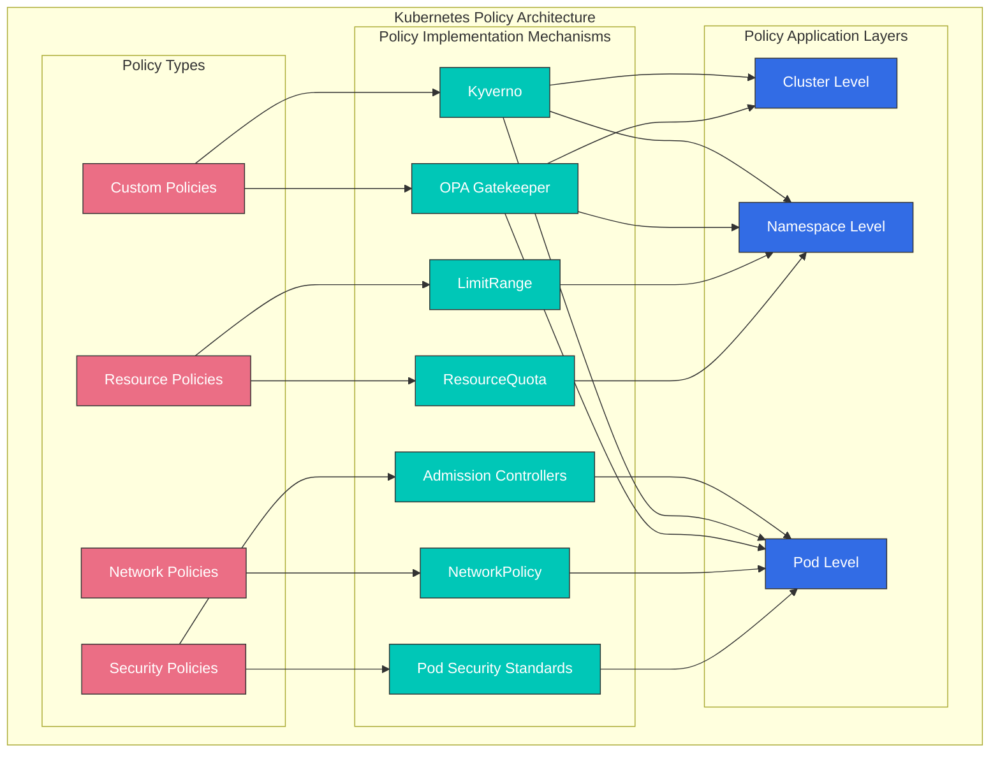
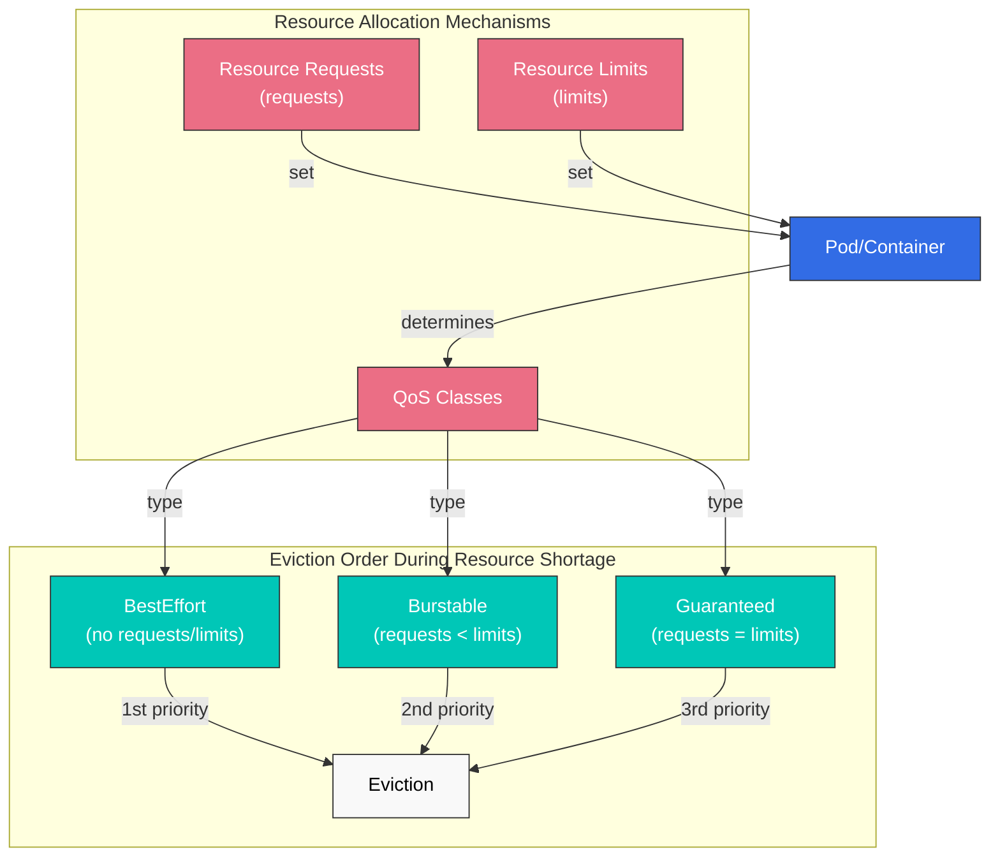
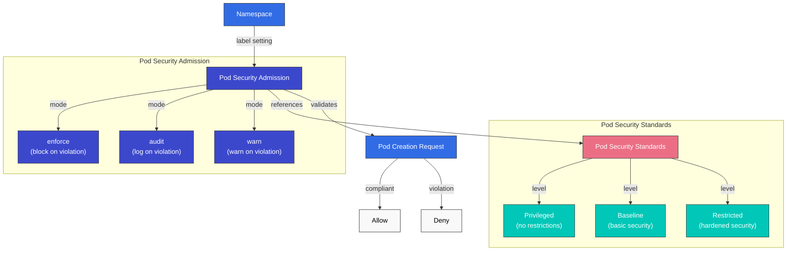
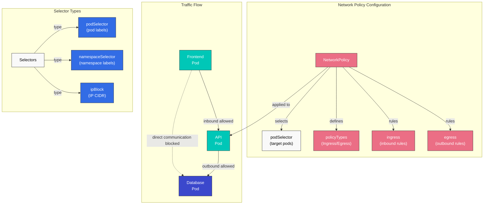
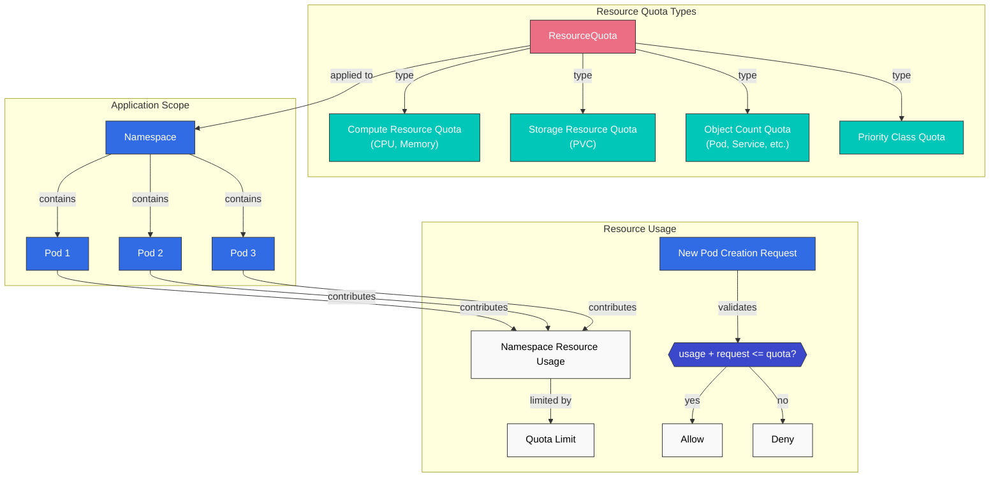
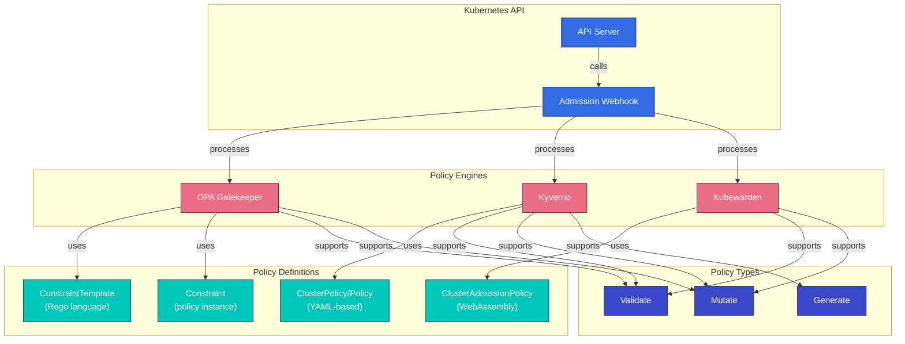
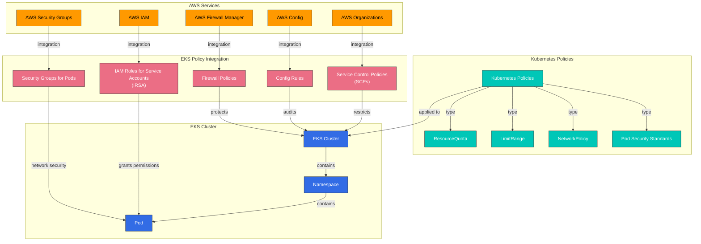

# Kubernetes Policies

> **Supported Versions**: Kubernetes 1.32 - 1.34
> **Last Updated**: November 24, 2025

In Kubernetes, policies are sets of rules that control and regulate the behavior of clusters and workloads. Through policies, you can manage various aspects such as security, resource usage, and network communication. In this chapter, we will learn about the different types of policies in Kubernetes, how to implement them, and policy management in Amazon EKS.

## Lab Environment Setup

To follow the examples in this document, you need the following tools and environment:

### Required Tools
- kubectl v1.34 or higher
- A working Kubernetes cluster (EKS, minikube, kind, etc.)
- Kyverno CLI (optional)
- OPA Gatekeeper (optional)

### Policy Example Setup

```bash
# Create namespace
kubectl create namespace policy-demo

# Create resource quota
kubectl -n policy-demo apply -f - <<EOF
apiVersion: v1
kind: ResourceQuota
metadata:
  name: demo-quota
spec:
  hard:
    requests.cpu: "1"
    requests.memory: 1Gi
    limits.cpu: "2"
    limits.memory: 2Gi
    pods: "10"
EOF

# Create network policy
kubectl -n policy-demo apply -f - <<EOF
apiVersion: networking.k8s.io/v1
kind: NetworkPolicy
metadata:
  name: default-deny
spec:
  podSelector: {}
  policyTypes:
  - Ingress
  - Egress
EOF

# Verify policies
kubectl -n policy-demo get resourcequota,networkpolicy
```

## Kubernetes Policy Architecture



## Policy Type Comparison

| Policy Type | Implementation Mechanism | Application Level | Primary Purpose | Kubernetes Version Support |
|------------|--------------------------|-------------------|-----------------|---------------------------|
| **Resource Policies** | ResourceQuota, LimitRange | Namespace | Resource usage limitation and management | All versions |
| **Security Policies** | Pod Security Standards, PodSecurityPolicy(deprecated) | Pod, Namespace | Security context restrictions | PSP: ~1.24, PSS: 1.22+ |
| **Network Policies** | NetworkPolicy | Pod | Network traffic control | 1.8+ |
| **Custom Policies** | OPA Gatekeeper, Kyverno | Cluster, Namespace, Pod | User-defined policy enforcement | All versions (add-ons) |

## Resource Policies

Resource policies are mechanisms for limiting and managing computing resources (CPU, memory, etc.) and object counts (pods, services, etc.) within a Kubernetes cluster.

### ResourceQuota

ResourceQuota limits the total amount of resources that can be used within a namespace.

```yaml
apiVersion: v1
kind: ResourceQuota
metadata:
  name: compute-resources
  namespace: dev
spec:
  hard:
    requests.cpu: "1"
    requests.memory: 1Gi
    limits.cpu: "2"
    limits.memory: 2Gi
    pods: "10"
    services: "5"
    persistentvolumeclaims: "5"
    secrets: "10"
    configmaps: "10"
```

### LimitRange

LimitRange sets default resource limits and requests for individual containers or pods within a namespace.

```yaml
apiVersion: v1
kind: LimitRange
metadata:
  name: limit-mem-cpu-per-container
  namespace: dev
spec:
  limits:
  - default:
      cpu: 500m
      memory: 512Mi
    defaultRequest:
      cpu: 100m
      memory: 256Mi
    max:
      cpu: "1"
      memory: 1Gi
    min:
      cpu: 50m
      memory: 128Mi
    type: Container
```

## Table of Contents
1. [Policy Overview](#policy-overview)
2. [Resource Allocation Policies](#resource-allocation-policies)
3. [Pod Security Policies](#pod-security-policies)
4. [Network Policies](#network-policies)
5. [Resource Quotas](#resource-quotas)
6. [LimitRange](#limitrange)
7. [Policy Engines](#policy-engines)
8. [Policy Management in Amazon EKS](#policy-management-in-amazon-eks)
9. [Policy Best Practices](#policy-best-practices)
10. [Conclusion](#conclusion)

## Policy Overview

Kubernetes policies provide a way for cluster administrators to define constraints on resources and workloads within the cluster. Policies are used for the following purposes:

1. **Security Enhancement**: Prevent unauthorized operations and apply security best practices
2. **Resource Management**: Limit resource usage and ensure fair resource distribution
3. **Compliance**: Ensure compliance with organizational policies and regulations
4. **Standardization**: Apply consistent configuration and deployment practices

Kubernetes can implement various types of policies through built-in resources (e.g., NetworkPolicy, ResourceQuota, LimitRange) or third-party policy engines (e.g., OPA Gatekeeper, Kyverno).

## Resource Allocation Policies

Resource allocation policies control the amount of resources such as CPU and memory that pods and containers can use.



### Resource Requests and Limits

You can manage resource usage by setting resource requests and limits for pods and containers:

```yaml
apiVersion: v1
kind: Pod
metadata:
  name: resource-demo
spec:
  containers:
  - name: resource-demo-container
    image: nginx
    resources:
      requests:
        memory: "64Mi"
        cpu: "250m"
      limits:
        memory: "128Mi"
        cpu: "500m"
```

- **requests**: The minimum amount of resources guaranteed for the container
- **limits**: The maximum amount of resources the container can use

Setting resource requests and limits provides the following benefits:

1. **Resource Guarantee**: Pods are guaranteed the minimum resources they need
2. **Resource Isolation**: Prevents one pod from monopolizing another pod's resources
3. **Efficient Scheduling**: The scheduler considers node resource capacity when placing pods

### QoS (Quality of Service) Classes

Kubernetes automatically assigns QoS classes based on pod resource request and limit settings:

1. **Guaranteed**: All containers have resource requests and limits set, and requests equal limits
2. **Burstable**: At least one container has resource requests set, but doesn't meet Guaranteed conditions
3. **BestEffort**: No containers have resource requests and limits set

QoS classes determine the pod eviction order during resource shortage:
1. BestEffort pods are evicted first
2. Burstable pods are evicted next
3. Guaranteed pods are evicted last

## Pod Security Policies

Pod Security Policy (PSP) was deprecated starting from Kubernetes 1.21 and completely removed in version 1.25. Instead, Pod Security Standards and Pod Security Admission have been introduced.



### Pod Security Standards

Pod Security Standards define three policy levels:

1. **Privileged**: No restrictions, all permissions allowed
2. **Baseline**: Blocks known privilege escalation paths
3. **Restricted**: Strongly hardened security policy

### Pod Security Admission

Pod Security Admission applies Pod Security Standards through namespace labels:

```yaml
apiVersion: v1
kind: Namespace
metadata:
  name: my-namespace
  labels:
    pod-security.kubernetes.io/enforce: restricted
    pod-security.kubernetes.io/audit: restricted
    pod-security.kubernetes.io/warn: restricted
```

Meaning of each label:
- **enforce**: Blocks pod creation that violates the policy
- **audit**: Records violations in audit logs
- **warn**: Displays warning messages for violations

## Network Policies

Network Policy provides a way to control communication between pods. By default, all pods in a Kubernetes cluster can communicate with each other, but network policies can restrict this.



```yaml
apiVersion: networking.k8s.io/v1
kind: NetworkPolicy
metadata:
  name: api-allow
  namespace: default
spec:
  podSelector:
    matchLabels:
      app: api
  policyTypes:
  - Ingress
  - Egress
  ingress:
  - from:
    - podSelector:
        matchLabels:
          app: frontend
    ports:
    - protocol: TCP
      port: 8080
  egress:
  - to:
    - podSelector:
        matchLabels:
          app: database
    ports:
    - protocol: TCP
      port: 5432
```

In the example above:
- Defines a network policy for pods with the `api` label
- Only allows inbound traffic from pods with the `frontend` label on port 8080
- Only allows outbound traffic to pods with the `database` label on port 5432

To use network policies, the cluster's network plugin must support network policies. CNI plugins such as Calico, Cilium, and Antrea support network policies.

### Network Policy Types

1. **Ingress Policy**: Controls traffic coming into the pod
2. **Egress Policy**: Controls traffic going out of the pod
3. **Ingress and Egress Policy**: Controls both directions of traffic

### Network Policy Selectors

Network policies can filter traffic through various selectors:

1. **podSelector**: Selects based on pod labels
2. **namespaceSelector**: Selects based on namespace labels
3. **ipBlock**: Selects based on IP CIDR ranges

```yaml
# Example combining multiple selectors
ingress:
- from:
  - podSelector:
      matchLabels:
        app: frontend
    namespaceSelector:
      matchLabels:
        env: prod
  - ipBlock:
      cidr: 172.17.0.0/16
      except:
      - 172.17.1.0/24
```

## Resource Quotas

ResourceQuota limits the total amount of resources that can be used within a namespace. This prevents one team from monopolizing all resources when multiple teams or projects share cluster resources.



```yaml
apiVersion: v1
kind: ResourceQuota
metadata:
  name: compute-resources
  namespace: team-a
spec:
  hard:
    pods: "10"
    requests.cpu: "4"
    requests.memory: 8Gi
    limits.cpu: "8"
    limits.memory: 16Gi
```

In the example above:
- The `team-a` namespace can create a maximum of 10 pods
- The sum of all pod CPU requests cannot exceed 4 cores
- The sum of all pod memory requests cannot exceed 8Gi
- The sum of all pod CPU limits cannot exceed 8 cores
- The sum of all pod memory limits cannot exceed 16Gi

### Object Count Quota

Resource quotas can also limit the number of objects that can be created within a namespace beyond CPU and memory:

```yaml
apiVersion: v1
kind: ResourceQuota
metadata:
  name: object-counts
  namespace: team-b
spec:
  hard:
    configmaps: "10"
    persistentvolumeclaims: "5"
    replicationcontrollers: "20"
    secrets: "10"
    services: "10"
    services.loadbalancers: "2"
```

### Priority Class Quota

You can also set quotas for pods of specific priority classes:

```yaml
apiVersion: v1
kind: ResourceQuota
metadata:
  name: priority-class-quota
  namespace: team-c
spec:
  hard:
    pods: "10"
    pods.high: "5"
    pods.medium: "3"
    pods.low: "2"
  scopeSelector:
    matchExpressions:
    - operator: In
      scopeName: PriorityClass
      values: ["high", "medium", "low"]
```

## LimitRange

LimitRange sets default resource limits and requests for individual resources (pods, containers, etc.) created within a namespace. This is applied when developers do not explicitly set resource requests and limits.

```yaml
apiVersion: v1
kind: LimitRange
metadata:
  name: cpu-limit-range
  namespace: default
spec:
  limits:
  - default:
      cpu: 1
      memory: 512Mi
    defaultRequest:
      cpu: 500m
      memory: 256Mi
    max:
      cpu: 2
      memory: 1Gi
    min:
      cpu: 100m
      memory: 128Mi
    type: Container
```

In the example above:
- **default**: Default limit applied when a container has no explicit limit
- **defaultRequest**: Default request applied when a container has no explicit request
- **max**: Maximum limit a container can set
- **min**: Minimum request a container can set

LimitRange can be applied to the following resource types:
- Container
- Pod
- PersistentVolumeClaim

## Policy Engines

The Kubernetes ecosystem has several policy engines that can implement more complex and flexible policies.



### OPA Gatekeeper

OPA (Open Policy Agent) Gatekeeper is an open-source project for defining and enforcing policies on Kubernetes clusters. Gatekeeper works as a Kubernetes admission controller that intercepts requests sent to the API server and applies policies.

Gatekeeper consists of the following components:

1. **ConstraintTemplate**: A template that defines the policy logic
2. **Constraint**: An instance of ConstraintTemplate that applies the policy to specific resources

```yaml
# ConstraintTemplate example
apiVersion: templates.gatekeeper.sh/v1beta1
kind: ConstraintTemplate
metadata:
  name: k8srequiredlabels
spec:
  crd:
    spec:
      names:
        kind: K8sRequiredLabels
      validation:
        openAPIV3Schema:
          properties:
            labels:
              type: array
              items: string
  targets:
    - target: admission.k8s.gatekeeper.sh
      rego: |
        package k8srequiredlabels
        violation[{"msg": msg, "details": {"missing_labels": missing}}] {
          provided := {label | input.review.object.metadata.labels[label]}
          required := {label | label := input.parameters.labels[_]}
          missing := required - provided
          count(missing) > 0
          msg := sprintf("missing required labels: %v", [missing])
        }
```

```yaml
# Constraint example
apiVersion: constraints.gatekeeper.sh/v1beta1
kind: K8sRequiredLabels
metadata:
  name: require-app-label
spec:
  match:
    kinds:
      - apiGroups: [""]
        kinds: ["Pod"]
  parameters:
    labels: ["app", "owner"]
```

### Kyverno

Kyverno is a Kubernetes-native policy engine that can validate, mutate, and generate Kubernetes resources using YAML-based policies. You can write policies with syntax similar to Kubernetes resources without needing to learn the Rego language.

```yaml
# Kyverno policy example
apiVersion: kyverno.io/v1
kind: ClusterPolicy
metadata:
  name: require-labels
spec:
  validationFailureAction: enforce
  rules:
  - name: check-for-labels
    match:
      resources:
        kinds:
        - Pod
    validate:
      message: "The labels 'app' and 'owner' are required."
      pattern:
        metadata:
          labels:
            app: "?*"
            owner: "?*"
```

Kyverno supports the following policy types:

1. **Validate**: Validates that resources meet specific conditions
2. **Mutate**: Automatically modifies resources
3. **Generate**: Automatically creates other resources when a resource is created
4. **Verify Images**: Validates image signatures
5. **Clean Up**: Automatically cleans up related resources when a resource is deleted

### Kubewarden

Kubewarden is a WebAssembly-based policy engine that allows writing policies in various programming languages. Policies are compiled into WebAssembly modules and run on the Kubewarden policy server.

```yaml
# Kubewarden policy example
apiVersion: policies.kubewarden.io/v1alpha2
kind: ClusterAdmissionPolicy
metadata:
  name: require-labels
spec:
  module: registry://ghcr.io/kubewarden/policies/require-labels:v0.1.0
  rules:
  - apiGroups: [""]
    apiVersions: ["v1"]
    resources: ["pods"]
    operations:
    - CREATE
    - UPDATE
  settings:
    required_labels:
      - app
      - owner
```

## Policy Management in Amazon EKS

In Amazon EKS, you can manage policies using Kubernetes' default policy mechanisms along with various AWS services.



### Integration with AWS IAM

Amazon EKS can grant permissions to pods for AWS services through IAM Roles for Service Accounts (IRSA). This allows applying the principle of least privilege.

```bash
# Create OIDC provider
eksctl utils associate-iam-oidc-provider --cluster my-cluster --approve

# Create IAM role and link to service account
eksctl create iamserviceaccount \
  --name my-service-account \
  --namespace default \
  --cluster my-cluster \
  --attach-policy-arn arn:aws:iam::aws:policy/AmazonS3ReadOnlyAccess \
  --approve
```

### AWS Security Groups for Pods

Amazon EKS provides the ability to apply AWS security groups at the pod level. This allows for more fine-grained control of communication between pods.

```yaml
apiVersion: vpcresources.k8s.aws/v1beta1
kind: SecurityGroupPolicy
metadata:
  name: allow-db-access
  namespace: default
spec:
  podSelector:
    matchLabels:
      app: web
  securityGroups:
    groupIds:
      - sg-12345
```

### AWS Config and AWS Organizations

You can apply organization-level policies to EKS clusters using AWS Config and AWS Organizations. For example, you can restrict the creation of EKS clusters without specific tags.

```json
{
  "Version": "2012-10-17",
  "Statement": [
    {
      "Effect": "Deny",
      "Action": "eks:CreateCluster",
      "Resource": "*",
      "Condition": {
        "Null": {
          "aws:RequestTag/Environment": "true"
        }
      }
    }
  ]
}
```

### AWS Firewall Manager

You can use AWS Firewall Manager to centrally manage network policies for multiple EKS clusters. This allows applying consistent security policies across the organization.

## Policy Best Practices

Here are best practices for effectively managing policies in Kubernetes clusters.

### Policy Design

1. **Principle of Least Privilege**: Design policies that grant only the minimum necessary permissions.
2. **Gradual Application**: Don't apply all policies at once; apply them gradually to minimize impact.
3. **Audit Mode**: Run policies in audit mode before enforcement to evaluate impact.
4. **Clear Documentation**: Clearly document the purpose and impact of each policy.

### Resource Management

1. **Namespace Isolation**: Separate namespaces by team or project and set appropriate resource quotas for each namespace.
2. **Default Limits**: Use LimitRange to set default resource limits for all containers.
3. **QoS Class Consideration**: Set appropriate QoS classes based on workload importance.

### Network Security

1. **Default Deny Policy**: Set policies that deny all traffic by default and explicitly allow only necessary communication.
2. **Granular Policies**: Set network policies that finely control communication between pods.
3. **Regular Review**: Regularly review and update network policies.

### Policy Automation

1. **CI/CD Integration**: Integrate policy validation into CI/CD pipelines to detect policy violations before deployment.
2. **Policy Testing**: Test policies in a test environment first, then apply to production when there are no issues.
3. **Policy Version Control**: Manage policies as code and use version control systems to track changes.

## Conclusion

Kubernetes policies are powerful tools for controlling security, resource usage, and network communication for clusters and workloads. You can build a policy framework tailored to your organization's requirements by combining built-in policy mechanisms (ResourceQuota, LimitRange, NetworkPolicy, etc.) with third-party policy engines (OPA Gatekeeper, Kyverno, etc.).

When using Amazon EKS, you can further strengthen policy management by leveraging various AWS services (IAM, Security Groups, AWS Config, AWS Organizations, AWS Firewall Manager, etc.). Through integrating these services, you can effectively manage security, compliance, and resource management for clusters and workloads.

Policies are a continuously evolving area, so it's important to regularly review and update policies to respond to new threats and requirements. Additionally, managing policies as code and automating them is recommended to improve consistency and efficiency.

## Quiz

To test what you learned in this chapter, try the [Policies Quiz](../quizzes/core/07-policies-quiz.md).

## References

- [Kubernetes Official Documentation - Resource Quotas](https://kubernetes.io/docs/concepts/policy/resource-quotas/)
- [Kubernetes Official Documentation - LimitRange](https://kubernetes.io/docs/concepts/policy/limit-range/)
- [Kubernetes Official Documentation - Network Policies](https://kubernetes.io/docs/concepts/services-networking/network-policies/)
- [Kubernetes Official Documentation - Pod Security Standards](https://kubernetes.io/docs/concepts/security/pod-security-standards/)
- [Kubernetes Official Documentation - Pod Security Admission](https://kubernetes.io/docs/concepts/security/pod-security-admission/)
- [OPA Gatekeeper Official Documentation](https://open-policy-agent.github.io/gatekeeper/website/docs/)
- [Kyverno Official Documentation](https://kyverno.io/docs/)
- [Kubewarden Official Documentation](https://docs.kubewarden.io/)
- [Amazon EKS Official Documentation - IAM Roles for Service Accounts](https://docs.aws.amazon.com/eks/latest/userguide/iam-roles-for-service-accounts.html)
- [Amazon EKS Official Documentation - Security Groups for Pods](https://docs.aws.amazon.com/eks/latest/userguide/security-groups-for-pods.html)
- [AWS Config Official Documentation](https://docs.aws.amazon.com/config/latest/developerguide/WhatIsConfig.html)
- [AWS Organizations Official Documentation](https://docs.aws.amazon.com/organizations/latest/userguide/orgs_introduction.html)
- [AWS Firewall Manager Official Documentation](https://docs.aws.amazon.com/waf/latest/developerguide/fms-chapter.html)
