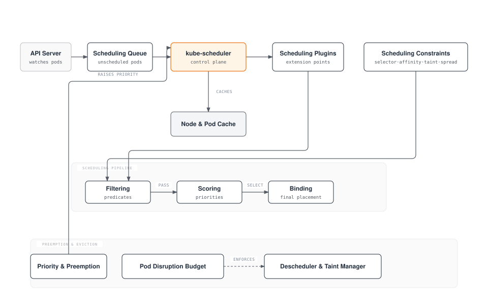
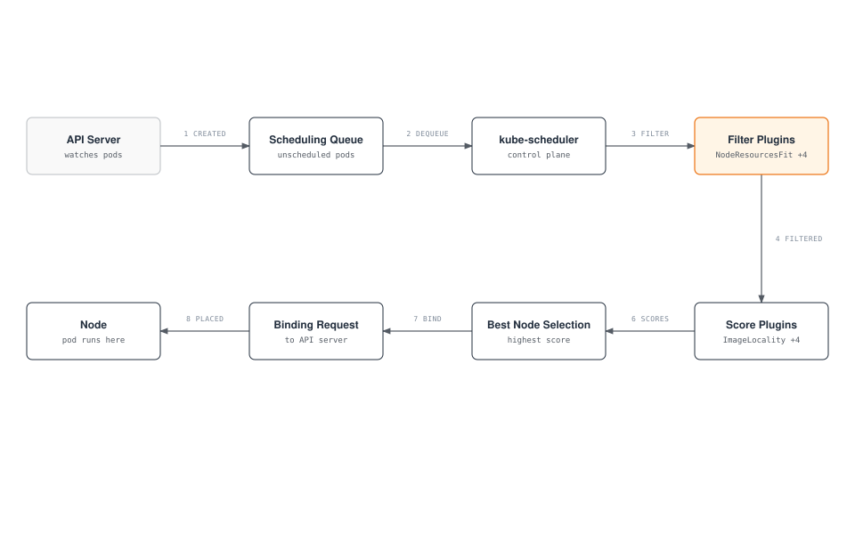
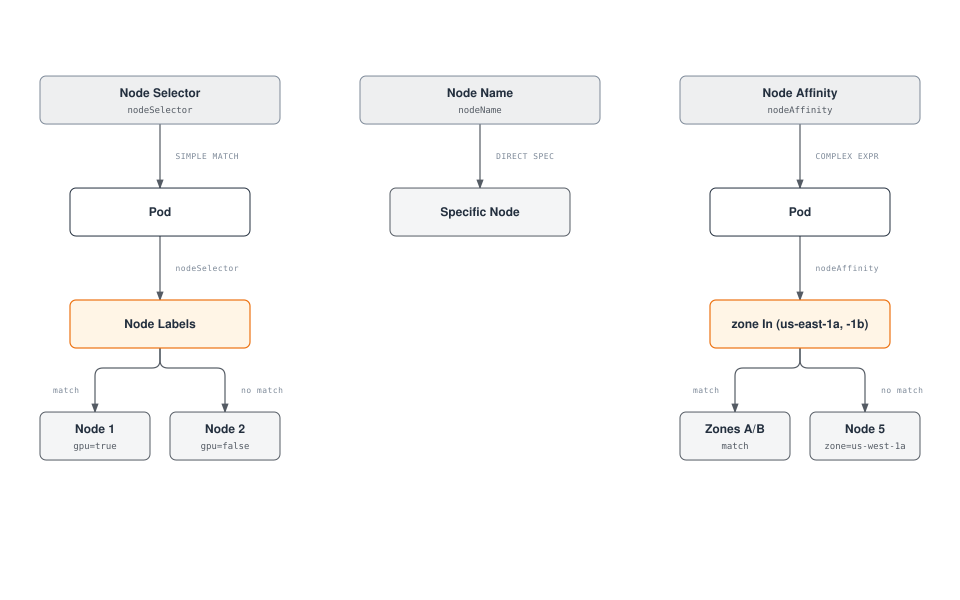
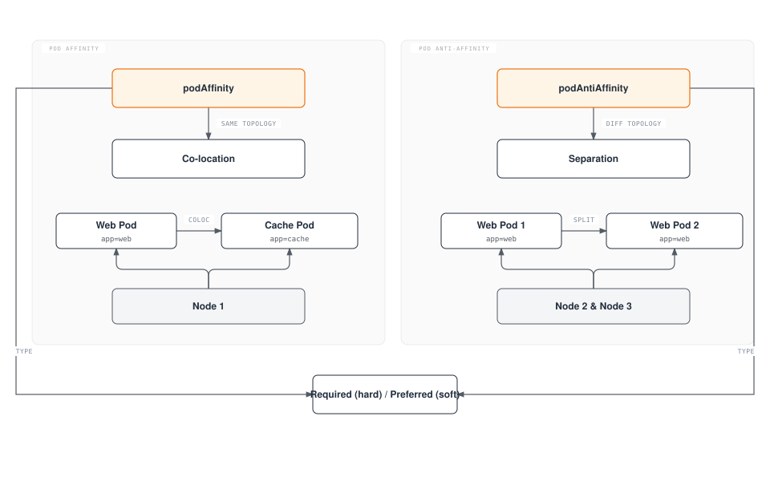
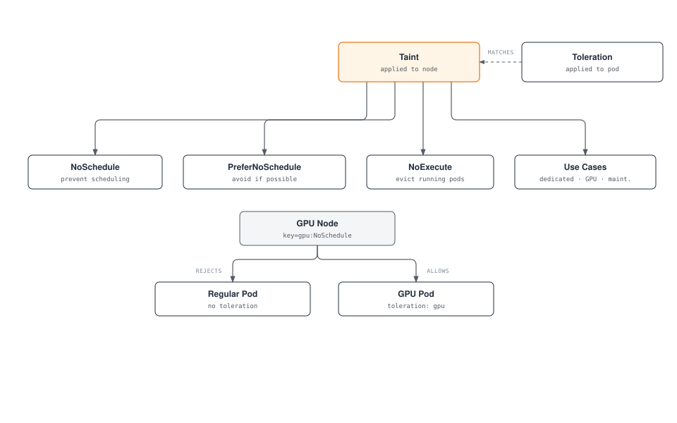
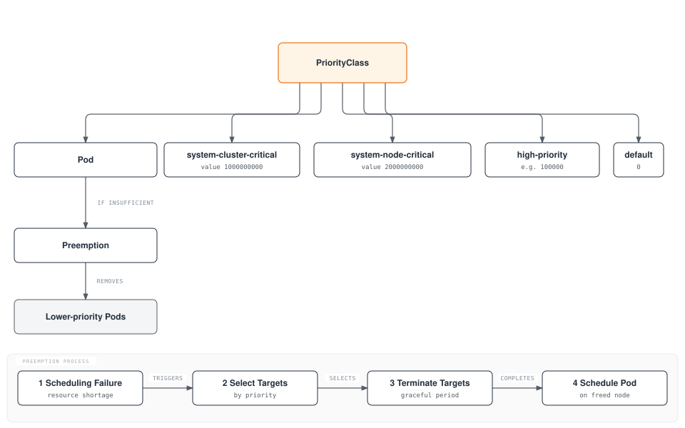
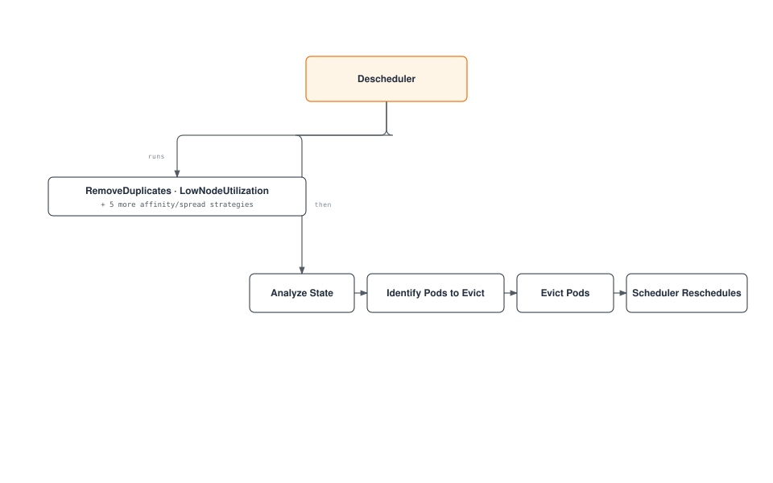
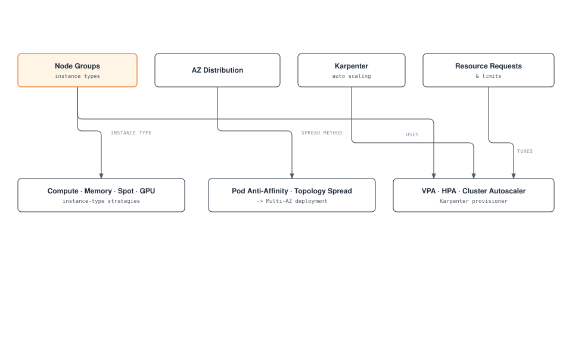

# Kubernetes Scheduling, Preemption, and Eviction

> **Supported Versions**: Kubernetes 1.32 - 1.34
> **Last Updated**: February 22, 2026

In Kubernetes, scheduling is the process of placing pods on appropriate nodes. Preemption is the process of removing lower-priority pods to make room for higher-priority pods, and eviction is the process of safely moving pods when node issues occur. In this chapter, we will learn about Kubernetes scheduling mechanisms, node selection, preemption, eviction, and scheduling optimization methods in Amazon EKS.

## Lab Environment Setup

To follow the examples in this document, you need the following tools and environment:

### Required Tools
- kubectl v1.34 or higher
- A working Kubernetes cluster (EKS, minikube, kind, etc.)
- A cluster with multiple nodes (for scheduling tests)

### Scheduling Example Setup

```bash
# Create namespace
kubectl create namespace scheduling-demo

# Add labels to nodes (if you have multiple nodes)
kubectl label nodes <node-name> disktype=ssd
kubectl label nodes <node-name> gpu=true

# Create a pod using node affinity
kubectl -n scheduling-demo apply -f - <<EOF
apiVersion: v1
kind: Pod
metadata:
  name: nginx-ssd
spec:
  affinity:
    nodeAffinity:
      requiredDuringSchedulingIgnoredDuringExecution:
        nodeSelectorTerms:
        - matchExpressions:
          - key: disktype
            operator: In
            values:
            - ssd
  containers:
  - name: nginx
    image: nginx
EOF

# Create priority class
kubectl apply -f - <<EOF
apiVersion: scheduling.k8s.io/v1
kind: PriorityClass
metadata:
  name: high-priority
value: 1000000
globalDefault: false
description: "This priority class should be used for critical service pods only."
EOF

# Create Pod Disruption Budget (PDB)
kubectl -n scheduling-demo apply -f - <<EOF
apiVersion: policy/v1
kind: PodDisruptionBudget
metadata:
  name: nginx-pdb
spec:
  minAvailable: 1
  selector:
    matchLabels:
      app: nginx
EOF
```

## Kubernetes Scheduling Architecture



## Scheduling Concept Comparison

| Concept | Purpose | Use Cases | Kubernetes Version |
|---------|---------|-----------|-------------------|
| **Node Selector** | Place pods on nodes with specific labels | Simple node selection | All versions |
| **Node Affinity** | Define complex node selection rules | Advanced node selection | 1.6+ |
| **Pod Affinity** | Place pods close to other pods | Co-locating related services | 1.6+ |
| **Pod Anti-Affinity** | Place pods away from other pods | Ensuring high availability | 1.6+ |
| **Taints and Tolerations** | Allow only specific pods on nodes | Dedicated nodes, node isolation | 1.6+ |
| **Topology Spread Constraints** | Spread pods across topology domains | Distribution across availability zones | 1.16+ (GA in 1.19) |
| **Priority and Preemption** | Prioritize important workloads | Critical service guarantees | 1.8+ (GA in 1.11) |
| **Pod Disruption Budget** | Limit simultaneously disrupted pods | Ensuring high availability | 1.4+ (GA in 1.21) |

## Basic Scheduling Concepts

> **Key Concept**: The Kubernetes scheduler is a control plane component that selects the optimal node to run pods, operating in two phases: filtering and scoring.

### Scheduling Process

1. **Filtering Phase (Predicates)**
   - Identifies a suitable set of nodes that can run the pod
   - Considers resource requirements, node selectors, affinity rules, taints/tolerations, etc.
   - Excludes a node if any condition is not met

2. **Scoring Phase (Priorities)**
   - Assigns scores to nodes that passed filtering
   - Considers resource utilization, pod distribution, affinity preferences, etc.
   - Selects the node with the highest score

3. **Binding Phase**
   - Assigns the pod to the selected node
   - Updates binding information to the API server

## Table of Contents
1. [Scheduling Overview](#scheduling-overview)
2. [How the Scheduler Works](#how-the-scheduler-works)
3. [Node Selection](#node-selection)
4. [Pod Affinity and Anti-Affinity](#pod-affinity-and-anti-affinity)
5. [Taints and Tolerations](#taints-and-tolerations)
6. [Node Affinity](#node-affinity)
7. [Pod Priority and Preemption](#pod-priority-and-preemption)
8. [Pod Eviction](#pod-eviction)
9. [Pod Disruption Budget (PDB)](#pod-disruption-budget-pdb)
10. [Node Pressure Eviction](#node-pressure-eviction)
11. [TopologySpreadConstraints](#topologyspreadconstraints)
12. [Pod Deletion Cost](#pod-deletion-cost)
13. [Descheduler](#descheduler)
14. [Scheduling Optimization in Amazon EKS](#scheduling-optimization-in-amazon-eks)
15. [Scheduling Best Practices](#scheduling-best-practices)
16. [Conclusion](#conclusion)

## Scheduling Overview

The Kubernetes scheduler is a control plane component that places pods on appropriate nodes. The scheduler considers various factors to determine the optimal node to place pods:

1. **Resource Requirements**: CPU, memory, and other resources requested by the pod
2. **Hardware/Software/Policy Constraints**: Node selectors, node affinity, taints, etc.
3. **Affinity/Anti-Affinity Specifications**: Placement relationships with other pods
4. **Data Locality**: Placing pods close to data
5. **Inter-Workload Interference**: Minimizing interference between different workloads
6. **Deadlines**: Considering time-constrained workloads

### Scheduling Process

The scheduling process is broadly divided into two phases:

1. **Filtering**: Identifies a set of nodes that can run the pod
   - Checks whether resource requirements are met
   - Checks constraints such as node selectors, affinity, taints

2. **Scoring**: Scores filtered nodes to select the optimal node
   - Resource utilization balance
   - Inter-pod affinity/anti-affinity
   - Data locality
   - Taints/tolerations

## How the Scheduler Works

The Kubernetes scheduler operates through the following process:



1. **Pod Queue Watching**: The scheduler watches the API server for unscheduled pods.
2. **Node Filtering**: Identifies a set of nodes that can run the pod.
3. **Node Scoring**: Scores the filtered nodes.
4. **Node Selection**: Selects the node with the highest score.
5. **Binding**: Binds the pod to the selected node.

### Scheduling Plugins

The Kubernetes scheduler is designed to be extensible using a plugin architecture. Various plugins operate at different stages of the scheduling process:

1. **Filter Plugins**: Filter out nodes where the pod cannot run
   - NodeResourcesFit: Checks node resource capacity
   - NodeName: Checks the pod's nodeName field
   - NodeUnschedulable: Checks node schedulability
   - TaintToleration: Checks taints and tolerations

2. **Score Plugins**: Assign scores to nodes
   - NodeResourcesBalancedAllocation: Considers resource usage balance
   - ImageLocality: Considers image locality
   - InterPodAffinity: Considers inter-pod affinity
   - NodeAffinity: Considers node affinity

### Multiple Schedulers

Kubernetes can run multiple schedulers simultaneously. This allows implementing custom scheduling logic for specific workloads.

```yaml
apiVersion: v1
kind: Pod
metadata:
  name: custom-scheduled-pod
spec:
  schedulerName: my-custom-scheduler
  containers:
  - name: container
    image: nginx
```

In the example above, the `schedulerName` field specifies the scheduler to schedule the pod.

## Node Selection

Kubernetes provides several mechanisms to place pods on specific nodes.



### Node Selector

Node selector is the simplest way to restrict pods to only be placed on nodes with specific labels.

```yaml
apiVersion: v1
kind: Pod
metadata:
  name: gpu-pod
spec:
  nodeSelector:
    gpu: "true"
  containers:
  - name: gpu-container
    image: nvidia/cuda
```

In the example above, the pod is only placed on nodes with the `gpu=true` label.

### nodeName

You can use the `nodeName` field to directly place a pod on a specific node. This method bypasses the scheduler and is generally not recommended.

```yaml
apiVersion: v1
kind: Pod
metadata:
  name: specific-node-pod
spec:
  nodeName: worker-node-1
  containers:
  - name: container
    image: nginx
```

In the example above, the pod is directly placed on the node named `worker-node-1`.

## Pod Affinity and Anti-Affinity

Pod affinity and anti-affinity provide ways to place pods based on relationships between pods.



### Pod Affinity

Pod affinity causes pods to be placed on the same node or topology domain as pods with specific labels.

```yaml
apiVersion: v1
kind: Pod
metadata:
  name: frontend
spec:
  affinity:
    podAffinity:
      requiredDuringSchedulingIgnoredDuringExecution:
      - labelSelector:
          matchExpressions:
          - key: app
            operator: In
            values:
            - cache
        topologyKey: kubernetes.io/hostname
  containers:
  - name: frontend
    image: nginx
```

In the example above, the `frontend` pod is placed on the same host as pods with the `app=cache` label.

### Pod Anti-Affinity

Pod anti-affinity causes pods to be placed on a different node or topology domain than pods with specific labels.

```yaml
apiVersion: v1
kind: Pod
metadata:
  name: frontend
  labels:
    app: frontend
spec:
  affinity:
    podAntiAffinity:
      requiredDuringSchedulingIgnoredDuringExecution:
      - labelSelector:
          matchExpressions:
          - key: app
            operator: In
            values:
            - frontend
        topologyKey: kubernetes.io/hostname
  containers:
  - name: frontend
    image: nginx
```

In the example above, the `frontend` pod is placed on a different host than other pods with the `app=frontend` label. This is useful for distributing instances of the same application across multiple nodes for high availability.

### Affinity Types

Pod affinity and anti-affinity have two types:

1. **requiredDuringSchedulingIgnoredDuringExecution**: Hard requirement that must be met during scheduling
2. **preferredDuringSchedulingIgnoredDuringExecution**: Soft requirement that is preferred but not required

```yaml
# preferredDuringSchedulingIgnoredDuringExecution example
affinity:
  podAffinity:
    preferredDuringSchedulingIgnoredDuringExecution:
    - weight: 100
      podAffinityTerm:
        labelSelector:
          matchExpressions:
          - key: app
            operator: In
            values:
            - cache
        topologyKey: kubernetes.io/hostname
```

In the example above, the `weight` field indicates the weight of this preference. When there are multiple preferences, the higher weight preferences are considered more important.

## Taints and Tolerations

Taints and tolerations are mechanisms that allow nodes to reject specific pods.



### Taints

Taints are applied to nodes to restrict pods from being scheduled on them.

```bash
# Add taint to node
kubectl taint nodes node1 key=value:NoSchedule
```

There are three taint effects:

1. **NoSchedule**: Pods without tolerations are not scheduled on the node
2. **PreferNoSchedule**: Prefer not to schedule pods without tolerations on the node
3. **NoExecute**: Pods without tolerations are evicted from the node

### Tolerations

Tolerations are applied to pods to allow them to be scheduled on nodes with taints.

```yaml
apiVersion: v1
kind: Pod
metadata:
  name: nginx
spec:
  tolerations:
  - key: "key"
    operator: "Equal"
    value: "value"
    effect: "NoSchedule"
  containers:
  - name: nginx
    image: nginx
```

In the example above, the pod can be scheduled on nodes with the `key=value:NoSchedule` taint.

### Use Cases

Common use cases for taints and tolerations:

1. **Dedicated Nodes**: Designate nodes to run only specific workloads
2. **Special Hardware**: Manage nodes with special hardware like GPUs
3. **Node Maintenance**: Prevent new pod scheduling on nodes under maintenance
4. **Node Issues**: Evict pods from nodes with issues

### Default Taints

Kubernetes applies default taints to some nodes:

- **node.kubernetes.io/not-ready**: Node is not ready
- **node.kubernetes.io/unreachable**: Node is unreachable
- **node.kubernetes.io/memory-pressure**: Node has memory pressure
- **node.kubernetes.io/disk-pressure**: Node has disk pressure
- **node.kubernetes.io/pid-pressure**: Node has PID pressure
- **node.kubernetes.io/network-unavailable**: Node network is unavailable
- **node.kubernetes.io/unschedulable**: Node is unschedulable

## Node Affinity

Node affinity provides a more expressive way to place pods on specific sets of nodes. It allows specifying more complex conditions than node selector.

### Node Affinity Types

Node affinity has two types:

1. **requiredDuringSchedulingIgnoredDuringExecution**: Hard requirement that must be met during scheduling
2. **preferredDuringSchedulingIgnoredDuringExecution**: Soft requirement that is preferred but not required

```yaml
apiVersion: v1
kind: Pod
metadata:
  name: with-node-affinity
spec:
  affinity:
    nodeAffinity:
      requiredDuringSchedulingIgnoredDuringExecution:
        nodeSelectorTerms:
        - matchExpressions:
          - key: kubernetes.io/e2e-az-name
            operator: In
            values:
            - e2e-az1
            - e2e-az2
      preferredDuringSchedulingIgnoredDuringExecution:
      - weight: 1
        preference:
          matchExpressions:
          - key: another-node-label-key
            operator: In
            values:
            - another-node-label-value
  containers:
  - name: with-node-affinity
    image: nginx
```

In the example above, the pod is only placed on nodes where the `kubernetes.io/e2e-az-name` label is `e2e-az1` or `e2e-az2`. Additionally, it is preferably placed on nodes with the `another-node-label-key=another-node-label-value` label.

### Operators

Node affinity supports various operators:

- **In**: Label value matches one of the specified values
- **NotIn**: Label value does not match the specified values
- **Exists**: A label with the specified key exists
- **DoesNotExist**: A label with the specified key does not exist
- **Gt**: Label value is greater than the specified value
- **Lt**: Label value is less than the specified value

## Pod Priority and Preemption

Kubernetes provides pod priority and preemption features to ensure important workloads can secure cluster resources.



### PriorityClass

PriorityClass defines the relative importance of pods. The higher the priority value, the more important the pod.

```yaml
apiVersion: scheduling.k8s.io/v1
kind: PriorityClass
metadata:
  name: high-priority
value: 1000000
globalDefault: false
description: "This priority class should be used for critical workloads."
```

In the example above, the `value` field indicates the priority value. The higher the value, the higher the priority. If the `globalDefault` field is set to `true`, this priority class is applied to pods without a specified priority class.

### Applying PriorityClass to Pods

To apply a priority class to a pod, use the `priorityClassName` field.

```yaml
apiVersion: v1
kind: Pod
metadata:
  name: high-priority-pod
spec:
  priorityClassName: high-priority
  containers:
  - name: container
    image: nginx
```

### Preemption

Preemption is the process of removing lower-priority pods to schedule higher-priority pods. When the scheduler cannot find a node to schedule a higher-priority pod, it preempts lower-priority pods to secure resources.

Preemption process:
1. Scheduler cannot find a node to schedule a higher-priority pod
2. Scheduler selects a node to remove lower-priority pods through preemption
3. Sends termination signal to lower-priority pods on the selected node
4. When pods terminate gracefully, schedules the higher-priority pod on that node

### Preemption Considerations

Things to consider when using preemption:

1. **Graceful Termination Period**: Preempted pods go through the graceful termination process for the time specified in `terminationGracePeriodSeconds`
2. **PodDisruptionBudget**: Preemption does not respect PodDisruptionBudget
3. **System Priority Classes**: Kubernetes provides priority classes for system components
   - `system-cluster-critical`: Pods critical for cluster operation
   - `system-node-critical`: Pods critical for node operation

## Pod Eviction

Pod eviction is the process of safely moving pods when node issues occur. Eviction can happen for various reasons.


### Eviction Types

1. **Eviction by kube-controller-manager**:
   - When a node remains in NotReady state for the `pod-eviction-timeout` period (default 5 minutes)
   - When a node is in Unreachable state

2. **Eviction by kubelet**:
   - Node resource shortage (memory, disk, etc.)
   - Hardware issues

3. **Eviction by user**:
   - Executing `kubectl drain` command
   - Node maintenance tasks

### kubelet Eviction Signals

kubelet monitors the following eviction signals:

1. **memory.available**: Available memory
2. **nodefs.available**: Available space in the node file system
3. **nodefs.inodesFree**: Available inodes in the node file system
4. **imagefs.available**: Available space in the image file system
5. **imagefs.inodesFree**: Available inodes in the image file system
6. **pid.available**: Available process IDs

Soft and hard thresholds can be set for each signal:

- **Soft Threshold**: Evict pods after `grace-period` when threshold is exceeded
- **Hard Threshold**: Evict pods immediately when threshold is exceeded

```yaml
# kubelet configuration example
evictionHard:
  memory.available: "100Mi"
  nodefs.available: "10%"
  nodefs.inodesFree: "5%"
  imagefs.available: "15%"
evictionSoft:
  memory.available: "200Mi"
  nodefs.available: "15%"
evictionSoftGracePeriod:
  memory.available: "1m"
  nodefs.available: "2m"
evictionPressureTransitionPeriod: "30s"
```

### Eviction Priority

kubelet evicts pods in the following order:

1. Pods with BestEffort QoS class
2. Pods with Burstable QoS class (starting with pods whose resource usage exceeds requests)
3. Pods with Guaranteed QoS class (pods with equal requests and limits)

## Pod Disruption Budget (PDB)

Pod Disruption Budget (PDB) is a way to maintain application availability during voluntary disruptions. PDB limits the number of pods that can be simultaneously disrupted.


### PDB Definition

```yaml
apiVersion: policy/v1
kind: PodDisruptionBudget
metadata:
  name: frontend-pdb
spec:
  minAvailable: 2
  selector:
    matchLabels:
      app: frontend
```

or

```yaml
apiVersion: policy/v1
kind: PodDisruptionBudget
metadata:
  name: frontend-pdb
spec:
  maxUnavailable: 1
  selector:
    matchLabels:
      app: frontend
```

In the examples above:
- `minAvailable`: Minimum number of pods that must always be available
- `maxUnavailable`: Maximum number of pods that can be unavailable at the same time
- `selector`: Label selector that selects pods to which the PDB applies

### PDB Operation

1. When voluntary disruptions like node drain occur, Kubernetes checks the PDB
2. If PDB conditions are met, proceed with pod eviction
3. If PDB conditions are not met, deny pod eviction

### PDB Best Practices

1. **Set PDB for all critical workloads**: Set PDB for all workloads requiring high availability
2. **Choose appropriate values**: Select `minAvailable` or `maxUnavailable` values appropriate for workload characteristics
3. **Consider replica count**: PDB value must be less than replica count
4. **Regular testing**: Test PDB operation through node drain and similar tasks

## Node Pressure Eviction

Node pressure eviction is a mechanism where pods are evicted due to node resource shortage.

### Node Condition Status

kubelet reports the following node condition statuses:

1. **MemoryPressure**: Node is low on memory
2. **DiskPressure**: Node is low on disk space
3. **PIDPressure**: Node is low on process IDs

When these conditions occur, kubelet evicts pods to secure resources.

### Eviction Policy Configuration

Eviction policies can be set in kubelet configuration:

```yaml
# kubelet configuration example
evictionHard:
  memory.available: "100Mi"
  nodefs.available: "10%"
  nodefs.inodesFree: "5%"
  imagefs.available: "15%"
evictionSoft:
  memory.available: "200Mi"
  nodefs.available: "15%"
evictionSoftGracePeriod:
  memory.available: "1m"
  nodefs.available: "2m"
evictionMinimumReclaim:
  memory.available: "50Mi"
  nodefs.available: "5%"
evictionPressureTransitionPeriod: "30s"
```

In the example above:
- `evictionMinimumReclaim`: Minimum resources that must be reclaimed after eviction
- `evictionPressureTransitionPeriod`: Wait time between pressure state transitions

## TopologySpreadConstraints

TopologySpreadConstraints provide fine-grained control over how pods are distributed across topology domains such as availability zones, nodes, or regions. This feature offers more flexibility than Pod anti-affinity for achieving high availability and efficient resource utilization.


### Key Fields

| Field | Description | Required |
|-------|-------------|----------|
| **maxSkew** | Maximum allowed difference in pod count between any two topology domains | Yes |
| **topologyKey** | Node label key that defines topology domains | Yes |
| **whenUnsatisfiable** | Action when constraints cannot be satisfied: `DoNotSchedule` or `ScheduleAnyway` | Yes |
| **labelSelector** | Selects which pods to count for spread calculation | Yes |
| **minDomains** | Minimum number of topology domains required (1.27+) | No |
| **matchLabelKeys** | Pod label keys to match for spread calculation (1.27+) | No |

### whenUnsatisfiable Options

- **DoNotSchedule**: Scheduler will not schedule the pod if the constraint cannot be satisfied (hard constraint)
- **ScheduleAnyway**: Scheduler still schedules the pod, giving higher priority to nodes that minimize skew (soft constraint)

### EKS Availability Zone Spread Example

```yaml
apiVersion: apps/v1
kind: Deployment
metadata:
  name: web-app
spec:
  replicas: 6
  selector:
    matchLabels:
      app: web
  template:
    metadata:
      labels:
        app: web
    spec:
      topologySpreadConstraints:
      - maxSkew: 1
        topologyKey: topology.kubernetes.io/zone
        whenUnsatisfiable: DoNotSchedule
        labelSelector:
          matchLabels:
            app: web
      - maxSkew: 1
        topologyKey: kubernetes.io/hostname
        whenUnsatisfiable: ScheduleAnyway
        labelSelector:
          matchLabels:
            app: web
      containers:
      - name: web
        image: nginx:1.25
        resources:
          requests:
            cpu: 100m
            memory: 128Mi
```

This configuration ensures:
1. Pods are evenly distributed across availability zones (hard constraint)
2. Pods are preferably distributed across nodes within each zone (soft constraint)

### minDomains and matchLabelKeys (Kubernetes 1.27+)

```yaml
apiVersion: apps/v1
kind: Deployment
metadata:
  name: app-with-min-domains
spec:
  replicas: 4
  selector:
    matchLabels:
      app: distributed-app
  template:
    metadata:
      labels:
        app: distributed-app
        version: v1
    spec:
      topologySpreadConstraints:
      - maxSkew: 1
        topologyKey: topology.kubernetes.io/zone
        whenUnsatisfiable: DoNotSchedule
        labelSelector:
          matchLabels:
            app: distributed-app
        minDomains: 3
        matchLabelKeys:
        - version
      containers:
      - name: app
        image: myapp:v1
```

- **minDomains**: Ensures pods are spread across at least 3 zones. If fewer zones are available, scheduling is blocked.
- **matchLabelKeys**: Automatically uses the pod's `version` label value in the selector, enabling per-revision spread without modifying the selector.

### Advantages Over Pod Anti-Affinity

| Aspect | TopologySpreadConstraints | Pod Anti-Affinity |
|--------|---------------------------|-------------------|
| **Flexibility** | Allows controlled skew (maxSkew > 1) | Binary: either same or different domain |
| **Soft constraints** | `ScheduleAnyway` for best-effort | `preferredDuringScheduling` but less control |
| **Multi-level** | Multiple constraints with different topologyKeys | Requires complex nested rules |
| **Performance** | Better scheduler performance at scale | Can slow scheduling with many pods |
| **Use case** | Even distribution with tolerance | Strict separation |

## Pod Deletion Cost

Pod Deletion Cost is a feature that allows you to control which pods are removed first during scale-down operations. By setting the `controller.kubernetes.io/pod-deletion-cost` annotation, you can influence the order in which pods are terminated.

### How It Works

When a controller (like HPA or manual scale-down) needs to reduce replicas, it considers:
1. Pods with lower deletion cost are removed first
2. Default deletion cost is 0
3. Valid range: -2147483648 to 2147483647

### Basic Example

```yaml
apiVersion: v1
kind: Pod
metadata:
  name: worker-pod
  annotations:
    controller.kubernetes.io/pod-deletion-cost: "100"
spec:
  containers:
  - name: worker
    image: worker:latest
```

### HPA Scale-Down Priority Control

Use deletion cost to protect important pods during HPA scale-down:

```yaml
apiVersion: apps/v1
kind: Deployment
metadata:
  name: web-service
spec:
  replicas: 5
  selector:
    matchLabels:
      app: web
  template:
    metadata:
      labels:
        app: web
      # Lower cost pods are deleted first during scale-down
      annotations:
        controller.kubernetes.io/pod-deletion-cost: "0"
    spec:
      containers:
      - name: web
        image: nginx:1.25
```

### Cache Protection Pattern

Protect pods with warm caches by dynamically adjusting deletion cost:

```yaml
apiVersion: apps/v1
kind: Deployment
metadata:
  name: cache-service
spec:
  replicas: 3
  selector:
    matchLabels:
      app: cache
  template:
    metadata:
      labels:
        app: cache
    spec:
      containers:
      - name: cache
        image: redis:7
      - name: cost-updater
        image: bitnami/kubectl:latest
        command:
        - /bin/sh
        - -c
        - |
          # Update deletion cost based on cache warmth
          while true; do
            CACHE_SIZE=$(redis-cli DBSIZE | awk '{print $2}')
            # Higher cache size = higher cost = less likely to be deleted
            kubectl annotate pod $POD_NAME \
              controller.kubernetes.io/pod-deletion-cost="$CACHE_SIZE" \
              --overwrite
            sleep 60
          done
        env:
        - name: POD_NAME
          valueFrom:
            fieldRef:
              fieldPath: metadata.name
```

### Practical Use Cases

1. **Stateful workloads**: Protect pods with accumulated state
2. **Leader election**: Keep leader pods running longer
3. **Connection draining**: Give time for long-running connections
4. **Cache warming**: Preserve pods with warm caches
5. **Batch processing**: Keep pods processing large jobs

## Descheduler

The Descheduler is a Kubernetes component that evicts pods from nodes to allow the scheduler to reschedule them to more appropriate nodes. Unlike the scheduler which only places new pods, the descheduler helps maintain optimal pod placement over time.



### Why Descheduling Is Needed

1. **Cluster changes**: New nodes added, node labels changed
2. **Pod drift**: Initial placement becomes suboptimal over time
3. **Affinity violations**: Rules violated after cluster changes
4. **Resource imbalance**: Some nodes overutilized, others underutilized
5. **Failed pods**: Pods stuck in restart loops

### Key Strategies

| Strategy | Description | Use Case |
|----------|-------------|----------|
| **RemoveDuplicates** | Removes duplicate pods from the same node | Ensure HA after node failures |
| **LowNodeUtilization** | Moves pods from overutilized to underutilized nodes | Balance cluster resources |
| **RemovePodsHavingTooManyRestarts** | Evicts pods with excessive restarts | Clean up problematic pods |
| **PodLifeTime** | Evicts pods older than specified age | Force fresh scheduling |
| **RemovePodsViolatingInterPodAntiAffinity** | Evicts pods violating anti-affinity rules | Restore affinity compliance |
| **RemovePodsViolatingNodeAffinity** | Evicts pods violating node affinity | Restore affinity compliance |
| **RemovePodsViolatingTopologySpreadConstraint** | Evicts pods violating spread constraints | Restore even distribution |

### Helm Installation

```bash
# Add the descheduler Helm repository
helm repo add descheduler https://kubernetes-sigs.github.io/descheduler/

# Install descheduler
helm install descheduler descheduler/descheduler \
  --namespace kube-system \
  --set schedule="*/5 * * * *" \
  --set deschedulerPolicy.strategies.RemoveDuplicates.enabled=true \
  --set deschedulerPolicy.strategies.LowNodeUtilization.enabled=true
```

### DeschedulerPolicy Configuration

```yaml
apiVersion: "descheduler/v1alpha2"
kind: "DeschedulerPolicy"
profiles:
- name: default
  pluginConfig:
  - name: RemoveDuplicates
    args:
      excludeOwnerKinds:
      - DaemonSet
  - name: LowNodeUtilization
    args:
      thresholds:
        cpu: 20
        memory: 20
        pods: 20
      targetThresholds:
        cpu: 50
        memory: 50
        pods: 50
      useDeviationThresholds: false
  - name: RemovePodsHavingTooManyRestarts
    args:
      podRestartThreshold: 10
      includingInitContainers: true
  - name: PodLifeTime
    args:
      maxPodLifeTimeSeconds: 86400  # 24 hours
      podStatusPhases:
      - Running
  - name: RemovePodsViolatingTopologySpreadConstraint
    args:
      constraints:
      - DoNotSchedule
  plugins:
    deschedule:
      enabled:
      - RemoveDuplicates
      - LowNodeUtilization
      - RemovePodsHavingTooManyRestarts
      - PodLifeTime
      - RemovePodsViolatingTopologySpreadConstraint
```

### PDB Respect

The descheduler respects Pod Disruption Budgets (PDBs). If evicting a pod would violate a PDB, the descheduler will not evict that pod:

```yaml
apiVersion: policy/v1
kind: PodDisruptionBudget
metadata:
  name: web-pdb
spec:
  minAvailable: 2
  selector:
    matchLabels:
      app: web
```

With this PDB in place, the descheduler will ensure at least 2 pods with `app: web` label remain available during descheduling operations.

### Descheduler CronJob Example

```yaml
apiVersion: batch/v1
kind: CronJob
metadata:
  name: descheduler
  namespace: kube-system
spec:
  schedule: "*/30 * * * *"
  jobTemplate:
    spec:
      template:
        spec:
          serviceAccountName: descheduler
          containers:
          - name: descheduler
            image: registry.k8s.io/descheduler/descheduler:v0.28.0
            args:
            - --policy-config-file=/policy/policy.yaml
            - --v=3
            volumeMounts:
            - name: policy
              mountPath: /policy
          volumes:
          - name: policy
            configMap:
              name: descheduler-policy
          restartPolicy: OnFailure
```

> **Deep Dive**: For detailed information on custom schedulers, see:
> - [Custom Scheduler Part 1: Basic Concepts](../scheduling/01-custom-scheduler-part1.md)
> - [Custom Scheduler Part 2: Implementation](../scheduling/02-custom-scheduler-part2.md)
> - [Custom Scheduler Part 3: Advanced Features](../scheduling/03-custom-scheduler-part3.md)

## Scheduling Optimization in Amazon EKS

In Amazon EKS, you can optimize workloads using Kubernetes scheduling features.



### Node Groups and Instance Types

In EKS, you can provide resources appropriate for workloads by utilizing various node groups and instance types:

1. **Various Instance Types**: Compute optimized, memory optimized, storage optimized, etc.
2. **Spot Instances**: Spot instances for cost-effective workloads
3. **GPU Instances**: GPU instances for AI/ML workloads

You can use node labels and taints to place specific workloads on specific node groups:

```bash
# Set labels and taints when creating node group
eksctl create nodegroup \
  --cluster my-cluster \
  --name gpu-nodes \
  --node-labels="workload-type=gpu" \
  --node-type=p3.2xlarge \
  --taints="gpu=true:NoSchedule"
```

### Availability Zone Distribution

In EKS, you can distribute workloads across multiple availability zones using pod anti-affinity and topology spread constraints:

```yaml
apiVersion: apps/v1
kind: Deployment
metadata:
  name: web-server
spec:
  replicas: 3
  selector:
    matchLabels:
      app: web
  template:
    metadata:
      labels:
        app: web
    spec:
      topologySpreadConstraints:
      - maxSkew: 1
        topologyKey: topology.kubernetes.io/zone
        whenUnsatisfiable: DoNotSchedule
        labelSelector:
          matchLabels:
            app: web
      containers:
      - name: web
        image: nginx
```

In the example above, `topologySpreadConstraints` distributes pods evenly across multiple availability zones.

### Auto Scaling with Karpenter

In Amazon EKS, you can use Karpenter to automatically provision nodes appropriate for workloads:

```yaml
apiVersion: karpenter.sh/v1
kind: NodePool
metadata:
  name: default
spec:
  template:
    spec:
      requirements:
        - key: karpenter.sh/capacity-type
          operator: In
          values: ["spot", "on-demand"]
        - key: kubernetes.io/arch
          operator: In
          values: ["amd64", "arm64"]
      nodeClassRef:
        name: default-class
  limits:
    cpu: 1000
    memory: 1000Gi
  disruption:
    consolidationPolicy: WhenEmpty
    consolidateAfter: 30s
---
apiVersion: karpenter.k8s.aws/v1
kind: EC2NodeClass
metadata:
  name: default-class
spec:
  subnetSelector:
    karpenter.sh/discovery: my-cluster
  securityGroupSelector:
    karpenter.sh/discovery: my-cluster
```

Karpenter optimizes costs by selecting the optimal instance type for pod resource requirements.

### Resource Request and Limit Optimization

Optimizing workload resource requests and limits in EKS is important:

1. **Vertical Pod Autoscaler (VPA)**: Optimize resource requests based on actual workload resource usage
2. **Goldilocks**: Visualize VPA recommendations to support resource request optimization
3. **Resource Quotas**: Limit resource usage per namespace

```yaml
# VPA example
apiVersion: autoscaling.k8s.io/v1
kind: VerticalPodAutoscaler
metadata:
  name: frontend-vpa
spec:
  targetRef:
    apiVersion: apps/v1
    kind: Deployment
    name: frontend
  updatePolicy:
    updateMode: "Auto"
```

## Scheduling Best Practices

Best practices for optimizing scheduling in Kubernetes and EKS:

1. **Set appropriate resource requests and limits**:
   - Set resource requests based on actual workload resource usage
   - Set appropriate resource limits for important workloads
   - Use VPA to automatically optimize resource requests

2. **Workload distribution**:
   - Use pod anti-affinity to distribute important workloads across multiple nodes
   - Use topology spread constraints to distribute workloads across multiple availability zones
   - Use node affinity to place specific workloads on specific nodes

3. **Node resource optimization**:
   - Use various instance types to provide appropriate resources for workloads
   - Use spot instances for cost optimization
   - Use Karpenter for automatic node provisioning appropriate for workloads

4. **PDB configuration**:
   - Set PDB for important workloads
   - Select `minAvailable` or `maxUnavailable` values appropriate for workload characteristics
   - Regularly test PDB operation

5. **Priority and preemption configuration**:
   - Set high priority classes for important workloads
   - Use `system-cluster-critical` or `system-node-critical` priority classes for system components
   - Understand and test preemption impact

6. **Node taints and tolerations**:
   - Set dedicated nodes for specialized workloads
   - Apply taints to nodes under maintenance
   - Set appropriate tolerations

## Conclusion

Kubernetes scheduling, preemption, and eviction mechanisms play important roles in efficiently managing cluster resources and maintaining workload availability. By understanding and utilizing these features, you can optimize and reliably operate workloads in Amazon EKS clusters.

Scheduling optimization is an ongoing process, and adjustments should be continuously made according to workload characteristics and cluster state. It is important to track cluster resource usage using monitoring tools and adjust scheduling policies as needed.

## Quiz

To test what you learned in this chapter, try the [Scheduling, Preemption, and Eviction Quiz](../quizzes/core/08-scheduling-preemption-eviction-quiz.md).
