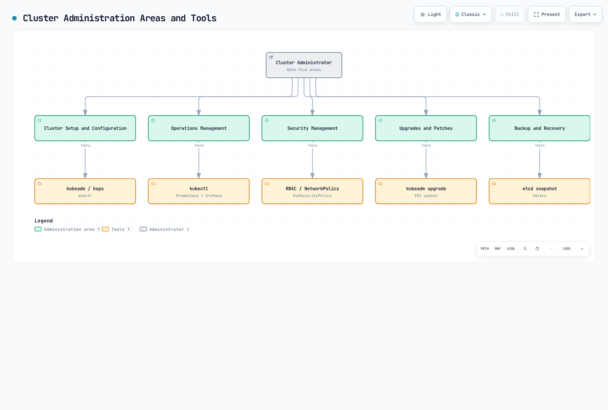
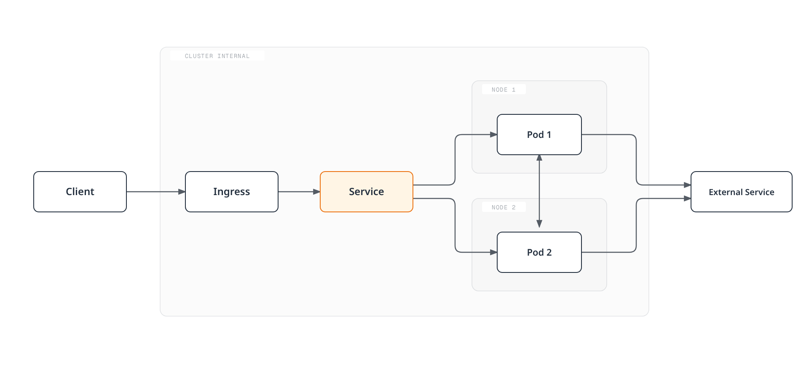
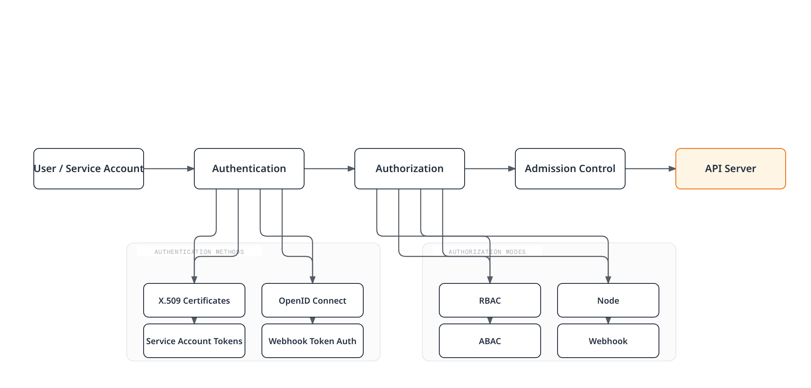
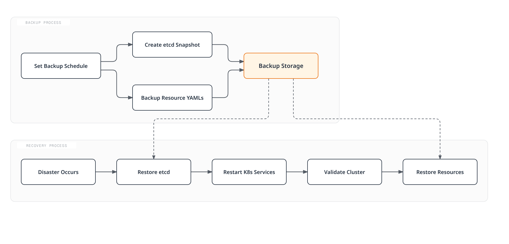
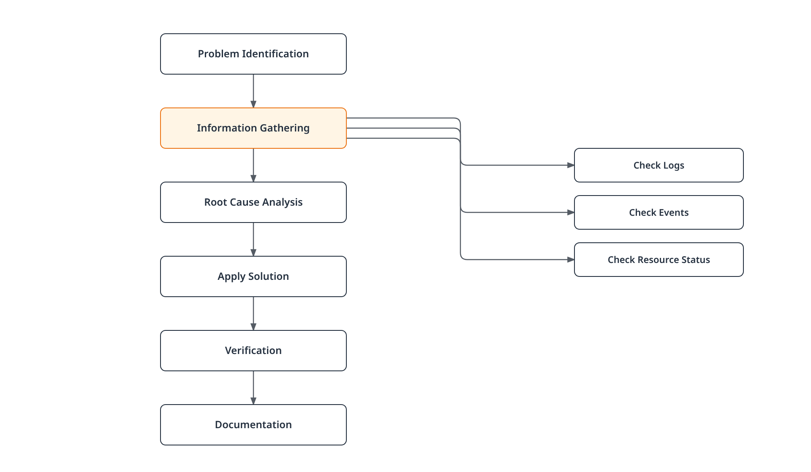

# Kubernetes Cluster Administration

> **Supported Versions**: Kubernetes 1.34 - 1.36 (EKS standard support as of September 11, 2026)
> **Last Updated**: February 23, 2026

Kubernetes cluster administration is an important task that includes cluster setup, maintenance, monitoring, troubleshooting, and upgrades. In this chapter, we will explore various aspects of Kubernetes cluster administration and best practices for cluster management in Amazon EKS.

Self-managed kubeadm operations and EKS service operations are distinct. EKS does not expose control-plane hosts, static Pod manifests, or direct etcd access. Treat the blocks below as separate examples, not one script to run sequentially. Check upstream support and add-on compatibility for the actual cluster version.

## Core Concepts

- **Cluster Lifecycle Management**: The entire process from cluster creation to decommissioning
- **Control Plane Management**: Managing core components such as API server, scheduler, and controller manager
- **Node Management**: Adding, removing, and maintaining worker nodes
- **Resource Allocation**: Setting resource allocation and limits for CPU, memory, storage, etc.
- **Upgrade Strategy**: Cluster and application upgrade strategies to minimize downtime

## Table of Contents
1. [Cluster Administration Overview](#cluster-administration-overview)
2. [Cluster Component Management](#cluster-component-management)
3. [Resource Management](#resource-management)
4. [Cluster Networking](#cluster-networking)
5. [Authentication and Authorization Management](#authentication-and-authorization-management)
6. [Cluster Upgrades](#cluster-upgrades)
7. [Backup and Recovery](#backup-and-recovery)
8. [Monitoring and Logging](#monitoring-and-logging)
9. [Troubleshooting](#troubleshooting)
10. [Amazon EKS Cluster Administration](#amazon-eks-cluster-administration)
11. [Cluster Administration Best Practices](#cluster-administration-best-practices)
12. [Conclusion](#conclusion)

## Environment Setup

The following tools are required for cluster administration:

Use the [official kubectl installation guide](https://kubernetes.io/docs/tasks/tools/install-kubectl-linux/), keeping kubectl within one minor version of the API server. For self-managed clusters, install kubeadm/kubelet from the target minor's `pkgs.k8s.io` repository; the old `1.x.y-00` package examples are obsolete. Choose an exact package version from the configured repository before installation.

Install Helm and k9s from their [official Helm instructions](https://helm.sh/docs/intro/install/) and [k9s releases](https://github.com/derailed/k9s/releases), checking platform architecture and checksums. EKS administration additionally requires an authenticated AWS CLI and a compatible eksctl.

```bash
kubectl version --client
helm version
k9s version
# Self-managed nodes only, after configuring the target minor repository:
apt-cache madison kubeadm
```


## Cluster Administration Overview

Kubernetes cluster administration is the process of managing the entire lifecycle of a cluster. This includes the following main areas:

1. **Cluster Setup and Configuration**: Cluster creation, node addition, networking setup, storage configuration, etc.
2. **Operations Management**: Resource monitoring, performance optimization, capacity planning, troubleshooting
3. **Security Management**: Authentication, authorization, network policies, security contexts, etc.
4. **Upgrades and Patches**: Cluster version upgrades, security patch application
5. **Backup and Recovery**: Cluster data backup, disaster recovery planning

The following diagram shows the main areas of Kubernetes cluster administration and related tools:

## Cluster Component Management

A Kubernetes cluster consists of control plane components and node components. Managing each component is critical for cluster stability and performance.

### Control Plane Component Management


[🔍 View interactive diagram](https://www.atomai.click/kubernetes-docs/archmaps/en-core-09-cluster-administration-0.html)

#### API Server Management

The API server is a core component of the control plane that exposes the Kubernetes API.

```bash
# Check API server logs
kubectl logs -n kube-system kube-apiserver-<master-node-name>

# Check API server configuration (kubeadm cluster)
sudo cat /etc/kubernetes/manifests/kube-apiserver.yaml

# Check API server status
kubectl get --raw='/readyz?verbose'
```

#### etcd Management

etcd is a distributed key-value store that stores Kubernetes API state.

```bash
# etcd backup
ETCDCTL_API=3 etcdctl --endpoints=https://127.0.0.1:2379 \
  --cacert=/etc/kubernetes/pki/etcd/ca.crt \
  --cert=/etc/kubernetes/pki/etcd/server.crt \
  --key=/etc/kubernetes/pki/etcd/server.key \
  snapshot save /backup/etcd-snapshot-$(date +%Y-%m-%d).db

# Check etcd status
ETCDCTL_API=3 etcdctl --endpoints=https://127.0.0.1:2379 \
  --cacert=/etc/kubernetes/pki/etcd/ca.crt \
  --cert=/etc/kubernetes/pki/etcd/server.crt \
  --key=/etc/kubernetes/pki/etcd/server.key \
  endpoint health
```

### Node Management

Nodes are worker machines that run containerized applications.

```bash
# List nodes
kubectl get nodes

# Check node detailed information
kubectl describe node <node-name>

# Add node label
kubectl label node <node-name> environment=production

# Set node to maintenance mode
kubectl drain <node-name> --ignore-daemonsets

# Return node after maintenance
kubectl uncordon <node-name>
```

### Component Status Monitoring

```bash
# Check control plane component status
kubectl get --raw='/readyz?verbose'

# Check system pod status
kubectl get pods -n kube-system

# Check node resource usage
kubectl top nodes
```



[🔍 View interactive diagram](https://www.atomai.click/kubernetes-docs/archmaps/en-core-09-cluster-administration-1.html)

### Cluster Administration Tools

Various tools are available for Kubernetes cluster administration:

1. **kubectl**: Command-line tool for interacting with Kubernetes clusters
2. **kubeadm**: Tool for creating and managing Kubernetes clusters
3. **kops**: Tool for creating, upgrading, and managing Kubernetes clusters
4. **eksctl**: Tool for creating and managing Amazon EKS clusters
5. **Helm**: Kubernetes application package manager
6. **Headlamp**: Kubernetes web UI; the old Kubernetes Dashboard project is archived
7. **Prometheus & Grafana**: Monitoring and alerting tools
8. **Fluentd & Elasticsearch**: Logging tools

## Cluster Component Management

A Kubernetes cluster consists of multiple components, and effectively managing these components is important.

### Control Plane Components

Control plane components manage the overall state of the cluster:

1. **kube-apiserver**: Component that exposes the Kubernetes API
2. **etcd**: Key-value store that stores cluster data
3. **kube-scheduler**: Component that schedules pods to nodes
4. **kube-controller-manager**: Component that runs controllers
5. **cloud-controller-manager**: Component that interacts with cloud providers

The following diagram shows Kubernetes control plane components and their interactions:


[🔍 View interactive diagram](https://www.atomai.click/kubernetes-docs/archmaps/en-core-09-cluster-administration-2.html)

#### Control Plane Component Monitoring

It is important to monitor the status of control plane components:

```bash
# Check control plane component status
kubectl get --raw='/readyz?verbose'

# Check API server logs
kubectl logs -n kube-system kube-apiserver-<node-name>

# Check etcd status
kubectl exec -n kube-system etcd-<node-name> -- etcdctl \
  --endpoints=https://127.0.0.1:2379 \
  --cacert=/etc/kubernetes/pki/etcd/ca.crt \
  --cert=/etc/kubernetes/pki/etcd/healthcheck-client.crt \
  --key=/etc/kubernetes/pki/etcd/healthcheck-client.key endpoint health
```

#### Control Plane Component Configuration

The manifest below is only a flag/configuration fragment. It omits the host networking, certificate mounts, and other kubeadm-generated settings; do not replace a running control-plane manifest with this fragment. Match the image to the cluster upgrade plan.

How to manage control plane component configuration:

```yaml
# kube-apiserver configuration example
apiVersion: v1
kind: Pod
metadata:
  name: kube-apiserver
  namespace: kube-system
spec:
  containers:
  - command:
    - kube-apiserver
    - --advertise-address=192.168.1.10
    - --allow-privileged=true
    - --authorization-mode=Node,RBAC
    - --client-ca-file=/etc/kubernetes/pki/ca.crt
    - --enable-admission-plugins=NodeRestriction
    - --enable-bootstrap-token-auth=true
    - --etcd-cafile=/etc/kubernetes/pki/etcd/ca.crt
    - --etcd-certfile=/etc/kubernetes/pki/apiserver-etcd-client.crt
    - --etcd-keyfile=/etc/kubernetes/pki/apiserver-etcd-client.key
    - --etcd-servers=https://127.0.0.1:2379
    - --kubelet-client-certificate=/etc/kubernetes/pki/apiserver-kubelet-client.crt
    - --kubelet-client-key=/etc/kubernetes/pki/apiserver-kubelet-client.key
    - --kubelet-preferred-address-types=InternalIP,ExternalIP,Hostname
    - --secure-port=6443
    - --service-account-key-file=/etc/kubernetes/pki/sa.pub
    - --service-account-signing-key-file=/etc/kubernetes/pki/sa.key
    - --service-account-issuer=https://kubernetes.default.svc.cluster.local
    - --service-cluster-ip-range=10.96.0.0/12
    - --tls-cert-file=/etc/kubernetes/pki/apiserver.crt
    - --tls-private-key-file=/etc/kubernetes/pki/apiserver.key
    image: registry.k8s.io/kube-apiserver:v1.36.4
    name: kube-apiserver
```

### Node Components

Node components run on each node and manage pods:

1. **kubelet**: Agent running on each node that ensures pods and containers are running
2. **kube-proxy**: Maintains network rules and handles connection forwarding
3. **Container Runtime**: Software that runs containers (containerd, CRI-O, or Docker Engine with an external CRI adapter)

#### Node Management

Key commands for node management:

```bash
# List nodes
kubectl get nodes

# Check node detailed information
kubectl describe node <node-name>

# Add node label
kubectl label node <node-name> key=value

# Add node taint
kubectl taint node <node-name> key=value:NoSchedule

# Set node to maintenance mode
kubectl cordon <node-name>

# Drain node
kubectl drain <node-name> --ignore-daemonsets
```

Drain may stop on standalone Pods, PDBs, or local data. Investigate instead of adding `--force` or `--delete-emptydir-data` by default; the latter explicitly authorizes emptyDir data loss. Wait for drain and workload health before maintenance.

#### Node Troubleshooting

Commands for node troubleshooting:

```bash
# Check node status
kubectl describe node <node-name> | grep Conditions -A 10

# Check node resource usage
kubectl top node <node-name>

# Check kubelet logs
journalctl -u kubelet

# Check container runtime status
systemctl status docker  # When using Docker
systemctl status containerd  # When using containerd
```

## Resource Management

Effectively managing resources in a Kubernetes cluster is important for maintaining cluster stability and performance.

### Namespace Management

Use a disposable namespace to practice lifecycle operations. Deleting a namespace deletes its namespaced resources; inspect and back up required data first. `get all` is only a workload subset.

```bash
kubectl create namespace admin-demo
kubectl get all -n admin-demo
# Cleanup only the disposable exercise namespace:
kubectl delete namespace admin-demo
```

### Resource Quotas

Resource quotas limit resource usage per namespace:

```yaml
apiVersion: v1
kind: ResourceQuota
metadata:
  name: compute-resources
  namespace: dev
spec:
  hard:
    requests.cpu: "1"
    requests.memory: 1Gi
    limits.cpu: "2"
    limits.memory: 2Gi
    pods: "10"
```

In the above example, the `dev` namespace can have a maximum of 10 pods, 1 CPU and 1Gi memory requests, and 2 CPU and 2Gi memory limits.

### Limit Ranges

Limit ranges set defaults and limits for individual resources within a namespace:

```yaml
apiVersion: v1
kind: LimitRange
metadata:
  name: limit-range
  namespace: dev
spec:
  limits:
  - default:
      cpu: 500m
      memory: 512Mi
    defaultRequest:
      cpu: 200m
      memory: 256Mi
    max:
      cpu: 1
      memory: 1Gi
    min:
      cpu: 100m
      memory: 128Mi
    type: Container
```

In the above example, all containers in the `dev` namespace have default limits of 500m CPU and 512Mi memory, default requests of 200m CPU and 256Mi memory, maximum of 1 CPU and 1Gi memory, and minimum of 100m CPU and 128Mi memory.

### Horizontal Pod Autoscaler (HPA)

HPA automatically adjusts the number of pods based on CPU usage or custom metrics:

```yaml
apiVersion: autoscaling/v2
kind: HorizontalPodAutoscaler
metadata:
  name: frontend-hpa
spec:
  scaleTargetRef:
    apiVersion: apps/v1
    kind: Deployment
    name: frontend
  minReplicas: 2
  maxReplicas: 10
  metrics:
  - type: Resource
    resource:
      name: cpu
      target:
        type: Utilization
        averageUtilization: 80
```

In the above example, the `frontend` deployment targets average CPU utilization of 80% of requested CPU, subject to tolerance, missing metrics, stabilization windows and scaling policies. It maintains a minimum of 2 and maximum of 10 replicas.

### Vertical Pod Autoscaler (VPA)

VPA automatically adjusts pod CPU and memory requests:

```yaml
apiVersion: autoscaling.k8s.io/v1
kind: VerticalPodAutoscaler
metadata:
  name: frontend-vpa
spec:
  targetRef:
    apiVersion: apps/v1
    kind: Deployment
    name: frontend
  updatePolicy:
    updateMode: "Recreate"
```

In the above example, pods in the `frontend` deployment have their CPU and memory requests automatically adjusted based on actual resource usage.
## Cluster Networking

Kubernetes cluster networking manages communication between pods, services, and nodes.

### Cluster Network Model

Basic requirements of the Kubernetes network model:

1. All pods can communicate with all other pods without NAT
2. Node agents (kubelet) can communicate with all pods on that node
3. External connectivity depends on routing and egress policy; there is no universal Pod NAT-mode requirement

The following diagram shows Kubernetes networking components and communication flows:



[🔍 View interactive diagram](https://www.atomai.click/kubernetes-docs/archmaps/en-core-09-cluster-administration-3.html)

### CNI (Container Network Interface) Plugins

Kubernetes implements networking through CNI plugins. Common CNI plugins:

1. **Calico**: CNI with enhanced network policy and security features
2. **Flannel**: Provides simple overlay networking
3. **Cilium**: eBPF-based networking and security solution
4. **AWS VPC CNI**: CNI integrated with AWS VPC
5. **Weave Net (historical)**: Archived; choose a maintained alternative for new installations

#### CNI Plugin Installation and Configuration

CNI plugin installation example (Calico):

Choose one CNI or a documented chaining/migration setup. The Calico, Flannel, and Cilium alternatives must not be installed sequentially into the same running cluster. Use a supported, pinned release and the provider-specific instructions; on EKS, follow the VPC CNI or planned alternative-CNI procedure in the [networking chapter](./03-services-networking.md).

```bash
# Inspect the installed networking components before making changes
kubectl get daemonsets -A
kubectl get pods -A -l k8s-app=calico-node
```


### Service Networking

Kubernetes services provide stable endpoints for pod sets:

1. **ClusterIP**: Service accessible only within the cluster
2. **NodePort**: Service accessible through a specific port on all nodes
3. **LoadBalancer**: Service accessible through an external load balancer
4. **ExternalName**: Provides CNAME record for external services

#### Service CIDR Configuration

Service CIDR defines the service IP address range:

```bash
# Set service CIDR in kube-apiserver configuration
--service-cluster-ip-range=10.96.0.0/12
```

### CoreDNS Management

CoreDNS provides DNS services for Kubernetes:

```bash
# Check CoreDNS status
kubectl get pods -n kube-system -l k8s-app=kube-dns

# Check CoreDNS configuration
kubectl get configmap -n kube-system coredns -o yaml
```

CoreDNS configuration example:

```yaml
apiVersion: v1
kind: ConfigMap
metadata:
  name: coredns
  namespace: kube-system
data:
  Corefile: |
    .:53 {
        errors
        health {
           lameduck 5s
        }
        ready
        kubernetes cluster.local in-addr.arpa ip6.arpa {
           pods insecure
           fallthrough in-addr.arpa ip6.arpa
           ttl 30
        }
        prometheus :9153
        forward . /etc/resolv.conf
        cache 30
        loop
        reload
        loadbalance
    }
```

### Network Policies

Network policies control communication between pods:

```yaml
apiVersion: networking.k8s.io/v1
kind: NetworkPolicy
metadata:
  name: db-network-policy
  namespace: default
spec:
  podSelector:
    matchLabels:
      role: db
  policyTypes:
  - Ingress
  - Egress
  ingress:
  - from:
    - podSelector:
        matchLabels:
          role: frontend
    ports:
    - protocol: TCP
      port: 3306
  egress:
  - to:
    - podSelector:
        matchLabels:
          role: monitoring
    ports:
    - protocol: TCP
      port: 9090
```

In the above example, pods with the `role=db` label only allow TCP port 3306 inbound traffic from pods with the `role=frontend` label and TCP port 9090 outbound traffic to pods with the `role=monitoring` label.

## Authentication and Authorization Management

Kubernetes authentication and authorization management are core elements of cluster security.

The following diagram shows the Kubernetes authentication and authorization flow:



[🔍 View interactive diagram](https://www.atomai.click/kubernetes-docs/archmaps/en-core-09-cluster-administration-4.html)

### Authentication

Kubernetes supports various authentication methods:

1. **X.509 Certificates**: Authentication using client certificates
2. **Service Account Tokens**: JWT tokens associated with service accounts
3. **OpenID Connect (OIDC)**: Authentication through external identity providers
4. **Webhook Token Authentication**: Token verification through external services
5. **Authentication Proxy**: Request processing through authentication proxy

#### X.509 Certificate Management

X.509 certificate creation and management:

```bash
# Generate a protected private key and CSR
umask 077
openssl genrsa -out user.key 2048
openssl req -new -key user.key -out user.csr -subj "/CN=user/O=group"

# Submit CSR to Kubernetes
cat <<EOF | kubectl apply -f -
apiVersion: certificates.k8s.io/v1
kind: CertificateSigningRequest
metadata:
  name: user-csr
spec:
  request: $(cat user.csr | base64 | tr -d '\n')
  signerName: kubernetes.io/kube-apiserver-client
  usages:
  - client auth
EOF

# Approve CSR
kubectl certificate approve user-csr
kubectl wait --for=jsonpath='{.status.certificate}' csr/user-csr --timeout=60s

# Get certificate
kubectl get csr user-csr -o jsonpath='{.status.certificate}' | base64 --decode > user.crt
```

#### OIDC Authentication Configuration

OIDC authentication configuration example:

```bash
# Add OIDC flags to kube-apiserver configuration
--oidc-issuer-url=https://accounts.google.com
--oidc-client-id=kubernetes
--oidc-username-claim=email
--oidc-groups-claim=groups
```

### Authorization

Kubernetes supports various authorization modes:

1. **RBAC (Role-Based Access Control)**: Role-based access control
2. **ABAC (Attribute-Based Access Control)**: Attribute-based access control
3. **Node**: Node authorization
4. **Webhook**: Authorization through external services

#### RBAC Configuration

RBAC is the most common authorization mechanism:

```yaml
# Role example
apiVersion: rbac.authorization.k8s.io/v1
kind: Role
metadata:
  namespace: default
  name: pod-reader
rules:
- apiGroups: [""]
  resources: ["pods"]
  verbs: ["get", "watch", "list"]

# RoleBinding example
---
apiVersion: rbac.authorization.k8s.io/v1
kind: RoleBinding
metadata:
  name: read-pods
  namespace: default
subjects:
- kind: User
  name: user
  apiGroup: rbac.authorization.k8s.io
roleRef:
  kind: Role
  name: pod-reader
  apiGroup: rbac.authorization.k8s.io
```

In the above example, `user` has permission to view pods in the `default` namespace.

#### ClusterRole and ClusterRoleBinding

Manages permissions for cluster-wide resources:

```yaml
# ClusterRole example
apiVersion: rbac.authorization.k8s.io/v1
kind: ClusterRole
metadata:
  name: node-reader
rules:
- apiGroups: [""]
  resources: ["nodes"]
  verbs: ["get", "watch", "list"]

# ClusterRoleBinding example
---
apiVersion: rbac.authorization.k8s.io/v1
kind: ClusterRoleBinding
metadata:
  name: read-nodes
subjects:
- kind: User
  name: user
  apiGroup: rbac.authorization.k8s.io
roleRef:
  kind: ClusterRole
  name: node-reader
  apiGroup: rbac.authorization.k8s.io
```

In the above example, `user` has permission to view all nodes in the cluster.

### Service Account Management

Service accounts are used by pods to communicate with the API server:

```yaml
# Create service account
apiVersion: v1
kind: ServiceAccount
metadata:
  name: my-service-account
  namespace: default

# Grant permissions to service account
---
apiVersion: rbac.authorization.k8s.io/v1
kind: RoleBinding
metadata:
  name: my-service-account-binding
  namespace: default
subjects:
- kind: ServiceAccount
  name: my-service-account
  namespace: default
roleRef:
  kind: Role
  name: pod-reader
  apiGroup: rbac.authorization.k8s.io

# Use service account in pod
---
apiVersion: v1
kind: Pod
metadata:
  name: my-pod
spec:
  serviceAccountName: my-service-account
  containers:
  - name: my-container
    image: nginx
```

### Security Context

Security context defines permissions and access control for pods and containers:

```yaml
apiVersion: v1
kind: Pod
metadata:
  name: security-context-pod
spec:
  securityContext:
    runAsUser: 1000
    runAsGroup: 3000
    fsGroup: 2000
    runAsNonRoot: true
    seccompProfile:
      type: RuntimeDefault
  containers:
  - name: security-context-container
    image: busybox:1.36
    command: ["sh", "-c", "sleep 3600"]
    securityContext:
      allowPrivilegeEscalation: false
      capabilities:
        drop:
        - ALL
      readOnlyRootFilesystem: true
```

In the above example, the pod runs with UID 1000 and GID 3000, and the container cannot escalate privileges, has all Linux capabilities dropped, and has the root filesystem mounted as read-only.

## Cluster Upgrades

Kubernetes cluster upgrades are necessary to apply new features, performance improvements, and security patches.

The following diagram shows the Kubernetes cluster upgrade process:


[🔍 View interactive diagram](https://www.atomai.click/kubernetes-docs/archmaps/en-core-09-cluster-administration-5.html)

### Upgrade Planning

Considerations when planning cluster upgrades:

1. **Version Compatibility**: Check compatibility between Kubernetes versions
2. **Upgrade Path**: Check supported upgrade paths
3. **Downtime**: Plan for expected downtime during upgrade
4. **Rollback Plan**: Develop a rollback plan in case of issues
5. **Application Impact**: Assess the impact of upgrades on applications

### Control Plane Upgrade

Control plane upgrade using kubeadm:

Use the [version-specific kubeadm upgrade procedure](https://kubernetes.io/docs/tasks/administer-cluster/kubeadm/kubeadm-upgrade/). Enable the target minor's pkgs.k8s.io repository and select an exact published package version; upgrade one minor at a time.

1. Back up etcd and validate workload/add-on compatibility. On the first control-plane node, upgrade kubeadm, run `kubeadm upgrade plan`, then `kubeadm upgrade apply <target-version>`.
2. On additional control-plane nodes, upgrade kubeadm and run `kubeadm upgrade node`.
3. Drain each node before upgrading its kubelet. If drain fails, stop the procedure and resolve the cause. Upgrade kubelet/kubectl to compatible versions, reload systemd, restart kubelet, verify Ready and workloads, then uncordon from an administrative client.
4. On each worker, upgrade kubeadm and run `kubeadm upgrade node`, then perform the drain/kubelet/verification/uncordon sequence. Do not run a generic whole-system upgrade as a substitute for the Kubernetes version-specific procedure.

Run commands on the explicitly identified node or administrative client; a sequence of nested `ssh` sessions is not a multi-node automation script.

### Worker Node Upgrade

Worker node upgrade process:

Use the [version-specific kubeadm upgrade procedure](https://kubernetes.io/docs/tasks/administer-cluster/kubeadm/kubeadm-upgrade/). Enable the target minor's pkgs.k8s.io repository and select an exact published package version; upgrade one minor at a time.

1. Back up etcd and validate workload/add-on compatibility. On the first control-plane node, upgrade kubeadm, run `kubeadm upgrade plan`, then `kubeadm upgrade apply <target-version>`.
2. On additional control-plane nodes, upgrade kubeadm and run `kubeadm upgrade node`.
3. Drain each node before upgrading its kubelet. If drain fails, stop the procedure and resolve the cause. Upgrade kubelet/kubectl to compatible versions, reload systemd, restart kubelet, verify Ready and workloads, then uncordon from an administrative client.
4. On each worker, upgrade kubeadm and run `kubeadm upgrade node`, then perform the drain/kubelet/verification/uncordon sequence. Do not run a generic whole-system upgrade as a substitute for the Kubernetes version-specific procedure.

Run commands on the explicitly identified node or administrative client; a sequence of nested `ssh` sessions is not a multi-node automation script.

### Upgrade Verification

Verify cluster status after upgrade:

```bash
# Check node versions
kubectl get nodes

# Check component status
kubectl get --raw='/readyz?verbose'

# Check pod status
kubectl get pods --all-namespaces

# Test cluster functionality
kubectl create deployment nginx --image=nginx
kubectl expose deployment nginx --port=80
kubectl get svc nginx
```
## Backup and Recovery

Kubernetes cluster backup and recovery is an important part of disaster recovery planning.

The following diagram shows the Kubernetes cluster backup and recovery process:



[🔍 View interactive diagram](https://www.atomai.click/kubernetes-docs/archmaps/en-core-09-cluster-administration-6.html)

### etcd Backup

etcd stores all state information for the Kubernetes cluster, so regular backups are important:

```bash
# Create etcd snapshot
ETCDCTL_API=3 etcdctl --endpoints=https://127.0.0.1:2379 \
  --cacert=/etc/kubernetes/pki/etcd/ca.crt \
  --cert=/etc/kubernetes/pki/etcd/server.crt \
  --key=/etc/kubernetes/pki/etcd/server.key \
  snapshot save /backup/etcd-snapshot-$(date +%Y-%m-%d-%H-%M-%S).db

# Check snapshot status
etcdutl snapshot status --write-out=table /backup/etcd-snapshot-2023-01-01-12-00-00.db
```

### etcd Recovery

Restore from etcd snapshot:

For self-managed disaster recovery, stop all API servers and the affected etcd processes using the distribution-specific runbook. Stopping kubelet alone leaves existing static Pod containers running. Restore into a new directory with a compatible etcdutl; preserve the original data until recovery is verified. This single-member command is an illustration, not a multi-member HA restore:

```bash
etcdutl snapshot status "$SNAPSHOT_FILE" --write-out=table
etcdutl snapshot restore "$SNAPSHOT_FILE" \
  --data-dir=/var/lib/etcd-restore \
  --name=etcd-1 \
  --initial-cluster=etcd-1=https://127.0.0.1:2380 \
  --initial-cluster-token=restored-cluster \
  --initial-advertise-peer-urls=https://127.0.0.1:2380 \
  --bump-revision=1000000000 --mark-compacted
```

Set SNAPSHOT_FILE to the verified snapshot. For HA, restore the same snapshot on every member with its unique name/peer URL and the same full membership list. Choose a revision bump exceeding changes since the snapshot. Update the etcd manifest/service to the restored path with correct ownership and certificates, verify quorum/health, then restart API servers/controllers. See the [official recovery guide](https://etcd.io/docs/v3.6/op-guide/recovery/). EKS users cannot restore managed control-plane etcd directly.

### Resource Backup

These exports are protected inventories, not a complete portable restore plan. They include Secrets, need restricted permissions/encryption, and do not include PV data. Use `umask 077` and check every command failure; restore CRDs/dependencies in order and remove server-owned metadata as appropriate. `kubectl get all` only returns a subset of resource kinds.

Backup Kubernetes resources as YAML files:

```bash
# Export listable resources (includes sensitive Secrets)
set -eu
umask 077
for ns in $(kubectl get ns -o jsonpath='{.items[*].metadata.name}'); do
  mkdir -p /backup/resources/$ns
  for resource in $(kubectl api-resources --verbs=list --namespaced=true -o name); do
    kubectl get -n "$ns" "$resource" -o yaml > "/backup/resources/$ns/$resource.yaml"
  done
done

# Backup cluster-scoped resources
mkdir -p /backup/resources/cluster-scoped
for resource in $(kubectl api-resources --verbs=list --namespaced=false -o name); do
  kubectl get "$resource" -o yaml > "/backup/resources/cluster-scoped/$resource.yaml"
done
```

### Backup Automation

Self-managed kubeadm example only: replace the tooling image with a verified image containing a compatible etcdctl, match the control-plane label/taint and certificate paths, and create the backup PVC. The selected host must expose etcd at the shown loopback address and allow the PVC mount. This does not run on the managed EKS control plane. Verify the snapshot and copy it to protected external storage; an in-cluster PVC alone is not disaster recovery.

Automate backup tasks with CronJob:

```yaml
apiVersion: batch/v1
kind: CronJob
metadata:
  name: etcd-backup
  namespace: kube-system
spec:
  concurrencyPolicy: Forbid
  schedule: "0 0 * * *"  # Run daily at midnight
  jobTemplate:
    spec:
      template:
        spec:
          hostNetwork: true
          automountServiceAccountToken: false
          nodeSelector:
            node-role.kubernetes.io/control-plane: ""
          tolerations:
          - key: node-role.kubernetes.io/control-plane
            operator: Exists
            effect: NoSchedule
          containers:
          - name: etcd-backup
            image: example.invalid/etcd-backup-tools:replace-me
            command:
            - /bin/sh
            - -c
            - |
              set -eu
              umask 077
              ETCDCTL_API=3 etcdctl --endpoints=https://127.0.0.1:2379 \
                --cacert=/etc/kubernetes/pki/etcd/ca.crt \
                --cert=/etc/kubernetes/pki/etcd/healthcheck-client.crt \
                --key=/etc/kubernetes/pki/etcd/healthcheck-client.key \
                snapshot save /backup/etcd-snapshot-$(date +%Y-%m-%d-%H-%M-%S).db
            volumeMounts:
            - name: etcd-ca
              mountPath: /etc/kubernetes/pki/etcd/ca.crt
              readOnly: true
            - name: etcd-client-cert
              mountPath: /etc/kubernetes/pki/etcd/healthcheck-client.crt
              readOnly: true
            - name: etcd-client-key
              mountPath: /etc/kubernetes/pki/etcd/healthcheck-client.key
              readOnly: true
            - name: backup
              mountPath: /backup
          restartPolicy: OnFailure
          volumes:
          - name: etcd-ca
            hostPath:
              path: /etc/kubernetes/pki/etcd/ca.crt
              type: File
          - name: etcd-client-cert
            hostPath:
              path: /etc/kubernetes/pki/etcd/healthcheck-client.crt
              type: File
          - name: etcd-client-key
            hostPath:
              path: /etc/kubernetes/pki/etcd/healthcheck-client.key
              type: File
          - name: backup
            persistentVolumeClaim:
              claimName: etcd-backup-pvc
```

## Monitoring and Logging

Effective monitoring and logging is a core element of cluster administration.

The following diagram shows the Kubernetes cluster monitoring and logging architecture:


[🔍 View interactive diagram](https://www.atomai.click/kubernetes-docs/archmaps/en-core-09-cluster-administration-7.html)

### Monitoring Tools

Tools for Kubernetes cluster monitoring:

1. **Prometheus**: Metric collection and storage
2. **Grafana**: Metric visualization
3. **Alertmanager**: Alert management
4. **kube-state-metrics**: Generate Kubernetes object metrics
5. **metrics-server**: Provide resource usage metrics

#### Prometheus and Grafana Installation

Install Prometheus and Grafana using Helm:

```bash
# Add Helm repository
helm repo add prometheus-community https://prometheus-community.github.io/helm-charts
helm repo update

# Install Prometheus stack
helm install prometheus prometheus-community/kube-prometheus-stack \
  --namespace monitoring \
  --create-namespace
```

#### Key Monitoring Metrics

Key metrics to monitor:

1. **Node Metrics**: CPU, memory, disk, network usage
2. **Pod Metrics**: CPU, memory usage, restart count
3. **Container Metrics**: CPU, memory usage, filesystem usage
4. **API Server Metrics**: Request latency, request count, error rate
5. **etcd Metrics**: Disk I/O, leader changes, commit latency

### Logging Tools

Tools for Kubernetes cluster logging:

1. **Elasticsearch**: Log storage and search
2. **Fluentd/Fluent Bit**: Log collection and forwarding
3. **Kibana**: Log visualization
4. **Loki**: Log aggregation system
5. **Grafana**: Log visualization

#### EFK (Elasticsearch, Fluentd, Kibana) Stack Installation

Install EFK stack using Helm:

The standalone Elastic Stack Helm-chart repository is archived. For maintained deployments use Elastic Cloud on Kubernetes (ECK), then define Elasticsearch/Kibana resources and a compatible log collector. The operator installation alone does not create an EFK stack:

```bash
helm repo add elastic https://helm.elastic.co
helm upgrade --install elastic-operator elastic/eck-operator \
  --namespace elastic-system --create-namespace \
  --version "${ECK_CHART_VERSION:?Select a supported ECK chart version}"
```

Keep dashboards behind ClusterIP/authenticated access; configure storage, TLS, credentials, collector parsing, and RBAC following the [ECK guide](https://www.elastic.co/docs/deploy-manage/deploy/cloud-on-k8s/install-using-helm-chart).

#### Log Collection Configuration

This example parses the CRI log envelope rather than assuming Docker JSON. The collector image must include the metadata/output plugins, mount node logs and writable position-file storage, and receive scoped metadata RBAC. Configure TLS/authentication for the actual Elasticsearch service; the placeholder host alone is not a complete ECK integration. Handle partial/multiline records according to the selected collector.

Fluentd configuration example:

```yaml
apiVersion: v1
kind: ConfigMap
metadata:
  name: fluentd-config
  namespace: logging
data:
  fluent.conf: |
    <source>
      @type tail
      path /var/log/containers/*.log
      pos_file /var/log/fluentd-containers.log.pos
      tag kubernetes.*
      read_from_head true
      <parse>
        @type regexp
        expression /^(?<time>[^ ]+) (?<stream>stdout|stderr) (?<logtag>[^ ]*) (?<log>.*)$/
        time_type string
        time_format %Y-%m-%dT%H:%M:%S.%N%:z
      </parse>
    </source>

    <filter kubernetes.**>
      @type kubernetes_metadata
      kubernetes_url https://kubernetes.default.svc
      bearer_token_file /var/run/secrets/kubernetes.io/serviceaccount/token
      ca_file /var/run/secrets/kubernetes.io/serviceaccount/ca.crt
    </filter>

    <match kubernetes.**>
      @type elasticsearch
      host elasticsearch-master
      port 9200
      logstash_format true
      logstash_prefix k8s
    </match>
```

## Troubleshooting

Kubernetes cluster troubleshooting is an important part of cluster administration.

### Pod Troubleshooting

Commands for pod troubleshooting:

```bash
# Check pod status
kubectl get pod <pod-name> -o wide

# Check pod detailed information
kubectl describe pod <pod-name>

# Check pod logs
kubectl logs <pod-name>
kubectl logs <pod-name> -c <container-name>  # For multi-container pods
kubectl logs <pod-name> --previous  # Logs from previous container

# Execute command in pod
kubectl exec -it <pod-name> -- /bin/sh
```

### Node Troubleshooting

Commands for node troubleshooting:

```bash
# Check node status
kubectl get node <node-name> -o wide

# Check node detailed information
kubectl describe node <node-name>

# Check node resource usage
kubectl top node <node-name>

# SSH to node
ssh <node-name>

# Check node system logs
journalctl -u kubelet

# Check node resource usage
top
df -h
free -m
```

### Networking Troubleshooting

Commands for networking troubleshooting:

```bash
# Check service status
kubectl get svc <service-name>

# Check service detailed information
kubectl describe svc <service-name>

# Check endpoints
kubectl get endpointslices -l kubernetes.io/service-name=<service-name>

# Check DNS
kubectl run -it --rm --restart=Never busybox --image=busybox -- nslookup <service-name>

# Test network connectivity
kubectl run -it --rm --restart=Never busybox --image=busybox -- wget -O- <service-name>:<port>

# Check network policies
kubectl get networkpolicy
kubectl describe networkpolicy <policy-name>
```

### Control Plane Troubleshooting

Commands for control plane troubleshooting:

```bash
# Check component status
kubectl get --raw='/readyz?verbose'

# Check API server logs
kubectl logs -n kube-system kube-apiserver-<node-name>

# Check controller manager logs
kubectl logs -n kube-system kube-controller-manager-<node-name>

# Check scheduler logs
kubectl logs -n kube-system kube-scheduler-<node-name>

# Check etcd logs
kubectl logs -n kube-system etcd-<node-name>
```

## Amazon EKS Cluster Administration

Amazon EKS is a managed Kubernetes service that automates many aspects of cluster administration.

The following diagram shows the Amazon EKS cluster architecture and management components:


[🔍 View interactive diagram](https://www.atomai.click/kubernetes-docs/archmaps/en-core-09-cluster-administration-8.html)

### EKS Cluster Configuration

Set the real administrator CIDR before changing endpoint access and verify private access remains reachable. A version upgrade must be the next supported minor with compatible add-ons/nodes; do not use the example as a downgrade or skip-minor operation. Poll the returned update ID and stop dependent changes if it fails.

EKS cluster configuration management:

```bash
# Check EKS cluster information
aws eks describe-cluster --name my-cluster

# Update EKS cluster
aws eks update-cluster-config \
  --name my-cluster \
  --resources-vpc-config "endpointPublicAccess=true,endpointPrivateAccess=true,publicAccessCidrs=${ADMIN_CIDR:?Set an approved administrator public CIDR}"

# Update EKS cluster version
aws eks update-cluster-version \
  --name my-cluster \
  --kubernetes-version "${TARGET_VERSION:?Select the next EKS-supported minor version}"
```

### EKS Node Group Management

EKS node group management:

```bash
# Check node group information
aws eks describe-nodegroup \
  --cluster-name my-cluster \
  --nodegroup-name my-nodegroup

# Scale node group
aws eks update-nodegroup-config \
  --cluster-name my-cluster \
  --nodegroup-name my-nodegroup \
  --scaling-config minSize=2,maxSize=10,desiredSize=5

# Update node group
aws eks update-nodegroup-version \
  --cluster-name my-cluster \
  --nodegroup-name my-nodegroup
```

### EKS Add-on Management

Read the current version using `aws eks describe-cluster --name my-cluster --query cluster.version --output text`; use it for add-on discovery and select a compatible pinned version. Review existing configuration/IAM before create/update and do not create an already managed add-on again. The removal example uses `--preserve` to leave the CNI running while removing EKS management; uninstalling live networking is a separate disruptive operation.

EKS add-on management:

```bash
# Check available add-ons
aws eks describe-addon-versions --addon-name vpc-cni \
  --kubernetes-version "${CLUSTER_VERSION:?Set the actual cluster version}"

# Install add-on
aws eks create-addon \
  --cluster-name my-cluster \
  --addon-name vpc-cni \
  --addon-version "${CNI_ADDON_VERSION:?Select a compatible pinned VPC CNI add-on version}"

# Update add-on
aws eks update-addon \
  --cluster-name my-cluster \
  --addon-name vpc-cni \
  --addon-version "${CNI_ADDON_VERSION:?Select a compatible pinned VPC CNI add-on version}"

# Delete add-on
aws eks delete-addon \
  --cluster-name my-cluster \
  --addon-name vpc-cni --preserve
```

### EKS Cluster Upgrade

EKS cluster upgrade process:

1. **Control Plane Upgrade**:
   ```bash
   aws eks update-cluster-version \
     --name my-cluster \
     --kubernetes-version "${TARGET_VERSION:?Select the next EKS-supported minor version}"
   ```

2. **Add-on Upgrade**:
   ```bash
   aws eks update-addon \
     --cluster-name my-cluster \
     --addon-name vpc-cni \
     --addon-version "${CNI_ADDON_VERSION:?Select a compatible pinned VPC CNI add-on version}"
   ```

3. **Node Group Upgrade**:
   ```bash
   aws eks update-nodegroup-version \
     --cluster-name my-cluster \
     --nodegroup-name my-nodegroup
   ```

### EKS Cluster Monitoring

Control-plane logging exports api/audit/authenticator/controllerManager/scheduler logs. Container Insights requires the CloudWatch agent/add-on and scoped telemetry IAM permissions; it is not enabled by update-cluster-logging. The CloudWatch observability add-on installs CloudWatch/Fluent Bit components, not Prometheus/Grafana. See the [official add-on setup](https://docs.aws.amazon.com/AmazonCloudWatch/latest/monitoring/install-CloudWatch-Observability-EKS-addon.html).

EKS cluster monitoring tools:

1. **Amazon CloudWatch**: Metrics, logs, alerts
2. **AWS CloudTrail**: API call logging
3. **Amazon Managed Grafana**: Metric visualization
4. **Amazon Managed Service for Prometheus**: Metric collection and storage

Enable EKS control-plane logging:

```bash
# Enable EKS control-plane logs
eksctl utils update-cluster-logging \
  --enable-types all \
  --cluster my-cluster \
  --approve
```

## Cluster Administration Best Practices

Best practices for Kubernetes and EKS cluster administration:

### Cluster Configuration Best Practices

1. **Infrastructure as Code (IaC)**: Manage cluster configuration using Terraform, AWS CDK, eksctl, etc.
2. **Version Control**: Store cluster configuration in version control systems
3. **Multiple Environments**: Separate development, staging, and production environments
4. **Network Separation**: Configure appropriate network separation and security groups
5. **Least Privilege Principle**: Grant only the minimum necessary permissions

### Operations Best Practices

1. **Regular Backups**: Regular backup of etcd and important resources
2. **Monitoring and Alerting**: Build comprehensive monitoring and alerting systems
3. **Centralized Logging**: Centralize and analyze logs
4. **Automation**: Automate repetitive tasks
5. **Disaster Recovery Planning**: Establish and test clear disaster recovery plans

### Security Best Practices

1. **Regular Updates**: Regular updates of cluster and nodes
2. **Network Policies**: Configure appropriate network policies
3. **Encryption**: Encrypt data at rest and in transit
4. **Security Context**: Configure appropriate security contexts
5. **Image Scanning**: Scan container images for vulnerabilities

### Resource Management Best Practices

1. **Resource Requests and Limits**: Set appropriate resource requests and limits for all pods
2. **Namespace Separation**: Separate workloads by namespace
3. **Resource Quotas**: Set resource quotas per namespace
4. **HPA and VPA**: Configure autoscaling
5. **Node Affinity and Taints**: Optimize workload placement

### EKS-Specific Best Practices

1. **Managed Node Groups**: Use managed node groups when possible
2. **Fargate**: Use Fargate for serverless workloads
3. **EKS Add-ons**: Use official EKS add-ons
4. **IAM Roles for Service Accounts (IRSA)**: Manage IAM permissions per pod
5. **VPC CNI Customization**: Configure VPC CNI according to networking requirements

## Conclusion

Kubernetes cluster administration plays an important role in maintaining cluster stability, security, and performance. This chapter covered various aspects of cluster administration including cluster component management, resource management, networking, authentication and authorization management, upgrades, backup and recovery, monitoring and logging, and troubleshooting.

Using Amazon EKS reduces the complexity of Kubernetes control plane management and simplifies cluster administration through integration with AWS services. However, understanding fundamental Kubernetes concepts and best practices is still important for effective cluster management.

Cluster administration is an ongoing process that must be continuously adjusted according to cluster requirements and workload characteristics. It is important to use monitoring tools to track cluster status, minimize repetitive tasks through automation, and follow best practices to maintain cluster stability and security.

## Cluster Networking

Kubernetes cluster networking manages pod-to-pod communication, service discovery, and external access.

### Network Architecture


[🔍 View interactive diagram](https://www.atomai.click/kubernetes-docs/archmaps/en-core-09-cluster-administration-9.html)

### CNI Plugin Management

CNI (Container Network Interface) plugins handle networking for Kubernetes clusters.

Choose one CNI or a documented chaining/migration setup. The Calico, Flannel, and Cilium alternatives must not be installed sequentially into the same running cluster. Use a supported, pinned release and the provider-specific instructions; on EKS, follow the VPC CNI or planned alternative-CNI procedure in the [networking chapter](./03-services-networking.md).

```bash
# Inspect the installed networking components before making changes
kubectl get daemonsets -A
kubectl get pods -A -l k8s-app=calico-node
```


### CNI Plugin Comparison

| CNI Plugin | Network Model | Network Policy Support | Performance | Features |
|-----------|---------------|----------------------|-------------|----------|
| **Calico** | BGP | Yes | High | Strong in network policies, routing-based |
| **Flannel** | VXLAN/host-gateway | No | Medium | Simple setup, limited features |
| **Cilium** | eBPF | Yes | Very High | L3-L7 policies, high performance |
| **Weave Net** | VXLAN | Yes | Medium | Encryption support, multi-cluster |
| **AWS VPC CNI** | AWS VPC | Yes, with supported version/configuration | Workload dependent | Native EKS integration |

### Network Troubleshooting

```bash
# Test pod network connectivity
kubectl run -it --rm network-test --image=busybox -- sh
# Inside the container
ping <target-ip>
traceroute <target-ip>
wget -O- <service-name>

# DNS troubleshooting
kubectl run -it --rm dns-test --image=busybox -- sh
# Inside the container
nslookup kubernetes.default.svc.cluster.local
cat /etc/resolv.conf

# Check service endpoints
kubectl get endpointslices -l kubernetes.io/service-name=<service-name>

# Check network policies
kubectl describe networkpolicy -n <namespace>
```
## Authentication and Authorization Management

Kubernetes authentication and authorization management are core elements of cluster security. RBAC (Role-Based Access Control) is used to manage permissions for users and service accounts.

### Authentication Methods

Kubernetes supports various authentication methods:

1. **X.509 Certificates**: Authentication using client certificates
2. **Service Account Tokens**: Used for API server access within pods
3. **OpenID Connect (OIDC)**: Integration with external identity providers
4. **Webhook Token Authentication**: Integration with external authentication services
5. **Authentication Proxy**: Authentication through proxy

### RBAC Configuration

```yaml
# role.yaml - namespace-scoped role
apiVersion: rbac.authorization.k8s.io/v1
kind: Role
metadata:
  namespace: default
  name: pod-reader
rules:
- apiGroups: [""]
  resources: ["pods"]
  verbs: ["get", "watch", "list"]
```

```yaml
# rolebinding.yaml - binding role to user
apiVersion: rbac.authorization.k8s.io/v1
kind: RoleBinding
metadata:
  name: read-pods
  namespace: default
subjects:
- kind: User
  name: jane
  apiGroup: rbac.authorization.k8s.io
roleRef:
  kind: Role
  name: pod-reader
  apiGroup: rbac.authorization.k8s.io
```

```yaml
# clusterrole.yaml - cluster-scoped role
apiVersion: rbac.authorization.k8s.io/v1
kind: ClusterRole
metadata:
  name: namespace-reader
rules:
- apiGroups: [""]
  resources: ["namespaces"]
  verbs: ["get", "watch", "list"]
```

```yaml
# clusterrolebinding.yaml - binding cluster role to user
apiVersion: rbac.authorization.k8s.io/v1
kind: ClusterRoleBinding
metadata:
  name: read-namespaces-global
subjects:
- kind: Group
  name: namespace-viewers
  apiGroup: rbac.authorization.k8s.io
roleRef:
  kind: ClusterRole
  name: namespace-reader
  apiGroup: rbac.authorization.k8s.io
```

### User Certificate Creation

For self-managed client-certificate authentication, submit a CSR and have an authorized approver verify the requested identity/groups. Do not distribute the cluster CA private key. EKS user access should use IAM/access entries.

```bash
umask 077
openssl genrsa -out jane.key 2048
openssl req -new -key jane.key -out jane.csr -subj "/CN=jane/O=dev"
cat <<EOF | kubectl apply -f -
apiVersion: certificates.k8s.io/v1
kind: CertificateSigningRequest
metadata:
  name: jane-csr
spec:
  request: $(base64 < jane.csr | tr -d '\n')
  signerName: kubernetes.io/kube-apiserver-client
  expirationSeconds: 86400
  usages:
  - client auth
EOF
# Authorized approver only, after reviewing the CSR identity:
kubectl certificate approve jane-csr
kubectl wait --for=jsonpath='{.status.certificate}' csr/jane-csr --timeout=60s
kubectl get csr jane-csr -o jsonpath='{.status.certificate}' | base64 --decode > jane.crt
kubectl config set-credentials jane --client-certificate=jane.crt --client-key=jane.key
kubectl config set-context jane-context --cluster=kubernetes --user=jane
```

### Service Account Management

```bash
# Create service account
kubectl create serviceaccount app-service-account

# Bind role to service account
kubectl create rolebinding app-service-account-binding \
  --role=pod-reader \
  --serviceaccount=default:app-service-account

# Inspect ServiceAccount metadata (projected tokens are not listed here)
kubectl describe serviceaccount app-service-account
```

### Permission Verification

```bash
# Check user permissions
kubectl auth can-i get pods --as jane

# Check permissions in a specific namespace
kubectl auth can-i create deployments --as jane --namespace production
```
## Cluster Upgrades

Kubernetes cluster upgrades are necessary to apply new features, security patches, and bug fixes. Upgrades must be carefully planned and executed.

### Upgrade Planning


[🔍 View interactive diagram](https://www.atomai.click/kubernetes-docs/archmaps/en-core-09-cluster-administration-10.html)

### Upgrade Strategy Comparison

| Strategy | Description | Advantages | Disadvantages | Suitable Environment |
|----------|-------------|------------|---------------|---------------------|
| **In-place Upgrade** | Directly upgrade existing cluster | Resource efficient, simple procedure | Complex rollback, potential downtime | Development, test environments |
| **Blue/Green Deployment** | Create new version cluster and switch | Safe rollback, verifiable | Resource duplication, increased cost | Production environments |
| **Canary Deployment** | Move only some workloads to new cluster | Gradual verification, reduced risk | Complex management, dual operation | Critical production environments |

### Upgrade Using kubeadm

Use the [version-specific kubeadm upgrade procedure](https://kubernetes.io/docs/tasks/administer-cluster/kubeadm/kubeadm-upgrade/). Enable the target minor's pkgs.k8s.io repository and select an exact published package version; upgrade one minor at a time.

1. Back up etcd and validate workload/add-on compatibility. On the first control-plane node, upgrade kubeadm, run `kubeadm upgrade plan`, then `kubeadm upgrade apply <target-version>`.
2. On additional control-plane nodes, upgrade kubeadm and run `kubeadm upgrade node`.
3. Drain each node before upgrading its kubelet. If drain fails, stop the procedure and resolve the cause. Upgrade kubelet/kubectl to compatible versions, reload systemd, restart kubelet, verify Ready and workloads, then uncordon from an administrative client.
4. On each worker, upgrade kubeadm and run `kubeadm upgrade node`, then perform the drain/kubelet/verification/uncordon sequence. Do not run a generic whole-system upgrade as a substitute for the Kubernetes version-specific procedure.

Run commands on the explicitly identified node or administrative client; a sequence of nested `ssh` sessions is not a multi-node automation script.

### Post-Upgrade Verification

```bash
# Check cluster version
kubectl version

# Check node versions
kubectl get nodes

# Check component status
kubectl get --raw='/readyz?verbose'

# Check workload status
kubectl get pods -A
```
## Backup and Recovery

Kubernetes cluster backup and recovery is an important part of disaster recovery planning. Main backup targets are the etcd database, persistent volume data, and Kubernetes resource definitions.

### etcd Backup and Recovery

etcd is a core component that stores all state information for the cluster.

For self-managed disaster recovery, stop all API servers and the affected etcd processes using the distribution-specific runbook. Stopping kubelet alone leaves existing static Pod containers running. Restore into a new directory with a compatible etcdutl; preserve the original data until recovery is verified. This single-member command is an illustration, not a multi-member HA restore:

```bash
etcdutl snapshot status "$SNAPSHOT_FILE" --write-out=table
etcdutl snapshot restore "$SNAPSHOT_FILE" \
  --data-dir=/var/lib/etcd-restore \
  --name=etcd-1 \
  --initial-cluster=etcd-1=https://127.0.0.1:2380 \
  --initial-cluster-token=restored-cluster \
  --initial-advertise-peer-urls=https://127.0.0.1:2380 \
  --bump-revision=1000000000 --mark-compacted
```

Set SNAPSHOT_FILE to the verified snapshot. For HA, restore the same snapshot on every member with its unique name/peer URL and the same full membership list. Choose a revision bump exceeding changes since the snapshot. Update the etcd manifest/service to the restored path with correct ownership and certificates, verify quorum/health, then restart API servers/controllers. See the [official recovery guide](https://etcd.io/docs/v3.6/op-guide/recovery/). EKS users cannot restore managed control-plane etcd directly.

### Kubernetes Resource Backup

```bash
# Export selected resources, not a full cluster backup
set -eu
umask 077
mkdir -p /backup/resources/$(date +%Y-%m-%d)
for ns in $(kubectl get ns -o jsonpath='{.items[*].metadata.name}'); do
  kubectl -n $ns get all -o yaml > /backup/resources/$(date +%Y-%m-%d)/$ns-all.yaml
done

# Backup specific resource types
for resource in deployments services configmaps secrets; do
  kubectl get $resource -A -o yaml > /backup/resources/$(date +%Y-%m-%d)/$resource.yaml
done
```

### Backup and Recovery Using Velero

Select compatible Velero/AWS plugin versions using the official matrix. The IRSA example assumes a configured cluster OIDC provider and a scoped role trusting the velero ServiceAccount. Configure the backup bucket, volume snapshot/file-backup support, encryption, and restore permissions before installation; not every PVC is automatically protected.

Velero is a tool for backing up and recovering Kubernetes cluster resources and persistent volumes.

```bash
# Install Velero (using AWS S3 backup storage)
velero install \
  --provider aws \
  --plugins "${VELERO_AWS_PLUGIN_IMAGE:?Select a plugin compatible with your Velero release}" \
  --bucket velero-backup \
  --backup-location-config region=us-west-2 \
  --snapshot-location-config region=us-west-2 \
  --no-secret \
  --sa-annotations "eks.amazonaws.com/role-arn=${VELERO_ROLE_ARN:?Set the preconfigured IRSA role ARN}"

# Full cluster backup
velero backup create full-cluster-backup --include-namespaces '*'

# Backup specific namespace
velero backup create production-backup --include-namespaces production

# Check backup status
velero backup describe full-cluster-backup

# Restore from backup
velero restore create --from-backup full-cluster-backup
```

### Backup Strategy Comparison

| Backup Method | Backup Target | Advantages | Disadvantages | Recovery Time |
|--------------|---------------|------------|---------------|---------------|
| **etcd Snapshot** | Cluster state | Built-in feature, complete state preservation | Volume data not included, manual process | Medium |
| **Resource YAML Backup** | Kubernetes objects | Simple implementation, selective restore | Volume data not included, relationship complexity | Slow |
| **Velero** | Resources and volumes | Automation, scheduling, volume snapshots | Additional tool installation required | Fast |
| **Cloud Provider Snapshots** | Supported disks/filesystems | Backend-native recovery points | Does not capture the whole Kubernetes/EKS cluster | Depends on data/backend |
## Monitoring and Logging

Effective cluster management requires a comprehensive monitoring and logging system. This allows problems to be detected and resolved early.

### Monitoring Architecture


[🔍 View interactive diagram](https://www.atomai.click/kubernetes-docs/archmaps/en-core-09-cluster-administration-11.html)

### Prometheus and Grafana Installation

```bash
# Install Prometheus and Grafana using Helm
helm repo add prometheus-community https://prometheus-community.github.io/helm-charts
helm repo update

helm install prometheus prometheus-community/kube-prometheus-stack \
  --namespace monitoring \
  --create-namespace \
  --set grafana.enabled=true \
  --set prometheus.service.type=ClusterIP

# Check services
kubectl get svc -n monitoring

# Access Grafana (using port forwarding)
kubectl port-forward svc/prometheus-grafana 3000:80 -n monitoring
# Obtain credentials from the configured Grafana Secret; do not assume a published default password
```

### EFK Stack Installation (Elasticsearch, Fluentd, Kibana)

The standalone Elastic Stack Helm-chart repository is archived. For maintained deployments use Elastic Cloud on Kubernetes (ECK), then define Elasticsearch/Kibana resources and a compatible log collector. The operator installation alone does not create an EFK stack:

```bash
helm repo add elastic https://helm.elastic.co
helm upgrade --install elastic-operator elastic/eck-operator \
  --namespace elastic-system --create-namespace \
  --version "${ECK_CHART_VERSION:?Select a supported ECK chart version}"
```

Keep dashboards behind ClusterIP/authenticated access; configure storage, TLS, credentials, collector parsing, and RBAC following the [ECK guide](https://www.elastic.co/docs/deploy-manage/deploy/cloud-on-k8s/install-using-helm-chart).

### Key Monitoring Metrics

| Metric Type | Description | Key Metrics | Monitoring Tools |
|-------------|-------------|-------------|-----------------|
| **Node Metrics** | Node-level resource usage | CPU, memory, disk, network | node-exporter, Prometheus |
| **Pod Metrics** | Container resource usage | CPU, memory usage, limits | cAdvisor, Prometheus |
| **Cluster Metrics** | Cluster state and resources | Pod count, node/object status, desired/current replicas | kube-state-metrics |
| **Application Metrics** | Custom application metrics | Request count, latency, error rate | Prometheus client libraries |

### Log Collection and Analysis

```bash
# Check logs for a specific pod
kubectl logs <pod-name> -n <namespace>

# Check logs from previous instance
kubectl logs <pod-name> -n <namespace> --previous

# Check logs for a specific container (multi-container pod)
kubectl logs <pod-name> -c <container-name> -n <namespace>

# Stream logs
kubectl logs -f <pod-name> -n <namespace>

# Check logs for all pods (using label selector)
kubectl logs -l app=nginx -n <namespace>
```

### Alert Configuration

You can configure alerts using Prometheus Alertmanager:

Create a protected `slack-webhook` Secret with key `url` in monitoring, then merge these Helm values into the existing kube-prometheus-stack release. Do not commit the webhook URL. A standalone ConfigMap is not automatically consumed by the operator.

```yaml
# alertmanager-values.yaml
alertmanager:
  alertmanagerSpec:
    secrets:
    - slack-webhook
  config:
    global:
      resolve_timeout: 5m
      slack_api_url_file: /etc/alertmanager/secrets/slack-webhook/url
    route:
      receiver: slack-notifications
      group_wait: 30s
      group_interval: 5m
      repeat_interval: 4h
      group_by: [alertname, cluster, service]
    receivers:
    - name: slack-notifications
      slack_configs:
      - channel: '#alerts'
        send_resolved: true
        title: '{{ range .Alerts }}{{ .Annotations.summary }}{{ end }}'
        text: '{{ range .Alerts }}{{ .Annotations.description }}{{ end }}'
```

Keep the current chart version and other values when upgrading; verify Alertmanager reload/status before relying on notifications.
## Troubleshooting

Kubernetes cluster troubleshooting is an important skill for system administrators and operators. A systematic approach is required for effective troubleshooting.

### Troubleshooting Methodology



[🔍 View interactive diagram](https://www.atomai.click/kubernetes-docs/archmaps/en-core-09-cluster-administration-12.html)

### Common Problems and Solutions

| Problem Type | Symptoms | Diagnostic Commands | Common Solutions |
|-------------|----------|---------------------|-----------------|
| **Pod Not Starting** | Pod in Pending or ContainerCreating state | `kubectl describe pod <pod-name>` | Check resource constraints, image availability, volume mounts |
| **Service Connection Issues** | Cannot access pods through service | `kubectl describe svc <service-name>`, `kubectl get endpointslices -l kubernetes.io/service-name=<service-name>` | Check label selectors, pod status, network policies |
| **Node Issues** | Node in NotReady state | `kubectl describe node <node-name>`, `kubectl get events` | Check kubelet status, system resources, network connectivity |
| **DNS Issues** | Cannot connect by service name | `kubectl exec -it <pod-name> -- nslookup kubernetes.default` | Check CoreDNS pods, kube-dns service, network policies |
| **Authentication/Authorization Issues** | API server access denied | `kubectl auth can-i <verb> <resource>` | Check RBAC settings, certificate validity, service account |

### Pod Troubleshooting

```bash
# Check pod status
kubectl get pod <pod-name> -o wide

# Check pod details
kubectl describe pod <pod-name>

# Check pod logs
kubectl logs <pod-name>
kubectl logs <pod-name> --previous  # Logs from previous container

# Execute command in pod
kubectl exec -it <pod-name> -- /bin/sh

# Check pod events
kubectl get events --field-selector involvedObject.name=<pod-name>
```

### Node Troubleshooting

```bash
# Check node status
kubectl get nodes
kubectl describe node <node-name>

# Check node resource usage
kubectl top node <node-name>

# Check node system logs (SSH required)
ssh <node-ip> 'sudo journalctl -u kubelet'

# Check kubelet status (SSH required)
ssh <node-ip> 'sudo systemctl status kubelet'
```

### Networking Troubleshooting

```bash
# Check service and endpoints
kubectl get svc <service-name>
kubectl get endpointslices -l kubernetes.io/service-name=<service-name>

# DNS troubleshooting
kubectl run -it --rm dns-test --image=busybox -- sh
# Inside the container
nslookup kubernetes.default.svc.cluster.local
cat /etc/resolv.conf

# Network connectivity test
kubectl run -it --rm network-test --image=nicolaka/netshoot -- sh
# Inside the container
ping <target-ip>
traceroute <target-ip>
curl <service-name>:<port>
```
## Amazon EKS Cluster Administration

Amazon EKS (Elastic Kubernetes Service) is a managed Kubernetes service on AWS where AWS manages the control plane. Customer responsibilities for nodes depend on managed node groups, Auto Mode, Fargate, or self-managed compute; workload security and configuration remain customer responsibilities.

### EKS Cluster Architecture


[🔍 View interactive diagram](https://www.atomai.click/kubernetes-docs/archmaps/en-core-09-cluster-administration-13.html)

### EKS Cluster Creation

```bash
# Create cluster using eksctl
eksctl create cluster \
  --name my-cluster \
  --version 1.36 \
  --region us-west-2 \
  --nodegroup-name standard-workers \
  --node-type t3.medium \
  --nodes 3 \
  --nodes-min 1 \
  --nodes-max 5 \
  --managed

# Alternative: create control plane using AWS CLI (not after the eksctl example)
aws eks create-cluster \
  --name my-cluster \
  --role-arn arn:aws:iam::123456789012:role/eks-cluster-role \
  --kubernetes-version 1.36 \
  --resources-vpc-config "subnetIds=${EKS_SUBNET_IDS:?Set two or more appropriate subnets},securityGroupIds=${EKS_SECURITY_GROUP_ID:?Set the intended security group},endpointPrivateAccess=true,endpointPublicAccess=true,publicAccessCidrs=${ADMIN_CIDR:?Set an approved administrator public CIDR}"
```

### Node Group Management

```bash
# Create managed node group
eksctl create nodegroup \
  --cluster my-cluster \
  --region us-west-2 \
  --name my-nodegroup \
  --node-type t3.medium \
  --nodes 3 \
  --nodes-min 1 \
  --nodes-max 5

# Scale node group
eksctl scale nodegroup \
  --cluster my-cluster \
  --name my-nodegroup \
  --nodes 5 \
  --region us-west-2

# Update node group
aws eks update-nodegroup-version \
  --cluster-name my-cluster \
  --nodegroup-name my-nodegroup \
  --region us-west-2
```

### EKS Cluster Upgrade

```bash
# Check cluster version
aws eks describe-cluster --name my-cluster --query "cluster.version"

# Upgrade cluster control plane
aws eks update-cluster-version \
  --name my-cluster \
  --kubernetes-version "${TARGET_VERSION:?Select the next EKS-supported minor version}"

# Upgrade managed node group
aws eks update-nodegroup-version \
  --cluster-name my-cluster \
  --nodegroup-name my-nodegroup
```

### EKS Cluster Authentication and Authorization

The cluster must use `API` or `API_AND_CONFIG_MAP` authentication mode. Plan migration from legacy aws-auth mappings while preserving existing administrator/node access. This example grants a viewer role access only to the default namespace:

```bash
aws eks describe-cluster --name my-cluster --query cluster.accessConfig.authenticationMode
aws eks create-access-entry --cluster-name my-cluster \
  --principal-arn arn:aws:iam::123456789012:role/cluster-viewer --type STANDARD
aws eks associate-access-policy --cluster-name my-cluster \
  --principal-arn arn:aws:iam::123456789012:role/cluster-viewer \
  --policy-arn arn:aws:eks::aws:cluster-access-policy/AmazonEKSViewPolicy \
  --access-scope type=namespace,namespaces=default
```

See the [EKS access-entry guide](https://docs.aws.amazon.com/eks/latest/userguide/access-entries.html). Permissions to manage EKS access entries and Kubernetes workload permissions are separate.

### EKS Cluster Monitoring

Control-plane logging exports api/audit/authenticator/controllerManager/scheduler logs. Container Insights requires the CloudWatch agent/add-on and scoped telemetry IAM permissions; it is not enabled by update-cluster-logging. The CloudWatch observability add-on installs CloudWatch/Fluent Bit components, not Prometheus/Grafana. See the [official add-on setup](https://docs.aws.amazon.com/AmazonCloudWatch/latest/monitoring/install-CloudWatch-Observability-EKS-addon.html).

```bash
# Enable EKS control-plane logs
eksctl utils update-cluster-logging \
  --enable-types all \
  --cluster my-cluster \
  --region us-west-2

# Install CloudWatch observability (not Prometheus/Grafana)
aws eks create-addon \
  --cluster-name my-cluster \
  --addon-name amazon-cloudwatch-observability \
  --addon-version "${CLOUDWATCH_ADDON_VERSION:?Select a compatible add-on version}"
```
## Cluster Administration Best Practices

Best practices for effective Kubernetes cluster management are important for ensuring stability, security, and performance.

### Cluster Setup Best Practices

1. **Multi-Availability Zone Configuration**: Distribute nodes across multiple availability zones for high availability
2. **Appropriate Sizing**: Select node types and counts appropriate for workloads
3. **Autoscaling Configuration**: Enable cluster autoscaler and horizontal pod autoscaler
4. **Apply Network Policies**: Start with a default deny policy and allow only necessary communication
5. **Set Resource Quotas**: Set resource limits per namespace

### Operations Best Practices

1. **Use Declarative Configuration**: Define all resources as YAML files and version control them
2. **Adopt GitOps**: Use Git as the single source of truth and build automated deployment pipelines
3. **Regular Backups**: Regular backup of etcd data and persistent volume data
4. **Monitoring and Alerting**: Build comprehensive monitoring systems and set alerts for key metrics
5. **Centralized Logging**: Collect all logs to a central logging system for easy analysis

### Security Best Practices

1. **Least Privilege Principle**: Grant only the minimum necessary permissions using RBAC
2. **Network Segmentation**: Limit pod-to-pod communication using network policies
3. **Image Scanning**: Implement container image scanning for vulnerability detection
4. **Secret Management**: Use external secret management tools (e.g., AWS Secrets Manager, HashiCorp Vault)
5. **Regular Security Audits**: Conduct regular audits of cluster configuration and permissions

### Upgrade Best Practices

1. **Gradual Upgrades**: Upgrade gradually rather than all at once
2. **Test Environment First**: Verify upgrades in test environments before production
3. **Create Backups**: Perform full backups before upgrades
4. **Rollback Plan**: Develop a plan to rollback to previous versions in case of issues
5. **Set Upgrade Windows**: Perform upgrades during low-usage periods

### Cost Optimization Best Practices

1. **Select Appropriate Node Sizes**: Select optimal node types for workloads
2. **Utilize Spot Instances**: Use spot instances for non-critical workloads
3. **Configure Autoscaling**: Configure automatic scale up and down based on demand
4. **Optimize Resource Requests and Limits**: Set resource requests and limits based on actual usage
5. **Identify Idle Resources**: Regularly identify and remove idle resources

### Documentation Best Practices

1. **Document Architecture**: Document cluster architecture, networking, and security settings
2. **Document Operations Procedures**: Document common operations tasks, troubleshooting procedures, and emergency response plans
3. **Change Management**: Record and track all cluster changes
4. **Create Runbooks**: Provide step-by-step guides for common scenarios
5. **Knowledge Sharing**: Conduct regular knowledge sharing and training sessions within the team
## Conclusion

Kubernetes cluster administration is a complex task that includes various aspects. A systematic approach is required from cluster setup to operation, monitoring, troubleshooting, and upgrades.

For effective cluster administration, focus on the following key areas:

1. **Cluster Component Management**: Stable operation of control plane and node components
2. **Resource Management**: Efficient resource allocation and usage
3. **Networking**: Secure and efficient network configuration
4. **Security**: Appropriate authentication and authorization management
5. **Backup and Recovery**: Data loss prevention and disaster recovery planning
6. **Monitoring and Logging**: Cluster status and performance monitoring
7. **Troubleshooting**: Systematic troubleshooting approach

When using managed Kubernetes services like Amazon EKS, it is important to understand the shared responsibility model between the service provider and the user. AWS manages the control plane, while compute responsibility varies by mode; customers still manage application configuration and security.

By following best practices and utilizing appropriate tools, you can operate a stable, secure, and efficient Kubernetes cluster. Continuous learning and improvement to enhance cluster management capabilities is important.

---

> **References**:
> - [Kubernetes Official Documentation: Cluster Administration](https://kubernetes.io/docs/tasks/administer-cluster/)
> - [Amazon EKS User Guide](https://docs.aws.amazon.com/eks/latest/userguide/what-is-eks.html)
> - [Kubernetes Best Practices: Cluster Administration](https://kubernetes.io/docs/setup/best-practices/)
> - [etcd Documentation: Backup and Recovery](https://etcd.io/docs/v3.5/op-guide/recovery/)
> - [Prometheus Documentation](https://prometheus.io/docs/introduction/overview/)

## Quiz

To test what you learned in this chapter, try the [Cluster Administration Quiz](../quizzes/core/09-cluster-administration-quiz.md).
