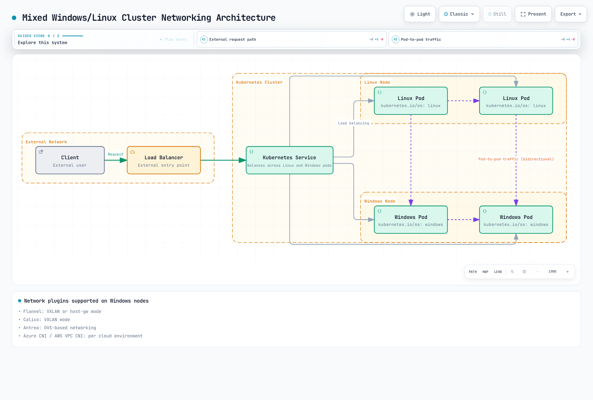

# Windows in Kubernetes

> **Supported Versions**: Kubernetes 1.32, 1.33, 1.34
> **Last Updated**: February 11, 2026

Kubernetes was originally designed for Linux containers, but production support for Windows containers was added starting with version 1.14. In this chapter, we will explore how to run Windows workloads in Kubernetes, the architecture, limitations, and Windows support in Amazon EKS.

## Table of Contents
1. [Windows Container Overview](#windows-container-overview)
2. [Kubernetes Windows Support Architecture](#kubernetes-windows-support-architecture)
3. [Windows Node Limitations](#windows-node-limitations)
4. [Windows Node Setup](#windows-node-setup)
5. [Deploying Windows Containers](#deploying-windows-containers)
6. [Networking](#networking)
7. [Storage](#storage)
8. [Monitoring and Logging](#monitoring-and-logging)
9. [Security](#security)
10. [Windows Support in Amazon EKS](#windows-support-in-amazon-eks)
11. [Best Practices](#best-practices)
12. [Conclusion](#conclusion)

## Windows Container Overview

Windows containers are containers that run on the Windows operating system, allowing you to containerize and deploy Windows applications.

### Windows Container Types

There are two types of Windows containers:

1. **Windows Server Containers**: Similar to Linux containers, they share the host OS kernel. They are lightweight and start quickly, but require the same Windows version as the host.

2. **Hyper-V Isolation Containers**: Each container runs in a lightweight VM, providing a higher level of isolation. They can run different Windows versions than the host but use more resources.

The following diagram shows the architectural differences between the two Windows container types:


[🔍 View interactive diagram](https://www.atomai.click/kubernetes-docs/archmaps/en-core-10-windows-in-kubernetes-0.html)

### Windows Container Images

Windows container images are based on base images provided by Microsoft:

1. **Windows Server Core**: A lightweight image that provides a minimal Windows Server environment
2. **Nano Server**: An ultra-lightweight image with a smaller footprint
3. **Windows**: An image that provides a full Windows Server environment

Example Dockerfile:

```dockerfile
FROM mcr.microsoft.com/windows/servercore:ltsc2019
WORKDIR /app
COPY . .
RUN powershell -Command "Install-WindowsFeature Web-Server"
EXPOSE 80
CMD ["powershell", "-Command", "Start-Service W3SVC; Get-Content -Path 'C:\\inetpub\\logs\\LogFiles\\W3SVC1\\u_ex*' -Wait"]
```

## Kubernetes Windows Support Architecture

Windows support in Kubernetes is based on a mixed environment. Control plane components always run on Linux, while worker nodes can be either Linux or Windows.

### Architecture Overview

The Windows support architecture in Kubernetes is as follows:

1. **Linux Control Plane**: kube-apiserver, kube-controller-manager, kube-scheduler, and etcd always run on Linux.
2. **Linux Worker Nodes**: Run system components (CoreDNS, metrics-server, etc.).
3. **Windows Worker Nodes**: Run Windows application workloads.


[🔍 View interactive diagram](https://www.atomai.click/kubernetes-docs/archmaps/en-core-10-windows-in-kubernetes-1.html)

### Windows Node Components

Kubernetes components running on Windows nodes:

1. **kubelet**: Manages pods and containers on the node
2. **kube-proxy**: Manages network rules
3. **CNI Plugin**: Network configuration
4. **CSI Plugin**: Storage management

## Windows Node Limitations

There are several limitations to be aware of when using Windows nodes in Kubernetes.

### Feature Limitations

1. **Privileged Containers**: Windows does not support privileged containers.
2. **Host Network Mode**: Windows pods cannot use host network mode.
3. **Pod Security Context**: Some security context features (runAsUser, fsGroup, etc.) are not supported.
4. **DaemonSet**: DaemonSets running on Windows nodes require special considerations.
5. **emptyDir Volumes**: Memory-based emptyDir volumes are not supported on Windows.
6. **Resource Limits**: CPU limits are applied differently on Windows.

### Networking Limitations

1. **Network Mode**: Windows only supports L3 networking.
2. **Service Types**: Windows nodes have limitations on some service types.
3. **Load Balancing**: Some load balancing features may be limited.

### Operating System Version Compatibility

Windows containers have important compatibility considerations with the host OS version:

| Container Base Image | Compatible Host OS Versions |
|---------------------|---------------------------|
| Windows Server 2019 | Windows Server 2019 |
| Windows Server 2022 | Windows Server 2022 |

Hyper-V isolation can relax these limitations but requires additional resources.
## Windows Node Setup

Let's explore the process of adding Windows nodes to a Kubernetes cluster.

### Prerequisites

Before setting up Windows nodes, verify the following:

1. **Kubernetes Version**: 1.14 or later
2. **Windows Version**: Windows Server 2019 or later
3. **Network Plugin**: CNI plugin that supports Windows (Calico, Flannel, etc.)
4. **Container Runtime**: Docker, containerd, etc.

### Preparing Windows Nodes

Steps to prepare a Windows node:

1. **Install Windows Server**: Install Windows Server 2019 or later
2. **Enable Container Feature**:

```powershell
Install-WindowsFeature -Name Containers
Restart-Computer -Force
```

3. **Install Docker**:

```powershell
Install-Module -Name DockerMsftProvider -Repository PSGallery -Force
Install-Package -Name Docker -ProviderName DockerMsftProvider -Force
Restart-Computer -Force
```

4. **Install Kubernetes Components**:

```powershell
# Create directory
mkdir -p c:\k

# Download kubelet, kubeadm, kubectl
curl.exe -LO https://dl.k8s.io/v1.22.0/bin/windows/amd64/kubelet.exe
curl.exe -LO https://dl.k8s.io/v1.22.0/bin/windows/amd64/kubectl.exe
curl.exe -LO https://dl.k8s.io/v1.22.0/bin/windows/amd64/kube-proxy.exe
curl.exe -LO https://github.com/kubernetes-sigs/sig-windows-tools/releases/latest/download/wins.exe

# Move files to C:\k
mv kubelet.exe C:\k
mv kubectl.exe C:\k
mv kube-proxy.exe C:\k
mv wins.exe C:\k
```

5. **Configure Network**:

```powershell
# Set firewall rules
New-NetFirewallRule -Name kubelet -DisplayName 'kubelet' -Enabled True -Direction Inbound -Protocol TCP -Action Allow -LocalPort 10250
New-NetFirewallRule -Name https -DisplayName 'https' -Enabled True -Direction Inbound -Protocol TCP -Action Allow -LocalPort 443
New-NetFirewallRule -Name http -DisplayName 'http' -Enabled True -Direction Inbound -Protocol TCP -Action Allow -LocalPort 80
```

### Joining Windows Node Using kubeadm

Generate join token on the Linux control plane:

```bash
kubeadm token create --print-join-command
```

Run join command on the Windows node:

```powershell
# Run kubeadm join command
kubeadm join <control-plane-host>:<control-plane-port> --token <token> --discovery-token-ca-cert-hash sha256:<hash>

# Register and start kubelet service
sc.exe create kubelet binPath= "C:\k\kubelet.exe --windows-service --kubeconfig=C:\k\config"
Start-Service kubelet
```

### Setting Windows Node Labels

Set appropriate labels on Windows nodes to control workload scheduling:

```bash
kubectl label node <windows-node-name> kubernetes.io/os=windows
kubectl label node <windows-node-name> kubernetes.io/arch=amd64
```

## Deploying Windows Containers

Let's explore how to deploy Windows containers to Kubernetes.

### Using Node Selector

When deploying Windows workloads, use a node selector to ensure they are scheduled to Windows nodes:

```yaml
apiVersion: apps/v1
kind: Deployment
metadata:
  name: iis-deployment
spec:
  replicas: 2
  selector:
    matchLabels:
      app: iis
  template:
    metadata:
      labels:
        app: iis
    spec:
      nodeSelector:
        kubernetes.io/os: windows
      containers:
      - name: iis
        image: mcr.microsoft.com/windows/servercore/iis:windowsservercore-ltsc2019
        resources:
          limits:
            cpu: 1
            memory: 800Mi
          requests:
            cpu: .1
            memory: 300Mi
        ports:
        - containerPort: 80
```

### Resource Requests and Limits

Resource requests and limits for Windows containers are handled differently than Linux containers:

1. **CPU Limits**: CPU limits are applied differently on Windows. For example, a CPU limit of 1 means 100% of a single CPU core can be used.
2. **Memory Limits**: Windows containers respect memory limits, but some system processes may cause additional overhead.

### Container Customization

Running custom scripts in Windows containers:

```yaml
apiVersion: v1
kind: Pod
metadata:
  name: windows-custom-script
spec:
  nodeSelector:
    kubernetes.io/os: windows
  containers:
  - name: windows-container
    image: mcr.microsoft.com/windows/servercore:ltsc2019
    command:
    - powershell.exe
    - -Command
    - |
      while ($true) {
        Write-Host "Hello from Windows container"
        Start-Sleep -Seconds 10
      }
```

### Multi-Container Pods

Windows also supports multi-container pods, but with some limitations:

```yaml
apiVersion: v1
kind: Pod
metadata:
  name: windows-multi-container
spec:
  nodeSelector:
    kubernetes.io/os: windows
  containers:
  - name: web
    image: mcr.microsoft.com/windows/servercore/iis:windowsservercore-ltsc2019
    ports:
    - containerPort: 80
  - name: logger
    image: mcr.microsoft.com/windows/servercore:ltsc2019
    command:
    - powershell.exe
    - -Command
    - |
      while ($true) {
        Get-Content -Path 'C:\inetpub\logs\LogFiles\W3SVC1\u_ex*' -Wait
      }
```

## Networking

Networking on Windows nodes has different characteristics than Linux nodes.

The following diagram shows the networking architecture of a Kubernetes cluster with mixed Windows and Linux nodes:



[🔍 View interactive diagram](https://www.atomai.click/kubernetes-docs/archmaps/en-core-10-windows-in-kubernetes-2.html)

### Supported Network Plugins

Network plugins supported on Windows nodes:

1. **Flannel**: VXLAN or host-gw mode
2. **Calico**: VXLAN mode
3. **Antrea**: OVS-based networking
4. **Azure CNI**: Used in Azure environments
5. **AWS VPC CNI**: Used in AWS environments

### Flannel Setup Example

Windows networking setup using Flannel:

```yaml
apiVersion: apps/v1
kind: DaemonSet
metadata:
  name: kube-flannel-ds-windows
  namespace: kube-system
  labels:
    tier: node
    app: flannel
spec:
  selector:
    matchLabels:
      app: flannel
  template:
    metadata:
      labels:
        tier: node
        app: flannel
    spec:
      affinity:
        nodeAffinity:
          requiredDuringSchedulingIgnoredDuringExecution:
            nodeSelectorTerms:
            - matchExpressions:
              - key: kubernetes.io/os
                operator: In
                values:
                - windows
      hostNetwork: true
      containers:
      - name: kube-flannel
        image: sigwindowstools/flannel:v0.13.0
        command:
        - powershell
        args:
        - -file
        - /opt/bin/flannel-host.ps1
        env:
        - name: POD_NAME
          valueFrom:
            fieldRef:
              fieldPath: metadata.name
        - name: POD_NAMESPACE
          valueFrom:
            fieldRef:
              fieldPath: metadata.namespace
        volumeMounts:
        - name: host-run
          mountPath: /run
        - name: cni
          mountPath: /etc/cni/net.d
        - name: flannel-cfg
          mountPath: /etc/kube-flannel/
      volumes:
      - name: host-run
        hostPath:
          path: /run
      - name: cni
        hostPath:
          path: /etc/cni/net.d
      - name: flannel-cfg
        configMap:
          name: kube-flannel-cfg
```

### Exposing Services

How to expose services on Windows nodes:

```yaml
apiVersion: v1
kind: Service
metadata:
  name: iis-service
spec:
  selector:
    app: iis
  ports:
  - port: 80
    targetPort: 80
  type: LoadBalancer
```

### Network Policies

To use network policies on Windows nodes, you need a CNI plugin that supports network policies (e.g., Calico):

```yaml
apiVersion: networking.k8s.io/v1
kind: NetworkPolicy
metadata:
  name: allow-frontend-to-backend
  namespace: default
spec:
  podSelector:
    matchLabels:
      app: backend
      os: windows
  ingress:
  - from:
    - podSelector:
        matchLabels:
          app: frontend
    ports:
    - protocol: TCP
      port: 80
```

## Storage

Let's explore storage options available on Windows nodes.

The following diagram shows various storage options available on Windows nodes:


[🔍 View interactive diagram](https://www.atomai.click/kubernetes-docs/archmaps/en-core-10-windows-in-kubernetes-3.html)

### Supported Volume Types

Volume types supported on Windows nodes:

1. **emptyDir**: Temporary storage (memory-based emptyDir not supported)
2. **hostPath**: Host node filesystem
3. **configMap**: Configuration data
4. **secret**: Sensitive data
5. **azureFile**: Azure File storage
6. **awsElasticBlockStore**: AWS EBS volumes
7. **azureDisk**: Azure Disk storage
8. **CSI**: Container Storage Interface drivers

### emptyDir Volume Example

```yaml
apiVersion: v1
kind: Pod
metadata:
  name: windows-emptydir
spec:
  nodeSelector:
    kubernetes.io/os: windows
  containers:
  - name: windows-container
    image: mcr.microsoft.com/windows/servercore:ltsc2019
    volumeMounts:
    - name: temp-volume
      mountPath: C:\temp
    command:
    - powershell.exe
    - -Command
    - |
      Set-Content -Path C:\temp\test.txt -Value "Hello from Windows"
      while ($true) {
        Get-Content -Path C:\temp\test.txt
        Start-Sleep -Seconds 10
      }
  volumes:
  - name: temp-volume
    emptyDir: {}
```

### hostPath Volume Example

```yaml
apiVersion: v1
kind: Pod
metadata:
  name: windows-hostpath
spec:
  nodeSelector:
    kubernetes.io/os: windows
  containers:
  - name: windows-container
    image: mcr.microsoft.com/windows/servercore:ltsc2019
    volumeMounts:
    - name: logs-volume
      mountPath: C:\logs
    command:
    - powershell.exe
    - -Command
    - |
      Set-Content -Path C:\logs\app.log -Value "Application log"
      while ($true) {
        Add-Content -Path C:\logs\app.log -Value "Log entry at $(Get-Date)"
        Start-Sleep -Seconds 10
      }
  volumes:
  - name: logs-volume
    hostPath:
      path: C:\k\logs
      type: DirectoryOrCreate
```

### ConfigMap and Secret Volume Example

```yaml
apiVersion: v1
kind: ConfigMap
metadata:
  name: windows-config
data:
  config.json: |
    {
      "setting1": "value1",
      "setting2": "value2"
    }
---
apiVersion: v1
kind: Secret
metadata:
  name: windows-secret
type: Opaque
data:
  username: YWRtaW4=  # admin
  password: cGFzc3dvcmQ=  # password
---
apiVersion: v1
kind: Pod
metadata:
  name: windows-config-secret
spec:
  nodeSelector:
    kubernetes.io/os: windows
  containers:
  - name: windows-container
    image: mcr.microsoft.com/windows/servercore:ltsc2019
    volumeMounts:
    - name: config-volume
      mountPath: C:\config
    - name: secret-volume
      mountPath: C:\secret
    command:
    - powershell.exe
    - -Command
    - |
      Get-Content -Path C:\config\config.json
      Get-Content -Path C:\secret\username
      Get-Content -Path C:\secret\password
      while ($true) { Start-Sleep -Seconds 10 }
  volumes:
  - name: config-volume
    configMap:
      name: windows-config
  - name: secret-volume
    secret:
      secretName: windows-secret
```

### Using CSI Drivers

Example of using CSI drivers on Windows:

```yaml
apiVersion: v1
kind: PersistentVolumeClaim
metadata:
  name: windows-pvc
spec:
  accessModes:
  - ReadWriteOnce
  resources:
    requests:
      storage: 10Gi
  storageClassName: windows-csi
---
apiVersion: v1
kind: Pod
metadata:
  name: windows-csi-pod
spec:
  nodeSelector:
    kubernetes.io/os: windows
  containers:
  - name: windows-container
    image: mcr.microsoft.com/windows/servercore:ltsc2019
    volumeMounts:
    - name: data-volume
      mountPath: C:\data
    command:
    - powershell.exe
    - -Command
    - |
      Set-Content -Path C:\data\file.txt -Value "Persistent data"
      while ($true) { Start-Sleep -Seconds 10 }
  volumes:
  - name: data-volume
    persistentVolumeClaim:
      claimName: windows-pvc
```
## Monitoring and Logging

Let's explore monitoring and logging methods for Windows nodes and containers.

### Monitoring

Tools for monitoring Windows nodes:

1. **Prometheus Windows Exporter**: Collect Windows node metrics
2. **metrics-server**: Provides basic resource usage metrics
3. **Datadog, Dynatrace, New Relic**: Commercial monitoring solutions

Installing Prometheus Windows Exporter on Windows nodes:

```powershell
# Download Windows Exporter
Invoke-WebRequest -Uri https://github.com/prometheus-community/windows_exporter/releases/download/v0.16.0/windows_exporter-0.16.0-amd64.msi -OutFile windows_exporter.msi

# Install Windows Exporter
Start-Process msiexec.exe -ArgumentList '/i', 'windows_exporter.msi', 'ENABLED_COLLECTORS=cpu,memory,disk,net,service,os,system', '/quiet' -Wait
```

Prometheus configuration:

```yaml
scrape_configs:
  - job_name: 'windows-nodes'
    static_configs:
      - targets: ['windows-node-1:9182', 'windows-node-2:9182']
```

### Logging

Tools for collecting Windows container logs:

1. **Fluent Bit**: Lightweight log collector
2. **Fluentd**: Log collection and forwarding
3. **Elasticsearch**: Log storage and search
4. **Azure Monitor**: Used in Azure environments
5. **CloudWatch Logs**: Used in AWS environments

Installing Fluent Bit on Windows nodes:

```powershell
# Download Fluent Bit
Invoke-WebRequest -Uri https://fluentbit.io/releases/1.8/fluent-bit-1.8.11-win64.zip -OutFile fluent-bit.zip

# Extract
Expand-Archive -Path fluent-bit.zip -DestinationPath C:\fluent-bit

# Create configuration file
@"
[SERVICE]
    Flush        5
    Daemon       Off
    Log_Level    info

[INPUT]
    Name         winlog
    Channels     Application,System,Security

[OUTPUT]
    Name         es
    Match        *
    Host         elasticsearch-host
    Port         9200
    Index        windows_logs
"@ | Out-File -FilePath C:\fluent-bit\conf\fluent-bit.conf -Encoding ascii

# Register service
sc.exe create fluent-bit binPath= "C:\fluent-bit\bin\fluent-bit.exe -c C:\fluent-bit\conf\fluent-bit.conf"
Start-Service fluent-bit
```

### Application Log Collection

Collecting Windows container application logs:

```yaml
apiVersion: v1
kind: Pod
metadata:
  name: windows-logging
spec:
  nodeSelector:
    kubernetes.io/os: windows
  containers:
  - name: iis
    image: mcr.microsoft.com/windows/servercore/iis:windowsservercore-ltsc2019
    volumeMounts:
    - name: logs
      mountPath: C:\inetpub\logs\LogFiles
  - name: log-collector
    image: mcr.microsoft.com/windows/servercore:ltsc2019
    command:
    - powershell.exe
    - -Command
    - |
      while ($true) {
        Get-Content -Path 'C:\inetpub\logs\LogFiles\W3SVC1\u_ex*' -Wait
      }
    volumeMounts:
    - name: logs
      mountPath: C:\inetpub\logs\LogFiles
  volumes:
  - name: logs
    emptyDir: {}
```

## Security

Let's explore security considerations for Windows nodes and containers.

### Windows Node Security

Recommendations for Windows node security:

1. **Apply Latest Updates**: Regularly apply Windows security updates
2. **Firewall Configuration**: Properly configure Windows Defender Firewall
3. **Least Privilege Principle**: Grant only the minimum necessary permissions
4. **Antivirus Software**: Install appropriate antivirus software
5. **Group Policy**: Apply group policies for security hardening

### Windows Container Security

Recommendations for Windows container security:

1. **Minimal Base Image**: Use the smallest possible base image (Nano Server, etc.)
2. **Image Scanning**: Scan container images for vulnerabilities
3. **ReadOnlyRootFilesystem**: Use read-only root filesystem when possible
4. **Non-Privileged User**: Run applications as non-privileged users
5. **Network Policies**: Apply appropriate network policies

### RunAsUsername

In Windows containers, you can use `runAsUsername` instead of `runAsUser` to specify the user to run inside the container:

```yaml
apiVersion: v1
kind: Pod
metadata:
  name: windows-runasusername
spec:
  nodeSelector:
    kubernetes.io/os: windows
  securityContext:
    windowsOptions:
      runAsUserName: "ContainerUser"
  containers:
  - name: windows-container
    image: mcr.microsoft.com/windows/servercore:ltsc2019
    command:
    - powershell.exe
    - -Command
    - |
      whoami
      while ($true) { Start-Sleep -Seconds 10 }
```

### Group Managed Service Accounts (gMSA)

gMSA configuration for Active Directory authentication in Windows containers:

1. **Create gMSA in Active Directory**:

```powershell
# Create gMSA
New-ADServiceAccount -Name WebApp1 -DNSHostName WebApp1.contoso.com -ServicePrincipalNames http/WebApp1.contoso.com -PrincipalsAllowedToRetrieveManagedPassword "Domain Controllers", "Domain Computers"
```

2. **Store gMSA Credentials in Kubernetes**:

```yaml
apiVersion: v1
kind: Secret
metadata:
  name: gmsa-cred-spec
type: microsoft.com/gmsa-credential-spec
data:
  credspec.json: <base64-encoded-credential-spec>
```

3. **Apply gMSA Configuration to Pod**:

```yaml
apiVersion: v1
kind: Pod
metadata:
  name: windows-gmsa
spec:
  nodeSelector:
    kubernetes.io/os: windows
  securityContext:
    windowsOptions:
      gmsaCredentialSpecName: gmsa-cred-spec
  containers:
  - name: windows-container
    image: mcr.microsoft.com/windows/servercore:ltsc2019
    command:
    - powershell.exe
    - -Command
    - |
      whoami
      while ($true) { Start-Sleep -Seconds 10 }
```

## Windows Support in Amazon EKS

Let's explore how to run Windows workloads in Amazon EKS.

The following diagram shows the Windows support architecture in Amazon EKS:


[🔍 View interactive diagram](https://www.atomai.click/kubernetes-docs/archmaps/en-core-10-windows-in-kubernetes-4.html)

### Enabling Windows Support in EKS

Steps to enable Windows support in Amazon EKS:

1. **Update VPC CNI Plugin**:

```bash
kubectl apply -f https://raw.githubusercontent.com/aws/amazon-vpc-cni-k8s/release-1.11/config/master/vpc-resource-controller.yaml
```

2. **Install Windows VPC Admission Webhook**:

```bash
kubectl apply -f https://raw.githubusercontent.com/aws/amazon-vpc-cni-k8s/release-1.11/config/master/vpc-admission-webhook.yaml
```

### Creating Windows Node Groups

Create Windows node group using eksctl:

```bash
eksctl create nodegroup \
  --cluster my-cluster \
  --region us-west-2 \
  --name windows-ng \
  --node-type t3.large \
  --nodes 2 \
  --nodes-min 1 \
  --nodes-max 4 \
  --managed \
  --node-ami-family WindowsServer2019FullContainer
```

Creating Windows node group using AWS Management Console:

1. Select cluster in EKS console
2. Select "Compute" tab
3. Click "Add node group"
4. Enter node group details
5. Select "Windows" as the AMI type
6. Configure remaining settings and create

### Deploying Windows Applications in EKS

Example of deploying Windows applications in EKS:

```yaml
apiVersion: apps/v1
kind: Deployment
metadata:
  name: windows-server-iis
spec:
  selector:
    matchLabels:
      app: windows-server-iis
      tier: backend
      track: stable
  replicas: 2
  template:
    metadata:
      labels:
        app: windows-server-iis
        tier: backend
        track: stable
    spec:
      nodeSelector:
        kubernetes.io/os: windows
      containers:
      - name: windows-server-iis
        image: mcr.microsoft.com/windows/servercore/iis:windowsservercore-ltsc2019
        ports:
        - name: http
          containerPort: 80
        resources:
          limits:
            cpu: 1
            memory: 800Mi
          requests:
            cpu: .1
            memory: 300Mi
---
apiVersion: v1
kind: Service
metadata:
  name: windows-server-iis-service
  labels:
    app: windows-server-iis
spec:
  ports:
  - port: 80
    protocol: TCP
  selector:
    app: windows-server-iis
  type: LoadBalancer
```

### Windows Container Logging in EKS

Collecting Windows container logs using CloudWatch Logs:

```yaml
apiVersion: v1
kind: ConfigMap
metadata:
  name: fluent-bit-config
  namespace: amazon-cloudwatch
data:
  fluent-bit.conf: |
    [SERVICE]
        Flush         5
        Log_Level     info
        Daemon        off

    [INPUT]
        Name          tail
        Tag           kube.*
        Path          /var/log/containers/*.log
        Parser        docker
        DB            /var/fluent-bit/state/flb_container.db
        Mem_Buf_Limit 50MB

    [FILTER]
        Name          kubernetes
        Match         kube.*
        Kube_URL      https://kubernetes.default.svc:443
        Merge_Log     On

    [OUTPUT]
        Name          cloudwatch_logs
        Match         kube.*
        region        us-west-2
        log_group_name /aws/eks/my-cluster/windows-logs
        log_stream_prefix windows-
        auto_create_group true
```

## Best Practices

Let's explore best practices for running Windows workloads in Kubernetes.

### Cluster Design Best Practices

1. **Mixed Node Pools**: Use appropriate mix of Linux and Windows nodes
2. **Node Labels and Taints**: Use appropriate node labels and taints to separate workloads
3. **Version Compatibility**: Verify compatibility between Kubernetes version and Windows version
4. **Network Plugin Selection**: Select appropriate network plugin that supports Windows
5. **High Availability**: Configure high availability for critical workloads

### Application Design Best Practices

1. **Container Image Optimization**: Use small and efficient container images
2. **Resource Requests and Limits**: Set appropriate resource requests and limits
3. **Stateless Design**: Design stateless applications when possible
4. **Logging and Monitoring**: Configure effective logging and monitoring
5. **Security Hardening**: Apply appropriate security contexts and network policies

### Operations Best Practices

1. **Regular Updates**: Regularly update Windows nodes and container images
2. **Automation**: Automate deployment and management tasks
3. **Backup and Recovery**: Regularly backup important data
4. **Troubleshooting Tools**: Build appropriate troubleshooting tools and processes
5. **Documentation**: Document configurations and procedures

### EKS-Specific Best Practices

1. **Managed Node Groups**: Use managed node groups when possible
2. **IAM Roles for Service Accounts (IRSA)**: Manage IAM permissions per pod
3. **VPC CNI Configuration**: Configure VPC CNI according to networking requirements
4. **Security Groups**: Configure appropriate security groups
5. **Cost Optimization**: Select appropriate instance types and sizes

## Conclusion

Windows support in Kubernetes continues to evolve, and you can now run Windows workloads in production environments. Windows nodes can run alongside Linux nodes in the same cluster, allowing you to manage diverse workloads in a single Kubernetes cluster.

Windows containers enable containerizing .NET Framework applications, Windows services, and other Windows-specific workloads to leverage Kubernetes orchestration capabilities. However, there are some limitations compared to Linux containers, so it's important to understand and address these limitations appropriately.

Amazon EKS provides managed services for Windows nodes, making it easy to deploy and manage Windows workloads. Leveraging EKS's Windows support can simplify the process of migrating Windows applications to modern container environments.

To successfully implement Windows in Kubernetes, it's important to follow appropriate planning, design, and operational best practices. This allows you to efficiently manage Windows and Linux workloads and leverage all the benefits of Kubernetes.

## Quiz

To test what you learned in this chapter, try the [Windows in Kubernetes Quiz](../quizzes/core/10-windows-in-kubernetes-quiz.md).
