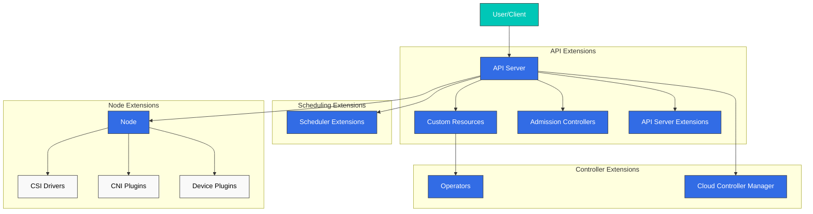
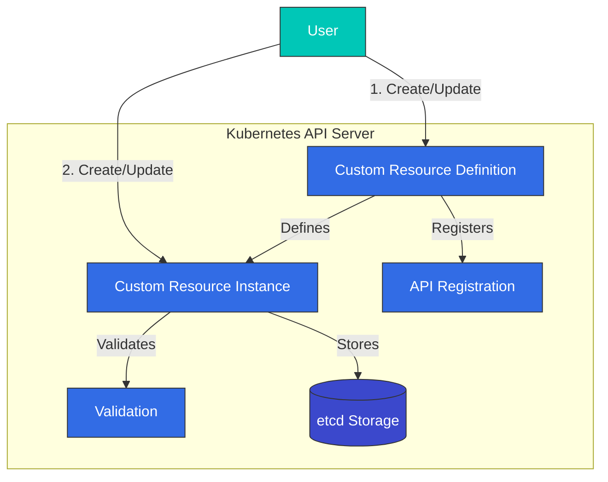
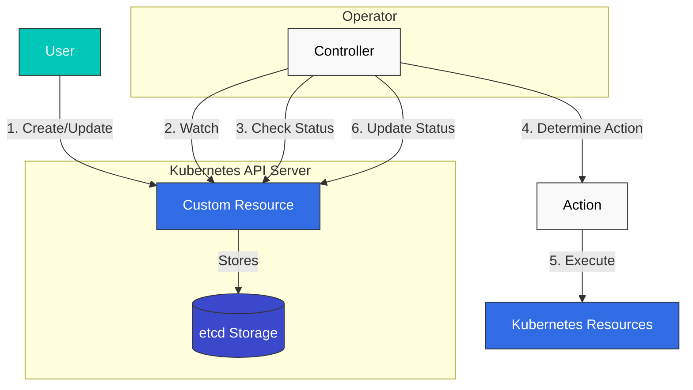
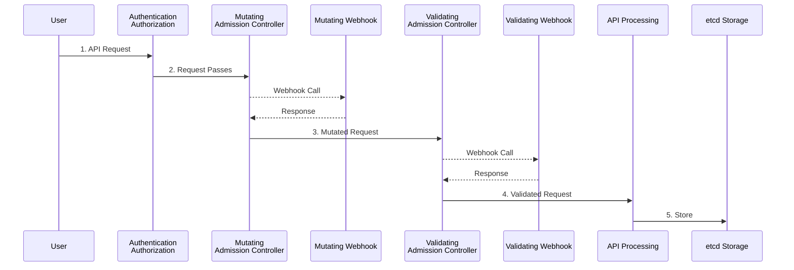
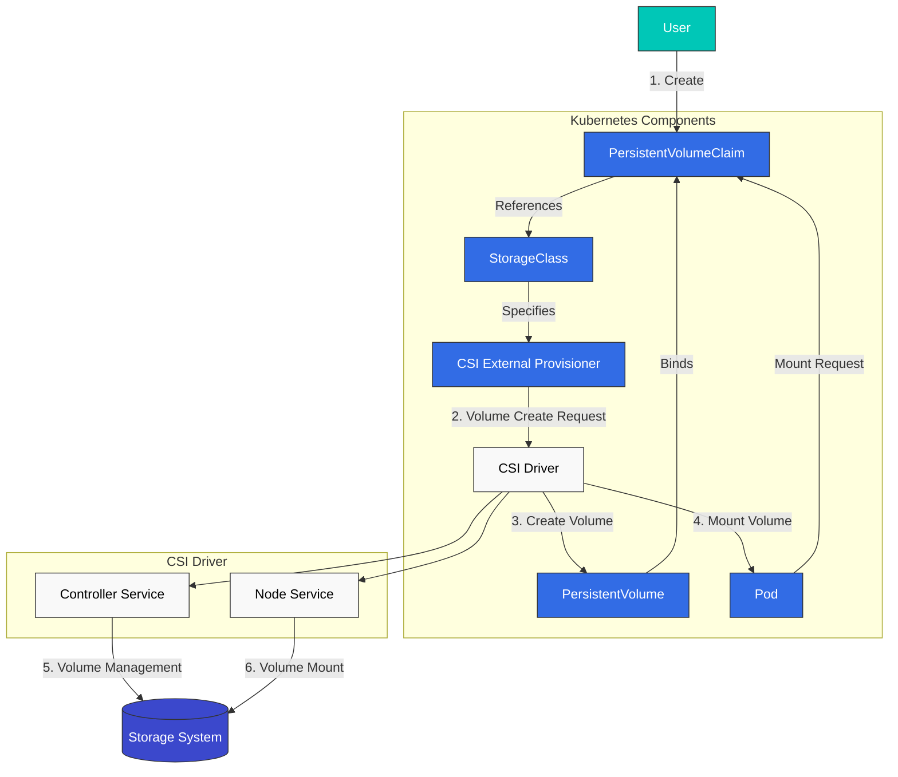
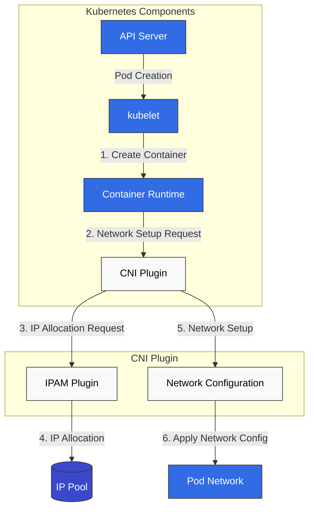
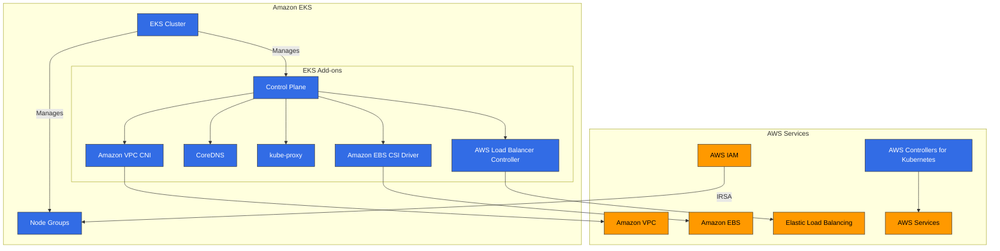

# Extending Kubernetes

> **Supported Versions**: Kubernetes 1.32, 1.33, 1.34
> **Last Updated**: February 19, 2026

Kubernetes is a platform designed with extensibility in mind, allowing you to extend its functionality in various ways. In this chapter, we will explore the various methods to extend Kubernetes and how to leverage extension features in Amazon EKS.

## Table of Contents
1. [Kubernetes Extension Overview](#kubernetes-extension-overview)
2. [Custom Resources](#custom-resources)
3. [Operator Pattern](#operator-pattern)
4. [Admission Controllers](#admission-controllers)
5. [API Server Extensions](#api-server-extensions)
6. [Scheduler Extensions](#scheduler-extensions)
7. [Cloud Controller Manager](#cloud-controller-manager)
8. [CSI (Container Storage Interface)](#csi-container-storage-interface)
9. [CNI (Container Network Interface)](#cni-container-network-interface)
10. [Device Plugins](#device-plugins)
11. [Extension Features in Amazon EKS](#extension-features-in-amazon-eks)
12. [Best Practices](#best-practices)
13. [Conclusion](#conclusion)

## Kubernetes Extension Overview

Kubernetes provides various extension points to extend and customize its base functionality. The main extension points are:

1. **Custom Resources**: Define new API object types
2. **Operators**: Combine custom resources and controllers to manage complex applications
3. **Admission Controllers**: Intercept, modify, or validate API requests
4. **API Server Extensions**: Add new endpoints to the API server
5. **Scheduler Extensions**: Customize pod scheduling logic
6. **Cloud Controller Manager**: Integrate cloud provider-specific features
7. **CSI (Container Storage Interface)**: Integrate storage systems
8. **CNI (Container Network Interface)**: Integrate networking solutions
9. **Device Plugins**: Integrate special hardware

The following diagram shows the main extension points in Kubernetes:



### Choosing an Extension Method

Considerations when choosing an appropriate extension method:

1. **Use Case**: The type of functionality you want to extend
2. **Complexity**: Complexity of implementation and maintenance
3. **Performance Impact**: Impact of the extension on cluster performance
4. **Upgrade Compatibility**: Compatibility with Kubernetes version upgrades
5. **Community Support**: Level of community support for the extension method

## Custom Resources

Custom resources are a way to extend the Kubernetes API to define new object types.

The following diagram shows how custom resources work:



### Custom Resource Definitions (CRD)

CRD is the simplest way to define new resource types:

```yaml
apiVersion: apiextensions.k8s.io/v1
kind: CustomResourceDefinition
metadata:
  name: backups.example.com
spec:
  group: example.com
  names:
    kind: Backup
    listKind: BackupList
    plural: backups
    singular: backup
    shortNames:
    - bk
  scope: Namespaced
  versions:
  - name: v1
    served: true
    storage: true
    schema:
      openAPIV3Schema:
        type: object
        properties:
          spec:
            type: object
            properties:
              source:
                type: string
              destination:
                type: string
              schedule:
                type: string
            required:
            - source
            - destination
          status:
            type: object
            properties:
              phase:
                type: string
              lastBackupTime:
                type: string
                format: date-time
    subresources:
      status: {}
    additionalPrinterColumns:
    - name: Status
      type: string
      jsonPath: .status.phase
    - name: Age
      type: date
      jsonPath: .metadata.creationTimestamp
```

In the above example, we define a new resource type called `Backup` and specify the resource's schema and additional printer columns.

### Creating Custom Resource Instances

After defining a CRD, you can create resource instances of that type:

```yaml
apiVersion: example.com/v1
kind: Backup
metadata:
  name: daily-backup
spec:
  source: /data
  destination: s3://my-bucket/backups
  schedule: "0 0 * * *"
```

### Custom Resource Validation

You can validate custom resources using OpenAPI v3 schemas in CRDs:

```yaml
openAPIV3Schema:
  type: object
  properties:
    spec:
      type: object
      properties:
        replicas:
          type: integer
          minimum: 1
          maximum: 10
        image:
          type: string
          pattern: '^[a-zA-Z0-9./:_-]+$'
      required:
      - replicas
      - image
```

In the above example, the `replicas` field must be an integer between 1 and 10, and the `image` field must match the specified pattern.

### Version Management

CRDs support multiple versions to enable API evolution:

```yaml
versions:
- name: v1alpha1
  served: true
  storage: false
- name: v1beta1
  served: true
  storage: false
- name: v1
  served: true
  storage: true
```

In the above example, three versions `v1alpha1`, `v1beta1`, and `v1` are served, but data is stored in `v1` format.

### Conversion Webhooks

You can use conversion webhooks to handle conversions between different versions:

```yaml
apiVersion: apiextensions.k8s.io/v1
kind: CustomResourceDefinition
metadata:
  name: backups.example.com
spec:
  # ... other fields omitted ...
  conversion:
    strategy: Webhook
    webhook:
      clientConfig:
        service:
          namespace: default
          name: example-conversion-webhook
          path: /convert
      conversionReviewVersions:
      - v1
```

## Operator Pattern

The operator pattern is a way to automate operational knowledge of complex applications by combining custom resources and controllers.

The following diagram shows how the operator pattern works:



### Operator Concepts

An operator consists of the following components:

1. **Custom Resource Definition (CRD)**: Defines the schema of resources to manage
2. **Controller**: Logic that monitors custom resources and reconciles them to the desired state
3. **Kubernetes API Client**: Client for interacting with the Kubernetes API

### Operator Example

Database operator example:

```yaml
# Custom Resource Definition
apiVersion: apiextensions.k8s.io/v1
kind: CustomResourceDefinition
metadata:
  name: databases.example.com
spec:
  group: example.com
  names:
    kind: Database
    listKind: DatabaseList
    plural: databases
    singular: database
    shortNames:
    - db
  scope: Namespaced
  versions:
  - name: v1
    served: true
    storage: true
    schema:
      openAPIV3Schema:
        type: object
        properties:
          spec:
            type: object
            properties:
              engine:
                type: string
                enum:
                - mysql
                - postgresql
              version:
                type: string
              storageSize:
                type: string
              replicas:
                type: integer
                minimum: 1
            required:
            - engine
            - version
            - storageSize
          status:
            type: object
            properties:
              phase:
                type: string
              endpoint:
                type: string
    subresources:
      status: {}
```

```yaml
# Database Instance
apiVersion: example.com/v1
kind: Database
metadata:
  name: my-db
spec:
  engine: postgresql
  version: "13.4"
  storageSize: 10Gi
  replicas: 3
```

### Operator Development Tools

Tools for developing operators:

1. **Operator SDK**: Develop operators using Go, Ansible, or Helm
2. **KUDO (Kubernetes Universal Declarative Operator)**: Develop operators declaratively
3. **Kubebuilder**: Go-based operator development framework
4. **Metacontroller**: Webhook-based operator development

#### Operator SDK Example

Creating an operator using Operator SDK:

```bash
# Install Operator SDK
curl -LO https://github.com/operator-framework/operator-sdk/releases/download/v1.16.0/operator-sdk_linux_amd64
chmod +x operator-sdk_linux_amd64
mv operator-sdk_linux_amd64 /usr/local/bin/operator-sdk

# Create new operator project
operator-sdk init --domain example.com --repo github.com/example/database-operator

# Create API
operator-sdk create api --group database --version v1 --kind Database --resource --controller

# Implement controller (main.go, controllers/database_controller.go, etc.)

# Build and deploy operator
make docker-build docker-push
make deploy
```

### Popular Operators

Popular open source operators:

1. **Prometheus Operator**: Manages Prometheus monitoring stack
2. **Elasticsearch Operator**: Manages Elasticsearch clusters
3. **etcd Operator**: Manages etcd clusters
4. **PostgreSQL Operator**: Manages PostgreSQL databases
5. **Jaeger Operator**: Manages Jaeger distributed tracing system
6. **Strimzi Kafka Operator**: Manages Apache Kafka clusters
7. **Istio Operator**: Manages Istio service mesh
## Admission Controllers

Admission controllers are plugins that intercept requests to the Kubernetes API server and modify or validate them.

The following diagram shows how admission controllers work:



### Admission Controller Types

Kubernetes has two types of admission controllers:

1. **Mutating Admission Controllers**: Can modify resources
2. **Validating Admission Controllers**: Can only validate resources

### Built-in Admission Controllers

Kubernetes has several built-in admission controllers:

1. **NamespaceLifecycle**: Prevents resource creation in namespaces being deleted
2. **LimitRanger**: Sets default resource limits for pods and containers
3. **ServiceAccount**: Auto-creates service accounts and adds tokens
4. **DefaultStorageClass**: Assigns default storage class to PVCs
5. **ResourceQuota**: Limits resource usage per namespace
6. **PodSecurityPolicy**: Applies pod security policies
7. **NodeRestriction**: Limits resources nodes can modify

### Webhook Admission Controllers

You can use webhook admission controllers to implement custom logic:

```yaml
# Mutating Webhook Configuration
apiVersion: admissionregistration.k8s.io/v1
kind: MutatingWebhookConfiguration
metadata:
  name: pod-mutating-webhook
webhooks:
- name: pod-mutator.example.com
  clientConfig:
    service:
      namespace: default
      name: pod-mutating-webhook
      path: "/mutate"
    caBundle: <base64-encoded-ca-cert>
  rules:
  - apiGroups: [""]
    apiVersions: ["v1"]
    resources: ["pods"]
    operations: ["CREATE"]
    scope: "Namespaced"
  admissionReviewVersions: ["v1", "v1beta1"]
  sideEffects: None
  timeoutSeconds: 5
```

```yaml
# Validating Webhook Configuration
apiVersion: admissionregistration.k8s.io/v1
kind: ValidatingWebhookConfiguration
metadata:
  name: pod-validating-webhook
webhooks:
- name: pod-validator.example.com
  clientConfig:
    service:
      namespace: default
      name: pod-validating-webhook
      path: "/validate"
    caBundle: <base64-encoded-ca-cert>
  rules:
  - apiGroups: [""]
    apiVersions: ["v1"]
    resources: ["pods"]
    operations: ["CREATE", "UPDATE"]
    scope: "Namespaced"
  admissionReviewVersions: ["v1", "v1beta1"]
  sideEffects: None
  timeoutSeconds: 5
```

### Webhook Server Implementation

A webhook server must implement endpoints like the following:

```go
// Mutating webhook example
func mutateHandler(w http.ResponseWriter, r *http.Request) {
    var body []byte
    if r.Body != nil {
        if data, err := ioutil.ReadAll(r.Body); err == nil {
            body = data
        }
    }

    // Convert to AdmissionReview object
    admissionReview := v1.AdmissionReview{}
    if err := json.Unmarshal(body, &admissionReview); err != nil {
        http.Error(w, "Could not parse admission review request", http.StatusBadRequest)
        return
    }

    // Extract Pod object
    pod := corev1.Pod{}
    if err := json.Unmarshal(admissionReview.Request.Object.Raw, &pod); err != nil {
        http.Error(w, "Could not parse pod object", http.StatusBadRequest)
        return
    }

    // Create patch
    patches := []map[string]interface{}{
        {
            "op":    "add",
            "path":  "/metadata/labels/injected-by",
            "value": "mutating-webhook",
        },
    }

    patchBytes, _ := json.Marshal(patches)

    // Create response
    admissionResponse := v1.AdmissionResponse{
        UID:     admissionReview.Request.UID,
        Allowed: true,
        Patch:   patchBytes,
        PatchType: func() *v1.PatchType {
            pt := v1.PatchTypeJSONPatch
            return &pt
        }(),
    }

    admissionReview.Response = &admissionResponse
    resp, _ := json.Marshal(admissionReview)
    w.Header().Set("Content-Type", "application/json")
    w.Write(resp)
}
```

```go
// Validating webhook example
func validateHandler(w http.ResponseWriter, r *http.Request) {
    var body []byte
    if r.Body != nil {
        if data, err := ioutil.ReadAll(r.Body); err == nil {
            body = data
        }
    }

    // Convert to AdmissionReview object
    admissionReview := v1.AdmissionReview{}
    if err := json.Unmarshal(body, &admissionReview); err != nil {
        http.Error(w, "Could not parse admission review request", http.StatusBadRequest)
        return
    }

    // Extract Pod object
    pod := corev1.Pod{}
    if err := json.Unmarshal(admissionReview.Request.Object.Raw, &pod); err != nil {
        http.Error(w, "Could not parse pod object", http.StatusBadRequest)
        return
    }

    // Validation logic
    allowed := true
    var message string
    for _, container := range pod.Spec.Containers {
        if container.Image == "nginx:latest" {
            allowed = false
            message = "Using 'latest' tag is not allowed. Please specify a version."
            break
        }
    }

    // Create response
    admissionResponse := v1.AdmissionResponse{
        UID:     admissionReview.Request.UID,
        Allowed: allowed,
    }

    if !allowed {
        admissionResponse.Result = &metav1.Status{
            Message: message,
        }
    }

    admissionReview.Response = &admissionResponse
    resp, _ := json.Marshal(admissionReview)
    w.Header().Set("Content-Type", "application/json")
    w.Write(resp)
}
```

### Popular Admission Controller Projects

1. **OPA Gatekeeper**: Policy enforcement using Open Policy Agent
2. **Kyverno**: YAML-based policy engine
3. **Istio**: Service mesh sidecar injection
4. **cert-manager**: TLS certificate management

## API Server Extensions

API server extensions are a way to add new endpoints to the Kubernetes API server.

### Extension API Servers

Extension API servers are servers that run separately from the Kubernetes API server and provide custom APIs:

```yaml
# APIService Definition
apiVersion: apiregistration.k8s.io/v1
kind: APIService
metadata:
  name: v1.example.com
spec:
  group: example.com
  version: v1
  groupPriorityMinimum: 1000
  versionPriority: 15
  service:
    name: example-api
    namespace: default
  caBundle: <base64-encoded-ca-cert>
```

### Extension API Server Implementation

An extension API server consists of the following components:

1. **API Server**: Provides an interface similar to the Kubernetes API server
2. **Resource Handlers**: Handles requests for specific resource types
3. **Storage Backend**: Stores resource data

```go
// Extension API Server Example
func main() {
    // Server configuration
    config := genericapiserver.NewRecommendedConfig(apiserver.Codecs)
    config.OpenAPIConfig = genericapiserver.DefaultOpenAPIConfig(
        sampleopenapi.GetOpenAPIDefinitions,
        openapi.NewDefinitionNamer(apiserver.Scheme),
    )
    config.EnableIndex = true
    config.EnableDiscovery = true

    // Create server
    server, err := config.Complete().New("sample-apiserver", genericapiserver.NewEmptyDelegate())
    if err != nil {
        log.Fatalf("Error creating server: %v", err)
    }

    // Set API group info
    apiGroupInfo := genericapiserver.NewDefaultAPIGroupInfo(
        samplev1alpha1.GroupName,
        apiserver.Scheme,
        metav1.ParameterCodec,
        apiserver.Codecs,
    )

    // Set storage
    apiGroupInfo.VersionedResourcesStorageMap["v1alpha1"] = map[string]rest.Storage{
        "widgets": NewWidgetStorage(),
    }

    // Install API group
    if err := server.InstallAPIGroup(&apiGroupInfo); err != nil {
        log.Fatalf("Error installing API group: %v", err)
    }

    // Run server
    if err := server.PrepareRun().Run(stopCh); err != nil {
        log.Fatalf("Error running server: %v", err)
    }
}
```

### Aggregation Layer

The aggregation layer makes multiple API servers appear as a single API server:

```
                                   +-----------------+
                                   |                 |
                                   |  kube-apiserver |
                                   |                 |
                                   +-------+---------+
                                           |
                                           v
                      +--------------------+--------------------+
                      |                                         |
                      |                                         |
          +-----------v-----------+               +------------v------------+
          |                       |               |                         |
          |  metrics-server       |               |  example-apiserver      |
          |                       |               |                         |
          +-----------------------+               +-------------------------+
```

## Scheduler Extensions

Scheduler extensions are a way to customize the behavior of the Kubernetes scheduler.

### Scheduler Framework

The scheduler framework introduced in Kubernetes 1.15 allows extending various stages of the scheduling pipeline through plugins:

1. **Queue Sort**: Sort pods in the scheduling queue
2. **Pre-filter**: Check pod and cluster state before filtering
3. **Filter**: Filter out nodes that cannot run the pod
4. **Post-filter**: Perform actions after filtering
5. **Pre-score**: Perform actions before score calculation
6. **Score**: Assign scores to nodes
7. **Normalize Score**: Normalize scores
8. **Reserve**: Reserve resources for the pod
9. **Permit**: Allow, deny, or delay pod scheduling
10. **Pre-bind**: Perform actions before binding
11. **Bind**: Bind the pod to a node
12. **Post-bind**: Perform actions after binding

### Scheduler Configuration

Scheduler configuration example:

```yaml
apiVersion: kubescheduler.config.k8s.io/v1beta1
kind: KubeSchedulerConfiguration
leaderElection:
  leaderElect: true
clientConnection:
  kubeconfig: /etc/kubernetes/scheduler.conf
profiles:
- schedulerName: default-scheduler
  plugins:
    queueSort:
      enabled:
      - name: PrioritySort
    preFilter:
      enabled:
      - name: NodeResourcesFit
      - name: NodePorts
      - name: PodTopologySpread
      - name: InterPodAffinity
      - name: VolumeBinding
      - name: NodeAffinity
    filter:
      enabled:
      - name: NodeUnschedulable
      - name: NodeName
      - name: TaintToleration
      - name: NodeAffinity
      - name: NodePorts
      - name: NodeResourcesFit
      - name: VolumeRestrictions
      - name: EBSLimits
      - name: GCEPDLimits
      - name: NodeVolumeLimits
      - name: AzureDiskLimits
      - name: VolumeBinding
      - name: VolumeZone
      - name: PodTopologySpread
      - name: InterPodAffinity
    postFilter:
      enabled:
      - name: DefaultPreemption
    preScore:
      enabled:
      - name: InterPodAffinity
      - name: PodTopologySpread
      - name: TaintToleration
      - name: NodeAffinity
    score:
      enabled:
      - name: NodeResourcesBalancedAllocation
        weight: 1
      - name: ImageLocality
        weight: 1
      - name: InterPodAffinity
        weight: 1
      - name: NodeResourcesFit
        weight: 1
      - name: NodeAffinity
        weight: 1
      - name: PodTopologySpread
        weight: 2
      - name: TaintToleration
        weight: 1
    reserve:
      enabled:
      - name: VolumeBinding
    permit:
      enabled: []
    preBind:
      enabled:
      - name: VolumeBinding
    bind:
      enabled:
      - name: DefaultBinder
    postBind:
      enabled: []
```

### Custom Scheduler

You can also implement your own scheduler to run alongside Kubernetes:

```yaml
apiVersion: apps/v1
kind: Deployment
metadata:
  name: custom-scheduler
  namespace: kube-system
spec:
  replicas: 1
  selector:
    matchLabels:
      app: custom-scheduler
  template:
    metadata:
      labels:
        app: custom-scheduler
    spec:
      serviceAccountName: custom-scheduler
      containers:
      - name: custom-scheduler
        image: example/custom-scheduler:v1.0.0
        command:
        - /custom-scheduler
        - --kubeconfig=/etc/kubernetes/scheduler.conf
        volumeMounts:
        - name: kubeconfig
          mountPath: /etc/kubernetes/scheduler.conf
          readOnly: true
      volumes:
      - name: kubeconfig
        hostPath:
          path: /etc/kubernetes/scheduler.conf
          type: File
```

Specifying a custom scheduler for a pod:

```yaml
apiVersion: v1
kind: Pod
metadata:
  name: custom-scheduled-pod
spec:
  schedulerName: custom-scheduler
  containers:
  - name: container
    image: nginx
```

## Cloud Controller Manager

The cloud controller manager provides an interface between Kubernetes and cloud providers.

### Cloud Controller Manager Components

The cloud controller manager consists of the following controllers:

1. **Node Controller**: Updates node information through cloud provider APIs
2. **Route Controller**: Sets up routes in cloud networks
3. **Service Controller**: Creates, updates, and deletes cloud load balancers

### AWS Cloud Controller Manager

AWS Cloud Controller Manager configuration example:

```yaml
apiVersion: v1
kind: ConfigMap
metadata:
  name: aws-cloud-controller-manager
  namespace: kube-system
data:
  cloud.conf: |
    [global]
    zone = us-east-1a
    vpc = vpc-xxx
    subnet-id = subnet-xxx
    role-arn = arn:aws:iam::xxx:role/xxx
    kubernetes.io/cluster/my-cluster = owned
---
apiVersion: apps/v1
kind: DaemonSet
metadata:
  name: aws-cloud-controller-manager
  namespace: kube-system
spec:
  selector:
    matchLabels:
      k8s-app: aws-cloud-controller-manager
  template:
    metadata:
      labels:
        k8s-app: aws-cloud-controller-manager
    spec:
      nodeSelector:
        node-role.kubernetes.io/master: ""
      tolerations:
      - key: node.cloudprovider.kubernetes.io/uninitialized
        value: "true"
        effect: NoSchedule
      - key: node-role.kubernetes.io/master
        effect: NoSchedule
      serviceAccountName: cloud-controller-manager
      containers:
      - name: aws-cloud-controller-manager
        image: k8s.gcr.io/cloud-controller-manager:v1.21.0
        command:
        - /usr/local/bin/cloud-controller-manager
        - --cloud-provider=aws
        - --cloud-config=/etc/kubernetes/cloud.conf
        - --use-service-account-credentials
        - --allocate-node-cidrs=false
        volumeMounts:
        - name: cloud-config
          mountPath: /etc/kubernetes/cloud.conf
          readOnly: true
      volumes:
      - name: cloud-config
        configMap:
          name: aws-cloud-controller-manager
```
## CSI (Container Storage Interface)

CSI provides a standard interface between Kubernetes and storage systems.

The following diagram shows the architecture and operation of CSI:



### CSI Architecture

CSI consists of the following components:

1. **CSI Controller Plugin**: Handles volume creation, deletion, snapshots, etc.
2. **CSI Node Plugin**: Handles volume mount, unmount, etc.
3. **CSI Driver**: Implementation that integrates with specific storage systems

```
+-------------------+
|                   |
|  Kubernetes       |
|  (External        |
|   Provisioner)    |
|                   |
+--------+----------+
         |
         | gRPC
         v
+--------+----------+
|                   |
|  CSI Driver       |
|                   |
+--------+----------+
         |
         | Storage Protocol
         v
+--------+----------+
|                   |
|  Storage System   |
|                   |
+-------------------+
```

### CSI Driver Deployment

CSI driver deployment example:

```yaml
# CSI Controller Service
apiVersion: apps/v1
kind: Deployment
metadata:
  name: csi-controller
spec:
  replicas: 1
  selector:
    matchLabels:
      app: csi-controller
  template:
    metadata:
      labels:
        app: csi-controller
    spec:
      serviceAccountName: csi-controller
      containers:
      - name: csi-provisioner
        image: k8s.gcr.io/sig-storage/csi-provisioner:v2.1.0
        args:
        - "--csi-address=$(ADDRESS)"
        - "--v=5"
        env:
        - name: ADDRESS
          value: /var/lib/csi/sockets/pluginproxy/csi.sock
        volumeMounts:
        - name: socket-dir
          mountPath: /var/lib/csi/sockets/pluginproxy/
      - name: csi-attacher
        image: k8s.gcr.io/sig-storage/csi-attacher:v3.1.0
        args:
        - "--csi-address=$(ADDRESS)"
        - "--v=5"
        env:
        - name: ADDRESS
          value: /var/lib/csi/sockets/pluginproxy/csi.sock
        volumeMounts:
        - name: socket-dir
          mountPath: /var/lib/csi/sockets/pluginproxy/
      - name: csi-driver
        image: example/csi-driver:v1.0.0
        args:
        - "--endpoint=$(CSI_ENDPOINT)"
        - "--nodeid=$(NODE_ID)"
        env:
        - name: CSI_ENDPOINT
          value: unix:///var/lib/csi/sockets/pluginproxy/csi.sock
        - name: NODE_ID
          valueFrom:
            fieldRef:
              fieldPath: spec.nodeName
        volumeMounts:
        - name: socket-dir
          mountPath: /var/lib/csi/sockets/pluginproxy/
      volumes:
      - name: socket-dir
        emptyDir: {}

# CSI Node Service
apiVersion: apps/v1
kind: DaemonSet
metadata:
  name: csi-node
spec:
  selector:
    matchLabels:
      app: csi-node
  template:
    metadata:
      labels:
        app: csi-node
    spec:
      serviceAccountName: csi-node
      hostNetwork: true
      containers:
      - name: csi-node-driver-registrar
        image: k8s.gcr.io/sig-storage/csi-node-driver-registrar:v2.1.0
        args:
        - "--csi-address=$(ADDRESS)"
        - "--kubelet-registration-path=$(DRIVER_REG_SOCK_PATH)"
        - "--v=5"
        env:
        - name: ADDRESS
          value: /csi/csi.sock
        - name: DRIVER_REG_SOCK_PATH
          value: /var/lib/kubelet/plugins/example.csi.k8s.io/csi.sock
        volumeMounts:
        - name: plugin-dir
          mountPath: /csi
        - name: registration-dir
          mountPath: /registration
      - name: csi-driver
        image: example/csi-driver:v1.0.0
        args:
        - "--endpoint=$(CSI_ENDPOINT)"
        - "--nodeid=$(NODE_ID)"
        env:
        - name: CSI_ENDPOINT
          value: unix:///csi/csi.sock
        - name: NODE_ID
          valueFrom:
            fieldRef:
              fieldPath: spec.nodeName
        securityContext:
          privileged: true
        volumeMounts:
        - name: plugin-dir
          mountPath: /csi
        - name: pods-mount-dir
          mountPath: /var/lib/kubelet/pods
          mountPropagation: "Bidirectional"
      volumes:
      - name: plugin-dir
        hostPath:
          path: /var/lib/kubelet/plugins/example.csi.k8s.io
          type: DirectoryOrCreate
      - name: registration-dir
        hostPath:
          path: /var/lib/kubelet/plugins_registry
          type: Directory
      - name: pods-mount-dir
        hostPath:
          path: /var/lib/kubelet/pods
          type: Directory
```

### Storage Class and PVC

Storage class and PVC example using CSI driver:

```yaml
# Storage Class
apiVersion: storage.k8s.io/v1
kind: StorageClass
metadata:
  name: example-csi
provisioner: example.csi.k8s.io
parameters:
  type: ssd
  fsType: ext4
reclaimPolicy: Delete
allowVolumeExpansion: true
volumeBindingMode: Immediate

# PVC
apiVersion: v1
kind: PersistentVolumeClaim
metadata:
  name: example-pvc
spec:
  accessModes:
  - ReadWriteOnce
  resources:
    requests:
      storage: 10Gi
  storageClassName: example-csi
```

### Popular CSI Drivers

1. **AWS EBS CSI Driver**: AWS EBS volume management
2. **AWS EFS CSI Driver**: AWS EFS file system management
3. **GCE PD CSI Driver**: Google Compute Engine persistent disk management
4. **Azure Disk CSI Driver**: Azure disk management
5. **Ceph RBD CSI Driver**: Ceph RBD volume management
6. **NFS CSI Driver**: NFS volume management

## CNI (Container Network Interface)

CNI provides a standard interface between Kubernetes and networking solutions.

The following diagram shows the architecture and operation of CNI:



### CNI Architecture

CNI consists of the following components:

1. **CNI Plugin**: Configures container network interfaces
2. **IPAM Plugin**: IP address allocation and management
3. **Meta Plugin**: Combines multiple plugins together

```
+-------------------+
|                   |
|  Kubernetes       |
|  (kubelet)        |
|                   |
+--------+----------+
         |
         | CNI Spec
         v
+--------+----------+
|                   |
|  CNI Plugin       |
|                   |
+--------+----------+
         |
         | Network Configuration
         v
+--------+----------+
|                   |
|  Network          |
|                   |
+-------------------+
```

### CNI Plugin Configuration

CNI plugin configuration example:

```json
{
  "cniVersion": "0.4.0",
  "name": "example-network",
  "type": "bridge",
  "bridge": "cni0",
  "isGateway": true,
  "ipMasq": true,
  "ipam": {
    "type": "host-local",
    "subnet": "10.244.0.0/24",
    "routes": [
      { "dst": "0.0.0.0/0" }
    ]
  }
}
```

### Popular CNI Plugins

1. **Calico**: CNI with enhanced network policy and security features
2. **Flannel**: Provides simple overlay networking
3. **Cilium**: eBPF-based networking and security solution
4. **Weave Net**: Multi-host container networking solution
5. **AWS VPC CNI**: CNI integrated with AWS VPC
6. **Azure CNI**: CNI integrated with Azure virtual networks
7. **Antrea**: Open vSwitch-based networking solution

### CNI Plugin Installation

Calico CNI plugin installation example:

```bash
kubectl apply -f https://docs.projectcalico.org/manifests/calico.yaml
```

## Device Plugins

Device plugins provide an interface between Kubernetes and special hardware.

### Device Plugin Architecture

Device plugins consist of the following components:

1. **Device Plugin Server**: Handles device discovery, allocation, initialization, etc.
2. **kubelet**: Communicates with device plugins to allocate devices to pods

```
+-------------------+
|                   |
|  Kubernetes       |
|  (kubelet)        |
|                   |
+--------+----------+
         |
         | Device Plugin API
         v
+--------+----------+
|                   |
|  Device Plugin    |
|                   |
+--------+----------+
         |
         | Device Management
         v
+--------+----------+
|                   |
|  Hardware Device  |
|                   |
+-------------------+
```

### NVIDIA GPU Device Plugin

NVIDIA GPU device plugin deployment example:

```yaml
apiVersion: apps/v1
kind: DaemonSet
metadata:
  name: nvidia-device-plugin-daemonset
  namespace: kube-system
spec:
  selector:
    matchLabels:
      name: nvidia-device-plugin-ds
  template:
    metadata:
      labels:
        name: nvidia-device-plugin-ds
    spec:
      tolerations:
      - key: nvidia.com/gpu
        operator: Exists
        effect: NoSchedule
      containers:
      - name: nvidia-device-plugin-ctr
        image: nvidia/k8s-device-plugin:v0.9.0
        securityContext:
          allowPrivilegeEscalation: false
          capabilities:
            drop: ["ALL"]
        volumeMounts:
        - name: device-plugin
          mountPath: /var/lib/kubelet/device-plugins
      volumes:
      - name: device-plugin
        hostPath:
          path: /var/lib/kubelet/device-plugins
```

### GPU Request Pod

Pod example requesting GPU:

```yaml
apiVersion: v1
kind: Pod
metadata:
  name: gpu-pod
spec:
  containers:
  - name: cuda-container
    image: nvidia/cuda:11.0-base
    command: ["nvidia-smi"]
    resources:
      limits:
        nvidia.com/gpu: 1
```

### Popular Device Plugins

1. **NVIDIA GPU Device Plugin**: NVIDIA GPU management
2. **AMD GPU Device Plugin**: AMD GPU management
3. **FPGA Device Plugin**: FPGA device management
4. **InfiniBand Device Plugin**: InfiniBand device management
5. **SR-IOV Network Device Plugin**: SR-IOV network device management

## Extension Features in Amazon EKS

Amazon EKS supports various extension features to extend Kubernetes cluster functionality.

The following diagram shows the extension feature architecture in Amazon EKS:



### EKS Add-ons

Amazon EKS provides the following add-ons:

1. **Amazon VPC CNI**: Networking integrated with AWS VPC
2. **CoreDNS**: DNS service within the cluster
3. **kube-proxy**: Network proxy
4. **Amazon EBS CSI Driver**: EBS volume management
5. **AWS Load Balancer Controller**: AWS load balancer management

```bash
# List EKS add-ons
aws eks list-addons --cluster-name my-cluster

# Install EKS add-on
aws eks create-addon \
  --cluster-name my-cluster \
  --addon-name amazon-ebs-csi-driver \
  --service-account-role-arn arn:aws:iam::123456789012:role/AmazonEKS_EBS_CSI_DriverRole

# Update EKS add-on
aws eks update-addon \
  --cluster-name my-cluster \
  --addon-name amazon-ebs-csi-driver \
  --addon-version v1.5.0-eksbuild.1

# Delete EKS add-on
aws eks delete-addon \
  --cluster-name my-cluster \
  --addon-name amazon-ebs-csi-driver
```

### AWS Controllers for Kubernetes (ACK)

ACK is a collection of operators that allows managing AWS resources from Kubernetes:

```bash
# Install ACK controller
helm repo add ack-controller https://aws.github.io/aws-controllers-k8s
helm install ack-s3-controller ack-controller/s3-chart

# Create S3 bucket
cat <<EOF | kubectl apply -f -
apiVersion: s3.services.k8s.aws/v1alpha1
kind: Bucket
metadata:
  name: my-bucket
spec:
  name: my-bucket-123456
EOF
```

### AWS Load Balancer Controller

The AWS Load Balancer Controller integrates Kubernetes services and ingresses with AWS load balancers:

```yaml
# ALB Ingress example
apiVersion: networking.k8s.io/v1
kind: Ingress
metadata:
  name: example-ingress
  annotations:
    kubernetes.io/ingress.class: alb
    alb.ingress.kubernetes.io/scheme: internet-facing
    alb.ingress.kubernetes.io/target-type: ip
spec:
  rules:
  - host: example.com
    http:
      paths:
      - path: /
        pathType: Prefix
        backend:
          service:
            name: example-service
            port:
              number: 80
```

### IAM Roles for Service Accounts (IRSA)

IRSA allows pods to securely access AWS services by associating AWS IAM roles with Kubernetes service accounts:

```bash
# Create OIDC provider
eksctl utils associate-iam-oidc-provider \
  --cluster my-cluster \
  --approve

# Create IAM role and service account
eksctl create iamserviceaccount \
  --cluster my-cluster \
  --namespace default \
  --name my-service-account \
  --attach-policy-arn arn:aws:iam::aws:policy/AmazonS3ReadOnlyAccess \
  --approve

# Pod using service account
cat <<EOF | kubectl apply -f -
apiVersion: v1
kind: Pod
metadata:
  name: s3-reader
spec:
  serviceAccountName: my-service-account
  containers:
  - name: aws-cli
    image: amazon/aws-cli:latest
    command:
    - sleep
    - "3600"
EOF
```

## Best Practices

Let's explore best practices to consider when implementing Kubernetes extension features.

### Design Best Practices

1. **Use Standard Interfaces**: Use standard interfaces like CSI, CNI when possible
2. **Declarative API Design**: Design declarative APIs rather than imperative
3. **Follow Kubernetes Design Principles**: Follow principles like controller pattern, level-triggering
4. **Version Management**: Manage API versions and maintain compatibility
5. **Least Privilege Principle**: Grant only the minimum necessary permissions

### Implementation Best Practices

1. **Leverage Reusable Libraries**: Leverage libraries like client-go, controller-runtime
2. **Proper Error Handling**: Proper handling and logging for error situations
3. **Exponential Backoff**: Use exponential backoff for retries
4. **Set Resource Limits**: Set memory and CPU limits
5. **Status Reporting**: Report resource status accurately

### Deployment Best Practices

1. **Gradual Rollout**: Roll out gradually rather than changing everything at once
2. **Version Management**: Avoid using latest tag for images
3. **Health Checks**: Configure appropriate liveness and readiness probes
4. **Logging and Monitoring**: Configure comprehensive logging and monitoring
5. **Documentation**: Document APIs and usage

### Security Best Practices

1. **Least Privilege Principle**: Grant only the minimum necessary permissions
2. **Use RBAC**: Configure appropriate RBAC policies
3. **Network Policies**: Configure appropriate network policies
4. **Image Scanning**: Scan container images for vulnerabilities
5. **Secret Management**: Manage secrets securely

### EKS-Specific Best Practices

1. **Use Managed Add-ons**: Use EKS managed add-ons when possible
2. **Use IRSA**: Use IRSA for per-pod IAM permission management
3. **VPC CNI Configuration**: Configure VPC CNI according to networking requirements
4. **Security Groups**: Configure appropriate security groups
5. **Cost Optimization**: Select appropriate instance types and sizes

## Conclusion

Kubernetes provides various extension points to extend and customize its base functionality. Custom resources, operators, admission controllers, API server extensions, scheduler extensions, CSI, CNI, and device plugins allow you to adapt Kubernetes to various environments and requirements.

Amazon EKS supports these extension features and additionally provides AWS-specific features like EKS add-ons, ACK, AWS Load Balancer Controller, and IRSA to simplify integration between Kubernetes and AWS services.

When implementing Kubernetes extension features, it's important to follow best practices such as using standard interfaces, declarative API design, and the least privilege principle. This allows you to build stable and scalable Kubernetes environments.

## Quiz

To test what you learned in this chapter, try the [Extending Kubernetes Quiz](../quizzes/core/11-extending-kubernetes-quiz.md).
