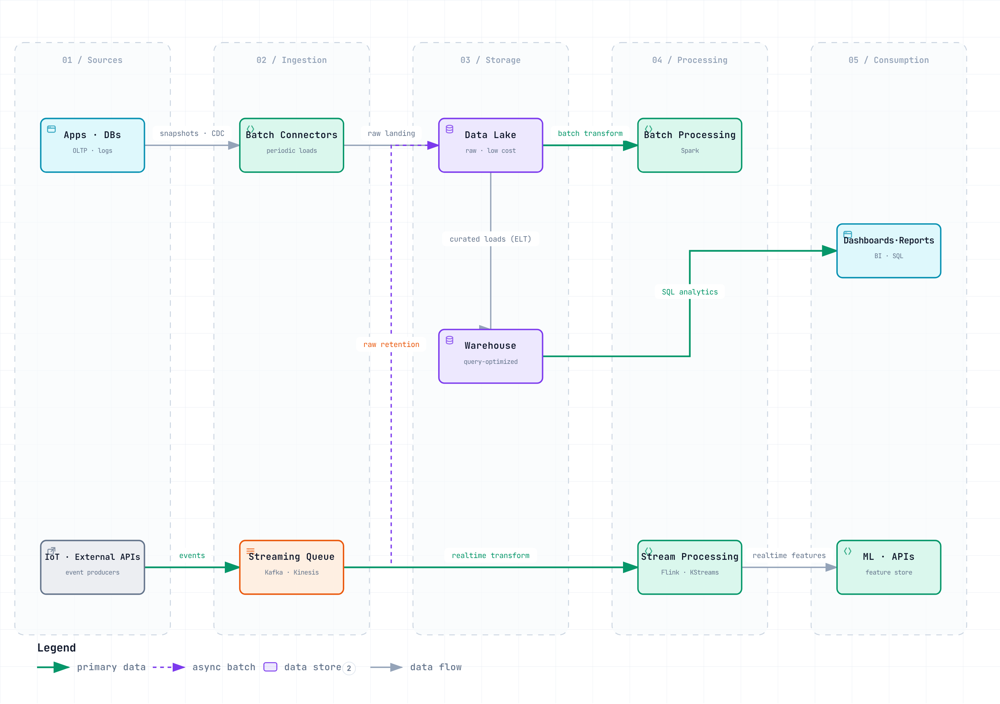

# Anatomy of a Modern Data Pipeline — Five Layers

> **Last Updated**: August 28, 2026

::: tip Where this document fits
Before diving into the Kafka, Spark, Airflow, and Flink deep dives, this page maps out **where each of those tools sits in the overall pipeline and which problem it solves**. If you have operated a data platform before, feel free to skip straight to the deep dives.
:::

A data pipeline is not a single product — it is a **stack of layers**. Each layer plays exactly one role in moving raw inputs toward business-ready insights, and every layer assumes the ones below it already work. That is why, in pipeline design, **the contracts between layers** matter as much as the individual technology choices: what schema, how fresh, and how do we reprocess when something fails.

[🔍 View interactive diagram](https://www.atomai.click/kubernetes-docs/archmaps/en-data-on-eks-01-data-pipeline-anatomy-0.html)

---

## 1. Source Layer — Where Data Is Born

Application databases (OLTP), service logs, IoT devices, and external APIs are the origins. Two decisions are made at this layer:

- **How changes are detected** — periodic full snapshots, or CDC (Change Data Capture) streaming only the deltas. CDC is fresher but depends on the source database's replication log, which makes it fragile against schema changes.
- **How much load the pipeline may put on the source** — a pipeline that slows down the production database defeats its own purpose. Read replicas and log-based extraction are the standard buffers.

## 2. Ingestion Layer — Two Ways to Collect

| | Batch connectors | Streaming queue |
|---|---|---|
| Behavior | Periodic bulk loads | Continuous publish/subscribe of events |
| Latency | Minutes–hours | Milliseconds–seconds |
| Typical tools | Airbyte, Sqoop, in-house batch jobs | **Kafka**, Kinesis, Pulsar |
| Fits | Snapshots, settlement, backfills | Clickstreams, sensors, order events |

Real pipelines almost always use **both**. The key design insight is that the streaming queue is not just a transport — it is the **anchor for reprocessing**. Within Kafka's retention window you can rewind consumer offsets and re-consume after an incident, and that is the foundation the processing layer's correctness guarantees (exactly-once and friends) are built on.

> 📎 For running Kafka yourself on EKS, see the eight-part [Kafka on EKS deep dive](./kafka/README.md).

## 3. Storage Layer — Lake, Warehouse, Lakehouse

| | Data lake | Warehouse | Lakehouse |
|---|---|---|---|
| Stores | Raw as-is (files/objects) | Curated tables | Table format on the lake |
| Strength | Low cost, schema flexibility | Analytical query speed, governance | A compromise of both |
| Weakness | Query performance, "data swamp" risk | Cost, needs curation before load | Ecosystem maturity |
| Typical | S3 | Redshift, Snowflake, BigQuery | Iceberg, Delta Lake, Hudi |

The usual flow is: **land raw data in the lake first** (preserving the ability to reprocess), then load curated versions into the warehouse (ELT). Increasingly, teams put an open table format like Iceberg on S3 so one lake plays both roles — storage in one place, query engines chosen per workload — the lakehouse pattern.

## 4. Processing Layer — Batch and Stream

- **Batch processing** — periodically transforms and aggregates data accumulated in the lake/warehouse. The flagship tool is **Spark**. High throughput and easy re-runs, at the price of latency.
- **Stream processing** — transforms and aggregates events as they arrive from the streaming queue. Flagship tools are **Flink** and Kafka Streams. State management and checkpointing are where the difficulty lives.

The two are not substitutes — they are a **division of labor by latency requirement**. A typical pattern computes the same metric approximately in streaming for a live dashboard, and exactly in batch for settlement.

> 📎 For operations on EKS, see the [Spark on EKS](./spark/README.md) and [Flink on EKS](./flink/README.md) deep dives.

## 5. Consumption Layer — Where Insights Are Delivered

Dashboards and reports (BI), feature stores for ML training/inference, and data APIs called by downstream applications are the final consumers. What matters here is **making the freshness/accuracy contract explicit per consumer**: "dashboards tolerate 5 minutes of lag, settlement reports prioritize exactness, recommendation features must arrive within a second." Those contracts drive the technology choices in the four layers above — in reverse.

## What Cuts Across the Layers

- **Orchestration** — manages dependencies, schedules, and retries between layers. The flagship is **Airflow** (see [Airflow on EKS](./airflow/README.md)). The moment you have more than one pipeline, it becomes mandatory.
- **Schema contracts** — a source schema change silently propagating downstream and breaking consumers is the classic pipeline outage. Schema registries and compatibility rules ([Kafka Part 4](./kafka/04-schema-registry.md)) are the defense.
- **Observability** — answering "why do yesterday's report numbers look wrong?" requires data lineage (which source, through which transforms) and freshness metrics for every layer.

## Through an EKS Lens

Of the five layers, ingestion (Kafka), processing (Spark, Flink), and orchestration (Airflow) are what this section's deep dives cover — all of them can be self-operated on EKS with the Operator pattern, while the storage layer usually lives outside the cluster as S3 (+ a table format) plus a managed warehouse. The trade-offs against fully managed services (MSK, EMR, MWAA) are discussed in the [Data on EKS overview](./README.md).

---

## Next Documents

- [Kafka on EKS](./kafka/README.md) — ingestion layer deep dive
- [Spark on EKS](./spark/README.md) — batch processing deep dive
- [Flink on EKS](./flink/README.md) — stream processing deep dive
- [Airflow on EKS](./airflow/README.md) — orchestration deep dive

## References

The layer breakdown was seeded by Abhishek Agrawal's "Anatomy of a Modern Data Pipeline"
infographic; the explanations and practical commentary were written independently.
