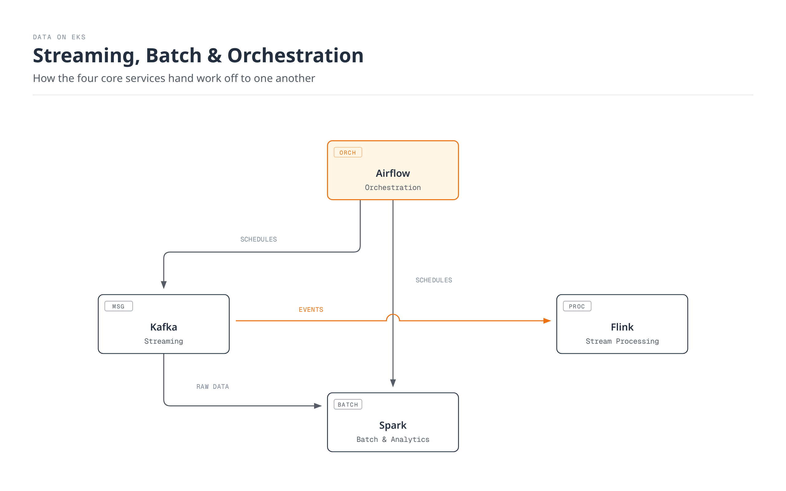

# Data on EKS

> **Last Updated**: July 15, 2026

## Overview

"Data on EKS" covers running the core workloads of the AWS data ecosystem — streaming, batch processing, and workflow orchestration — as Kubernetes-native applications on Amazon EKS, rather than relying solely on fully managed services. By deploying tools like Kafka, Spark, Airflow, and Flink through containers and the Operator pattern, you can manage data workloads with the same deployment, observability, and scaling practices you already use for the rest of your platform on EKS.

This section is not meant to argue against fully managed services such as Amazon MSK, Amazon EMR, or Amazon MWAA. Both approaches involve real trade-offs, and most teams end up choosing — or combining — them based on operational capacity, customization needs, and cost structure. This section focuses on what you need to know once you've decided to run these tools directly on EKS.

## Data Workload Categories

Tools in the data platform space generally fall into four categories, each solving a different problem.

| Category | Problem It Solves | Representative Tool | Data on EKS Coverage |
|----------|--------------------|----------------------|------------------------|
| **Streaming** | Publish/subscribe to events in real time and reliably connect asynchronous communication between systems | Apache Kafka | Available — [Kafka on EKS](kafka/README.md) |
| **Batch & Analytics** | Distributed processing of large datasets for ETL, aggregation, and ML pipelines | Apache Spark | Available — [Spark on EKS](spark/README.md) |
| **Orchestration** | Define dependencies and schedules across data jobs and manage their execution | Apache Airflow | Available — [Airflow on EKS](airflow/README.md) |
| **Stream Processing** | Perform real-time aggregation, transformation, and stateful computation on streaming data | Apache Flink | Available — [Flink on EKS](flink/README.md) |

## Why Run These on EKS

Fully managed services meaningfully reduce operational burden, but more teams are choosing to run these tools natively on EKS for reasons like:

- **Unified operations and observability**: Data workloads can be managed with the same `kubectl`, GitOps workflows, and Prometheus/Grafana stack used across the rest of the platform, instead of maintaining a separate toolchain.
- **Autoscaling**: [Karpenter](../autoscaling/02-karpenter.md)-driven node autoscaling combined with HPA/KEDA lets you scale brokers, workers, and executors precisely to match workload demand.
- **Cost efficiency**: Techniques from [EKS cost optimization](../eks/07-eks-cost-optimization.md) — Spot Instances, improved bin-packing density, and so on — apply just as well to data workloads as to any other service.
- **Multi-tenancy**: Kubernetes isolation primitives — namespaces, ResourceQuotas, NetworkPolicies — let multiple teams and workloads safely share a single cluster.

This approach does come with trade-offs: your team takes on Operator management, storage design, and upgrade strategy directly. The deep dives that follow address that balance in detail for each tool.

## Currently Covered

- [Anatomy of a Modern Data Pipeline](01-data-pipeline-anatomy.md) — An introductory map of the full pipeline in five layers, from sources to consumption, showing which layer each deep dive covers.
- [Kafka on EKS](kafka/README.md) — An 8-part deep dive into deploying and operating Apache Kafka on EKS using the Strimzi Operator.
- [Spark on EKS](spark/README.md) — A 5-part deep dive covering Spark-on-Kubernetes fundamentals, the Spark Operator landscape, Amazon EMR on EKS, and performance/cost tuning.
- [Airflow on EKS](airflow/README.md) — A 5-part deep dive covering Airflow 3's architecture, Helm-based deployment and executor choice, DAG patterns with KubernetesPodOperator, and Amazon MWAA integration.
- [Flink on EKS](flink/README.md) — A 4-part deep dive covering Flink's architecture on Kubernetes, the Flink Kubernetes Operator, state/checkpointing, and operations/HA.

## Next Steps

1. [Kafka on EKS](kafka/README.md) — Strimzi-based Kafka deep dive
2. [Spark on EKS](spark/README.md) — Spark Operator and EMR on EKS deep dive
3. [Airflow on EKS](airflow/README.md) — Helm-based Airflow deployment and DAG patterns deep dive
4. [Flink on EKS](flink/README.md) — Flink Kubernetes Operator and streaming patterns deep dive
