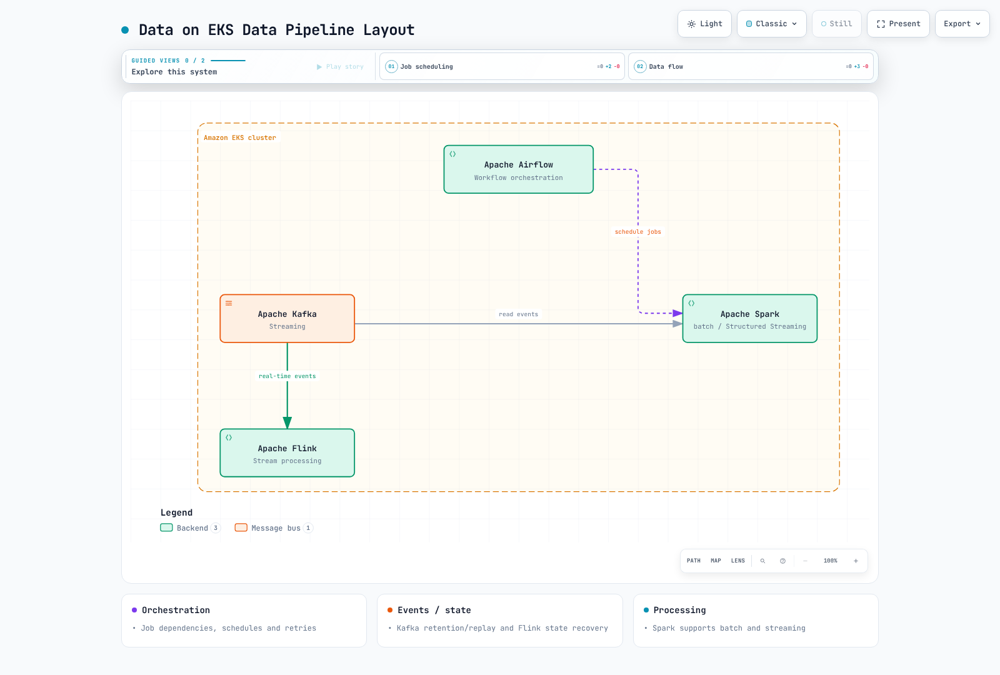

# Data on EKS

> **Last Updated**: September 12, 2026

## Overview

This section covers operating Kafka, Spark, Airflow and Flink on Amazon EKS and connecting them with AWS managed services. Helm charts, Kubernetes Operators and executors provide different deployment, observability, scaling and ownership models.

Compare self-operation with managed choices such as Amazon MSK, EMR and MWAA based on operating capacity, required features, availability and total cost. EMR on EKS manages job execution while leaving responsibility for the underlying EKS cluster. SageMaker Unified Studio is a managed data/AI workspace and governance integration, not software deployed into EKS.

## Data Workload Categories

Distinguish four execution-workload categories and the managed governance area connecting them. A tool can cover multiple roles.

| Category | Problem It Solves | Representative Tool | Data on EKS Coverage |
|----------|--------------------|----------------------|------------------------|
| **Streaming** | Publish/subscribe to events in real time and reliably connect asynchronous communication between systems | Apache Kafka | Available — [Kafka on EKS](kafka/README.md) |
| **Batch & Analytics** | Distributed processing of large datasets for ETL, aggregation, and ML pipelines | Apache Spark | Available — [Spark on EKS](spark/README.md) |
| **Orchestration** | Define dependencies and schedules across data jobs and manage their execution | Apache Airflow | Available — [Airflow on EKS](airflow/README.md) |
| **Stream Processing** | Perform real-time aggregation, transformation, and stateful computation on streaming data | Apache Flink | Available — [Flink on EKS](flink/README.md) |
| **Governed data and AI workspace** | Share data assets, project profiles, tools, and membership within a managed boundary | SageMaker Unified Studio | Available — [Unified Studio governance](sagemaker-unified-studio/README.md) |

[🔍 View interactive diagram](https://www.atomai.click/kubernetes-docs/archmaps/en-data-on-eks-readme-0.html)

## Why Run These on EKS

Evaluate these opportunities and constraints when considering direct operation on EKS:

- **Unified operations and observability**: Reuse existing `kubectl`, GitOps and Prometheus/Grafana practices. Data quality, lineage, query performance and consumer lag still need domain-specific observability.
- **Autoscaling**: [Karpenter](../autoscaling/02-karpenter.md) adjusts node capacity; HPA/KEDA or engine-specific autoscalers adjust supported workers/jobs. Kafka broker changes also require partition reassignment, quorum, storage and Operator support review.
- **Cost efficiency**: Apply Spot and bin-packing where restart, checkpoint and replication requirements permit. Assess [EKS cost optimization](../eks/07-eks-cost-optimization.md) alongside storage, networking and operating costs; do not apply it uniformly to brokers and stateful jobs.
- **Multi-tenancy**: Namespaces, ResourceQuotas and NetworkPolicies are isolation components. Validate actual data permissions, trust levels, authentication, storage and networking; a namespace alone is not complete tenant isolation.

This approach does come with trade-offs: your team takes on Operator management, storage design, and upgrade strategy directly. The deep dives that follow address that balance in detail for each tool.

## Currently Covered

- [Anatomy of a Modern Data Pipeline](01-data-pipeline-anatomy.md) — An introductory map of the full pipeline in five layers, from sources to consumption, showing which layer each deep dive covers.
- [Kafka on EKS](kafka/README.md) — An 8-part deep dive into deploying and operating Apache Kafka on EKS using the Strimzi Operator, plus a Part 9 measured benchmark of a 3-broker RF3 cluster's ingest ceiling on gp3.
- [Spark on EKS](spark/README.md) — A 5-part deep dive covering Spark-on-Kubernetes fundamentals, the Spark Operator landscape, Amazon EMR on EKS, and performance/cost tuning.
- [Airflow on EKS](airflow/README.md) — A 5-part deep dive covering Airflow 3's architecture, Helm-based deployment and executor choice, DAG patterns with KubernetesPodOperator, and Amazon MWAA integration.
- [Flink on EKS](flink/README.md) — A 4-part deep dive covering Flink's architecture on Kubernetes, the Flink Kubernetes Operator, state/checkpointing, and operations/HA.
- [SageMaker Unified Studio governance](sagemaker-unified-studio/README.md) — Domains, project profiles, projects, catalog assets, membership, and deletion lifecycle.

## Next Steps

1. [Kafka on EKS](kafka/README.md) — Strimzi-based Kafka deep dive
2. [Spark on EKS](spark/README.md) — Spark Operator and EMR on EKS deep dive
3. [Airflow on EKS](airflow/README.md) — Helm-based Airflow deployment and DAG patterns deep dive
4. [Flink on EKS](flink/README.md) — Flink Kubernetes Operator and streaming patterns deep dive
5. [SageMaker Unified Studio governance](sagemaker-unified-studio/README.md) — Governance guidance connecting a managed data/AI workspace to EKS pipelines
