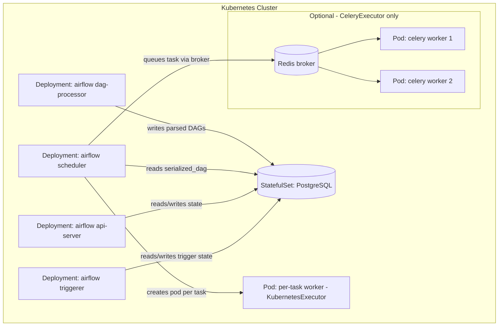

# Part 1: Airflow Architecture on Kubernetes

> **Supported Versions**: Apache Airflow 3.2+, Kubernetes 1.30+\
> **Last Updated**: July 15, 2026

## What is Apache Airflow?

Apache Airflow is a platform for authoring, scheduling, and monitoring workflows defined as directed acyclic graphs (DAGs) of tasks. It is the de facto standard orchestrator for data pipelines — ETL/ELT jobs, ML training pipelines, and cross-system batch workflows — and is commonly deployed on Kubernetes so that individual tasks can scale out as pods rather than compete for capacity on a fixed worker fleet.

Airflow 2 reached end-of-life on April 22, 2026 and no longer receives fixes, so any new deployment should target the **Airflow 3.x** line (3.0 reached general availability in April 2025; the latest stable release as of this writing is 3.3.0). This document covers Airflow 3's component architecture on Kubernetes. Part 2 walks through deploying it on EKS with the official Helm chart and compares the available executors in depth.

## 1. Why Airflow 3 Split the Monolith

In Airflow 2, a single **webserver** process served the UI, the REST API, and authentication, while the **scheduler** process was responsible for both scheduling task instances *and* parsing DAG files to keep its in-memory DAG representation current. Under load — many DAGs, deeply nested DAGs, or expensive top-level code in DAG files — file parsing could starve the scheduler's actual scheduling loop, directly hurting the platform's core reliability guarantee: getting ready tasks queued on time.

Airflow 3 addresses this by decomposing the deployment into four independently scalable services, each with a single responsibility:

* **`airflow api-server`**: A new FastAPI-based service that serves the UI and REST API v2, and owns authentication. It replaces the Flask-based webserver from Airflow 2.
* **`airflow scheduler`**: Now does **only** scheduling — evaluating task dependencies, triggering runs, and queuing task instances. It no longer parses DAG files itself.
* **`airflow dag-processor`**: A **mandatory** new service (it was an optional, opt-in process in 2.x) whose sole job is parsing DAG files and writing the result to the metadata database's `serialized_dag` table. The scheduler reads DAG structure from that table instead of re-parsing files on every loop iteration.
* **`airflow triggerer`**: Runs deferrable operators (unchanged in role from Airflow 2) — tasks that can release their worker slot while waiting on an external event (an API call, a file arriving, another job finishing) and resume asynchronously when that event fires.

Making the dag-processor mandatory and moving parsing fully out of the scheduler's loop is Airflow 3's headline high-availability improvement: a spike in DAG count or a slow, poorly written DAG file can no longer degrade scheduling latency for every other DAG in the deployment. The two concerns scale independently — you can run more dag-processor replicas to absorb a large DAG bag without touching scheduler capacity at all.

### Airflow 2 vs. Airflow 3: What Changed

| Aspect | Airflow 2 | Airflow 3 |
| --- | --- | --- |
| UI/API process | Flask-based `webserver` | FastAPI-based `api-server` (UI + REST API v2 + auth) |
| DAG parsing | Done by the scheduler process itself | Done by the `dag-processor`, a separate mandatory service |
| DAG processor | Optional, opt-in (`--subdir` parsing inside the scheduler by default) | Mandatory — every deployment runs it |
| Scheduler responsibility | Scheduling + DAG file parsing | Scheduling only; reads `serialized_dag` from Postgres |
| Hybrid executors | `CeleryKubernetesExecutor`, `LocalKubernetesExecutor` | Removed — replaced by per-task/per-DAG executor assignment |

### Backing Services

* **PostgreSQL** (metadata database): always required. It stores DAG/task state, the `serialized_dag` table the scheduler reads, connections, variables, and XComs.
* **Redis**: only required if you use `CeleryExecutor` (or `CeleryKubernetesExecutor` in Airflow 2 — see below for why that option no longer exists in 3.x). It backs the Celery task broker between the scheduler and the Celery worker pool.

## 2. Component Diagram on Kubernetes



The dag-processor writes to Postgres; the scheduler only ever reads DAG structure from Postgres. Neither the scheduler nor the api-server ever parses a DAG file directly — DAG file access is isolated to the dag-processor pod(s), which also means DAG authors' code only needs to be readable from that one component's filesystem or mounted volume.

## 3. Executors: The Landscape

Choosing and tuning an executor is Part 2's focus; here we just introduce the options so the component diagram above makes sense in context.

* **`KubernetesExecutor`**: Each task instance is launched as its own pod, scheduled directly by the Kubernetes API. Pods are created on demand and torn down on completion, so idle capacity is close to zero, at the cost of per-task pod startup latency.
* **`CeleryExecutor`**: A pool of warm Celery worker pods stays running and pulls queued tasks from a broker (Redis, as covered above, or RabbitMQ). Task startup is fast since there's no per-task pod to schedule, at the cost of paying for idle worker capacity between bursts.

### Executor Characteristics at a Glance

| Aspect | `KubernetesExecutor` | `CeleryExecutor` |
| --- | --- | --- |
| Task startup unit | A fresh pod per task instance | A task picked up by an already-running worker |
| Idle resource cost | Near zero — no pods when there's nothing to run | Non-zero — the warm worker pool runs whether or not tasks are queued |
| Task startup latency | Higher — pays pod scheduling/image-pull cost per task | Lower — worker is already running |
| Broker dependency | None | Requires Redis (or RabbitMQ) |
| Isolation between tasks | Strong — each task gets its own pod, its own resource limits | Weaker — tasks share a worker pod's resources |

### Hybrid Executors Are Gone in Airflow 3

Airflow 2 offered two hybrid executors, `CeleryKubernetesExecutor` and `LocalKubernetesExecutor`, which let a single Airflow deployment route some tasks to Celery workers and others to Kubernetes pods based on a task-level queue name. Airflow 3.0 **removed both hybrid executor classes**.

The replacement is a more general capability: Airflow 3 lets you configure **multiple executors concurrently** and assign an executor to a task or a whole DAG explicitly (for example, `executor="KubernetesExecutor"` on a single task, while the rest of the DAG uses the deployment's default executor). This is a deliberate simplification — the hybrid executor classes existed only to hard-code one specific two-way split, and each new combination needed its own dedicated hybrid class. Multi-executor configuration generalizes that idea: any of Airflow's executors (not just two) can be assigned per task or per DAG, without a special-cased class for every pairing.

## Lab Environment Setup

Part 2 deploys a working Airflow 3 cluster, so set up these prerequisites now:

* **`kubectl`** configured against an EKS cluster (1.30+) you have admin access to.
* **Helm 3** installed locally.
* **An EKS cluster** with at least one managed node group sized for a handful of small-to-medium pods (the api-server, scheduler, dag-processor, and triggerer are all lightweight; task pods size depends on your workload).
* **A PostgreSQL instance for the metadata database.** You have two options, both covered in Part 2:
  * The official Helm chart's bundled Postgres (a single in-cluster pod backed by a PVC) — fastest to stand up, fine for learning and development.
  * An external Amazon RDS for PostgreSQL instance — the recommended path for anything beyond a lab, since it survives cluster teardown and gets you managed backups/HA.

No Redis setup is needed yet — only provision it if Part 2's executor comparison leads you to `CeleryExecutor`.

```bash
# Add the official Airflow Helm chart repo (used in Part 2)
helm repo add apache-airflow https://airflow.apache.org
helm repo update

# Sanity-check kubectl access before Part 2
kubectl get nodes
kubectl create namespace airflow --dry-run=client -o yaml
```

After Part 2's install, expect to see four separate Deployments (`airflow-api-server`, `airflow-scheduler`, `airflow-dag-processor`, `airflow-triggerer`) plus a Postgres pod or StatefulSet — this is the architecture from the diagram above, running for real.

## Next Steps

This document covered Airflow 3's four-service architecture — api-server, scheduler, dag-processor, and triggerer — why DAG parsing was pulled out of the scheduler and made its own mandatory service, and why the 2.x hybrid executors were replaced by per-task/per-DAG executor assignment. Part 2 deploys this architecture on EKS with the official Helm chart, sets up the metadata database, and does a deeper comparison of `KubernetesExecutor` versus `CeleryExecutor` to help you pick one for your workload.

[Return to Main Page](./README.md)

## Quiz

To test what you've learned in this chapter, try the [Topic Quiz](../../quizzes/data-on-eks/airflow/01-architecture-quiz.md).
