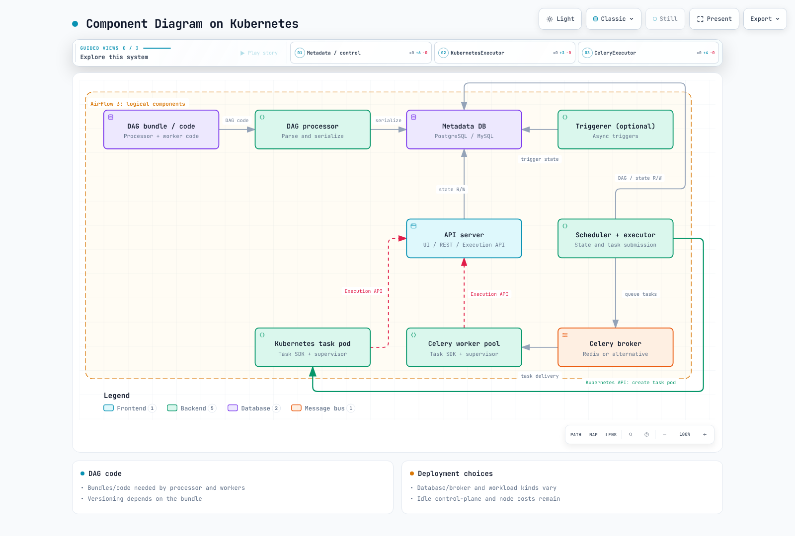

# Part 1: Airflow Architecture on Kubernetes

> **Review baseline**: Airflow 3.3.1 / Helm chart 1.22.0 · September 12, 2026

## 1. Components and task execution

Airflow schedules and observes task instances according to DAG dependencies.
Work can execute in an executor's worker, an external pod or a service the task
invokes. Kubernetes API servers handle requests/state; the scheduler and kubelet
place and start pods.

| Component | Responsibility and scope |
| --- | --- |
| Scheduler + executor | Evaluate DAG/task readiness, submit work, manage state/heartbeats; read and write metadata |
| DAG processor | Access bundles, parse/serialize DAGs and update version-related metadata; a required separate role in Airflow 3 |
| API server | UI, REST API v2 and Execution API; authentication/authorization via the auth manager and deployment configuration |
| Task runtime / worker | Execute operator/Task SDK code and communicate with execution APIs and required services |
| Triggerer | Run deferred tasks' triggers in an async loop; optional without deferral |
| Metadata database | Shared DAG/task state, serialized structures and related metadata |

### Airflow 3's Execution API

In a normal supervised Python Task SDK execution, the worker starts a supervisor
process that runs a task-runner subprocess. User task code communicates with the
supervisor over a socket; the supervisor calls the **Execution API** using a
short-lived task JWT. Public SDK access to Connections, Variables, XComs and state
replaces direct metadata-database access by task code.

Worker-to-API-server addressing, authentication and networking are real
dependencies. A scheduler-to-worker arrow alone does not explain Airflow 3.
Separately inspect executor internals, system workers and stores such as Celery's
result backend; do not generalize this into a claim that no backend process ever
connects to any database. In-process execution such as local dag.test also need
not use the same subprocess/HTTP path as a supervised deployment.

### Triggerer versus worker

An operator starts on a worker and can register a trigger and defer while waiting.
The triggerer runs that trigger; after an event, the task is rescheduled and
resumes on a worker. It does not run the entire operator in the triggerer.
Deferred tasks release worker slots and, by default, pool slots; pool behavior
is configurable. Ordinary async tasks can retain worker slots and are distinct.

## 2. What actually changed between Airflow 2 and 3

Airflow 2 reached EOL on April 22, 2026. The comparison below is migration context.

| Aspect | Airflow 2.x | Airflow 3.x |
| --- | --- | --- |
| UI/API | Flask-based webserver | FastAPI-based api-server and task Execution API paths |
| DAG parsing | Manager and file-processing subprocesses; optional standalone dag-processor | Separate DAG processor is a required role |
| DAG structure | Serialized-DAG scheduling already existed | Continued serialized structures and version metadata |
| Scheduler HA | Database-based multi-scheduler support already existed | HA, capacity and database load still need validation |
| Concurrent executors | Supported from 2.10.0 | Retained and generalized configuration |
| Fixed hybrid executors | LocalKubernetesExecutor and CeleryKubernetesExecutor were available | Unsupported from 3.0 |

It is inaccurate to say Airflow 2 parsed all files in the scheduler's same Python
loop or that scheduler HA only became possible in Airflow 3. Separation helps
independent tuning, but slow fresh-DAG parsing, shared CPU/memory/database
contention and excessive parser concurrency can still affect scheduling latency.
Adding replicas alone does not establish reliability.

## 3. Metadata, brokers and DAG code

Airflow 3.3.1 lists tested PostgreSQL 14–18, MySQL 8.0/8.4/Innovation and SQLite
3.15.0+. **SQLite is for development/testing, not production.** MariaDB is not
supported. PostgreSQL examples in this series do not imply MySQL is unsupported.
Managed databases still need actual HA, backup retention and deletion-policy configuration.

CeleryExecutor needs a compatible broker, with choices such as Redis or RabbitMQ.
KubernetesExecutor and LocalExecutor do not inherently require Redis. Distinguish
metadata storage, the broker and the selected Celery result backend. Connections/
Variables can use a secrets backend; XCom payload storage can also use another backend.

Workers **as well as the DAG processor** need executable DAG/task code and its
packages. Normal task execution does not require the API server to parse DAG
files, but plugins, auth managers and triggers still need appropriate code/
dependency distribution.

| DAG bundle | Current versioning support |
| --- | --- |
| GitDagBundle | Supported |
| LocalDagBundle | Not supported; uses current local code |
| S3DagBundle / GCSDagBundle | Not supported; distinct from object-store versioning |

git-sync remains in chart 1.22.0. Rendering confirms processor/triggerer sidecars
and init containers, plus an init container in the Kubernetes task pod template.
Choose git-sync, image-baked DAGs, a shared volume or remote bundles as appropriate.
Verify whether the bundle preserves the run's code version and which code a retry reads.



[Interactive diagram](https://www.atomai.click/kubernetes-docs/archmaps/en-data-on-eks-airflow-01-architecture-0.html)

## 4. Executor choices and concurrent executors

| Choice | Execution unit | Cost, latency and isolation considerations |
| --- | --- | --- |
| LocalExecutor | Local task processes on the scheduler side | No separate broker; shares scheduler resources/boundary |
| KubernetesExecutor | Worker pod per task instance | Pod/image startup latency; limits and identity depend on the actual pod spec |
| CeleryExecutor | Worker pool consuming broker messages | Warm workers can start quickly; scaling to zero introduces cold starts |

Even without idle KubernetesExecutor worker pods, control-plane, database, node
and logging costs remain. A separate pod does not automatically establish a strong
security boundary. KubernetesPodOperator is an **operator** that launches another
pod; it is distinct from KubernetesExecutor.

With concurrent executors, the first configured entry is the default. A task's
executor field selects one; a DAG can set task defaults using
`default_args={"executor": "KubernetesExecutor"}`, with per-task overrides.
The executor/alias must actually be configured with compatible providers, versions
and permissions. This feature dates to 2.10.0, distinct from hybrid removal in 3.0.

## 5. Prepare for Part 2 and understand validation limits

Chart 1.22.0 targets Helm **3.19.0+** and Airflow **3.1.0+**.
Airflow 3.3.1's tested Kubernetes list is **1.30–1.35**. This is not a blanket
promise for future versions or a recommendation to choose old EKS 1.30.
Also check EKS support periods and the selected provider/chart compatibility.

Part 2 prepares images, database/broker connections, DAG delivery, permissions
and storage. Do not assume the API server, scheduler, processor and triggerer
are always lightweight; measure DAG count, parse cost, API load and task concurrency.

```bash
helm version --short
helm repo add apache-airflow https://airflow.apache.org
helm repo update apache-airflow
helm show chart apache-airflow/airflow --version 1.22.0
kubectl config current-context
# Prints the namespace manifest; does not create it.
kubectl create namespace airflow --dry-run=client -o yaml
```

Do not expect exactly four Deployments. In rendered chart variants the triggerer
is a StatefulSet or Deployment depending on persistence, with additional StatsD,
database, broker or worker resources depending on values. External databases need
no PostgreSQL pod in the cluster.

This chapter renders KubernetesExecutor, CeleryExecutor and git-sync variants with
a 3.3.1 override. Rendering is not a live database, task, image-pull or HA-recovery
test; the environment checks in Part 2 remain necessary.


- [Airflow 3.3.1 architecture](https://airflow.apache.org/docs/apache-airflow/3.3.1/core-concepts/overview.html)
- [Supported versions and lifecycle](https://airflow.apache.org/docs/apache-airflow/3.3.1/installation/supported-versions.html)
- [Airflow prerequisites](https://airflow.apache.org/docs/apache-airflow/3.3.1/installation/prerequisites.html)
- [Executor configuration and history](https://airflow.apache.org/docs/apache-airflow/3.3.1/core-concepts/executor/index.html)
- [DAG bundles](https://airflow.apache.org/docs/apache-airflow/3.3.1/administration-and-deployment/dag-bundles.html)
- [Deferrable operators and triggers](https://airflow.apache.org/docs/apache-airflow/3.3.1/authoring-and-scheduling/deferring.html)
- [Airflow 2.11 DAG processing](https://airflow.apache.org/docs/apache-airflow/2.11.0/authoring-and-scheduling/dagfile-processing.html)
- [Airflow 2.11 scheduler HA](https://airflow.apache.org/docs/apache-airflow/2.11.0/administration-and-deployment/scheduler.html)
- [Official Helm chart](https://airflow.apache.org/docs/helm-chart/1.22.0/index.html)

[Part 2: Helm deployment](02-helm-deployment.md)

[README](README.md)

[Quiz](../../quizzes/data-on-eks/airflow/01-architecture-quiz.md)
