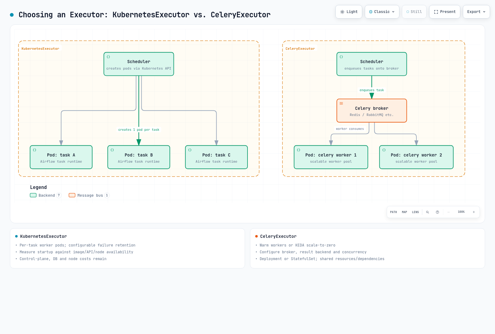

# Part 2: Helm Deployment and Executor Choice

> **Review baseline**: chart 1.22.0 / Airflow 3.3.1 / KEDA 2.20 · September 12, 2026

## 1. Chart identity and actual defaults

This guide uses the official chart in the Apache Airflow repository. Registering
the repository alias apache-airflow makes the Helm chart name
**apache-airflow/airflow**. Do not mix values from independent charts such as
airflow-helm/charts; these are not the only charts that exist.

Chart 1.22.0 defaults to **Airflow 3.2.2 and CeleryExecutor**, not KubernetesExecutor.
The examples explicitly align image tag and airflowVersion to 3.3.1 and select an
executor. Mismatched version fields or digest overrides can make chart-generated
configuration disagree with the actual image.

Use Helm 3.19.0 or later. The release change record specifies this minimum even
though an older Helm 3.0+ statement remains in the packaged README.
Airflow 3.3.1's tested Kubernetes list is 1.30–1.35. Chart 1.16.0's README specified
1.29+, so it did not introduce a 1.30+ requirement. Do not assume Chart.yaml enforces
every documented minimum: templates rendered for 1.29 during review, which does
not demonstrate support.

## 2. Prepare connections and Secrets

This lab assumes namespace permissions, a prepared external PostgreSQL database,
and EKS networking/capacity. Prepare the database schema/user, migration privileges,
tested connection URI/TLS and backup/retention policies. KEDA is needed only for
the Celery scaling profile.

Values below reference Secrets instead of embedding passwords. Store the database
URI as one line in a protected file and URI-encode reserved characters in passwords
and other fields. Use verified TLS for RDS or other remote databases. Any sslrootcert
path must be readable by the actual database client. **KEDA is also a database
client**: Airflow-only CA, DNS, network and access setup is insufficient. The chart
does not automatically copy CA files into KEDA.

This is a **fresh-install** sequence. It does not overwrite existing Secrets.
Do not regenerate Fernet/API/JWT keys during ordinary upgrades; manage backup
and rotation separately.

```bash
set -euo pipefail
# Fresh installation only. Keep existing Fernet/API/JWT keys during an ordinary upgrade.
# AIRFLOW_DB_URI_FILE contains the tested, single-line PostgreSQL URI; do not commit it.
: "${AIRFLOW_DB_URI_FILE:?Set the path to your protected database connection file}"
kubectl create namespace airflow --dry-run=client -o yaml | kubectl apply -f -
kubectl -n airflow create secret generic airflow-metadata \
  --from-file="connection=$AIRFLOW_DB_URI_FILE"

umask 077
AIRFLOW_SECRET_TMP_DIR="$(mktemp -d)"
trap 'rm -rf "$AIRFLOW_SECRET_TMP_DIR"' EXIT
python3 - "$AIRFLOW_SECRET_TMP_DIR" <<'PY'
import base64
from pathlib import Path
import secrets
import sys
folder = Path(sys.argv[1])
(folder / "fernet-key").write_text(base64.urlsafe_b64encode(secrets.token_bytes(32)).decode())
(folder / "api-secret-key").write_text(secrets.token_urlsafe(48))
(folder / "jwt-secret").write_text(secrets.token_urlsafe(48))
PY
kubectl -n airflow create secret generic airflow-fernet \
  --from-file="fernet-key=$AIRFLOW_SECRET_TMP_DIR/fernet-key"
kubectl -n airflow create secret generic airflow-api-secret \
  --from-file="api-secret-key=$AIRFLOW_SECRET_TMP_DIR/api-secret-key"
kubectl -n airflow create secret generic airflow-jwt \
  --from-file="jwt-secret=$AIRFLOW_SECRET_TMP_DIR/jwt-secret"
```

With metadataSecretName set, metadataConnection is not the authoritative connection
source. Disabling bundled PostgreSQL alone does not configure an external database.
For a PostgreSQL URI shared by Airflow and KEDA, verify a scheme both understand,
such as postgresql://; SQLAlchemy-specific +driver schemes may not work in KEDA.

## 3. Explicit KubernetesExecutor installation

Save as kubernetes-values.yaml. This lab disables triggerer persistence; temporary
local logs are not durable history. Part 3 prepares DAG delivery and Part 5 covers
remote logs/storage. Verify post-task log access before production use.

```yaml
airflowVersion: 3.3.1
defaultAirflowTag: 3.3.1
executor: KubernetesExecutor
postgresql:
  enabled: false
redis:
  enabled: false
data:
  metadataSecretName: airflow-metadata
  metadataConnection:
    protocol: postgresql
fernetKeySecretName: airflow-fernet
apiSecretKeySecretName: airflow-api-secret
jwtSecretName: airflow-jwt
createUserJob:
  enabled: false
triggerer:
  persistence:
    enabled: false
config:
  core:
    auth_manager: airflow.providers.fab.auth_manager.fab_auth_manager.FabAuthManager
```

```bash
helm repo add apache-airflow https://airflow.apache.org
helm repo update apache-airflow
helm install airflow apache-airflow/airflow \
  --namespace airflow --version 1.22.0 \
  --values kubernetes-values.yaml --wait --timeout 10m
kubectl -n airflow get deployments,statefulsets,pods,jobs
helm list -n airflow
```

Successful --wait or Running pods do not prove DAG execution. Verify successful
migration jobs and Ready long-running components, then use Part 3's smoke DAG to
check worker startup, Execution API communication, results and logs.

### Initial user

The default createUserJob can create admin/admin, so this profile disables it.
Current values live under createUserJob.defaultUser; webserver.defaultUser is a
compatibility path. Instead of storing a password in values.yaml or Helm --set,
use this interactive command for the selected FAB auth manager. Other auth
managers or SSO require their own user-management procedures.

```bash
# FAB auth manager, as selected in these values. Password is prompted twice.
kubectl -n airflow exec -it deployment/airflow-api-server -c api-server -- \
  airflow users create --username airflow-admin --role Admin \
  --email admin@example.com --firstname Airflow --lastname Admin
kubectl -n airflow port-forward --address 127.0.0.1 service/airflow-api-server 8080:8080
```

With port-forward running, inspect the UI on local port 8080. Production access
needs an appropriate authentication/authorization/TLS path; this command does not
create a public endpoint. API and task-JWT secrets have different roles and need
stable lifecycle management. Losing or casually replacing a Fernet key can make
existing encrypted connections/variables unreadable.

## 4. Choose executors by workload and operations

| Aspect | KubernetesExecutor | CeleryExecutor |
| --- | --- | --- |
| Worker unit | Pod per task instance | Pool consuming broker work |
| Startup | Measure image cache, API/scheduler latency and node availability | Warm capacity can reduce startup; scale-to-zero reintroduces cold starts |
| Idle cost | Control plane, database, nodes and logs remain | Broker, database and node costs remain beyond worker count |
| Resources/isolation | Depend on pod spec, quotas, service accounts, networking and nodes | Concurrent tasks share worker resources/dependencies |
| Additional requirements | Task runtime/image, DAG delivery and Kubernetes API rights | Broker, result backend, worker lifecycle, queues and concurrency |

Do not assume a fixed 1–2 minute startup or universal high-volume superiority.
A KubernetesExecutor worker image needs a compatible **Airflow task runtime and
DAG dependencies**; it is not an arbitrary GPU/CLI image. KubernetesPodOperator
launches a separate child pod with a workload image and is a different path.
Failed-pod retention/deletion also depends on provider configuration.

Concurrent executors are available, but mixed operation is not mandatory for most
deployments. Compare single-executor simplicity with measured benefits and added
policies for your actual workload.



[Interactive diagram](https://www.atomai.click/kubernetes-docs/archmaps/en-data-on-eks-airflow-02-helm-deployment-0.html)

## 5. Scale Celery workers

Prepare the external broker and result backend first. These Secrets are needed
only for the Celery profile; validate protocol, TLS and permissions against the
actual services. A Celery SQLAlchemy database result backend uses a URI such as
db+postgresql://, so do not blindly copy the metadata connection URI.

```bash
# Use protected URI files for the chosen external broker and result backend.
: "${AIRFLOW_BROKER_URI_FILE:?Set the protected broker URI file}"
: "${AIRFLOW_RESULT_URI_FILE:?Set the protected Celery result-backend URI file}"
kubectl -n airflow create secret generic airflow-broker \
  --from-file="connection=$AIRFLOW_BROKER_URI_FILE"
kubectl -n airflow create secret generic airflow-result-backend \
  --from-file="connection=$AIRFLOW_RESULT_URI_FILE"
```

Save as celery-values.yaml, an independent **complete profile**. Select this file in
the install command for a new deployment. Switching an active deployment requires
a drain, migration and recovery plan.

```yaml
airflowVersion: 3.3.1
defaultAirflowTag: 3.3.1
executor: CeleryExecutor
postgresql:
  enabled: false
redis:
  enabled: false
data:
  metadataSecretName: airflow-metadata
  metadataConnection:
    protocol: postgresql
  brokerUrlSecretName: airflow-broker
  resultBackendSecretName: airflow-result-backend
fernetKeySecretName: airflow-fernet
apiSecretKeySecretName: airflow-api-secret
jwtSecretName: airflow-jwt
createUserJob:
  enabled: false
triggerer:
  persistence:
    enabled: false
config:
  core:
    auth_manager: airflow.providers.fab.auth_manager.fab_auth_manager.FabAuthManager
  celery:
    worker_concurrency: 4
workers:
  celery:
    persistence:
      enabled: false
    keda:
      enabled: true
      minReplicaCount: 0
      maxReplicaCount: 20
      pollingInterval: 10
      cooldownPeriod: 300
      advanced:
        horizontalPodAutoscalerConfig:
          behavior:
            scaleDown:
              stabilizationWindowSeconds: 300
```

Concurrency=4 and maxReplicaCount=20 are example bounds, not throughput or cost
guarantees. Tune worker resources, task memory, database/broker load and node
limits together. With persistence=false this profile targets a Deployment;
persistence=true can produce a StatefulSet, which KEDA also supports.

Actual chart defaults are pollingInterval=5s and cooldownPeriod=30s. The example
**explicitly chooses 10s/300s**. Cooldown governs scaling to zero; distinguish it
from HPA polling/stabilization above zero. Actual database polling also depends
on KEDA activity, HPA requests and metric caching, not an exact universal 10-second interval.

This profile renders the following PostgreSQL query:

```sql
SELECT ceil(COUNT(*)::decimal / 4) FROM task_instance WHERE (state='running' OR state='queued') AND queue IN ('default')
```

worker_concurrency is not a database column: the chart inserts the **number 4**.
It counts running/queued work for this worker queue and computes required replicas.
A query result of 25 is still bounded by maxReplicaCount=20, leaving possible backlog.
Do not interpret query or authentication failures as zero work; inspect ScaledObject/HPA status.

### Mixed executors and aliases

Exclude work Celery will not execute when mixing executors. The chart's default
query excludes the literal KubernetesExecutor, but a stored alias such as k8s can
still be counted. TaskInstance preserves the task.executor value.

This example query override assumes default CeleryExecutor alongside
KubernetesExecutor. Update filters when changing queues, aliases or full class
names, based on actual stored values. NULL represents the default Celery executor
in this configuration.

```yaml
executor: CeleryExecutor,KubernetesExecutor
workers:
  celery:
    keda:
      query: >-
        SELECT ceil(COUNT(*)::decimal / {{ .Values.config.celery.worker_concurrency }})
        FROM task_instance
        WHERE state IN ('running', 'queued')
        AND queue = 'default'
        AND (executor IS NULL OR executor = 'CeleryExecutor')
```

Merge this fragment into the complete Celery profile and inspect the rendered SQL
and target before changing a deployment. KubernetesExecutor task pods are not a
replica pool scaled in the same way. Node capacity from Karpenter/Cluster Autoscaler,
Airflow parallelism/pools/DAG concurrency and API throughput remain separate limits.
This does not mean KEDA supports only Deployments or cannot be used elsewhere in
a KubernetesExecutor environment.

## 6. Validation and resource lifecycle

```bash
kubectl -n airflow rollout status deployment/airflow-api-server --timeout=180s
kubectl -n airflow rollout status deployment/airflow-scheduler --timeout=180s
kubectl -n airflow rollout status deployment/airflow-dag-processor --timeout=180s
kubectl -n airflow get jobs
kubectl -n airflow logs deployment/airflow-scheduler -c scheduler --tail=100
kubectl -n airflow logs deployment/airflow-dag-processor -c dag-processor --tail=100
# Celery/KEDA profile only:
kubectl -n airflow get scaledobjects,hpa
kubectl -n airflow describe scaledobject airflow-worker
kubectl -n airflow get deployments,statefulsets -l component=worker
```

One successful UI visit or healthy Deployment does not validate migrations, DAG
delivery, task execution, remote logs and scale-to-zero together. Submit known
work, inspect worker count/results/logs, then test return to idle and recovery.

This profile does not use bundled PostgreSQL. The default chart uses an older
bitnamilegacy PostgreSQL image; a default installation is not a production baseline.
Removing a database pod with Helm uninstall does not necessarily delete PVC/PV
data immediately. Inspect PVC retention, StorageClass reclaim policy and external
database deletion/backups separately rather than indiscriminately deleting the
namespace, Secrets and database.

The review checks chart/KEDA resource shape, public image manifests and 24 SQL
cases in an actual PostgreSQL engine. It does not execute an EKS/database connection,
container workload, user creation or KEDA-controller scaling.


- [Official chart 1.22.0 parameters](https://airflow.apache.org/docs/helm-chart/1.22.0/parameters-ref.html)
- [Official chart 1.22.0 production guide](https://airflow.apache.org/docs/helm-chart/1.22.0/production-guide.html)
- [KEDA configuration in the chart](https://airflow.apache.org/docs/helm-chart/1.22.0/keda.html)
- [Chart 1.22.0 source](https://github.com/apache/airflow/tree/helm-chart/1.22.0/chart)
- [KubernetesExecutor requirements](https://airflow.apache.org/docs/apache-airflow-providers-cncf-kubernetes/stable/kubernetes_executor.html)
- [Concurrent executors](https://airflow.apache.org/docs/apache-airflow/3.3.1/core-concepts/executor/index.html)
- [KEDA PostgreSQL scaler](https://keda.sh/docs/2.20/scalers/postgresql/)
- [KEDA ScaledObject timing and targets](https://keda.sh/docs/2.20/reference/scaledobject-spec/)

[Part 3: DAG patterns](03-dag-patterns.md)

[README](README.md)

[Quiz](../../quizzes/data-on-eks/airflow/02-helm-deployment-quiz.md)
