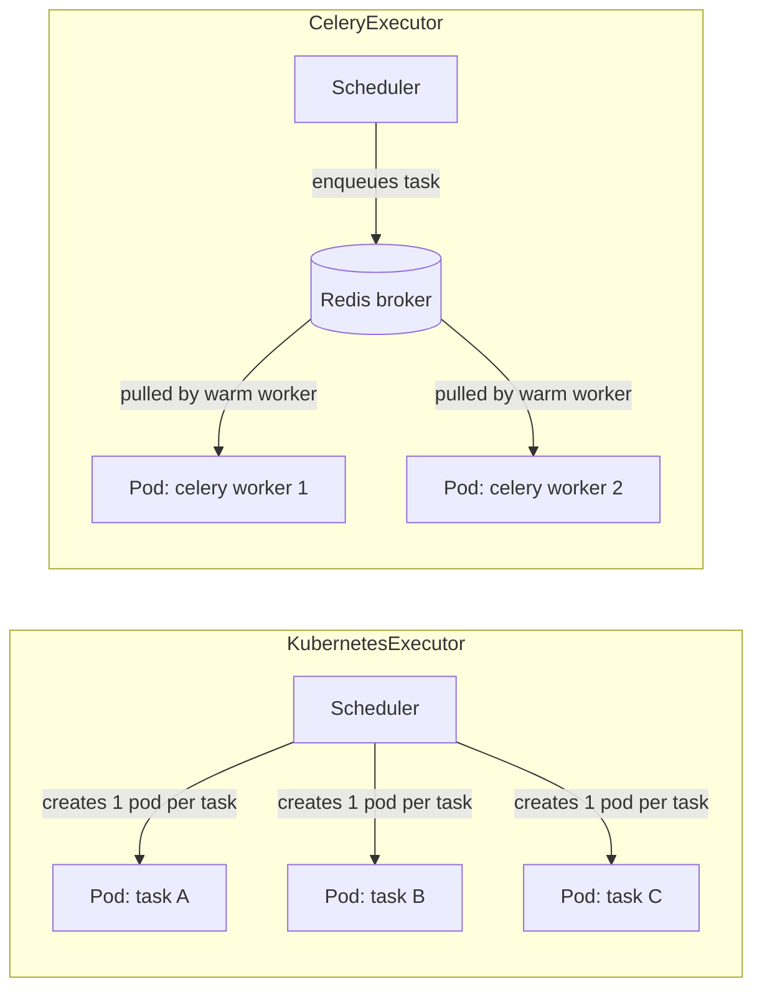

# Part 2: Helm Deployment and Executor Choice

> **Supported Versions**: apache/airflow Helm chart 1.22+ (deploys Airflow 3.2.2 by default), Kubernetes 1.30+\
> **Last Updated**: July 15, 2026

## Lab Environment Setup

To follow along with the examples in this document, you will need the following tools and environment:

### Required Tools

* kubectl v1.30 or later
* Helm v3.19 or later (the official chart's stated minimum)
* A working Kubernetes cluster (Amazon EKS recommended)
* KEDA installed on the cluster — only needed if you plan to try the `CeleryExecutor` autoscaling example later in this document

## Two Different Airflow Helm Charts

Before installing anything, it's worth being explicit about a common source of confusion: there are **two unrelated Helm charts** for running Airflow on Kubernetes, and mixing up their documentation, values schema, or GitHub issues will send you down the wrong path.

* **`apache/airflow`** — the official chart, maintained by the Apache Airflow project itself and published from the `chart` directory of the main `apache/airflow` repository. This is the chart this document uses, and the one the upstream documentation and release notes refer to.
* **`airflow-helm/charts`** — an older, independently maintained community chart (sometimes referred to by its repo name, `airflow-helm`). It predates the official chart, uses a different values schema, and is not affiliated with the Apache Airflow project. Older tutorials and blog posts frequently reference it, which is the most common cause of values.yaml snippets that don't apply to the official chart.

The official chart's release cadence tracks Airflow itself fairly closely. As of this writing, chart version **1.22.0** (released June 2026) is latest, and it deploys **Airflow 3.2.2** by default. The chart declares a minimum Helm version of **3.19.0**, and since chart **1.16.0** it has required **Kubernetes 1.30+** — both are enforced by the chart's own `Chart.yaml` constraints, so an older Helm or cluster version will fail at install time rather than produce a broken deployment.

## Installation

### Add the Repository and Install

```bash
# Add the official Apache Airflow Helm repository
helm repo add apache-airflow https://airflow.apache.org/
helm repo update

# Install into a dedicated namespace, pinned to a specific chart version
helm install airflow apache-airflow/airflow \
  --namespace airflow \
  --create-namespace \
  --version 1.22.0

# Verify the installation
kubectl get pods -n airflow
helm list -n airflow
```

By default this installs the chart's bundled PostgreSQL and the `KubernetesExecutor` — enough to get a working Airflow 3 deployment running for a lab or evaluation. Anything past that (a real metadata database, an executor decision, resource sizing) belongs in a `values.yaml` you pass with `-f`.

### The Key Setting: `executor`

Every other setting in the chart is secondary to one top-level value, since it changes which supporting components the chart deploys at all:

```yaml
# values.yaml
executor: KubernetesExecutor  # or CeleryExecutor

# Only read when executor is CeleryExecutor
workers:
  celery:
    keda:
      enabled: false  # see the autoscaling section below

# Point at an external metadata DB in anything beyond a lab
postgresql:
  enabled: true  # false once you switch to RDS
```

```bash
helm upgrade airflow apache-airflow/airflow \
  --namespace airflow \
  --version 1.22.0 \
  -f values.yaml
```

Changing `executor` after tasks are already running is disruptive — the scheduler, and for `CeleryExecutor` the worker Deployment and Redis, are conditionally rendered based on this one field. Decide the executor for a given deployment before it carries production traffic.

### Pointing at an External Metadata Database

The bundled PostgreSQL pod (a single replica backed by a PVC) is fine for a lab, but it disappears the moment the release is uninstalled and has no failover. For anything longer-lived, disable it and point the chart at an external Amazon RDS for PostgreSQL instance instead:

```yaml
# values.yaml
postgresql:
  enabled: false

data:
  metadataConnection:
    user: airflow
    pass: airflow-password   # reference a Secret in a real deployment, not a plaintext value
    protocol: postgresql
    host: airflow-metadata.xxxxxxxxxxxx.us-east-1.rds.amazonaws.com
    port: 5432
    db: airflow
```

The chart's own PostgreSQL subchart and the external-connection fields are mutually exclusive in practice — once `postgresql.enabled` is `false`, every component (scheduler, api-server, dag-processor, triggerer) reads `data.metadataConnection` instead.

## Choosing an Executor: KubernetesExecutor vs. CeleryExecutor

Part 1 introduced both executors at a high level as part of the component architecture; this is the deeper trade-off you actually need to resolve before deploying.

### KubernetesExecutor

Each task instance gets its own pod, created by the scheduler through the Kubernetes API and torn down on completion.

* **Best fit**: tasks that need runtime isolation, are resource-heavy, or need a per-task container image (a different Python environment, a GPU image, a completely different runtime than the rest of the DAG).
* **Cost**: a cold-start of roughly **1–2 minutes** even for a trivial task — pod scheduling, image pull if not cached, and potentially a node scale-out event via Karpenter or Cluster Autoscaler if no capacity is free.
* **Benefit**: no idle worker cost between task bursts, and strong isolation — one task's dependency conflict or memory leak can't affect any other task's pod.

### CeleryExecutor

A pool of warm Celery worker pods stays running continuously and pulls queued tasks off a broker.

* **Best fit**: short, homogeneous tasks where startup latency matters — a DAG with hundreds of small tasks per run feels very different at 1–2 minutes of pod startup per task versus seconds of dispatch to an already-running worker.
* **Cost**: all tasks routed to a given worker share that worker's resources and installed dependencies — much weaker isolation than a dedicated pod per task.
* **Requirement**: a message broker (Redis or RabbitMQ) plus a long-running worker Deployment, both of which need their own capacity planning and are additional moving parts to operate.

### The Trade-off, Not a Default Answer

This is a genuine trade-off, not a "pick KubernetesExecutor unless you have a reason not to" situation:

| | KubernetesExecutor | CeleryExecutor |
|---|---|---|
| Task startup latency | ~1–2 min cold start | Seconds (warm pool) |
| Idle cost | None — pods only exist while a task runs | Worker pool runs continuously unless scaled to zero |
| Isolation | Strong — one pod per task | Weak — tasks share a worker's resources/deps |
| Extra infrastructure | None beyond the cluster itself | Redis/RabbitMQ broker + worker Deployment |
| Scaling behavior at high task volume | Predictable — scales with cluster capacity | Can hit worker-pool scaling pain under sustained heavy load |

In practice, teams running high task volumes tend to find `KubernetesExecutor` scales more predictably, since each task's resource footprint is explicit and cluster autoscaling handles the rest; `CeleryExecutor` deployments that grow past their original sizing can run into worker-pool scaling limits that take manual retuning to resolve.

You are not actually forced to choose only one for an entire deployment. Airflow 3's "multiple executors concurrently" feature (introduced in Part 1) lets a single deployment assign an executor per task or per DAG rather than committing to one globally — for example, running most DAGs on a warm `CeleryExecutor` pool for low-latency dispatch, while routing a handful of resource-heavy or GPU tasks to `KubernetesExecutor` for isolation. This is the realistic answer for most non-trivial deployments: pick a sensible default, and override it explicitly for the tasks that need the other executor's behavior.



With `KubernetesExecutor`, every task is a fresh pod that exists only for the task's lifetime. With `CeleryExecutor`, the worker pods are long-lived and pull work from the broker — the pods in the diagram above are already running before any task is queued.

## Autoscaling CeleryExecutor Workers with KEDA

Since Celery workers are a fixed pool by default, sizing the worker Deployment to peak load wastes capacity at idle. KEDA closes that gap by scaling the worker Deployment based on actual queued/running task counts rather than a static replica count.

Enable it in `values.yaml`:

```yaml
workers:
  celery:
    keda:
      enabled: true
      minReplicaCount: 0
      maxReplicaCount: 20
```

Once enabled, the chart creates a KEDA `ScaledObject` targeting the worker Deployment. KEDA polls the metadata database roughly **every 10 seconds** with a query along the lines of:

```sql
SELECT ceil(COUNT(*)::decimal / worker_concurrency)
FROM task_instance
WHERE state IN ('running', 'queued');
```

The result is the number of worker replicas needed to keep every running/queued task instance covered at the configured `worker_concurrency` per pod. When the count of running/queued tasks drops to zero, the ScaledObject scales the Deployment **down to zero** replicas — but only after task activity has been absent for roughly **5 minutes**, so a brief lull between DAG runs doesn't tear down and immediately recreate the worker pool.

### Why KubernetesExecutor Has No Equivalent KEDA Setup

This section only applies to `CeleryExecutor`, and there's no parallel "KEDA for KubernetesExecutor" pattern to reach for — and that's by design, not a gap. `KubernetesExecutor` scaling is already granular at the pod level: each task creates exactly one pod, so there is no fixed-size worker pool to right-size in the first place. What actually needs to scale under `KubernetesExecutor` is cluster-level compute capacity for those task pods, which is Karpenter's or Cluster Autoscaler's job, not a workload-level autoscaler like KEDA. KEDA's role is specifically to resize a long-running Deployment based on an external metric; `KubernetesExecutor` never has a long-running Deployment to resize.

## Verifying the Deployment

```bash
# Confirm every component pod is Running
kubectl get pods -n airflow

# Confirm no restarts/crashes on the scheduler and dag-processor specifically
kubectl get pods -n airflow -l component=scheduler
kubectl get pods -n airflow -l component=dag-processor

# Port-forward the api-server to reach the UI locally
kubectl port-forward -n airflow svc/airflow-api-server 8080:8080
```

With the port-forward active, the UI is reachable at `http://localhost:8080`. The chart creates a default `admin`/`admin` user on first install; change the password by setting `webserver.defaultUser.password` in `values.yaml` before installing (never rely on the default outside a throwaway lab). If `executor: CeleryExecutor` is set, also confirm the worker Deployment and Redis are healthy:

```bash
kubectl get deploy -n airflow -l component=worker
kubectl get pods -n airflow -l component=redis
```

## Next Steps

This document covered the two Airflow Helm charts and why only `apache/airflow` is official, installed a working Airflow 3 deployment, and worked through the `KubernetesExecutor` vs. `CeleryExecutor` decision in depth, including KEDA-based autoscaling for Celery workers. The next chapter in this section moves on to DAG authoring patterns on Kubernetes — the `KubernetesPodOperator`, task-level executor overrides, and structuring DAGs for the dag-processor introduced in Part 1.

[Return to Main Page](./)

## Quiz

To test what you've learned in this chapter, try the [Topic Quiz](../../quizzes/data-on-eks/airflow/02-helm-deployment-quiz.md).
