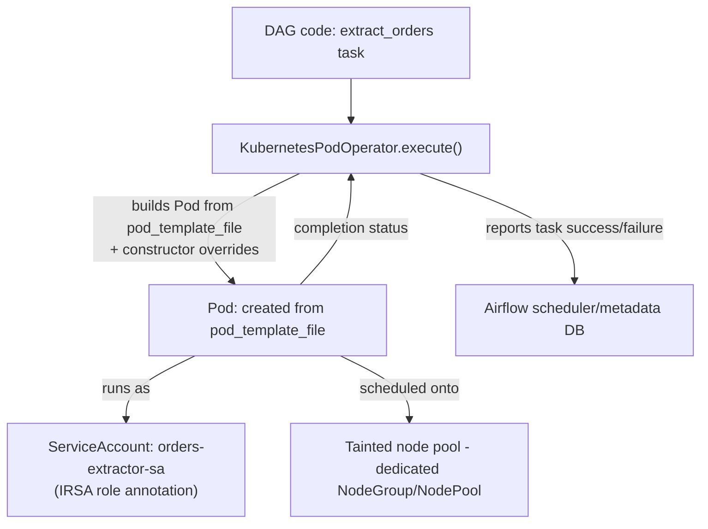

# Part 3: DAG Patterns and KubernetesPodOperator

> **Last Updated**: July 15, 2026

## Lab Environment Setup

To follow along with the examples in this document, you will need the following tools and environment:

### Required Tools

* `kubectl` configured against an EKS cluster (1.30+) with the Airflow 3 deployment from Part 2 running
* An IAM role for IRSA (or an EKS Pod Identity association) scoped to whatever a task actually needs — for the examples here, read/write access to a specific S3 prefix
* A container image you can launch through `KubernetesPodOperator` — any image works for the pod-template examples; the Spark example later in this document assumes the Spark Operator setup from [Part 2 of the Spark section](../spark/02-spark-operator.md)

## KubernetesPodOperator Is Not Tied to Your Executor Choice

Part 2 walked through choosing between `KubernetesExecutor` and `CeleryExecutor` — the mechanism Airflow uses to run *the DAG's own task instances*. `KubernetesPodOperator` (KPO, `airflow.providers.cncf.kubernetes.operators.pod`) is a different thing entirely: it's an operator, available under either executor, whose `execute()` method creates an arbitrary Pod through the Kubernetes API and waits for it to finish. Whichever process runs that `execute()` call — a fresh per-task pod under `KubernetesExecutor`, or a warm Celery worker under `CeleryExecutor` — it ends up creating and watching a second, separate Pod that does the actual work.

This distinction matters because it's a common source of confusion: switching a deployment from `CeleryExecutor` to `KubernetesExecutor` does not add a second layer of pods to a DAG that already uses KPO, and it does not remove one either. A KPO task always produces exactly one task-execution context (a Celery worker process or a KubernetesExecutor pod) plus exactly one Pod for the work KPO launches. What the executor choice changes is only how the *first* half — the bookkeeping side that calls `execute()` — is scheduled; KPO's own Pod-launching behavior is identical either way.

## Pod Spec Precedence

KPO builds the Pod it launches by merging several possible sources of pod configuration, and when more than one is set, the more specific source wins. From highest to lowest priority:

1. **KPO constructor arguments** — `image`, `cmds`, `env_vars`, `resources`, and similar attributes passed directly to the operator. These always win over anything set through the other sources.
2. **`full_pod_spec`** — a complete `kubernetes.client.models.V1Pod` object passed in Python, giving you full control when you need it.
3. **`pod_template_file`** — a path to a YAML file containing a base Pod spec.
4. **`pod_template_dict`** — the same idea as `pod_template_file`, but as an in-memory dict instead of a file path.
5. **The default, empty `V1Pod`** — whatever KPO falls back to when none of the above set a given field.

In practice, most teams settle on `pod_template_file` as the baseline for an entire DAG or deployment, and use KPO's constructor arguments only to override the handful of fields (image, command, a resource bump for one specific task) that legitimately vary per task.

## The `pod_template_file` Pattern

`pod_template_file` is the standard way to give every KPO task in a deployment a consistent starting point — resource requests/limits, tolerations, a service account — without repeating that YAML in every DAG. A typical base template looks like this:

```yaml
# base-pod-template.yaml
apiVersion: v1
kind: Pod
metadata:
  labels:
    app: airflow-task
spec:
  serviceAccountName: airflow-task-sa  # overridden per task via IRSA-scoped SAs
  restartPolicy: Never
  containers:
    - name: base
      image: python:3.12-slim  # overridden per task
      resources:
        requests:
          cpu: "500m"
          memory: "1Gi"
        limits:
          cpu: "1"
          memory: "2Gi"
  tolerations:
    - key: "workload"
      operator: "Equal"
      value: "airflow-tasks"
      effect: "NoSchedule"
```

A DAG task then references it and overrides only what's task-specific:

```python
from airflow.providers.cncf.kubernetes.operators.pod import KubernetesPodOperator

extract_orders = KubernetesPodOperator(
    task_id="extract_orders",
    namespace="airflow",
    name="extract-orders",
    image="my-registry/orders-extractor:1.4.0",
    cmds=["python", "extract.py"],
    arguments=["--date", "{{ ds }}"],
    pod_template_file="/opt/airflow/dags/templates/base-pod-template.yaml",
    service_account_name="orders-extractor-sa",
    is_delete_operator_pod=True,
)
```

Jinja templating (`{{ ds }}` above) works the same way in KPO's arguments as it does in any other operator, since the operator still renders its templated fields before building the Pod. The `image` and `cmds`/`arguments` passed to the constructor take precedence over whatever the template file sets for those same fields, per the precedence order above — the template supplies the shared defaults, and the constructor supplies what's actually different about this task.

## Pinning Tasks to Dedicated Node Pools

Task pods launched by KPO are ordinary Pods, so the usual Kubernetes mechanism for steering workloads onto specific nodes applies unchanged: set `affinity` and `tolerations` — either directly as KPO constructor arguments, or baked into the pod template — to match a taint on a dedicated node group. This is the same pattern you'd use to pin any workload to a Karpenter-managed NodePool, applied here to Airflow task pods specifically:

```yaml
# in the pod template, or passed to KPO's affinity/tolerations arguments
tolerations:
  - key: "workload"
    operator: "Equal"
    value: "airflow-tasks"
    effect: "NoSchedule"
affinity:
  nodeAffinity:
    requiredDuringSchedulingIgnoredDuringExecution:
      nodeSelectorTerms:
        - matchExpressions:
            - key: "karpenter.sh/nodepool"
              operator: In
              values: ["airflow-tasks"]
```

Isolating task pods onto a tainted, Airflow-specific node pool keeps them from competing for capacity with (or getting evicted by) unrelated workloads on shared nodes, and lets that pool scale independently based purely on task pod demand.

## IRSA Per Task

The `serviceAccountName` set through `pod_template_file` (or passed directly as KPO's `service_account_name` argument) is also how each task gets its own AWS permissions. Annotate the Kubernetes ServiceAccount with an IAM role ARN the usual IRSA way, and any Pod that runs under that ServiceAccount — including a KPO-launched task pod — assumes that role's permissions for the lifetime of the pod:

```yaml
apiVersion: v1
kind: ServiceAccount
metadata:
  name: orders-extractor-sa
  namespace: airflow
  annotations:
    eks.amazonaws.com/role-arn: arn:aws:iam::123456789012:role/orders-extractor-task-role
```

This is a meaningfully different permission boundary than whatever role the Airflow control-plane components (scheduler, api-server, dag-processor) run under. A task that only needs to read one S3 prefix gets a role scoped to exactly that, instead of inheriting broader permissions the platform components might need for their own operation. Since `service_account_name` is one of the fields that follows the precedence order above, a task-specific override always beats whatever service account the base pod template sets — letting most tasks share a template's default while a handful of tasks needing distinct AWS permissions declare their own.

## DAG Bundles: Airflow 3's Replacement for a Single DAG Folder

Airflow 2 assumed every component read DAG files from the same local disk path, which meant the dag-processor (and, in 2.x, the scheduler) needed some way to get that path populated — usually a `git-sync` sidecar polling a repository into a shared volume, or baking DAGs into the deployment's container image. Airflow 3 replaces that assumption with **DAG bundles**: a pluggable abstraction for where the dag-processor pulls DAG source from, configured per bundle rather than hard-coded to one local path.

* **`LocalDagBundle`** — reads DAGs from a local filesystem path, exactly like the old model. No versioning: whatever is on disk right now is what runs. This fits a baked-image deployment or local development, where "what's on disk" is already pinned by the image build.
* **`GitDagBundle`** — pulls DAGs directly from a Git repository, and is versioning-aware natively: every DAG run records the exact commit SHA it executed against. Re-running a historical DAG run replays it against the code as it existed at that commit, not whatever the repository's HEAD has since become. This is the property `git-sync` never gave you — a sidecar keeps the working copy current, but nothing in Airflow 2 recorded which commit a given run actually saw.
* **`S3DagBundle`** / **`GCSDagBundle`** — pull DAGs from an S3 bucket or GCS bucket respectively. Like `LocalDagBundle`, neither tracks a version per run; whatever object is at the configured key/prefix when the dag-processor parses it is what runs.

A `git-sync` sidecar still works with the official Helm chart from Part 2 — nothing in Airflow 3 removes that support — but for any DAG run where reproducibility matters (rerunning a backfill months later and getting the exact code that originally ran), `GitDagBundle` is the pattern that actually gives you that guarantee, which is why it's positioned as `git-sync`'s modern replacement rather than just an alternative.



## Authoring Patterns

TaskFlow API and dynamic task mapping remain Airflow's core authoring patterns in 3.x — neither is a 3.x-specific feature, but both are now DAG-versioning-aware in the UI, so a mapped task's history stays legible even across DAG bundle changes. The pattern worth calling out here is how KPO composes with them to launch work that doesn't run as native Python: a TaskFlow-decorated DAG can still have one or more tasks be `KubernetesPodOperator` instances, mixed in alongside regular `@task`-decorated Python callables.

A common real integration is launching a Spark job from an Airflow DAG. The pattern that fits Kubernetes-native Spark (see [Part 2 of the Spark section](../spark/02-spark-operator.md)) is a KPO task whose container image applies a `SparkApplication` manifest and polls it to completion, rather than the DAG talking to the Kubernetes API directly:

```python
spark_etl = KubernetesPodOperator(
    task_id="run_spark_etl",
    namespace="airflow",
    name="run-spark-etl",
    image="my-registry/spark-submitter:1.0.0",
    cmds=["/bin/sh", "-c"],
    arguments=["kubectl apply -f /manifests/orders-etl-sparkapp.yaml && "
                "kubectl wait --for=jsonpath='{.status.applicationState.state}'=COMPLETED "
                "sparkapplication/orders-etl --timeout=30m"],
    pod_template_file="/opt/airflow/dags/templates/base-pod-template.yaml",
    service_account_name="spark-submitter-sa",  # IRSA-scoped for S3 + SparkApplication RBAC
)
```

The same shape works for a dbt container image (`dbt run` as the KPO task's command against a data warehouse) or any other tool that's easier to run as a purpose-built container than to reimplement as native Airflow logic.

Airflow 3's asset/event-driven scheduling is a good fit for chaining this kind of task to what comes next: instead of a downstream DAG polling on a schedule to check whether the Spark job's output landed, the upstream DAG can update an Asset on completion, and the downstream DAG triggers directly off that Asset update rather than a time-based schedule. This turns a KPO-launched batch job into a proper event source for the rest of the pipeline instead of just another scheduled task.

## Next Steps

This document covered how `KubernetesPodOperator` launches Pods independently of the `KubernetesExecutor`/`CeleryExecutor` choice from Part 2, the pod spec precedence order that governs `pod_template_file`/`full_pod_spec`/`pod_template_dict`, using `affinity`/`tolerations` and per-task IRSA to give KPO tasks dedicated compute and scoped AWS permissions, and Airflow 3's DAG bundle model — particularly `GitDagBundle`'s commit-level versioning as the modern replacement for a bare `git-sync` sidecar.

[Return to Main Page](./)

## Quiz

To test what you've learned in this chapter, try the [Topic Quiz](../../quizzes/data-on-eks/airflow/03-dag-patterns-quiz.md).
