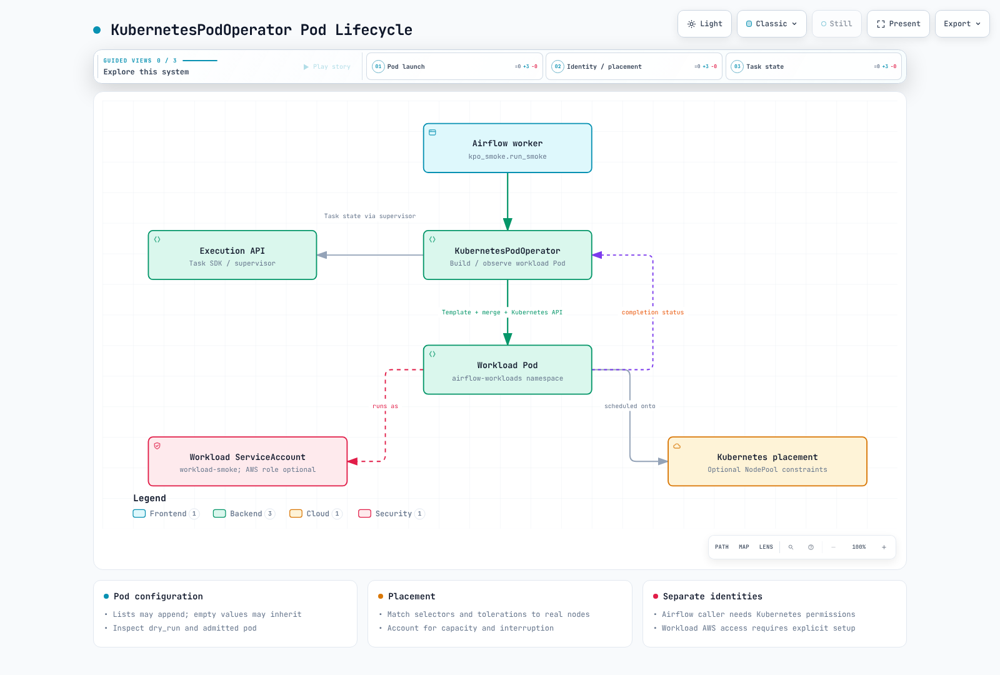

# Part 3: DAG Patterns and KubernetesPodOperator

> **Review baseline**: Airflow 3.3.1 / cncf-kubernetes provider 10.21.0 · September 12, 2026

## 1. Executors, KPO and physical pod count

KubernetesPodOperator (KPO) lets an Airflow task create and observe a separate
workload pod. It can run through CeleryExecutor, KubernetesExecutor or another
compatible executor. The Airflow task environment needs the provider, but
**the workload pod does not inherently need Airflow installed**.

| Typical new execution | Newly created pods and shared resources |
| --- | --- |
| CeleryExecutor + KPO | An existing worker process runs KPO and creates a workload pod; multiple tasks can share the worker pod |
| KubernetesExecutor + KPO | Creates an Airflow task-runner pod and a separate KPO workload pod |

Changing the executor can therefore change physical pod count. Two logical
execution roles do not imply an unchanged number of pods. Retries/reattachment
can reuse pods or create further attempts; deferrable mode can release a worker
slot while a triggerer continues observation. Exactly two live pods is not a guarantee.

## 2. Precedence includes merge behavior

Provider 10.21.0 constructs the pod as follows:

1. Select pod_template_file when present. It does not additionally merge
   pod_template_dict from the same call.
2. Otherwise select pod_template_dict, or start from full_pod_spec/an empty pod.
3. Merge the chosen template with full_pod_spec, then with KPO's constructed pod.
4. Airflow labels, secret/XCom handling, pod_mutation_hook and server-side
   admission/defaulting can further affect the result.

Specified nonempty values such as image/namespace generally override the template,
but not every field is a simple replacement. Running the released merge methods confirms:

| Input | Result |
| --- | --- |
| Nonempty image | Overrides template image |
| Empty command or tolerations | Can retain template values |
| False automount overriding a true template value | Falsy override can retain True; inspect the final pod |
| Lists such as env/volume_mounts | Can concatenate; an empty list need not erase the base |
| container_resources with only limits | Does not preserve the previous requests |
| Nonempty node_selector | Can replace the whole previous selector |
| Metadata labels | Merge by key |
| Init containers | Merge matching names and append others |

Use **container_resources=V1ResourceRequirements(...)** for Kubernetes container
resources. Do not confuse generic resources arguments with that setting.
Inspect dry_run output and actual admitted pods, not merely the original template.

## 3. Prepare a small runnable DAG

First prepare Part 2's Airflow and DAG-distribution path. This example prints a
run ID and does not access S3, so it needs no AWS data role. Real workloads need
their own image, packages and data permissions.

In workload-access.yaml, set the RoleBinding subject to the **Airflow worker
service account that actually runs KPO**. The example uses airflow-worker in the
airflow namespace. This differs from the workload pod's service account.

```yaml
apiVersion: v1
kind: Namespace
metadata:
  name: airflow-workloads
---
apiVersion: v1
kind: ServiceAccount
metadata:
  name: workload-smoke
  namespace: airflow-workloads
automountServiceAccountToken: false
---
apiVersion: rbac.authorization.k8s.io/v1
kind: Role
metadata:
  name: airflow-kpo
  namespace: airflow-workloads
rules:
- apiGroups:
  - ''
  resources:
  - pods
  verbs:
  - create
  - get
  - list
  - watch
  - patch
  - delete
- apiGroups:
  - ''
  resources:
  - pods/log
  verbs:
  - get
---
apiVersion: rbac.authorization.k8s.io/v1
kind: RoleBinding
metadata:
  name: airflow-kpo-worker
  namespace: airflow-workloads
subjects:
- kind: ServiceAccount
  name: airflow-worker
  namespace: airflow
roleRef:
  apiGroup: rbac.authorization.k8s.io
  kind: Role
  name: airflow-kpo
```

The Role is scoped to the workload namespace, but can affect all matching pod
resources there. Use trust boundaries and admission controls to restrict untrusted
DAG authors from selecting privileged identities or dangerous pod specs.
This synchronous example needs no XCom exec permission. Adding an XCom sidecar
or deferral requires review of pods/exec and triggerer observation rights.

Distribute these files together in the DAG bundle:

```text
dags/
  kpo_smoke.py
  templates/
    base-pod-template.yaml
```

templates/base-pod-template.yaml is completed by KPO, not a standalone pod
deployment. Its resources, filesystem and UID settings fit this example workload.

```yaml
apiVersion: v1
kind: Pod
metadata:
  labels:
    app: airflow-kpo-smoke
spec:
  serviceAccountName: workload-smoke
  automountServiceAccountToken: false
  restartPolicy: Never
  securityContext:
    runAsNonRoot: true
    runAsUser: 65532
    seccompProfile:
      type: RuntimeDefault
  containers:
  - name: base
    image: python:3.12-slim
    resources:
      requests:
        cpu: 100m
        memory: 64Mi
      limits:
        cpu: 500m
        memory: 128Mi
    securityContext:
      allowPrivilegeEscalation: false
      readOnlyRootFilesystem: true
      capabilities:
        drop:
        - ALL
```

kpo_smoke.py defines an actual discoverable DAG. It resolves the template relative
to the bundle file on the worker rather than assuming a universal /opt/airflow/dags path.

```python
from datetime import datetime, timedelta, timezone
from pathlib import Path

from airflow.sdk import Asset, DAG
from airflow.providers.cncf.kubernetes.operators.pod import KubernetesPodOperator
from kubernetes.client import models as k8s

TEMPLATES = Path(__file__).parent / "templates"
smoke_completed = Asset("demo://kpo-smoke-completed")

with DAG(
    dag_id="kpo_smoke",
    schedule=None,
    start_date=datetime(2026, 9, 1, tzinfo=timezone.utc),
    catchup=False,
) as dag:
    run_smoke = KubernetesPodOperator(
        task_id="run_smoke",
        name="kpo-smoke",
        namespace="airflow-workloads",
        in_cluster=True,
        pod_template_file=str(TEMPLATES / "base-pod-template.yaml"),
        service_account_name="workload-smoke",
        image="python:3.12-slim",
        cmds=["python", "-B", "-c"],
        arguments=["import sys; print('KPO_SMOKE_OK run_id=' + sys.argv[1])", "{{ run_id }}"],
        container_resources=k8s.V1ResourceRequirements(
            requests={"cpu": "250m", "memory": "128Mi"},
            limits={"cpu": "500m", "memory": "256Mi"},
        ),
        random_name_suffix=True,
        reattach_on_restart=True,
        deferrable=False,
        get_logs=True,
        do_xcom_push=False,
        startup_timeout_seconds=120,
        active_deadline_seconds=180,
        execution_timeout=timedelta(minutes=5),
        on_finish_action="delete_pod",
        on_kill_action="delete_pod",
        outlets=[smoke_completed],
    )

if __name__ == "__main__":
    run_smoke.dry_run()
```

In an Airflow environment with the provider installed, python kpo_smoke.py prints
the pod configuration. With explicit namespace and XCom disabled, this example
avoids live Kubernetes-client initialization in 10.21.0's dry_run path.
Jinja arguments and task-instance labels still need the real execution context;
dry_run is not final admission or successful execution.

run_id is passed as a separate command argument. Asset-triggered DAG runs can lack
time context such as logical_date/ds, so do not assume `{{ ds }}` exists for every task.

Apply the namespace/RBAC, verify DAG delivery/parsing, then trigger kpo_smoke through
the UI or CLI. Inspect task status, KPO_SMOKE_OK logs and the actual pod's image,
service account and resources. Post-success deletion is configured behavior;
durable logs need Part 5's remote-logging setup.

### Deletion, killing and restart

Provider 10.21.0 accepts is_delete_operator_pod but does not use that argument in
its constructor. False does not reliably request retention. Configure
**on_finish_action** and **on_kill_action** for their respective paths.
Reattachment resumes observation of an existing pod after restart; it does not
guarantee exactly-once external writes.

## 4. Dedicated nodes and AWS access

When required, add selectors/required affinity and tolerations matching a prepared
NodePool. Tolerations permit taints rather than force placement. Dedicated pools
do not prevent Spot reclamation, node failure, disk pressure or disruption, and
other workloads may tolerate the same taint.

For actual S3 work, prepare IRSA OIDC trust or Pod Identity associations/Agent, IAM
permissions and compatible SDKs/providers for the workload service account.
An annotation or service_account_name string alone does not complete S3 access.
Inspect other credential sources such as environment variables, IMDS and the
SDK's default chain. Pod lifetime also need not equal temporary-credential expiry.
Separate Kubernetes RBAC from AWS data permissions and test allowed/denied access.

## 5. DAG bundles and rerun code versions

Bundles supply DAG code and related files to processors and workers.
LocalDagBundle and S3DagBundle/GCSDagBundle currently do not version bundles.
This does not guarantee a parser-time snapshot matches the code later read by a
worker. GitDagBundle supports versioning; git-sync also remains supported.

Even a versioned bundle does not force every rerun onto the original commit.
In 3.3.1 the selection order is:

1. Explicit run_on_latest_version in the API request.
2. The DAG's rerun_with_latest_version value.
3. Global [core] rerun_with_latest_version.
4. When unset, per-call fallback: False for clear/rerun, True for backfill.

disable_bundle_versioning separately disables tracking on runs; rerun defaults
cannot preserve a version that was not tracked. Retaining a Git commit also does
not reproduce results when images, packages, external data or configuration change.
Preserve repository history/access and pin execution dependencies as needed.

Bundle kwargs can be exposed through the Config API. Reference Airflow Connections
or suitable credential mechanisms instead of embedding tokens in repo_url.



[Interactive diagram](https://www.atomai.click/kubernetes-docs/archmaps/en-data-on-eks-airflow-03-dag-patterns-0.html)

## 6. Spark, dbt and Asset integration

KPO can run packaged dbt or other CLI workloads. Spark has several integration paths:

| Path | What to verify |
| --- | --- |
| SparkKubernetesOperator | SparkApplication API/CRD and provider compatibility, caller RBAC, driver observation/cleanup |
| SparkSubmitOperator or a KPO submitter image | spark-submit runtime/authentication, driver/executor roles and completion/failure handling |
| CustomObjects client or submission service | Explicit namespace, unique execution identity and state/retry/cleanup contracts |

The old fixed-name SparkApplication apply followed only by waiting for COMPLETED
can mistake a previous COMPLETED state for a new successful run. It can also wait
in the wrong namespace and fails to handle terminal failure promptly.
That combination is not used as a runnable baseline here.

A native operator is not automatically compatible with every release combination.
The reviewed 10.21.0 SparkKubernetesOperator adds spec.labels in its reattachment
setup, but the Spark chapter's Kubeflow 2.5.2 CRD lacks that field. Server field
validation/pruning can affect behavior: validate the **final generated CR**.
That version's kill path deletes the Spark CR; delete_on_termination=False does
not preserve it across that path. Validating only input YAML is not an integration test.

The basic DAG's demo://kpo-smoke-completed is a **demo Asset event** emitted on
success. It does not automatically detect S3 objects or validate data.
A downstream DAG can use schedule=[smoke_completed], but real pipelines should
emit their outlet event only after the intended data is committed.

## Validation scope

Merge behavior was checked by executing the unchanged released merge functions
with real Kubernetes Python models. Constructor checks are source/AST checks.
This is not a completed Airflow task, Kubernetes API, IAM/S3 or Spark-cluster
execution/recovery test.


- [Kubernetes provider 10.21.0 operators](https://airflow.apache.org/docs/apache-airflow-providers-cncf-kubernetes/10.21.0/operators.html)
- [KPO implementation](https://github.com/apache/airflow/blob/providers-cncf-kubernetes/10.21.0/providers/cncf/kubernetes/src/airflow/providers/cncf/kubernetes/operators/pod.py)
- [Released PodGenerator merge implementation](https://github.com/apache/airflow/blob/providers-cncf-kubernetes/10.21.0/providers/cncf/kubernetes/src/airflow/providers/cncf/kubernetes/pod_generator.py)
- [DAG bundles and rerun version selection](https://airflow.apache.org/docs/apache-airflow/3.3.1/administration-and-deployment/dag-bundles.html)
- [Template context and logical dates](https://airflow.apache.org/docs/apache-airflow/3.3.1/templates-ref.html)
- [SparkKubernetesOperator implementation](https://github.com/apache/airflow/blob/providers-cncf-kubernetes/10.21.0/providers/cncf/kubernetes/src/airflow/providers/cncf/kubernetes/operators/spark_kubernetes.py)
- [Kubeflow SparkApplication 2.5.2 CRD](https://github.com/kubeflow/spark-operator/blob/v2.5.2/config/crd/bases/sparkoperator.k8s.io_sparkapplications.yaml)

[Part 4: MWAA integration](04-mwaa-integration.md)

[README](README.md)

[Quiz](../../quizzes/data-on-eks/airflow/03-dag-patterns-quiz.md)
