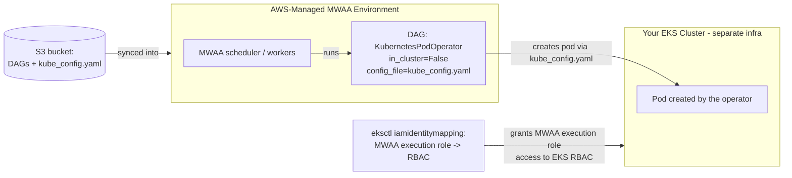

# Part 4: Amazon MWAA Integration

> **Last Updated**: July 15, 2026

## Lab Environment Setup

To follow along with the examples in this document, you will need the following tools and environment:

### Required Tools

* AWS CLI v2 (for managing the MWAA environment and IAM identity mappings)
* `eksctl` (for creating the IAM identity mapping into the target EKS cluster's RBAC)
* An Amazon MWAA environment (any recent version; the KubernetesPodOperator pattern in this document doesn't depend on which MWAA version you're running)
* An EKS cluster (1.30+) separate from MWAA's own infrastructure, with `kubectl` access

Parts 1–3 covered running Airflow's full control plane — api-server, scheduler, dag-processor, triggerer — yourself on EKS, including native Kubernetes integration via `KubernetesPodOperator` and git-native DAG delivery via `GitDagBundle`. This part covers Amazon MWAA, AWS's fully managed Airflow control plane, and the trade-offs against running Airflow yourself. It also covers the one pattern that matters most for an EKS-centric platform: how an MWAA-hosted DAG can still target and drive workloads on your own EKS cluster.

## What "Managed" Means for MWAA

MWAA (Managed Workflows for Apache Airflow) provisions and runs the scheduler, the api-server (Airflow 3's replacement for the old webserver, covered in Part 1), the dag-processor, and the worker fleet entirely on AWS-managed infrastructure inside AWS's own account boundary — not inside your VPC's EKS cluster. That has one direct consequence worth stating plainly: **there is no `kubectl` into the Airflow control plane itself**. You can't `kubectl get pods -n airflow` and see the MWAA scheduler the way you would for a self-managed deployment from Part 2. Environment health, scaling, and patching are entirely AWS's responsibility, surfaced through CloudWatch metrics/logs and the MWAA console/API rather than through Kubernetes primitives.

## Amazon MWAA vs. Self-Managed Airflow on EKS

The two approaches agree on what Airflow is — DAGs, a scheduler, a metadata database — but disagree sharply on where the control plane runs and how much of it you can touch, and on how quickly each one adopts new Airflow releases.

| Aspect | Self-Managed Airflow on EKS (Parts 1–3) | Amazon MWAA |
| --- | --- | --- |
| **Where the control plane runs** | Your own EKS cluster, as Deployments you can inspect and scale | AWS-managed infrastructure outside your cluster — no direct Kubernetes access to it |
| **Operational burden** | You own upgrades, HA configuration, and executor tuning | AWS handles patching, scaling, and availability of every control-plane component |
| **Version currency** | Adopt any upstream Airflow release as soon as it ships | Lags upstream — MWAA added Airflow 3.2 support in **April 2026**, roughly three months after Airflow's own 3.2 release, and after MWAA had first bridged forward with Airflow 2.11 in January 2026 |
| **Plugin delivery** | A plugins folder baked into your image or mounted as a volume | A zipped `plugins.zip` uploaded to an S3 bucket |
| **Python dependencies** | Installed however you build your worker/scheduler image — root and system packages allowed | A `requirements.txt` uploaded to S3, resolved by MWAA's build-time dependency resolution — no root or system-package installs |
| **DAG delivery** | Git-sync sidecar, or — as of Part 3 — Airflow 3's native `GitDagBundle` pulling DAGs directly from a git repo, no S3 step involved | DAGs synced from an S3 bucket only; no git-sync or DAG-bundle support of any kind |
| **Kubernetes access from DAGs** | Native — `KubernetesPodOperator` runs with `in_cluster=True` against the same cluster the DAG lives in | Indirect — `KubernetesPodOperator` with `in_cluster=False` and an uploaded kubeconfig, targeting a separate EKS cluster (see below) |
| **Customization** | Full control over executor mix, base images, scheduler/DAG-processor tuning | Limited to whatever MWAA's environment configuration exposes |

### Why choose MWAA

* Your team is AWS-only and wants zero infrastructure to patch, scale, or keep highly available for the Airflow control plane itself
* Your DAGs are pure Python/PyPI workloads — no custom system packages, no exotic executors — so MWAA's `requirements.txt`/`plugins.zip` model is not a limitation in practice
* Operational appetite for running yet another stateful Kubernetes workload is low, and Airflow being a few months behind upstream is an acceptable trade-off

### Why keep self-managed Airflow on EKS anyway

* You need a long time horizon on custom executors, custom Docker images, or per-task isolation strategies that go beyond what MWAA's environment configuration exposes
* You want the latest upstream Airflow features (a new executor, a new DAG-bundle type) as soon as they ship, rather than waiting for MWAA to catch up
* You need multi-cloud or on-prem portability that a fully AWS-managed control plane can't give you
* At scale, self-hosting can meaningfully undercut MWAA on cost — teams running large, well-tuned self-managed deployments report **30–60% lower spend** than a poorly-tuned MWAA setup at comparable throughput. That number depends heavily on traffic pattern and how much engineering time you're willing to put into tuning it — it is not a guarantee, and it has to be weighed against the ongoing engineering effort self-hosting requires.

### The DAG-Delivery Gap in Practice

The DAG-delivery difference in the table above is more than a checkbox. Part 3's `GitDagBundle` means a self-managed deployment picks up a new DAG the moment it's pushed to a tracked branch — the dag-processor pulls directly from git on its own polling interval. MWAA has no equivalent: every DAG change has to land as a file in the environment's S3 bucket first, whether that's a manual `aws s3 sync` or a CI step that does the same. It's not a large gap operationally once you've scripted the sync step, but it is one more moving part between "merged to main" and "running in the scheduler" compared to self-managed Airflow's git-native path.

## Driving an EKS Cluster from MWAA

Even though MWAA's own control plane isn't on your EKS cluster, an MWAA DAG can still target and manage workloads on an EKS cluster you do control — the same `KubernetesPodOperator` from Part 3, pointed outward instead of in-cluster.



Because MWAA's execution environment has no in-cluster Kubernetes API access, `KubernetesPodOperator` has to authenticate the same way any external client would: with a kubeconfig file and an IAM identity that the target cluster's RBAC trusts.

### 1. Bind the MWAA execution role into the EKS cluster's RBAC

The MWAA environment runs under an execution role. Before that role can create pods on your EKS cluster, the cluster's `aws-auth` configuration needs to know about it:

```bash
eksctl create iamidentitymapping \
  --cluster data-eks-cluster \
  --region us-east-1 \
  --arn arn:aws:iam::123456789012:role/mwaa-execution-role-my-environment \
  --username mwaa-executor \
  --group mwaa-pod-launcher
```

`--group mwaa-pod-launcher` should map to a Kubernetes `ClusterRole`/`ClusterRoleBinding` scoped to exactly what the DAGs need (creating/reading pods in a specific namespace, say) rather than something as broad as `system:masters` — the identity mapping only decides *who* the MWAA role is inside the cluster; a separate RBAC binding decides *what* it can do.

### 2. Generate and stage the kubeconfig

Generate a kubeconfig against the target cluster, then upload it to the MWAA environment's S3 bucket alongside your DAGs (MWAA doesn't sync arbitrary files, but a kubeconfig sitting next to your DAG files is picked up like any other file the DAG code references at runtime):

```bash
aws eks update-kubeconfig \
  --name data-eks-cluster \
  --region us-east-1 \
  --kubeconfig ./kube_config.yaml

aws s3 cp ./kube_config.yaml s3://my-mwaa-environment-bucket/dags/kube_config.yaml
```

### 3. Add the provider and write the DAG

`requirements.txt` needs the Kubernetes provider:

```
apache-airflow[cncf.kubernetes]
```

The DAG task then sets `in_cluster=False` and points `config_file` at the kubeconfig MWAA synced down alongside the DAG:

```python
from airflow.providers.cncf.kubernetes.operators.pod import KubernetesPodOperator

process_data = KubernetesPodOperator(
    task_id="process_data_on_eks",
    name="process-data",
    namespace="data-processing",
    image="123456789012.dkr.ecr.us-east-1.amazonaws.com/data-etl:latest",
    cmds=["python", "process.py"],
    in_cluster=False,
    config_file="/usr/local/airflow/dags/kube_config.yaml",
    is_delete_operator_pod=True,
)
```

This is the one integration path that matters most for an otherwise EKS-centric platform: MWAA can be the orchestration layer while the actual data processing pods still run — and are still owned, scaled, and observed — on your EKS cluster.

## Decision Guide

* **Are your DAGs pure Python/PyPI with no custom executors or system packages?** → Yes: MWAA is a reasonable fit / No: lean self-managed
* **Do you need the newest upstream Airflow features the same month they ship?** → Yes: self-managed / No: MWAA's few-month lag is tolerable
* **Is multi-cloud or on-prem portability a hard requirement?** → Yes: self-managed on EKS / No: MWAA is worth evaluating
* **Do you want zero infrastructure to patch/scale for the Airflow control plane itself, and is that worth a version lag?** → Yes: MWAA / No: self-managed
* **Are you already running most of your data workloads on EKS (Kafka via Strimzi, Spark) and want one operational surface?** → Yes: self-managed Airflow fits that pattern more naturally / No: MWAA's isolation from your cluster is less of a downside

As with MSK vs. Strimzi in the Kafka series, many teams run both: MWAA for lower-stakes, PyPI-only pipelines, and self-managed Airflow on EKS for pipelines that need custom executors, tighter version currency, or deep integration with the rest of an EKS-native data platform.

## Next Steps

This document covered what MWAA's managed control plane does and doesn't give you — no direct Kubernetes access to the scheduler/api-server/workers themselves, a few-month lag behind upstream Airflow, and S3-based plugin/dependency/DAG delivery instead of Parts 1–3's git-native workflow — along with the `KubernetesPodOperator` + `in_cluster=False` + IAM identity mapping pattern that lets an MWAA DAG still drive workloads on your own EKS cluster. Whether you land on MWAA, self-managed Airflow on EKS, or a mix of both, the decision guide above is the same trade-off analysis you'll see recur across every managed-vs-self-managed choice in this Data on EKS series.

[Return to Main Page](./README.md)

## Quiz

To test what you've learned in this chapter, try the [Topic Quiz](../../quizzes/data-on-eks/airflow/04-mwaa-integration-quiz.md).
