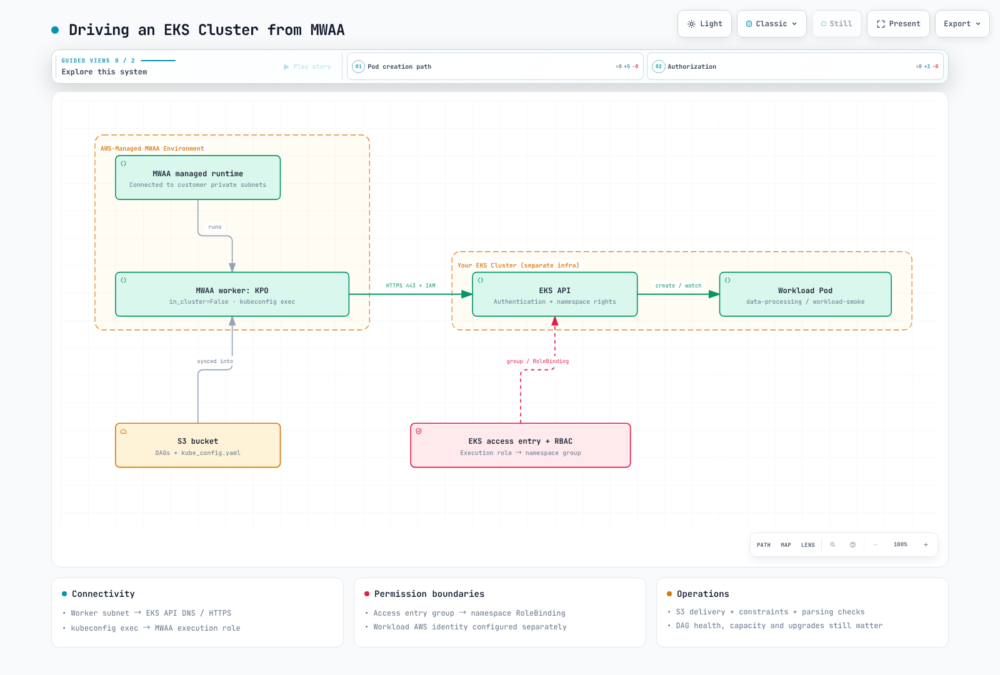

# Part 4: Amazon MWAA Integration

> **Last Updated**: September 12, 2026; MWAA Airflow 3.3.1 / Python 3.12; Kubernetes provider 10.21.0.

This chapter targets **provisioned Amazon MWAA environments** submitting work to
customer EKS clusters. **MWAA Serverless**, with YAML workflow definitions, is a
separate deployment option; do not transfer this environment/DAG-file/cost model
to it unchanged.

## 1. Management boundaries and current versions

MWAA schedulers/workers use AWS-managed Fargate infrastructure connected to private
subnets in the selected customer VPC. AWS also manages the metadata database.
The service is therefore not unrelated to your VPC. However, **MWAA scheduler pods
are not deployed into your EKS cluster for kubectl management**.
In Airflow 3, the MWAA webserver also hosts the Execution API.

AWS operates the underlying service. You still manage DAGs, dependencies, IAM,
VPC connectivity, capacity settings, alarms, recovery procedures and upgrades to
supported versions. Managed infrastructure does not remove environment failures
or capacity planning.

The official support table lists Airflow **3.3.1 available since 2026-09-01** and
3.2.1 since 2026-05-19. Upstream 3.3.1 was released on 2026-08-12.
Instead of assuming a fixed three-month delay, check the required patch, providers,
region and actual environment version. Existing environments do not automatically
switch to each newly supported Airflow release.

| Aspect | Self-managed Airflow on EKS | Provisioned MWAA |
| --- | --- | --- |
| Operations | Design Kubernetes resources, database, upgrades and recovery | AWS manages the service infrastructure; users still own DAGs, permissions, connectivity, capacity choices and upgrades |
| Versions/executors | Validate your chosen combinations | Choose within supported runtime/configuration options |
| Python packages | Build your own images or other delivery mechanisms | S3 requirements.txt with matching version constraints |
| System dependencies | Configure within image/node policies | Startup scripts can install Linux runtimes; validate support, startup time and networking |
| DAG delivery | Configure GitDagBundle, git-sync or other paths | Documented baseline: S3 DAG folder and supporting-file synchronization |
| External workloads | Use KPO and other integrations for separate images | KPO/EKS integration can also run separate workload images |

Startup scripts run before requirements installation and Airflow startup; official
examples include sudo-based runtime installation. A blanket prohibition on system
packages is therefore incorrect. This capability is different from unrestricted
replacement of the managed base image or executor.

This example uses Git → CI → S3 → MWAA. S3 delivery alone does not prove that every
Airflow 3 bundle capability is unavailable. Validate allowed configuration and
support for a particular MWAA release before adopting a separate bundle setup.
Both Git polling and S3 synchronization include parsing delays; neither guarantees
execution immediately after a push or merge.

## 2. Three requirements for EKS access

1. **Networking:** Worker subnets need DNS and HTTPS 443 access to the EKS API
   endpoint. For private endpoints, check routes, security groups and DNS.
   Adding authentication does not resolve a connection timeout.
2. **Authentication:** The MWAA execution role must be recognized through an EKS
   access entry or an existing aws-auth configuration. The kubeconfig exec plugin
   uses IAM credentials available at execution time.
3. **Authorization:** Bind the mapped Kubernetes group to a namespace Role.
   EKS authentication, Kubernetes RBAC and the child pod's AWS data permissions
   are distinct layers.

Use an existing MWAA 3.3.1 environment, an existing EKS cluster, AWS CLI v2 and
kubectl. Check current EKS support and provider/client compatibility.
This chapter does not require a new cluster or broad administrator identity.

### Access entry and namespace RBAC

The following setup is performed by a cluster administrator. Replace the role ARN,
cluster and region, and inspect any existing access entry first.

```bash
aws eks describe-cluster \
  --name data-eks-cluster --region us-east-1 \
  --query 'cluster.accessConfig.authenticationMode'

# Administrator action; API or API_AND_CONFIG_MAP mode is required.
aws eks create-access-entry \
  --cluster-name data-eks-cluster --region us-east-1 \
  --principal-arn arn:aws:iam::123456789012:role/mwaa-execution-role-my-environment \
  --type STANDARD \
  --kubernetes-groups mwaa-pod-launcher
```

Access entries also work in API_AND_CONFIG_MAP mode. Editing aws-auth does not grant
access in API-only mode. For legacy CONFIG_MAP clusters, use the existing mapping
or plan a migration. Authentication-mode transitions include irreversible changes,
so this example does not silently change the mode.

Save and apply workload-access.yaml below. The RoleBinding limits this grant to
data-processing. A ClusterRoleBinding does not express that namespace boundary.

```yaml
apiVersion: v1
kind: Namespace
metadata:
  name: data-processing
---
apiVersion: v1
kind: ServiceAccount
metadata:
  name: workload-smoke
  namespace: data-processing
automountServiceAccountToken: false
---
apiVersion: rbac.authorization.k8s.io/v1
kind: Role
metadata:
  name: mwaa-pod-launcher
  namespace: data-processing
rules:
- apiGroups:
  - ''
  resources:
  - pods
  verbs:
  - create
  - get
  - list
  - watch
  - patch
  - delete
- apiGroups:
  - ''
  resources:
  - pods/log
  verbs:
  - get
---
apiVersion: rbac.authorization.k8s.io/v1
kind: RoleBinding
metadata:
  name: mwaa-pod-launcher
  namespace: data-processing
subjects:
- kind: Group
  name: mwaa-pod-launcher
  apiGroup: rbac.authorization.k8s.io
roleRef:
  apiGroup: rbac.authorization.k8s.io
  kind: Role
  name: mwaa-pod-launcher
```

The Role can affect pods throughout that namespace. Other access-policy/RBAC grants
are additive, so inspect the complete permission set. Use admission controls for
untrusted authors who could select other service accounts or dangerous pod specs.
This synchronous example does not require XCom/exec permissions.

## 3. Kubeconfig and dependency delivery

Generate a fresh file rather than merging personal kubeconfig contexts into the
artifact. Its generating administrator needs eks:DescribeCluster on the target.

```bash
set -eu
mkdir -p ./mwaa-staging
test ! -e ./mwaa-staging/kube_config.yaml
aws eks update-kubeconfig \
  --name data-eks-cluster --region us-east-1 \
  --alias data-eks-cluster \
  --kubeconfig ./mwaa-staging/kube_config.yaml
```

Inspect the generated cluster, context, CA and exec.command. Remove exec.env entries
that refer to a developer's local AWS_PROFILE so the MWAA execution role's default
credential chain can be used. Do not add exec --role arguments unless a separate
role assumption is intended. Do not store long-lived keys or a static token.
Verify the aws executable and get-token path in the MWAA runtime as well.

The following requirements.txt targets **this chapter's 3.3.1/Python 3.12 environment**.
First inspect providers already included in the image; validate actual installed
versions after additions or changes. Do not use an unversioned apache-airflow extra
to unintentionally change core Airflow.

```text
--constraint https://raw.githubusercontent.com/apache/airflow/constraints-3.3.1/constraints-3.12.txt
apache-airflow-providers-cncf-kubernetes==10.21.0
```

Enable bucket versioning and Block Public Access as required by MWAA.
After uploading requirements.txt, update the environment's referenced object
version and check installation logs. Overwriting the object alone is not the
entire dependency-update procedure.

Preserve this structure under the configured S3 DAG prefix. Review the generated
kube_config.yaml before placing it beside the DAG.

```text
dags/
  mwaa_eks_smoke.py
  kube_config.yaml
  templates/
    base-pod-template.yaml
```

```yaml
apiVersion: v1
kind: Pod
metadata:
  labels:
    app: airflow-kpo-smoke
spec:
  serviceAccountName: workload-smoke
  automountServiceAccountToken: false
  restartPolicy: Never
  securityContext:
    runAsNonRoot: true
    runAsUser: 65532
    seccompProfile:
      type: RuntimeDefault
  containers:
  - name: base
    image: python:3.12-slim
    resources:
      requests:
        cpu: 100m
        memory: 64Mi
      limits:
        cpu: 500m
        memory: 128Mi
    securityContext:
      allowPrivilegeEscalation: false
      readOnlyRootFilesystem: true
      capabilities:
        drop:
        - ALL
```

```python
from datetime import datetime, timedelta, timezone
from pathlib import Path

from airflow.sdk import DAG
from airflow.providers.cncf.kubernetes.operators.pod import KubernetesPodOperator

BUNDLE_DIR = Path(__file__).resolve().parent

with DAG(
    dag_id="mwaa_eks_smoke",
    start_date=datetime(2026, 9, 1, tzinfo=timezone.utc),
    schedule=None,
    catchup=False,
) as dag:
    run_smoke = KubernetesPodOperator(
        task_id="run_smoke",
        name="mwaa-eks-smoke",
        namespace="data-processing",
        image="python:3.12-slim",
        cmds=["python", "-B", "-c"],
        arguments=["import sys; print('MWAA_EKS_OK run_id=' + sys.argv[1])", "{{ run_id }}"],
        pod_template_file=str(BUNDLE_DIR / "templates/base-pod-template.yaml"),
        in_cluster=False,
        config_file=str(BUNDLE_DIR / "kube_config.yaml"),
        service_account_name="workload-smoke",
        random_name_suffix=True,
        reattach_on_restart=True,
        deferrable=False,
        do_xcom_push=False,
        get_logs=True,
        log_events_on_failure=False,
        startup_timeout_seconds=120,
        active_deadline_seconds=180,
        execution_timeout=timedelta(minutes=5),
        on_finish_action="delete_pod",
        on_kill_action="delete_pod",
    )
```



[Interactive diagram](https://www.atomai.click/kubernetes-docs/archmaps/en-data-on-eks-airflow-04-mwaa-integration-0.html)

## 4. Verify execution and choose an operating model

After successful DAG parsing, manually trigger mwaa_eks_smoke and inspect task
status and MWAA_EKS_OK logs. While running, inspect the pod's actual service account,
image and resources. Deletion after success is configured cleanup behavior.
Use MWAA CloudWatch task logging for retained logs.

| Symptom | Boundary to inspect |
| --- | --- |
| DNS/connection timeout | Worker subnet → EKS API routes, DNS and security groups |
| Unauthorized | Exec credentials, actual IAM role and access entry |
| Forbidden | Namespace, group, RoleBinding and required verbs |
| ImagePullBackOff | EKS node/Fargate image-pull identity and registry connectivity |
| DAG import/exec-binary error | Installed MWAA packages, synchronized files and aws executable |

The workload pod does not automatically inherit the MWAA execution role.
Real S3 work needs separate data permissions, such as IRSA or Pod Identity for its
service account. KPO can run other images; MWAA is not limited to PyPI-only or
low-importance pipelines.

Compare executor/runtime flexibility, supported versions, operating capacity,
network boundaries and recovery requirements. For cost, hold throughput/latency
targets constant and include environment class/worker range, EKS, database,
storage, NAT, logging and engineering effort. Do not base the choice on an
unsupported claim of 30–60% self-hosting savings.

## Validation scope and references

The version table, official constraints, provider source and example Python/YAML/
shell structure were reviewed. No MWAA update, EKS access-entry creation, RBAC
application or end-to-end execution was performed. Verify account-specific
connectivity and execution using the checks above.


- [MWAA supported versions and availability dates](https://docs.aws.amazon.com/mwaa/latest/userguide/airflow-versions.html)
- [MWAA architecture](https://docs.aws.amazon.com/mwaa/latest/userguide/what-is-mwaa.html)
- [Startup scripts and Linux runtimes](https://docs.aws.amazon.com/mwaa/latest/userguide/using-startup-script.html)
- [Python dependencies and constraints](https://docs.aws.amazon.com/mwaa/latest/userguide/working-dags-dependencies.html)
- [MWAA with EKS](https://docs.aws.amazon.com/mwaa/latest/userguide/mwaa-eks-example.html)
- [EKS access management](https://aws.amazon.com/blogs/containers/a-deep-dive-into-simplified-amazon-eks-access-management-controls/)
- [MWAA Serverless](https://docs.aws.amazon.com/mwaa/latest/mwaa-serverless-userguide/what-is-mwaa-serverless.html)

[Part 5: Operations](05-operations.md)

[README](README.md)

[Quiz](../../quizzes/data-on-eks/airflow/04-mwaa-integration-quiz.md)
