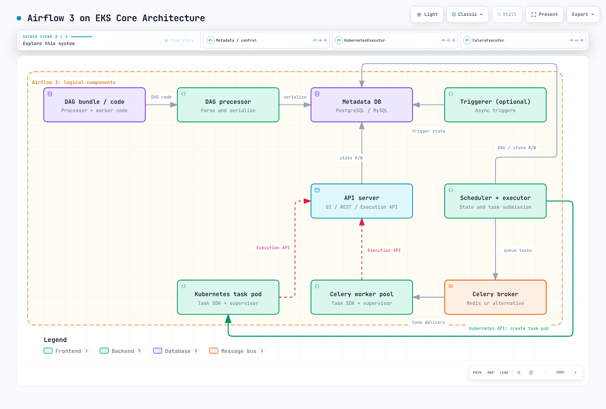

# Airflow on EKS Deep Dive

> **Review baseline**: Airflow 3.3.1 · official Helm chart 1.22.0 · September 12, 2026

Apache Airflow defines workflow dependencies as DAGs and schedules, runs and
observes their tasks. On EKS, per-task pod behavior depends on the **executor and
operator**, not merely on installing a Helm chart.

Airflow 2 reached EOL on April 22, 2026. Use a maintained 3.x release for new
deployments. Chart 1.22.0 defaults to **Airflow 3.2.2**, so verify chart, image and
Airflow configuration versions separately. This series reviews 3.3.1 behavior and
renders the chart with that version override.

## Core architecture

- The scheduler and executor decide and submit task work and update metadata state.
- The required DAG processor parses/serializes DAG bundles. Workers also need task
  code through the relevant bundle or code-distribution path.
- The API server provides UI, REST API and Task Execution API paths. A supervised
  Python Task SDK runtime uses that API for state and Connection/Variable/XCom access.
- The triggerer runs **triggers** while deferrable tasks wait. It is optional in a
  minimal deployment that does not use deferral.
- Metadata backends include PostgreSQL and MySQL. This series uses PostgreSQL as
  an example, not the only choice. Redis is also not the only Celery broker option.

[Interactive diagram](https://www.atomai.click/kubernetes-docs/archmaps/en-data-on-eks-airflow-readme-0.html)

DAG bundles do not universally replace git-sync. The official chart still supports
git-sync; distinguish delivery from bundle versioning. Parser separation also does
not eliminate all latency, database bottlenecks or HA concerns.

## Series

1. [Airflow architecture on Kubernetes](01-architecture.md): components, Execution API, databases/brokers and executors.
2. [Helm deployment and executor choice](02-helm-deployment.md): official chart, versions, connections and worker scaling.
3. [DAG patterns and KubernetesPodOperator](03-dag-patterns.md): pods, code delivery, bundles and Spark/dbt.
4. [Amazon MWAA integration](04-mwaa-integration.md): managed scope, EKS integration, versions and cost.
5. [Operations and security](05-operations.md): HA, migrations, secrets, logs, observation and recovery checks.

- [Airflow 3.3.1 architecture](https://airflow.apache.org/docs/apache-airflow/3.3.1/core-concepts/overview.html)
- [Supported versions and lifecycle](https://airflow.apache.org/docs/apache-airflow/3.3.1/installation/supported-versions.html)
- [Airflow prerequisites](https://airflow.apache.org/docs/apache-airflow/3.3.1/installation/prerequisites.html)
- [Executor configuration and history](https://airflow.apache.org/docs/apache-airflow/3.3.1/core-concepts/executor/index.html)
- [DAG bundles](https://airflow.apache.org/docs/apache-airflow/3.3.1/administration-and-deployment/dag-bundles.html)
- [Deferrable operators and triggers](https://airflow.apache.org/docs/apache-airflow/3.3.1/authoring-and-scheduling/deferring.html)

[Quiz](../../quizzes/data-on-eks/airflow/01-architecture-quiz.md)
