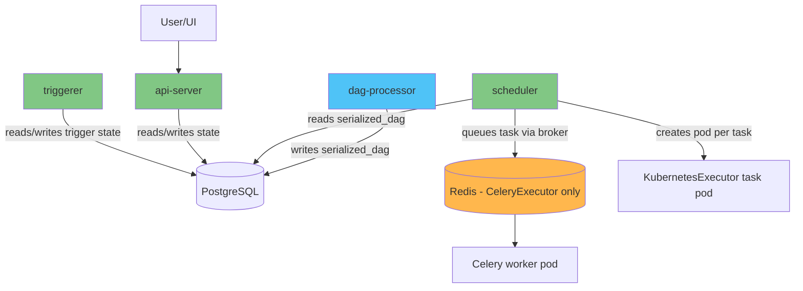

# Airflow on EKS Deep Dive

## Overview

Apache Airflow is the de facto standard orchestrator for data pipelines — ETL/ELT jobs, ML training pipelines, and cross-system batch workflows — defined as directed acyclic graphs (DAGs) of tasks. On EKS, Airflow is commonly deployed through the **official `apache/airflow` Helm chart**, which lets individual tasks scale out as Kubernetes pods rather than compete for capacity on a fixed worker fleet. Airflow 2 reached end-of-life in April 2026, so any new deployment should target **Airflow 3.x**, which restructured the platform into independently scalable services and replaced several 2.x patterns (hybrid executors, `git-sync`-based DAG delivery) with Kubernetes-native equivalents.

> **Supported Versions**: Apache Airflow 3.2+, Kubernetes 1.30+
> **Last Updated**: July 15, 2026

## Core Architecture Concepts

Airflow 2 ran a single **webserver** process for the UI/API and a **scheduler** process that both scheduled tasks *and* parsed DAG files — under load, expensive DAG parsing could starve the scheduler's actual scheduling loop. Airflow 3 fixes this by splitting the control plane into four independently scalable services, each with one job: the **`api-server`** (a FastAPI-based service serving the UI, REST API v2, and auth), the **`scheduler`** (evaluates dependencies and queues task instances — nothing else), the **`dag-processor`** (a now-mandatory service whose sole job is parsing DAG files and writing the result to the metadata database's `serialized_dag` table), and the **`triggerer`** (runs deferrable operators that wait on external events). **PostgreSQL** is always required as the metadata database; **Redis** is only required if a `CeleryExecutor` worker pool is in use.

## Deep Dive Table of Contents

**[1. Airflow Architecture on Kubernetes](01-architecture.md)**
- Airflow 3's four-service split: api-server, scheduler, dag-processor, triggerer
- Why DAG parsing moved out of the scheduler into the mandatory dag-processor
- Backing services: PostgreSQL (always) and Redis (CeleryExecutor only)
- Executor landscape overview and the removal of hybrid executors in 3.0

**[2. Helm Deployment and Executor Choice](02-helm-deployment.md)**
- The official `apache/airflow` Helm chart vs. the unrelated community `airflow-helm/charts`
- Installing the chart and the top-level `executor` setting
- `KubernetesExecutor` vs. `CeleryExecutor` trade-offs in depth
- KEDA-based autoscaling (including scale-to-zero) for Celery workers

**[3. DAG Patterns and KubernetesPodOperator](03-dag-patterns.md)**
- `KubernetesPodOperator` and its pod spec precedence (`pod_template_file`, `full_pod_spec`, constructor args)
- Pinning task pods to dedicated node pools and assigning IRSA per task
- DAG bundles (`GitDagBundle`, `S3DagBundle`) replacing `git-sync`
- Launching Spark and dbt jobs from a DAG via KubernetesPodOperator

**[4. Amazon MWAA Integration](04-mwaa-integration.md)**
- What "managed" means for MWAA vs. a self-managed control plane on EKS
- Amazon MWAA vs. self-managed Airflow on EKS: version currency, cost, customization trade-offs
- Driving an EKS cluster from MWAA via `KubernetesPodOperator` with `in_cluster=False`
- A decision guide for choosing between MWAA and self-managed Airflow

**[5. Operations and Security](05-operations.md)**
- Scheduler HA, now safe at scale thanks to the decoupled dag-processor
- Database migration/upgrade practices and secrets backend configuration
- Remote logging and monitoring with Prometheus/Grafana
- A security checklist and a full go-live checklist for the series

## References

- [Apache Airflow Documentation](https://airflow.apache.org/docs/apache-airflow/stable/)
- [Airflow Helm Chart Documentation](https://airflow.apache.org/docs/helm-chart/stable/)
- [DAG Bundles](https://airflow.apache.org/docs/apache-airflow/stable/administration-and-deployment/dag-bundles.html)
- [Kubernetes Provider Documentation](https://airflow.apache.org/docs/apache-airflow-providers-cncf-kubernetes/stable/)
- [Amazon MWAA: Using KubernetesPodOperator with Amazon EKS](https://docs.aws.amazon.com/mwaa/latest/userguide/mwaa-eks-example.html)
- [AWS Data on EKS Project](https://awslabs.github.io/data-on-eks/)

## Quiz

To test what you've learned in this section, try the [Airflow Architecture Quiz](../../quizzes/data-on-eks/airflow/01-architecture-quiz.md).
