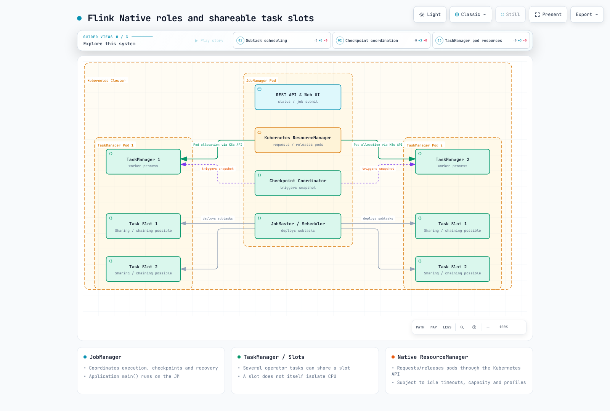

# Part 1: Flink Architecture on Kubernetes

> **Last Updated**: September 12, 2026. Integration examples: Flink 2.2.1 / Java 17 / Operator 1.15.0.

This chapter explains cluster roles and resource sizing. Prepare a currently
supported EKS/Kubernetes version, compatible kubectl, a Flink distribution and
client access. Part 2 covers installation, service accounts, RBAC and Operator
resources. Historical Kubernetes minimums are not current support matrices.

## 1. JobManager, TaskManager and client

| Role | Responsibility |
| --- | --- |
| Client | Depending on submission path, run application main() to build a graph or request application execution on the cluster |
| JobManager | Dispatcher, ResourceManager and per-job JobMaster coordinate submission, slots, execution, checkpoints and recovery |
| TaskManager | Execute task threads, exchange/buffer data and process state |
| Kubernetes ResourceManager | Request/release TaskManager pods through the Kubernetes API in Native mode |

The JobManager does not always build the initial graph in every deployment mode.
Application mode runs main() on the JobManager; ordinary 2.2 Session CLI submission
builds the graph on the client. TaskManagers perform normal operator record
processing, but application main() is user code: do not assume it leaves the
JobManager permanently lightweight.

### Slots, operator chaining and slot sharing

A task slot is a TaskManager resource-allocation unit. Classic fixed-slot
configuration partitions managed memory but **does not itself provide CPU isolation**.
Each TaskManager is a JVM that can host multiple task threads.

Flink can **chain** operator subtasks into one task/thread. Different tasks of the
same job can also share slots through **slot sharing groups**.
Consequently, four slots do not mean a maximum of four operator subtasks.

| Example assumptions | Simple slot calculation |
| --- | --- |
| source(4) → map(4) → sink(2), all in one sharing group | Can fit in 4 slots, the maximum parallelism |
| source/map in group A and sink in group B | Simultaneous execution of both groups requires 4 + 2 = 6 slots |

These are simple streaming examples with compatible group/resource requirements.
Account separately for batch scheduling, fine-grained resource profiles, other
jobs and chaining. At two slots/TM, four slots need at least two TMs and six slots
need at least three. Actual CPU, network, state size and headroom must also fit.



[Interactive diagram](https://www.atomai.click/kubernetes-docs/archmaps/en-data-on-eks-flink-01-architecture-0.html)

## 2. Application/Session selects cluster lifecycle and sharing

| Mode | main() and cluster lifetime | Operational boundary |
| --- | --- | --- |
| Application | Run main() on a cluster dedicated to an application; lifetime follows that application | One main() can create multiple jobs, so it is not invariably one cluster per job |
| Session | Submit applications/jobs to an existing cluster; ordinary 2.2 CLI runs main() on the client | Jobs share JM/TM capacity; one TM failure may affect several jobs |

Application mode separates JVMs/lifecycles between applications, but does not
fully isolate shared EKS nodes, network, storage or API quotas. Multiple jobs in
one application also share their cluster. The 2.2 baseline documents Application
HA for single-execute applications; check version-specific limits for multi-job
applications rather than applying 2.3 improvements retroactively.

Session mode can reuse allocated resources and avoid cluster startup overhead.
It does not guarantee immediate execution without free slots, and shared failures/
contention still matter.

Per-Job was the historical model of client-built graphs and job-specific clusters.
It is not a Native Kubernetes option. The current Kubernetes choices covered here
are Application and Session, not three supported modes.

## 3. Native/Standalone is a separate resource-management axis

Application/Session and Native/Standalone are different classifications.
Operator 1.15.0 supports Application/Session clusters and **Native/Standalone deployment**.

| Aspect | Native | Standalone |
| --- | --- | --- |
| TM pod management | JM's Kubernetes ResourceManager requests/releases pods through the API | An external manager such as the Operator reconciles Kubernetes resources |
| Runtime permissions | Kubernetes API permissions are needed for native resource management | External management is possible; separately check API permissions for additional features such as HA |
| Replica changes | Governed by Flink slot demands, idle policy and limits | Can be managed by the Operator/other controllers, not only hand-edited YAML |

Native is the normal default path, but Standalone is not simply a discarded legacy
mode. Select through CR spec.mode and assess where resource-creation privileges
should reside and which feature limits apply. This does not automatically remove
every Kubernetes API interaction or fully isolate untrusted code.

Native TaskManager allocation also depends on resource profiles, bounds and idle
timeouts. The 2.2.1 default resourcemanager.taskmanager-timeout is 30 seconds.
Job completion or lower parallelism does not immediately remove a precisely
proportional number of pods/nodes. Karpenter/Cluster Autoscaler manages node
capacity at a separate layer.

### Current CLI submission form

This is a **Native Application submission without the Operator**, after preparing
the namespace and flink service account/RBAC from Part 2.
Do not let both an Operator CR and the CLI manage the same cluster ID.
The bundled state-machine example is long-running; it is not a terminating batch
smoke test.

```bash
# Illustration after namespace/ServiceAccount/RBAC preparation from Part 2.
# Use the Flink 2.2.1 distribution and a cluster ID not owned by an Operator CR.
./bin/flink run \
  --target kubernetes-application \
  -Dkubernetes.cluster-id=flink-cli-example \
  -Dkubernetes.container.image.ref=flink:2.2.1-java17 \
  -Dkubernetes.namespace=data-processing \
  -Dkubernetes.jobmanager.service-account=flink \
  -Dtaskmanager.numberOfTaskSlots=2 \
  -p 2 \
  local:///opt/flink/examples/streaming/StateMachineExample.jar
```

The 2.2.1 CLI uses run --target kubernetes-application. Do not copy the old
run-application action. image.ref is the current key; container.image is a
deprecated alias. The local URI identifies the JAR inside this example image.
Verify client/JM permissions, image pulls, DNS, capacity and actual REST/log results.

## 4. Runtime and validation scope

Java 17 is the recommended/default image choice for this baseline.
Official image metadata also lists Java 11 variants, so it is incorrect to claim
that every 2.x Java 11 image was removed. The 2.2 documentation describes Java 21
support as experimental; arbitrary JDKs above 17 are not equally supported.
Match application bytecode, connectors and reflection settings as well.

Architecture, CLI dispatch/configuration keys, Operator source and image tag
metadata were checked. No cluster creation, CLI job submission, HA or throughput
test was performed here.

## References

- [Flink releases and connector compatibility](https://flink.apache.org/downloads/)
- [Flink 2.2 architecture](https://nightlies.apache.org/flink/flink-docs-release-2.2/docs/concepts/flink-architecture/)
- [Flink 2.2 deployment modes](https://nightlies.apache.org/flink/flink-docs-release-2.2/docs/deployment/overview/)
- [Native Kubernetes deployment](https://nightlies.apache.org/flink/flink-docs-release-2.2/docs/deployment/resource-providers/native_kubernetes/)
- [Java compatibility](https://nightlies.apache.org/flink/flink-docs-release-2.2/docs/deployment/java_compatibility/)
- [Operator 1.15.0 deployment modes](https://github.com/apache/flink-kubernetes-operator/blob/release-1.15.0/docs/content/docs/custom-resource/overview.md)

[Part 2: Operator](02-flink-kubernetes-operator.md)

[README](README.md)

[Quiz](../../quizzes/data-on-eks/flink/01-architecture-quiz.md)
