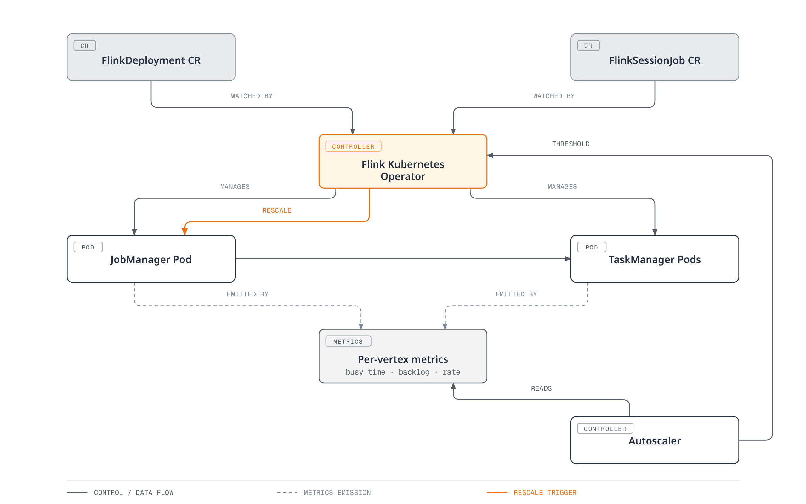

# Part 2: Flink Kubernetes Operator

> **Supported Versions**: apache/flink-kubernetes-operator 1.15+, Kubernetes 1.21+\
> **Last Updated**: July 15, 2026

## Lab Environment Setup

To follow along with the examples in this document, you will need the following tools and environment:

### Required Tools

* kubectl v1.21 or later
* Helm v3.12 or later
* A working Kubernetes cluster (Amazon EKS recommended)
* cert-manager is not required for a default install — the operator's Helm chart generates a self-signed webhook certificate through an internal Job. Only install cert-manager if you intend to bring your own PKI for the admission webhook.

## What is the Flink Kubernetes Operator?

The [Apache Flink Kubernetes Operator](https://github.com/apache/flink-kubernetes-operator) manages the full lifecycle of Flink deployments on Kubernetes using the Operator pattern. You could submit Flink jobs directly with the `flink run-application` CLI against a Kubernetes target, but that leaves a set of ongoing, error-prone tasks entirely on you:

* Sequencing safe upgrades and rollbacks of running jobs without losing state
* Continuously reconciling a job's desired parallelism against its actual load
* Managing savepoints and checkpoints as part of routine operations, not just disaster recovery
* Declaratively running both long-lived Session clusters and one-off Application clusters through the same tooling

The Operator abstracts all of this behind two CRDs (Custom Resource Definitions) — `FlinkDeployment` and `FlinkSessionJob`. You declare the desired job spec in YAML, and the Operator continuously reconciles the cluster's actual state to match it, including deciding *how* to apply a change (a full restart, a fast in-place upgrade, or something in between).

The latest release, **1.15.0** (May 2026), supports Flink **2.2.x, 2.1.x, 2.0.x, 1.20.x, and 1.19.x** as job runtimes, and requires **Kubernetes 1.21+** — the minimum version needed for the automatic namespace-labeling support that the operator's admission webhook relies on. Two notable capabilities landed recently:

* **1.14.0** (February 2026) added native **Blue/Green deployment** support, letting you run two versions of a job side by side and shift traffic/state between them under Operator control instead of scripting it externally.
* **1.15.0** adds Kubernetes-native `Conditions` on `FlinkDeployment.status` (so you can `kubectl wait --for=condition=...` on a deployment instead of polling `.status.jobStatus.state`), an optional Logback logging configuration alongside the default Log4j2, and bundles the `flink-metrics-dropwizard` reporter into the Helm chart by default.

### Core CRDs

* **FlinkDeployment**: Defines either an Application-mode cluster (a JobManager, TaskManagers, and exactly one job baked into the deployment) or a Session-mode cluster with no job attached (just a long-lived JobManager/TaskManager pool waiting for work)
* **FlinkSessionJob**: Submits a job onto an already-running Session-mode `FlinkDeployment`. One session cluster can host many `FlinkSessionJob` resources, each independently managed, upgraded, and deleted without touching the underlying cluster

Application mode gives each job its own dedicated cluster and full lifecycle isolation — the natural default for production jobs. Session mode trades that isolation for faster job startup and shared cluster overhead, which suits short-lived or exploratory jobs that don't justify spinning up a dedicated JobManager each time.

## Installation

```bash
# Add the Flink Kubernetes Operator Helm repository
helm repo add flink-operator-repo https://downloads.apache.org/flink/flink-kubernetes-operator-1.15.0/
helm repo update

# Install the operator into the flink namespace
helm install flink-kubernetes-operator flink-operator-repo/flink-kubernetes-operator \
  --namespace flink \
  --create-namespace

# Verify the installation
kubectl get pods -n flink
kubectl get crd | grep flink
```

By default, the operator watches every namespace in the cluster. To scope it to a specific set of namespaces, set `watchNamespaces` in the Helm chart values:

```bash
helm upgrade flink-kubernetes-operator flink-operator-repo/flink-kubernetes-operator \
  --namespace flink \
  --set watchNamespaces="{flink,flink-staging}"
```

### Minimal FlinkDeployment Example

```yaml
apiVersion: flink.apache.org/v1beta1
kind: FlinkDeployment
metadata:
  name: order-events-processor
  namespace: flink
spec:
  image: apache/flink:2.1.0
  flinkVersion: v2_1
  flinkConfiguration:
    taskmanager.numberOfTaskSlots: "2"
    execution.checkpointing.savepoint-dir: s3://my-flink-bucket/savepoints
    execution.checkpointing.dir: s3://my-flink-bucket/checkpoints
  serviceAccount: flink
  jobManager:
    resource:
      memory: "2048m"
      cpu: 1
  taskManager:
    resource:
      memory: "4096m"
      cpu: 2
  job:
    jarURI: local:///opt/flink/usrlib/order-events-processor.jar
    entryClass: com.example.flink.OrderEventsJob
    parallelism: 4
    upgradeMode: last-state
```

Once applied, the operator creates the JobManager Deployment, TaskManager Deployment, and supporting Services, then submits the job defined under `spec.job`.

```bash
kubectl apply -f order-events-processor.yaml -n flink
kubectl get flinkdeployment -n flink
kubectl wait --for=condition=Available flinkdeployment/order-events-processor -n flink --timeout=180s
```

## EKS Deployment Considerations

### 1. IAM Role for Service Accounts (IRSA) for Checkpoints/Savepoints

The example above points `execution.checkpointing.dir` and `execution.checkpointing.savepoint-dir` at S3. For the JobManager and TaskManager Pods to write there, the `serviceAccount` referenced in `spec.serviceAccount` needs an IAM role bound via IRSA (or EKS Pod Identity) with permissions scoped to that bucket/prefix — not a node-wide IAM role, so that only Flink workloads can read/write checkpoint and savepoint data.

```yaml
apiVersion: v1
kind: ServiceAccount
metadata:
  name: flink
  namespace: flink
  annotations:
    eks.amazonaws.com/role-arn: arn:aws:iam::123456789012:role/flink-checkpoint-access
```

### 2. Node Sizing and Scheduling for TaskManagers

TaskManager Pods are long-running and hold in-memory/RocksDB state, so unlike stateless web workloads they don't tolerate being rescheduled casually. A few practical guidelines:

* Size a dedicated [Karpenter](../../autoscaling/02-karpenter.md) NodePool for Flink TaskManagers with instance types that have enough local NVMe/EBS throughput if you're using the RocksDB state backend, since RocksDB does substantial local disk I/O for spilled state.
* Use `taskManager.podTemplate` to add `topologySpreadConstraints` or anti-affinity across AZs for jobs where a full AZ outage taking down all TaskManagers would be unacceptable.
* Avoid mixing TaskManagers with bursty, unrelated workloads on the same nodes — a noisy neighbor competing for CPU directly inflates a vertex's busy time, which can trigger unwanted autoscaler rescales.

## Upgrade Modes

`spec.job.upgradeMode` controls how the operator applies a change to a running job — a spec edit, a manual savepoint-triggered redeploy, or an autoscaler-driven rescale all go through the same mechanism. There are three modes:

* **`stateless`**: The job restarts from scratch with no state carried over. Only appropriate for jobs that don't need continuity across restarts (idempotent consumers, jobs with trivial or externally-persisted state).
* **`savepoint`**: The operator takes an explicit savepoint, tears the cluster down cleanly, and restores the new deployment from that savepoint. This is the safest option — a savepoint is a full, portable, verified snapshot — but it is also the slowest, since it requires a clean stop-the-world savepoint before anything else can happen.
* **`last-state`**: The operator uses the latest checkpoint's metadata to restore the job, without taking a fresh savepoint. This is fast, and — critically — it works even when the job is unhealthy or actively failing, since it doesn't depend on being able to cleanly quiesce the job to take a savepoint. `last-state` became usable specifically with `FlinkSessionJob` as of operator 1.10.0; before that it was only available for `FlinkDeployment`.

In practice, `last-state` is the default recommendation for production jobs with checkpointing enabled — it's the fastest path and the only one of the three that degrades gracefully when a job is already unhealthy. Reach for `savepoint` when you need a durable, externally verifiable snapshot (e.g., before a risky schema change), and `stateless` only when state genuinely doesn't matter.

## Autoscaler

The operator ships a built-in autoscaler that is meaningfully different from a typical Kubernetes HPA: instead of scaling pod replica counts based on CPU/memory, **it scales the parallelism of each individual vertex in the job graph** — source, map, join, sink, etc. — independently, based on how much data that specific vertex needs to process.

### How it decides parallelism

For each vertex, the autoscaler computes a *target processing rate*:

* **Source vertices**: the target rate is the incoming data rate (how fast records are arriving from Kafka, Kinesis, etc., including any backlog that needs to be caught up on).
* **Downstream vertices**: the target rate is the sum of the output rates of all upstream vertices feeding into it.

It then solves for the parallelism value that lets a vertex sustain that target rate at a configured utilization target — i.e., it looks at the vertex's current per-instance processing rate and busy time, and computes how many parallel instances would be needed to handle the target load without running the vertex flat-out at 100% busy.

Notably, the autoscaler does **not** use CPU or memory metrics at all. It relies on:

* Source backlog and source incoming rate
* Per-vertex record processing (output) rate
* Busy time / backpressured time per vertex

This is a deliberate design choice: in a streaming job, a vertex can be CPU-idle while still being the bottleneck (e.g., waiting on a slow external I/O call), or CPU-busy without actually being under load-driven pressure. Busy-time and processing-rate metrics reflect actual throughput pressure directly, which is what determines whether Flink can keep up with its input — CPU/memory utilization is a poor proxy for that in a dataflow engine where vertices have very different per-record costs.

### Key configuration

```yaml
flinkConfiguration:
  job.autoscaler.enabled: "true"
  job.autoscaler.target.utilization: "0.6"
  job.autoscaler.target.utilization.boundary: "0.2"
  job.autoscaler.stabilization.interval: "5m"
  job.autoscaler.metrics.window: "10m"
  job.autoscaler.catch-up.duration: "10m"
  pipeline.max-parallelism: "360"
```

* **`job.autoscaler.target.utilization`** (e.g. `0.6`): the busy-time ratio the autoscaler tries to keep each vertex at. Below this, it scales down; above it, it scales up.
* Scale-up/down thresholds are derived from the utilization target plus a boundary — in practice, treat roughly above 0.8 busy as the scale-up trigger and below 0.4 as the scale-down trigger, with a dead zone in between so the autoscaler doesn't oscillate on every small fluctuation.
* **`job.autoscaler.stabilization.interval`**: how long to wait after a rescale before considering another one, to let the job settle.
* **`job.autoscaler.metrics.window`**: the rolling window used to smooth metrics before making a scaling decision. A window of 3–60 minutes is the recommended range — too short reacts to noise, too long reacts too slowly to real load changes.
* **`job.autoscaler.catch-up.duration`**: extra time budget given to a vertex that's working through backlog, so the autoscaler doesn't over-scale in response to a temporary catch-up spike.
* **`pipeline.max-parallelism`**: sets the ceiling the autoscaler can choose parallelism values within. Set this to a **highly composite number** (120, 180, 240, 360, 720, etc.) — Flink's key-group model divides `max-parallelism` evenly among the chosen parallelism, so a highly composite ceiling gives the autoscaler far more valid divisor values to pick from than, say, a prime number would.

Under the hood, when the autoscaler decides to rescale a vertex, it triggers the rescale through the exact same mechanism described above — a `last-state` upgrade. That's why `last-state` needs to be fast and resilient: it's not just the upgrade mode for manual deploys, it's also the mechanism the autoscaler leans on continuously as load shifts.



## Next Steps

With the operator installed and the upgrade/autoscaling mechanics in place, the next step is deploying real stream processing jobs — configuring checkpointing and state backends, wiring up Kafka sources/sinks, and tuning resource sizing for production workloads.

[Return to Main Page](./README.md)

## Quiz

To test what you've learned in this chapter, try the [Topic Quiz](../../quizzes/data-on-eks/flink/02-flink-kubernetes-operator-quiz.md).
