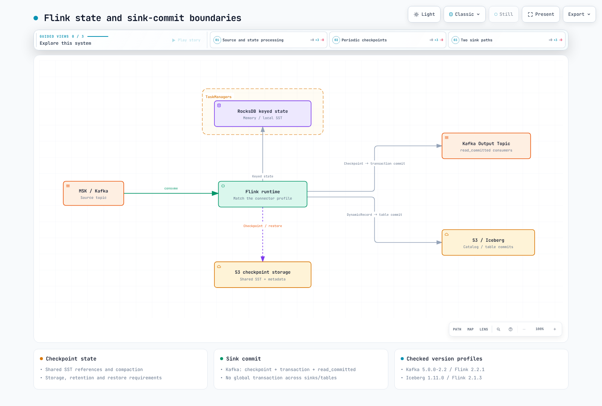

# Part 3: State, Checkpointing and Streaming Patterns

> Reviewed: 2026-09-12. Operator 1.15.0. Kafka examples use Flink 2.2.1; Iceberg examples use a separate Flink 2.1.3 combination.

State is the data remembered by aggregation, joins and deduplication. Not every
window retains every input record: incremental SUM/COUNT aggregations can keep
accumulators. Stateless processing can also lose or duplicate output through source
replay, acknowledgement or external-write failures. Validate **internal state,
replayable sources and sink commit guarantees** together.

## 1. Pin compatible combinations first

| Example | Flink | Additional dependencies |
| --- | --- | --- |
| Kafka sink/SQL | 2.2.1 / Java 17 | flink-connector-kafka 5.0.0-2.2, connector-base and required SQL/runtime/format modules |
| Dynamic Iceberg sink | 2.1.3 / Java 17 | iceberg-flink-runtime-2.1 1.11.0 |

The official Iceberg 1.11.0 distribution lists runtime JARs for Flink 2.1, 2.0 and
1.20. A 2.1 JAR on Flink 2.2.1 is not presented as a validated combination.
The Java helpers below compile against their respective combinations; execution
still needs sources, security, catalogs and storage configuration.

## 2. State backends differ from checkpoint storage

| Backend | Characteristics | Limits to examine |
| --- | --- | --- |
| HashMap | Keyed state stored as JVM heap objects | Heap, GC and serialization cost; measure for the workload |
| EmbeddedRocksDB | Serialized keyed state in local RocksDB; uses native memory/cache and disk | Requires managed/native memory, I/O and CPU as well as disk |
| ForSt | Disaggregated state using remote-filesystem SSTs and local cache | Experimental in 2.2; check async-state APIs and snapshot restrictions |

RocksDB does not mean exactly one instance per slot or that every operator-state/
user object is off heap. Keyed operators can have separate backends; instances in
a slot can share managed-memory budgets/caches. Operator state, timers, buffers
and user objects also consume memory.

Avoid an arbitrary MB threshold that mandates RocksDB. Compare state shape,
serialization, GC/I/O and checkpoint/restore times. ForSt also supports incremental
snapshots, so incrementality is not exclusive to RocksDB. This lab uses RocksDB.

### What incremental checkpoints reduce

RocksDB checkpoints persist new SST files and metadata while referencing reusable
shared SSTs. They do not directly diff logical key changes. Compaction can rewrite
large files even when the logical change is small.

Restore needs every file referenced by the chosen checkpoint, not sequential replay
of all historical checkpoints. Full checkpoints are not invariably single files.
Native SST restore can avoid rebuilding RocksDB from canonical key/value state,
but transfer volume, file count, network and I/O can make recovery faster or slower.
Do not independently expire shared S3 files still referenced by active checkpoints.

## 3. Actual prerequisites for S3 state preservation

Use Part 2's Operator, data-processing namespace and chart-created Role/flink.
Prepare the bucket/prefix and IAM role and replace the example values below.
Verify read/write/list, cleanup/delete, multipart and any KMS permissions by path.
A service-account annotation does not create an IAM role or configure OIDC trust.

```yaml
apiVersion: v1
kind: ServiceAccount
metadata:
  name: flink-state
  namespace: data-processing
  annotations:
    eks.amazonaws.com/role-arn: arn:aws:iam::123456789012:role/flink-state-checkpoints
---
apiVersion: rbac.authorization.k8s.io/v1
kind: RoleBinding
metadata:
  name: flink-state
  namespace: data-processing
roleRef:
  apiGroup: rbac.authorization.k8s.io
  kind: Role
  name: flink
subjects:
- kind: ServiceAccount
  name: flink-state
  namespace: data-processing
```

This FlinkDeployment uses IRSA, enables the S3 plugin for both JM/TM and uses
emptyDir for local RocksDB files. Recoverable state after pod/node loss resides
in S3. fsGroup matches this image's flink UID/GID 9999.

There is a material version limit: the reviewed 2.2.1 S3 Hadoop plugin contains
**Hadoop 3.3.4 and AWS SDK for Java 1.12.779**. SDK 1.x reached end of support on
2025-12-31. This example uses the artifact's actual v1 credential classes; it is
not a validated SDK v2 configuration. For production, assess upstream filesystem
support/security and compatible runtime/connector alternatives. Do not replace
isolated JARs or provider class names across SDK generations indiscriminately.

```yaml
apiVersion: flink.apache.org/v1beta1
kind: FlinkDeployment
metadata:
  name: flink-state-demo
  namespace: data-processing
spec:
  image: flink:2.2.1-java17
  flinkVersion: v2_2
  mode: native
  flinkConfiguration:
    taskmanager.numberOfTaskSlots: '2'
    state.backend.type: rocksdb
    state.backend.rocksdb.localdir: /opt/flink/state
    execution.checkpointing.storage: filesystem
    execution.checkpointing.dir: s3://replace-with-your-bucket/flink-state-demo/checkpoints
    execution.checkpointing.savepoint-dir: s3://replace-with-your-bucket/flink-state-demo/savepoints
    execution.checkpointing.interval: 2 s
    execution.checkpointing.mode: EXACTLY_ONCE
    execution.checkpointing.timeout: 10 min
    execution.checkpointing.min-pause: 30 s
    execution.checkpointing.incremental: 'true'
    execution.checkpointing.num-retained: '3'
    execution.checkpointing.externalized-checkpoint-retention: RETAIN_ON_CANCELLATION
    high-availability.type: org.apache.flink.kubernetes.highavailability.KubernetesHaServicesFactory
    high-availability.storageDir: s3://replace-with-your-bucket/flink-state-demo/ha
    fs.s3a.aws.credentials.provider: com.amazonaws.auth.WebIdentityTokenCredentialsProvider
  serviceAccount: flink-state
  jobManager:
    resource:
      memory: 2048m
      cpu: 1
  taskManager:
    resource:
      memory: 2048m
      cpu: 1
  job:
    jarURI: local:///opt/flink/examples/streaming/StateMachineExample.jar
    parallelism: 2
    upgradeMode: last-state
    state: running
    args:
    - --backend
    - rocksdb
    - --checkpoint-dir
    - s3://replace-with-your-bucket/flink-state-demo/checkpoints
    - --incremental-checkpoints
    - 'true'
  podTemplate:
    spec:
      securityContext:
        fsGroup: 9999
      containers:
      - name: flink-main-container
        env:
        - name: ENABLE_BUILT_IN_PLUGINS
          value: flink-s3-fs-hadoop-2.2.1.jar
        volumeMounts:
        - name: rocksdb-local
          mountPath: /opt/flink/state
      volumes:
      - name: rocksdb-local
        emptyDir: {}
```

StateMachineExample explicitly sets the checkpoint interval to **two seconds in
code**. The example configuration matches it. min-pause=30 seconds and checkpoint
duration mean actual snapshots do not occur at a fixed two-second cadence.
Application code can override a 60-second configuration value; inspect effective
runtime settings.

For Pod Identity, prepare the service-account association, Agent and networking
instead of the IRSA setup. With this v1 artifact, verify a container-credential
path such as com.amazonaws.auth.DefaultAWSCredentialsProviderChain.
Version 1.12.779 meets the documented Pod Identity minimum of 1.12.746, but remains
an end-of-support SDK. Inspect earlier environment/IRSA/other credential sources too.

After deployment, verify completed checkpoints, S3 metadata/data files, restart/
restore and application results beyond merely Running status. EmptyDir is not a
durable backup. No actual AWS deployment or failure recovery was executed in this review.

## 4. Checkpoint and savepoint lifecycle

| Aspect | Checkpoint | Savepoint |
| --- | --- | --- |
| Typical purpose | State/source positions for failure recovery | Deliberate restore, upgrade or fork point |
| Trigger | Periodic or explicit request | User/Operator request; automation can create them periodically |
| Retention | Count, externalized retention and job-termination policy | User/Operator policy and restore ownership |
| Format/storage | JobManager or filesystem storage, among other choices | Canonical/native formats and accessible storage |

Savepoints are not automatically permanent, and checkpoints are not always in S3.
Canonical format targets backend portability; native format is backend-specific.
Validate state schema, UIDs, serializers, maximum parallelism and version compatibility.

CLAIM/NO_CLAIM restore modes affect snapshot ownership and deletion responsibility.
A first RocksDB checkpoint after NO_CLAIM restoration can be full to establish
independence. Do not delete a snapshot while recovery still depends on it.
Operator last-state can use accessible HA metadata or the last checkpoint/savepoint;
it is not invariably a single most-recent checkpoint file.

### Request a fresh savepoint through a unique CR

generateName assigns a new name on creation, avoiding reuse of a completed
resource that could mistake an old snapshot for a new success.

```yaml
apiVersion: flink.apache.org/v1beta1
kind: FlinkStateSnapshot
metadata:
  generateName: flink-state-before-upgrade-
  namespace: data-processing
spec:
  jobReference:
    kind: FlinkDeployment
    name: flink-state-demo
  savepoint:
    formatType: CANONICAL
    disposeOnDelete: false
```
```bash
kubectl create -f savepoint.yaml
kubectl get flinkstatesnapshots -n data-processing --watch
```

Inspect the new CR's status.state=COMPLETED and status.path. Investigate error/job
state for FAILED or ABANDONED results. disposeOnDelete=false is this example's
retention choice, distinct from the default true and Operator cleanup policies.
Record who deletes retained files.

## 5. Kafka exactly-once requires checkpoints, transactions and consumers

KafkaSink EXACTLY_ONCE commits Kafka transactions in coordination with checkpoint
completion. It requires replayable sources, recoverable state and correct sink
configuration; downstream consumers must use read_committed.
It does not create one global atomic transaction across all subtasks, partitions
and other sink systems.
A Kafka transaction can span topics/partitions; the separate transactions of
multiple sink subtasks are not one transaction for the entire Flink checkpoint.

This helper compiles with Kafka connector 5.0.0-2.2 and Flink 2.2.1.
The caller supplies the input stream, actual bootstrap servers, TLS/SASL producer
settings and timeout, and executes the application. It is not a Kafka-cluster
installation recipe.

```java
import java.util.Properties;
import org.apache.flink.api.common.serialization.SimpleStringSchema;
import org.apache.flink.connector.base.DeliveryGuarantee;
import org.apache.flink.connector.kafka.sink.KafkaRecordSerializationSchema;
import org.apache.flink.connector.kafka.sink.KafkaSink;
import org.apache.flink.streaming.api.datastream.DataStream;

public final class KafkaExample {
    private KafkaExample() {}

    public static void attach(
            DataStream<String> input,
            String bootstrapServers,
            String transactionalIdPrefix,
            int transactionTimeoutMs,
            Properties securityProperties) {
        if (transactionTimeoutMs <= 0 || transactionalIdPrefix.isBlank()) {
            throw new IllegalArgumentException("Positive timeout and a unique stable prefix are required");
        }
        Properties producer = new Properties();
        producer.putAll(securityProperties);
        producer.setProperty("transaction.timeout.ms", Integer.toString(transactionTimeoutMs));
        input.getExecutionEnvironment().enableCheckpointing(60_000);

        KafkaSink<String> sink = KafkaSink.<String>builder()
                .setBootstrapServers(bootstrapServers)
                .setKafkaProducerConfig(producer)
                .setRecordSerializer(KafkaRecordSerializationSchema.<String>builder()
                        .setTopic("orders-enriched")
                        .setValueSerializationSchema(new SimpleStringSchema())
                        .build())
                .setDeliveryGuarantee(DeliveryGuarantee.EXACTLY_ONCE)
                .setTransactionalIdPrefix(transactionalIdPrefix)
                .build();
        input.sinkTo(sink).name("orders-enriched").uid("orders-enriched-sink");
    }
}
```

transactionalIdPrefix must be unique across independent concurrent sinks/jobs on
the same Kafka cluster and stable across restarts. Changing it can leave earlier
transactions un-aborted and block read_committed progress until timeout.
Blindly sharing it across blue/green runs risks fencing/conflicts.

The 5.0.0 builder defaults its transaction timeout to **one hour**. Match the broker's
allowed maximum and allow enough time for worst-case checkpoints/restarts/recovery.
A configuration label cannot restore exactly-once guarantees after transaction expiry.

A 60-second checkpoint interval is not an upper bound of 60 seconds of added latency.
Waiting, checkpoint duration, commit, failures/retries and consumer lag contribute.
Short intervals increase commit/metadata load. Default INCREMENTING naming creates
new IDs; optional POOLING reuses IDs and requires Kafka 3+, extra topic-read
permissions and a documented migration procedure. Not every configuration creates
new transaction IDs indefinitely.

## 6. Dynamic Iceberg sink: real APIs and a separate runtime

This helper targets Iceberg 1.11.0 / Flink 2.1.3.
Input RowData fields are target_table STRING, id BIGINT and value STRING; it is
**insert-only**. The caller provides a CatalogLoader configured for the catalog,
warehouse and authentication. Restrict destination table names to trusted/allowed values.

```java
import org.apache.flink.streaming.api.datastream.DataStream;
import org.apache.flink.table.data.GenericRowData;
import org.apache.flink.table.data.RowData;
import org.apache.iceberg.DistributionMode;
import org.apache.iceberg.PartitionSpec;
import org.apache.iceberg.Schema;
import org.apache.iceberg.catalog.TableIdentifier;
import org.apache.iceberg.flink.CatalogLoader;
import org.apache.iceberg.flink.sink.dynamic.DynamicIcebergSink;
import org.apache.iceberg.flink.sink.dynamic.DynamicRecord;
import org.apache.iceberg.types.Types;

public final class IcebergExample {
    private IcebergExample() {}
    private static final Schema PAYLOAD_SCHEMA = new Schema(
            Types.NestedField.required(1, "id", Types.LongType.get()),
            Types.NestedField.optional(2, "value", Types.StringType.get()));

    // Insert-only input RowData: target_table STRING, id BIGINT, value STRING.
    // The caller supplies an authenticated, authorized CatalogLoader.
    public static void attach(DataStream<RowData> input, CatalogLoader catalogLoader) {
        input.getExecutionEnvironment().enableCheckpointing(60_000);
        DynamicIcebergSink.forInput(input)
                .generator((row, out) -> {
                    TableIdentifier target = TableIdentifier.of("docs", row.getString(0).toString());
                    GenericRowData payload = GenericRowData.of(
                            row.getLong(1), row.isNullAt(2) ? null : row.getString(2));
                    out.collect(new DynamicRecord(
                            target, "main", PAYLOAD_SCHEMA, payload,
                            PartitionSpec.unpartitioned(), DistributionMode.HASH, 2));
                })
                .catalogLoader(catalogLoader)
                .uidPrefix("docs-dynamic-iceberg")
                .writeParallelism(2)
                .append();
    }
}
```

The actual API is forInput → generator → catalogLoader → append.
A generator emits zero or more records to a Collector rather than returning one
record. The older forRecords/withTableIdentifierSelector/withSchemaEvolutionEnabled
example did not exist in this release.

Each DynamicRecord supplies a target, schema, RowData and partition specification.
Evolution follows supported changes and configuration; it does not automatically
solve arbitrary renames/type changes. CDC updates/deletes require RowKind, equality
fields, upsert and table-format validation. Do not use this insert-only helper as
a complete CDC processor. Multiple-table commits and simultaneous Kafka/Iceberg
outputs are not a global atomic commit.

For simpler ingestion, consider MSK → Firehose → S3 Tables/Iceberg or an MSK Connect
sink. Check supported sources/networking, authentication, catalog/table format,
row operations/keys, buffering and failure handling. For example, Firehose Iceberg
documents V2/Parquet/MOR requirements. Managed infrastructure does not remove the
need to validate configuration, schemas and delivery semantics.



[Interactive diagram](https://www.atomai.click/kubernetes-docs/archmaps/en-data-on-eks-flink-03-state-checkpointing-streaming-0.html)

## 7. SQL, time attributes and late data

SQL/Table API expresses relational transformations/aggregation; DataStream exposes
custom state, timers and operator logic. SQL also offers advanced features, and
DataStream does not allow arbitrary bypass of checkpoint barriers/backpressure.
Check 2.x public APIs and connector/format JARs. Kafka/Iceberg/JDBC are not always
all bundled, and not every historical Scala API remains supported.

This planning example includes the table definition and watermark.
Before execution, match broker/security settings and JSON fields/time encoding
to the actual source.

```sql
-- Schema/planning example. Supply real broker/authentication settings before execution.
CREATE TEMPORARY TABLE orders (
  customer_id STRING,
  amount DECIMAL(12,2),
  event_time TIMESTAMP(3),
  WATERMARK FOR event_time AS event_time - INTERVAL '5' SECOND
) WITH (
  'connector' = 'kafka',
  'topic' = 'orders',
  'properties.bootstrap.servers' = 'kafka.example.invalid:9093',
  'properties.group.id' = 'docs-orders',
  'scan.startup.mode' = 'earliest-offset',
  'format' = 'json'
);

SELECT window_start, window_end, customer_id, SUM(amount) AS total_amount
FROM TABLE(TUMBLE(TABLE orders, DESCRIPTOR(event_time), INTERVAL '1' MINUTE))
GROUP BY window_start, window_end, customer_id;
```

The Flink 2.2.1 planner accepts this query and rejects a plain TIMESTAMP column
without the watermark/time attribute. This is planning validation, not a Kafka
read or executed window-result test.

A watermark estimates event-time progress; it does not guarantee that older
events cannot arrive. Event timestamps are not automatically present on every
record. Configure timestamp extraction, watermark strategy and input idleness.
Slow/idle inputs can stall progress, while resumed inputs can produce late data.

- Tumbling: fixed-size, non-overlapping windows.
- Sliding: fixed size plus a slide interval; smaller slides produce overlap.
- Session: based on event-time gaps and watermark progress, not merely a wall-clock idle timer.

With DataStream allowedLateness>0, retained window state can accept late records
and fire updated results. After cleanup, late records are dropped or sent to an
explicitly configured late-data side output. allowedLateness alone does not create
that output. Do not generalize SQL-window behavior from this DataStream option.

## Validation scope

The two runtime-specific Java helpers compiled with release 17 as the target.
Checks covered valid/missing-watermark SQL planning, v1 credential classes in the
S3 plugin archive, CRD/YAML structure and released source. Local Java tooling used
Corretto 21; no Java 17 cluster execution, AWS/Kafka/Iceberg connection, CDC or
failure-recovery test was performed.

## References

- [Flink 2.2 state backends](https://nightlies.apache.org/flink/flink-docs-release-2.2/docs/ops/state/state_backends/)
- [Checkpoint configuration](https://nightlies.apache.org/flink/flink-docs-release-2.2/docs/dev/datastream/fault-tolerance/checkpointing/)
- [Savepoints and ownership](https://nightlies.apache.org/flink/flink-docs-release-2.2/docs/ops/state/savepoints/)
- [S3 filesystem plugins](https://nightlies.apache.org/flink/flink-docs-release-2.2/docs/deployment/filesystems/s3/)
- [S3 plugin dependencies](https://github.com/apache/flink/blob/release-2.2.1/flink-filesystems/flink-s3-fs-base/pom.xml)
- [Bundled StateMachineExample](https://github.com/apache/flink/blob/release-2.2.1/flink-examples/flink-examples-streaming/src/main/java/org/apache/flink/streaming/examples/statemachine/StateMachineExample.java)
- [Operator snapshots](https://github.com/apache/flink-kubernetes-operator/blob/release-1.15.0/docs/content/docs/custom-resource/snapshots.md)
- [Kafka connector 5.0.0 sink](https://github.com/apache/flink-connector-kafka/blob/v5.0.0/flink-connector-kafka/src/main/java/org/apache/flink/connector/kafka/sink/KafkaSink.java)
- [Kafka transaction naming](https://github.com/apache/flink-connector-kafka/blob/v5.0.0/flink-connector-kafka/src/main/java/org/apache/flink/connector/kafka/sink/TransactionNamingStrategy.java)
- [Iceberg release/runtime matrix](https://iceberg.apache.org/releases/)
- [Iceberg 1.11 DynamicIcebergSink](https://github.com/apache/iceberg/blob/apache-iceberg-1.11.0/flink/v2.1/flink/src/main/java/org/apache/iceberg/flink/sink/dynamic/DynamicIcebergSink.java)
- [Windows and late data](https://nightlies.apache.org/flink/flink-docs-release-2.2/docs/dev/datastream/operators/windows/)
- [Watermarks and idleness](https://nightlies.apache.org/flink/flink-docs-release-2.2/docs/dev/datastream/event-time/generating_watermarks/)
- [EKS Pod Identity SDK requirements](https://docs.aws.amazon.com/eks/latest/userguide/pod-id-minimum-sdk.html)
- [AWS SDK for Java 1.x support status](https://docs.aws.amazon.com/sdk-for-java/v1/developer-guide/document-history.html)
- [Firehose Iceberg prerequisites](https://docs.aws.amazon.com/firehose/latest/dev/apache-iceberg-prereq.html)

[Part 4: Operations and HA](04-operations-ha.md)

[README](README.md)

[Quiz](../../quizzes/data-on-eks/flink/03-state-checkpointing-streaming-quiz.md)
