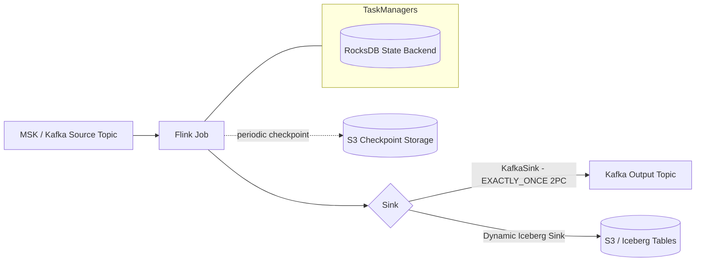

# Part 3: State, Checkpointing, and Streaming Patterns

> **Last Updated**: July 15, 2026

## Why State Management Is Flink's Hard Problem

A stateless stream processor just transforms each record and forwards it — nothing to remember, nothing to lose. Most real jobs aren't that simple: a windowed aggregation needs to remember every record it's seen in the current window, a join needs to remember one side while waiting for the other, and deduplication needs to remember which keys it has already processed. That remembered data is **state**, and it has to survive TaskManager crashes, Pod evictions, and rolling upgrades without corrupting results or silently dropping data. Everything in this part — state backends, checkpoints, savepoints, exactly-once sinks — exists to answer one question: how does a Flink job keep its state correct across failures while still keeping up with the input rate?

This assumes a Flink cluster is already running on EKS via the Kubernetes Operator, as covered in Part 2. The jobs described here are what actually runs on top of that cluster.

## State Backends: HashMap vs RocksDB

Flink stores operator state in a **state backend**, and the choice of backend determines where that state physically lives and how it scales.

| | HashMapStateBackend | EmbeddedRocksDBStateBackend |
| --- | --- | --- |
| **Storage location** | On-heap (JVM heap objects) | Off-heap, spills to local disk (RocksDB instance per TaskManager slot) |
| **Access speed** | Fastest — plain Java object access | Slower — every read/write goes through RocksDB's (de)serialization path |
| **State size limit** | Bounded by available heap memory | Bounded by local disk, so state can far exceed available memory |
| **Checkpoint type** | Full checkpoint only | Supports incremental checkpoints |
| **GC pressure** | Higher — large state means large heap, longer GC pauses | Lower — state lives off-heap, so the JVM heap stays small regardless of state size |
| **Best fit** | Small state, latency-sensitive jobs (simple aggregations, low-cardinality keys) | Large state (high-cardinality keys, long windows, large joins) — the production default at scale |

The trade-off is straightforward: HashMapStateBackend is faster per-operation because state lives as native Java objects on the heap, but that only works while total state size stays comfortably inside the TaskManager's memory budget. Once state grows — millions of keys, wide session windows, large stream-stream joins — heap-resident state starts fighting the JVM's garbage collector, and eventually you just run out of memory. EmbeddedRocksDBStateBackend trades some per-record latency (RocksDB serializes every key/value access) for the ability to spill state to local SSD, so state size is no longer capped by RAM. For any job whose state is expected to grow past a few hundred MB per TaskManager, RocksDB is the right default; keep HashMap for small, bounded state where the extra speed is worth the memory ceiling.

Selecting a backend is a single config value:

```yaml
# flink-conf.yaml (or FlinkDeployment.spec.flinkConfiguration)
state.backend.type: rocksdb
execution.checkpointing.incremental: true
```

## Checkpoints: How Flink Recovers From Failure

A **checkpoint** is a consistent, point-in-time snapshot of every operator's state across the whole job, taken automatically on a fixed interval while the job keeps running. If a TaskManager crashes, the JobManager restarts the affected tasks and restores their state from the most recent completed checkpoint, so processing resumes from a known-consistent point instead of from scratch.

```yaml
execution.checkpointing.interval: 60s
execution.checkpointing.mode: EXACTLY_ONCE
execution.checkpointing.timeout: 10min
execution.checkpointing.min-pause: 30s
```

### Incremental Checkpoints

With `EmbeddedRocksDBStateBackend`, a full checkpoint means re-uploading every key's current value on every checkpoint — expensive once state is large. Turning on incremental checkpointing changes what gets persisted:

```yaml
execution.checkpointing.incremental: true
```

Instead of a full snapshot, each incremental checkpoint persists only the RocksDB SSTable files that changed since the previous checkpoint, plus a manifest that records which older SSTable files (from earlier checkpoints) are still valid and needed to reconstruct the full state. This is a direct trade of network/time cost during the checkpoint for a small amount of recovery complexity:

* **Checkpoint cost drops** — only deltas are transferred, so checkpoint duration and network/storage cost scale with the rate of change, not with total state size.
* **Recovery cost shifts** — restoring from an incremental checkpoint means fetching the current delta plus every prior file the manifest still references, which can mean more individual file fetches than a full checkpoint's single snapshot. If checkpoint storage is network-bound (e.g., a slow path to S3), recovery can actually be slower than restoring a full checkpoint. If the bottleneck is CPU or IOPS on the TaskManager instead, incremental checkpoints usually recover faster because there's simply less total data to write back to RocksDB.

## Checkpoint Storage vs Savepoints

Both checkpoints and savepoints are persisted through Flink's filesystem-based checkpoint storage backend, which on EKS almost always means S3 (HDFS, GCS, and Azure Blob Storage are the equivalents outside AWS):

```yaml
execution.checkpointing.dir: s3://my-flink-checkpoints/checkpoints
execution.checkpointing.savepoint-dir: s3://my-flink-checkpoints/savepoints
```

Despite sharing the same storage mechanism, checkpoints and savepoints serve different purposes and should not be thought of as the same thing with different names:

| | Checkpoints | Savepoints |
| --- | --- | --- |
| **Triggered by** | Flink automatically, on a fixed interval | A user or operator, explicitly |
| **Purpose** | Failure recovery | Planned upgrades, migrations, version bumps |
| **Lifecycle** | Flink manages retention, expires old ones automatically | Retained until manually deleted — treated as a durable artifact |
| **Used by** | Automatic task restart | The Flink Kubernetes Operator's `last-state` upgrade mode (Part 2), or a manual `flink savepoint` / stop-with-savepoint |

The Operator's `last-state` upgrade mode from Part 2 actually restores from the **last checkpoint**, not a savepoint — that's what makes it fast and fully automatic, at the cost of being tied to a specific job graph. For a deliberate version bump, schema change, or migration to a different cluster, take an explicit savepoint first:

```bash
kubectl exec -n flink deploy/order-events-processor -- \
  flink savepoint <job-id> s3://my-flink-checkpoints/savepoints
```

Or, using the `FlinkStateSnapshot` CRD the Operator exposes for the same purpose, so the savepoint lifecycle is managed declaratively alongside the rest of the job's Kubernetes manifests instead of through an imperative CLI call.

## Exactly-Once Delivery to Kafka

This site's [Kafka on EKS](../kafka/01-kafka-fundamentals.md) section covers Kafka's own durability and partitioning model in depth — this section covers how Flink's `KafkaSink` layers exactly-once semantics on top of it when Flink is the producer.

`KafkaSink` configured with `DeliveryGuarantee.EXACTLY_ONCE` uses Kafka's transactional producer API through a two-phase-commit (2PC) protocol that's tied directly into Flink's own checkpointing:

1. Between checkpoints, the **KafkaWriter** writes records to Kafka inside an open Kafka transaction — the data is on the broker, but it isn't visible to consumers with `isolation.level=read_committed` yet.
2. When a Flink checkpoint completes successfully across the whole job, the **KafkaCommitter** commits the corresponding Kafka transaction — only then do the written records become visible downstream.
3. If the job fails before a checkpoint completes, Flink restores from the last checkpoint and the uncommitted Kafka transaction is aborted (or times out), so no partial output is ever exposed.

```java
KafkaSink<String> sink = KafkaSink.<String>builder()
    .setBootstrapServers("my-msk-cluster:9092")
    .setRecordSerializer(KafkaRecordSerializationSchema.builder()
        .setTopic("orders-enriched")
        .setValueSerializationSchema(new SimpleStringSchema())
        .build())
    .setDeliveryGuarantee(DeliveryGuarantee.EXACTLY_ONCE)
    .setTransactionalIdPrefix("orders-enrichment-job")
    .build();
```

A stable `transactionalIdPrefix` is required — Flink derives each subtask's actual transactional ID from this prefix, and on restore it needs to line up with the IDs the previous run's committer created so it can correctly resolve any transaction left open by the failure.

Two caveats are worth planning around before turning this on:

* **Output latency**: since a Kafka transaction only commits once the enclosing Flink checkpoint completes, downstream consumers reading with `read_committed` see output roughly one checkpoint interval late. A 60-second checkpoint interval means up to ~60 seconds of added latency, end to end.
* **Transaction coordinator load**: shortening the checkpoint interval to reduce that latency has a cost on the Kafka side — every checkpoint cycle opens a fresh transaction per sink subtask, and pushing checkpoint intervals down to just a few seconds across many parallel subtasks can flood the broker's transaction coordinator with transactional IDs to track. Tune checkpoint interval as a balance between acceptable output latency and coordinator load, not purely for recovery speed.

## Streaming Patterns: Kafka to S3/Iceberg

The most common pattern this site sees paired with Kafka on EKS is streaming data from MSK through Flink and landing it in Apache Iceberg tables on S3 for downstream analytics.



### Dynamic Iceberg Sink

Flink's Dynamic Iceberg Sink, which landed in the Iceberg Flink connector in November 2025, extends the existing Iceberg sink to write to **multiple Iceberg tables from a single sink**, choosing the destination table per record and evolving each table's schema automatically as the record content requires. Conceptually:

```java
// Illustrative — the table/schema for each record is derived from its content
// at runtime rather than fixed at job-graph construction time.
DynamicIcebergSink.forRecords(stream)
    .withTableIdentifierSelector(record -> record.getTargetTable())
    .withSchemaEvolutionEnabled(true)
    .build();
```

This is a strong fit for CDC fan-out: a single Debezium-sourced Kafka topic (or one topic per source table) carrying inserts/updates/deletes across many source tables can be routed to a matching Iceberg table per record, with new columns picked up automatically as upstream schemas change — without hand-maintaining one sink per table.

### When You Don't Need Flink

Flink is not the only way to get data from MSK into Iceberg on S3, and it's worth being deliberate about when its programmability actually earns its operational cost:

* **MSK → Data Firehose → S3 Tables/Iceberg**: a fully managed, no-code path. Firehose can write directly to S3 Tables (Iceberg-backed) with basic format conversion and buffering, no cluster to run at all.
* **MSK Connect + an Iceberg sink connector**: a Kafka Connect connector (running on the managed MSK Connect service) writes topic data straight into Iceberg tables, giving connector-level configuration without a general-purpose stream processor.
* **Flink on EKS**: reach for this when the pipeline needs actual computation — joins, windowed aggregation, per-record routing logic, complex event-time handling, or the dynamic multi-table fan-out described above. If the job is a straight passthrough or simple format conversion, a Firehose or MSK Connect pipeline is less to build and less to operate.

## Flink SQL / Table API vs DataStream API

Flink offers two different programming surfaces, and picking the right one up front avoids rewriting a job later:

| | Flink SQL / Table API | DataStream API |
| --- | --- | --- |
| **Best for** | Typical ETL, aggregation, windowing, joins expressible in SQL | Custom operators, complex event-time/state logic, fine-grained control |
| **Amount of code** | Low — declarative queries | Higher — explicit operator chains in Java/Python/Scala |
| **Built-in connectors** | Kafka, Iceberg, JDBC, and others ship as SQL connectors out of the box | Same connectors available, but wired up imperatively |
| **Control over internals** | Limited — the planner decides operator behavior | Full control over checkpointing barriers, backpressure handling, custom state access |
| **Recommended starting point** | Yes, for most jobs | Only when SQL/Table API can't express the required logic |

A simple windowed aggregation is genuinely less code in SQL:

```sql
SELECT
  window_start,
  window_end,
  customer_id,
  SUM(amount) AS total_amount
FROM TABLE(
  TUMBLE(TABLE orders, DESCRIPTOR(event_time), INTERVAL '1' MINUTE))
GROUP BY window_start, window_end, customer_id;
```

The same logic in DataStream API requires an explicit `KeyedStream`, a windowing call, and a custom aggregate function — more code, but necessary once the job needs something the Table API planner doesn't expose, such as manual control over checkpoint alignment or a hand-written operator with custom state.

## Windowing and Watermarks

Both APIs sit on the same event-time model. Every record carries an event-time timestamp, and **watermarks** are a heuristic signal — periodically injected into the stream — that assert "no more records with a timestamp older than this watermark should arrive." Windows use watermarks to decide when they're safe to close and emit a result, rather than relying on wall-clock (processing) time, which would produce inconsistent results if consumers lag or replay historical data.

The standard window types cover most use cases:

* **Tumbling windows**: fixed-size, non-overlapping (e.g., "every 1-minute bucket").
* **Sliding windows**: fixed-size, overlapping at a smaller step (e.g., "the last 5 minutes, recomputed every 1 minute").
* **Session windows**: dynamically sized, closing after a gap of inactivity longer than a configured timeout — useful for grouping bursts of activity per key (e.g., a user session) without a fixed window boundary.

Late data — records arriving after their window's watermark has already passed — is either dropped or routed to a **side output** for separate handling, depending on the configured `allowedLateness`.

## Lab Environment Setup

To follow along with the patterns in this part, you'll need:

* `kubectl` access to the EKS cluster used in Part 2, with the Flink Kubernetes Operator installed and a `FlinkDeployment`/`FlinkSessionJob` already running.
* An S3 bucket for checkpoint and savepoint storage, with the Flink job's IRSA role granted `s3:PutObject`/`s3:GetObject`/`s3:ListBucket` on it:

```bash
aws s3 mb s3://my-flink-checkpoints --region us-east-1
```

* (Optional) An MSK cluster reachable from the Flink job's VPC/subnets, with a topic created for the source and/or sink used in the exactly-once examples above.

```bash
kubectl get flinkdeployment -n flink
kubectl logs -n flink deploy/order-events-processor
```

## What's Next

This part covered how Flink keeps state correct and recoverable — state backends, checkpoints versus savepoints, exactly-once delivery to Kafka, and the streaming patterns that connect MSK to Iceberg on S3. The next part in this series moves from job-level concerns to cluster-level operations: monitoring, scaling, and running Flink on EKS in production.

[Return to Main Page](./)

## Quiz

To test what you've learned in this chapter, try the [Topic Quiz](../../quizzes/data-on-eks/flink/03-state-checkpointing-streaming-quiz.md).
