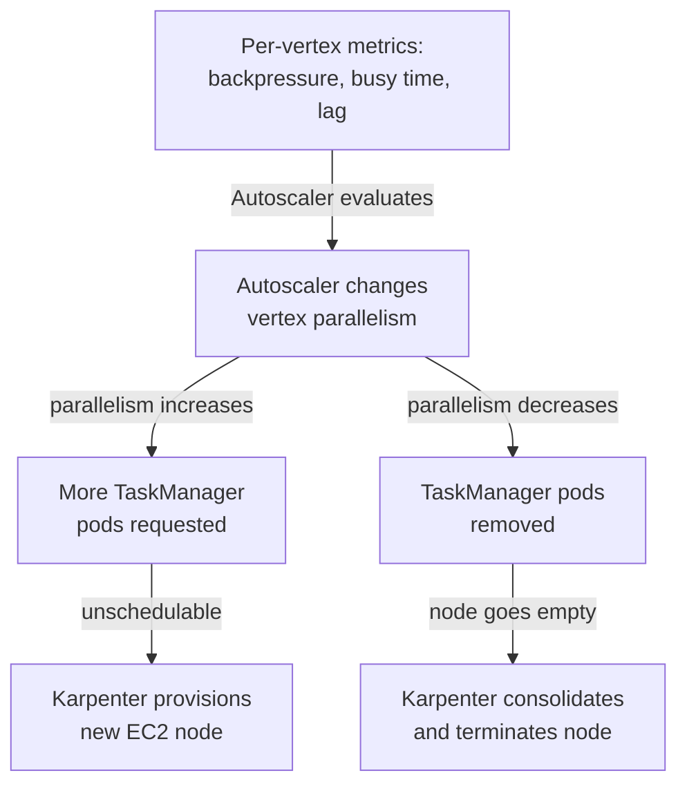

# Part 4: Operations, High Availability, and Managed Flink

> **Last Updated**: July 15, 2026

Parts 1-3 covered Flink's architecture on Kubernetes, installing and operating the Flink Kubernetes Operator, and choosing/tuning a state backend and checkpointing strategy. This final part covers what it takes to run that setup in production: scraping the metrics the JobManager and TaskManagers expose, understanding where a TaskManager pod's memory actually goes, configuring Kubernetes-native High Availability without Zookeeper, and coordinating the Flink Operator's autoscaler with Karpenter's node-level autoscaling. It closes with a comparison against Amazon Managed Service for Apache Flink — the fully managed alternative to everything covered in Parts 1-4 — and a checklist that rolls up the whole series.

## Lab Environment Setup

To follow along with the examples in this document, you will need the following tools and environment:

### Required Tools

* kubectl v1.28 or later, a working EKS cluster
* The Flink Kubernetes Operator (Part 2) installed on the cluster
* [Karpenter](../../autoscaling/02-karpenter.md) installed, with at least one `NodePool`/`EC2NodeClass` pair configured
* Prometheus Operator (kube-prometheus-stack) for scraping and alerting
* AWS CLI v2 (only needed for the Amazon Managed Service for Apache Flink comparison in Section 5)

## 1. Monitoring: Prometheus and RocksDB Metrics

Flink's built-in **Prometheus reporter** is the standard way to expose JobManager and TaskManager metrics, configured through `metrics.reporter.prom.factory.class` in `flink-conf.yaml` (or the equivalent `flinkConfiguration` block on a `FlinkDeployment` CR):

```yaml
# flinkConfiguration block on a FlinkDeployment CR (Part 2)
metrics.reporter.prom.factory.class: org.apache.flink.metrics.prometheus.PrometheusReporterFactory
metrics.reporter.prom.port: "9249-9250"
```

Once this is set, every JobManager and TaskManager pod exposes a `/metrics` endpoint that a `PodMonitor` can scrape, the same pattern used for Strimzi-managed Kafka brokers elsewhere in this series. As of the Flink Kubernetes Operator 1.15 release covered in Part 2, the Operator's own Helm chart now bundles the `flink-metrics-dropwizard` reporter as well, so the Operator's own reconciliation metrics (not just the jobs it manages) can be scraped the same way, without a separate manual install.

```yaml
apiVersion: monitoring.coreos.com/v1
kind: PodMonitor
metadata:
  name: flink-metrics
  namespace: flink
spec:
  selector:
    matchLabels:
      app.kubernetes.io/managed-by: flink-kubernetes-operator
  namespaceSelector:
    matchNames:
      - flink
  podMetricsEndpoints:
    - port: metrics
      path: /metrics
      interval: 30s
```

### RocksDB metrics for large-state jobs

For jobs using the RocksDB state backend (Part 3), the standard Prometheus reporter alone doesn't tell you *why* checkpointing or state access is slow — that requires RocksDB's own internals. The `state.backend.rocksdb.metrics.*` family of options opt in to exposing these, on a per-metric basis, because collecting all of them has a measurable CPU cost:

```yaml
state.backend.rocksdb.metrics.block-cache-usage: "true"
state.backend.rocksdb.metrics.num-running-compactions: "true"
state.backend.rocksdb.metrics.compaction-pending: "true"
```

* **Block cache usage** — how full RocksDB's in-memory block cache is; a cache that's constantly full and evicting means more reads fall through to disk, directly increasing state access latency.
* **Compaction stats** (`num-running-compactions`, `compaction-pending`) — RocksDB periodically merges SST files in the background; if compactions can't keep up with the write rate, read amplification grows and checkpoint duration lengthens.

These metrics matter specifically for **large-state jobs** — the point in Part 3's state backend discussion where RocksDB was recommended over the heap state backend in the first place. A job with a small, heap-sized state rarely needs this level of visibility; a job with hundreds of gigabytes of keyed state per TaskManager does.

### Dashboard panel groups

A Flink dashboard built on these two metric sources should cover at least:

* **Job health**: job/task restart count, last checkpoint duration and size, checkpoint failure rate
* **Throughput and backpressure**: per-vertex records-in/out per second, busy time ratio, backpressure ratio (the same signals the Section 4 autoscaler consumes)
* **RocksDB internals**: block cache usage, number of running compactions, compaction-pending flag, correlated against checkpoint duration spikes
* **Resource pressure**: JVM heap and managed-memory usage per TaskManager, GC pause time, network buffer availability

## 2. TaskManager Memory Model

Each TaskManager pod's total memory footprint is governed by `taskmanager.memory.process.size`, which Flink splits into four structural regions. This model is architecturally unchanged through the 2.x line — only the numbers you tune within it change per workload:

| Region | What lives there |
| --- | --- |
| **JVM heap** | Regular Java object allocation — user code, Flink's own runtime data structures, and (for the heap state backend) keyed state itself |
| **Managed memory** | Off-heap memory Flink manages directly rather than leaving to the JVM garbage collector — this is what RocksDB uses for its block cache and write buffers, and what batch operators use for sort/join buffers |
| **Network buffers** | Memory reserved for shuffling records between subtasks over the network (or within a pod, between local subtasks) |
| **JVM overhead** | Headroom for JVM-internal needs outside the JVM's own heap accounting — thread stacks, class metadata, code cache, and similar |

The practical consequence of this split is that **RocksDB competes with the network shuffle for the same off-heap "managed memory" pool**, not with the JVM heap. Increasing `taskmanager.memory.managed.fraction` gives RocksDB more block cache to work with (helping the compaction/cache metrics from Section 1), at the cost of less room for shuffle-heavy operators elsewhere in the same job graph. There is no single correct split — it depends on whether a given job is closer to a stateful streaming job (favor managed memory) or a shuffle-heavy batch/windowing job (favor network buffers), and the RocksDB metrics from Section 1 are the signal to watch when deciding which way to move it.

## 3. High Availability Without Zookeeper

Kubernetes-native HA, defined by **FLIP-144** and available since **Flink 1.12**, is the default and only recommended HA path in 2026 — for both native-Kubernetes deployments and the legacy standalone-on-Kubernetes mode from Part 1. It replaces the Zookeeper-based HA services Flink historically relied on with two pieces already built into Kubernetes:

* The **Kubernetes leader-election API** decides which JobManager replica is currently active, using the same leader-election primitive other Kubernetes controllers rely on.
* **ConfigMaps** store the active leader's address (so other components can find it) and the cluster's HA metadata — the JobGraph store and checkpoint pointers needed to recover a job on the new leader after a failover.

No external Zookeeper ensemble is deployed, upgraded, or backed up. Enabling it is a `flinkConfiguration` change on the `FlinkDeployment` CR from Part 2:

```yaml
# flinkConfiguration block on a FlinkDeployment CR
high-availability.type: kubernetes
high-availability.storageDir: s3://my-flink-bucket/ha/
kubernetes.cluster-id: my-flink-cluster
```

### RBAC: the ServiceAccount needs ConfigMap permissions

Because Flink's own JobManager process talks to the Kubernetes API directly to run leader election and read/write HA metadata, the `ServiceAccount` the JobManager pod runs as needs permission to create, read, update, and delete `ConfigMap` objects in its namespace — nothing broader:

```yaml
apiVersion: rbac.authorization.k8s.io/v1
kind: Role
metadata:
  name: flink-ha-role
  namespace: flink
rules:
  - apiGroups: [""]
    resources: ["configmaps"]
    verbs: ["get", "list", "watch", "create", "update", "patch", "delete"]
---
apiVersion: rbac.authorization.k8s.io/v1
kind: RoleBinding
metadata:
  name: flink-ha-rolebinding
  namespace: flink
subjects:
  - kind: ServiceAccount
    name: flink
    namespace: flink
roleRef:
  kind: Role
  name: flink-ha-role
  apiGroup: rbac.authorization.k8s.io
```

Without this Role bound to the JobManager's `ServiceAccount`, HA configuration silently fails at the point the JobManager tries to write its leader ConfigMap — the pod comes up but leader election and failover never actually function, which is an easy thing to miss until the first real JobManager failure.

Two details are easy to get wrong the first time:

* **`high-availability.storageDir` must point at durable, shared storage** (S3 in the example above) reachable by any pod that could become the new leader — it's where the JobGraph and checkpoint pointers actually live, with the ConfigMap only holding a pointer to that location plus the leader address.
* **Unlike the Zookeeper-based HA this replaces, there's no separate quorum ensemble to size.** Kubernetes' own leader-election API handles that. What you still control is how many JobManager **replicas** the `FlinkDeployment` runs — running more than one gives you a warm standby ready to take over immediately on failover, rather than waiting for Kubernetes to reschedule a single JobManager pod from scratch.

## 4. Two-Tier Autoscaling: Flink Autoscaler and Karpenter

The Flink Kubernetes Operator's built-in autoscaler (Part 2) and Karpenter form the same kind of **two coupled, independent control loops** this series' Spark deep dive describes for Karpenter and Dynamic Resource Allocation — each reacts to a different signal, and each only indirectly affects the other:

* **The Flink autoscaler** watches per-vertex metrics (backpressure, busy time, lag) and decides how much **parallelism** each operator in the job graph needs — a job-internal decision with no knowledge of the underlying nodes.
* **Karpenter** watches for TaskManager pods that can't be scheduled (or nodes that have gone empty) and decides whether to provision or deprovision EC2 capacity — a node-level decision with no knowledge of *why* those pods exist, only that they do.



The job-level decision (parallelism) always happens first; the node-level decision (EC2 capacity) only reacts to its consequences — pending or empty pods. Tuning one loop without the other produces the same kind of mismatch the Spark performance-tuning document warns about: if the Flink autoscaler scales parallelism up faster than Karpenter's [`NodePool`](../../autoscaling/02-karpenter.md#nodepool) can provision matching nodes, new TaskManager pods sit `Pending` longer than expected, stalling the very scale-up the autoscaler triggered. Keeping Karpenter's consolidation delay comfortably longer than the autoscaler's own stabilization window avoids the opposite problem — Karpenter reclaiming a node the autoscaler is about to need again.

## 5. Amazon Managed Service for Apache Flink

**Amazon Managed Service for Apache Flink** (the successor branding to Kinesis Data Analytics for Apache Flink) is AWS's fully managed, serverless alternative to everything covered in Parts 1-4. There are no clusters, hosts, or Kubernetes objects to provision at all, and JobManager high availability — the concern Section 3 spends an entire RBAC Role solving for yourself — is managed by AWS across multiple Availability Zones automatically. As of March 2026, the service added support for **Flink 2.2**, **Java 17**, and **RocksDB 8.10.0**, keeping it reasonably current with the upstream 2.x line this series covers.

| Aspect | Amazon Managed Service for Apache Flink | Self-Managed (EKS + Flink Kubernetes Operator, Parts 1-4) |
| --- | --- | --- |
| **Operational burden** | Fully managed and serverless — no clusters, hosts, or Kubernetes objects | You own the Operator, HA configuration (Section 3), and monitoring (Section 1); the Operator automates reconciliation but not the underlying decisions |
| **High Availability** | AWS manages JobManager HA across multiple AZs automatically | Kubernetes-native HA (Section 3) — you configure the RBAC Role and `flinkConfiguration` yourself |
| **Autoscaling** | Managed internally by the service | Two-tier stack you tune directly — the Flink autoscaler plus Karpenter (Section 4) |
| **Cost model** | Simple, usage-based billing tied to running KPUs (Kinesis Processing Units) | Direct EC2/EBS cost — Spot Instances are usable for real savings, but require the operational discipline covered in Part 2 |
| **Version support** | AWS curates the supported version list (Flink 2.2, Java 17, RocksDB 8.10.0 as of March 2026) | Adopt any version the Flink Kubernetes Operator supports, whenever upstream ships it |
| **Platform fit** | A separate AWS service surface, managed on its own | Runs through the same EKS/GitOps/observability pipeline as every other workload on the cluster |

### Why choose Amazon Managed Service for Apache Flink

* You want zero infrastructure operations — no Operator upgrades, no HA configuration, no node pool tuning
* Simpler, usage-based billing is worth more to your team than fine-grained cost control
* Your team doesn't already run other workloads on EKS, so there's no shared operational model to plug into

### Why run Flink yourself on EKS anyway

* **Cost control via Spot Instances** matters at your scale — AWS has published guidance specifically on optimizing Flink-on-EKS costs with EC2 Spot Instances, and that lever simply isn't available on a fully managed service billed per KPU
* You need **fine-grained autoscaler tuning** — the two-tier stack in Section 4 gives you direct control over both the job-level parallelism decision and the node-level capacity decision, rather than trusting a black box
* **Platform consistency** matters — an organization already running Kafka-on-EKS via Strimzi (as covered elsewhere in this Data on EKS series) gets one consistent operational model — the same GitOps pipeline, the same Prometheus/Grafana stack, the same on-call runbooks — instead of a second, separate AWS console and billing surface just for Flink

As with MSK vs. self-managed Kafka elsewhere in this series, the two options aren't mutually exclusive across an organization's whole portfolio — starting a new pipeline on the managed service and migrating to EKS once autoscaler tuning or Spot cost control becomes worth the operational investment is a reasonable trajectory.

### Decision guide

* **Do you want zero infrastructure operations, with no Operator or node pool to maintain?** → Yes: Amazon Managed Service for Apache Flink / No: EKS + Flink Kubernetes Operator is worth evaluating
* **Does cost control via Spot Instances matter at your scale?** → Yes: EKS self-managed / No: the managed service's usage-based billing is simpler
* **Do you need fine-grained control over the autoscaler and node provisioning behavior from Section 4?** → Yes: EKS self-managed / No: let the managed service handle it internally
* **Are you already running other stream-processing workloads (e.g., Kafka-on-EKS via Strimzi) through the same GitOps/observability pipeline?** → Yes: EKS self-managed, for one consistent operational model / No: the managed service avoids adding EKS operations just for Flink

## 6. Closing Summary: Wrapping Up the Flink on EKS Series

Across Parts 1-4, this series covered Flink's JobManager/TaskManager architecture and deployment modes (Part 1), installing and operating the Flink Kubernetes Operator (Part 2), choosing and tuning a state backend and checkpointing strategy (Part 3), and this part's operational concerns — monitoring, memory, HA, autoscaling, and the managed-service alternative. Rolling that up into a single pre-production checklist:

- [ ] **Deployment mode**: Application Mode is the default for production jobs; Session Mode is reserved for short-lived/ad-hoc workloads (Part 1)
- [ ] **State backend**: RocksDB vs. the heap state backend has been chosen deliberately based on state size, not left at the default (Part 3)
- [ ] **Checkpoint interval**: tuned against the job's actual state size and recovery time objective, not left at a generic default (Part 3)
- [ ] **Metrics**: the Prometheus reporter is enabled on every `FlinkDeployment`, and RocksDB metrics are enabled for any job using RocksDB state (Part 4)
- [ ] **Memory model**: `taskmanager.memory.managed.fraction` has been reviewed against whether the job is state-heavy or shuffle-heavy, not left at the default split (Part 4)
- [ ] **High Availability**: `high-availability.type: kubernetes` is set, and the JobManager's `ServiceAccount` has the RBAC Role granting ConfigMap `create`/`update`/`delete` permissions (Part 4)
- [ ] **Autoscaler configuration**: the Flink autoscaler's scale-up/down behavior and Karpenter's `NodePool` consolidation settings have been tuned together, not independently (Part 4)
- [ ] **Managed vs. self-managed decision**: the choice between Amazon Managed Service for Apache Flink and EKS self-managed is documented with its cost and operational rationale (Part 4)
- [ ] **Load testing**: autoscaler behavior and checkpoint duration have actually been observed under expected peak parallelism, not just estimated

Satisfying this checklist is a reasonable bar for saying a Flink deployment is ready to run in production on EKS.

---

[Return to Main Page](./)

## Quiz

To test what you've learned in this chapter, try the [Topic Quiz](../../quizzes/data-on-eks/flink/04-operations-ha-quiz.md).
