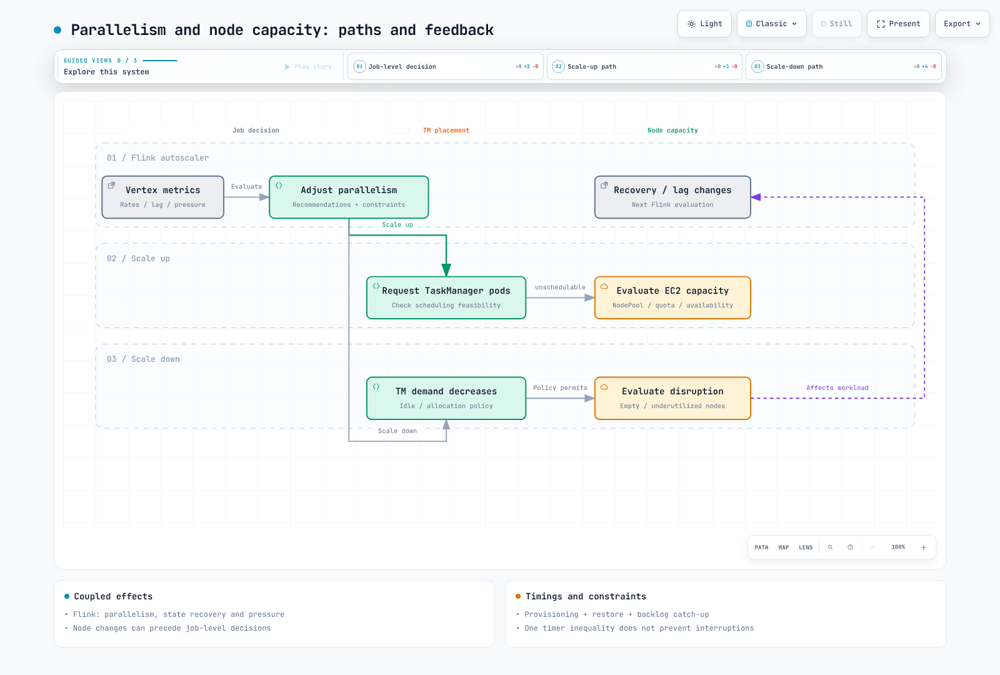

# Part 4: Operations, High Availability and Managed Flink

> Reviewed: 2026-09-12. Self-managed examples use Flink 2.2.1 / Operator 1.15.0; the managed-service comparison uses AWS's Flink 2.3 documentation.

Connect observability and HA to Part 3's stateful deployment, then validate failures,
recovery and capacity. Karpenter is not mandatory; inspect whichever node-capacity
model you operate. The examples assume Prometheus Operator and a Prometheus
configuration that selects the monitors.

## 1. Connect reporters, pod ports and PodMonitors together

A reporter setting alone does not complete Prometheus ingestion.
Match the JAR, listening port, named container port, selectors/namespaces and
Prometheus's own PodMonitor selection.

These are **fields to merge into Part 3's complete CR spec**.
The S3 plugin/volume configuration is retained while enabling the Prometheus plugin.
Separate pod IPs normally allow JM/TM to use the same 9249 port. Host networking
or multiple reporters in one pod needs a separate collision/discovery plan.

```yaml
flinkConfiguration:
  metrics.reporter.prom.factory.class: org.apache.flink.metrics.prometheus.PrometheusReporterFactory
  metrics.reporter.prom.port: '9249'
  state.backend.rocksdb.metrics.block-cache-usage: 'true'
  state.backend.rocksdb.metrics.block-cache-capacity: 'true'
  state.backend.rocksdb.metrics.num-running-compactions: 'true'
  state.backend.rocksdb.metrics.compaction-pending: 'true'
podTemplate:
  spec:
    securityContext:
      fsGroup: 9999
    containers:
    - name: flink-main-container
      env:
      - name: ENABLE_BUILT_IN_PLUGINS
        value: flink-s3-fs-hadoop-2.2.1.jar;flink-metrics-prometheus-2.2.1.jar
      volumeMounts:
      - name: rocksdb-local
        mountPath: /opt/flink/state
      ports:
      - name: flink-metrics
        containerPort: 9249
        protocol: TCP
    volumes:
    - name: rocksdb-local
      emptyDir: {}
  metadata:
    labels:
      metrics-group: flink-state-demo
```

```yaml
apiVersion: monitoring.coreos.com/v1
kind: PodMonitor
metadata:
  name: flink-state-metrics
  namespace: monitoring
  labels:
    release: monitoring
spec:
  selector:
    matchLabels:
      metrics-group: flink-state-demo
  namespaceSelector:
    matchNames:
    - data-processing
  podMetricsEndpoints:
  - port: flink-metrics
    path: /metrics
    interval: 30s
```

This PodMonitor lives in monitoring and selects workloads in data-processing.
metadata.labels.release=monitoring is an example: match the actual Prometheus
podMonitorSelector and podMonitorNamespaceSelector. The PodMonitor's own
namespaceSelector separately chooses target-pod namespaces.

Verify that pods actually have the metrics-group label and flink-metrics named port.
An assumed app.kubernetes.io/managed-by label or undeclared port name can produce
no targets. Also inspect Prometheus target health, real /metrics responses,
network policies and discovery RBAC.

### The Operator's own metrics need separate configuration

Bundling a Dropwizard reporter does not enable a Prometheus HTTP endpoint.
The Operator image provides reporter plugins, but the default chart selects Slf4j
and leaves metrics.port unset. This example extends Part 2's values with
Prometheus configuration and a named port.

```yaml
watchNamespaces:
- data-processing
image:
  repository: ghcr.io/apache/flink-kubernetes-operator
  tag: 1.15.0
  digest: sha256:5372e4461b433ee37391b0ee3fc3e4029980d14e9b64576b0cb78493d1cafe3a
webhook:
  create: true
metrics:
  port: 9249
defaultConfiguration:
  flink-conf.yaml: 'kubernetes.operator.metrics.reporter.prom.factory.class: org.apache.flink.metrics.prometheus.PrometheusReporterFactory

    kubernetes.operator.metrics.reporter.prom.port: 9249

    '
```

```yaml
apiVersion: monitoring.coreos.com/v1
kind: PodMonitor
metadata:
  name: flink-operator-metrics
  namespace: monitoring
  labels:
    release: monitoring
spec:
  selector:
    matchLabels:
      app.kubernetes.io/name: flink-kubernetes-operator
  namespaceSelector:
    matchNames:
    - flink-operator
  podMetricsEndpoints:
  - port: metrics
    path: /metrics
    interval: 30s
```

This chart's actual Operator pod has app.kubernetes.io/name but no default
app.kubernetes.io/instance label. Deployment metadata labels are not automatically
pod labels. Recheck rendered pods and targets after values changes.
The review verified selector/port agreement for both monitors, not live
Prometheus ingestion.

### RocksDB metric units and cost

block-cache-usage and block-cache-capacity are **bytes**; usage is not itself a ratio.
Handle zero/missing capacity if comparing them. A full cache alone does not prove
failure: inspect hit/miss behavior, read latency, I/O and compaction.
num-running-compactions is a count; compaction-pending is a state signal.
Enable metrics selectively, considering column-family/subtask series and overhead.

This Prometheus reporter maps Flink Counters to Gauges and Histograms to Summaries.
Inspect exported TYPE, names and labels before choosing counter/histogram queries.
Connect checkpoint success/failure/restore time, throughput/lag/backpressure,
JVM/native memory/GC/disk and pod-scheduling health in dashboards.

## 2. Managed and network memory are separate regions

The TaskManager memory model is more detailed than four undifferentiated regions.

| Region | Examples |
| --- | --- |
| Framework heap / task heap | Framework structures, user objects and heap state |
| Framework off-heap / task off-heap | Direct/native framework and user allocations |
| Managed memory | Budget for RocksDB, sort/hash operators and Python UDFs |
| Network memory | Separate shuffle/network-buffer budget |
| JVM metaspace | Class metadata |
| JVM overhead | Thread stacks, code cache and other JVM costs |

RocksDB and network buffers do not directly share one managed-memory pool.
They are still constrained by the overall process budget. Explicit managed size
overrides its fraction; avoid contradictory total/component settings and account
for consumer weights.

These results come from the actual Flink 2.2.1 calculation with 4GiB total process
memory and other settings at defaults. They are **configured budgets, not measured RSS**.

| Managed fraction | JVM heap (MiB) | Managed (MiB) | Network (MiB) |
| --- | ---: | ---: | ---: |
| 0.4 | 1587.20 | 1372.16 | 343.04 |
| 0.5 | 1244.16 | 1715.20 | 343.04 |


In this case, increasing managed fraction leaves network memory unchanged and
reduces task heap. Other configuration combinations can behave differently.
Inspect pod requests/limits, sidecars, native allocations/page cache and peak
RSS/GC. process.size is not a guarantee covering every pod-memory consumer.

## 3. Kubernetes HA: coordination and durable state

Kubernetes HA avoids operating an external ZooKeeper ensemble yourself; ZooKeeper
HA remains a supported alternative. The reviewed Flink implementation uses
Fabric8 **ConfigMapLock**, not a separate Kubernetes leader-election server/API
or invariably a Lease object. Kubernetes control-plane availability is a prerequisite.

| Location | Role |
| --- | --- |
| ConfigMaps | Leader information and recovery-state handles/references |
| high-availability.storageDir | Durable metadata/job-graph files for JM recovery |
| execution.checkpointing.dir | Storage for actual checkpoint state |

Part 3's plugin, credential and storage prerequisites still apply.
Setting an HA directory does not place every checkpoint-data file there.
These fields can be merged into an Operator-managed CR:

```yaml
# Merge into the existing FlinkDeployment spec.
jobManager:
  replicas: 2
flinkConfiguration:
  high-availability.type: org.apache.flink.kubernetes.highavailability.KubernetesHaServicesFactory
  high-availability.storageDir: s3://replace-with-your-bucket/flink-state-demo/ha
```

**Do not set kubernetes.cluster-id, kubernetes.namespace or high-availability.cluster-id
inside the Operator CR.** The 1.15 validator forbids them; the Operator manages
identity from the CR's name/namespace. This differs from low-level Flink CLI guides.

The JM service account needs ConfigMap coordination permissions. Native resource
management additionally needs pod/service permissions. An HA-only ConfigMap Role
does not provide all Native deployment permissions. Failures can surface as API
errors, logs and restarts; they do not invariably fail silently with healthy pods.

Two JM replicas can reduce startup delay but do not guarantee instant, uninterrupted
failover. Test node/AZ placement, election timeouts, storage access, restore/replay
time and duplicate external writes. Do not casually delete HA ConfigMaps/files or
treat deletion of an Operator CR as equivalent to deletion of its child Deployment.

## 4. Autoscaling and node capacity affect each other

The Flink autoscaler primarily adjusts vertex parallelism; node autoscalers adjust
schedulable capacity. Part 2's pressure/quota and stateful/in-place constraints apply.
There is no universal order where Flink always acts first and Karpenter only follows.
Node failure, Spot reclamation, drift or consolidation can first change job recovery
and lag.

Not every Pending pod needs another node. Distinguish scheduling failures from image
pulls, PVCs, admission and other causes. NodePool requirements/taints, resource
requests, available instances, quotas, PDBs and disruption policy also matter.
Consolidation can target eligible underutilized nodes as well as empty ones.

A consolidation delay longer than Flink stabilization does not guarantee capacity
retention or uninterrupted execution. Measure provisioning, state restoration and
backlog catch-up; tune spare capacity, retry/checkpoint objectives and disruption
policy together.



[Interactive diagram](https://www.atomai.click/kubernetes-docs/archmaps/en-data-on-eks-flink-04-operations-ha-0.html)

## 5. Compare Amazon Managed Service for Apache Flink

AWS now documents **Flink 2.3.0 support**, Java 17 as recommended and Python 3.12.
Distinguish service support from the self-managed runtime/connector examples.
The 2.3 service documents restrictions on Java 21, ForSt, Native S3 filesystem,
custom telemetry/reporters, Materialized Tables and Studio. Do not transplant
self-managed Prometheus settings or experimental features unchanged.

| Aspect | Managed Service | EKS + Operator |
| --- | --- | --- |
| Infrastructure | AWS manages service infrastructure and host/AZ recovery | Operate nodes, Operator, HA and upgrades |
| User responsibilities | Application, IAM/networking, connectors/state, capacity choices and recovery validation | The same application responsibilities plus Kubernetes operations |
| Scaling | Default CPU-based application parallelism; inspect configuration, limits and custom scaling | Coordinate vertex scaling, node capacity and disruption |
| Observability | Supported CloudWatch/telemetry paths | Configure reporters, Prometheus and other collection |
| Cost | Application KPUs, storage, orchestration and related services | EC2/EBS/control plane, storage/networking, observability and engineering |

Managed HA/migration does not automatically fix application errors or incompatible
state/connectors. Validate checkpoints/snapshots and restoration. The service's
resilience documentation describes multi-AZ ZooKeeper-based HA internally; customers
do not manage that ensemble or the internal EKS cluster themselves.

Default automatic scaling uses CPU to change application parallelism, which differs
from upstream per-vertex autoscaling. Review Parallelism, ParallelismPerKPU,
AutoScalingEnabled and quotas. Scaling/restarts can pause processing and require
backlog recovery.

A KPU provides one vCPU, 4GB memory and running storage. Documentation also lists an
additional orchestration KPU charge. Do not compare only one running-KPU number.
Likewise, evaluate Spot savings together with interruption/recovery costs.
Compare equivalent throughput, latency and recovery objectives; changing defaults
is not itself a goal.

## 6. Operational acceptance

- [ ] Record runtime/connector/state-format compatibility and Application/Session rationale.
- [ ] Verify real Prometheus targets/CloudWatch metrics, service/task logs and alert delivery.
- [ ] Measure heap/managed/network/native memory, disk and GC under peak load.
- [ ] Test HA coordination, checkpoint storage, credentials, restore and external-write results.
- [ ] Measure node/AZ failures, delayed capacity, Spot/disruption and backlog catch-up.
- [ ] Record upgrade/rollback, snapshot retention/deletion, cost and response ownership.

Keeping defaults is valid when requirements are met. Accept measured outcomes
and remaining limitations rather than treating checkboxes as a production guarantee.

## Validation scope

Checks covered two native Flink 2.2.1 memory calculations, workload/PodMonitor CRDs,
Operator Helm rendering and selector/named-port agreement. No live Prometheus
scrape, cluster deployment, HA failover, managed application run or cost measurement
was performed.

## References

- [Flink metric reporters](https://nightlies.apache.org/flink/flink-docs-release-2.2/docs/deployment/metric_reporters/)
- [TaskManager memory model](https://nightlies.apache.org/flink/flink-docs-release-2.2/docs/deployment/memory/mem_setup_tm/)
- [Kubernetes HA](https://nightlies.apache.org/flink/flink-docs-release-2.2/docs/deployment/ha/kubernetes_ha/)
- [Operator configuration validation](https://github.com/apache/flink-kubernetes-operator/blob/release-1.15.0/flink-kubernetes-operator/src/main/java/org/apache/flink/kubernetes/operator/validation/DefaultValidator.java)
- [RocksDB metrics](https://github.com/apache/flink/blob/release-2.2.1/flink-state-backends/flink-statebackend-rocksdb/src/main/java/org/apache/flink/state/rocksdb/RocksDBNativeMetricOptions.java)
- [Managed Flink 2.3 support and restrictions](https://docs.aws.amazon.com/managed-flink/latest/java/flink-2-3.html)
- [Managed Flink resilience](https://docs.aws.amazon.com/managed-flink/latest/java/disaster-recovery-resiliency.html)
- [Managed Flink automatic scaling](https://docs.aws.amazon.com/managed-flink/latest/java/how-scaling-auto.html)
- [Managed Flink KPU allocation](https://docs.aws.amazon.com/managed-flink/latest/java/how-scaling.html)

[README](README.md)

[Quiz](../../quizzes/data-on-eks/flink/04-operations-ha-quiz.md)
