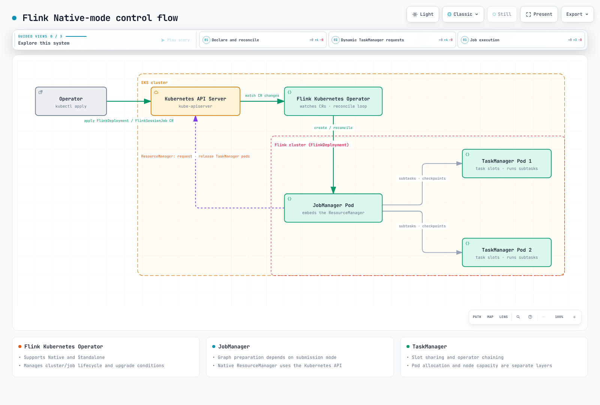

# Flink on EKS Deep Dive

Apache Flink is a distributed stateful engine for bounded and unbounded streams.
JobManagers coordinate execution/recovery; TaskManagers execute operator tasks and
exchange data. Checkpoint consistency and exactly-once behavior at an external sink
have separate requirements. Part 3 examines sources, state and sinks together.

> **Last Updated**: September 12, 2026
> Integration baseline: **Flink 2.2.1 / Java 17 / Operator 1.15.0**.

Part 3's Iceberg example separately uses **Flink 2.1.3 / Iceberg 1.11.0** to match its runtime.
Check each chapter's limits for S3-plugin SDK support and managed-service differences.

The latest stable Flink release is 2.3.0. These examples use 2.2.1 as the baseline
to check alongside published Operator and connector compatibility tables.
Accepting a version string in a CRD enum does not prove integration compatibility.
Choose Kubernetes/kubectl versions using current EKS support and version-skew
policies; “Kubernetes 1.21+” is not a current EKS support guarantee.

## Who manages what on Kubernetes?

- **FlinkDeployment** defines an Application or Session cluster.
- **FlinkSessionJob** defines a job submitted to an existing managed Session cluster.
- The Operator reconciles cluster/job lifecycle and supports **both Native and Standalone modes**.
- In Native mode, the JobManager's Kubernetes ResourceManager requests/releases
  TaskManager pods. In Standalone mode, an external manager such as the Operator manages Kubernetes resources.
- A task slot is neither a CPU core nor exactly one operator subtask. Chaining and
  slot sharing can place several operators in a slot; size state, memory and CPU separately.

The following shows **logical control flow in Native mode**. Pod release depends on
idle timeouts, capacity needs and cleanup policy; job completion does not
immediately eliminate node costs.

[Interactive diagram](https://www.atomai.click/kubernetes-docs/archmaps/en-data-on-eks-flink-readme-0.html)

## Chapters

1. [Architecture](01-architecture.md): processes/slot sharing and the Application/Session versus Native/Standalone axes.
2. [Flink Kubernetes Operator](02-flink-kubernetes-operator.md): CRDs, installation, upgrades and autoscaling.
3. [State, checkpoints and streaming](03-state-checkpointing-streaming.md): backends, recovery and actual connector guarantees.
4. [Operations and HA](04-operations-ha.md): metrics, HA storage, node capacity and managed-service comparison.

Declarative Operator management is the main path here; CLI examples explain the
runtime underneath it. Running without the Operator remains a supported choice.

## References

- [Flink releases and connector compatibility](https://flink.apache.org/downloads/)
- [Flink 2.2 architecture](https://nightlies.apache.org/flink/flink-docs-release-2.2/docs/concepts/flink-architecture/)
- [Flink 2.2 deployment modes](https://nightlies.apache.org/flink/flink-docs-release-2.2/docs/deployment/overview/)
- [Native Kubernetes deployment](https://nightlies.apache.org/flink/flink-docs-release-2.2/docs/deployment/resource-providers/native_kubernetes/)
- [Java compatibility](https://nightlies.apache.org/flink/flink-docs-release-2.2/docs/deployment/java_compatibility/)
- [Operator 1.15.0 deployment modes](https://github.com/apache/flink-kubernetes-operator/blob/release-1.15.0/docs/content/docs/custom-resource/overview.md)

[Quiz](../../quizzes/data-on-eks/flink/01-architecture-quiz.md)
