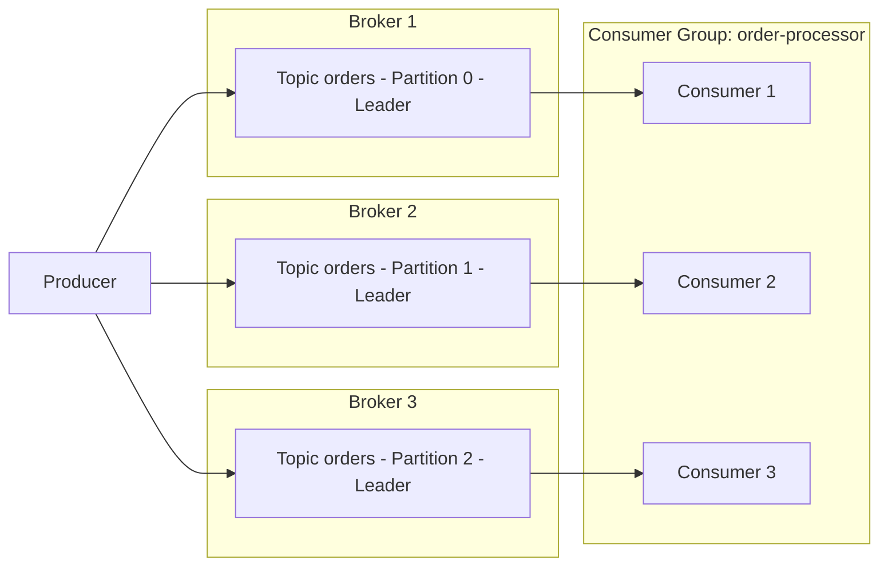

# Part 1: Kafka Fundamentals

> **Supported Versions**: Apache Kafka 3.9 (KRaft mode)\
> **Last Updated**: July 9, 2026

## What is Apache Kafka?

Apache Kafka is a distributed event streaming platform built for handling high-volume, real-time data streams. Originally developed at LinkedIn and later open-sourced as an Apache project, it is widely used for log aggregation, metrics pipelines, event-driven microservices, and change data capture (CDC) pipelines.

This document covers the core concepts you need before running Kafka on EKS: brokers, topics, partitions, consumer groups, replication, and KRaft. Part 2 walks through deploying these concepts on a real EKS cluster using the Strimzi Operator.

## 1. Kafka Architecture Basics

### Core Terminology

* **Broker**: A Kafka server process that stores messages and serves client requests. A Kafka cluster is typically made up of several brokers.
* **Topic**: A logical channel used to categorize messages, such as `orders` or `payments`.
* **Partition**: The physical unit a topic is split into. Each partition is an ordered, append-only, immutable log.
* **Offset**: A sequential, unique number assigned to each message within a partition. Consumers track "how far they've read" using offsets.
* **Replication Factor**: The number of brokers a partition's data is copied to, protecting against data loss when a broker fails.
* **Leader/Follower Replica**: For each partition, one replica is designated the leader and handles all reads and writes; the remaining follower replicas copy data from the leader.
* **ISR (In-Sync Replicas)**: The set of replicas that are sufficiently caught up with the leader. When a write is sent with `acks=all`, it is only considered successful once every replica in the ISR has received the message.

### Producer -> Partitions -> Consumer Group Flow



Producers write messages to a topic, and Kafka spreads those messages across multiple brokers at the partition level. Consumers that belong to the same consumer group split up the partitions between them (roughly one-to-one) and consume messages in parallel.

## 2. Partitions and Ordering Guarantees

Partition count is the single most important factor governing a cluster's parallel throughput. More partitions let more consumers work concurrently, but too many partitions increase metadata overhead and open file handles on the brokers.

> **Key Concept**: Kafka does **not** guarantee ordering across an entire topic. Ordering is only guaranteed **within a single partition**.

### Partition Key Selection Strategies

When a producer sends a message with a key, Kafka routes it to a partition based on a hash of that key. The same key is always routed to the same partition, which is how you preserve ordering between events that share a key.

| Strategy | Description | Example Use Case |
| --- | --- | --- |
| No key (null) | Round-robin or sticky partitioner spreads messages across partitions | Log ingestion where ordering doesn't matter |
| Entity ID as key | Pins events for the same entity to the same partition | Preserving order of status events for a given order ID |
| Custom partitioner | Routes partitions based on business rules | Isolating a specific customer's traffic to a dedicated partition |

```bash
# Create a topic with 6 partitions and a replication factor of 3
kafka-topics.sh --create \
  --bootstrap-server localhost:9092 \
  --topic orders \
  --partitions 6 \
  --replication-factor 3 \
  --config min.insync.replicas=2
```

A poorly chosen key can create a "hot partition" where traffic concentrates on a single partition, so make sure the key has enough cardinality (a large enough number of distinct values) to spread load evenly.

## 3. Consumer Groups and Rebalancing

### How Consumer Groups Work

Consumers that share the same `group.id` form a **consumer group**. Kafka automatically assigns a topic's partitions across the consumer instances in the group, and each partition is read by exactly one consumer within that group (if there are more consumers than partitions, some consumers sit idle).

### What Triggers a Rebalance

* A new consumer joins the group
* An existing consumer leaves the group (graceful shutdown) or is detected as departed via heartbeat timeout
* The number of partitions on the topic changes
* A consumer fails to send a heartbeat within `session.timeout.ms`, or exceeds `max.poll.interval.ms` because processing takes too long

Consumption pauses briefly for the affected group while a rebalance is in progress, so overly frequent rebalances hurt throughput. Using the `CooperativeStickyAssignor` minimizes partition movement during a rebalance and reduces its cost.

### Offset Commit Strategies

| Strategy | Configuration | Characteristics |
| --- | --- | --- |
| Auto-commit | `enable.auto.commit=true` (default) | Convenient periodic commits, but offsets can be committed before processing finishes, risking message loss |
| Manual commit (sync) | `enable.auto.commit=false` + `commitSync()` | Commits only after processing completes — safer, but lower throughput |
| Manual commit (async) | `enable.auto.commit=false` + `commitAsync()` | Higher throughput, but the application must handle commit failures itself |

### Delivery Semantics

* **At-most-once**: The offset is committed before the message is processed. Messages can be lost on failure.
* **At-least-once**: The offset is committed after processing (the commonly recommended default). Messages may be reprocessed on failure, so consumer logic should be designed to be idempotent.
* **Exactly-once**: Combining the producer's idempotent option with the transactional API (`transactional.id`) achieves exactly-once processing within Kafka (topic-to-topic). Exactly-once processing that spans external systems requires additional design work (for example, an exactly-once sink connector in Kafka Connect).

## 4. KRaft: Kafka Without ZooKeeper

Historically, Kafka relied on a separate ZooKeeper ensemble to manage cluster metadata — topic/partition information, ACLs, and controller election. Starting with Kafka 3.3, **KRaft (Kafka Raft metadata mode)** became production-ready (GA), and **Kafka 4.0 (released in March 2025)** removed ZooKeeper mode entirely, making KRaft the only supported metadata management mechanism.

### KRaft Architecture

Instead of a separate ZooKeeper cluster, KRaft designates a subset of the Kafka broker processes to act as the **controller quorum**.

* **Controller Voter**: A node that participates in the Raft consensus protocol and replicates the metadata log (typically an odd number, such as 3 or 5, for quorum).
* **Active Controller**: The single voter elected as leader that actually processes cluster metadata changes — partition leader election, topic creation, and so on.
* Controller and broker roles can be combined in the same process (`process.roles=broker,controller`) for smaller clusters, or split into dedicated controller-only nodes (`process.roles=controller`) for larger deployments.

### Before / After Comparison

| Aspect | ZooKeeper-based (default through Kafka 3.x) | KRaft-based (GA in 3.3+, only mode in 4.0+) |
| --- | --- | --- |
| Metadata storage | Separate ZooKeeper ensemble | Kafka's own internal metadata topic (`__cluster_metadata`) |
| Clusters required | Two — the Kafka cluster and the ZooKeeper cluster | One — just the Kafka cluster |
| Controller election | Leader election via ZooKeeper ephemeral znodes | Active controller elected via Raft consensus |
| Metadata scalability | ZooKeeper load grows with partition count | Log-based replication scales better for large partition counts |
| Kubernetes operational overhead | Requires a ZooKeeper StatefulSet, separate PVCs, and separate monitoring | No separate component to manage — just Kafka broker/controller pods |

This difference matters a lot in Kubernetes/EKS environments. ZooKeeper-based deployments required running both a Kafka StatefulSet and a ZooKeeper StatefulSet, and duplicating network policies, PodDisruptionBudgets, and monitoring across both components. KRaft eliminates that operational burden and reduces the number of resource types an operator like Strimzi needs to manage. The Strimzi-based deployment covered in Part 2 uses KRaft mode by default.

### Sample KRaft Node Configuration (server.properties)

```properties
# This node acts as both broker and controller (suitable for small clusters)
process.roles=broker,controller
node.id=1

# List of controller quorum voters (node.id@host:port)
controller.quorum.voters=1@kafka-0.kafka-headless:9093,2@kafka-1.kafka-headless:9093,3@kafka-2.kafka-headless:9093

listeners=BROKER://:9092,CONTROLLER://:9093
controller.listener.names=CONTROLLER
inter.broker.listener.name=BROKER

log.dirs=/var/lib/kafka/data
```

## 5. Replication and Durability Settings

How confident a producer can be that a message was "safely stored" depends on the combination of three settings.

* **`replication.factor`** (topic-level setting): Determines how many brokers a partition's data is copied to. A minimum of 3 is recommended, which tolerates up to two simultaneous broker failures without losing data.
* **`min.insync.replicas`** (topic-level setting): When a write is sent with `acks=all`, this specifies the minimum number of ISR members that must have the message for the write to be considered successful. A common combination is `replication.factor=3` with `min.insync.replicas=2`, which keeps writes available even if one broker fails.
* **`acks`** (producer-level setting): Determines how much confirmation the producer waits for before considering a write complete.

| `acks` value | Behavior | Durability | Latency/Throughput |
| --- | --- | --- | --- |
| `0` | Producer does not wait for any response | Lowest (messages can be lost right after sending) | Fastest |
| `1` | Considered successful once the leader has written it | Medium (unreplicated data can be lost if the leader fails) | Fast |
| `all` (`-1`) | Considered successful only once every ISR replica has written it | Highest | Relatively slower |

```bash
# Dynamically change min.insync.replicas on an existing topic
kafka-configs.sh --bootstrap-server localhost:9092 \
  --alter --entity-type topics --entity-name orders \
  --add-config min.insync.replicas=2
```

A common production-grade combination is `replication.factor=3`, `min.insync.replicas=2`, producer `acks=all`, and `enable.idempotence=true`. This combination survives a single broker failure without data loss, and the idempotent producer setting prevents duplicate writes caused by network retries. Note that `acks=all` adds latency compared to `acks=1`, so latency-sensitive workloads that can tolerate some data loss (such as metrics ingestion) sometimes trade durability for speed by choosing `acks=1`.

## Next Steps

This document covered Kafka's core concepts — the broker/topic/partition model, the scope of ordering guarantees, consumer group rebalancing, the shift to KRaft, and replication/durability settings. Part 2 covers deploying all of these concepts as a KRaft-based Kafka cluster on Amazon EKS using the **Strimzi Operator**.

[Return to Main Page](./README.md)

## Quiz

To test what you've learned in this chapter, try the [Topic Quiz](../../quizzes/data-on-eks/kafka/01-kafka-fundamentals-quiz.md).
