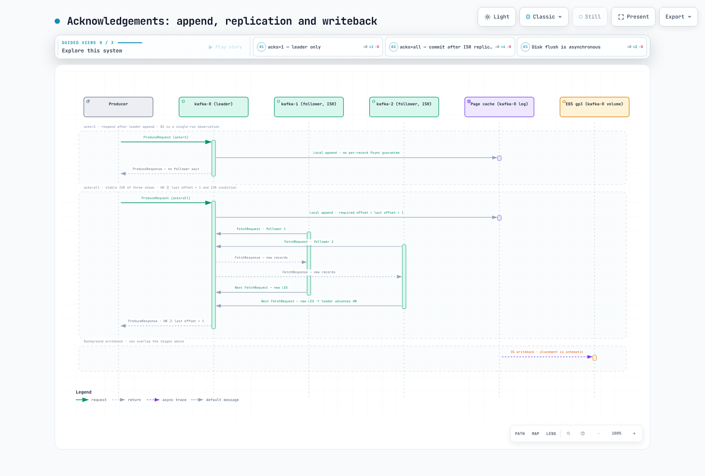

# Part 9: Kafka on EKS Benchmark — Reported Results and Reproduction Limits

> **Reported experiment**: September 2, 2026, 02:07–02:36 UTC\
> **Review updated**: September 12, 2026\
> **Experiment versions**: Kafka 4.3.1, EKS Kubernetes 1.36; three combined broker/controller pods

This page preserves the single-run tables reported in PR #166 and reviews their
units, comparisons and reproduction procedure. The original raw telemetry and
payload hash are not bundled with the repository report. This review did not
rerun the AWS experiment or independently confirm its historical measurements.

The data suggests storage, cache and client constraints worth testing. It does
**not establish a universal or multi-hour 130–135 MiB/s RF3 ceiling**. In particular,
the RF comparison also changes `acks`, and the batch comparison changes linger
and run length. Observed ratios must not be presented as isolated causal effects.


[Interactive diagram](https://www.atomai.click/kubernetes-docs/archmaps/en-data-on-eks-kafka-09-kafka-benchmark-0.html)

## Main observations and what they do not prove

| Reported comparison | Recorded values | Interpretation limit |
| --- | --- | --- |
| F1 RF3 / acks=all | 134.74 MiB/s client throughput; broker sampling window about 75 s | A short client rate, not a certified sustained disk-write rate |
| F4 versus F1 | 337.81 / 134.74 = 2.507× | RF, acks/implicit idempotence, run duration and cache state differ |
| F6 versus F1 | 148.38 versus 134.74 MiB/s, +10.12%; lower reported broker CPU | Batch, linger and record count all changed; no repeat-run variance estimate |
| B1 versus B2 | p50 3 ms each; p99 126 versus 17 ms | One rate-limited pair, not a universal “tail-only cost” |
| E4 versus E0 | Producer 57.37 versus 103.36 MiB/s, −44.49% | Read/write contention is plausible; a shared client also introduces contention |

## Reported environment

| Item | Value |
|---|---|
| Cluster | Amazon EKS, Kubernetes 1.36, ap-northeast-2 (Seoul), Karpenter-managed nodes |
| Brokers | 3 × `apache/kafka:4.3.1` (Kafka 4.3.1 distribution, reported OpenJDK 21.0.11), **KRaft combined mode** (each pod is broker + controller), StatefulSet, no operator |
| Broker nodes | 3 × **m5.xlarge** on-demand (4 vCPU, 16 GiB), all in ap-northeast-2b, one broker per node (`podAntiAffinity`), fresh nodes from the Karpenter `system` NodePool |
| Broker pod resources | requests 3 vCPU / 10 Gi, limits 4 vCPU / 12 Gi; `KAFKA_HEAP_OPTS=-Xms4G -Xmx4G` (remaining memory also serves off-heap/native allocations and page cache) |
| Broker storage | one **gp3 100 GiB** PVC per broker (EBS CSI, StorageClass `gp3`), default gp3 performance **3,000 IOPS / 125 MiB/s** (independent of size) |
| Broker config | `num.partitions=6`, `default.replication.factor=3`, `min.insync.replicas=2`, `log.segment.bytes=1 GiB`, `num.network.threads=4`, `num.io.threads=8`, `num.replica.fetchers=2`, `log.retention.hours=2` |
| Kernel | Amazon Linux 2023, 6.18.41-94.142.amzn2023.x86_64; `vm.dirty_ratio=20`, `vm.dirty_background_ratio=10`, `vm.dirty_expire_centisecs=3000` |
| m5.xlarge EC2 limits | network baseline 1.25 Gbps (burst 10 Gbps); EBS baseline 1,150 Mbps = 143.75 MB/s (≈ 137 MiB/s), 6,000 IOPS; this is the baseline, not the burst maximum |
| Load generator | one pod `kafka-client` (same image) on an **m5.large** node (2 vCPU, 8 GiB) in the same AZ, cgroup **1.9 CPU limit**, `KAFKA_HEAP_OPTS=-Xms2G -Xmx2G`; m5.large network baseline 0.75 Gbps (burst 10 Gbps) |
| Tools | `kafka-producer-perf-test.sh`, `kafka-consumer-perf-test.sh` shipped in apache/kafka 4.3.1 |
| Network path | pod-to-pod inside one AZ, PLAINTEXT (no TLS, no SASL) |
| Topics | fresh topic per test, 6 partitions; RF3 / `min.insync.replicas=2` unless noted (RF1 tests: RF1 / min.isr=1); `retention.bytes=-1` |
| Test producer settings | `linger.ms=5`, `batch.size=65536`, `buffer.memory=67108864` (64 MiB), `compression.type=none` unless noted |
| Hourly cost | 3 × m5.xlarge on-demand at $0.236/h + 3 × gp3 100 GiB at $0.0912/GB-month (Seoul region, Pricing API, 2026-09) |

The report describes one `kafka-1` restart at 02:05:22Z, before the first measured
test, and no restarts during the tests. Its “startup race” explanation was not
root-caused. Preserve that distinction.

All brokers and the load generator were reported in one AZ, using PLAINTEXT with
no SASL and no Strimzi Operator. This is not a three-AZ production comparison.
TLS, cross-AZ traffic, different node/storage limits and isolated controllers need
their own measurements.

## Payload and tool semantics

The reported file contained 20,000 synthetic JSON lines of **1,008 payload bytes**
each, including about 63.2% easily compressed `x` padding. Newline separators are
not part of each produced value. Ten million such values are **9.388 GiB** of
payload; the reported 1,018 on-disk bytes/record would be about **9.481 GiB** per copy.

The E2/E3 workload is **30,000,000 × 1,024 B = 28.610 GiB** of payload. Earlier labels
of “30 GiB” or “29.3 GiB” were not exact GiB conversions. Three million 1,024-byte
values are 2.861 GiB.

In Kafka 4.3.1:

- `--record-size` generates A–Z bytes for each record, adding client CPU work.
  `--payload-file` selects an already loaded value. Payload generation happens
  **before** the tool starts its reported send-latency timer.
- “MB/sec” in the output divides bytes by 1,024², so the unit is **MiB/s**.
  With compression, this counts uncompressed payload bytes, not NIC or volume bytes.
- Send latency starts just before `send()` and includes synchronous send/buffer
  waiting until callback. It excludes preceding payload generation and does not
  measure downstream processing. With `acks=0`, callback completion is not a broker
  durability acknowledgement.
- Large runs use periodic samples of integer-millisecond latencies. A reported
  p50 of 3 ms for both cases does not prove identical underlying latency.
- Failed callbacks are printed but are not counted as successfully sent records.
  Check the final successful count and stderr, not only the process exit status.
- Consumer total-time, fetch-time (excluding group join) and selected interval
  rates have different denominators. A final poll batch can exceed the requested
  record count.

The old `--producer-props` and consumer `--messages` options still work in this
version but are deprecated. The revised examples use `--command-property` and
`--num-records`.

## 1. RF, acknowledgements and sampling windows

Payload-file mode, no compression; the following are the original reported cells.

| Test | acks | RF | producers | records | rec/s | MiB/s | avg ms | p50 | p95 | p99 | p99.9 | max |
|---|---|---|---|---|---|---|---|---|---|---|---|---|
| F1 | all | 3 | 1 | 10 M | 140,164 | **134.74** | 443.89 | 321 | 1,276 | 2,689 | 4,026 | 4,038 |
| F2 | 1 | 3 | 1 | 6 M | 248,221 | 238.62 | 222.66 | 230 | 321 | 398 | 426 | 650 |
| F3 | 0 | 3 | 1 | 6 M | 241,138 | 231.81 | 235.02 | 191 | 333 | 1,977 | 4,327 | 4,340 |
| F4 | 1 | 1 | 1 | 10 M | 351,407 | **337.81** | 159.51 | 138 | 290 | 358 | 515 | 642 |
| F5 | all | 3 | 2 | 2 × 5 M | 67,694 + 67,360 = 135,054 | 65.07 + 64.75 = **129.82** | 893.88 / 889.22 | 639 / 630 | 2,536 / 2,493 | 3,270 / 3,301 | 4,284 / 4,228 | 4,662 / 4,660 |
| F6 | all | 3 | 1 | 6 M | 154,349 | 148.38 | 395.82 | 238 | 1,142 | 2,094 | 2,594 | 2,621 |

The arithmetic ratio F4/F1 is 2.507, but F4 uses RF1/acks=1 and F1 RF3/acks=all.
With the omitted idempotence setting, Kafka 4.3.1's defaults also differ between
these acknowledgement choices. This is not a controlled measurement of replication
alone. F4's roughly 32-second run spreads only about one third of its data onto
each broker and can be strongly affected by cache and client limits.

For F5, 129.82 is the sum of two individually reported rates. A rigorous combined
rate uses total successful bytes divided by a common start/end interval; adding
rates with different time windows need not give that result.

### Reported broker counters

| Window | write MiB/s avg (peak10s) | wIOPS | read MiB/s (rIOPS) | broker CPU cores | NIC tx / rx MiB/s |
|---|---|---|---|---|---|
| F1 RF3 acks=all 10 M (75 s) | 115.2–117.5 (134.9–135.1) | 495–505 | 0 | 0.64–0.84 | 80.2–108.1 / 134.2–135.8 |
| F2 RF3 acks=1 6 M (28 s) | 92.8–100.4 (124.1–127.6) | 397–427 | 0 | 0.53–0.62 | 64.4–80.4 / 123.7–125.0 |
| F3 RF3 acks=0 6 M (28 s) | 97.2–120.5 (123.5–124.1) | 414–514 | 0 | 0.80–0.81 | 87.3–94.4 / 163.5–170.6 |
| F4 RF1 acks=1 10 M (32 s) | 72.5–80.4 (117.6–129.1) | 312–346 | 0 | 0.30–0.31 | 0.3 / 119.9–125.4 |
| F5 2 producers RF3 acks=all (81 s) | 99.9–102.2 (134.8–135.5) | 431–439 | 0 | 0.59–0.81 | 66.5–89.7 / 113.8–115.6 |
| F6 RF3 acks=all batch 256 KiB (43 s) | 102.3–107.7 (134.8–135.4) | 426–445 | 0 | **0.40–0.50** | 68.7–110.4 / 124.2–124.5 |
| E2 fill 30M × 1,024 B, random mode (262 s) | 110.0–111.5 (134.5–135.0) | 468–473 | 0 | 0.72–0.80 | 74.9–77.5 / 114.3 |

The original sampler slept ten seconds between **sequential** kubectl calls, so
actual intervals were about twelve seconds. It stamped the round once, before
sampling all three brokers. Execution delay, timestamp resolution and window
boundaries therefore matter. The highest sample is not an estimator of steady
state, and the values around 135 MiB/s are not evidence that gp3's provisioned
125 MiB/s throughput should be modeled as 135.

The report's CloudWatch E2 windows contain 7,008–7,257 MiB/minute, or
116.8–121.0 MiB/s, and 29,637–30,730 writes/minute, or about 494–512 IOPS.
These aggregates are consistent with substantial sequential I/O. They do not
by themselves distinguish a volume limit, instance EBS limit, buffers or short
sampling artifacts. Low broker CPU does not rule out a client bottleneck.

### Storage balance model, not a measured universal cap

Let `Xlog` be the encoded log-byte rate for one copy, `R` the replication factor,
`B` the broker count and `D` the per-broker sustained storage budget. With balanced
placement, average broker writes are approximately `R × Xlog / B`, plus other I/O.
For exactly three brokers and RF3, every broker has one copy of every partition.
Balanced leader traffic also gives about `2 × Xlog / 3` replica transmit traffic
per broker; across the cluster replica traffic is about `2 × Xlog`.

This accounting helps form a hypothesis. It is not equivalent to a payload-rate
benchmark: encoding, compression, cache/writeback, reads and metadata consume
different budgets. Raising broker/volume throughput should be tested as a controlled
change before identifying a bottleneck exclusively.

## 2. Acknowledgement latency



[Interactive diagram](https://www.atomai.click/kubernetes-docs/archmaps/en-data-on-eks-kafka-09-kafka-benchmark-1.html)

Rate-limited B tests used 20,000 records/s, RF3 and random 1,024-byte values:

| Test | acks | linger.ms | avg ms | p50 | p95 | p99 | p99.9 | max |
|---|---|---|---|---|---|---|---|---|
| B1 | all | 5 | 5.27 | 3 | 6 | **126** | 173 | 771 |
| B2 | 1 | 5 | 2.58 | 3 | 5 | **17** | 40 | 642 |
| B3 | all | 0 | 3.23 | 3 | 5 | 25 | 59 | 752 |

The reported p99 ratio B1/B2 is 7.412; average latency also differs
(5.27 versus 2.58 ms), so “only the tail differs” overstates the result.
B3 changes linger, but the smaller-batch causal explanation needs request-size,
request-count and repeated-run evidence. No rate-limited acks=0 result was reported.

The A runs below also include random-payload generation overhead:

| Test | acks | RF | rec/s | MiB/s | avg ms | p50 | p95 | p99 | p99.9 | max |
|---|---|---|---|---|---|---|---|---|---|---|
| A1 | all | 3 | 107,150 | 104.64 | 11.38 | 3 | 50 | 164 | 263 | 871 |
| A2 | 1 | 3 | 105,955 | 103.47 | 3.00 | 1 | 11 | 38 | 79 | 812 |
| A3 | 0 | 3 | 112,461 | 109.82 | 1.48 | 0 | 6 | 26 | 52 | 636 |
| A4 | 1 | 1 | 109,926 | 107.35 | 1.57 | 1 | 6 | 11 | 36 | 662 |

Similar throughput across A configurations suggests a shared constraint, but is
not by itself a CPU profile. With acks=0 there is still client/buffer/socket
backpressure; the missing broker acknowledgement does not remove every form of
backpressure. Nor does a successful callback prove a replica contains the record.

In the sequence diagram, the high watermark is a **next offset**. For a batch whose
last record is at `r`, the required offset is `r+1`; acknowledgement requires the
appropriate HW check and ISR condition. The trace shows all three replicas in a
stable ISR, not a requirement that two followers always remain in ISR when minISR=2.

## 3. Batch size and producer count

| Test | Change vs F1 | MiB/s | avg ms | p99 ms | broker CPU cores |
|---|---|---|---|---|---|
| F1 | baseline: 1 producer, `batch.size=65536`, `linger.ms=5`, 10 M records | 134.74 | 443.89 | 2,689 | 0.64–0.84 |
| F5 | 2 producers (5 M records each), same props | 65.07 + 64.75 = 129.82 | 893.88 / 889.22 | 3,270 / 3,301 | 0.59–0.81 |
| F6 | `batch.size=262144`, `linger.ms=10`, 6 M records | 148.38 | 395.82 | 2,094 | **0.40–0.50** |

F6 changes batch size, linger and record count. Its reported throughput is
10.12% higher, and its broker-CPU range is lower. The midpoint calculation
`1 − 0.45/0.74 = 39.19%` describes those reported ranges; it is not an isolated
40% CPU saving caused by batch size. Without repetitions, the throughput difference
cannot be classified as “within noise.”

F5 did not improve the recorded rate in this setup. It also ran two producers on
the same constrained client pod. Repeat with independently provisioned clients and
a common timing interval before concluding that extra producers can never help.

## 4. Compression on the padded corpus

| codec | rec/s | MiB/s (uncompressed, as reported) | avg ms | p50 | p95 | p99 | p99.9 | on-disk B/record (per replica) | ratio vs none |
|---|---|---|---|---|---|---|---|---|---|
| none | 203,887 | 196.00 | 259.59 | 266 | 370 | 425 | 458 | 1,018 | 1.00× |
| lz4 | 275,356 | 264.70 | 4.38 | 3 | 11 | 24 | 60 | 113.1 | **9.0×** smaller |
| snappy | 198,557 | 190.87 | 5.07 | 3 | 10 | 35 | 205 | 141.7 | 7.2× |
| zstd | 160,274 | 154.07 | 5.39 | 5 | 10 | 18 | 47 | 61.3 | **16.6×** |
| gzip | 53,418 | 51.35 | 6.01 | 6 | 10 | 17 | 45 | 60.7 | 16.8× |

The original per-copy log sizes were 2,912.4 / 323.5 / 405.3 / 175.3 / 173.8 MiB
for none/lz4/snappy/zstd/gzip. Dividing by three million records reproduces the
rounded bytes/record cells. This is the reported Kafka log size, not every index,
filesystem or provisioned-volume byte.

The padding makes these results unrepresentative of many real datasets.
**Neither the ratios nor codec ordering are universal or mathematical upper
bounds.** The original report's whole-corpus zlib-6 figures were 18.5× with padding
and 7.8× without. Regenerating the published AWK with GNU Awk 5.1.0 during this
review produced 20,000 valid 1,008-byte lines with 63.17% padding, but ratios of
15.92× and 6.53×. That is a new corpus, not a replacement historical measurement;
pin the image/AWK implementation and retain the payload hash.

With topic compression set to `producer`, codec choice is preserved rather than
intentionally recompressing to another configured codec. Broker validation and
other processing still cost CPU. The lower reported latency with compression is
consistent with fewer stored/transferred bytes, but client CPU and phase-specific
I/O evidence are needed to claim an exclusive bottleneck shift.

## 5. Record size

| Test | record size | records | rec/s | MiB/s | avg ms | p50 | p95 | p99 | p99.9 |
|---|---|---|---|---|---|---|---|---|---|
| D1 | 100 B | 10,000,000 | 506,380 | 48.29 | 3.18 | 2 | 9 | 15 | 33 |
| A1 | 1,024 B | 3,000,000 | 107,150 | 104.64 | 11.38 | 3 | 50 | 164 | 263 |
| D2 | 10,240 B | 300,000 | 12,326 | 120.37 | 17.40 | 5 | 84 | 157 | 223 |

These are different record-generation workloads and record counts. The 100-byte
case has about 4.73× the records/s but 46.15% of the 1,024-byte case's payload rate.
This illustrates why both records/s and bytes/s matter; it does not isolate broker
per-record cost from client generation, batching or cache effects. Evaluate
aggregation only if its latency, key and failure semantics suit the application.

## 6. Replay alongside production

The reported E0 producer rate was 103.36 MiB/s with p99 82 ms. E1's selected hot
interval was 434.11 MiB/s. E2 produced thirty million 1,024-byte values
(28.610 GiB), reporting 112.84 MiB/s and p99 1,531 ms. Its recurring slow intervals
were observed, but dirty-page writeback was only a hypothesis.

Other recorded E2 latency values were average 60.17 ms, p50 2, p95 125,
p99.9 5,034 and max 5,258 ms. Across 51 reported intervals, five rates were below
60 MiB/s: 56.8, 36.3, 45.3, 40.8 and 45.8. These observations do not identify
the cause of the pauses.

E3's 13 full interval rates average **438.615 MiB/s** arithmetically:
337.6, 431.3, 414.2, 495.7, 454.9, 452.1, 387.9, 458.7, 439.9, 452.4,
447.7, 491.0 and 438.6. The replay was only partially cold; no fully cold-cache
state was established. Do not derive an exact page-cache byte rate simply by
subtracting disk averages from NIC averages with different windows.

| | Alone | During the replay | Test |
|---|---|---|---|
| Producer throughput | 103.36 MiB/s (105,843 rec/s) | **57.37 MiB/s** (58,746 rec/s) | E0 → E4 |
| Producer avg / p50 | — / — | 294.06 ms / 18 ms | E4 |
| Producer p95 / p99 / p99.9 / max | p99 82 ms | **1,587 / 2,147 / 2,425 / 2,569 ms** | E0 → E4 |
| Consumer throughput (mean of full 5-s intervals vs fetch-time rate) | 438.6 MiB/s | **299.62 MiB/s** of fetch time, 295,726 msg/s (288.79 MiB/s overall incl. the 3,666 ms rebalance; 29,297.33 MiB / 30,000,466 msgs in 101.4 s wall) | E3 → E4 |
| Per broker (produce window) | write 60.4–67.4 MiB/s (page cache absorbing the rest), read 0 | write 39.4–47.2 + read 28.6–37.7 MiB/s, tx 92.6–106.0 MiB/s, CPU 0.36–0.42 cores | E0 → E4 |

The E4 producer decrease is **44.49%**. Storage contention is plausible because
reads and writes share each volume, but producer and consumer also shared one
1.9-CPU client pod and its NIC. Whole-session throttling totals and low **broker**
CPU do not exclude phase-specific **client** contention.

The report records E4 consumption as 29,297.33 MiB and 30,000,466 records, with
288.79 MiB/s overall and 299.62 MiB/s excluding join time. Exceeding the requested
count by a final poll batch is possible; the extra count alone does not prove duplicates.

E1's selected interval, E3's unweighted interval average and E4's fetch/total rates
are not interchangeable. In particular, “438.6 → 299.62” is not a controlled
same-denominator throughput reduction. Preserve raw timestamps, total bytes and
phase-specific resource counters to compare a common interval.

## 7. How long is long enough?

Kafka acknowledgements do not imply a per-record fsync on every replica. Appends
can accumulate in page cache while writeback runs asynchronously; this does not
make replication a guarantee against every correlated failure.

The report includes F4 intervals above the idealized `3 × 125 = 375 MiB/s` volume
budget and writeback after E0 ended. Those are reasons to reconcile buffers and
measurement windows. **There is no universal ten-GiB or one-minute threshold that
proves disk steady state.** The F1 run's roughly 9.5 GiB of encoded data is not
such a proof either.

Use fixed warmup and long steady measurement periods, capture post-run drain,
watch dirty memory and EBS/network credit behavior, and repeat randomized test
orders. Change one factor at a time for causal comparisons. A storage-throughput
increase with other factors held stable is a useful follow-up experiment.

### Correct network and EBS comparisons

EC2 uses **separate inbound and outbound network credit buckets**. Do not add rx
and tx and compare the sum with one directional baseline. F1's reported maximum
rx 136 MiB/s is about **1.141 Gbps**, and tx 108 MiB/s about **0.906 Gbps**;
each is below the m5.xlarge 1.25 Gbps baseline. These F1 figures do not prove
broker network bursting.

The F4 client payload rate of 337.81 MiB/s is about 2.834 Gbps, above the
m5.large's 0.75 Gbps baseline. Credit-dependent client performance remains a
material limitation. Packet rate, flow limits and the other traffic on a node
also need observation.

m5.xlarge EBS bandwidth is listed as 1,150 Mbps baseline and 4,750 Mbps maximum:
about **137.09 / 566.24 MiB/s**, respectively. The baseline is not an absolute
instantaneous ceiling. The current gp3 maximum is **2,000 MiB/s**, subject to its
IOPS/volume conditions and the instance limit; the former 1,000 MiB/s statement is
outdated. Neither a larger volume nor a bigger broker automatically proves which
resource constrained the reported run.

## Cost arithmetic, not a bill or current price quote

Using the historical report's rates, `$0.236/broker-hour` and
`$0.0912/GB-month`, and its attribution assumptions:

| Calculation | Result |
| --- | --- |
| Three brokers × 50 minutes | $0.590 |
| Three 100-GiB volumes × 39 minutes, using a 730-hour divisor | $0.02436 |
| Those attributed items for one run | About $0.614 |
| Three brokers × 730 hours plus 300 GiB-month storage | $544.20 |

The 730-hour row is a planning convention, not a September invoice. The original
client node, EKS/control-plane charges, networking and other shared infrastructure
are excluded. A node retained for other workloads also makes runtime attribution
an estimate. Recheck current regional pricing before provisioning; this review
did not query a bill or establish a new price receipt.

Low broker CPU alone does not mean the compute spend is waste: memory, network,
EBS bandwidth, failure headroom and placement may require that instance size.

## Revised reproduction examples

Use a **new dedicated test environment/namespace**, standard EBS CSI support and
capacity for the stated instance types/AZ. Do not apply over existing Kafka/PVC
data. Replace the sample cluster ID with a fresh `kafka-storage.sh random-uuid`
value for a new run and record the actual image digest and runtime versions.

The manifest below is a **corrected reproduction template**, not the unchanged
historical manifest. It pins the stated AZ, defines explicit gp3 IOPS/throughput/
encryption, publishes headless DNS before readiness, adds TCP startup/readiness
checks and scopes broker ingress to benchmark pods. API token automount is disabled.
NetworkPolicy requires CNI enforcement. PLAINTEXT and combined roles are retained
for this isolated test, not offered as a production design.

```yaml
apiVersion: v1
kind: Namespace
metadata:
  name: bench-kafka
---
apiVersion: storage.k8s.io/v1
kind: StorageClass
metadata:
  name: bench-kafka-gp3
provisioner: ebs.csi.aws.com
volumeBindingMode: WaitForFirstConsumer
reclaimPolicy: Delete
parameters:
  type: gp3
  iops: '3000'
  throughput: '125'
  encrypted: 'true'
---
apiVersion: v1
kind: Service
metadata:
  name: kafka-hs
  namespace: bench-kafka
spec:
  clusterIP: None
  selector:
    app: kafka
  ports:
  - name: broker
    port: 9092
  - name: controller
    port: 9093
  publishNotReadyAddresses: true
---
apiVersion: apps/v1
kind: StatefulSet
metadata:
  name: kafka
  namespace: bench-kafka
spec:
  serviceName: kafka-hs
  replicas: 3
  podManagementPolicy: Parallel
  selector:
    matchLabels:
      app: kafka
  template:
    metadata:
      labels:
        app: kafka
      annotations:
        karpenter.sh/do-not-disrupt: 'true'
    spec:
      terminationGracePeriodSeconds: 60
      nodeSelector:
        node.kubernetes.io/instance-type: m5.xlarge
        karpenter.sh/capacity-type: on-demand
        topology.kubernetes.io/zone: ap-northeast-2b
      affinity:
        podAntiAffinity:
          requiredDuringSchedulingIgnoredDuringExecution:
          - labelSelector:
              matchLabels:
                app: kafka
            topologyKey: kubernetes.io/hostname
      securityContext:
        fsGroup: 1000
      containers:
      - name: kafka
        image: apache/kafka:4.3.1
        command:
        - /bin/bash
        - -c
        - |
          set -e
          ORD=${HOSTNAME##*-}
          export KAFKA_NODE_ID=$ORD
          export KAFKA_ADVERTISED_LISTENERS="PLAINTEXT://${HOSTNAME}.kafka-hs.bench-kafka.svc.cluster.local:9092"
          exec /etc/kafka/docker/run
        env:
        - name: CLUSTER_ID
          value: UdHYY7YQRrunSRromZFozw
        - name: KAFKA_PROCESS_ROLES
          value: broker,controller
        - name: KAFKA_CONTROLLER_QUORUM_VOTERS
          value: 0@kafka-0.kafka-hs.bench-kafka.svc.cluster.local:9093,1@kafka-1.kafka-hs.bench-kafka.svc.cluster.local:9093,2@kafka-2.kafka-hs.bench-kafka.svc.cluster.local:9093
        - name: KAFKA_LISTENERS
          value: PLAINTEXT://0.0.0.0:9092,CONTROLLER://0.0.0.0:9093
        - name: KAFKA_LISTENER_SECURITY_PROTOCOL_MAP
          value: PLAINTEXT:PLAINTEXT,CONTROLLER:PLAINTEXT
        - name: KAFKA_INTER_BROKER_LISTENER_NAME
          value: PLAINTEXT
        - name: KAFKA_CONTROLLER_LISTENER_NAMES
          value: CONTROLLER
        - name: KAFKA_LOG_DIRS
          value: /var/lib/kafka/data/kafka
        - name: KAFKA_NUM_PARTITIONS
          value: '6'
        - name: KAFKA_DEFAULT_REPLICATION_FACTOR
          value: '3'
        - name: KAFKA_OFFSETS_TOPIC_REPLICATION_FACTOR
          value: '3'
        - name: KAFKA_TRANSACTION_STATE_LOG_REPLICATION_FACTOR
          value: '3'
        - name: KAFKA_TRANSACTION_STATE_LOG_MIN_ISR
          value: '2'
        - name: KAFKA_MIN_INSYNC_REPLICAS
          value: '2'
        - name: KAFKA_LOG_RETENTION_HOURS
          value: '2'
        - name: KAFKA_LOG_SEGMENT_BYTES
          value: '1073741824'
        - name: KAFKA_NUM_NETWORK_THREADS
          value: '4'
        - name: KAFKA_NUM_IO_THREADS
          value: '8'
        - name: KAFKA_NUM_REPLICA_FETCHERS
          value: '2'
        - name: KAFKA_HEAP_OPTS
          value: -Xms4G -Xmx4G
        ports:
        - containerPort: 9092
        - containerPort: 9093
        resources:
          requests:
            cpu: '3'
            memory: 10Gi
          limits:
            cpu: '4'
            memory: 12Gi
        volumeMounts:
        - name: data
          mountPath: /var/lib/kafka/data
        startupProbe:
          tcpSocket:
            port: 9092
          periodSeconds: 5
          failureThreshold: 60
        readinessProbe:
          tcpSocket:
            port: 9092
          periodSeconds: 5
      automountServiceAccountToken: false
  volumeClaimTemplates:
  - metadata:
      name: data
    spec:
      accessModes:
      - ReadWriteOnce
      storageClassName: bench-kafka-gp3
      resources:
        requests:
          storage: 100Gi
---
apiVersion: v1
kind: Pod
metadata:
  name: kafka-client
  namespace: bench-kafka
  labels:
    app: kafka-client
spec:
  restartPolicy: Never
  nodeSelector:
    node.kubernetes.io/instance-type: m5.large
    topology.kubernetes.io/zone: ap-northeast-2b
    karpenter.sh/capacity-type: on-demand
  containers:
  - name: client
    image: apache/kafka:4.3.1
    command:
    - sleep
    - infinity
    env:
    - name: KAFKA_HEAP_OPTS
      value: -Xms2G -Xmx2G
    resources:
      requests:
        cpu: 500m
        memory: 2500Mi
      limits:
        cpu: 1900m
        memory: 4Gi
  automountServiceAccountToken: false
---
apiVersion: networking.k8s.io/v1
kind: NetworkPolicy
metadata:
  name: benchmark-brokers
  namespace: bench-kafka
spec:
  podSelector:
    matchLabels:
      app: kafka
  policyTypes:
  - Ingress
  ingress:
  - from:
    - podSelector:
        matchExpressions:
        - key: app
          operator: In
          values:
          - kafka
          - kafka-client
    ports:
    - protocol: TCP
      port: 9092
    - protocol: TCP
      port: 9093
```

Save as `bench-kafka.yaml`, review the resources and available capacity, then:

```bash
kubectl apply -f bench-kafka.yaml
kubectl -n bench-kafka rollout status statefulset/kafka --timeout=600s
kubectl -n bench-kafka wait --for=condition=Ready pod/kafka-client --timeout=600s
kubectl -n bench-kafka get pods -o wide
kubectl -n bench-kafka get pods -o jsonpath='{range .items[*]}{.metadata.name}{"\t"}{.status.containerStatuses[*].imageID}{"\n"}{end}'
```

Save the published generator as `payload.awk` and run it **inside the client pod**.
The generator is retained for comparison; its compressible padding is intentional.

```awk
BEGIN{srand(42); split("payments orders inventory auth search checkout shipping catalog notify gateway",ns," ");
     split("INFO INFO INFO INFO WARN ERROR DEBUG",lv," ");
     for(i=0;i<20000;i++){
       n=ns[int(rand()*10)+1]; l=lv[int(rand()*7)+1]; d=int(rand()*900)+5; u=int(rand()*100000);
       msg=sprintf("{\"ts\":\"2026-09-02T02:%02d:%02d.%03dZ\",\"level\":\"%s\",\"namespace\":\"%s\",\"pod\":\"%s-7d9f8b6c4-%05x\",\"trace_id\":\"%08x%08x%08x%08x\",\"http\":{\"method\":\"POST\",\"path\":\"/api/v1/%s/%d\",\"status\":%d,\"duration_ms\":%d,\"bytes\":%d},\"user_id\":%d,\"region\":\"ap-northeast-2\",\"msg\":\"request completed upstream=%s-svc:8080 retries=%d cache=%s\"",
         int(rand()*60),int(rand()*60),int(rand()*1000),l,n,n,int(rand()*1048576),int(rand()*4294967296),int(rand()*4294967296),int(rand()*4294967296),int(rand()*4294967296),n,u,(l=="ERROR"?500:200),d,int(rand()*20000),u,n,int(rand()*3),(rand()<0.7?"hit":"miss"));
       pad=1000-length(msg)-2; if(pad<0)pad=0; p=""; for(k=0;k<pad;k++)p=p "x";
       printf "%s,\"pad\":\"%s\"}\n", msg, p }}
```

```bash
mkdir -p /tmp/results
LC_ALL=C awk -f payload.awk > /tmp/results/payload-1k.txt
sha256sum /tmp/results/payload-1k.txt
wc -l -c /tmp/results/payload-1k.txt
```

The following `runs.sh` is also run inside the client pod. It pre-creates and
populates topics, writes separate logs, checks the producer's final successful
count and uses a 20-minute wall timeout with a 30-second kill grace. Consumer
`--timeout` is an inactivity limit, not the wall-time limit.

```bash
#!/bin/bash
set -euo pipefail
BIN=/opt/kafka/bin
BS="kafka-0.kafka-hs.bench-kafka.svc.cluster.local:9092,kafka-1.kafka-hs.bench-kafka.svc.cluster.local:9092,kafka-2.kafka-hs.bench-kafka.svc.cluster.local:9092"
BENCH_RESULTS=/tmp/results
mkdir -p "$BENCH_RESULTS"
RUN_ID="$(date -u +%Y%m%dT%H%M%SZ)-$$"

new_topic() {
  "$BIN/kafka-topics.sh" --bootstrap-server "$BS" --create --topic "$1" \
    --partitions 6 --replication-factor "$2" \
    --config "min.insync.replicas=$3" --config retention.bytes=-1
}
produce() {
  local topic="$1" count="$2" mode="$3" value="$4" rate="$5" acks="$6" codec="$7"
  shift 7
  local result="$BENCH_RESULTS/$topic-$BASHPID.log"
  date -u +%Y-%m-%dT%H:%M:%SZ > "$result.start"
  timeout -k 30 1200 "$BIN/kafka-producer-perf-test.sh" \
    --bootstrap-server "$BS" --topic "$topic" --num-records "$count" \
    --throughput "$rate" "$mode" "$value" --print-metrics \
    --command-property "acks=$acks" "compression.type=$codec" \
      linger.ms=5 batch.size=65536 buffer.memory=67108864 "$@" 2>&1 | tee "$result"
  date -u +%Y-%m-%dT%H:%M:%SZ > "$result.end"
  # The tool can print callback errors without making every failure a nonzero exit.
  # This check is for warmup-records=0 and the final, non-window summary.
  awk -v expected="$count" '/ms 99[.]9th[.]/ {seen=1; actual=$1}
    END {if (!seen || actual != expected) exit 1}' "$result"
}

# Historical F1-shaped workload: a new topic and the published padded payload.
F_TOPIC="bench-f1-$RUN_ID"
new_topic "$F_TOPIC" 3 2
produce "$F_TOPIC" 10000000 --payload-file "$BENCH_RESULTS/payload-1k.txt" -1 all none

# Historical B1-shaped workload: pre-create the latency topic.
B_TOPIC="bench-b1-$RUN_ID"
new_topic "$B_TOPIC" 3 2
produce "$B_TOPIC" 1200000 --record-size 1024 20000 all none

# E2/E3-shaped replay: populate before consuming; 30M*1024 B = 28.61 GiB.
E_TOPIC="bench-e2-$RUN_ID"
new_topic "$E_TOPIC" 3 2
produce "$E_TOPIC" 30000000 --record-size 1024 -1 all none
timeout -k 30 1200 "$BIN/kafka-consumer-perf-test.sh" --bootstrap-server "$BS" \
  --topic "$E_TOPIC" --num-records 30000000 --group "bench-e3-$RUN_ID" \
  --timeout 600000 --show-detailed-stats --reporting-interval 5000 --print-metrics \
  2>&1 | tee "$BENCH_RESULTS/$E_TOPIC-consumer.log"

printf '%s\n' "$F_TOPIC" "$B_TOPIC" "$E_TOPIC" > "$BENCH_RESULTS/topics-$RUN_ID.txt"
# Preserve logs and validate success/readback before deleting this run's topics.
```

The template demonstrates F1-, B1- and E2/E3-shaped workloads. For other rows,
use fresh topics, the table's RF/minISR, count, acks, codec and batch/linger settings;
the `produce` helper accepts extra Kafka properties after its seven required
arguments. For F6 these are `batch.size=262144 linger.ms=10`. For F5 run two
five-million-record producers with separate logs and capture a common time interval.
For E4 record both the shared-client reproduction and a controlled variant using
separate load-generator capacity. Allow writeback/drain between runs and verify
topic contents/errors, especially for acks=0. Never relabel a finite completed run
as steady state solely because the requested count was reached.

### Sample the correct block device and actual interval

Map each benchmark PVC to its PV/EBS volume and verify the corresponding block
device before writing `devices.txt`. `nvme1n1` is not a universal EBS data-device
name. The scripts assume the documented cgroup-v2 CPU counters, sysfs visibility
and `eth0`; adapt only after checking the actual environment.

Save as `sample-broker.sh` on the machine running kubectl:

```sh
#!/bin/sh
set -eu
device="${1:?Pass the verified data-volume block-device name}"
interface="${2:-eth0}"
case "$device" in *[!a-zA-Z0-9_-]*|'') echo "Invalid block-device name" >&2; exit 2;; esac
case "$interface" in *[!a-zA-Z0-9_.-]*|'') echo "Invalid network interface" >&2; exit 2;; esac
read -r start_uptime ignored < /proc/uptime
read -r read_ios read_merges read_sectors read_ms write_ios write_merges write_sectors write_ms rest \
  < "/sys/class/block/$device/stat"
cpu_usage="$(awk '$1=="usage_usec" {print $2}' /sys/fs/cgroup/cpu.stat)"
cpu_throttled="$(awk '$1=="throttled_usec" {print $2}' /sys/fs/cgroup/cpu.stat)"
: "${cpu_usage:?Missing cgroup v2 CPU usage counter}"
: "${cpu_throttled:?Missing cgroup v2 CPU throttling counter}"
net_tx="$(cat "/sys/class/net/$interface/statistics/tx_bytes")"
net_rx="$(cat "/sys/class/net/$interface/statistics/rx_bytes")"
read -r end_uptime ignored < /proc/uptime
printf '{"device":"%s","interface":"%s","start_uptime_s":%s,"end_uptime_s":%s,"read_ios":%s,"read_sectors":%s,"write_ios":%s,"write_sectors":%s,"cpu_usage_usec":%s,"cpu_throttled_usec":%s,"net_tx_bytes":%s,"net_rx_bytes":%s}\n' \
  "$device" "$interface" "$start_uptime" "$end_uptime" "$read_ios" "$read_sectors" "$write_ios" "$write_sectors" \
  "$cpu_usage" "$cpu_throttled" "$net_tx" "$net_rx"
```

Save the wrapper as `sampler.sh`; `devices.txt` contains one verified
`kafka-N device-name [interface]` entry per line; the interface defaults to `eth0`:

```bash
#!/bin/bash
set -euo pipefail
# devices.txt: "pod block-device [interface]" per line; interface defaults to eth0.
# Example only: kafka-0 nvme1n1. Verify PVC -> PV -> EBS volume -> device first.
while true; do
  while read -r pod device interface; do
    [[ "$pod" =~ ^kafka-[0-2]$ ]] || { echo "Invalid benchmark pod" >&2; exit 2; }
    utc="$(date -u +%Y-%m-%dT%H:%M:%SZ)"
    sample="$(kubectl -n bench-kafka exec -i "$pod" -- sh -s -- "$device" "${interface:-eth0}" < sample-broker.sh)"
    printf '%s\t%s\t%s\n' "$utc" "$pod" "$sample" >> broker-samples.tsv
  done < devices.txt
  sleep 10
done
```

Use each pod's actual monotonic sample intervals, with the start/end span as timing
uncertainty. Sector deltas × 512 / elapsed seconds give bytes/s; I/O deltas give
IOPS, and `usage_usec` deltas / 1,000,000 / elapsed seconds give CPU cores.
Reject reset/negative deltas and missing samples. Capture **client** CPU/NIC and
producer buffer/request metrics for the same phases. Align CloudWatch
VolumeReadBytes/VolumeWriteBytes/VolumeWriteOps windows by the verified volume IDs.

Export results before cleanup. Namespace deletion is destructive and does not
delete nodes or cluster-scoped StorageClasses automatically. The template uses
Delete reclaim; verify PVC/PV/EBS removal and any remaining node costs:

```bash
kubectl delete namespace bench-kafka
# After confirming this run's PVs/volumes are gone and no claims use the class:
kubectl delete storageclass bench-kafka-gp3
```

## Review evidence and related reading

This review checked arithmetic, the published payload generator, native Kafka
performance-tool option parsing and callback behavior, resource schemas, shell
syntax and diagram rendering. It did not perform a new AWS throughput benchmark.

- [Original benchmark report, PR #166](https://github.com/Atom-oh/kubernetes-docs/pull/166)
- [Kafka 4.3.1 ProducerPerformance source](https://github.com/apache/kafka/blob/4.3.1/tools/src/main/java/org/apache/kafka/tools/ProducerPerformance.java)
- [Kafka 4.3.1 ConsumerPerformance source](https://github.com/apache/kafka/blob/4.3.1/tools/src/main/java/org/apache/kafka/tools/ConsumerPerformance.java)
- [Kafka 4.3.1 required produce offset](https://github.com/apache/kafka/blob/4.3.1/core/src/main/scala/kafka/server/ReplicaManager.scala)
- [Kafka 4.3.1 high-watermark check](https://github.com/apache/kafka/blob/4.3.1/core/src/main/scala/kafka/cluster/Partition.scala)
- [Official Kafka image definition](https://github.com/apache/kafka/blob/4.3.1/docker/jvm/Dockerfile)
- [gp3 performance and provisioning conditions](https://docs.aws.amazon.com/ebs/latest/userguide/general-purpose.html)
- [EC2 per-direction network credits](https://docs.aws.amazon.com/AWSEC2/latest/UserGuide/ec2-instance-network-bandwidth.html)
- [EC2 general-purpose network/EBS specifications](https://docs.aws.amazon.com/ec2/latest/instancetypes/gp.html)
- [Linux block I/O counters](https://www.kernel.org/doc/html/latest/admin-guide/iostats.html)

- [EBS gp2/gp3 benchmark](../../storage/01-ebs-gp2-gp3-benchmark.md)
- [ClickHouse on EKS](../../database/01-clickhouse-on-eks.md)
- [Kafka fundamentals](./01-kafka-fundamentals.md)
- [Kafka operations](./03-kafka-operations.md)
- [Best practices](./08-best-practices.md)
- [Topic quiz](../../quizzes/data-on-eks/kafka/09-kafka-benchmark-quiz.md)
