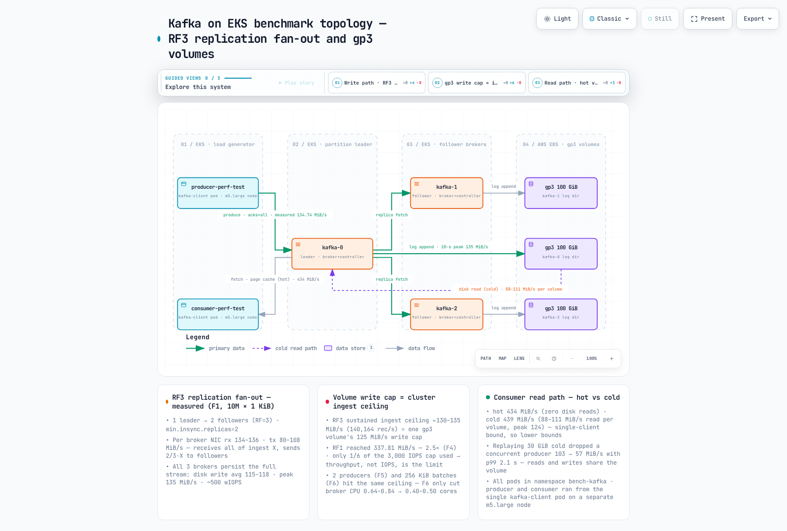

# Part 9: Kafka on EKS Measured Benchmark — RF3 Replication vs the gp3 Throughput Ceiling

> **Supported Versions**: Apache Kafka 4.3.1 (KRaft), Kubernetes 1.36 (Amazon EKS)
> **Last Updated**: September 2, 2026

Most Kafka sizing advice is written for brokers with local NVMe. On EKS the common shape is different: a StatefulSet of brokers, each with **one EBS gp3 volume at its default 125 MiB/s**, and `replication.factor=3` so that every byte a producer sends is written three times. This document deploys exactly that — 3 KRaft brokers on m5.xlarge nodes with default gp3 100 GiB volumes — and measures where the ingest ceiling actually sits, what `acks` costs, what compression and batching buy, and what a lagging consumer does to producers. Every number is from `kafka-producer-perf-test` / `kafka-consumer-perf-test` output, an in-pod broker sampler, or CloudWatch, and the manifests and commands to reproduce them are below.



[🔍 View interactive diagram](https://www.atomai.click/kubernetes-docs/archmaps/en-data-on-eks-kafka-09-kafka-benchmark-0.html)

## TL;DR — measured results

| Measurement | Result | Test |
|---|---|---|
| RF3 sustained ingest ceiling (acks=all, 10 M records ≈ 9.5 GiB per copy) | **134.74 MiB/s** (140,164 rec/s) — each broker's disk wrote 115.2–117.5 MiB/s average, 135 MiB/s peak ≈ the gp3 cap | F1 |
| RF1 on the same cluster (acks=1, 10 M records) | **337.81 MiB/s = 2.5× RF3** (337.81 / 134.74 = 2.51) | F4 |
| A second producer at RF3 | 129.82 MiB/s combined — no gain; avg latency 444 → ~890 ms | F5 |
| acks=all vs acks=1 at a comfortable 20k rec/s | p50 **3 ms for both**; p99 **126 ms vs 17 ms** (7.4×) | B1 / B2 |
| 4× larger batches (256 KiB, linger 10 ms) | 148.38 MiB/s (within page-cache noise of F1) but broker CPU **0.64–0.84 → 0.40–0.50 cores** | F6 |
| lz4 compression (RF3, acks=all, padded synthetic JSON) | 264.70 MiB/s uncompressed-equivalent, p99 24 ms (vs 425 ms uncompressed); 9.0× smaller on disk — **ratio inflated by the 63.2% padding** | C-lz4 |
| Replaying 30 GiB from offset 0 while producing | Producer 103.36 → **57.37 MiB/s**, p99 **2,147 ms**; cold fetches shared each broker's single volume with log appends (write 39.4–47.2 + read 28.6–37.7 MiB/s per broker) | E4 vs E0 |
| Single consumer, hot vs cold | 434.11 MiB/s hot / 438.6 MiB/s cold — **client-bound lower bound** (one m5.large) | E1 / E3 |

## Test environment

| Item | Value |
|---|---|
| Cluster | Amazon EKS, Kubernetes 1.36, ap-northeast-2 (Seoul), Karpenter-managed nodes |
| Brokers | 3 × `apache/kafka:4.3.1` (kafka_2.13-4.3.1.jar, OpenJDK 21.0.11), **KRaft combined mode** (each pod is broker + controller), StatefulSet, no operator |
| Broker nodes | 3 × **m5.xlarge** on-demand (4 vCPU, 16 GiB), all in ap-northeast-2b, one broker per node (`podAntiAffinity`), fresh nodes from the Karpenter `system` NodePool |
| Broker pod resources | requests 3 vCPU / 10 Gi, limits 4 vCPU / 12 Gi; `KAFKA_HEAP_OPTS=-Xms4G -Xmx4G` (≈ 8 GiB of the 12 GiB limit left for page cache) |
| Broker storage | one **gp3 100 GiB** PVC per broker (EBS CSI, StorageClass `gp3`), default gp3 performance **3,000 IOPS / 125 MiB/s** (independent of size) |
| Broker config | `num.partitions=6`, `default.replication.factor=3`, `min.insync.replicas=2`, `log.segment.bytes=1 GiB`, `num.network.threads=4`, `num.io.threads=8`, `num.replica.fetchers=2`, `log.retention.hours=2` |
| Kernel | Amazon Linux 2023, 6.18.41-94.142.amzn2023.x86_64; `vm.dirty_ratio=20`, `vm.dirty_background_ratio=10`, `vm.dirty_expire_centisecs=3000` |
| m5.xlarge EC2 limits | network baseline 1.25 Gbps (burst 10 Gbps); EBS baseline 1,150 Mbps = 143.75 MB/s (≈ 137 MiB/s), 6,000 IOPS — so the per-node EBS limit sits just above the single volume's 125 MiB/s cap |
| Load generator | one pod `kafka-client` (same image) on an **m5.large** node (2 vCPU, 8 GiB) in the same AZ, cgroup **1.9 CPU limit**, `KAFKA_HEAP_OPTS=-Xms2G -Xmx2G`; m5.large network baseline 0.75 Gbps (burst 10 Gbps) |
| Tools | `kafka-producer-perf-test.sh`, `kafka-consumer-perf-test.sh` shipped in apache/kafka 4.3.1 |
| Network path | pod-to-pod inside one AZ, PLAINTEXT (no TLS, no SASL) |
| Topics | fresh topic per test, 6 partitions; RF3 / `min.insync.replicas=2` unless noted (RF1 tests: RF1 / min.isr=1); `retention.bytes=-1` |
| Producer defaults | `linger.ms=5`, `batch.size=65536`, `buffer.memory=67108864` (64 MiB), `compression.type=none` unless noted |
| Hourly cost | 3 × m5.xlarge on-demand at $0.236/h + 3 × gp3 100 GiB at $0.0912/GB-month (Seoul region, Pricing API, 2026-09) |

The run took place on 2026-09-02, 02:07–02:36 UTC. One operational note: `kafka-1` restarted once at 02:05:22Z (exit 1, 3 s after its first start — a KRaft startup race), two minutes **before** the first test at 02:07:25Z. There were no restarts during any test.

### Deployment manifest

Identical to the manifest used in the run except for one disclosed change: the load-generator pod was pinned with `nodeName` to an existing m5.large system node during the run — a `nodeSelector` is shown here instead so the manifest is portable. Every field that changes behaviour is kept.

```yaml
apiVersion: v1
kind: Namespace
metadata:
  name: bench-kafka
---
apiVersion: v1
kind: Service
metadata:
  name: kafka-hs
  namespace: bench-kafka
spec:
  clusterIP: None
  selector:
    app: kafka
  ports:
    - name: broker
      port: 9092
    - name: controller
      port: 9093
---
# 3-broker KRaft cluster (combined broker+controller), official apache/kafka image, no operator.
# One broker per m5.xlarge, one gp3 100 GiB volume per broker so every broker has its own
# 3,000 IOPS / 125 MiB/s budget.
apiVersion: apps/v1
kind: StatefulSet
metadata:
  name: kafka
  namespace: bench-kafka
spec:
  serviceName: kafka-hs
  replicas: 3
  podManagementPolicy: Parallel
  selector:
    matchLabels:
      app: kafka
  template:
    metadata:
      labels:
        app: kafka
      annotations:
        karpenter.sh/do-not-disrupt: "true"
    spec:
      terminationGracePeriodSeconds: 60
      nodeSelector:
        node.kubernetes.io/instance-type: m5.xlarge
        karpenter.sh/capacity-type: on-demand
      affinity:
        podAntiAffinity:
          requiredDuringSchedulingIgnoredDuringExecution:
            - labelSelector:
                matchLabels:
                  app: kafka
              topologyKey: kubernetes.io/hostname
      securityContext:
        fsGroup: 1000
      containers:
        - name: kafka
          image: apache/kafka:4.3.1
          command:
            - /bin/bash
            - -c
            - |
              set -e
              ORD=${HOSTNAME##*-}
              export KAFKA_NODE_ID=$ORD
              export KAFKA_ADVERTISED_LISTENERS="PLAINTEXT://${HOSTNAME}.kafka-hs.bench-kafka.svc.cluster.local:9092"
              exec /etc/kafka/docker/run
          env:
            - name: CLUSTER_ID
              value: "UdHYY7YQRrunSRromZFozw"
            - name: KAFKA_PROCESS_ROLES
              value: "broker,controller"
            - name: KAFKA_CONTROLLER_QUORUM_VOTERS
              value: "0@kafka-0.kafka-hs.bench-kafka.svc.cluster.local:9093,1@kafka-1.kafka-hs.bench-kafka.svc.cluster.local:9093,2@kafka-2.kafka-hs.bench-kafka.svc.cluster.local:9093"
            - name: KAFKA_LISTENERS
              value: "PLAINTEXT://0.0.0.0:9092,CONTROLLER://0.0.0.0:9093"
            - name: KAFKA_LISTENER_SECURITY_PROTOCOL_MAP
              value: "PLAINTEXT:PLAINTEXT,CONTROLLER:PLAINTEXT"
            - name: KAFKA_INTER_BROKER_LISTENER_NAME
              value: "PLAINTEXT"
            - name: KAFKA_CONTROLLER_LISTENER_NAMES
              value: "CONTROLLER"
            - name: KAFKA_LOG_DIRS
              value: "/var/lib/kafka/data/kafka"
            - name: KAFKA_NUM_PARTITIONS
              value: "6"
            - name: KAFKA_DEFAULT_REPLICATION_FACTOR
              value: "3"
            - name: KAFKA_OFFSETS_TOPIC_REPLICATION_FACTOR
              value: "3"
            - name: KAFKA_TRANSACTION_STATE_LOG_REPLICATION_FACTOR
              value: "3"
            - name: KAFKA_TRANSACTION_STATE_LOG_MIN_ISR
              value: "2"
            - name: KAFKA_MIN_INSYNC_REPLICAS
              value: "2"
            - name: KAFKA_LOG_RETENTION_HOURS
              value: "2"
            - name: KAFKA_LOG_SEGMENT_BYTES
              value: "1073741824"
            - name: KAFKA_NUM_NETWORK_THREADS
              value: "4"
            - name: KAFKA_NUM_IO_THREADS
              value: "8"
            - name: KAFKA_NUM_REPLICA_FETCHERS
              value: "2"
            - name: KAFKA_HEAP_OPTS
              value: "-Xms4G -Xmx4G"
          ports:
            - containerPort: 9092
            - containerPort: 9093
          resources:
            requests:
              cpu: "3"
              memory: 10Gi
            limits:
              cpu: "4"
              memory: 12Gi
          volumeMounts:
            - name: data
              mountPath: /var/lib/kafka/data
  volumeClaimTemplates:
    - metadata:
        name: data
      spec:
        accessModes: ["ReadWriteOnce"]
        storageClassName: gp3
        resources:
          requests:
            storage: 100Gi
---
# Load generator (kafka-producer-perf-test / kafka-consumer-perf-test) on a separate node.
apiVersion: v1
kind: Pod
metadata:
  name: kafka-client
  namespace: bench-kafka
  labels:
    app: kafka-client
spec:
  restartPolicy: Never
  nodeSelector:
    node.kubernetes.io/instance-type: m5.large   # the run used nodeName to pin an existing m5.large
  containers:
    - name: client
      image: apache/kafka:4.3.1
      command: ["sleep", "infinity"]
      env:
        - name: KAFKA_HEAP_OPTS
          value: "-Xms2G -Xmx2G"
      resources:
        requests:
          cpu: "500m"
          memory: 2500Mi
        limits:
          cpu: "1900m"
          memory: 4Gi
```

> In production you would run this through [Strimzi](./02-strimzi-operator.md) rather than a bare StatefulSet. The bare StatefulSet keeps the measurement target simple: what you see is Kafka 4.3.1 plus EBS, nothing else.

## The test payload — and a disclosure about padding

Two producer modes were used, and the distinction matters for reading every table below:

- **`--record-size 1024` (random mode, phases A/B/D/E).** `kafka-producer-perf-test` fills every byte of every record with a fresh random A–Z character per send. That per-record loop pins the single producer thread: on this 1.9-CPU client it capped at **≈105–113 MiB/s regardless of `acks` or RF**. These runs are valid for *latency shape* and *relative* comparisons, not for the cluster ceiling.
- **`--payload-file payload-1k.txt` (phases C and F).** The tool picks a pre-read line per send, and the same client pushed **238–338 MiB/s**. The file has **20,000 distinct synthetic JSON log lines, average 1,008 bytes** (fields: `ts`, `level`, `namespace`, `pod`, `trace_id`, `http{method,path,status,duration_ms,bytes}`, `user_id`, `region`, `msg`, `pad`).

**Disclosure:** each payload line is ≈ 362 B of JSON plus a `"pad":"xxxx…"` field of ≈ 636 `x` characters — **63.2% of every record is trivially compressible filler** added to reach ~1 KiB. This does not affect the uncompressed throughput or latency results (bytes are bytes to the broker; with `compression.type=none` each record occupied 1,018 B on disk, ≈ 10 B of record overhead), but it **inflates every compression ratio** in Measurement 4. Whole-corpus zlib level 6 compresses the file 18.5× with the pad and 7.8× without; per 64-record batch, 16.2× vs 6.5×. Treat the ratios as an upper bound; the codec ordering and CPU trade-off are the transferable result.

Units: the tool prints "MB/sec", but in the 4.3.1 source `MB/sec = 1000.0 * windowBytes / elapsed / (1024*1024)` — **it is MiB/s**, and this page writes it that way. Latency is `send()` to ack callback, so it includes time queued in the producer buffer; percentiles are `sorted[(int)(p * size)]`.

## Measurement 1 — RF3 vs RF1: the sustained ingest ceiling

Phase F, payload-file mode, `compression.type=none`, single producer unless noted. F1/F4 = 10,000,000 records (≈ 9.5 GiB per copy on disk); F2/F3/F6 = 6,000,000 (≈ 5.7 GiB); F5 = 2 producers × 5,000,000.

| Test | acks | RF | producers | records | rec/s | MiB/s | avg ms | p50 | p95 | p99 | p99.9 | max |
|---|---|---|---|---|---|---|---|---|---|---|---|---|
| F1 | all | 3 | 1 | 10 M | 140,164 | **134.74** | 443.89 | 321 | 1,276 | 2,689 | 4,026 | 4,038 |
| F2 | 1 | 3 | 1 | 6 M | 248,221 | 238.62 | 222.66 | 230 | 321 | 398 | 426 | 650 |
| F3 | 0 | 3 | 1 | 6 M | 241,138 | 231.81 | 235.02 | 191 | 333 | 1,977 | 4,327 | 4,340 |
| F4 | 1 | 1 | 1 | 10 M | 351,407 | **337.81** | 159.51 | 138 | 290 | 358 | 515 | 642 |
| F5 | all | 3 | 2 | 2 × 5 M | 67,694 + 67,360 = 135,054 | 65.07 + 64.75 = **129.82** | 893.88 / 889.22 | 639 / 630 | 2,536 / 2,493 | 3,270 / 3,301 | 4,284 / 4,228 | 4,662 / 4,660 |
| F6 | all | 3 | 1 | 6 M | 154,349 | 148.38 | 395.82 | 238 | 1,142 | 2,094 | 2,594 | 2,621 |

**So what:** with a 64 MiB producer buffer, an average latency of 160–890 ms means the producer is blocked on `buffer.memory` — in every phase-F test **the brokers, not the client, are the bottleneck**. The RF3 ceiling for this 3-broker cluster is **≈ 130–135 MiB/s**; RF1 on the same brokers reached **337.81 MiB/s, 2.5× more** (337.81 / 134.74 = 2.51) — a lower bound set by the single client, not a disk-bound steady state (see Caveats).

### What the brokers were doing (in-pod sampler, 10 s samples)

Per broker: `/sys/block/nvme1n1/stat` (sectors × 512), cgroup `cpu.stat`, `eth0` counters. Window averages include ramp-up and the post-test drain, so they understate steady state; the best single 10-s sample ("peak10s") is closest to steady state. The sampler slept 10 s between rounds, but the three `kubectl exec` calls add ≈ 2 s, so consecutive samples are ≈ 12 s apart; "10-s" below refers to the configured interval.

| Window | write MiB/s avg (peak10s) | wIOPS | read MiB/s (rIOPS) | broker CPU cores | NIC tx / rx MiB/s |
|---|---|---|---|---|---|
| F1 RF3 acks=all 10 M (75 s) | 115.2–117.5 (134.9–135.1) | 495–505 | 0 | 0.64–0.84 | 80.2–108.1 / 134.2–135.8 |
| F2 RF3 acks=1 6 M (28 s) | 92.8–100.4 (124.1–127.6) | 397–427 | 0 | 0.53–0.62 | 64.4–80.4 / 123.7–125.0 |
| F3 RF3 acks=0 6 M (28 s) | 97.2–120.5 (123.5–124.1) | 414–514 | 0 | 0.80–0.81 | 87.3–94.4 / 163.5–170.6 |
| F4 RF1 acks=1 10 M (32 s) | 72.5–80.4 (117.6–129.1) | 312–346 | 0 | 0.30–0.31 | 0.3 / 119.9–125.4 |
| F5 2 producers RF3 acks=all (81 s) | 99.9–102.2 (134.8–135.5) | 431–439 | 0 | 0.59–0.81 | 66.5–89.7 / 113.8–115.6 |
| F6 RF3 acks=all batch 256 KiB (43 s) | 102.3–107.7 (134.8–135.4) | 426–445 | 0 | **0.40–0.50** | 68.7–110.4 / 124.2–124.5 |
| E2 fill 30 GiB, random mode (262 s) | 110.0–111.5 (134.5–135.0) | 468–473 | 0 | 0.72–0.80 | 74.9–77.5 / 114.3 |

**So what:** in every sustained RF3 acks=all window (F1, F5, F6, E2) the best 10-s write sample on each broker's volume lands at **134.5–135.5 MiB/s** in the sysfs samples and at 116.8–121.0 MiB/s in CloudWatch's 60-s sums (E2 steady minutes, below). E2's fine-grained view of kafka-0 showed a steady 10-s write rate of 123–124 MiB/s at ≈ 520 wIOPS and 0.75–0.98 cores of CPU — **the volume is at, and in short samples slightly above, its nominal 125 MiB/s gp3 cap**. The 125 MiB/s volume limit and this instance's ≈ 137 MiB/s EBS baseline are too close for the run to separate them; the shorter acks=1/0 runs F2/F3 peaked at 123.5–127.6. Write IOPS were only ≈ 400–520 at ≈ 240 KiB per write, far below the 3,000 IOPS cap: **throughput, not IOPS, is the limiter**. Broker CPU stayed between 0.30 and 0.84 of 4 cores in every phase-F window.

### The RF3 fan-out arithmetic

With RF3, a cluster ingest of X means every broker writes ≈ X to its own disk (leader for 1/3 of the partitions + follower for 2/3), receives ≈ X on its NIC (1/3 from producers + 2/3 from leaders), and transmits ≈ 2/3 · X (its leader partitions to two followers). F1 matches: at 134.74 MiB/s ingest, each broker received 134.2–135.8 MiB/s, transmitted 80.2–108.1 MiB/s (2/3 × 134.74 ≈ 90 MiB/s expected), and wrote 115.2–117.5 MiB/s average / 135 peak. With RF1 (F4) the tx counter reads 0.3 MiB/s — no replication — and each broker receives only its third of the stream, so three volumes work in parallel: 3 × 125 = 375 MiB/s theoretical, 337.81 measured over 10 M records.

**The replication tax is exactly the volume-throughput fan-out.** RF3 does not make Kafka slower; it makes three 125 MiB/s volumes behave like one.

### CloudWatch confirmation (AWS/EBS, 60-s sums per volume)

- Phase A+B (02:07–02:12): kafka-0's volume wrote 12,279 MiB total (≈ 12.0 GiB) — within a few percent of the ≈ 11.8 GiB expected from three RF3 tests of 3,000,000 × 1,024 B (3 × 2.86 GiB) + a one-third RF1 share (0.95 GiB) + two latency tests of 1,200,000 × 1,024 B (2 × 1.14 GiB) — every broker persisted the full RF3 stream. `VolumeReadBytes` = 0 for all three volumes 02:06–02:20.
- E2 steady minutes (02:22–02:24): 7,008–7,257 MiB/min per volume = **116.8–121.0 MiB/s**, 29,637–30,730 write ops/min (494–512 IOPS).
- E3/E4 (02:25–02:28): 3,228–6,189 MiB/min read per volume (up to 103 MiB/s), 38,127–73,202 read ops/min (635–1,220 IOPS); e.g. kafka-1 in minute 02:26 read 6,188.6 MiB and wrote 3.7 MiB — the cold replay as EBS saw it (Measurement 6).
- Phase F (02:30–02:36): 4,367–7,512 MiB/min written per volume; in F1's minute 02:31, kafka-0/1/2 wrote 6,827 / 5,064 / 7,512 MiB.

Two independent counters (in-pod sysfs and CloudWatch) agree that during sustained RF3 ingest each volume writes at or near its 125 MiB/s cap.

## Measurement 2 — acks=0 / 1 / all: durability vs latency


[🔍 View interactive diagram](https://www.atomai.click/kubernetes-docs/archmaps/en-data-on-eks-kafka-09-kafka-benchmark-1.html)

**At full rate (payload-file, RF3, F1/F2/F3 above):** acks=1 and acks=0 report 231.81–238.62 MiB/s against acks=all's 134.74. Do not read that gap as the throughput cost of acks=all. F2/F3 are 25–28 s runs of ≈ 5.7 GiB per copy; the sampler shows the disks wrote only 92.8–120.5 MiB/s during those windows and kept draining afterwards — the excess sat in page cache. What F2/F3 measure is the page cache, not a higher ceiling. acks=0's 4,327 ms p99.9 / 4,340 ms max shows the flip side: nothing back-pressures the producer until `buffer.memory` fills.

**At a comfortable rate (`--throughput 20000`, 20k rec/s ≈ 19.5 MiB/s, 1,200,000 records, RF3, random mode):**

| Test | acks | linger.ms | avg ms | p50 | p95 | p99 | p99.9 | max |
|---|---|---|---|---|---|---|---|---|
| B1 | all | 5 | 5.27 | 3 | 6 | **126** | 173 | 771 |
| B2 | 1 | 5 | 2.58 | 3 | 5 | **17** | 40 | 642 |
| B3 | all | 0 | 3.23 | 3 | 5 | 25 | 59 | 752 |

For reference, the client-bound full-rate random-mode runs (3,000,000 × 1,024 B, RF3 unless noted; all ≈ the same throughput because the client is the limit — **use for latency shape only**):

| Test | acks | RF | rec/s | MiB/s | avg ms | p50 | p95 | p99 | p99.9 | max |
|---|---|---|---|---|---|---|---|---|---|---|
| A1 | all | 3 | 107,150 | 104.64 | 11.38 | 3 | 50 | 164 | 263 | 871 |
| A2 | 1 | 3 | 105,955 | 103.47 | 3.00 | 1 | 11 | 38 | 79 | 812 |
| A3 | 0 | 3 | 112,461 | 109.82 | 1.48 | 0 | 6 | 26 | 52 | 636 |
| A4 | 1 | 1 | 109,926 | 107.35 | 1.57 | 1 | 6 | 11 | 36 | 662 |

**So what — acks=all costs tail latency, not p50**: at 20k rec/s (B1/B2) p50 = 3 ms for both settings while p99 is 126 ms (acks=all) vs 17 ms (acks=1); in the full-rate client-bound runs (A1/A2/A3) p99 = 164 / 38 / 26 ms for acks=all / 1 / 0. (No acks=0 run exists at 20k rec/s, so no such figure is quoted.) B3 — `linger.ms=0` with acks=all — had a *lower* p99 (25 ms) than B1 (126 ms) at this low rate because smaller batches mean less to replicate per request; it is **not** a general recommendation — Measurement 3 shows what small batches cost the brokers at high rate.

## Measurement 3 — Batching and producer count

| Test | Change vs F1 | MiB/s | avg ms | p99 ms | broker CPU cores |
|---|---|---|---|---|---|
| F1 | baseline: 1 producer, `batch.size=65536`, `linger.ms=5`, 10 M records | 134.74 | 443.89 | 2,689 | 0.64–0.84 |
| F5 | 2 producers (5 M records each), same props | 65.07 + 64.75 = 129.82 | 893.88 / 889.22 | 3,270 / 3,301 | 0.59–0.81 |
| F6 | `batch.size=262144`, `linger.ms=10`, 6 M records | 148.38 | 395.82 | 2,094 | **0.40–0.50** |

**So what:**

- **More producers did not add throughput** — F5's two producers summed to 129.82 MiB/s against F1's 134.74, and the only thing that changed was queueing: average latency 444 → ~890 ms, p99 2.7 → 3.3 s. When the disks are the limit, adding clients only lengthens the queue.
- **Bigger batches did not raise the disk-bound ceiling** (148.38 vs 134.74 MiB/s is within the page-cache noise between a 6 M and a 10 M record run), **but broker CPU fell from 0.64–0.84 to 0.40–0.50 cores** — roughly 40% less CPU for the same bytes, presumably because fewer, larger produce and replica-fetch requests mean less per-request work (request counts were not sampled, so this is the plausible explanation, not a measured one). On a disk-bound cluster that CPU is what you keep in reserve for consumers, rebalances, and compaction.

## Measurement 4 — Compression: a client-CPU trade that moves the bottleneck

Phase C: payload-file JSON ≈ 1,008 B, RF3, acks=all, 3,000,000 records, single producer. The tool's MiB/s counts **uncompressed** payload bytes.

| codec | rec/s | MiB/s (uncompressed, as reported) | avg ms | p50 | p95 | p99 | p99.9 | on-disk B/record (per replica) | ratio vs none |
|---|---|---|---|---|---|---|---|---|---|
| none | 203,887 | 196.00 | 259.59 | 266 | 370 | 425 | 458 | 1,018 | 1.00× |
| lz4 | 275,356 | 264.70 | 4.38 | 3 | 11 | 24 | 60 | 113.1 | **9.0×** smaller |
| snappy | 198,557 | 190.87 | 5.07 | 3 | 10 | 35 | 205 | 141.7 | 7.2× |
| zstd | 160,274 | 154.07 | 5.39 | 5 | 10 | 18 | 47 | 61.3 | **16.6×** |
| gzip | 53,418 | 51.35 | 6.01 | 6 | 10 | 17 | 45 | 60.7 | 16.8× |

On-disk sizes from `kafka-log-dirs.sh --describe` after each run (sum of the `t-comp` partition sizes on one broker; all three brokers identical, each holding one full copy of 3,000,000 records): none 2,912.4 MiB; lz4 323.5 MiB; snappy 405.3 MiB; zstd 175.3 MiB; gzip 173.8 MiB. B/record = MiB × 1,048,576 / 3,000,000.

**So what:**

- **`none` is broker-bound, every codec is client-bound.** Uncompressed, average latency was 260 ms (buffer full → broker-bound; the disk-only sampler shows each broker's volume nearly idle (0.1–11.9 MiB/s) for the first ~8 s while page cache absorbed the writes, then writing 122–136 MiB/s — the gp3 cap — for the rest of the 18 s run and draining at 64–72 MiB/s for ~12 s after it ended). With any codec average latency dropped to ≤ 6 ms — the brokers now had headroom, and the single producer thread's CPU became the limit (gzip: 51.35 MiB/s on one thread). lz4's 264.70 MiB/s uncompressed-equivalent moved only ≈ 29 MiB/s of compressed bytes per replica over the wire and onto disk (264.70 / 9.0 ≈ 29.4), leaving the gp3 volumes mostly idle. Brokers store what the producer sent — with the default `compression.type=producer` there is no re-compression on the broker.
- **The ratios are an upper bound, not a forecast.** 63.2% of every test record is `x` padding (see the payload section). Without it, the same corpus compresses 7.8× rather than 18.5× with zlib-6. Real JSON logs typically compress a few × with lz4 and more with zstd — measure your own payload before sizing volumes.
- **What is valid from this table:** the codec ordering on ratio (zstd ≈ gzip ≫ lz4 > snappy), the ordering on client throughput (lz4 > snappy ≈ none > zstd ≫ gzip), the latency behaviour, and the headline effect: **a compressing producer takes the gp3 volume out of the critical path.**

## Measurement 5 — Record size

Random mode, RF3, acks=all — client-bound, so read the ratios, not the absolutes.

| Test | record size | records | rec/s | MiB/s | avg ms | p50 | p95 | p99 | p99.9 |
|---|---|---|---|---|---|---|---|---|---|
| D1 | 100 B | 10,000,000 | 506,380 | 48.29 | 3.18 | 2 | 9 | 15 | 33 |
| A1 | 1,024 B | 3,000,000 | 107,150 | 104.64 | 11.38 | 3 | 50 | 164 | 263 |
| D2 | 10,240 B | 300,000 | 12,326 | 120.37 | 17.40 | 5 | 84 | 157 | 223 |

**So what:** 100 B records reached 4.7× the records/s of 1 KiB records (506,380 vs 107,150) but only 46% of the bytes/s (48.29 vs 104.64) — per-record overhead (headers, batching, ack bookkeeping, and in this random-mode test the client's own per-record send-path cost) dominates. 10 KiB records gave 15% more bytes/s than 1 KiB (120.37 vs 104.64) at 8.7× fewer records/s. If your records are tiny, batch or aggregate upstream before they reach the producer.

## Measurement 6 — Consumers: hot vs cold, and what a cold replay does to producers

### Hot consume (E0 → E1)

- **E0** filled `t-cons` with 3,000,000 × 1,024 B (RF3, acks=all, random mode): 105,843 rec/s, 103.36 MiB/s, p99 82 ms.
- **E1** consumed all 3,000,000 messages immediately afterwards: first 5-s interval 36.3 MiB/s (it includes a 3,946 ms group join), then a steady **434.11 MiB/s = 444,532 msg/s**. Broker disk reads were **0** — in-pod rIOPS 0, CloudWatch `VolumeReadBytes` 0 on all three volumes 02:06–02:20. The whole test including JVM start was ≈ 15 s of wall time.

### Fill 30 GiB (E2) — the sustained producer view

30,000,000 × 1,024 B, RF3, acks=all, random mode (client-bound ceiling, but sustained for 4 min 22 s): 115,550 rec/s, **112.84 MiB/s**, avg 60.17 ms, p50 2 / p95 125 / **p99 1,531 / p99.9 5,034 / max 5,258 ms**. Across 51 five-second intervals the mean was 112.8 MiB/s (min 36.3, max 138.0), with **5 intervals under 60 MiB/s — 56.8, 36.3, 45.3, 40.8, 45.8 — at intervals 1, 12–13, 24 and 34**. The first (56.8 MiB/s at 5.5 ms average latency) is the start-up ramp also seen in A1's first interval (59.24 MiB/s); the other four (average interval latency 936–1,642 ms) are genuine stalls: roughly once a minute (≈ 60 s, 120 s, 170 s) the producer stalled for 5–10 s while the sampler shows the disks still writing at their cap (110.0–111.5 MiB/s average, 134.5–135.0 peak per broker). The pattern is *consistent with* periodic dirty-page write-back competing with log appends; **the mechanism was not root-caused** in this run.

### Cold consume (E3)

30,000,000 messages ≈ 29.3 GiB, of which only the last few GiB were still in page cache. 13 full 5-s intervals: 337.6, 431.3, 414.2, 495.7, 454.9, 452.1, 387.9, 458.7, 439.9, 452.4, 447.7, 491.0, 438.6 MiB/s → **mean 438.6 MiB/s (min 337.6, max 495.7)**; rebalance 3,669 ms; ≈ 75 s wall. Broker side: disks read **88.0–111.5 MiB/s window-average per volume** (10-s peaks ≈ 124 = the gp3 cap) at 1,315–1,545 read IOPS, while each broker transmitted 136.6–141.5 MiB/s at only 0.11–0.12 cores of CPU — so ≈ 30 MiB/s on kafka-1/kafka-2 (≈ 49 MiB/s on kafka-0) still came from page cache, and serving a cold consumer cost the brokers almost no CPU.

**So what:** hot ≈ cold ≈ 435–440 MiB/s for a single consumer here **because the consumer side (one m5.large client) tops out first** — these are lower bounds for the brokers. The important measurement is on the broker side: the cold read pinned every EBS volume at its 125 MiB/s read cap, leaving nothing for producers.

### Mixed workload (E4) — produce 3 GiB while a consumer replays the 30 GiB topic from offset 0

| | Alone | During the cold replay | Test |
|---|---|---|---|
| Producer throughput | 103.36 MiB/s (105,843 rec/s) | **57.37 MiB/s** (58,746 rec/s) | E0 → E4 |
| Producer avg / p50 | — / — | 294.06 ms / 18 ms | E4 |
| Producer p95 / p99 / p99.9 / max | p99 82 ms | **1,587 / 2,147 / 2,425 / 2,569 ms** | E0 → E4 |
| Consumer throughput (mean of full 5-s intervals vs fetch-time rate) | 438.6 MiB/s | **299.62 MiB/s** of fetch time, 295,726 msg/s (288.79 MiB/s overall incl. the 3,666 ms rebalance; 29,297.33 MiB / 30,000,466 msgs in 101.4 s wall) | E3 → E4 |
| Per broker (produce window) | write 60.4–67.4 MiB/s (page cache absorbing the rest), read 0 | write 39.4–47.2 + read 28.6–37.7 MiB/s, tx 92.6–106.0 MiB/s, CPU 0.36–0.42 cores | E0 → E4 |

**So what:** the single gp3 volume per broker is shared by log appends and cold fetches, and **both slowed sharply** — the producer dropped to 57.37 MiB/s (57.37 / 103.36 ≈ 55.5% of its solo rate) with a p99 of 2.1 s, and the consumer's fetch rate fell from 438.6 to 299.6 MiB/s (about a third), while broker CPU sat at 0.36–0.42 cores. The window averages above (≈ 68–85 MiB/s combined read+write) hide it because the first ~20 s were absorbed by page cache, but in every ~12-s sample from 02:26:47 to the end of the produce window the kafka-1 and kafka-2 volumes ran at a combined 124–129 MiB/s — the gp3 cap — so the contention was on the volume, not the CPU (kafka-0 stayed at 68–108 MiB/s combined). A consumer that falls out of the page cache is not a consumer problem; it is a producer-latency incident. Keep consumers within the page cache (right-size RAM, alert on lag) or isolate replay traffic — separate volumes, separate brokers, or a throughput quota on the replaying client.

## Measurement 7 — The page-cache lesson: why short tests over-report

Kafka does not `fsync` per message (`log.flush.interval.messages` defaults to `Long.MAX`); durability comes from replication (`acks=all`, `min.insync.replicas=2`) and the OS flushes dirty pages in the background. With 16 GiB nodes and `vm.dirty_ratio=20`, several GiB of writes can sit in RAM. The evidence in this run:

- **E0**: while the producer reported 103.36 MiB/s for 31 s, the three brokers' disks wrote only 60.4 / 63.3 / 67.4 MiB/s average — and during the following E1 window (hot consume, rx ≈ 0) they were still draining at 51–71 MiB/s.
- **F4**: one 5-s interval reported **481.53 MiB/s** from the producer (intervals: 134.41, 267.75, 325.56, 481.53, 420.25), yet three gp3 volumes can absorb at most 3 × 125 = 375 MiB/s. The excess was page cache.
- **F1**'s intervals swing from 47.27 to 213.51 MiB/s around a 134.74 mean (120.23, 209.57, 145.62, 149.47, 91.12, 149.80, 135.06, 123.71, 142.32, 93.54, 47.27, 154.05, 213.51) — a pattern *consistent with* the producer running ahead of the disks and being held back once dirty pages reach their limit; like the E2 stalls, the mechanism was not root-caused.

**So what:** only tests of roughly **≥ 10 GiB per broker** (E2 at 30 GiB, F1 at ≈ 9.5 GiB × RF3) reach the disk-bound steady state. A 3,000,000-record test (3,000,000 × 1,024 B ≈ 2.86 GiB per copy) measures "page cache + network", not EBS. If a benchmark finishes in under a minute, it has not seen the disk.

## In cost terms

Prices (Seoul, Pricing API 2026-09): m5.xlarge on-demand $0.236/h, gp3 $0.0912/GB-month.

- **This run:** the three m5.xlarge nodes were created 02:01:32–02:01:34Z; after the namespace delete at 02:39:47Z Karpenter removed two of them by ≈ 02:46Z and kept the third for other system-pool workloads, so ≈ 45–50 min per node is attributed to the benchmark → 3 × $0.236 × 50/60 h = **$0.59** compute; the three gp3 100 GiB volumes existed 02:02–02:41Z → 3 × 100 GiB × $0.0912 / 730 h × 0.65 h ≈ **$0.02** storage → **≈ $0.6 in total** (excluding the pre-existing m5.large client node, which belongs to the cluster's system pool).
- **If left running:** 3 × $0.236 × 730 h = **$516.8/month** compute + 3 × $9.12 = **$27.36/month** storage (516.84 + 27.36 = $544.20).

**Design takeaway.** In this cluster the brokers used only 0.40–0.84 of their 4 cores during the RF3 acks=all runs while the volumes were at their cap — most of the $516.8/month of compute is headroom, and the $27.36/month of storage is the bottleneck. Two kinds of lever raise the RF3 ceiling. On the volume side: provision gp3 throughput above the 125 MiB/s baseline (up to 1,000 MiB/s per volume, for an extra fee — volume *size* alone changes nothing on gp3, and the instance's EBS baseline, 143.75 MB/s ≈ 137 MiB/s on m5.xlarge, becomes the next wall), spread each broker's log over more volumes (`log.dirs`), or move to `io2`. On the cluster side: add brokers — each new broker brings its own 125 MiB/s volume and lowers every broker's share of the RF3 stream, but it also adds compute this workload does not use. Either way, a compressing producer reduces the bytes per replica first (Measurement 4). The one thing that does not help is more producers (F5). Which lever is cheaper depends on the target throughput and retention; this page did not measure a provisioned-throughput, multi-volume or larger-cluster configuration, so it quotes no number or price for them.

## How to reproduce

1. Deploy the namespace, headless Service, StatefulSet and client pod from the manifest above: `kubectl apply -f bench-kafka.yaml`, then wait for `kubectl -n bench-kafka get pods` to show `kafka-0/1/2` and `kafka-client` running.

2. Inside the client pod, generate the payload file (the image has no Python; this is the `awk` that was used — note the `pad` field):

   ```bash
   kubectl -n bench-kafka exec -it kafka-client -- bash
   mkdir -p /tmp/results && cd /tmp/results
   awk 'BEGIN{srand(42); split("payments orders inventory auth search checkout shipping catalog notify gateway",ns," ");
     split("INFO INFO INFO INFO WARN ERROR DEBUG",lv," ");
     for(i=0;i<20000;i++){
       n=ns[int(rand()*10)+1]; l=lv[int(rand()*7)+1]; d=int(rand()*900)+5; u=int(rand()*100000);
       msg=sprintf("{\"ts\":\"2026-09-02T02:%02d:%02d.%03dZ\",\"level\":\"%s\",\"namespace\":\"%s\",\"pod\":\"%s-7d9f8b6c4-%05x\",\"trace_id\":\"%08x%08x%08x%08x\",\"http\":{\"method\":\"POST\",\"path\":\"/api/v1/%s/%d\",\"status\":%d,\"duration_ms\":%d,\"bytes\":%d},\"user_id\":%d,\"region\":\"ap-northeast-2\",\"msg\":\"request completed upstream=%s-svc:8080 retries=%d cache=%s\"",
         int(rand()*60),int(rand()*60),int(rand()*1000),l,n,n,int(rand()*1048576),int(rand()*4294967296),int(rand()*4294967296),int(rand()*4294967296),int(rand()*4294967296),n,u,(l=="ERROR"?500:200),d,int(rand()*20000),u,n,int(rand()*3),(rand()<0.7?"hit":"miss"));
       pad=1000-length(msg)-2; if(pad<0)pad=0; p=""; for(k=0;k<pad;k++)p=p "x";
       printf "%s,\"pad\":\"%s\"}\n", msg, p }}' > payload-1k.txt
   ```

3. Create a fresh topic per test and run the producer test. The common settings for every producer run were `linger.ms=5 batch.size=65536 buffer.memory=67108864`; vary `acks`, `compression.type`, RF/min.isr and record count per test:

   ```bash
   BS=kafka-0.kafka-hs.bench-kafka.svc.cluster.local:9092,kafka-1.kafka-hs.bench-kafka.svc.cluster.local:9092,kafka-2.kafka-hs.bench-kafka.svc.cluster.local:9092
   BIN=/opt/kafka/bin

   # RF3 topic (RF1 tests: --replication-factor 1 --config min.insync.replicas=1)
   $BIN/kafka-topics.sh --bootstrap-server $BS --create --topic t-f --partitions 6 \
     --replication-factor 3 --config min.insync.replicas=2 --config retention.bytes=-1

   # Throughput test (phase F / C): payload-file mode — 10 M records for the disk-bound steady state
   $BIN/kafka-producer-perf-test.sh --topic t-f --num-records 10000000 --throughput -1 \
     --payload-file /tmp/results/payload-1k.txt \
     --producer-props bootstrap.servers=$BS acks=all compression.type=none \
       linger.ms=5 batch.size=65536 buffer.memory=67108864
   # F6 appended:  batch.size=262144 linger.ms=10
   # phase C:      compression.type=lz4|snappy|zstd|gzip, --num-records 3000000

   # Latency test at a fixed rate (phase B): random mode, 20k rec/s
   $BIN/kafka-producer-perf-test.sh --topic t-lat --num-records 1200000 --record-size 1024 --throughput 20000 \
     --producer-props bootstrap.servers=$BS acks=all compression.type=none \
       linger.ms=5 batch.size=65536 buffer.memory=67108864

   # Consumer test (phase E): --show-detailed-stats gives 5-s intervals
   $BIN/kafka-consumer-perf-test.sh --bootstrap-server $BS --topic t-big --messages 30000000 \
     --group cg-E3 --timeout 600000 --show-detailed-stats --reporting-interval 5000

   # On-disk size per replica after a compression run
   $BIN/kafka-log-dirs.sh --bootstrap-server $BS --describe --topic-list t-comp

   # Delete the topic (wait until --list no longer shows it) before the next test
   $BIN/kafka-topics.sh --bootstrap-server $BS --delete --topic t-f
   ```

   For the two-producer test (F5), start two `kafka-producer-perf-test.sh` processes in the background with `--num-records 5000000` each (the run gave each `KAFKA_HEAP_OPTS="-Xms768M -Xmx768M"`) and `wait` for both. For the mixed test (E4), start the consumer on the 30 GiB topic in the background and launch a 3,000,000-record producer 5 s later.

4. Broker-side sampler — from outside the cluster, every 10 s (configured; ≈ 12 s actual, see above) per broker, read the host's block-device counters (visible inside the pod), the pod's cgroup CPU, and its NIC counters, record them with a timestamp, and divide consecutive-sample deltas by the recorded timestamp difference, not by 10:

   ```bash
   # run from outside the cluster (where kubectl is) — the exact sampler used for the measurements
   OUT=broker-samples.log
   while true; do
     ts=$(date -u +%s)
     for b in 0 1 2; do
       st=$(kubectl -n bench-kafka exec kafka-$b -- bash -c 'echo "$(tr -s " " < /sys/block/nvme1n1/stat) | cpu $(grep -E "^(usage_usec|nr_throttled)" /sys/fs/cgroup/cpu.stat | awk "{printf \"%s \", \$2}")| net tx=$(cat /sys/class/net/eth0/statistics/tx_bytes) rx=$(cat /sys/class/net/eth0/statistics/rx_bytes)"' 2>/dev/null)
       echo "$ts kafka-$b $st" >> $OUT
     done
     sleep 10
   done
   ```

   Field 7 of `/sys/block/<dev>/stat` is sectors written (× 512 = bytes); field 3 is sectors read. `<dev>` is the EBS data volume as the node sees it (`nvme1n1` here). Mark each test's start and end with `date -u` so the samples can be cut into per-test windows. Cross-check with CloudWatch `AWS/EBS` `VolumeWriteBytes` / `VolumeReadBytes` / `VolumeWriteOps` (60-s sums) on the three volumes.

5. Delete the namespace when done — `kubectl delete ns bench-kafka`; the StorageClass's `Delete` reclaim policy removes the volumes.

## Caveats

- **The load generator was one m5.large pod with a 1.9-CPU limit.** A dedicated load-generator node (c6i.2xlarge) was planned but could not be created in this environment. The single-consumer figures (≈ 435–440 MiB/s) and the RF1 ceiling (337.81 MiB/s) are bounded by that client and should be read as **lower bounds**. Over the whole session the client cgroup recorded 1,905.5 s of CPU, 286 throttled periods and only 0.42 s of throttled time, so CPU throttling was negligible — the single producer thread, not the cgroup, was the limiter in random mode. Every high-throughput test also exceeded the m5.large's 0.75 Gbps network baseline (≈ 89 MiB/s; F4 at 337.81 MiB/s ≈ 2.83 Gbps ran on burst credits) — no credit-related drop was observed within this 30-minute session, but a longer run could see one. The brokers were in the same position: in F1 each broker's NIC carried rx 134–136 + tx 80–108 MiB/s (≈ 1.8–2.0 Gbps combined), above the m5.xlarge 1.25 Gbps baseline, so the RF3 runs also leaned on burst network capacity; the disk-cap attribution stands (the volumes sat at their gp3 cap), but a sustained multi-hour run on m5.xlarge could hit the network baseline too.
- **`--record-size` measures your client CPU.** Phases A, B, D and E ran in random mode and capped at ≈ 105–113 MiB/s regardless of `acks` or RF; use them for latency shape and relative comparisons only. Phase F (payload-file mode) is the source for throughput ceilings.
- **Short tests are absorbed by the page cache.** Anything under roughly 10 GiB per broker over-reports (Measurement 7). Only F1 (≈ 9.5 GiB × RF3, 75 s), E2 (30 GiB) and the E3 cold read are long enough to show the disk. F4 is not: at RF1 its 10 M records spread ≈ 3.2 GiB per broker (9.5 / 3) over 32 s, its 481.53 MiB/s interval is page cache (Measurement 7), and its disks averaged only 72.5–80.4 MiB/s against 337.81 / 3 ≈ 112.6 MiB/s of ingest per broker — so 337.81 MiB/s is a lower bound set by the client and not a disk-bound steady state.
- **Compression ratios are an upper bound.** 63.2% of every test record is `x` padding; the whole-corpus zlib-6 ratio drops from 18.5× to 7.8× without it. The codec ordering and the CPU trade-off transfer; the ratios do not.
- **E2's periodic stalls were observed, not explained.** Four stalled intervals (plus the start-up ramp) roughly once a minute are *consistent with* dirty-page write-back competing with log appends; the mechanism was not root-caused.
- **Single AZ, PLAINTEXT, no operator.** All three brokers and the client were in ap-northeast-2b with no TLS or SASL, so cross-AZ replication latency and data-transfer cost, TLS CPU, and Strimzi's defaults (rack awareness, per-broker tuning) are all absent from these numbers. A production cluster spread across three AZs will see higher replication latency and inter-AZ transfer charges on the 2/3 · X replication traffic. The brokers also ran KRaft in **combined mode** (controller and broker in one process), so the metadata log and Raft traffic shared each broker's volume and CPU; upstream KRaft guidance recommends isolated controllers for production. The `kafka-1` startup race noted above was not investigated further.
- **Single run.** Each configuration ran once; there are no repeat runs or confidence intervals. The cross-checks are between independent counters (producer report, in-pod sysfs, CloudWatch), not between repetitions.

## Related reading

- [EBS gp2 vs gp3 Measured Benchmark](../../storage/01-ebs-gp2-gp3-benchmark.md) — the 125 MiB/s volume cap that every RF3 broker hit here, measured on its own
- [ClickHouse on EKS Measured Benchmark](../../database/01-clickhouse-on-eks.md) — the same gp3 ceiling seen from a query engine's full scan
- [Kafka Fundamentals](./01-kafka-fundamentals.md) — partitions, replication, ISR and `acks` semantics
- [Kafka Operations](./03-kafka-operations.md) — broker sizing, storage classes, rolling restarts
- [Best Practices](./08-best-practices.md) — the production checklist these measurements feed into
- [Quiz: Kafka on EKS Measured Benchmark](../../quizzes/data-on-eks/kafka/09-kafka-benchmark-quiz.md)
