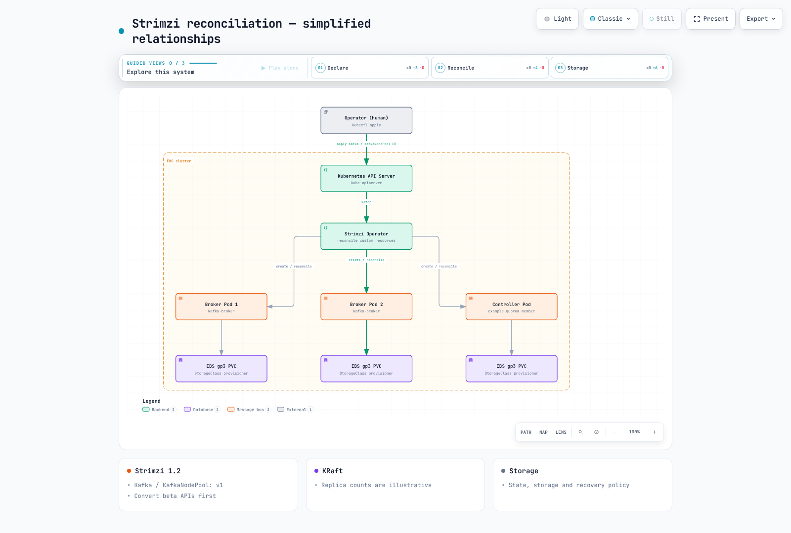

# Kafka on EKS Deep Dive

## Overview

This guide uses Strimzi Operator as a self-managed Kafka option on EKS. The Operator reconciles Pods, storage, listeners, certificates and upgrades; it does not remove responsibility for data, availability and security policy. Part 6 compares managed alternatives such as Amazon MSK.

> **Reviewed**: 2026-09-12. Strimzi 1.2.0 / Kafka 4.3.1.
> **Upgrade requirement**: Strimzi 1.0 and later only support CRD API `v1`. Convert existing `v1beta2` / `v1beta1` / `v1alpha1` resources and prepare CRDs through the official migration procedure before upgrading the Operator. Changing version numbers alone is not an upgrade plan.

Strimzi 1.2.0 supports Kafka 4.2.0, 4.2.1, 4.3.0 and 4.3.1, defaulting to 4.3.1. This guide pins a compatible combination; also check the distribution, Kubernetes version and upgrade path before installation.

## Core Architecture Concepts

Brokers store topic partition replicas. KafkaConsumer groups distribute partitions, with one member potentially owning several partitions. A separate controller quorum manages the metadata Raft log.

KRaft arrived as early access in 2.8 and production-ready in 3.3; Kafka 4.0 removed ZooKeeper mode. Controllers and brokers can be dedicated roles. Removing ZooKeeper does not remove controller, storage or recovery operations.

Users declare custom resources such as Kafka and KafkaNodePool; Strimzi reconciles Pods, PVCs, Services and Secrets. The diagram below is a simplified relationship sketch, not an HA replica-count deployment specification.

[View interactive diagram](https://www.atomai.click/kubernetes-docs/archmaps/en-data-on-eks-kafka-readme-0.html)

## Deep Dive Table of Contents

**[1. Kafka Fundamentals](01-kafka-fundamentals.md)**
- Brokers and topic/partition structure
- Replication and durability guarantees
- Consumer groups and offset management
- KRaft controller quorum architecture

**[2. Strimzi Operator](02-strimzi-operator.md)**
- Installing and configuring Strimzi
- `Kafka` and `KafkaNodePool` CRDs in detail
- Deploying a Kafka cluster on EKS

**[3. Kafka Operations](03-kafka-operations.md)**
- Storage design with EBS/gp3
- Broker scaling strategies
- Partition rebalancing with Cruise Control
- Rolling upgrades with compatibility and availability checks

**[4. Schema Registry](04-schema-registry.md)**
- Designing Avro/Protobuf schemas
- Karapace vs. Apicurio Registry
- Compatibility strategies: BACKWARD/FORWARD/FULL

**[5. Kafka Connect and MirrorMaker](05-kafka-connect-mirrormaker.md)**
- Deploying Kafka Connect and configuring connectors
- Operating source and sink connectors
- Disaster recovery and cross-region replication with MirrorMaker2

**[6. MSK Integration](06-msk-integration.md)**
- Amazon MSK vs. self-managed Strimzi
- Using MSK Connect
- Integrating with and comparing against Kinesis Data Streams

**[7. Monitoring](07-monitoring.md)**
- Collecting broker metrics with Prometheus/Grafana
- Monitoring consumer lag
- Autoscaling consumers with KEDA

**[8. Best Practices](08-best-practices.md)**
- Partition count and key design strategies
- Producer/consumer performance tuning
- Security with mTLS/SASL
- Storage and instance cost optimization

**[9. Kafka Measured Benchmark](09-kafka-benchmark.md)**
- Measured RF3 vs RF1 ingest ceiling of a 3-broker KRaft cluster on gp3 volumes
- Throughput and p99 latency trade-offs across acks=0/1/all
- Throughput and CPU cost by compression codec and record size
- How cold consumers and mixed workloads affect producer throughput

## References

- [Strimzi 1.2.0 release](https://github.com/strimzi/strimzi-kafka-operator/releases/tag/1.2.0)

- [Strimzi Documentation](https://strimzi.io/docs/operators/1.2.0/overview.html)
- [Apache Kafka Documentation](https://kafka.apache.org/43/design/design/)
- [KRaft operations guide](https://kafka.apache.org/43/operations/kraft/)
- [AWS Data on EKS Project](https://awslabs.github.io/data-on-eks/)

## Quiz

To test what you've learned in this section, try the [Kafka Fundamentals Quiz](../../quizzes/data-on-eks/kafka/01-kafka-fundamentals-quiz.md). To check whether you can turn the benchmark numbers into design decisions, also try the [Kafka Measured Benchmark Quiz](../../quizzes/data-on-eks/kafka/09-kafka-benchmark-quiz.md).
