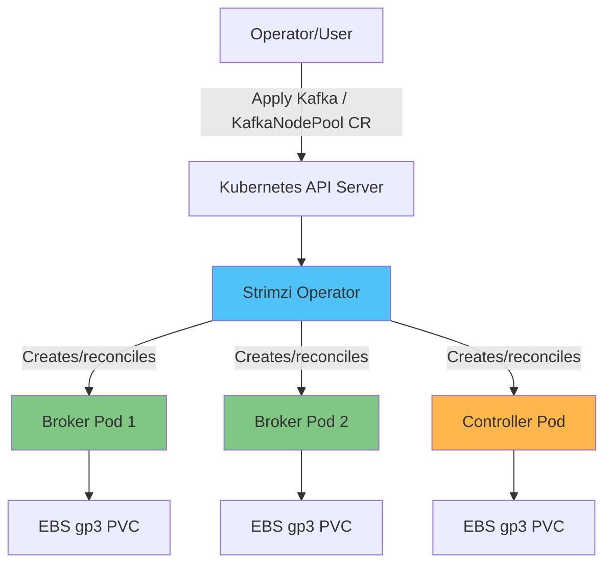

# Kafka on EKS Deep Dive

## Overview

Apache Kafka is the backbone of event-driven architectures and real-time streaming pipelines, used for asynchronous communication between microservices, log/metric aggregation, and CDC (Change Data Capture) pipelines, among many other use cases. On EKS, the standard approach is to run Kafka through the **Strimzi Kubernetes Operator** rather than managing raw StatefulSets directly. Strimzi lets you declaratively manage the full operational lifecycle of a Kafka cluster — creation, scaling, rolling upgrades, certificate management, and rack-aware placement — through Kubernetes-native CRDs (Custom Resource Definitions).

> **Supported Versions**: Kafka 3.7-3.9 (KRaft mode), Strimzi Operator 0.45+
> **Last Updated**: July 9, 2026

## Core Architecture Concepts

A Kafka cluster is made up of a set of processes called **brokers**. Each broker stores one or more **topics**, and each topic is split into multiple **partitions** for parallelism and scalability. Each partition maintains replicas across different brokers for durability. Producers write messages to partitions, and **consumer groups** split partitions among their members to consume messages in parallel, tracking progress via offsets.

Historically, Kafka relied on a separate ZooKeeper ensemble to manage cluster metadata — topics, partition assignments, ACLs, and so on. Starting with Kafka 3.x, **KRaft (Kafka Raft)** mode lets Kafka manage its own metadata through a Raft-based controller quorum, eliminating the need for ZooKeeper, reducing the number of components to operate, and significantly speeding up controller failover. As of Kafka 4.0, ZooKeeper support has been removed entirely, making KRaft the only supported metadata mechanism — so any new Kafka deployment on EKS should be designed around KRaft from the start.

Strimzi wraps all of these components as Kubernetes resources. You declare the desired state through CRDs like `Kafka` and `KafkaNodePool`, and the Strimzi Operator reconciles that state by creating and managing broker/controller Pods, PVCs, Services, and Secrets.

## Deep Dive Table of Contents

**[1. Kafka Fundamentals](01-kafka-fundamentals.md)**
- Brokers and topic/partition structure
- Replication and durability guarantees
- Consumer groups and offset management
- KRaft controller quorum architecture

**[2. Strimzi Operator](02-strimzi-operator.md)**
- Installing and configuring Strimzi
- `Kafka` and `KafkaNodePool` CRDs in detail
- Deploying a Kafka cluster on EKS

**[3. Kafka Operations](03-kafka-operations.md)**
- Storage design with EBS/gp3
- Broker scaling strategies
- Partition rebalancing with Cruise Control
- Zero-downtime rolling upgrades

**[4. Schema Registry](04-schema-registry.md)**
- Designing Avro/Protobuf schemas
- Karapace vs. Apicurio Registry
- Compatibility strategies: BACKWARD/FORWARD/FULL

**[5. Kafka Connect and MirrorMaker](05-kafka-connect-mirrormaker.md)**
- Deploying Kafka Connect and configuring connectors
- Operating source and sink connectors
- Disaster recovery and cross-region replication with MirrorMaker2

**[6. MSK Integration](06-msk-integration.md)**
- Amazon MSK vs. self-managed Strimzi
- Using MSK Connect
- Integrating with and comparing against Kinesis Data Streams

**[7. Monitoring](07-monitoring.md)**
- Collecting broker metrics with Prometheus/Grafana
- Monitoring consumer lag
- Autoscaling consumers with KEDA

**[8. Best Practices](08-best-practices.md)**
- Partition count and key design strategies
- Producer/consumer performance tuning
- Security with mTLS/SASL
- Storage and instance cost optimization

## References

- [Strimzi Documentation](https://strimzi.io/docs/operators/latest/overview)
- [Apache Kafka Documentation](https://kafka.apache.org/documentation/)
- [KIP-500: Replace ZooKeeper with a Self-Managed Metadata Quorum](https://cwiki.apache.org/confluence/display/KAFKA/KIP-500)
- [AWS Data on EKS Project](https://awslabs.github.io/data-on-eks/)

## Quiz

To test what you've learned in this section, try the [Kafka Fundamentals Quiz](../../quizzes/data-on-eks/kafka/01-kafka-fundamentals-quiz.md).
