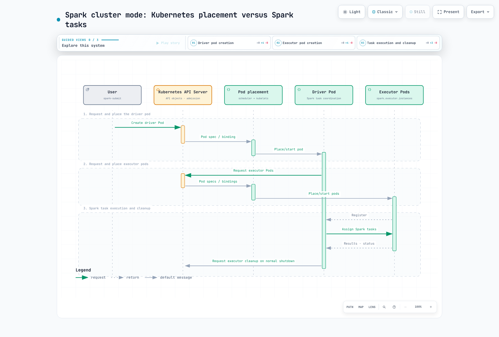

# Part 1: Spark on Kubernetes Fundamentals

> **Review baseline**: Spark 4.2.0, Kubernetes 1.34+; example image uses Java 21\
> **Last reviewed**: September 12, 2026

## Cluster mode and client mode

Kubernetes supports **both** Spark deployment modes. Client mode has been supported
since Spark 2.4 and is not restricted to notebooks.

| Mode | Driver location | Operational consequence |
| --- | --- | --- |
| Cluster | A driver pod created for the submission | The submitter needs API access; the driver needs its own service account/RBAC |
| Client | The submitting application, in a pod or on a host | Executors must reach the driver's advertised RPC/block-manager endpoints; keep the driver alive |

Reaching the Kubernetes API is not sufficient to establish executor-to-driver
connectivity. Client-mode networking may need a stable Service/hostname and fixed
ports. If its driver runs in a pod, configure the **actual** driver pod name for
executor owner-reference garbage collection; do not invent a pod owner for a
driver running outside Kubernetes.

## Who schedules what?

The API server handles authentication and admission and stores API objects; the
Kubernetes scheduler places pods, and node kubelets start their containers.
The Spark driver requests executor pods and its own schedulers coordinate
stages/tasks on the registered executors. These are different layers.



[Interactive diagram](https://www.atomai.click/kubernetes-docs/archmaps/en-data-on-eks-spark-01-spark-fundamentals-0.html)

1. The submitter requests the driver pod and associated resources.
2. Kubernetes places and starts the driver; the driver requests executor pods.
3. Kubernetes places/starts executors; they register with the driver.
4. The driver assigns Spark tasks; executors execute and report results/status.
5. On normal shutdown, Spark cleans up executors according to its configuration.
   A completed/failed driver pod can remain for logs; failure and owner-reference
   behavior must be considered rather than assuming immediate cleanup of everything.

This avoids a separate YARN or Spark Standalone control layer, but does not
eliminate Kubernetes capacity, node, storage, network or image operations.

## A concrete cluster-mode example

Prerequisites: Spark 4.2.0 locally, a compatible kubectl/current kubeconfig context,
Kubernetes 1.34+, namespace capacity and image access. The submitter's API
credentials and the in-cluster driver's RBAC are separate. The SparkPi example
does not need AWS data permissions; S3 workloads additionally need their chosen
workload identity and compatible Hadoop/AWS libraries.

A namespace administrator reviews/applies `rbac.yaml`:

```yaml
apiVersion: v1
kind: Namespace
metadata:
  name: spark-jobs
---
apiVersion: v1
kind: ServiceAccount
metadata:
  name: spark-driver
  namespace: spark-jobs
---
apiVersion: v1
kind: ServiceAccount
metadata:
  name: spark-executor
  namespace: spark-jobs
automountServiceAccountToken: false
---
apiVersion: rbac.authorization.k8s.io/v1
kind: Role
metadata:
  name: spark-driver
  namespace: spark-jobs
rules:
- apiGroups:
  - ''
  resources:
  - pods
  - services
  - configmaps
  verbs:
  - create
  - get
  - list
  - watch
  - delete
  - patch
---
apiVersion: rbac.authorization.k8s.io/v1
kind: RoleBinding
metadata:
  name: spark-driver
  namespace: spark-jobs
roleRef:
  apiGroup: rbac.authorization.k8s.io
  kind: Role
  name: spark-driver
subjects:
- kind: ServiceAccount
  name: spark-driver
  namespace: spark-jobs
```

This role supports the basic example without dynamically created PVCs.
Additional volume/resource-management features may need corresponding scoped
permissions. Executor pods use a separate service account with API token automount
disabled. Only trusted job code/submitters should use a namespace where the driver
can create pods; RBAC alone is not a sandbox for untrusted application code.

Save these as **Pod templates**, not standalone pods to `kubectl apply`.
Spark fills in its image, commands and other fields:

Driver template, `driver-template.yaml`:

```yaml
apiVersion: v1
kind: Pod
metadata:
  name: spark-driver-template
spec:
  securityContext:
    runAsNonRoot: true
    runAsUser: 185
    runAsGroup: 185
    seccompProfile:
      type: RuntimeDefault
  containers:
  - name: spark-kubernetes-driver
    securityContext:
      allowPrivilegeEscalation: false
      capabilities:
        drop:
        - ALL
```

Executor template, `executor-template.yaml`:

```yaml
apiVersion: v1
kind: Pod
metadata:
  name: spark-executor-template
spec:
  securityContext:
    runAsNonRoot: true
    runAsUser: 185
    runAsGroup: 185
    seccompProfile:
      type: RuntimeDefault
  containers:
  - name: spark-kubernetes-executor
    securityContext:
      allowPrivilegeEscalation: false
      capabilities:
        drop:
        - ALL
  automountServiceAccountToken: false
  terminationGracePeriodSeconds: 60
```

The files are accessible to the **submitting process**. In cluster mode Spark
arranges for the executor template to be mounted into the driver. Spark overrides
some template fields, so inspect the generated pods when combining templates,
operator webhooks and Spark settings.

```bash
#!/bin/bash
set -euo pipefail
# Run in the directory containing driver-template.yaml and executor-template.yaml.
KUBE_CONTEXT="$(kubectl config current-context)"
KUBE_API_URL="$(kubectl --context "$KUBE_CONTEXT" config view --minify -o jsonpath='{.clusters[0].cluster.server}')"
case "$KUBE_API_URL" in https://*) ;; *) echo "Expected an HTTPS Kubernetes API URL" >&2; exit 1;; esac
SPARK_APP_NAME="spark-pi-$(date -u +%Y%m%d%H%M%S)"
spark-submit \
  --master "k8s://${KUBE_API_URL}" \
  --deploy-mode cluster \
  --name "$SPARK_APP_NAME" \
  --class org.apache.spark.examples.SparkPi \
  --conf "spark.kubernetes.context=$KUBE_CONTEXT" \
  --conf spark.kubernetes.namespace=spark-jobs \
  --conf spark.kubernetes.container.image=spark:4.2.0-scala2.13-java21-ubuntu \
  --conf spark.kubernetes.authenticate.driver.serviceAccountName=spark-driver \
  --conf spark.kubernetes.authenticate.executor.serviceAccountName=spark-executor \
  --conf "spark.kubernetes.driver.pod.name=$SPARK_APP_NAME-driver" \
  --conf spark.kubernetes.driver.podTemplateFile=driver-template.yaml \
  --conf spark.kubernetes.executor.podTemplateFile=executor-template.yaml \
  --conf spark.kubernetes.executor.terminationGracePeriodSeconds=60s \
  --conf spark.driver.cores=1 \
  --conf spark.driver.memory=1g \
  --conf spark.kubernetes.driver.limit.cores=1 \
  --conf spark.executor.cores=1 \
  --conf spark.executor.memory=1g \
  --conf spark.kubernetes.executor.limit.cores=1 \
  --conf spark.executor.instances=3 \
  local:///opt/spark/examples/jars/spark-examples.jar 10
kubectl -n spark-jobs logs "$SPARK_APP_NAME-driver"
kubectl -n spark-jobs get pod "$SPARK_APP_NAME-driver" -o jsonpath='{.status.phase}{"\n"}'
```

Apply `rbac.yaml` before running the submission script. The versioned official
image contains the `spark-examples.jar` symlink; `local:///` means the artifact is
already in the container, not a local laptop file to upload. Mirror/pin the image
through your normal supply-chain process if required. The helper script uses a
fresh driver name and the selected kubeconfig context; preserve these values for
failure investigation.

Three fixed executors are requested, but quota, admission, scheduling, image pulls
or node capacity can keep pods Pending. Check driver/executor events and logs;
`spark-submit` alone is not evidence of successful task execution.

## Resources are requests, limits and task slots

| Spark setting | Kubernetes/default-profile effect |
| --- | --- |
| `spark.driver.cores` | Driver CPU request unless overridden |
| `spark.executor.cores` | Executor task capacity and default CPU request |
| `spark.kubernetes.{driver,executor}.request.cores` | Overrides Kubernetes CPU request, not the executor's Spark task-slot setting |
| `spark.kubernetes.{driver,executor}.limit.cores` | Explicit CPU limit; a CPU limit is not automatically implied by cores |
| Driver memory | Request and limit include heap plus configured/calculated overhead |
| Executor memory | Request and limit include heap, overhead and applicable off-heap/PySpark memory |

For this JVM example, 1 GiB heap plus the default minimum 384 MiB overhead yields
**1,408 MiB** memory request/limit. That is a verified default calculation, not a
universal job size. Python/native memory and custom ResourceProfiles need their
own review. A CPU request below task capacity can permit contention; changing a
request is not the same as changing how many Spark tasks an executor can run.

## Dynamic Resource Allocation

Spark DRA changes **executor count** as task backlog/idle conditions change. It is
different from Kubernetes DRA for devices and from a node autoscaler's response to
Pending pods.

Stock Spark on Kubernetes does not support the YARN-style external shuffle service.
Shuffle tracking is a supported choice, but not the only mechanism in Spark:
decommission-based shuffle preservation and a suitable reliable ShuffleDataIO
implementation are alternatives with their own conditions.

For a shuffle-tracking profile:

```properties
spark.dynamicAllocation.enabled=true
spark.dynamicAllocation.shuffleTracking.enabled=true
spark.dynamicAllocation.minExecutors=2
spark.dynamicAllocation.initialExecutors=3
spark.dynamicAllocation.maxExecutors=20
spark.kubernetes.allocation.batch.size=5
```

Pass these properties with `--conf` or a properties file. Shuffle tracking was
introduced in Spark 3.0 and is **already true by default in 4.2**; stating it
explicitly documents the choice. The old claim that both explicit flags are always
mandatory is incorrect.

Tracking tries to retain executors holding active shuffle data. Configured
tracking/cached-executor idle timeouts, forced termination and node failure can
still cause recomputation. It is not durable shared storage. Enabling overlapping
preservation mechanisms can delay executor release; test their interaction.

The initial count considers `minExecutors`, `initialExecutors` and an existing
`spark.executor.instances` value. The example's fixed count of three matches its
initial count of three; min=2 does not mean it must start with two.

`spark.kubernetes.allocation.batch.size` controls a batch of pod requests. It is
not a direct EC2 scaling policy: API throttling, pod allocation timing, ResourceQuota,
scheduling constraints and node provisioning remain separate.

## Graceful decommission is best effort

These settings enable executor/block-manager decommission and migration of
applicable RDD/shuffle blocks:

```properties
spark.decommission.enabled=true
spark.storage.decommission.enabled=true
spark.storage.decommission.rddBlocks.enabled=true
spark.storage.decommission.shuffleBlocks.enabled=true
spark.kubernetes.executor.terminationGracePeriodSeconds=60s
```

With the chosen Spark 4.2 Kubernetes path, enabling decommission **injects a
preStop hook** that runs `spark.kubernetes.decommission.script`, default
`/opt/decom.sh`. The official image includes it. That script finds the executor
JVM, sends **SIGPWR** and waits; Spark's default decommission signal is PWR.
Normal pod termination is therefore mediated by this hook, not by assuming every
plain SIGTERM automatically migrates data.

Custom images must include a working script and its tools, and a changed signal
must match the script. Spark can override a template's lifecycle settings. Inspect
the actual hook and test both planned scale-down and interruption paths.

The submission explicitly sets
`spark.kubernetes.executor.terminationGracePeriodSeconds=60s`.
Spark 4.2 overrides the pod template's value with this setting, whose default is
30 seconds; setting only `terminationGracePeriodSeconds: 60` in the template is
insufficient. The grace period includes preStop execution. It is
an upper budget, not a promise of migration completion or a delay of the underlying
Spot termination deadline. Healthy destination executors, disk/network capacity,
time and any configured fallback storage are required. Hard node loss or forced
deletion can bypass the opportunity entirely. Explicit deletion-grace settings,
including Spark's dynamic-allocation delete path, can also change the available budget.

These flags do not restart a failed driver, replace application checkpoints or
guarantee end-to-end exactly-once output. Distinguish recomputable intermediate
blocks from durable input/output and plan recovery accordingly.

## References and validation

A local SparkPi job ran successfully with the driver bound to loopback and UI
disabled. Native Spark 4.2 feature-step tests confirmed memory mapping, default
CPU-limit behavior and automatic decommission-hook insertion without creating a
Kubernetes client. These checks do not prove EKS submission, RBAC/CNI enforcement,
actual migration completion or AWS data access.

- [Spark 4.2.0 on Kubernetes](https://spark.apache.org/docs/4.2.0/running-on-kubernetes.html)
- [Spark 4.2.0 configuration](https://spark.apache.org/docs/4.2.0/configuration.html)
- [Spark 4.2.0 dynamic allocation alternatives](https://spark.apache.org/docs/4.2.0/job-scheduling.html#dynamic-resource-allocation)
- [Driver resource mapping](https://github.com/apache/spark/blob/v4.2.0/resource-managers/kubernetes/core/src/main/scala/org/apache/spark/deploy/k8s/features/BasicDriverFeatureStep.scala)
- [Executor resources and decommission hook](https://github.com/apache/spark/blob/v4.2.0/resource-managers/kubernetes/core/src/main/scala/org/apache/spark/deploy/k8s/features/BasicExecutorFeatureStep.scala)
- [Official decommission script](https://github.com/apache/spark/blob/v4.2.0/resource-managers/kubernetes/docker/src/main/dockerfiles/spark/decom.sh)
- [Official Spark image tags](https://github.com/docker-library/official-images/blob/master/library/spark)

## Next steps

[Part 2: Spark Operator](./02-spark-operator.md)

[Return to main page](./README.md)

## Quiz

[Topic quiz](../../quizzes/data-on-eks/spark/01-spark-fundamentals-quiz.md)
