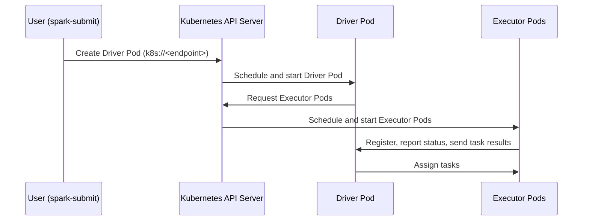

# Part 1: Spark on Kubernetes Fundamentals

> **Supported Versions**: Apache Spark 4.2, Kubernetes 1.30+\
> **Last Updated**: July 15, 2026

## Lab Environment Setup

To follow along with the examples in this document, you will need the following tools and environment:

### Required Tools

* kubectl v1.30 or later
* A working Kubernetes cluster (Amazon EKS recommended)
* Apache Spark 4.2 distributed locally (for running `spark-submit` against the cluster)
* An IAM role associated with a Kubernetes service account (IRSA or EKS Pod Identity) if driver/executor pods need to reach AWS services such as S3

## What is Spark on Kubernetes?

Apache Spark is a distributed data processing engine for large-scale batch and streaming workloads. Since Spark 2.3, Kubernetes has been a first-class **native cluster manager** alongside Standalone, YARN, and Mesos (Mesos support was later removed). Running Spark on Kubernetes means the same Kubernetes API that schedules your other workloads also schedules Spark's driver and executor pods — no separate Spark cluster infrastructure to stand up or maintain.

This document covers the concepts you need before deploying real Spark jobs on EKS: how `spark-submit` maps onto pods, why the driver — not a separate cluster manager — does the scheduling, how Dynamic Resource Allocation (DRA) behaves differently on Kubernetes than on YARN, and how graceful decommissioning protects running jobs when a pod is about to terminate. Part 2 covers the Spark Operator, which wraps these same primitives in a Kubernetes-native CRD-based workflow.

## 1. Cluster-Mode-Only Submission on Kubernetes

### How spark-submit Works on Kubernetes

Kubernetes only supports **cluster deploy mode** for `spark-submit` — the driver itself runs inside a pod on the cluster, rather than on the machine that issued the submit command (client mode exists but is mainly used for interactive tools like spark-shell and notebooks). A typical submission looks like this:

```bash
spark-submit \
  --master k8s://https://<EKS_API_SERVER_ENDPOINT>:443 \
  --deploy-mode cluster \
  --name spark-etl-job \
  --class com.example.ETLJob \
  --conf spark.kubernetes.namespace=spark-jobs \
  --conf spark.kubernetes.container.image=<ECR_IMAGE_URI> \
  --conf spark.kubernetes.authenticate.driver.serviceAccountName=spark-driver \
  --conf spark.executor.instances=4 \
  local:///opt/spark/jobs/etl-job.jar
```

The `k8s://<endpoint>` master URL points `spark-submit` at the Kubernetes API server. Once submitted, the flow looks like this:



1. `spark-submit` talks to the Kubernetes API server and creates a **driver pod** directly — no intermediate scheduling process is involved.
2. Once running, the driver pod itself calls back into the Kubernetes API to create the **executor pods** it needs, based on `spark.executor.instances` (or Dynamic Resource Allocation, covered below).
3. Executors register with the driver, pull their assigned tasks, execute them, and report results and status back to the driver.
4. When the job finishes, the driver's Spark context shuts down and cleans up the executor pods it created.

### Why This Is Simpler Than YARN — and What It Shifts

On YARN, submitting a job means talking to a persistent **ResourceManager**, which negotiates containers from per-node **NodeManager** daemons and hands one to an ApplicationMaster that then manages the job's executors. Kubernetes removes that layer entirely: there is no long-running Spark-specific cluster-manager daemon to install, upgrade, or keep highly available. The Kubernetes control plane you already operate for every other workload is the only "cluster manager" Spark needs.

The trade-off is that this pushes scheduling and resource-allocation responsibility onto the **driver pod itself**. The driver acts as its own scheduler: it is the one issuing `CREATE` requests for executor pods against the Kubernetes API, tracking which executors are alive, and requesting replacements when executors fail. This is architecturally simpler operationally (fewer moving parts to run), but it also means the driver pod's permissions (via its service account) and its ability to reach the API server are on the critical path for the entire job — if the driver pod cannot create or watch executor pods, no work gets scheduled at all.

### Driver and Executor Pod Resource Model

Each driver and executor runs as an ordinary pod, and standard Spark resource configuration maps onto standard Kubernetes pod resource fields:

| Spark Configuration | Kubernetes Effect |
| --- | --- |
| `spark.driver.cores`, `spark.driver.memory` | CPU/memory requests (and, with overhead added, limits) on the driver pod's container |
| `spark.executor.cores`, `spark.executor.memory` | CPU/memory requests/limits on each executor pod's container |
| `spark.kubernetes.driver.request.cores` / `.limit.cores` | Overrides the driver container's Kubernetes CPU request/limit independently of `spark.driver.cores` |
| `spark.kubernetes.executor.request.cores` / `.limit.cores` | Same, for executor pods |

There isn't a one-size-fits-all default that fits every workload — the right driver/executor sizing depends on your job's shuffle volume, partition count, and per-task memory needs. Treat these settings as something to size through testing against your actual workload rather than values to copy from another job unchanged.

## 2. Dynamic Resource Allocation (DRA) on Kubernetes

### Why DRA Needs an Extra Flag on Kubernetes

Dynamic Resource Allocation lets Spark scale the number of executors up and down during a job's execution, adding executors when there's a backlog of pending tasks and removing idle ones to free up cluster capacity. On YARN, this has long worked cleanly because YARN's NodeManager hosts an **External Shuffle Service (ESS)** — a daemon that lives outside any single executor's lifetime and can keep serving shuffle blocks after the executor that produced them has been removed.

Kubernetes has no equivalent built-in daemon. Without ESS, if the DRA logic removes an executor that's still holding shuffle blocks other tasks need to read, those blocks are gone and the tasks that need them fail (forcing an expensive recompute). This is why enabling DRA on Kubernetes requires **both** of the following settings together — enabling one without the other leaves this gap unprotected:

```properties
spark.dynamicAllocation.enabled=true
spark.dynamicAllocation.shuffleTracking.enabled=true
```

`spark.dynamicAllocation.shuffleTracking.enabled` (stable since Spark 3.3.0) makes Spark track which executors are still holding shuffle blocks that other, not-yet-finished tasks depend on. With shuffle tracking on, the scale-down logic will not remove an executor that still holds needed shuffle data — it waits until those blocks are no longer needed or the job completes before reclaiming that executor's pod.

### Tuning Knobs

| Setting | Purpose |
| --- | --- |
| `spark.dynamicAllocation.minExecutors` | Floor on the number of executors DRA will scale down to |
| `spark.dynamicAllocation.maxExecutors` | Ceiling on the number of executors DRA will scale up to |
| `spark.kubernetes.allocation.batch.size` | How many executor pod creation requests the driver sends to the Kubernetes API per batch, controlling how aggressively it ramps up |

```properties
spark.dynamicAllocation.enabled=true
spark.dynamicAllocation.shuffleTracking.enabled=true
spark.dynamicAllocation.minExecutors=2
spark.dynamicAllocation.maxExecutors=20
spark.kubernetes.allocation.batch.size=5
```

Setting `spark.kubernetes.allocation.batch.size` too high can cause a burst of pod creation requests to hit the Kubernetes API and the underlying node group's scaling all at once; a more moderate batch size smooths out how quickly new nodes need to be provisioned to satisfy new executor pods.

## 3. Graceful Executor Decommissioning

### The Problem: Pods Die, But Data Shouldn't

A Kubernetes pod can be terminated for reasons that have nothing to do with the Spark job itself — a node scale-down event, a Spot Instance interruption, or a rolling node upgrade. By default, when an executor pod is killed, any data it held only in memory or on local disk (cached RDD partitions, shuffle blocks it was serving) is lost, and the tasks that depended on that data must be recomputed elsewhere.

### Graceful Decommission (Spark 3.1.1+)

Spark's graceful decommissioning feature gives an executor a chance to migrate what it's holding to peer executors before it actually goes away, rather than losing that data outright. It is enabled with:

```properties
spark.decommission.enabled=true
spark.storage.decommission.enabled=true
```

When a pod is signaled for termination, Kubernetes gives it a grace period — the pod's `terminationGracePeriodSeconds` (30 seconds by default) — before it is forcibly killed. With decommissioning enabled, Spark uses that window to migrate cached RDD blocks and shuffle blocks it's holding to other, still-healthy executors, rather than simply losing them when the pod disappears.

```yaml
# Example: a longer grace period gives decommissioning more time to migrate blocks
apiVersion: v1
kind: Pod
metadata:
  name: spark-executor-example
spec:
  terminationGracePeriodSeconds: 60
  containers:
    - name: spark-kubernetes-executor
      # ...
```

This matters most in exactly the scenarios that make Kubernetes-based Spark attractive in the first place — cost-driven decisions like running executors on Spot Instances, where interruption is expected behavior rather than a rare failure. Graceful decommissioning is the foundation that makes an interruption a manageable event (some data migrated, some tasks recomputed) instead of a job-wide failure. The performance-tuning document later in this series covers Spot Instance-specific handling (interruption notices, node termination handlers, and how they interact with this decommissioning window) in more depth.

## Next Steps

This document covered the fundamentals of running Spark on Kubernetes: how `spark-submit` in cluster mode creates a driver pod that schedules its own executor pods directly against the Kubernetes API, why Dynamic Resource Allocation needs `shuffleTracking.enabled` in the absence of a YARN-style External Shuffle Service, and how graceful decommissioning protects in-flight data when a pod is about to terminate. Part 2 covers deploying and managing Spark applications on EKS declaratively using the **Spark Operator**.

[Return to Main Page](./README.md)

## Quiz

To test what you've learned in this chapter, try the [Topic Quiz](../../quizzes/data-on-eks/spark/01-spark-fundamentals-quiz.md).
