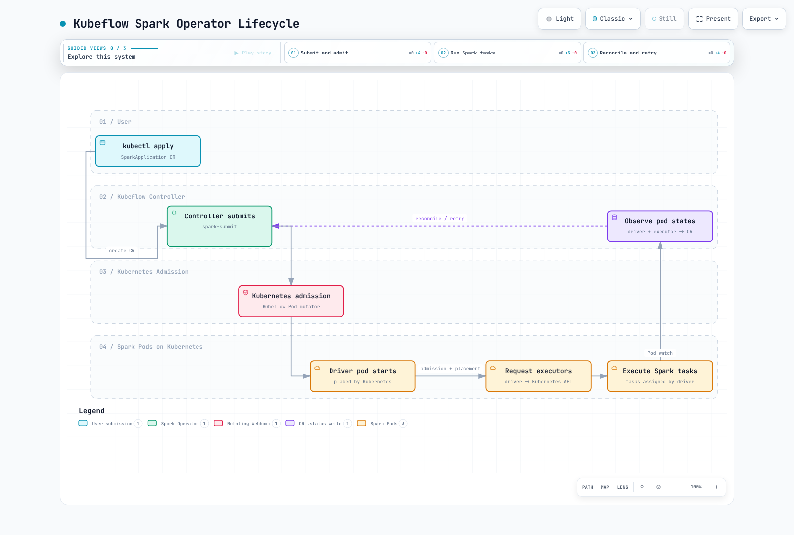

# Part 2: Spark Operator

> **Review baseline**: Kubeflow operator/chart 2.5.2; Apache operator 1.0.0 / chart 1.8.0\
> **Example runtimes**: Kubeflow lab uses Spark 4.0.4, matching its controller image's submission runtime; Apache example uses Spark 4.2.0\
> **Last reviewed**: September 12, 2026

## Two projects and different APIs

These are separately maintained projects, not interchangeable implementations of
one manifest. Select based on the API/lifecycle you need, existing resources,
supported runtime combinations and operational tests. Age or an unmeasured
popularity claim is not a compatibility guarantee.

| Item | Kubeflow Spark Operator | Apache Spark Kubernetes Operator |
| --- | --- | --- |
| Reviewed release | 2.5.2 | 1.0.0 |
| Helm chart | 2.5.2 | **1.8.0**; chart and application versions differ |
| Application API used here | `sparkoperator.k8s.io/v1beta2` | `spark.apache.org/v1` |
| Main workload types | SparkApplication, ScheduledSparkApplication; separate SparkConnect API | SparkApplication and SparkCluster |
| Configuration model | type/mode/driver/executor/restartPolicy | runtimeVersions/driverSpec/executorSpec/applicationTolerations/sparkConf |
| Admission approach in these charts | Mutating and validating webhooks | No equivalent pod-mutating webhook installed by this chart |

Apache's SparkCluster can manage a resident Spark cluster, a different execution
model from the native Kubernetes SparkApplication flow. Its Comet/Gluten examples
still require suitable plugin binaries/images, classpaths, configuration and runtime/
architecture compatibility. Installing the operator does not enable acceleration
automatically, and those plugins are not a reason to assume one operator always wins.

Both API groups can exist, but coexistence needs deliberate watch scopes, names,
webhook selectors and RBAC. The lab below selects **one installation path**.
Use fully qualified resource names to avoid ambiguous `sparkapp` shortcuts.

## What reconciliation adds

Plain `spark-submit` can wait for completion and expose pod/log/UI/event-log status;
scripts, properties and pod templates can also be versioned in Git. It is not
inherently fire-and-forget. What it does not itself add is an operator-managed
SparkApplication CR, scheduled-resource controller or automatic application retry.

Kubeflow intentionally submits with `spark.kubernetes.submission.waitAppCompletion=false`
and then reconciles pod/application state. It also observes executor pods and
performs lifecycle cleanup; “the operator only touches the driver” is incorrect.
The Spark driver still requests executor capacity and assigns Spark tasks.

## Prepare the lab namespace and identities

Use kubectl/Helm compatible with your cluster. The chart examples were rendered
against Kubernetes 1.36; the Apache Spark 4.2 workload requires Kubernetes 1.34+.
Do not infer a current recommended Kubernetes floor from an old README table.

The Kubeflow controller's pinned Dockerfile uses Spark **4.0.4** for submission.
This chapter aligns that lab workload with 4.0.4; Part 1's direct 4.2 submission is
separate. A SparkApplication `sparkVersion` field does not upgrade the Spark
installation inside the controller. Test another submitter/workload combination
explicitly before adopting it.

Save/apply `job-rbac.yaml` before installing either chart. It matches Part 1's
namespace-scoped job permissions and separates driver and executor identities.
Review existing resources if you already use these names.

```yaml
apiVersion: v1
kind: Namespace
metadata:
  name: spark-jobs
---
apiVersion: v1
kind: ServiceAccount
metadata:
  name: spark-driver
  namespace: spark-jobs
---
apiVersion: v1
kind: ServiceAccount
metadata:
  name: spark-executor
  namespace: spark-jobs
automountServiceAccountToken: false
---
apiVersion: rbac.authorization.k8s.io/v1
kind: Role
metadata:
  name: spark-driver
  namespace: spark-jobs
rules:
- apiGroups:
  - ''
  resources:
  - pods
  - services
  - configmaps
  verbs:
  - create
  - get
  - list
  - watch
  - delete
  - patch
---
apiVersion: rbac.authorization.k8s.io/v1
kind: RoleBinding
metadata:
  name: spark-driver
  namespace: spark-jobs
roleRef:
  apiGroup: rbac.authorization.k8s.io
  kind: Role
  name: spark-driver
subjects:
- kind: ServiceAccount
  name: spark-driver
  namespace: spark-jobs
```

```bash
kubectl apply -f job-rbac.yaml
```

No AWS data access is required for SparkPi. Operator API permissions, driver API
permissions and AWS data permissions are separate concerns.

## Option A: Kubeflow installation

Save as `kubeflow-values.yaml`. The default chart watches `default`, not its own
installation namespace; **watch namespace and job namespace must agree**.
Here jobs run in `spark-jobs`, and the chart reuses the job RBAC prepared above.
Resource sizes and submission concurrency are lab starting points to measure.

```yaml
spark:
  jobNamespaces:
  - spark-jobs
  jobNamespaceSelector: ''
  serviceAccount:
    create: false
  rbac:
    create: false
webhook:
  enable: true
  resources:
    requests:
      cpu: 100m
      memory: 128Mi
    limits:
      cpu: '1'
      memory: 512Mi
controller:
  workers: 2
  resources:
    requests:
      cpu: 500m
      memory: 1Gi
    limits:
      cpu: '2'
      memory: 2Gi
```

`webhook.enable` is already **true by default** in 2.5.2. It is stated explicitly
to document the choice, not because omitting the flag disables the webhook.
Some customizations use admission; others are translated into native Spark
configuration. Disabling the webhook does not imply every setting is ignored.

The checksum below matches the downloaded **GitHub release asset**. During this
review, the repository index's digest for this version differed from the asset
metadata/download, so this example uses the directly verified release archive.

```bash
# Fresh installation after reviewing/applying job-rbac.yaml.
curl --fail --location --silent --show-error 'https://github.com/kubeflow/spark-operator/releases/download/v2.5.2/spark-operator-2.5.2.tgz' -o spark-operator-2.5.2.tgz
printf '%s\n' '762be5b8632ecfe12eb20fff54450ddae0427f09506422107c508a0d1d38655b  spark-operator-2.5.2.tgz' | sha256sum --check -
helm install spark-operator ./spark-operator-2.5.2.tgz \
  --namespace spark-operator --create-namespace \
  --values kubeflow-values.yaml --wait --timeout 5m
kubectl -n spark-operator get deployments,pods
```

This is a fresh-install example. For upgrades, review the CRD migration procedure:
normal Helm upgrades do not automatically replace CRDs in `crds/`, and this chart's
`hook.upgradeCrd` is an explicit opt-in. Do not delete shared CRDs as a routine
upgrade step because their custom resources are affected.

In EKS, verify control-plane access to the webhook Service/endpoints, serving
certificate/CA bundle and selectors. The server listens on 9443 in this chart.
With failurePolicy=Fail, an unavailable webhook can block matching admissions.
Deployment readiness alone does not prove a Spark workload can be admitted.

## Kubeflow SparkApplication

Save as `spark-pi.yaml`. This uses a real example already in the pinned image,
avoiding an unspecified S3 object or missing custom ETL class.

```yaml
apiVersion: sparkoperator.k8s.io/v1beta2
kind: SparkApplication
metadata:
  name: spark-pi
  namespace: spark-jobs
spec:
  type: Scala
  mode: cluster
  image: apache/spark:4.0.4@sha256:94ad730f7510002d8a1615de269f27cdeca4d4eef51657384db3fa9246b5a4d8
  imagePullPolicy: IfNotPresent
  mainClass: org.apache.spark.examples.SparkPi
  mainApplicationFile: local:///opt/spark/examples/jars/spark-examples_2.13-4.0.4.jar
  arguments:
  - '10'
  sparkVersion: 4.0.4
  restartPolicy:
    type: OnFailure
    onFailureRetries: 3
    onFailureRetryInterval: 30
    onSubmissionFailureRetries: 3
    onSubmissionFailureRetryInterval: 30
  driver:
    cores: 1
    coreLimit: '1'
    memory: 1g
    serviceAccount: spark-driver
    podSecurityContext: &id001
      runAsNonRoot: true
      runAsUser: 185
      seccompProfile:
        type: RuntimeDefault
    securityContext: &id002
      allowPrivilegeEscalation: false
      capabilities:
        drop:
        - ALL
  executor:
    cores: 1
    coreLimit: '1'
    instances: 2
    memory: 1g
    serviceAccount: spark-executor
    terminationGracePeriodSeconds: 60
    podSecurityContext: *id001
    securityContext: *id002
```

`driver.serviceAccount` **and** `executor.serviceAccount` are valid fields in this
version. Retry settings apply to submission/application attempts, not merely an
in-place container restart. A rerun can repeat output side effects; use idempotent
or transactional output design for real jobs.

The executor grace field is applied by the Kubeflow pod mutator. It is distinct
from the native Spark 4.2 template override discussed in Part 1. If enabling Spark
decommissioning or custom lifecycle hooks, inspect how the selected operator,
Spark runtime and webhook compose them.

```bash
kubectl apply -f spark-pi.yaml
kubectl -n spark-jobs get sparkapplications.sparkoperator.k8s.io spark-pi \
  -o jsonpath='{.status.applicationState.state}{"\n"}'
kubectl -n spark-jobs describe sparkapplications.sparkoperator.k8s.io spark-pi
DRIVER_POD="$(kubectl -n spark-jobs get sparkapplications.sparkoperator.k8s.io spark-pi \
  -o jsonpath='{.status.driverInfo.podName}')"
: "${DRIVER_POD:?Driver pod name is not available yet; inspect submission events}"
kubectl -n spark-jobs logs "$DRIVER_POD"
```

Read the current status and events, including submission failures, and then the
actual driver pod name. `kubectl get -w` is an open watch requiring interruption;
it is not a finite “wait until success” step. COMPLETED reports process completion,
not proof that an external dataset is correct.

### Explicit UTC scheduling

Save as `scheduled-spark-pi.yaml`. This intentionally schedules the same harmless
Pi example; replace it with a packaged/tested ETL program for real data processing.

```yaml
apiVersion: sparkoperator.k8s.io/v1beta2
kind: ScheduledSparkApplication
metadata:
  name: daily-spark-pi
  namespace: spark-jobs
spec:
  schedule: 0 2 * * *
  timeZone: UTC
  concurrencyPolicy: Forbid
  successfulRunHistoryLimit: 2
  failedRunHistoryLimit: 2
  template:
    type: Scala
    mode: cluster
    image: apache/spark:4.0.4@sha256:94ad730f7510002d8a1615de269f27cdeca4d4eef51657384db3fa9246b5a4d8
    imagePullPolicy: IfNotPresent
    mainClass: org.apache.spark.examples.SparkPi
    mainApplicationFile: local:///opt/spark/examples/jars/spark-examples_2.13-4.0.4.jar
    arguments:
    - '10'
    sparkVersion: 4.0.4
    restartPolicy:
      type: OnFailure
      onFailureRetries: 3
      onFailureRetryInterval: 30
      onSubmissionFailureRetries: 3
      onSubmissionFailureRetryInterval: 30
    driver:
      cores: 1
      coreLimit: '1'
      memory: 1g
      serviceAccount: spark-driver
      podSecurityContext: &id001
        runAsNonRoot: true
        runAsUser: 185
        seccompProfile:
          type: RuntimeDefault
      securityContext: &id002
        allowPrivilegeEscalation: false
        capabilities:
          drop:
          - ALL
    executor:
      cores: 1
      coreLimit: '1'
      instances: 2
      memory: 1g
      serviceAccount: spark-executor
      terminationGracePeriodSeconds: 60
      podSecurityContext: *id001
      securityContext: *id002
```

`timeZone` is supported in 2.5.2; otherwise the default is Local to the controller.
Here the schedule means 02:00 **UTC**. Forbid checks this scheduled resource's
previous run; it does not prevent duplicate effects from retries, manual runs or
another scheduler. History limits bound retained child-run history, not data backups.

```bash
kubectl apply -f scheduled-spark-pi.yaml
kubectl -n spark-jobs get scheduledsparkapplications.sparkoperator.k8s.io daily-spark-pi -o yaml
# Stop future schedule triggers; this does not itself terminate an active child run.
kubectl -n spark-jobs patch scheduledsparkapplications.sparkoperator.k8s.io daily-spark-pi \
  --type=merge -p '{"spec":{"suspend":true}}'
```

## Option B: Apache operator, a separate path

Use `apache-values.yaml` **instead of Option A** for this lab. It watches
`spark-jobs`, uses namespace roles for the operator and reuses the existing job
identities. Chart comments may use older property spellings; the rendered
configuration sets `spark.kubernetes.operator.watchedNamespaces=spark-jobs`.

```yaml
workloadResources:
  namespaces:
    create: false
    overrideWatchedNamespaces: true
    data:
    - spark-jobs
  serviceAccount:
    create: false
  role:
    create: false
  clusterRole:
    create: false
  roleBinding:
    create: false
operatorRbac:
  clusterRole:
    create: false
  clusterRoleBinding:
    create: false
  role:
    create: true
  roleBinding:
    create: true
```

```bash
# Fresh installation after reviewing/applying job-rbac.yaml.
curl --fail --location --silent --show-error 'https://github.com/apache/spark-kubernetes-operator/releases/download/1.0.0/spark-kubernetes-operator-1.8.0.tgz' -o spark-kubernetes-operator-1.8.0.tgz
printf '%s\n' '7536a8849b8a7c242283d0e393b5e0ec56365f34ec93717b158c76dfa1036a06  spark-kubernetes-operator-1.8.0.tgz' | sha256sum --check -
helm install asf-spark-operator ./spark-kubernetes-operator-1.8.0.tgz \
  --namespace spark-operator-asf --create-namespace \
  --values apache-values.yaml --wait --timeout 5m
kubectl -n spark-operator-asf get deployments,pods
```

The Apache release has a different lifecycle model and runtime image from Kubeflow.
Use its published image; assumptions about the workload's Java version do not
determine the operator image's Java requirements.

This v1 example uses Spark 4.2.0 and keeps resources briefly for inspection:

```yaml
apiVersion: spark.apache.org/v1
kind: SparkApplication
metadata:
  name: spark-pi-asf
  namespace: spark-jobs
spec:
  runtimeVersions:
    sparkVersion: 4.2.0
  mainClass: org.apache.spark.examples.SparkPi
  jars: local:///opt/spark/examples/jars/spark-examples.jar
  driverArgs:
  - '10'
  sparkConf:
    spark.kubernetes.namespace: spark-jobs
    spark.kubernetes.container.image: spark:4.2.0-scala2.13-java21-ubuntu
    spark.kubernetes.authenticate.driver.serviceAccountName: spark-driver
    spark.kubernetes.authenticate.executor.serviceAccountName: spark-executor
    spark.executor.instances: '2'
  applicationTolerations:
    resourceRetainPolicy: Always
    ttlAfterStopMillis: 600000
```

`ttlAfterStopMillis: 600000` allows the controller to delete the application and
associated resources after its final stop. `resourceRetainPolicy: Always` keeps
operator-created resources until cleanup; it does not override the driver's own
executor/service deletion settings or preserve resources across retries.


```bash
kubectl apply -f apache-spark-pi.yaml
kubectl -n spark-jobs get sparkapplications.spark.apache.org spark-pi-asf -o yaml
```

The release also serves its older v1beta1 schema, but new examples here use v1.
Changing only apiVersion on a Kubeflow resource will not migrate its fields,
status or retry/retention behavior. Do not apply Kubeflow's ScheduledSparkApplication
or restartPolicy schema to the Apache API.

## What happens around pod creation



[Interactive diagram](https://www.atomai.click/kubernetes-docs/archmaps/en-data-on-eks-spark-02-spark-operator-0.html)

The webhook is part of Kubernetes admission, not a replacement for node scheduling
or Spark task scheduling. The two operators need their own architecture/API
assessment; this flow illustrates **Kubeflow**.

## Storage, identity and metrics

### Correct scratch-volume placement

In the Kubeflow API, volumes belong at **`spec.volumes`**, with mounts under driver/
executor. `spec.driver.volumes` and `spec.executor.volumes` are not fields in this
CRD. This is a merge patch for the complete Kubeflow example:

```yaml
spec:
  volumes:
  - name: spark-local-dir-scratch
    emptyDir:
      sizeLimit: 8Gi
  driver:
    volumeMounts:
    - name: spark-local-dir-scratch
      mountPath: /var/data/spark-local
  executor:
    volumeMounts:
    - name: spark-local-dir-scratch
      mountPath: /var/data/spark-local
```

```bash
kubectl -n spark-jobs patch sparkapplications.sparkoperator.k8s.io spark-pi \
  --type=merge --patch-file scratch.patch.yaml
```

Apply the storage customization before running a real workload; updating an
application can trigger resubmission. JSON merge patches replace arrays, so merge
existing volume/mount lists into this patch when adapting another application.

The `spark-local-dir-` prefix has special handling: the operator translates these
local volumes/mounts into native Spark volume configuration, while the generic
pod-volume mutator skips them. Other custom volumes can use the webhook path.
Do not assume all fields are implemented through one mechanism.

An extra emptyDir does **not** create a separate physical disk or select NVMe.
It uses the node's configured filesystem unless backed by memory. The kubelet/
container filesystem might reside on EBS, instance store or another configured
layout. Configure/verify node storage or an appropriate persistent volume, and
plan ephemeral-storage requests, limits and disk-pressure behavior.

### IRSA and Pod Identity are different

For S3 jobs, configure the actual data permissions and trust/association for the
driver/executor identities, plus compatible Hadoop S3A/AWS libraries and credential
providers. A stock image, an ARN annotation or the text `s3a://` alone is insufficient.
The process fetching an artifact/template also needs the corresponding access.

- **IRSA** uses the service-account role annotation, OIDC trust and web-identity
  credential exchange.
- **EKS Pod Identity** uses an association and the Pod Identity Agent/container
  credential path; it does not use the IRSA role annotation as its association.
- Kubernetes RBAC does not grant S3 permissions. Use temporary credentials and
  test effective identity/data access in the actual pods.

Part 5 covers complete data-access and security examples. Do not put static AWS
keys into the application spec or image.

### Controller metrics are not workload JMX

The chart's default Prometheus endpoint exposes **operator** metrics on 8080.
It does not automatically add a JMX Java agent to every Spark JVM.
Workload monitoring is an explicit application configuration and needs the
appropriate exporter JAR/configuration in the image plus scraping/discovery.
Native Spark metrics endpoints and event/history logs are additional mechanisms.
See [Part 5](./05-best-practices.md) for the detailed setup.

## Cleanup and validation scope

Pause schedules before removing demo runs, and review whether deleting a parent
will cascade to child resources. Use the intended API group:

```bash
# Kubeflow demo resources, if installed:
kubectl -n spark-jobs delete scheduledsparkapplications.sparkoperator.k8s.io daily-spark-pi
kubectl -n spark-jobs delete sparkapplications.sparkoperator.k8s.io spark-pi
# Apache demo resource, if installed:
kubectl -n spark-jobs delete sparkapplications.spark.apache.org spark-pi-asf
```

Chart rendering and released-CRD checks validate resource shape, namespaces and
configuration paths. They do not prove a live webhook, controller/runtime
combination, S3 access, data correctness or retry recovery. Inspect generated pods,
status and output before promoting a real workload.

- [Kubeflow Spark Operator 2.5.2](https://github.com/kubeflow/spark-operator/releases/tag/v2.5.2)
- [Kubeflow 2.5.2 application API](https://github.com/kubeflow/spark-operator/blob/v2.5.2/api/v1beta2/sparkapplication_types.go)
- [Kubeflow 2.5.2 scheduled API](https://github.com/kubeflow/spark-operator/blob/v2.5.2/api/v1beta2/scheduledsparkapplication_types.go)
- [Kubeflow submission/configuration conversion](https://github.com/kubeflow/spark-operator/blob/v2.5.2/internal/controller/sparkapplication/submission.go)
- [Kubeflow pod mutator](https://github.com/kubeflow/spark-operator/blob/v2.5.2/internal/webhook/sparkpod_defaulter.go)
- [Apache operator 1.0.0](https://github.com/apache/spark-kubernetes-operator/releases/tag/1.0.0)
- [Apache operator configuration](https://github.com/apache/spark-kubernetes-operator/blob/1.0.0/docs/configuration.md)
- [Apache Comet example and prerequisites](https://github.com/apache/spark-kubernetes-operator/blob/1.0.0/examples/pi-with-comet.yaml)
- [Apache Gluten example and prerequisites](https://github.com/apache/spark-kubernetes-operator/blob/1.0.0/examples/pi-with-gluten.yaml)
- [Spark Kubernetes configuration](https://spark.apache.org/docs/4.2.0/running-on-kubernetes.html)

## Next steps

[Part 3: EMR on EKS](./03-emr-on-eks.md)

[Return to main page](./README.md)

## Quiz

[Topic quiz](../../quizzes/data-on-eks/spark/02-spark-operator-quiz.md)
