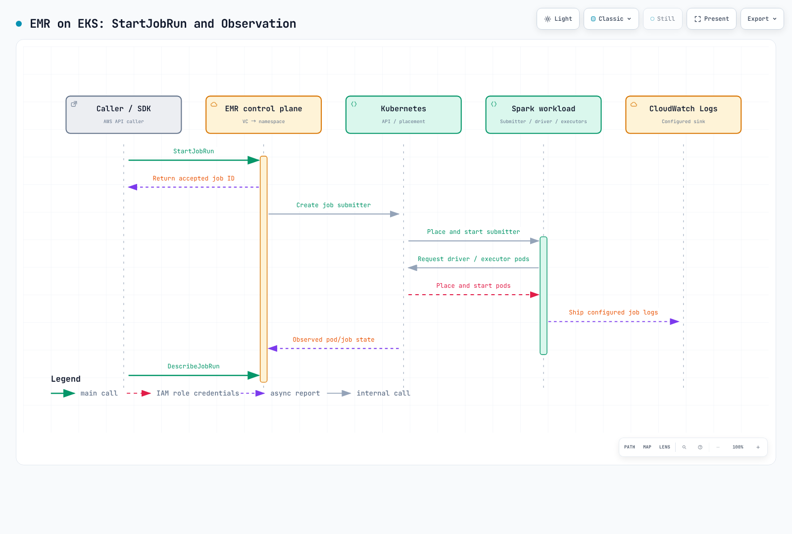

# Part 3: Amazon EMR on EKS

> **Last reviewed**: September 12, 2026 · API example: `emr-spark-8.0.0-20260421`

## Runtime and submission paths

EMR on EKS adds an AWS-curated Spark runtime and submission services to existing
EKS infrastructure. You still operate EKS capacity, networking, storage and nodes.
Distinguish the following paths:

| Path | Submission and lifecycle | What you manage |
| --- | --- | --- |
| StartJobRun | AWS API with an EMR virtual cluster ID and execution role | EMR job status, permissions and logging configuration |
| EMR runtime + Spark Operator | SparkApplication CR submitted to the installed EMR operator | Helm/CRDs, controller, Kubernetes RBAC and CR lifecycle |
| Direct spark-submit | Spark submits to the Kubernetes API | Submitter, Spark configuration, status and reruns |

Spark Operator support since EMR 6.10.0 does **not** mean StartJobRun has an option
to delegate internally to that operator. The documented operator path installs it
separately and uses kubectl apply. Do not assume those CR applications automatically
receive StartJobRun IDs or become managed by the EMR job API. You can combine the
EMR runtime with CR-based operations, but submission, observation and retries follow
the chosen path. The EMR chart is also distinct from Part 2's current upstream charts.

## Current releases and reproducibility

| EMR on EKS release | Spark runtime |
| --- | --- |
| emr-7.13.0 | 3.5.6-amzn-2 |
| emr-spark-8.0.0 | 4.0.2-amzn-0; Spark 4.x GA, released April 2026 |

Spark 4 is already available. The 8.0.0 number names an EMR runtime release, not
Apache Spark 8. Check versions and capabilities separately for other EMR deployment
options. A `-latest` alias follows security updates; it does not pin identical
image bytes. Dated suffixes aid reproducibility, but still require update review.
The dated example below is a reproducibility baseline, not a claim of the latest
security patch level.

## Prepare the environment

Use a supported EKS release, compatible kubectl and current AWS CLI v2 rather than
an old blanket recommendation of Kubernetes 1.30. The Pod Identity CLI helper needs
2.24.0 or later. Have an administrator prepare:

1. The `emr-spark` namespace, node capacity/networking, quotas and admission policies.
2. The EMR service-linked role and EKS API access. Use Access Entry integration for
   new virtual clusters. The documented CAM procedure shows API_AND_CONFIG_MAP;
   inspect the current mode and do not attempt to downgrade an API-only cluster.
   Existing virtual clusters are not automatically migrated.
3. The `docs-emr-job` execution role: read the script object below and grant only
   required data/KMS and CloudWatch log group/stream permissions.
4. An existing S3 artifact bucket and `/emr-containers/docs-spark` log group with a
   retention policy. Uploader and job execution permissions are separate.
5. Caller permissions to start, inspect and cancel jobs with allowed execution roles.
   Restrict roles using `emr-containers:ExecutionRoleArn`. For Pod Identity,
   scope PassRole to the selected role and `pods.eks.amazonaws.com`.

A virtual cluster registers an EKS namespace; it does not create compute capacity.
However, registration can create the initial service-linked role and configure CAM
access entries/policies. “Registration changes no resources or permissions” is too
broad. Namespaces also need RBAC, network and pod-security controls for isolation.

## Execution role: IRSA or Pod Identity

IRSA needs the cluster's IAM OIDC provider and trust scoped to the audience,
namespace and EMR-managed service-account identity. update-role-trust-policy
changes this trust; it does not grant data permissions or caller permissions.

StartJobRun also supports **EKS Pod Identity from EMR 7.3.0**. Prepare the Agent,
node EKS Auth permissions, sts:AssumeRole/sts:TagSession trust for
`pods.eks.amazonaws.com`, and EMR service-account associations. The helper prepares
three associations for submitter, driver and executor. An IRSA annotation does not
replace these associations.

Replace the cluster/role/namespace values and execute **only the selected path**.
These helpers change IAM/EKS configuration.

```bash
# Option A: IRSA, after creating the cluster IAM OIDC provider and job role.
aws emr-containers update-role-trust-policy \
  --region "$AWS_REGION" \
  --cluster-name my-eks-cluster --namespace emr-spark --role-name docs-emr-job

# Option B: Pod Identity, after configuring the agent/node permissions and job-role trust.
# Choose the appropriate path; these are not two mandatory consecutive steps.
aws emr-containers create-role-associations \
  --region "$AWS_REGION" \
  --cluster-name my-eks-cluster --namespace emr-spark --role-name docs-emr-job
```

## Register a virtual cluster

Save as create-virtual-cluster.json and replace the example names.

```json
{
  "name": "docs-spark-vc",
  "containerProvider": {
    "id": "my-eks-cluster",
    "type": "EKS",
    "info": {
      "eksInfo": {
        "namespace": "emr-spark"
      }
    }
  }
}
```

Current service documentation also defines schedulerConfiguration with
maxConcurrentJobRuns and maxInQueueJobRuns. The AWS CLI 2.35.11 service model used
for this review lacks that field, so it is omitted from this baseline example.
Verify CLI/SDK support before using it. Job-count limits do not replace CPU/memory
quotas or executor caps.

```bash
# Replace the cluster/name/namespace in create-virtual-cluster.json first.
: "${AWS_REGION:?Set the region of the EKS cluster}"
aws emr-containers create-virtual-cluster \
  --region "$AWS_REGION" \
  --cli-input-json file://create-virtual-cluster.json \
  --query id --output text
# Copy the returned id into start-job-run.json; verify state before submitting.
: "${EMR_VIRTUAL_CLUSTER_ID:?Set the returned virtual cluster ID}"
aws emr-containers describe-virtual-cluster \
  --region "$AWS_REGION" --id "$EMR_VIRTUAL_CLUSTER_ID" \
  --query 'virtualCluster.{state:state,provider:containerProvider}'
```

CreateVirtualCluster returns **id**. Use it as virtualClusterId in StartJobRun and
verify RUNNING state and the target namespace.

## Submit a smoke job

Save as smoke.py. It checks rows=10 and total=45 without modifying an external dataset.

```python
from pyspark.sql import SparkSession
from pyspark.sql import functions as F

spark = SparkSession.builder.appName("docs-emr-smoke").getOrCreate()
try:
    result = spark.range(10).agg(F.count("*").alias("rows"), F.sum("id").alias("total")).first()
    if result.rows != 10 or result.total != 45:
        raise RuntimeError(f"Unexpected result: {result}")
    print("SMOKE_OK rows=10 total=45")
finally:
    spark.stop()
```

Save as start-job-run.json and replace the virtualClusterId, account, role and
bucket. Prepare script-read and log-group access before submission.

```json
{
  "name": "docs-spark-smoke",
  "virtualClusterId": "abcd1234efgh5678ijkl9012mnop",
  "executionRoleArn": "arn:aws:iam::111122223333:role/docs-emr-job",
  "releaseLabel": "emr-spark-8.0.0-20260421",
  "jobDriver": {
    "sparkSubmitJobDriver": {
      "entryPoint": "s3://my-existing-artifact-bucket/docs-emr/smoke.py",
      "sparkSubmitParameters": "--conf spark.executor.instances=2 --conf spark.executor.cores=1 --conf spark.executor.memory=1g --conf spark.driver.cores=1 --conf spark.driver.memory=1g"
    }
  },
  "configurationOverrides": {
    "monitoringConfiguration": {
      "cloudWatchMonitoringConfiguration": {
        "logGroupName": "/emr-containers/docs-spark",
        "logStreamNamePrefix": "smoke"
      }
    }
  }
}
```

```bash
# Replace the bucket in this command and start-job-run.json with the same existing bucket.
aws s3 cp smoke.py s3://my-existing-artifact-bucket/docs-emr/smoke.py \
  --region "$AWS_REGION"

# Keep this token for retries of the same request. Use a new token for a new intended run.
EMR_REQUEST_TOKEN="$(python3 -c 'import uuid; print(uuid.uuid4())')"
aws emr-containers start-job-run \
  --region "$AWS_REGION" \
  --cli-input-json file://start-job-run.json \
  --client-token "$EMR_REQUEST_TOKEN" --query id --output text

: "${EMR_JOB_ID:?Set the returned job ID}"
aws emr-containers describe-job-run \
  --region "$AWS_REGION" --virtual-cluster-id "$EMR_VIRTUAL_CLUSTER_ID" \
  --id "$EMR_JOB_ID" --query 'jobRun.{state:state,details:stateDetails,reason:failureReason}'
```

An accepted API response is not job completion. Check final COMPLETED state and
SMOKE_OK rows=10 total=45 in driver logs. A request token deduplicates the API request;
it does not make external side effects exactly-once across application retries.
Inspect stateDetails, failureReason and submitter/driver/executor logs on failure.



[Interactive diagram](https://www.atomai.click/kubernetes-docs/archmaps/en-data-on-eks-spark-03-emr-on-eks-0.html)

## Pod configuration, observation and interactive development

EMR pods are visible through kubectl in their namespace. Supported pod templates and
custom-image paths allow customization; “you can never author pod configuration” is
incorrect. Do not override StartJobRun-managed namespace, service-account or pod-name
settings arbitrarily. Follow the release/submission-specific supported fields and
custom-image validation procedure.

CloudWatch logs need monitoringConfiguration and execution-role permissions.
Distinguish job-state metrics from complete Spark executor telemetry. Step Functions
supports StartJobRun request/response and .sync integration, but needs a configured
state machine and role. EventBridge job events also need rules, targets and failure
handling. Availability of an integration does not enable all collection or automation.

EMR Studio connects to an **interactive endpoint created with CreateManagedEndpoint**.
Jupyter Enterprise Gateway manages kernel lifecycles, with private-subnet, ALB
controller, network and role prerequisites. Notebook cells are not simply ordinary
StartJobRun batch calls. Users/kernels sharing an endpoint use its execution role;
review access boundaries and separate endpoints where needed. Endpoints and kernels
incur costs, unlike merely registering the virtual cluster.

## Choosing and cleaning up

Choose StartJobRun for an AWS API submission lifecycle and assess a suitable operator
for CR-based operations. Compare required upstream versions/plugins, portability,
measured performance and total cost. EMR does not remove EKS/compute, storage and
logging costs or infrastructure responsibility.

Virtual-cluster deletion is not a universal cleanup command for jobs, data and roles.
Inspect active jobs/endpoints and clean up the intended resources separately.

```bash
# Inspect active work/endpoints before cleanup.
aws emr-containers list-job-runs \
  --region "$AWS_REGION" --virtual-cluster-id "$EMR_VIRTUAL_CLUSTER_ID"
aws emr-containers list-managed-endpoints \
  --region "$AWS_REGION" --virtual-cluster-id "$EMR_VIRTUAL_CLUSTER_ID"
# If this demo job is still active and should stop:
aws emr-containers cancel-job-run \
  --region "$AWS_REGION" --virtual-cluster-id "$EMR_VIRTUAL_CLUSTER_ID" --id "$EMR_JOB_ID"
# After reviewing/cleaning the relevant jobs and any managed endpoints:
aws emr-containers delete-virtual-cluster \
  --region "$AWS_REGION" --id "$EMR_VIRTUAL_CLUSTER_ID"
aws emr-containers describe-virtual-cluster \
  --region "$AWS_REGION" --id "$EMR_VIRTUAL_CLUSTER_ID" --query virtualCluster.state
```

Observe asynchronous deletion state; permission failures can produce ARRESTED.
Review the namespace, EKS cluster, S3 artifacts, log group, IAM role and Pod Identity
associations separately. Associations can remain after namespace/SA deletion; remove
only those no longer used. Do not remove shared resources for this demo.

Examples are checked for local CLI input shape and syntax. This is not a completed
AWS deployment or EMR runtime test. Validate permissions, quotas, networking and
release availability in the target environment.


- [EMR on EKS release labels](https://docs.aws.amazon.com/emr/latest/EMR-on-EKS-DevelopmentGuide/emr-eks-releases.html)
- [EMR Spark 8.0.0 on EKS release notes](https://docs.aws.amazon.com/emr/latest/EMR-on-EKS-DevelopmentGuide/emr-eks-spark-8.0.0.html)
- [EKS cluster access setup](https://docs.aws.amazon.com/emr/latest/EMR-on-EKS-DevelopmentGuide/setting-up-cluster-access.html)
- [Job execution role and execution-role condition](https://docs.aws.amazon.com/emr/latest/EMR-on-EKS-DevelopmentGuide/iam-execution-role.html)
- [Pod Identity setup for StartJobRun](https://docs.aws.amazon.com/emr/latest/EMR-on-EKS-DevelopmentGuide/setting-up-enable-IAM.html)
- [Virtual clusters and scheduler limits](https://docs.aws.amazon.com/emr/latest/EMR-on-EKS-DevelopmentGuide/virtual-cluster.html)
- [StartJobRun API](https://docs.aws.amazon.com/emr-on-eks/latest/APIReference/API_StartJobRun.html)
- [EMR Spark Operator installation and CR submission](https://docs.aws.amazon.com/emr/latest/EMR-on-EKS-DevelopmentGuide/spark-operator-gs.html)
- [Interactive endpoint architecture](https://docs.aws.amazon.com/emr/latest/EMR-on-EKS-DevelopmentGuide/how-it-works.html)
- [Custom images](https://docs.aws.amazon.com/emr/latest/EMR-on-EKS-DevelopmentGuide/docker-custom-images.html)
- [CloudWatch logging configuration](https://docs.aws.amazon.com/emr/latest/EMR-on-EKS-DevelopmentGuide/emr-eks-jobs-cloudwatch.html)

## Next steps

[Part 4: Performance tuning](./04-performance-tuning.md)

[README](./README.md)

[Quiz](../../quizzes/data-on-eks/spark/03-emr-on-eks-quiz.md)
