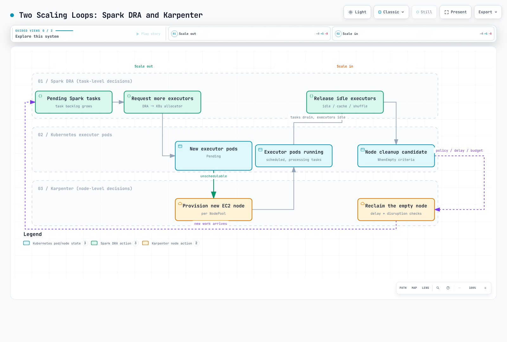

# Part 4: Performance and Cost Tuning

> **Review baseline**: September 12, 2026 · upstream Spark 4.2.0 · Karpenter 1.14

## Scope and measurement

This chapter uses Part 1's direct spark-submit path. Spark 4.2 requires Kubernetes
1.34+; also check EKS, kubectl and Karpenter compatibility. Part 2's operators and
Part 3's EMR have different submission and pod-customization paths. Do not copy
all settings across them without review. Values below are small starting points,
not measured performance optima.

**metrics-server is not required for Karpenter's pending-pod provisioning.**
Karpenter uses pod requests and scheduling constraints. metrics-server helps with
usage observation and consumers such as kubectl top/HPA; it does not supply Spark
task backlog or directly provision EC2.

Measure stage/task time, spill, shuffle fetch wait, skew, GC and executor loss in
Spark UI/event logs alongside node CPU, memory, disk and network limits. Confirm
the bottleneck before assuming R-series or NVMe is always faster. Review AQE,
partitioning, join strategy and data format, changing one factor at a time.

## 1. Choose nodes and instance storage

Older R5d/R5ad/R5dn examples are a subset of available choices. Compare M/C/R/I
families according to CPU, memory, disk and network demands, current AZ capacity
and total cost. R-series is not universally best for shuffle, and C-series is not
inherently unsuitable for Spark.

Graviton is a valid Spark evaluation option. A tested multi-architecture image may
already be available; building your own image is not always necessary. Check arm64
support for JNI, codecs, BLAS, Python wheels and custom plugins. The example below
selects amd64 for one consistent path, without claiming it is faster.

**Nitro/NVMe does not identify a disk as instance store.** EBS is also exposed as
NVMe on Nitro. An unmounted disk is not necessarily empty or safe to format.
The old loop that formatted unmounted NVMe devices could misidentify EBS/root
devices and has been removed.

## 2. Managed scratch storage on AL2023

Before this lab, have an administrator prepare two EC2NodeClasses:

- `spark-general`: a reviewed general node configuration for drivers.
- `spark-nvme`: a new executor-specific class with a **pinned AL2023 AMI** matching
  the Kubernetes release/architecture, and appropriate IAM/subnet/security-group settings.

Include this field in the complete spark-nvme configuration. It is a **fragment**,
not a standalone kubectl apply resource. Changing an existing NodeClass can cause
drift and node replacement; do not improvise disk formatting on running nodes.

```yaml
spec:
  instanceStorePolicy: RAID0
```

For AL2023, Karpenter configures instance-store RAID0 through NodeConfig and uses
it for kubelet/containerd ephemeral storage, including node allocatable capacity.
This avoids pinning /dev/nvme1n1 or requiring hostPath. Follow the documented
procedure for other AMI families or custom bootstrap.

Instance store is transient scratch that can be lost on stop, termination or
failure. RAID0 is not replication or backup. Although there is no separate EBS
volume charge, instance pricing, idle capacity and recomputation still cost money.
Properly sized EBS is also an option; consider both volume and instance throughput
limits. Do not assume every EKS node has a 20GB root volume or the same backing filesystem.

## 3. Place drivers on On-Demand and executors on Spot

On-Demand reduces driver exposure to Spot reclamation, but not failures,
maintenance or Karpenter drift/expiration. Driver SparkContext/coordination state
matters in both cluster and client modes. Design job reruns and data recovery separately.

Save the following as nodepools.yaml, referencing the two prepared NodeClasses.
Executors require instance-store capacity. This is Spot-only: insufficient Spot
capacity can leave pods Pending, with no automatic On-Demand fallback. Design an
explicit fallback policy and cost bounds if needed.

```yaml
apiVersion: karpenter.sh/v1
kind: NodePool
metadata:
  name: spark-driver
spec:
  template:
    metadata:
      labels:
        workload-pool: spark-driver
    spec:
      requirements:
      - key: kubernetes.io/arch
        operator: In
        values:
        - amd64
      - key: kubernetes.io/os
        operator: In
        values:
        - linux
      - key: karpenter.sh/capacity-type
        operator: In
        values:
        - on-demand
      - key: karpenter.k8s.aws/instance-category
        operator: In
        values:
        - m
        - r
      - key: karpenter.k8s.aws/instance-generation
        operator: Gt
        values:
        - '5'
      taints:
      - key: spark-role
        value: driver
        effect: NoSchedule
      nodeClassRef:
        group: karpenter.k8s.aws
        kind: EC2NodeClass
        name: spark-general
  limits:
    cpu: '64'
    memory: 512Gi
  disruption:
    consolidationPolicy: WhenEmpty
    consolidateAfter: 120s
---
apiVersion: karpenter.sh/v1
kind: NodePool
metadata:
  name: spark-executor
spec:
  template:
    metadata:
      labels:
        workload-pool: spark-executor
    spec:
      requirements:
      - key: kubernetes.io/arch
        operator: In
        values:
        - amd64
      - key: kubernetes.io/os
        operator: In
        values:
        - linux
      - key: karpenter.sh/capacity-type
        operator: In
        values:
        - spot
      - key: karpenter.k8s.aws/instance-category
        operator: In
        values:
        - m
        - r
        - i
      - key: karpenter.k8s.aws/instance-generation
        operator: Gt
        values:
        - '5'
      - key: karpenter.k8s.aws/instance-local-nvme
        operator: Gt
        values:
        - '0'
      taints:
      - key: spark-role
        value: executor
        effect: NoSchedule
      nodeClassRef:
        group: karpenter.k8s.aws
        kind: EC2NodeClass
        name: spark-nvme
  limits:
    cpu: '256'
    memory: 2048Gi
  disruption:
    consolidationPolicy: WhenEmpty
    consolidateAfter: 120s
```

Pool labels/selectors choose a target; tolerations allow its taints. A toleration
does not force placement, and other pods may also have it. NoSchedule does not evict
already-running pods. NodePool limits are eventually consistent capacity guardrails
that may briefly overrun during concurrent scale-out, not exact spending caps.

Save as driver-template.yaml. It is a **Spark pod template**, completed by Spark,
not a standalone pod deployment.

```yaml
apiVersion: v1
kind: Pod
spec:
  securityContext:
    runAsNonRoot: true
    runAsUser: 185
    fsGroup: 185
  tolerations:
  - key: spark-role
    operator: Equal
    value: driver
    effect: NoSchedule
  containers:
  - name: spark-kubernetes-driver
    securityContext:
      allowPrivilegeEscalation: false
      capabilities:
        drop:
        - ALL
      seccompProfile:
        type: RuntimeDefault
    resources:
      requests:
        ephemeral-storage: 2Gi
      limits:
        ephemeral-storage: 4Gi
```

Save as executor-template.yaml.

```yaml
apiVersion: v1
kind: Pod
spec:
  securityContext:
    runAsNonRoot: true
    runAsUser: 185
    fsGroup: 185
  tolerations:
  - key: spark-role
    operator: Equal
    value: executor
    effect: NoSchedule
  containers:
  - name: spark-kubernetes-executor
    securityContext:
      allowPrivilegeEscalation: false
      capabilities:
        drop:
        - ALL
      seccompProfile:
        type: RuntimeDefault
    resources:
      requests:
        ephemeral-storage: 10Gi
      limits:
        ephemeral-storage: 20Gi
    volumeMounts:
    - name: spark-local-dir-scratch
      mountPath: /var/data/spark-local
  automountServiceAccountToken: false
  volumes:
  - name: spark-local-dir-scratch
    emptyDir:
      sizeLimit: 16Gi
```

This emptyDir uses the prepared NVMe-backed kubelet filesystem; another node
configuration could back it differently. The volume name must start with
`spark-local-dir-`, including the final hyphen and a suffix. The old name
`spark-local-dir` is not recognized and can cause an additional emptyDir mount
at the same path.

Setting only spark.local.dir can make Kubernetes Spark create an emptyDir there;
hostPath is not required. Recognized scratch mounts populate SPARK_LOCAL_DIRS.
sizeLimit is not reserved capacity: node disk exhaustion may occur first.
Observe requests/limits, logs, writable layers and disk pressure together.
tmpfs consumes RAM and needs memory budgeting.

## 4. Two scaling loops and termination

Save as performance.properties, reusing Part 1's namespace and RBAC.

```properties
spark.kubernetes.namespace=spark-jobs
spark.kubernetes.container.image=spark:4.2.0-scala2.13-java21-ubuntu
spark.kubernetes.authenticate.driver.serviceAccountName=spark-driver
spark.kubernetes.authenticate.executor.serviceAccountName=spark-executor
spark.kubernetes.driver.podTemplateFile=driver-template.yaml
spark.kubernetes.executor.podTemplateFile=executor-template.yaml
spark.kubernetes.driver.node.selector.workload-pool=spark-driver
spark.kubernetes.executor.node.selector.workload-pool=spark-executor
spark.kubernetes.driver.node.selector.karpenter.sh/capacity-type=on-demand
spark.kubernetes.executor.node.selector.karpenter.sh/capacity-type=spot
spark.driver.cores=1
spark.driver.memory=1g
spark.kubernetes.driver.limit.cores=1
spark.executor.cores=2
spark.executor.memory=4g
spark.kubernetes.executor.limit.cores=2
spark.executor.instances=2
spark.dynamicAllocation.enabled=true
spark.dynamicAllocation.shuffleTracking.enabled=true
spark.dynamicAllocation.minExecutors=1
spark.dynamicAllocation.initialExecutors=2
spark.dynamicAllocation.maxExecutors=10
spark.dynamicAllocation.executorIdleTimeout=60s
spark.kubernetes.allocation.batch.size=5
spark.kubernetes.allocation.batch.delay=1s
spark.decommission.enabled=true
spark.storage.decommission.enabled=true
spark.kubernetes.executor.terminationGracePeriodSeconds=120s
```

```bash
# Prerequisite: Part 1's spark-jobs namespace and driver/executor RBAC.
# All template/property files below must be present in the submitter's working directory.
K8S_API_SERVER="$(kubectl config view --minify -o jsonpath='{.clusters[0].cluster.server}')"
: "${K8S_API_SERVER:?Select the intended Kubernetes context first}"
spark-submit \
  --master "k8s://${K8S_API_SERVER}" --deploy-mode cluster \
  --name spark-performance-smoke \
  --properties-file performance.properties \
  --class org.apache.spark.examples.SparkPi \
  local:///opt/spark/examples/jars/spark-examples.jar 10
```

Spark DRA adjusts executor count from task backlog and idle/cache/shuffle state.
spark.kubernetes.allocation.batch.size and batch.delay control Kubernetes allocator
pod creation rate; they are not exclusive to DRA. Karpenter supplies capacity from
unschedulable pod requests and constraints. Image pulls, IP/quota/AZ shortages and
taint mismatches can also delay pods.

WhenEmpty with 120s is a conservative starting consolidation policy for ordinary
running Spark pods. Karpenter's definition of empty can include remaining pods
with no disruption cost, such as DaemonSets. Also inspect other ordinary workloads
before treating an executor-only node as empty.

consolidateAfter > executorIdleTimeout does not guarantee DRA releases first.
The timers start from different events, and cached data/shuffle tracking can keep
executors longer. Drift, expiration and Spot interruption are separate from
consolidation. PDBs, do-not-disrupt and disruption budgets do not prevent Spot reclamation.



[Interactive diagram](https://www.atomai.click/kubernetes-docs/archmaps/en-data-on-eks-spark-04-performance-tuning-0.html)

### Actual decommission limits

Spot stop/terminate warnings normally arrive two minutes ahead, on a best-effort
basis. Hibernation starts immediately without that two-minute warning. Karpenter's
Spot handling needs EventBridge-to-SQS wiring, an interruption queue and permissions.
Spark flags alone do not receive AWS interruption notices.

As verified in Part 1, Spark 4.2's decommission flag injects the official image's
/opt/decom.sh preStop. Check the actual script, signal, pod grace and node drain
path. spark.kubernetes.executor.terminationGracePeriodSeconds=120s requests grace;
it does not guarantee remaining cloud lifetime or completed block migration.
Overriding lifecycle hooks can change that behavior.

Migration depends on peer capacity, network and time. Shuffle fallback requires an
explicit spark.storage.decommission.fallbackStorage.path plus working filesystem
and permissions. Arbitrary remote storage or a History Server is not automatic
fallback. RDD-cache and shuffle recovery also differ. Recomputation, repeated
losses, fetch/task retry limits or unreadable source data can fail the job;
executor loss is not guaranteed harmless.

## 5. Validate resources and cost

| Setting | Kubernetes effect |
| --- | --- |
| Driver/executor memory | Heap plus applicable overhead/other memory in request and limit |
| Driver/executor cores | Default CPU request and Spark role-specific concurrency; not an automatic CPU limit |
| spark.kubernetes.*.request.cores | Explicit CPU request, distinct from task-slot count |
| spark.kubernetes.*.limit.cores | Explicit CPU limit |
| Template ephemeral-storage | Scratch/log temporary-storage budget; backing storage depends on node setup |

A JVM executor with 4g heap and default 10% overhead adds 409MiB after integer
conversion, totaling 4505MiB. Account separately for PySpark, off-heap and explicit
overhead settings; 4g is not the entire pod memory. A driver need not always be
larger than an executor, and smaller executors are not universally better.

Compare cost per successful job and p95 completion time, including retries, idle
capacity, storage/network and logs, rather than only instance hourly price.
EMR runtime behavior such as executor preallocation can differ from upstream;
inspect the selected release's configuration.

Examples are checked against CRDs and native Spark feature-step construction.
This does not constitute EC2 provisioning, disk initialization, a Spot-interruption
test or a large shuffle-performance benchmark.


- [Karpenter instanceStorePolicy and AMI behavior](https://karpenter.sh/docs/concepts/nodeclasses/#specinstancestorepolicy)
- [Karpenter disruption and interruption handling](https://karpenter.sh/docs/concepts/disruption/)
- [Karpenter scheduling](https://karpenter.sh/docs/concepts/scheduling/)
- [EKS AL2023 instance-store setup implementation](https://github.com/awslabs/amazon-eks-ami/blob/main/templates/al2023/runtime/bin/setup-local-disks)
- [Spark 4.2 Kubernetes configuration](https://spark.apache.org/docs/4.2.0/running-on-kubernetes.html)
- [Spark local-directory feature implementation](https://github.com/apache/spark/blob/v4.2.0/resource-managers/kubernetes/core/src/main/scala/org/apache/spark/deploy/k8s/features/LocalDirsFeatureStep.scala)
- [Spark 4.2 configuration](https://spark.apache.org/docs/4.2.0/configuration.html)
- [Spot interruption notice limitations](https://docs.aws.amazon.com/AWSEC2/latest/UserGuide/spot-instance-termination-notices.html)
- [EMR-specific performance and storage guidance](https://docs.aws.amazon.com/emr/latest/EMR-on-EKS-DevelopmentGuide/best-practices.html)

[Part 5: Best practices](./05-best-practices.md)

[README](./README.md)

[Quiz](../../quizzes/data-on-eks/spark/04-performance-tuning-quiz.md)
