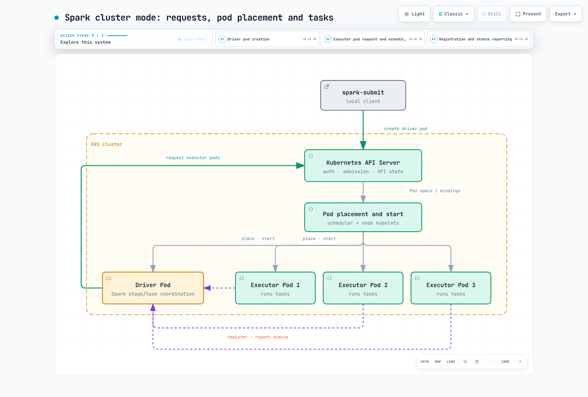

# Spark on EKS Deep Dive

> **Review baseline**: Apache Spark 4.2.0, Kubernetes 1.34 or later\
> **Last reviewed**: September 12, 2026

Apache Spark runs batch, SQL, streaming and other distributed data workloads.
Native Kubernetes support was introduced in Spark 2.3; client-mode support followed
in 2.4. Spark 4.2.0 documents Kubernetes **1.34+** as its prerequisite.
Use kubectl compatible with the actual EKS version rather than an old fixed minimum.

Spark can use the Kubernetes capacity/control plane you already operate without a
separate Spark Standalone master or YARN ResourceManager. You still operate or
provision node capacity, images, identity, networking, storage and observability.
YARN ResourceManager/NodeManager are YARN components, not Spark-specific daemons.

## Execution responsibilities

In **cluster deploy mode**, the submitting client asks the Kubernetes API to create
the driver pod. Kubernetes admission, scheduling and node kubelets handle pod
placement/startup. The Spark driver requests executor pods and coordinates Spark
stages/tasks; it does not replace the Kubernetes scheduler.

Executors register and communicate directly with the driver for Spark work.
Kubernetes continues to manage their pod lifecycle. In **client mode**, the driver
runs with the submitting application, either in a pod or on another host; it must
be reachable from executors. Both modes support Spark applications.

[Interactive diagram](https://www.atomai.click/kubernetes-docs/archmaps/en-data-on-eks-spark-readme-0.html)

## Chapters

1. [Spark on Kubernetes fundamentals](01-spark-fundamentals.md): cluster/client
   submission, resource mapping, dynamic allocation and decommissioning conditions.
2. [Spark Operator](02-spark-operator.md): distinguish the Apache and Kubeflow
   operators, their APIs, job lifecycle, submission and monitoring.
3. [EMR on EKS](03-emr-on-eks.md): virtual clusters, job submission and execution
   identities; distinguish managed runtime features from EKS capacity operations.
4. [Performance and cost](04-performance-tuning.md): shuffle/storage/CPU/memory
   bottlenecks, suitable node capabilities, Spot recovery, and executor versus node scaling.
5. [Best practices and security](05-best-practices.md): Kubernetes and AWS identity,
   data access, event logs/history, metrics, network policy and recovery.

Spark **dynamic resource allocation** adjusts executors within an application.
It is distinct from Kubernetes Dynamic Resource Allocation for devices and from
node autoscaling. Decommissioning can reduce recomputation, but cannot guarantee
that every block survives a forced termination.

## References

- [Spark 4.2.0 on Kubernetes](https://spark.apache.org/docs/4.2.0/running-on-kubernetes.html)
- [Spark 4.2.0 configuration](https://spark.apache.org/docs/4.2.0/configuration.html)
- [Spark 4.2.0 dynamic allocation alternatives](https://spark.apache.org/docs/4.2.0/job-scheduling.html#dynamic-resource-allocation)
- [Driver resource mapping](https://github.com/apache/spark/blob/v4.2.0/resource-managers/kubernetes/core/src/main/scala/org/apache/spark/deploy/k8s/features/BasicDriverFeatureStep.scala)
- [Executor resources and decommission hook](https://github.com/apache/spark/blob/v4.2.0/resource-managers/kubernetes/core/src/main/scala/org/apache/spark/deploy/k8s/features/BasicExecutorFeatureStep.scala)
- [Official decommission script](https://github.com/apache/spark/blob/v4.2.0/resource-managers/kubernetes/docker/src/main/dockerfiles/spark/decom.sh)
- [Official Spark image tags](https://github.com/docker-library/official-images/blob/master/library/spark)

- [Apache Spark Kubernetes Operator](https://github.com/apache/spark-kubernetes-operator)
- [Kubeflow Spark Operator](https://github.com/kubeflow/spark-operator)
- [EMR on EKS concepts](https://docs.aws.amazon.com/emr/latest/EMR-on-EKS-DevelopmentGuide/emr-eks-concepts.html)

## Quiz

[Spark fundamentals quiz](../../quizzes/data-on-eks/spark/01-spark-fundamentals-quiz.md)
