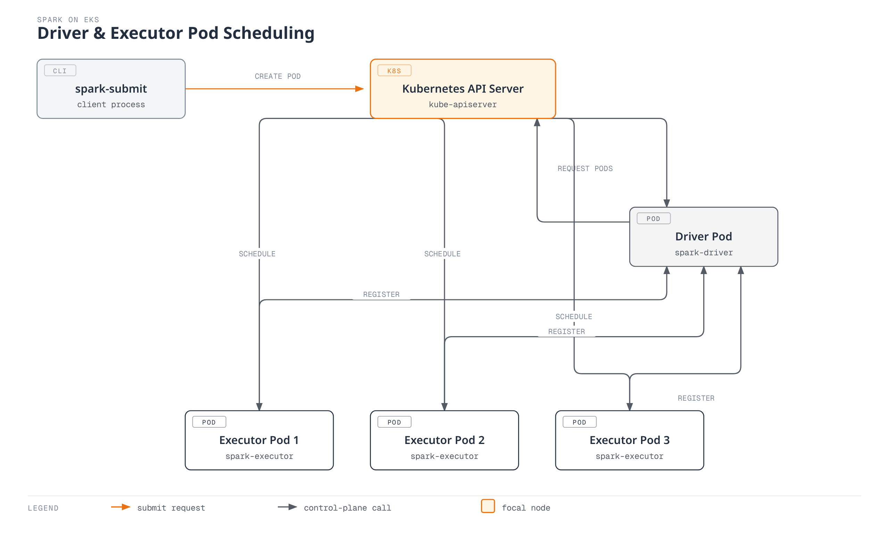

# Spark on EKS Deep Dive

## Overview

Apache Spark is the workhorse for large-scale batch ETL, SQL analytics, and streaming workloads, and Kubernetes has been a first-class Spark cluster manager since Spark 2.3 — alongside Standalone and YARN. On EKS, running Spark means the same Kubernetes API server that schedules every other workload also schedules Spark's driver and executor pods, with no separate Spark cluster infrastructure to stand up or maintain. Teams typically reach this either by calling `spark-submit` directly, by wrapping jobs in a Kubernetes-native **Spark Operator** CRD, or by running on **Amazon EMR on EKS**, AWS's managed Spark runtime that layers on top of an existing EKS cluster.

> **Supported Versions**: Apache Spark 4.2, Kubernetes 1.30+
> **Last Updated**: July 15, 2026

## Core Architecture Concepts

Unlike YARN, Spark on Kubernetes has no persistent cluster-manager daemons — there's no ResourceManager or NodeManager running around the clock waiting for work. Instead, `spark-submit` talks directly to the Kubernetes API server and creates a single **driver pod**. That driver pod is the cluster manager for the duration of the job: once it starts running, it calls back into the Kubernetes API itself to create and manage the **executor pods** it needs, based on `spark.executor.instances` or Dynamic Resource Allocation. Executors register with the driver, receive tasks, and report status and results back — all over a direct driver-to-executor connection, with Kubernetes only involved in pod scheduling and lifecycle, not task coordination.

## Deep Dive Table of Contents

**[1. Spark on Kubernetes Fundamentals](01-spark-fundamentals.md)**
- Cluster-mode-only `spark-submit`: how the driver pod creates and manages its own executor pods
- Dynamic Resource Allocation (DRA) on Kubernetes — and why there's no External Shuffle Service to fall back on
- Graceful executor decommissioning when a pod is about to terminate

**[2. Spark Operator](02-spark-operator.md)**
- `apache/spark-kubernetes-operator` vs. `kubeflow/spark-operator` — governance, maturity, and which one fits your cluster
- The `SparkApplication` CRD and lifecycle management (`restartPolicy`, status reporting)
- The mutating admission webhook that injects driver/executor pod customizations
- Monitoring hook-in and EKS deployment considerations

**[3. Amazon EMR on EKS](03-emr-on-eks.md)**
- Virtual clusters: registering an EKS namespace with the EMR control plane
- The `StartJobRun` API vs. `kubectl apply`-based submission
- Job execution IAM roles and onboarding them to a virtual cluster
- EMR on EKS vs. the self-managed Spark Operator — when to use which

**[4. Performance and Cost Tuning](04-performance-tuning.md)**
- Node type selection for shuffle-heavy jobs: R-series instances with local NVMe instance store
- Spot Instances for executors, paired with graceful decommissioning to avoid losing job progress
- Karpenter and Dynamic Resource Allocation as two coupled — but independent — scaling loops
- Driver/executor resource sizing and cost optimization

**[5. Best Practices and Security](05-best-practices.md)**
- Secure, credential-free S3 access with IRSA
- Monitoring with the native `PrometheusServlet` vs. the JMX Prometheus Exporter, plus the Spark History Server
- Security hardening beyond IAM/IRSA (RBAC, network policy)
- A production-readiness checklist

## References

- [Running Spark on Kubernetes (Apache Spark Documentation)](https://spark.apache.org/docs/latest/running-on-kubernetes.html)
- [apache/spark-kubernetes-operator](https://github.com/apache/spark-kubernetes-operator)
- [kubeflow/spark-operator](https://github.com/kubeflow/spark-operator)
- [Amazon EMR on EKS Concepts](https://docs.aws.amazon.com/emr/latest/EMR-on-EKS-DevelopmentGuide/emr-eks-concepts.html)
- [Best Practices for Running Spark on Amazon EKS](https://aws.amazon.com/blogs/containers/best-practices-for-running-spark-on-amazon-eks/)
- [AWS Data on EKS Project](https://awslabs.github.io/data-on-eks/)

## Quiz

To test what you've learned in this section, try the [Spark Fundamentals Quiz](../../quizzes/data-on-eks/spark/01-spark-fundamentals-quiz.md).
