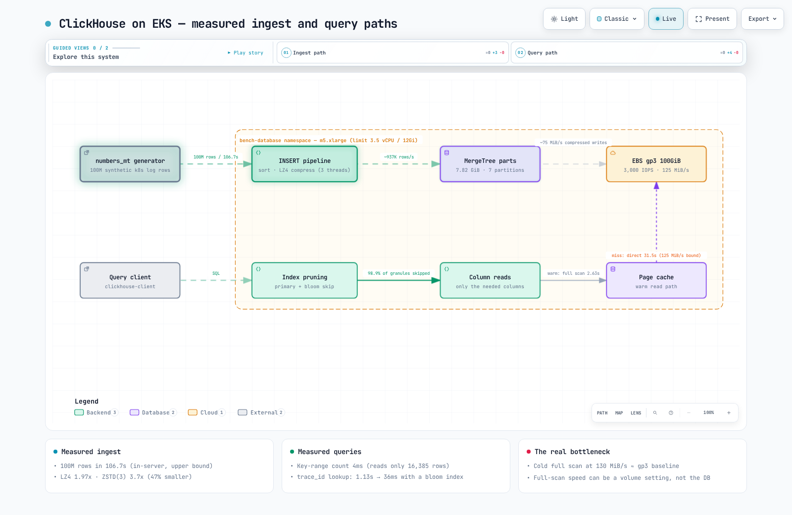

# ClickHouse on EKS Measured Benchmark

> **Supported Versions**: ClickHouse 24.8 (as measured — the 24.x series is now end-of-life, see the version note under Test environment), Kubernetes 1.36 (Amazon EKS)
> **Last Updated**: September 2, 2026

Every benchmark report says "ClickHouse is fast" — but it's surprisingly hard to find numbers measured on **an ordinary EKS node with a default gp3 volume**. This document loads 100 million Kubernetes log rows into a deliberately modest environment — a 4 vCPU node and a default-configuration gp3 100 GiB volume — and measures what happens. Every number here is reproducible with the manifests and queries in this document.



[🔍 Open the interactive diagram](https://www.atomai.click/kubernetes-docs/archmaps/en-database-01-clickhouse-on-eks-0.html)

## TL;DR — measured results

| Measurement | Result |
|-------------|--------|
| Ingest (in-server generate + insert) | 100M rows / 106.7 s = **~940K rows/s** |
| Storage size (LZ4 default) | 15.37 GiB → **7.82 GiB (1.97×)** |
| Storage size (ZSTD(3)) | 15.37 GiB → **4.16 GiB (3.7×)**, 47% smaller than LZ4 |
| ORDER BY key-range count (1-hour window) | **4 ms** — counts 59,916 rows while reading only 16,385 of 100M |
| Error top-10 GROUP BY (2-day window) | **0.36 s** (28M rows scanned) |
| `LIKE '%timeout%'` full scan | warm cache **2.63 s** / direct-to-disk **31.5 s** (12×) |
| trace_id point lookup | full scan 1.13 s → **0.036 s with a bloom filter index (31×)** |

## Test environment

| Item | Value |
|------|-------|
| Cluster | Amazon EKS, Kubernetes 1.36, ap-northeast-2 |
| Node | **m5.xlarge** (4 vCPU, 16 GiB) — one dedicated node provisioned by Karpenter (benchmark pod ran alone on it) |
| Pod resources | requests 2.5 vCPU / 9 Gi, limits 3.5 vCPU / 12 Gi |
| Storage | EBS **gp3 100 GiB, default settings** (3,000 IOPS / 125 MiB/s baseline), EBS CSI driver |
| ClickHouse | official image `clickhouse/clickhouse-server:24.8` (24.8.14.39), default configuration |
| Hourly cost | m5.xlarge on-demand $0.236/h + gp3 100 GiB at $0.0912/GB-month (Seoul region, queried via the Pricing API, 2026-09) |

> **Version note.** 24.8 was the LTS release the measurement was taken on, but ClickHouse's [security policy](https://github.com/ClickHouse/ClickHouse/blob/master/SECURITY.md) no longer lists any 24.x release as supported (as of September 2026 the supported lines are 26.8, 26.7, 26.6, and the 26.3 LTS). Use a current LTS tag for anything new. The mechanisms measured below — primary-key pruning, LZ4/ZSTD codecs, bloom filter skip indexes — are all present in current releases, but re-run the numbers on the version you deploy before using them for sizing.

The environment is intentionally unglamorous. The question this benchmark asks is not "how fast is ClickHouse on a dedicated i-family NVMe box" but "how far do you get on the kind of general-purpose node and default gp3 volume your cluster already has."

### Deployment manifest

```yaml
apiVersion: v1
kind: PersistentVolumeClaim
metadata:
  name: clickhouse-data
  namespace: bench-database
spec:
  accessModes: ["ReadWriteOnce"]
  storageClassName: gp3
  resources:
    requests:
      storage: 100Gi
---
apiVersion: v1
kind: Pod
metadata:
  name: clickhouse
  namespace: bench-database
spec:
  nodeSelector:
    node.kubernetes.io/instance-type: m5.xlarge
  containers:
    - name: clickhouse
      image: clickhouse/clickhouse-server:24.8   # as measured; pick a current LTS tag for new deployments
      resources:
        requests: { cpu: "2500m", memory: 9Gi }
        limits: { cpu: "3500m", memory: 12Gi }
      env:
        # Benchmark only: skips the image's default-user setup, so clickhouse-client inside the pod
        # connects without credentials. Set CLICKHOUSE_USER/CLICKHOUSE_PASSWORD in any real deployment.
        - name: CLICKHOUSE_SKIP_USER_SETUP
          value: "1"
      volumeMounts:
        - name: data
          mountPath: /var/lib/clickhouse
  volumes:
    - name: data
      persistentVolumeClaim:
        claimName: clickhouse-data
```

> In production you would deploy a `ClickHouseInstallation` via the [Altinity clickhouse-operator](https://github.com/Altinity/clickhouse-operator) rather than a bare Pod. A bare Pod keeps the measurement target simple here.

## The dataset — 100 million realistic Kubernetes log rows

Uniform random data (generateRandom) distorts compression ratios, so the rows are generated the way real logs look: **repeated templates plus variable fields** — 10 namespaces, one pod name per namespace (the pod suffix is hashed from the same bucket that picks the namespace, so there are only 10 distinct pod values — a simplification that matters for the compression numbers, see Measurement 2), a 0.8% ERROR rate, and timestamps spanning 7 days.

```sql
CREATE TABLE logs
(
  timestamp   DateTime64(3),
  namespace   LowCardinality(String),
  pod         String,
  container   LowCardinality(String),
  level       LowCardinality(String),
  message     String,
  trace_id    String,
  duration_ms Float32
)
ENGINE = MergeTree
PARTITION BY toDate(timestamp)
ORDER BY (namespace, timestamp);
```

```sql
INSERT INTO logs (timestamp, namespace, pod, container, level, trace_id, duration_ms, message)
WITH
  ['payment','order','user','search','catalog','cart','shipping','auth','gateway','recommend'] AS nss,
  ['GET /api/v1/orders','POST /api/v1/payments','GET /api/v1/users','GET /api/v1/search',
   'POST /api/v1/cart/items','GET /api/v1/products','POST /api/v1/shipments','POST /oauth/token',
   'GET /healthz','GET /api/v1/recommendations'] AS eps
SELECT
  toDateTime64('2026-08-25 00:00:00', 3) + toIntervalMillisecond(number * 6) AS timestamp,
  nss[(cityHash64(number) % 10) + 1] AS namespace,
  concat(namespace, '-7c7dd4f9c-', substring(lower(hex(sipHash64(cityHash64(number) % 10))), 1, 5)) AS pod,
  if(cityHash64(number + 2) % 10 < 8, 'app', 'istio-proxy') AS container,
  multiIf(cityHash64(number + 3) % 1000 < 8, 'ERROR',
          cityHash64(number + 3) % 1000 < 50, 'WARN',
          cityHash64(number + 3) % 1000 < 300, 'DEBUG', 'INFO') AS level,
  lower(hex(sipHash128(number))) AS trace_id,
  round(if(level = 'ERROR', 2000 + (cityHash64(number + 4) % 30000) / 10,
           (cityHash64(number + 4) % 20000) / 100), 1) AS duration_ms,
  multiIf(
    level = 'ERROR', concat('upstream request timeout after ', toString(round(duration_ms)),
                            'ms endpoint=', eps[(cityHash64(number + 5) % 10) + 1],
                            ' status=503 trace_id=', trace_id),
    concat(eps[(cityHash64(number + 5) % 10) + 1], ' completed status=200 in ',
           toString(duration_ms), 'ms trace_id=', trace_id)
  ) AS message
FROM numbers_mt(100000000)
SETTINGS max_threads = 3, max_insert_threads = 2, max_memory_usage = 9000000000;
```

## Measurement 1 — Ingest: 100M rows in 106.7 seconds

```text
Elapsed: 106.747 sec  →  ~936,800 rows/s, 7 daily partitions, 36 active parts
```

**Read this figure for what it is.** The rows were generated inside the server and inserted directly (INSERT…SELECT), so network transfer and text parsing costs are absent — it is an **upper bound**. Pushing TSV/Native data from outside will land lower, depending on client and format. The headline is still real: within a 3.5 vCPU limit, ClickHouse sorted, compressed, and wrote roughly 940K rows per second — on a 125 MiB/s default gp3 volume. Compression is what made that possible: only about 75 MiB/s actually had to reach the disk.

## Measurement 2 — Compression: which columns spend your money

Overall: 15.37 GiB → 7.82 GiB (**1.97×**, default LZ4). The per-column breakdown is far more interesting:

| Column | Compressed | Uncompressed | Ratio |
|--------|-----------|--------------|-------|
| message | 3.97 GiB | 8.75 GiB | 2.2× |
| **trace_id** | **3.08 GiB** | 3.07 GiB | **1.0× (incompressible)** |
| timestamp | 404.07 MiB | 762.94 MiB | 1.89× |
| duration_ms | 289.17 MiB | 381.47 MiB | 1.32× |
| level | 45.88 MiB | 95.72 MiB | 2.09× |
| container | 39.27 MiB | 95.72 MiB | 2.44× |
| pod | 9.32 MiB | 2.15 GiB | **236×** |
| namespace | 488.63 KiB | 95.72 MiB | **201×** |

Sizes and ratios are exactly as `system.parts_columns` reported them (`formatReadableSize` of the compressed/uncompressed byte sums); the ratios are computed from the raw byte counts, not from the rounded sizes.

Two lessons jump out:

1. **LowCardinality plus ORDER BY locality is enormous** — namespace is the first ORDER BY key, so identical values run in long streaks: 95.7 MiB collapses to 489 KiB. pod compresses 236× for the same reason, with a caveat: this generator emits exactly one pod name per namespace (10 distinct values), so pod behaves like a second copy of namespace. A real cluster, with tens of pods per namespace and new names on every restart, will compress pod noticeably less.
2. **High-entropy IDs eat 40% of your storage** — the 32-char hex trace_id doesn't compress at all (1.0×) and accounts for 3.08 GiB of the 7.82 GiB total (39%). When you design a log schema, "do we store IDs as strings" is the single biggest storage-cost lever. (A UUID type or FixedString(16) binary encoding halves it.)

### LZ4 vs ZSTD(3) — 47% storage vs 1.9× scans

The same data was re-inserted into a `CODEC(ZSTD(3))` table:

| | LZ4 (default) | ZSTD(3) |
|---|--------------|---------|
| Compressed size | 7.82 GiB (1.97×) | **4.16 GiB (3.7×)** |
| Re-compression insert (100M rows) | — | 120.0 s |
| `LIKE '%timeout%'` full scan (warm) | **2.63 s** | 4.9 s |

Storage drops 47%, but the CPU-bound full scan slows by 1.9×. The numbers explain the canonical log-workload recipe: **LZ4 for hot recent data, TTL-driven ZSTD recompression for old partitions**.

## Measurement 3 — Queries: what is fast, what is slow, and why

Each query ran after dropping the mark/uncompressed caches: ① once with `min_bytes_to_use_direct_io=1` to bypass the page cache (direct-to-disk), ② three warm runs (minimum reported).

| # | Query pattern | Direct-to-disk | Warm | Rows read (`read_rows`) |
|---|--------------|----------------|------|-----------|
| Q1 | `WHERE namespace='payment' AND timestamp BETWEEN …` (1-hour count) | 13 ms | **4 ms** | 16,385 (0.016%) — result 59,916 |
| Q2 | ERROR top-10 pods, 2-day GROUP BY | 0.57 s | **0.36 s** | 28M |
| Q3 | `message LIKE '%timeout%'` whole-range full scan | **31.5 s** | 2.63 s | 100M |
| Q4 | duration p50/p99 per namespace, whole range | 1.34 s | **1.03 s** | 100M (no filter) |
| Q5 | `trace_id = '…'` point lookup (no index) | 24.3 s | 1.13 s | 100M |

How to read this:

- **Why Q1 is 4 ms**: PARTITION BY (day) and ORDER BY (namespace, timestamp) line up, so the one-hour `payment` window is a single contiguous key range. The query counts 59,916 rows, yet `system.query_log` shows only 16,385 rows read: since 24.6 ClickHouse counts the granules that lie entirely inside a primary-key range straight from the index and decompresses only the partial granules at the range edges (roughly two granules of 8,192 rows). Most of ClickHouse's speed is this "don't read it" design, not magic.
- **Q3's 31.5 s (direct) vs 2.63 s (warm)**: reading the ~4 GiB compressed message column from disk works out to 4 GiB ÷ 31.5 s ≈ **130 MiB/s — pinned in the narrow band where the gp3 volume cap (125 MiB/s) and this m5.xlarge's own EBS baseline (1,150 Mbps ≈ 137 MiB/s) sit**; the two limits are too close for this run to say which one bound first. The same query served from the page cache becomes CPU-bound (~38M rows/s). Measured proof that full-scan performance can be a **volume-throughput setting**, not a database property. (See the [EBS gp2 vs gp3 benchmark](../storage/01-ebs-gp2-gp3-benchmark.md).) Q5's no-index run tells the same story: 3.08 GiB of trace_id in 24.3 s ≈ 130 MiB/s.
- **Why Q4 full-scans 100M rows in ~1 s**: column orientation in its purest form — by column size it touches only duration_ms (289 MiB) and namespace (0.5 MiB), not 7.8 GiB, and the warm run is CPU-bound on 100M Float32 quantiles.
- **Treat the short direct-to-disk figures (Q2, Q4) as upper bounds, not throughput measurements.** Q4's 1.34 s for ~290 MiB of column data would mean ≥216 MiB/s from the volume — above gp3's 125 MiB/s limit — so those sub-2-second reads were evidently not fully served from disk, even with `min_bytes_to_use_direct_io=1` (the columns had been written minutes earlier during ingest; the benchmark pod was deleted before we could isolate whether page cache or short-window throughput tolerance explains it). Only the multi-GiB scans, Q3 and Q5, are used for the throughput argument above.

## Measurement 4 — bloom filter skip index: 1.13 s → 0.036 s

A trace_id point lookup isn't covered by the ORDER BY key, so by default it's a full scan (1.13 s). Add a skip index:

```sql
ALTER TABLE logs ADD INDEX trace_bf trace_id TYPE bloom_filter(0.01) GRANULARITY 4;
ALTER TABLE logs MATERIALIZE INDEX trace_bf;  -- applies to existing data (~20 s)
```

| | No index | bloom_filter(0.01) |
|---|---------|-------------------|
| Warm lookup time | 1.13 s | **0.036 s (31×)** |
| Rows read | 100M | **1.08M (98.9% skipped)** |
| Data read | 3.82 GiB | 42.6 MiB |
| Index size | — | 119.7 MiB (1.5% of table) |

"Jump to a trace ID" is the most common query against an observability log store, and it costs 1.5% extra storage plus a 20-second materialize to get 31×. If you run Grafana on a ClickHouse log backend, this index is not optional.

## In cost terms

For this environment (m5.xlarge $0.236/h + gp3 100 GiB at $9.12/month, Seoul region):

- 100M rows (15.4 GiB raw) occupy 7.8 GiB (LZ4) or 4.2 GiB (ZSTD) on disk — **$0.71 / $0.38 per month of gp3 storage**.
- At 100M rows/day (~1,160 rows/s) with 30-day retention, LZ4 storage is roughly 235 GiB → about $21/month of gp3 plus the node. Compare that against CloudWatch Logs ingest pricing for the same volume and the storage-cost gap explains the appeal of self-hosted ClickHouse for log pipelines.

## How to reproduce

1. Deploy the namespace/PVC/Pod from the manifest above (`kubectl apply -f clickhouse.yaml`)
2. Run the schema + INSERT: `kubectl exec -n bench-database clickhouse -- clickhouse-client --time --query "$(cat insert.sql)"`
3. Query measurement routine: per query, `SYSTEM DROP MARK CACHE` → `SYSTEM DROP UNCOMPRESSED CACHE` → one run with `SETTINGS min_bytes_to_use_direct_io=1` → three runs without
4. Statistics: `system.parts` (sizes), `system.parts_columns` (per column), `system.query_log` (read_rows/read_bytes)
5. Delete the namespace when done (the PVC's Delete reclaim policy cleans up the volume)

## Caveats

- **Single node, single run environment.** Absolute values will differ under replication/sharding or on other instance types. The transferable content is the relative patterns: pruning, column orientation, cache effects, index effects.
- The ingest figure is an in-server upper bound (see Measurement 1).
- Synthetic-data compression ratios are sensitive to field composition. Including the high-entropy trace_id inside message keeps this conservative, but the pod column (only 10 distinct names, see Measurement 2) is optimistic; real logs may compress better or worse depending on your schema.
- The first warm run is slower while the cache fills (Q3: 8.7 s first, then 2.6 s). Warm values in the tables are the minimum of three runs.

## Related reading

- [ClickHouse as a log backend](../observability/logging/04-clickhouse.md) — integration with collection pipelines (Fluent Bit/Vector)
- [EBS gp2 vs gp3 Measured Benchmark](../storage/01-ebs-gp2-gp3-benchmark.md) — the volume-throughput bottleneck confirmed in Q3
- [Databases on Kubernetes Overview](./README.md) — the operator landscape and managed vs self-hosted decision framework
