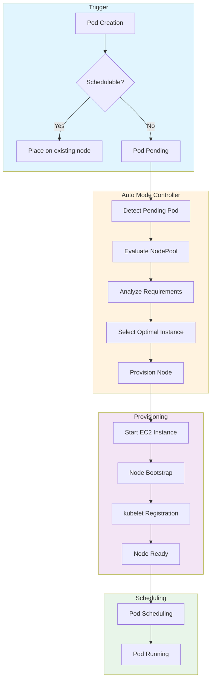
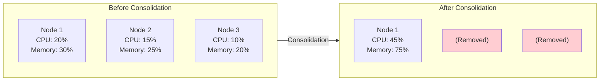

# Understanding Scaling Behavior

> **Supported Versions**: EKS 1.29+, EKS Auto Mode GA
> **Last Updated**: February 2025

This guide explains how EKS Auto Mode handles node provisioning, consolidation, drift detection, and expiration-based renewal.

---

## From Pod Pending to Node Provisioning

Understanding the scaling flow of EKS Auto Mode helps with optimization.



### Scaling Timeline

The typical node provisioning timeline:

| Phase | Duration | Description |
|-------|----------|-------------|
| Pending Pod Detection | 1-5 seconds | Controller detects unschedulable pods |
| Instance Selection | 1-3 seconds | Optimal instance type determination |
| EC2 Instance Start | 10-30 seconds | Instance launch and boot |
| AMI Boot | 20-40 seconds | Operating system initialization |
| kubelet Registration | 5-10 seconds | Node joins cluster |
| Pod Scheduling | 1-5 seconds | Pod placed on new node |
| **Total** | **40-90 seconds** | End-to-end provisioning time |

---

## Consolidation Behavior

Consolidation optimizes costs by cleaning up inefficient nodes.

### WhenEmpty Policy

Removes only empty nodes.

```yaml
apiVersion: karpenter.sh/v1
kind: NodePool
metadata:
  name: when-empty-example
spec:
  template:
    spec:
      requirements:
        - key: karpenter.k8s.aws/instance-category
          operator: In
          values: ["m", "c"]
      nodeClassRef:
        group: eks.amazonaws.com
        kind: NodeClass
        name: default
  disruption:
    consolidationPolicy: WhenEmpty
    consolidateAfter: 30s  # Remove after 30 seconds empty
```

### WhenEmptyOrUnderutilized Policy

Consolidates not only empty nodes but also underutilized nodes.

```yaml
apiVersion: karpenter.sh/v1
kind: NodePool
metadata:
  name: when-underutilized-example
spec:
  template:
    spec:
      requirements:
        - key: karpenter.k8s.aws/instance-category
          operator: In
          values: ["m", "c"]
      nodeClassRef:
        group: eks.amazonaws.com
        kind: NodeClass
        name: default
  disruption:
    consolidationPolicy: WhenEmptyOrUnderutilized
    consolidateAfter: 1m
```

### Consolidation Visualization



### Consolidation Decision Factors

Auto Mode considers these factors when consolidating:

| Factor | Description |
|--------|-------------|
| Node utilization | CPU and memory usage below threshold |
| Pod count | Few pods running on node |
| Cost efficiency | Can workloads fit on fewer, cheaper nodes |
| PDB compliance | Respect PodDisruptionBudget constraints |
| Budget windows | Honor time-based disruption budgets |

---

## Drift Detection and Replacement

When NodePool settings change, existing nodes are replaced with new settings.

### Detecting Drift

```bash
# Check node Drift
kubectl get nodes -o custom-columns=\
NAME:.metadata.name,\
NODEPOOL:.metadata.labels.karpenter\\.sh/nodepool,\
DRIFT:.metadata.annotations.karpenter\\.sh/drift-hash

# Check nodes with detected Drift
kubectl get nodeclaims -o wide
```

### What Triggers Drift

| Change Type | Triggers Drift |
|-------------|----------------|
| NodePool requirements change | Yes |
| NodeClass AMI family change | Yes |
| NodeClass block device change | Yes |
| NodeClass subnet change | Yes |
| NodePool weight change | No |
| NodePool limits change | No |

### Drift Replacement Process

1. Controller detects configuration drift
2. New node provisioned with updated settings
3. Pods gradually migrated to new node
4. Old node cordoned and drained
5. Old node terminated

---

## Expiration-Based Node Renewal

Replace nodes periodically for security patches or AMI updates.

```yaml
apiVersion: karpenter.sh/v1
kind: NodePool
metadata:
  name: with-expiration
spec:
  template:
    spec:
      requirements:
        - key: karpenter.k8s.aws/instance-category
          operator: In
          values: ["m", "c"]
      nodeClassRef:
        group: eks.amazonaws.com
        kind: NodeClass
        name: default
      # Set maximum node lifetime
      expireAfter: 168h  # Auto-replace after 7 days
  disruption:
    consolidationPolicy: WhenEmptyOrUnderutilized
    consolidateAfter: 1m
```

### Recommended Expiration Values

| Use Case | expireAfter | Rationale |
|----------|-------------|-----------|
| Security-critical | 24h - 72h | Frequent patching |
| Standard production | 168h (7 days) | Balance freshness and stability |
| Cost-sensitive | 336h (14 days) | Minimize replacement overhead |
| Development | 720h (30 days) | Maximize node reuse |

---

## Optimizing Scaling Latency

### Measuring Provisioning Time

```bash
# Measure node provisioning time
kubectl get events --sort-by='.lastTimestamp' | grep -E "Provisioned|Registered"

# Typical provisioning timeline
# - EC2 instance start: 10-30 seconds
# - AMI boot: 20-40 seconds
# - kubelet registration: 5-10 seconds
# - Pod scheduling: 1-5 seconds
# Total expected time: 40-90 seconds
```

### Fast Boot Configuration

```yaml
# NodeClass settings for fast provisioning
apiVersion: eks.amazonaws.com/v1
kind: NodeClass
metadata:
  name: fast-boot
spec:
  amiFamily: Bottlerocket  # Faster boot time than AL2023

  # EBS optimization
  blockDeviceMappings:
    - deviceName: /dev/xvda
      ebs:
        volumeSize: 50Gi  # Only as much as needed
        volumeType: gp3
        iops: 3000
        throughput: 125
```

### Latency Optimization Tips

| Optimization | Impact | Trade-off |
|--------------|--------|-----------|
| Use Bottlerocket AMI | 10-20s faster boot | Less customization |
| Smaller EBS volumes | 5-10s faster attach | Less local storage |
| Higher IOPS/throughput | 5-10s faster boot | Higher cost |
| Diverse instance types | Faster capacity acquisition | May get less optimal instance |
| Pre-warm with placeholder pods | Near-instant scaling | Idle resource cost |

---

## Scaling Behavior Monitoring

### Key Metrics to Watch

```bash
# Check pending pods over time
kubectl get pods -A --field-selector=status.phase=Pending -w

# Monitor node provisioning events
kubectl get events --sort-by='.lastTimestamp' -w | grep -i karpenter

# Check NodeClaim status
kubectl get nodeclaims -w
```

### CloudWatch Metrics

| Metric | Description | Alert Threshold |
|--------|-------------|-----------------|
| `karpenter_pods_pending` | Pods waiting for nodes | > 10 for > 5 min |
| `karpenter_nodeclaims_created` | New nodes requested | Unusual spikes |
| `karpenter_nodeclaims_startup_duration_seconds` | Provisioning time | p99 > 120s |
| `karpenter_nodes_total` | Total managed nodes | Near limits |

---

< [Previous: NodePool Configuration](./02-nodepool-configuration.md) | [Table of Contents](./README.md) | [Next: Spot Strategies](./04-spot-strategies.md) >
