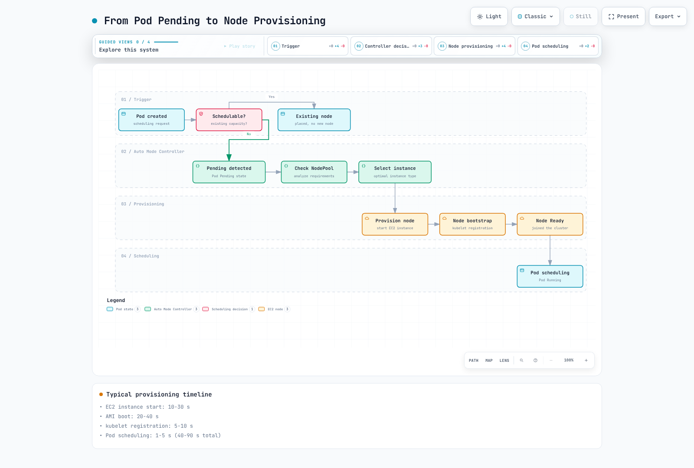
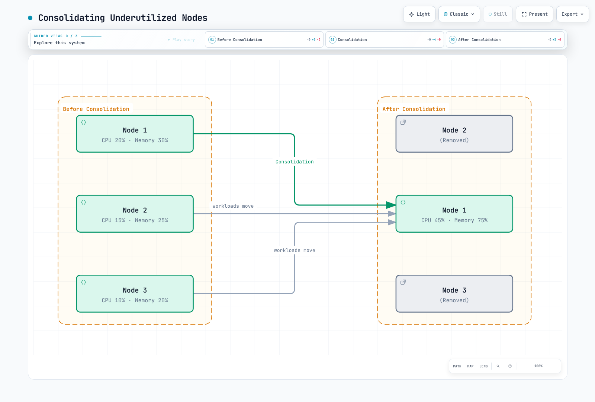

# Understanding Scaling Behavior

> **Supported Versions**: EKS Auto Mode GA; example baseline EKS 1.36
> **Last Updated**: September 12, 2026

This chapter separates provisioning, consolidation, drift and expiration. Use the reviewed account/context from [Getting Started](./01-getting-started.md). The manifests assume a configured `default` NodeClass and use On-Demand capacity to focus on lifecycle behavior. Limits are illustrative and can still permit substantial cost.

No cluster, workload or latency benchmark was run during this audit. Configurations and diagnostic transformations were checked locally; validate admission, IAM, scheduling and disruption behavior in a controlled environment before production.

## From an Unschedulable Pod to Capacity

Auto Mode observes Pods the scheduler cannot place on existing capacity. A suitable NodePool/NodeClass, compatible constraints, available quota and EC2 capacity must exist before provisioning can succeed. Requests, affinity, taints, topology, volume placement and architecture all matter. HPA/KEDA or another application controller is responsible for increasing replicas; node automation is not an application CPU-utilization autoscaler.

`Pending` alone does not prove a node shortage. A Pod can already be assigned to a node while waiting for images or initialization. The diagram shows a successful capacity path and omits failure branches; a compatible instance selection is not a global optimum or a ready-time guarantee. `Running` also does not mean application readiness.



[View interactive diagram](https://www.atomai.click/kubernetes-docs/archmaps/en-eks-auto-mode-03-scaling-behavior-0.html)

### Historical teaching estimates

The previous guide published the following numbers without raw observations or a reproducible benchmark. They are retained as **unverified historical estimates**, not timings measured with EKS 1.36 or an AWS SLO. Stage definitions can overlap; do not sum them as a measured trace.

| Phase in the prior illustration | Published duration |
|---------------------------------|--------------------|
| Pending detection | 1–5 seconds |
| Instance selection | 1–3 seconds |
| EC2 launch | 10–30 seconds |
| AMI boot | 20–40 seconds |
| kubelet registration | 5–10 seconds |
| Pod scheduling | 1–5 seconds |
| Total claimed | 40–90 seconds |

## Consolidation: Eligibility, Not a Timer Guarantee

Consolidation looks for cost-saving removal or replacement that remains schedulable. Do not model it as a fixed measured-CPU or memory-utilization threshold: resource requests and placement constraints matter. PDBs, disruption budgets, annotations, replacement capacity and drain progress can prevent or delay an action.

`consolidateAfter` is a stability/eligibility delay. Pod additions/removals reset the timer. A value of 30 seconds does not promise deletion 30 seconds later, nor does it bound replacement readiness.

### WhenEmpty

This policy considers eligible empty nodes. “Empty” is not necessarily zero Pods in `kubectl get pods`: DaemonSet-only nodes can qualify. It is conservative for consolidation, but does not disable other disruption reasons such as drift, expiration or Spot interruption.

```yaml
apiVersion: karpenter.sh/v1
kind: NodePool
metadata:
  name: when-empty-example
spec:
  template:
    spec:
      requirements:
      - key: eks.amazonaws.com/instance-category
        operator: In
        values:
        - m
        - c
      - key: karpenter.sh/capacity-type
        operator: In
        values:
        - on-demand
      nodeClassRef:
        group: eks.amazonaws.com
        kind: NodeClass
        name: default
  disruption:
    consolidationPolicy: WhenEmpty
    consolidateAfter: 30s
    budgets:
    - nodes: 10%
  limits:
    cpu: '100'
    memory: 400Gi
```

### WhenEmptyOrUnderutilized

This permits consolidation of non-empty nodes when their workloads can be repacked more cheaply under the relevant constraints. It may delete nodes using existing spare capacity or replace nodes with cheaper capacity; a new node is not always needed.

```yaml
apiVersion: karpenter.sh/v1
kind: NodePool
metadata:
  name: when-underutilized-example
spec:
  template:
    spec:
      requirements:
      - key: eks.amazonaws.com/instance-category
        operator: In
        values:
        - m
        - c
      - key: karpenter.sh/capacity-type
        operator: In
        values:
        - on-demand
      nodeClassRef:
        group: eks.amazonaws.com
        kind: NodeClass
        name: default
  disruption:
    consolidationPolicy: WhenEmptyOrUnderutilized
    consolidateAfter: 1m
    budgets:
    - nodes: 10%
  limits:
    cpu: '100'
    memory: 400Gi
```

### Balanced

The current AWS NodePool reference also supports `Balanced`, which weighs disruption cost against savings. It can skip marginal consolidation actions that the more aggressive policy would take; it is not a no-disruption guarantee.

```yaml
apiVersion: karpenter.sh/v1
kind: NodePool
metadata:
  name: balanced-example
spec:
  template:
    spec:
      requirements:
      - key: eks.amazonaws.com/instance-category
        operator: In
        values:
        - m
        - c
      - key: karpenter.sh/capacity-type
        operator: In
        values:
        - on-demand
      nodeClassRef:
        group: eks.amazonaws.com
        kind: NodeClass
        name: default
  disruption:
    consolidationPolicy: Balanced
    consolidateAfter: 1m
    budgets:
    - nodes: 10%
  limits:
    cpu: '100'
    memory: 400Gi
```

### Interpreting a packing diagram



[View interactive diagram](https://www.atomai.click/kubernetes-docs/archmaps/en-eks-auto-mode-03-scaling-behavior-1.html)

The figure's CPU 20/15/10% and memory 30/25/20% add to 45% and 75% on equal-capacity nodes. These are illustrative packing values, not measured inputs to a universal consolidation threshold. Real placement must also satisfy requests, topology, storage and availability requirements. Pods are evicted and recreated by workload controllers; they are not live-migrated.

## Drift Detection and Replacement

Drift means a NodeClaim no longer matches relevant desired or resolved configuration. Inspect its `Drifted` condition; the old `karpenter.sh/drift-hash` node annotation query was not a valid public drift status check. A missing condition is reported below as `NotReported`, not invented as a definitive false result.

```bash
kubectl --context "$CLUSTER_NAME" --request-timeout=15s get nodeclaims -o json |
  jq '[.items[] | {
    claim: .metadata.name,
    node: .status.nodeName,
    pool: .metadata.labels["karpenter.sh/nodepool"],
    drift: ((.status.conditions // [] | map(select(.type == "Drifted") |
              {status, reason, lastTransitionTime, observedGeneration}) | first)
            // {status: "NotReported"})
  }]'
```

| Change | Interpretation |
|--------|----------------|
| Requirements exclude the current instance | Can cause drift |
| Requirements widen but still permit the instance | Does not necessarily cause drift |
| Relevant NodeClass settings or resolved subnet/security-group selections change | Can cause drift; inspect actual conditions |
| AWS selects a new managed Auto Mode AMI | Can cause replacement; users do not choose an `amiFamily` |
| Rule edit on an already referenced security group | Not equivalent to selecting a different group; do not assume it always causes node drift |
| NodePool weight, limits or disruption behavior | Not node-template drift by themselves; they can change which actions are permitted |
| `expireAfter` or `terminationGracePeriod` changes | Existing NodeClaim fields are not rewritten; replacements obtain the new values |

A typical graceful path checks budgets and scheduling feasibility, prevents new placements on selected nodes, prepares replacement capacity **if needed**, and then evicts/drains and terminates the old nodes. Replacement capacity may overlap old capacity and incur cost. Parallelism is constrained by budgets; replacement is not necessarily sequential. Forceful interruption/expiration paths must not be described as always waiting for a healthy replacement first.

## Expiration and Termination Grace

AWS documents a 21-day maximum Auto Mode node lifetime. The default expiry is 336 hours, and Auto Mode defaults `terminationGracePeriod` to 24 hours on NodeClaims when omitted from a custom NodePool. Do not import the generic upstream 720-hour default as an Auto Mode recommendation.

The following requests expiration after 168 hours with an explicit grace period. Expiration begins draining; it does not promise a healthy replacement exactly seven days later. Nodes may be disrupted earlier for other reasons.

```yaml
apiVersion: karpenter.sh/v1
kind: NodePool
metadata:
  name: with-expiration
spec:
  template:
    spec:
      requirements:
      - key: eks.amazonaws.com/instance-category
        operator: In
        values:
        - m
        - c
      - key: karpenter.sh/capacity-type
        operator: In
        values:
        - on-demand
      nodeClassRef:
        group: eks.amazonaws.com
        kind: NodeClass
        name: default
      expireAfter: 168h
      terminationGracePeriod: 24h
  disruption:
    consolidationPolicy: WhenEmptyOrUnderutilized
    consolidateAfter: 1m
    budgets:
    - nodes: 10%
  limits:
    cpu: '100'
    memory: 400Gi
```

| Policy value discussed in the previous guide | Current interpretation |
|---------------------------------------------|------------------------|
| 24–72 hours | Optional short-lived policy, with more churn; not proof that a new patch exists each cycle |
| 168 hours | The seven-day example above; evaluate availability and replacement overhead |
| 336 hours | Documented Auto Mode default expiry |
| 720 hours / 30 days | Exceeds Auto Mode's documented 21-day maximum; do not use it as a node-reuse promise |

NodePool disruption budgets rate-limit graceful methods; they are not a universal shield against expiration, interruption or repair. PDBs and `do-not-disrupt` affect drain/disruption decisions but do not guarantee indefinite retention. After a configured termination grace period, remaining Pods can be forcibly removed. Choose policies that account for stateful workloads, storage detach, application grace periods and failure scenarios.

## Diagnose Latency Without Inventing a Benchmark

The following commands capture selected metadata and status, not complete Pod specs. Keep the evidence private. A snapshot's last condition transition may reflect a later transition or flap, not the first startup milestone.

```bash
umask 077
: "${WORK_DIR:?Use the private evidence directory from the getting-started guide}"
kubectl --context "$CLUSTER_NAME" --request-timeout=15s get nodeclaims -o json |
  jq '[.items[] | {
    claim: .metadata.name, uid: .metadata.uid,
    node: .status.nodeName, createdAt: .metadata.creationTimestamp,
    pool: .metadata.labels["karpenter.sh/nodepool"],
    expireAfter: .spec.expireAfter,
    terminationGracePeriod: .spec.terminationGracePeriod,
    conditions: [.status.conditions[]? |
      select(.type == "Launched" or .type == "Registered" or .type == "Initialized" or .type == "Ready") |
      {type, status, reason, lastTransitionTime}]
  }]' > "$WORK_DIR/nodeclaims-summary.json"
```

```bash
: "${WORKLOAD_NAMESPACE:?Set the controlled test namespace}"
: "${POD_NAME:?Set the controlled test Pod name}"
kubectl --context "$CLUSTER_NAME" --request-timeout=15s -n "$WORKLOAD_NAMESPACE" \
  get pod "$POD_NAME" -o json |
  jq '{name: .metadata.name, uid: .metadata.uid,
       createdAt: .metadata.creationTimestamp, node: .spec.nodeName, phase: .status.phase,
       conditions: [.status.conditions[]? |
         select(.type == "PodScheduled" or .type == "Ready") |
         {type, status, reason, lastTransitionTime}]}' > "$WORK_DIR/pod-summary.json"
```

For an actual benchmark, start a controlled observation at workload creation, correlate object UIDs and NodeClaim/node assignments, and record first scheduling, node readiness and application readiness separately. Include failed attempts/timeouts and the environment, images and workload configuration. Snapshot data and retained Kubernetes events alone cannot establish a complete latency distribution.

### Supported storage tuning

Auto Mode selects its Bottlerocket variant. Do not set `amiFamily` or `blockDeviceMappings` to seek a claimed boot-time improvement. This valid storage template uses `ephemeralStorage`; replace the profile and selectors with reviewed resources and reference this NodeClass from the intended pool.

```yaml
apiVersion: eks.amazonaws.com/v1
kind: NodeClass
metadata:
  name: image-storage-example
spec:
  instanceProfile: eks-node-instance-profile
  subnetSelectorTerms:
  - tags:
      Name: private-subnet
  securityGroupSelectorTerms:
  - tags:
      Name: eks-cluster-sg
  advancedNetworking:
    associatePublicIPAddress: false
  ephemeralStorage:
    size: 50Gi
    iops: 3000
    throughput: 125
```

Profile actual image transfer, unpacking, CPU, network and storage bottlenecks before changing settings. The earlier “Bottlerocket saves 10–20 seconds”, “smaller EBS saves 5–10 seconds” and “higher IOPS saves 5–10 seconds” figures had no verified measurements. They are not current tuning guarantees. Smaller capacity can instead cause image/ephemeral-storage pressure.

Broader compatible instance/AZ choices can improve capacity options, but must respect workload and volume constraints. Placeholder Pods can reserve capacity at an idle cost; they do not guarantee near-instant image pulls or application readiness.

## Observe the Right Signals

Inspect Pods explicitly reported as unschedulable, rather than treating every Pending Pod as a capacity request:

```bash
kubectl --context "$CLUSTER_NAME" --request-timeout=15s \
  get pods -A --field-selector=status.phase=Pending -o json |
  jq '[.items[] | select(any(.status.conditions[]?;
    .type == "PodScheduled" and .status == "False" and .reason == "Unschedulable")) |
    {namespace: .metadata.namespace, name: .metadata.name, uid: .metadata.uid,
     createdAt: .metadata.creationTimestamp}]'
```

Events can explain decisions, but they can be aggregated, repeated or expired. This query uses the explicit `events.k8s.io` resource and selects status identifiers rather than dumping workload data:

```bash
kubectl --context "$CLUSTER_NAME" --request-timeout=15s \
  get events.events.k8s.io -A -o json |
  jq '[.items[] |
    select(.regarding.kind == "NodeClaim" or .regarding.kind == "Node" or .regarding.kind == "Pod") |
    {time: (.eventTime // .deprecatedLastTimestamp // .metadata.creationTimestamp),
     reason, regarding: {kind: .regarding.kind, name: .regarding.name, uid: .regarding.uid},
     count: (.series.count // .deprecatedCount // 1)}] | sort_by(.time)'
```

| Signal | Evidence and alert-design consideration |
|--------|----------------------------------------|
| Sustained unschedulable Pods | Kubernetes conditions plus a configured collector; the prior >10 for 5 minutes threshold was only an example |
| NodeClaim creation/failure rate | Durable events/logs or instrumentation; a current-object snapshot omits deleted attempts |
| Provisioning/application latency | Correlated observations including failures; the prior p99 >120 seconds threshold was not an AWS SLO |
| Pool resources approaching limits | NodePool status, quota and capacity checks; distinguish requested/reserved resources from actual utilization |

Do not assume the earlier `karpenter_*` table names are built-in Auto Mode CloudWatch metrics. Self-managed Karpenter Prometheus metrics, EKS control-plane metrics and your own collectors are separate interfaces; select metric names and dimensions from the actual configured publisher.

### AWS-managed component logs

Auto Mode exposes managed component logs through CloudWatch Vended Logs delivery. This is configured separately from ordinary EKS control-plane logging:

- `AUTO_MODE_COMPUTE_LOGS` for managed Karpenter decisions
- `AUTO_MODE_BLOCK_STORAGE_LOGS`
- `AUTO_MODE_LOAD_BALANCING_LOGS`
- `AUTO_MODE_IPAM_LOGS`

The documented setup uses a delivery source, delivery destination and delivery. Review destination permissions and delivery/storage charges before enabling it. Existing control-plane audit logs can also show Kubernetes events such as `DisruptionBlocked`, `Unconsolidatable`, `FailedScheduling`, `NodeClassNotReady` and termination failures; use the AWS troubleshooting reference and a scoped time range. These are diagnostic events, not automatically a published latency histogram.

## References

- [EKS Auto Mode behavior and maximum node lifetime](https://docs.aws.amazon.com/eks/latest/userguide/automode.html)
- [Auto Mode NodePool policies and grace period](https://docs.aws.amazon.com/eks/latest/userguide/create-node-pool.html)
- [Karpenter v1.14 disruption and drift](https://karpenter.sh/v1.14/concepts/disruption/)
- [Auto Mode NodeClass fields](https://docs.aws.amazon.com/eks/latest/userguide/create-node-class.html)
- [Auto Mode troubleshooting](https://docs.aws.amazon.com/eks/latest/userguide/auto-troubleshoot.html)
- [AWS-managed component log delivery](https://docs.aws.amazon.com/eks/latest/userguide/auto-managed-component-logs.html)

< [Previous: NodePool Configuration](./02-nodepool-configuration.md) | [Table of Contents](./README.md) | [Next: Spot Strategies](./04-spot-strategies.md) >
