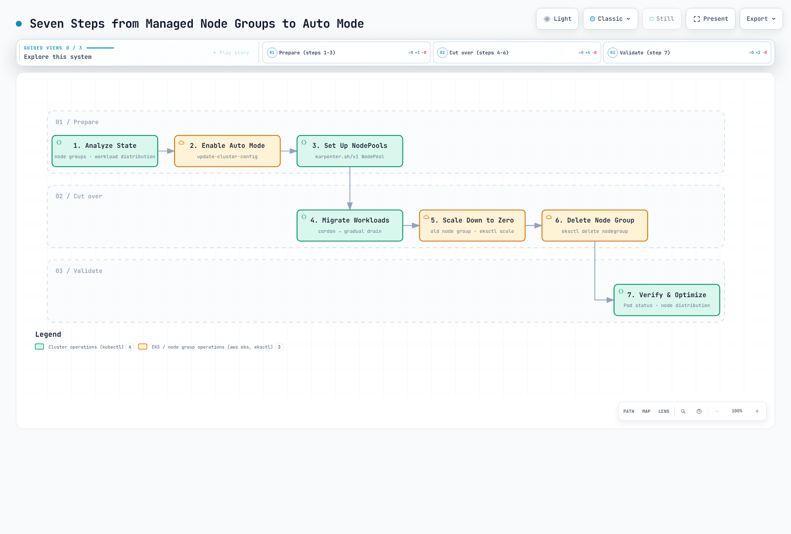

# Migrating from Managed Node Groups to Auto Mode

> **Supported Versions**: EKS Auto Mode GA; examples reviewed for EKS 1.36
> **Last Updated**: September 12, 2026

Migration requires application, storage and controller-ownership checks **before** old capacity is removed. The examples below are staged operations with locally checked schemas/CLI fixtures, not a verified zero-downtime production procedure. No cloud or cluster mutations were performed during this audit.



[🔍 View interactive diagram](https://www.atomai.click/kubernetes-docs/archmaps/en-eks-auto-mode-09-migration-guide-0.html)

The diagram's final validation step does not authorize draining, scaling to zero or deletion without earlier health checks and a rollback plan.

## 1. Inventory and Bind the Operational Context

Use a currently supported EKS/add-on combination. The former 1.29 minimum was a historical feature floor, not current supported-version guidance. Confirm a compatible VPC CNI, kube-proxy, EBS CSI, snapshot controller and Pod Identity Agent where installed; use the official migration minimums **and** the compatibility listing for your actual Kubernetes version.

Record controller ownership, workload placement, system agents, volumes/AZs, load-balancer classes, IAM, recovery procedures and cost. The guard below checks account, cluster ARN/creation time/API endpoint and node-group ARN/creation time. These are point-in-time identity checks, not an atomic lock against concurrent controllers. A deliberately proxied endpoint needs a reviewed alternative, not silently bypassing a mismatch.

```bash
set -euo pipefail
: "${EXPECTED_ACCOUNT_ID:?Set the intended account}"
: "${AWS_REGION:?Set the cluster region}"
: "${CLUSTER_NAME:?Set the cluster name}"
: "${OLD_NODEGROUP:?Set the reviewed managed node group}"
: "${KUBECONFIG:?Set the reviewed kubeconfig}"
export KUBECONFIG
export KUBE_CONTEXT="${KUBE_CONTEXT:-$CLUSTER_NAME}"
check_account() {
  local actual
  actual=$(aws sts get-caller-identity --region "$AWS_REGION" --query Account --output text) || return
  test "$actual" = "$EXPECTED_ACCOUNT_ID" || { printf 'Account mismatch.\n' >&2; return 1; }
}
check_account
umask 077
export WORK_DIR
WORK_DIR=$(mktemp -d "$PWD/auto-migration.XXXXXXXX")
aws eks describe-cluster --name "$CLUSTER_NAME" --region "$AWS_REGION" --output json \
  > "$WORK_DIR/cluster-before.json"
aws eks describe-nodegroup --cluster-name "$CLUSTER_NAME" --nodegroup-name "$OLD_NODEGROUP" \
  --region "$AWS_REGION" --output json > "$WORK_DIR/nodegroup-before.json"
guard_context() {
  check_account || return
  local endpoint
  aws eks describe-cluster --name "$CLUSTER_NAME" --region "$AWS_REGION" --output json \
    > "$WORK_DIR/cluster-current.json" || return
  endpoint=$(kubectl --context "$KUBE_CONTEXT" config view --minify \
    -o jsonpath='{.clusters[0].cluster.server}') || return
  jq -e --arg endpoint "$endpoint" --slurpfile before "$WORK_DIR/cluster-before.json" '
    .cluster.arn == $before[0].cluster.arn and
    .cluster.createdAt == $before[0].cluster.createdAt and
    .cluster.endpoint == $endpoint and .cluster.status == "ACTIVE"
  ' "$WORK_DIR/cluster-current.json" >/dev/null
}
guard_nodegroup() {
  guard_context || return
  aws eks describe-nodegroup --cluster-name "$CLUSTER_NAME" --nodegroup-name "$OLD_NODEGROUP" \
    --region "$AWS_REGION" --output json > "$WORK_DIR/nodegroup-current.json" || return
  jq -e --slurpfile before "$WORK_DIR/nodegroup-before.json" '
    .nodegroup.nodegroupArn == $before[0].nodegroup.nodegroupArn and
    .nodegroup.createdAt == $before[0].nodegroup.createdAt and .nodegroup.status == "ACTIVE"
  ' "$WORK_DIR/nodegroup-current.json" >/dev/null
}
guard_nodegroup
printf 'Private migration evidence: %s\n' "$WORK_DIR"
```

```bash
kubectl --context "$KUBE_CONTEXT" --request-timeout=15s \
  get deployments,statefulsets,daemonsets,jobs,cronjobs -A -o json |
jq '[.items[] | (.spec.template // .spec.jobTemplate.spec.template) as $t |
 {kind,namespace:.metadata.namespace,name:.metadata.name,uid:.metadata.uid,
  nodeSelector:$t.spec.nodeSelector,affinity:$t.spec.affinity,tolerations:$t.spec.tolerations,
  serviceAccountName:$t.spec.serviceAccountName,hostNetwork:$t.spec.hostNetwork,
  pvcNames:[$t.spec.volumes[]?.persistentVolumeClaim.claimName // empty]}]' \
  > "$WORK_DIR/workload-placement.json"
kubectl --context "$KUBE_CONTEXT" --request-timeout=15s get pods -A -o json |
jq '[.items[] | {namespace:.metadata.namespace,name:.metadata.name,node:.spec.nodeName,
  phase:.status.phase,deletionTimestamp:.metadata.deletionTimestamp,
  ready:([.status.conditions[]?|select(.type=="Ready")|.status]|first // "NotReported"),
  owners:[.metadata.ownerReferences[]?|{kind,name,controller}]}]' \
  > "$WORK_DIR/pod-state.json"
```

The private files contain operational metadata; retain them for recovery. Query failures remain failures. `kubectl top` requires a working metrics API, and a current CPU snapshot does not replace workload history.

| Existing configuration | Migration consideration |
|------------------------|-------------------------|
| Custom AMI/bootstrap/user data | Auto Mode uses managed Bottlerocket, not arbitrary AL2023/custom AMI/userData |
| Node IAM permissions | Prepare the node role/profile/access entry; migrate workload permissions to reviewed IRSA/Pod Identity rather than node-role/IMDS fallback |
| Cluster IAM role | Add required Auto Mode permissions/trust to the existing role; enabling through CLI does not automatically create all roles |
| Selectors/affinity/taints | Include Deployments, StatefulSets, DaemonSets, Jobs and CronJobs; remove conflicting placement deliberately |
| Alternative CNI/network configuration | Check documented compatibility before enabling; unsupported networking is not repaired by a NodeClass |
| Scaling/IaC ownership | Coordinate Cluster Autoscaler, GitOps and the original IaC owner so they do not undo migration changes |

### Data, load balancers and mixed-node DNS

The drivers/controllers are different interfaces:

| Resource | Self-managed | Auto Mode |
|----------|--------------|-----------|
| EBS StorageClass provisioner | `ebs.csi.aws.com` | `ebs.csi.eks.amazonaws.com` |
| NLB Service loadBalancerClass | `service.k8s.aws/nlb` | `eks.amazonaws.com/nlb` |
| ALB IngressClass controller | `ingress.k8s.aws/alb` | `eks.amazonaws.com/alb` |
| TargetGroupBinding apiVersion | `elbv2.k8s.aws/v1beta1` | `eks.amazonaws.com/v1` |
| Compute class | `karpenter.k8s.aws/v1 EC2NodeClass` | `eks.amazonaws.com/v1 NodeClass` |

An existing PVC does not switch drivers by editing its StorageClass name, and an existing load balancer is not automatically adopted by the managed controller. For EBS, use a tested backup/snapshot restore plan or the current AWS-documented **stopped-workload, Retain, static PV/PVC recreation** workflow. The latter reuses an EBS volume but recreates Kubernetes binding objects; it is not an in-place driver switch. Verify backup restoration, volume/AZ/KMS ownership, reclaim policy, finalizers, bindings and application consistency. No destructive volume migration script is provided here.

Keep the self-managed AWS Load Balancer Controller while it owns resources. Create/test the new managed load balancer and shift traffic through a reviewed blue/green DNS plan before decommissioning the old one. Review class immutability, annotations and TargetGroupBinding ownership separately; changing an API group is not a safe adoption operation.

Auto Mode nodes have node-local DNS. **Retain the CoreDNS Deployment while any non-Auto nodes need it.** Keep required CNI/proxy/storage/identity agents for remaining node types and scope their placement; pure Auto Mode's managed components are not a reason to remove mixed-cluster dependencies early.

## 2. Enable Auto Mode Without an Unrestricted Default Pool

Complete the IAM/access preparation in [Getting Started](./01-getting-started.md) first. The existing cluster role needs the documented Compute, **BlockStoragePolicyV2**, LoadBalancing, Networking and Cluster policies plus the required `sts:TagSession` trust. The example expects API or API_AND_CONFIG_MAP authentication and a prepared custom node role/profile with an EC2 access entry.

This staged path starts with **no built-in pools**. Therefore it creates its own NodeClass in the next step; do not assume `default` exists. Enabling an unrestricted general-purpose pool could schedule existing pending workloads before the intended cutover. The example refuses a cluster already running Auto Mode rather than replacing its existing pool list.

Use the specific update ID to wait for completion. Cluster `ACTIVE` alone is not proof that this configuration update succeeded.

```bash
wait_eks_update() {
  local id="$1" group="${2:-}" attempt status
  local extra=()
  test -n "$group" && extra=(--nodegroup-name "$group")
  for ((attempt=0; attempt<120; attempt++)); do
    aws eks describe-update --name "$CLUSTER_NAME" --region "$AWS_REGION" \
      --update-id "$id" "${extra[@]}" --output json > "$WORK_DIR/update-current.json" || return
    status=$(jq -er '.update.status' "$WORK_DIR/update-current.json") || return
    case "$status" in
      Successful) return 0 ;;
      Failed|Cancelled)
        jq '{id:.update.id,status:.update.status,errorCodes:[.update.errors[]?.errorCode]}' \
          "$WORK_DIR/update-current.json" >&2
        return 1 ;;
      InProgress) sleep 10 ;;
      *) printf 'Unknown update state; inspect saved evidence.\n' >&2; return 1 ;;
    esac
  done
  printf 'Update still unconfirmed; stop and retain its ID.\n' >&2
  return 1
}
```

```bash
guard_context
jq -e '.cluster.computeConfig.enabled != true and
       (.cluster.accessConfig.authenticationMode == "API" or
        .cluster.accessConfig.authenticationMode == "API_AND_CONFIG_MAP")' \
  "$WORK_DIR/cluster-current.json" >/dev/null
jq -n --arg name "$CLUSTER_NAME" '{
  name:$name,
  computeConfig:{enabled:true,nodePools:[]},
  storageConfig:{blockStorage:{enabled:true}},
  kubernetesNetworkConfig:{elasticLoadBalancing:{enabled:true}}
}' > "$WORK_DIR/enable-request.json"
aws eks update-cluster-config --region "$AWS_REGION" \
  --cli-input-json "file://$WORK_DIR/enable-request.json" --output json \
  > "$WORK_DIR/enable-response.json"
update_id=$(jq -er '.update.id' "$WORK_DIR/enable-response.json")
wait_eks_update "$update_id"
guard_context
jq -e '.cluster.computeConfig.enabled == true and
       .cluster.computeConfig.nodePools == [] and
       .cluster.storageConfig.blockStorage.enabled == true and
       .cluster.kubernetesNetworkConfig.elasticLoadBalancing.enabled == true' \
  "$WORK_DIR/cluster-current.json" >/dev/null
```

Compute, block storage and managed load balancing must be enabled or disabled together. Native request validation does not prove IAM/service admission will succeed; stop on an error and retain the update evidence. Do not rerun blindly after an uncertain response. Authentication-mode changes have separate migration/rollback constraints.

## 3. Create a Selective Pool and Test Both Sides

Replace the NodeClass profile/subnet/security-group placeholders with reviewed existing resources. The profile's role needs the correct node access entry; these manifests do not create IAM, VPC or application credentials.

```yaml
apiVersion: v1
kind: Namespace
metadata:
  name: migration-lab
  labels:
    pod-security.kubernetes.io/enforce: restricted
    pod-security.kubernetes.io/enforce-version: v1.36
    pod-security.kubernetes.io/warn: restricted
    pod-security.kubernetes.io/warn-version: v1.36
    pod-security.kubernetes.io/audit: restricted
    pod-security.kubernetes.io/audit-version: v1.36
---
apiVersion: eks.amazonaws.com/v1
kind: NodeClass
metadata:
  name: migration-nodeclass
spec:
  instanceProfile: eks-migration-node-profile
  subnetSelectorTerms:
  - tags:
      Name: private-subnet
  securityGroupSelectorTerms:
  - tags:
      Name: worker-restricted
  advancedNetworking:
    associatePublicIPAddress: false
  ephemeralStorage:
    size: 100Gi
    iops: 3000
    throughput: 125
---
apiVersion: karpenter.sh/v1
kind: NodePool
metadata:
  name: migration-pool
spec:
  template:
    spec:
      requirements:
      - key: eks.amazonaws.com/instance-category
        operator: In
        values:
        - m
      - key: karpenter.sh/capacity-type
        operator: In
        values:
        - on-demand
      nodeClassRef:
        group: eks.amazonaws.com
        kind: NodeClass
        name: migration-nodeclass
      expireAfter: 168h
      terminationGracePeriod: 24h
      taints:
      - key: migration
        value: auto-mode
        effect: NoSchedule
    metadata:
      labels:
        migration: auto-mode
  disruption:
    consolidationPolicy: WhenEmptyOrUnderutilized
    consolidateAfter: 2m
    budgets:
    - nodes: '1'
  limits:
    cpu: '32'
    memory: 128Gi
---
apiVersion: apps/v1
kind: Deployment
metadata:
  name: legacy-canary
  namespace: migration-lab
spec:
  replicas: 2
  selector:
    matchLabels:
      app: legacy-canary
  template:
    metadata:
      labels:
        app: legacy-canary
    spec:
      containers:
      - name: web
        image: nginxinc/nginx-unprivileged:1.30.4@sha256:cb92301e719d6639028de775fe8b28e15f58343aca5e5372001311958aafb300
        resources:
          requests:
            cpu: 100m
            memory: 64Mi
          limits:
            cpu: 500m
            memory: 128Mi
        ports:
        - containerPort: 8080
        securityContext:
          allowPrivilegeEscalation: false
          capabilities:
            drop:
            - ALL
          readOnlyRootFilesystem: true
        volumeMounts:
        - name: tmp
          mountPath: /tmp
        readinessProbe:
          httpGet:
            path: /
            port: 8080
          periodSeconds: 5
      terminationGracePeriodSeconds: 60
      automountServiceAccountToken: false
      nodeSelector:
        eks.amazonaws.com/nodegroup: REPLACE_WITH_OLD_NODEGROUP
      tolerations: []
      securityContext:
        runAsNonRoot: true
        runAsUser: 101
        runAsGroup: 101
        fsGroup: 101
        seccompProfile:
          type: RuntimeDefault
      volumes:
      - name: tmp
        emptyDir:
          sizeLimit: 128Mi
  strategy:
    type: RollingUpdate
    rollingUpdate:
      maxSurge: 1
      maxUnavailable: 0
---
apiVersion: apps/v1
kind: Deployment
metadata:
  name: auto-canary
  namespace: migration-lab
spec:
  replicas: 2
  selector:
    matchLabels:
      app: auto-canary
  template:
    metadata:
      labels:
        app: auto-canary
    spec:
      containers:
      - name: web
        image: nginxinc/nginx-unprivileged:1.30.4@sha256:cb92301e719d6639028de775fe8b28e15f58343aca5e5372001311958aafb300
        resources:
          requests:
            cpu: 100m
            memory: 64Mi
          limits:
            cpu: 500m
            memory: 128Mi
        ports:
        - containerPort: 8080
        securityContext:
          allowPrivilegeEscalation: false
          capabilities:
            drop:
            - ALL
          readOnlyRootFilesystem: true
        volumeMounts:
        - name: tmp
          mountPath: /tmp
        readinessProbe:
          httpGet:
            path: /
            port: 8080
          periodSeconds: 5
      terminationGracePeriodSeconds: 60
      automountServiceAccountToken: false
      nodeSelector:
        karpenter.sh/nodepool: migration-pool
        eks.amazonaws.com/compute-type: auto
      tolerations:
      - key: migration
        operator: Equal
        value: auto-mode
        effect: NoSchedule
      securityContext:
        runAsNonRoot: true
        runAsUser: 101
        runAsGroup: 101
        fsGroup: 101
        seccompProfile:
          type: RuntimeDefault
      volumes:
      - name: tmp
        emptyDir:
          sizeLimit: 128Mi
  strategy:
    type: RollingUpdate
    rollingUpdate:
      maxSurge: 1
      maxUnavailable: 0
```

Replace `REPLACE_WITH_OLD_NODEGROUP` before using the legacy canary. The complete nginx examples use the reviewed non-root image and security context from the operations chapter. They test basic placement/readiness, not your application's state, identity or traffic path.

The Auto canary selects both the exact pool and `eks.amazonaws.com/compute-type=auto`. Existence of `karpenter.sh/nodepool` alone also matches self-managed Karpenter nodes. A toleration permits placement; it does not select a pool by itself.

| MNG setting | Auto Mode mapping |
|-------------|-------------------|
| Instance types / capacity type | Exact instance requirements or deliberately broader categories; capacity-type requirement |
| Labels / taints | `spec.template.metadata.labels` / `spec.template.spec.taints` |
| Min/desired/max node count | Not equivalent to CPU/memory `spec.limits`; consider separate static-pool semantics if fixed desired nodes are required |
| Subnet / security groups | Custom NodeClass selectors and reviewed rules |
| AMI / bootstrap | No arbitrary AMI-family/userData mapping in Auto Mode |

## 4. Migrate in Waves and Stop on Failure

Start with representative low-risk workloads, then staging/non-critical production and critical workloads after their dependencies pass. Change the **owning controller/GitOps desired configuration**, not just a live Pod.

Review the entire placement policy: adding an Auto selector while retaining an old node-group selector can make the conjunction unschedulable. Do not erase unrelated pod affinity, security placement or tolerations with `affinity: null`. StatefulSets, active Jobs and local-volume workloads need their own data-aware procedure.

For a nonzero Deployment, this checks rollout and observed replica readiness:

```bash
: "${WORKLOAD_NAMESPACE:?Select the namespace}"
: "${DEPLOYMENT_NAME:?Select one migrated Deployment}"
kubectl --context "$KUBE_CONTEXT" -n "$WORKLOAD_NAMESPACE" rollout status \
  "deployment/$DEPLOYMENT_NAME" --timeout=10m
kubectl --context "$KUBE_CONTEXT" --request-timeout=15s -n "$WORKLOAD_NAMESPACE" \
  get deployment "$DEPLOYMENT_NAME" -o json |
jq -e '(.spec.replicas // 1) as $desired |
  $desired > 0 and .status.observedGeneration >= .metadata.generation and
  .status.updatedReplicas == $desired and .status.readyReplicas == $desired and
  .status.availableReplicas == $desired' >/dev/null
```

Also verify actual requests, DNS, load-balancer targets, volumes/read-write behavior, identity, logs/metrics and application SLOs. Deployment rolling-update settings and PDB Eviction API protections are different controls. A successful `rollout status` or Pod phase `Running` alone is not end-to-end availability evidence; completed Jobs may correctly be `Succeeded`.

### Optional single-node drain

Only after reviewing replacement capacity, workload placement, PDBs and data durability, select **one** old managed node and its recorded UID:

```bash
: "${NODE_NAME:?Select exactly one old managed node}"
: "${EXPECTED_NODE_UID:?Set its previously reviewed UID}"
guard_nodegroup
kubectl --context "$KUBE_CONTEXT" --request-timeout=15s get node "$NODE_NAME" -o json \
  > "$WORK_DIR/node-before-drain.json"
jq -e --arg uid "$EXPECTED_NODE_UID" --arg group "$OLD_NODEGROUP" '
  .metadata.uid == $uid and .metadata.labels["eks.amazonaws.com/nodegroup"] == $group and
  .metadata.labels["eks.amazonaws.com/compute-type"] != "auto" and
  .metadata.deletionTimestamp == null and
  any(.status.conditions[]?; .type=="Ready" and .status=="True")
' "$WORK_DIR/node-before-drain.json" >/dev/null
kubectl --context "$KUBE_CONTEXT" drain "$NODE_NAME" --ignore-daemonsets --timeout=10m
printf 'Drain returned successfully. Validate application health before selecting another node.\n'
```

There is no bulk cordon/drain loop, fixed sleep health gate or “continue after failure.” The default drain refuses unmanaged Pods/local emptyDir data unless handled deliberately; do not append `--force`, `--disable-eviction` or `--delete-emptydir-data` to make a failure disappear. A failed/interrupted drain can leave the node cordoned: inspect it and restore scheduling only if the recovery plan calls for it. Validate the affected applications before choosing another node.

## 5. Scale Down Only After Old Workloads Are Gone

**Changing an MNG's desired size does not respect PDBs**: EKS uses ASG scale-down. This is different from the normal managed-node-group version-update drain. Halving desired size and sleeping five minutes is not safe stabilization.

Coordinate the original scaling/IaC owner and prevent new application scheduling to old nodes. The API example checks that all observed old nodes are cordoned and contain no active non-DaemonSet Pods, then requests zero min/desired size. It does not eliminate races from controllers that ignore cordons or replace nodes; keep the migration placement controls active. Review every remaining DaemonSet/system dependency and export required completed-job artifacts first.

```bash
guard_nodegroup
kubectl --context "$KUBE_CONTEXT" --request-timeout=15s get nodes \
  -l "eks.amazonaws.com/nodegroup=$OLD_NODEGROUP" -o json > "$WORK_DIR/old-nodes.json"
jq -e 'all(.items[]; .spec.unschedulable == true)' "$WORK_DIR/old-nodes.json" >/dev/null
kubectl --context "$KUBE_CONTEXT" --request-timeout=15s get pods -A -o json \
  | jq '{items:[.items[]|{metadata:{name:.metadata.name,namespace:.metadata.namespace,
         ownerReferences:.metadata.ownerReferences},spec:{nodeName:.spec.nodeName},
         status:{phase:.status.phase}}]}' > "$WORK_DIR/pods-before-scale.json"
jq --slurpfile nodes "$WORK_DIR/old-nodes.json" '
  ($nodes[0].items|map(.metadata.name)) as $names |
  [.items[] | select(.spec.nodeName as $n | $names|index($n)) |
   select(.status.phase!="Succeeded" and .status.phase!="Failed") |
   select(any(.metadata.ownerReferences[]?; .kind=="DaemonSet" and .controller==true)|not) |
   {namespace:.metadata.namespace,name:.metadata.name,phase:.status.phase}]
' "$WORK_DIR/pods-before-scale.json" > "$WORK_DIR/old-active-workloads.json"
jq -e 'length == 0' "$WORK_DIR/old-active-workloads.json" >/dev/null

guard_nodegroup
aws eks update-nodegroup-config --cluster-name "$CLUSTER_NAME" --nodegroup-name "$OLD_NODEGROUP" \
  --region "$AWS_REGION" --scaling-config minSize=0,desiredSize=0 --output json \
  > "$WORK_DIR/scale-zero-response.json"
update_id=$(jq -er '.update.id' "$WORK_DIR/scale-zero-response.json")
wait_eks_update "$update_id" "$OLD_NODEGROUP"
```

Wait for the actual old nodes/instances to disappear and recheck application health. Keep the node-group definition and recorded scaling configuration for an agreed rollback window. Zero desired capacity is not guaranteed immediately recoverable capacity.

## 6. Retire Old Infrastructure Through Its Owner

After successful workload/data/traffic validation and a deliberate stabilization period, delete the old group through the **original owner**: Terraform, CloudFormation, eksctl or another management workflow. Direct EKS API deletion of an IaC-owned group can leave drift, stacks, IAM roles or other resources.

The following is only for a reviewed **direct-API-managed** group. It requires zero desired size, rechecks node/workload state and refuses visible CloudFormation ownership tags. That check cannot discover every external IaC owner; establishing ownership remains a prerequisite.

```bash
guard_nodegroup
kubectl --context "$KUBE_CONTEXT" --request-timeout=15s get nodes \
  -l "eks.amazonaws.com/nodegroup=$OLD_NODEGROUP" -o json > "$WORK_DIR/old-nodes.json"
jq -e 'all(.items[]; .spec.unschedulable == true)' "$WORK_DIR/old-nodes.json" >/dev/null
kubectl --context "$KUBE_CONTEXT" --request-timeout=15s get pods -A -o json \
  | jq '{items:[.items[]|{metadata:{name:.metadata.name,namespace:.metadata.namespace,
         ownerReferences:.metadata.ownerReferences},spec:{nodeName:.spec.nodeName},
         status:{phase:.status.phase}}]}' > "$WORK_DIR/pods-before-scale.json"
jq --slurpfile nodes "$WORK_DIR/old-nodes.json" '
  ($nodes[0].items|map(.metadata.name)) as $names |
  [.items[] | select(.spec.nodeName as $n | $names|index($n)) |
   select(.status.phase!="Succeeded" and .status.phase!="Failed") |
   select(any(.metadata.ownerReferences[]?; .kind=="DaemonSet" and .controller==true)|not) |
   {namespace:.metadata.namespace,name:.metadata.name,phase:.status.phase}]
' "$WORK_DIR/pods-before-scale.json" > "$WORK_DIR/old-active-workloads.json"
jq -e 'length == 0' "$WORK_DIR/old-active-workloads.json" >/dev/null

: "${NODEGROUP_MANAGEMENT:?Use the original IaC owner, or explicitly set direct-api for an API-managed group}"
test "$NODEGROUP_MANAGEMENT" = direct-api
guard_nodegroup
jq -e '.nodegroup.scalingConfig.desiredSize == 0 and
  ((.nodegroup.tags // {} | keys | map(select(startswith("aws:cloudformation:"))) | length) == 0)' \
  "$WORK_DIR/nodegroup-current.json" >/dev/null
aws eks delete-nodegroup --cluster-name "$CLUSTER_NAME" --nodegroup-name "$OLD_NODEGROUP" \
  --region "$AWS_REGION" --output json > "$WORK_DIR/delete-nodegroup-response.json"
aws eks wait nodegroup-deleted --cluster-name "$CLUSTER_NAME" --nodegroup-name "$OLD_NODEGROUP" \
  --region "$AWS_REGION"
```

The deletion waiter must succeed. AccessDenied, expired credentials or other query failures are not absence. Audit separately owned IAM/network/storage resources and billing; a deleted node-group API object is not proof all associated costs have ended. The previous one-to-two-week stabilization example is a planning choice, not a universal requirement.

## 7. Final Validation and Optimization

Keep per-wave validation evidence and perform a final post-cleanup audit: expected controller/Pod readiness, placement, PVC health, DNS, application traffic, IAM, logs/metrics and complete cost allocation. Track cost **during** coexistence as both compute fleets and possibly both load balancers may be billed.

The former Pending 0–5 / >10 for five minutes, startup <90s / >120s, availability >99.9% / <99.5%, and API response <200ms / >500ms figures are unverified example thresholds. Use actual publishers, application objectives and measured baselines, not assumed Auto Mode default metrics.

## Coexisting with Self-Managed Karpenter

AWS supports a direct coexistence migration. Its **v1.1** prerequisite is a migration feature floor; also satisfy the current Kubernetes compatibility matrix (for example, Kubernetes 1.36 requires at least Karpenter 1.13). Keep the existing controller running while creating a distinct tainted Auto Mode pool and migrating selected workload groups.

Do not modify/delete shared `nodepools.karpenter.sh` or `nodeclaims.karpenter.sh` CRDs during the migration. Record ownership by the class reference and exact pool, not by the generic Karpenter label. After old workloads are gone, retire only the old owned NodePools/NodeClaims **while their controller can finish finalization**. Confirm their instances/dependencies are cleaned up, then uninstall the self-managed release and only its owned IAM/queue resources. Do not uninstall first or delete a namespace as a substitute for resource cleanup.

## Roll Back Capacity and Placement Before Removing Auto Capacity

This is a **workload/infrastructure migration rollback**, not a Kubernetes control-plane version rollback.

1. Keep the Auto pool intact. Restore or provision compatible old capacity first; if the old group was deleted, a saved scaling JSON cannot recreate it.
2. Review the recorded scaling values against current workload demand. For the still-existing, same-identity group, the following can restore its previous settings:

```bash
guard_nodegroup
jq --arg name "$CLUSTER_NAME" --arg group "$OLD_NODEGROUP" '{
  clusterName:$name,nodegroupName:$group,scalingConfig:.nodegroup.scalingConfig
}' "$WORK_DIR/nodegroup-before.json" > "$WORK_DIR/restore-capacity-request.json"
aws eks update-nodegroup-config --region "$AWS_REGION" \
  --cli-input-json "file://$WORK_DIR/restore-capacity-request.json" --output json \
  > "$WORK_DIR/restore-capacity-response.json"
update_id=$(jq -er '.update.id' "$WORK_DIR/restore-capacity-response.json")
wait_eks_update "$update_id" "$OLD_NODEGROUP"
```

3. Wait for sufficient old nodes to be Ready, with working network/DNS/identity/storage agents. An update-success status does not prove Pod capacity is ready. Review node UIDs before uncordoning any still-existing old nodes.
4. Restore the reviewed controller placement/traffic/data plan. Remove conflicting Auto selectors explicitly while preserving unrelated affinity. Verify actual workload readiness and application behavior on the old fleet.
5. Only then retire the exact migration-owned Auto pool/resources through their owner. Deleting a NodePool can cascade to its nodes; never delete it as the first rollback step or select every node with a Karpenter label.

Disabling Auto Mode is optional and separate. First resolve all Auto-owned compute, storage and load-balancer dependencies. If that change is appropriate, all three flags belong in one request; this fragment only prepares the request file for review:

```bash
jq -n --arg name "$CLUSTER_NAME" '{
  name:$name,
  computeConfig:{enabled:false},
  storageConfig:{blockStorage:{enabled:false}},
  kubernetesNetworkConfig:{elasticLoadBalancing:{enabled:false}}
}' > "$WORK_DIR/disable-request.json"
```

Submit through the reviewed workflow with context checks and update-ID tracking if needed. Disabling Auto Mode does not restore application selectors, data or traffic, and it does not reverse authentication-mode changes.

## References

- [Enable Auto Mode on an existing cluster](https://docs.aws.amazon.com/eks/latest/userguide/auto-enable-existing.html)
- [Migration reference, EBS and load balancers](https://docs.aws.amazon.com/eks/latest/userguide/migrate-auto.html)
- [Managed node-group migration](https://docs.aws.amazon.com/eks/latest/userguide/auto-migrate-mng.html)
- [Self-managed Karpenter migration](https://docs.aws.amazon.com/eks/latest/userguide/auto-migrate-karpenter.html)
- [Managed node-group scaling and PDB behavior](https://docs.aws.amazon.com/eks/latest/userguide/update-managed-node-group.html)
- [Auto Mode networking and mixed-node DNS](https://docs.aws.amazon.com/eks/latest/userguide/auto-networking.html)
- [NodeClass identity and access entry](https://docs.aws.amazon.com/eks/latest/userguide/create-node-class.html)
- [Karpenter/Kubernetes compatibility](https://karpenter.sh/docs/upgrading/compatibility/)
- [Safely drain a Kubernetes node](https://kubernetes.io/docs/tasks/administer-cluster/safely-drain-node/)
- [Kubernetes Pod disruptions](https://kubernetes.io/docs/concepts/workloads/pods/disruptions/)

< [Previous: Workload Optimization](./08-workload-optimization.md) | [Table of Contents](./README.md) | [Back to EKS Topics](../README.md) >
