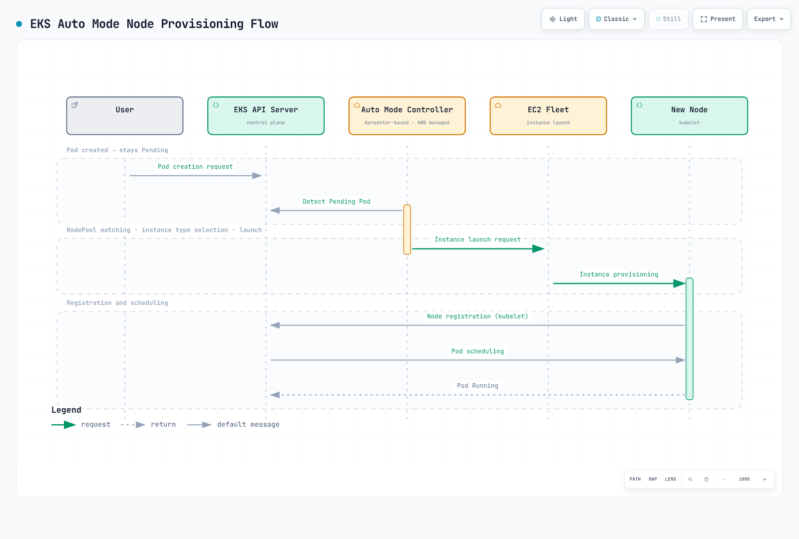

# EKS Auto Mode Operations Guide

> **Supported Versions**: EKS Auto Mode GA; example baseline EKS 1.36
> **Last Updated**: September 12, 2026

Amazon EKS Auto Mode is a feature that fully automates Kubernetes node management, automatically provisioning and optimizing nodes based on workload requirements. This guide covers Auto Mode concepts, configuration and operational considerations. AWS manages the Auto Mode infrastructure; you still own application availability, resource requests, security, monitoring and cluster/VPC configuration. Examples require validation in your environment before production use.

### July 2026 Update: EFA and Placement Group Support

On July 22, 2026, AWS announced that EKS Auto Mode (and open-source Karpenter) node pools now support Elastic Fabric Adapter (EFA) network device configuration and EC2 placement groups. Network interfaces on EFA-capable instances can be configured as EFA-only or standard ENI — EFA-only interfaces do not consume VPC IP addresses while still delivering full interconnect bandwidth — and instances can be launched with cluster, spread, or partition placement strategies directly from the node pool configuration. This is aimed at distributed training/inference workloads that need maximum throughput or fault isolation. See the [announcement](https://aws.amazon.com/about-aws/whats-new/2026/07/amazon-eks-efa-placement-groups/) for details.

### July 2026 Update: ARC Zonal Shift Support

As of July 10, 2026, EKS Auto Mode clusters support Amazon Application Recovery Controller (ARC) zonal shift and autoshift. Because Auto Mode manages compute on your behalf, you get zonal shift support without setting flags or managing Karpenter versions — simply enable ARC zonal shift on the cluster. When a zonal shift is activated, Auto Mode stops provisioning new capacity in the impaired AZ and halts voluntary disruptions such as consolidation and drift for nodes in that zone. It also prevents voluntary disruptions in healthy AZs when replacement scheduling would depend on the impaired AZ. Auto Mode needs no additional Karpenter flag, but ARC zonal autoshift must be separately configured after cluster registration. Zonal shift does not make a zonal volume or strict AZ-bound workload portable. ARC has no additional zonal-shift charge; replacement capacity and normal infrastructure charges still apply. See the [announcement](https://aws.amazon.com/about-aws/whats-new/2026/07/eks-auto-mode-arc-zonal-shift) and the [ARC zonal shift documentation](https://docs.aws.amazon.com/eks/latest/userguide/zone-shift-enable.html) for details.

## Table of Contents

1. [Getting Started with Auto Mode](./01-getting-started.md) - Cluster creation and enabling Auto Mode
2. [NodePool Configuration and Optimization](./02-nodepool-configuration.md) - Default and custom NodePools
3. [Understanding Scaling Behavior](./03-scaling-behavior.md) - Provisioning, consolidation, drift detection
4. [Spot Instance Utilization Strategies](./04-spot-strategies.md) - Mixed capacity and interrupt handling
5. [Operations and Management](./05-operations.md) - Disruption budgets, rolling replacement, monitoring
6. [Cost Management and Optimization](./06-cost-management.md) - Cost analysis, Spot savings, right-sizing
7. [Node Lifecycle Management](./07-node-lifecycle.md) - Expiration, AMI management, freshness policies
8. [Workload-Specific Optimization](./08-workload-optimization.md) - Web, batch, GPU, AI/ML workloads
9. [Migrating from Managed Node Groups](./09-migration-guide.md) - Migration steps and coexistence

---

## Introduction to EKS Auto Mode

### What is Auto Mode?

EKS Auto Mode is a fully automated node management solution managed by AWS. It is based on Karpenter internally; AWS operates the managed infrastructure controllers. Users configure workload constraints, custom NodePools/NodeClasses and disruption budgets rather than installing a separate Karpenter controller for Auto Mode.

```
+-----------------------------------------------------------------------------+
|                           EKS Auto Mode Architecture                         |
+-----------------------------------------------------------------------------+
|                                                                              |
|  +---------------------------------------------------------------------+    |
|  |                    EKS Control Plane (AWS Managed)                   |    |
|  |  +------------+  +------------+  +------------+  +------------+    |    |
|  |  | API Server |  |   etcd     |  | Controller |  |  Karpenter |    |    |
|  |  |            |  |            |  |  Manager   |  | Controller |    |    |
|  |  +------------+  +------------+  +------------+  +------------+    |    |
|  +---------------------------------------------------------------------+    |
|                                    |                                         |
|                                    v                                         |
|  +---------------------------------------------------------------------+    |
|  |                        NodePool Resources                            |    |
|  |  +------------------+  +------------------+  +------------------+  |    |
|  |  |  general-purpose |  |      system      |  |   custom-pool    |  |    |
|  |  | (Default Provided)|  | (Default Provided)|  |  (User Defined)  |  |    |
|  |  +------------------+  +------------------+  +------------------+  |    |
|  +---------------------------------------------------------------------+    |
|                                    |                                         |
|                                    v                                         |
|  +---------------------------------------------------------------------+    |
|  |                     EC2 Instances (Auto Managed)                     |    |
|  |  +--------------+  +--------------+  +--------------+              |    |
|  |  |   m6i.2xl    |  |   c7g.xl     |  |   r6i.4xl    |   ...        |    |
|  |  |  (On-Demand) |  |   (Spot)     |  |  (On-Demand) |              |    |
|  |  +--------------+  +--------------+  +--------------+              |    |
|  +---------------------------------------------------------------------+    |
|                                                                              |
+-----------------------------------------------------------------------------+
```

### Comparison with Existing Management Methods

| Feature | Managed Node Groups | Fargate | Auto Mode |
|---------|---------------------|---------|-----------|
| Node management | AWS manages node groups; you configure capacity and updates | AWS manages per-Pod infrastructure | AWS manages launched nodes and infrastructure controllers |
| Scaling | Cluster Autoscaler if installed, or explicit group scaling | Per-Pod provisioning with Fargate profiles | Karpenter-based provisioning for unschedulable Pods |
| Provisioning time | Depends on capacity, bootstrap and workload | Depends on capacity, images and workload; not instantaneous | Depends on capacity, bootstrap, images and constraints; no fixed-time guarantee |
| Instance selection | Configured instance types | Managed compute sizes | Selection within NodePool and workload constraints |
| Spot | Supported by managed node groups | Not supported on EKS Fargate | Supported when permitted by a NodePool |
| GPU workloads | Supported on appropriate nodes | Not supported | Supported on compatible accelerated instances; workload/runtime requirements still apply |
| DaemonSets | Supported | Not supported | Supported within managed-node restrictions |
| Cost control | Requests, instance choices and autoscaler policies | Pod resource sizing and replicas | Requests, allowed capacity and consolidation policies; no guaranteed savings |
| Host customization | AMI/launch-template options | No host customization | AWS-managed Bottlerocket variants; supported NodeClass settings |

### Internal Architecture and Operating Principles

The Karpenter-based controller is operated by AWS, outside your worker nodes. The drawings are conceptual: the scheduler identifies unschedulable Pods and later binds them to nodes; the API server stores the objects. A Pod being Pending alone does not establish that adding a node will solve its problem.



[🔍 View interactive diagram](https://www.atomai.click/kubernetes-docs/archmaps/en-eks-auto-mode-readme-0.html)

### Supported Regions and Limitations

#### Regions and supported versions

The [EKS FAQ](https://aws.amazon.com/eks/faqs/) lists Auto Mode in EKS regions, including GovCloud (US), except China regions. Check regional instance/feature availability separately. The earlier short region list was not exhaustive.

The FAQ's original `1.29+` feature floor does not mean that every such version can still be created or is in standard support. On September 12, 2026, EKS 1.34–1.36 are in standard support; the examples use 1.36. Consult the [current EKS version calendar](https://docs.aws.amazon.com/eks/latest/userguide/kubernetes-versions.html) for lifecycle dates and extended-support charges.

#### Constraints to check

| Item | Guidance |
|------|----------|
| Capacity and scale | Check applied EKS/EC2 quotas, subnet IP capacity and workload constraints; validate the intended scale in your environment |
| NodePool limits | User-defined resource limits differ from AWS account/service quotas; validate scale and replacement headroom |
| Operating system | AWS selects its managed Bottlerocket variant; AL2023 or arbitrary custom AMIs are not an Auto Mode AMI choice |
| Windows | Auto Mode does not provide Windows nodes; use a compatible separate node group where needed |
| DNS and storage | Auto Mode nodes provide local CoreDNS; mixed clusters retain CoreDNS for other nodes. Managed node-disk encryption does not establish encryption for every dynamic PVC; set the StorageClass explicitly |

Use [Service Quotas](https://docs.aws.amazon.com/eks/latest/userguide/service-quotas.html) and the [NodeClass reference](https://docs.aws.amazon.com/eks/latest/userguide/create-node-class.html) to verify the relevant constraints. Actual account quotas and instance capacity were not queried during this audit.

---

## Next Steps

After successfully configuring EKS Auto Mode, we recommend learning the following topics:

1. **[EKS Cost Optimization](../eks/07-eks-cost-optimization.md)**: Spot, Savings Plans, resource optimization
2. **[EKS Monitoring and Logging](../eks/06-eks-monitoring-logging.md)**: CloudWatch, Prometheus, Grafana
3. **[EKS Security](../eks/05-eks-security.md)**: IAM, network policies, Pod security
4. **[Karpenter Deep Dive](../autoscaling/02-karpenter.md)**: Direct Karpenter installation and advanced features

## Related Quiz

To test your learning, try the [EKS Auto Mode Quiz](../quizzes/eks-auto-mode/01-getting-started-quiz.md).

---

## References

- [AWS EKS Auto Mode Official Documentation](https://docs.aws.amazon.com/eks/latest/userguide/automode.html)
- [Karpenter Official Documentation](https://karpenter.sh/)
- [EKS Best Practices Guide](https://docs.aws.amazon.com/eks/latest/best-practices/)
- [AWS Cost Optimization Guide](https://aws.amazon.com/pricing/cost-optimization/)
- [New EKS Auto Mode features for enhanced security, network control, and performance (AWS Containers Blog, 2025-10-16)](https://aws.amazon.com/blogs/containers/new-amazon-eks-auto-mode-features-for-enhanced-security-network-control-and-performance/)
- [Migrate from self-managed Karpenter to EKS Auto Mode](https://docs.aws.amazon.com/eks/latest/userguide/auto-migrate-karpenter.html)

- [Auto Mode architecture and responsibilities](https://docs.aws.amazon.com/eks/latest/userguide/automode.html)
- [EKS Fargate restrictions](https://docs.aws.amazon.com/eks/latest/userguide/fargate.html)

---

< [Back to EKS Topics](../README.md) | [Next: Getting Started](./01-getting-started.md) >
