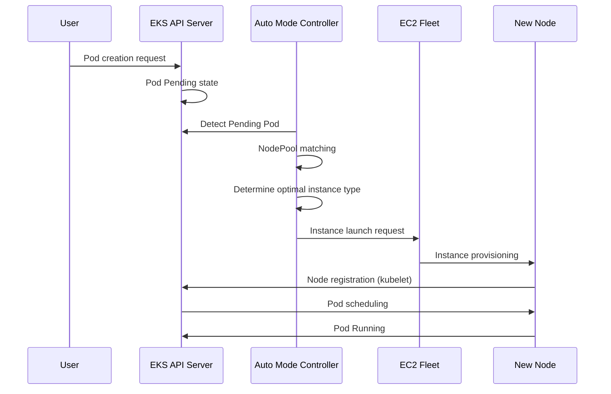

# EKS Auto Mode Operations Guide

> **Supported Versions**: EKS 1.29+, EKS Auto Mode GA
> **Last Updated**: July 21, 2026

Amazon EKS Auto Mode is a feature that fully automates Kubernetes node management, automatically provisioning and optimizing nodes based on workload requirements. This guide covers the concepts of EKS Auto Mode, configuration methods, and best practices for production environments.

### July 2026 Update: ARC Zonal Shift Support

As of July 10, 2026, EKS Auto Mode clusters support Amazon Application Recovery Controller (ARC) zonal shift and autoshift. Because Auto Mode manages compute on your behalf, you get zonal shift support without setting flags or managing Karpenter versions — simply enable ARC zonal shift on the cluster. When a zonal shift is activated, Auto Mode stops provisioning new capacity in the impaired AZ and halts voluntary disruptions such as consolidation and drift for nodes in that zone. There is no additional cost; see the [announcement](https://aws.amazon.com/about-aws/whats-new/2026/07/eks-auto-mode-arc-zonal-shift) and the [ARC zonal shift documentation](https://docs.aws.amazon.com/eks/latest/userguide/zone-shift.html) for details.

## Table of Contents

1. [Getting Started with Auto Mode](./01-getting-started.md) - Cluster creation and enabling Auto Mode
2. [NodePool Configuration and Optimization](./02-nodepool-configuration.md) - Default and custom NodePools
3. [Understanding Scaling Behavior](./03-scaling-behavior.md) - Provisioning, consolidation, drift detection
4. [Spot Instance Utilization Strategies](./04-spot-strategies.md) - Mixed capacity and interrupt handling
5. [Operations and Management](./05-operations.md) - Disruption budgets, rolling replacement, monitoring
6. [Cost Management and Optimization](./06-cost-management.md) - Cost analysis, Spot savings, right-sizing
7. [Node Lifecycle Management](./07-node-lifecycle.md) - Expiration, AMI management, freshness policies
8. [Workload-Specific Optimization](./08-workload-optimization.md) - Web, batch, GPU, AI/ML workloads
9. [Migrating from Managed Node Groups](./09-migration-guide.md) - Migration steps and coexistence

---

## Introduction to EKS Auto Mode

### What is Auto Mode?

EKS Auto Mode is a fully automated node management solution managed by AWS. It is based on Karpenter internally, and AWS manages everything without users needing to install or configure separate node management components.

```
+-----------------------------------------------------------------------------+
|                           EKS Auto Mode Architecture                         |
+-----------------------------------------------------------------------------+
|                                                                              |
|  +---------------------------------------------------------------------+    |
|  |                    EKS Control Plane (AWS Managed)                   |    |
|  |  +------------+  +------------+  +------------+  +------------+    |    |
|  |  | API Server |  |   etcd     |  | Controller |  |  Karpenter |    |    |
|  |  |            |  |            |  |  Manager   |  | Controller |    |    |
|  |  +------------+  +------------+  +------------+  +------------+    |    |
|  +---------------------------------------------------------------------+    |
|                                    |                                         |
|                                    v                                         |
|  +---------------------------------------------------------------------+    |
|  |                        NodePool Resources                            |    |
|  |  +------------------+  +------------------+  +------------------+  |    |
|  |  |  general-purpose |  |      system      |  |   custom-pool    |  |    |
|  |  | (Default Provided)|  | (Default Provided)|  |  (User Defined)  |  |    |
|  |  +------------------+  +------------------+  +------------------+  |    |
|  +---------------------------------------------------------------------+    |
|                                    |                                         |
|                                    v                                         |
|  +---------------------------------------------------------------------+    |
|  |                     EC2 Instances (Auto Managed)                     |    |
|  |  +--------------+  +--------------+  +--------------+              |    |
|  |  |   m6i.2xl    |  |   c7g.xl     |  |   r6i.4xl    |   ...        |    |
|  |  |  (On-Demand) |  |   (Spot)     |  |  (On-Demand) |              |    |
|  |  +--------------+  +--------------+  +--------------+              |    |
|  +---------------------------------------------------------------------+    |
|                                                                              |
+-----------------------------------------------------------------------------+
```

### Comparison with Existing Management Methods

| Feature | Managed Node Groups | Fargate | Auto Mode |
|---------|---------------------|---------|-----------|
| Node Management | User (ASG-based) | Fully AWS Managed | Fully AWS Managed |
| Scaling Method | Cluster Autoscaler | Per-Pod | Karpenter-based |
| Scaling Speed | Minutes | Immediate (Pod schedule) | Tens of seconds |
| Instance Type Selection | Pre-defined | Automatic | Auto-optimized |
| Spot Support | Manual configuration | Not supported | Auto-managed |
| GPU Workloads | Supported | Limited | Fully supported |
| DaemonSet Support | Supported | Not supported | Supported |
| Cost Optimization | Manual | Medium | Automatic |
| Complexity | High | Low | Low |
| Customization | High | Low | Medium |

### Internal Architecture and Operating Principles

EKS Auto Mode operates based on Karpenter, but runs within the AWS-managed control plane.



### Supported Regions and Limitations

#### Supported Regions (as of February 2025)

EKS Auto Mode is available in the following regions:

- **Americas**: us-east-1, us-east-2, us-west-1, us-west-2
- **Europe**: eu-west-1, eu-west-2, eu-central-1, eu-north-1
- **Asia Pacific**: ap-northeast-1, ap-northeast-2, ap-southeast-1, ap-southeast-2, ap-south-1

#### Limitations

| Item | Limit |
|------|-------|
| Maximum NodePools per cluster | 100 |
| Maximum nodes per NodePool | 1000 |
| Maximum nodes per cluster | 5000 |
| Minimum EKS version | 1.29 |
| Supported AMI families | AL2023, Bottlerocket |
| Windows nodes | Not supported |

---

## Next Steps

After successfully configuring EKS Auto Mode, we recommend learning the following topics:

1. **[EKS Cost Optimization](../eks/07-eks-cost-optimization.md)**: Spot, Savings Plans, resource optimization
2. **[EKS Monitoring and Logging](../eks/06-eks-monitoring-logging.md)**: CloudWatch, Prometheus, Grafana
3. **[EKS Security](../eks/05-eks-security.md)**: IAM, network policies, Pod security
4. **[Karpenter Deep Dive](../autoscaling/02-karpenter.md)**: Direct Karpenter installation and advanced features

## Related Quiz

To test your learning, try the [EKS Auto Mode Quiz](../quizzes/eks-auto-mode/01-getting-started-quiz.md).

---

## References

- [AWS EKS Auto Mode Official Documentation](https://docs.aws.amazon.com/eks/latest/userguide/automode.html)
- [Karpenter Official Documentation](https://karpenter.sh/)
- [EKS Best Practices Guide](https://aws.github.io/aws-eks-best-practices/)
- [AWS Cost Optimization Guide](https://aws.amazon.com/pricing/cost-optimization/)
- [New EKS Auto Mode features for enhanced security, network control, and performance (AWS Containers Blog, 2025-10-16)](https://aws.amazon.com/blogs/containers/new-amazon-eks-auto-mode-features-for-enhanced-security-network-control-and-performance/)
- [Migrate from self-managed Karpenter to EKS Auto Mode](https://docs.aws.amazon.com/eks/latest/userguide/auto-migrate-karpenter.html)

---

< [Back to EKS Topics](../README.md) | [Next: Getting Started](./01-getting-started.md) >
