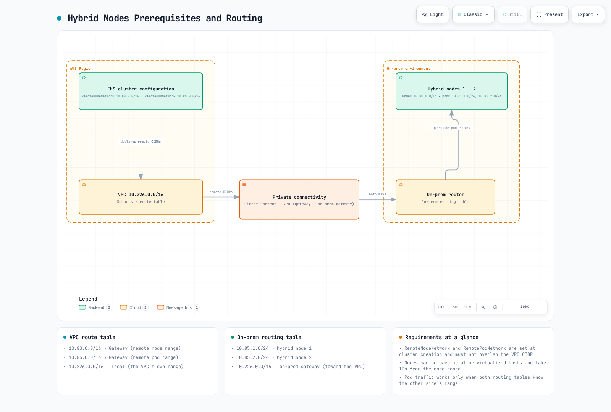

# Prerequisites

> **Supported Versions**: Examples reviewed for EKS 1.36 / hybrid nodeadm 1.0.20; OS-specific requirements below
> **Last Updated**: September 12, 2026

Prepare host, network, credentials and cluster access before joining a hybrid node. Local schema/crypto/input checks do not validate your physical network, GPU runtime or production cluster. No cloud, host-network, GPU-driver or image-build changes were executed during this audit.



[🔍 View interactive diagram](https://www.atomai.click/kubernetes-docs/archmaps/en-eks-hybrid-nodes-prereq-0.html)

## Operating Systems and Runtime

| AWS-validated hybrid integration | Versions / scope |
|---------------------------------|------------------|
| Ubuntu | 20.04, 22.04, 24.04; separately review distribution security maintenance |
| RHEL | 8, 9; review kernel/CNI and Red Hat subscription/support |
| AL2023 | On-premises **virtualized** environments; not generic bare metal or AWS OS-support entitlement outside EC2 |
| Bottlerocket | VMware variants v1.37.0+, available for Kubernetes 1.28+, **x86_64 only**; distinct bootstrap procedure |

These floors do not make old Kubernetes releases currently EKS-supported. Choose an active EKS version and matching OS/runtime/CNI cohort. AWS supports Ubuntu/RHEL hybrid integration, not the vendor's OS maintenance itself.

SSM new installations/upgrades require **nodeadm 1.0.19+** because older binaries contain an outdated SSM signing key. The reviewed release is **v1.0.20**. Use hybrid nodeadm, not the similarly named EC2 EKS AMI tool.

EKS kube-proxy 1.31+ on ARM requires ARMv8.2+crypto. Pre-Pi-5/Cortex-A72 hardware fails that requirement; a Pi 5 CPU alone does not validate the complete stack. The old kube-proxy 1.30 workaround ended EKS extended support in July 2026.

Containerd is required; Docker Engine is not. A “containerd 1.6+” or Docker version check does not establish current CRI compatibility.

| OS / choice | nodeadm containerd source |
|-------------|--------------------------|
| Ubuntu / AL2023 | `distro` is the supported default |
| RHEL | `docker`, or `none` with a compatible preinstalled runtime; `distro` is invalid |
| AL2023 | `docker` is not supported |
| Manual runtime installation | `none` skips installation; it does not supply a runtime |

Ubuntu 24.04's historical Pod-termination/AppArmor fix needed containerd 1.7.19+ or the appropriate AppArmor update. This is not an old-version install recommendation. Review the chosen CNI's kernel requirements; neither “kernel 5.4+” nor blindly replacing the kernel is sufficient.

### Sizing and host inspection

AWS recommends at least **1 vCPU / 1 GiB RAM**, while explicitly stating there is no strict universal minimum. Add capacity for OS/runtime/CNI/agents, images/logs and actual workloads. The former quiz's two-core/two-GB minimum was inconsistent.

The old 20/50/100GB disk, 2/4-core and 4/8GB RAM figures were planning examples, not validated workload sizes.

```bash
# Run these read-only checks on the intended hybrid host.
cat /etc/os-release
uname -m
uname -r
free -h
df -h /
swapon --show
ip -j link show
# When already installed, inspect the actual CRI runtime:
containerd --version
```

A binary version does not prove kubelet uses that runtime socket. Review swap, cgroups, forwarding, CNI modules and firewalls through the host owner. Blanket swapoff/fstab/sysctl/MTU edits are not portable across all supported hosts.

### Install, validate, then init

For prepared Ubuntu/AL2023 hosts, the sequence below installs dependencies before joining. RHEL needs the runtime source described above; Bottlerocket uses a different path.

```bash
set -euo pipefail
# Installation/bootstrap sequence for prepared Ubuntu/AL2023 hosts.
# RHEL requires --containerd-source docker, or none with a preinstalled compatible runtime.
# These commands mutate the host; review OS/runtime/network/identity first.
sudo nodeadm install 1.36 --credential-provider ssm --containerd-source distro \
  --region ap-northeast-2 --timeout 20m
sudo nodeadm config check -c file:///etc/eks/nodeConfig.yaml
sudo nodeadm init -c file:///etc/eks/nodeConfig.yaml
```

The node config must already contain the intended cluster/provider inputs. Protect credential-bearing config files with mode 0600 and keep activation codes out of golden images and logs. These commands mutate the host. Do not skip validation phases to hide failures. `nodeadm upgrade` is disruptive and requires workload evacuation.

## Packer Image Preparation

AWS examples cover Ubuntu 22.04/24.04 and RHEL 8/9 with vSphere OVA and QEMU qcow2/raw targets. The reviewed **v1.0.20 template is not a ready EKS 1.36 image pipeline**:

- `K8S_VERSION` validation still permits only 1.26–1.31. Maintain a reviewed current fork; do not downgrade to satisfy the example.
- `NODEADM_ARCH` expects **`amd` or `arm`**, then appends `64`; the former `amd64` becomes `amd6464`.
- Packer's `CREDENTIAL_PROVIDER=iam` maps to nodeadm's **`iam-ra`**.
- The actual file is `hybrid-nodes-template.pkr.hcl`; no `general-build.qemu.al2023` source exists.
- Review mutable `releases/latest` downloads, vSphere `insecure_connection=true`, default builder passwords and global variable requirements. RHEL provisioners hardcode x86 repositories; changing the binary architecture alone is not an ARM build.

| Input group | Review |
|-------------|--------|
| Tools | Packer ≥1.11, vSphere plugin ≥1.4 or QEMU 1.x; pin a tested combination |
| Common | `ISO_URL`, verified `ISO_CHECKSUM`, `PKR_SSH_PASSWORD`, `K8S_VERSION`, `NODEADM_ARCH`, `CREDENTIAL_PROVIDER` |
| RHEL | `RH_USERNAME`, `RH_PASSWORD`, `RHEL_VERSION`; exclude secrets from final images/logs |
| vSphere | Server/user/password, datacenter, cluster, datastore, network, **VSPHERE_OUTPUT_FOLDER** |
| QEMU | **PACKER_OUTPUT_FORMAT** (`qcow2`/`raw`), CPU/virtualization compatibility |

The source also includes billable AWS AMI builders; that is not permission to run cloud machines as hybrid nodes. Validate a maintained template and resulting image. No Packer/VM build was performed here.

## GPU Compatibility

Check GPU variant, CPU architecture, OS/kernel, supported NVIDIA driver, container toolkit/runtime, CUDA/framework image and memory together. The former driver 525/535/545/550 and CUDA 11.8/12.x values mixed historical minima and recommendations; they are not universal current Hybrid Nodes requirements.

H100 80GB, H200 141GB, A100 40/80GB and L40S 48GB are example variants, not a complete certified list. Four GB is not a meaningful minimum for every model. A host CUDA compiler is not required merely to run a correctly packaged GPU container; driver and compiler versions mean different things.

```bash
# On a host where the driver is already installed:
nvidia-smi --query-gpu=name,driver_version,memory.total --format=csv,noheader
# Optional: nvcc reports the locally installed compiler, if present.
if command -v nvcc >/dev/null 2>&1; then nvcc --version; fi
```

Use the current NVIDIA compatibility/platform instructions for the chosen cohort. Stage driver/kernel changes on a drained test host. Installing an old driver branch or restarting containerd on a live worker is not a harmless prerequisite check.

## Network, CIDRs and MTU

Hybrid Nodes requires reliable **private bidirectional connectivity**, including control-plane access to kubelet and hybrid-hosted webhooks. Public API access changes node→API traffic, not the required private reverse path.

AWS's **100 Mbps / ≤200ms RTT** is general guidance, not a strict universal minimum. The old 10Gbps/5ms, packet-loss 0.1%/0.01% and MTU 1500/9000 values are unverified planning examples. Test actual demand and encapsulation/path MTU; do not set every NIC to 9000.

Remote node/Pod CIDRs use IPv4 RFC1918 or CGNAT, without overlap with each other, VPC or service networks. Up to 15 CIDRs of each remote kind fit inside **one** remote-node-network and **one** remote-pod-network wrapper. Pod routing across clusters also needs deliberate separation.

Save a reviewed `network-plan.json`:

```json
{
  "vpcCidrs": [
    "10.0.0.0/16"
  ],
  "serviceCidrs": [
    "10.100.0.0/16"
  ],
  "remoteNodeCidrs": [
    "10.80.0.0/16"
  ],
  "remotePodCidrs": [
    "10.85.0.0/16"
  ]
}
```
```bash
: "${NETWORK_PLAN_JSON:?Set the reviewed local network plan JSON}"
export NETWORK_PLAN_JSON
python3 - <<'PY'
import ipaddress, itertools, json, os
from pathlib import Path
plan = json.loads(Path(os.environ["NETWORK_PLAN_JSON"]).read_text())
allowed = [ipaddress.ip_network(c) for c in ("10.0.0.0/8", "172.16.0.0/12", "192.168.0.0/16", "100.64.0.0/10")]
groups = {}
for key in ("vpcCidrs", "serviceCidrs", "remoteNodeCidrs", "remotePodCidrs"):
    values = plan[key]
    if not isinstance(values, list) or not values:
        raise SystemExit(f"{key} must be a nonempty list for this example")
    groups[key] = [ipaddress.ip_network(v, strict=True) for v in values]
    if any(n.version != 4 for n in groups[key]):
        raise SystemExit("This Hybrid Nodes plan requires IPv4")
for key in ("remoteNodeCidrs", "remotePodCidrs"):
    if len(groups[key]) > 15 or any(not any(n.subnet_of(a) for a in allowed) for n in groups[key]):
        raise SystemExit("Remote CIDRs must use RFC1918/CGNAT ranges, at most 15 per kind")
flat = [(key, n) for key, networks in groups.items() for n in networks]
for (ka, a), (kb, other) in itertools.combinations(flat, 2):
    if a.overlaps(other):
        raise SystemExit(f"Overlapping CIDRs: {ka} {a}, {kb} {other}")
print("CIDR syntax/range/non-overlap checks passed; routing and reachability remain unverified")
PY
```

This checks syntax/ranges/overlap, not reachability. Configure VPC return routes through the real TGW/VGW and on-premises return/per-node Pod routes.

| Flow | Review |
|------|--------|
| Remote node/Pod → API TCP443 | Additional cluster SG ingress for the intended CIDRs |
| Control-plane ENI → node TCP10250 | Restricted cluster egress, private route and on-prem host/firewall ingress |
| Control plane → webhook | Actual Pod IP, port, routes and firewall |
| Host/Pod → credentials/images/DNS/time | Provider endpoints, registry, DNS and clock synchronization |

TCP10250 is not kubelet ingress into the API-server SG. EKS alone does not create all custom remote rules; eksctl may automate VPC-side resources it owns. Check actual rule quotas instead of treating 60 as an immutable maximum.

AWS recommends public-only or private-only. With both enabled, nodes outside the VPC resolve public addresses and **can** fail to join if paths/access rules differ. This is not categorical API rejection. Private-only also needs private DNS and administrative reachability.

## Provider-Specific Credentials

Prepare AWS inputs with the intended administrator identity. Keep activation material in a private directory:

```bash
set -euo pipefail
: "${EXPECTED_ACCOUNT_ID:?Set the intended account}"
: "${AWS_REGION:?Set the intended Region}"
: "${CLUSTER_NAME:?Set the intended cluster}"
check_account() {
  local actual
  actual=$(aws sts get-caller-identity --region "$AWS_REGION" --query Account --output text) || return
  test "$actual" = "$EXPECTED_ACCOUNT_ID" || { printf 'Account mismatch.\n' >&2; return 1; }
}
check_account
umask 077
export WORK_DIR
WORK_DIR=$(mktemp -d "$PWD/hybrid-preflight.XXXXXXXX")
export EXPECTED_ACCOUNT_ID AWS_REGION CLUSTER_NAME
printf 'Private preparation directory: %s\n' "$WORK_DIR"
```

SSM and Roles Anywhere both require AWS connectivity. A local CA or longer cached credentials do not create an offline control plane.

### SSM role and activation

The role needs `eks:DescribeCluster`, ECR pull and SSM core/cleanup permissions. **AmazonEKSWorkerNodeMinimalPolicy alone does not supply DescribeCluster.** Pod Identity's `eks-auth:AssumeRoleForPodIdentity` permission is separate.

Replace example account/Region/cluster values consistently. The list operation below lacks per-instance resource scoping, so its wildcard is restricted to the intended Region:

```json
{
  "Version": "2012-10-17",
  "Statement": [
    {
      "Effect": "Allow",
      "Principal": {
        "Service": "ssm.amazonaws.com"
      },
      "Action": "sts:AssumeRole",
      "Condition": {
        "StringEquals": {
          "aws:SourceAccount": "123456789012"
        },
        "ArnLike": {
          "aws:SourceArn": "arn:aws:ssm:ap-northeast-2:123456789012:*"
        }
      }
    }
  ]
}
```
```json
{
  "Version": "2012-10-17",
  "Statement": [
    {
      "Effect": "Allow",
      "Action": "eks:DescribeCluster",
      "Resource": "arn:aws:eks:ap-northeast-2:123456789012:cluster/my-hybrid-cluster"
    },
    {
      "Effect": "Allow",
      "Action": "ssm:DescribeInstanceInformation",
      "Resource": "*",
      "Condition": {
        "StringEquals": {
          "aws:RequestedRegion": "ap-northeast-2"
        }
      }
    },
    {
      "Effect": "Allow",
      "Action": "ssm:DeregisterManagedInstance",
      "Resource": "arn:aws:ssm:ap-northeast-2:123456789012:managed-instance/*",
      "Condition": {
        "StringEquals": {
          "ssm:resourceTag/EKSClusterARN": "arn:aws:eks:ap-northeast-2:123456789012:cluster/my-hybrid-cluster"
        }
      }
    }
  ]
}
```

Attach reviewed `AmazonEC2ContainerRegistryPullOnly` and `AmazonSSMManagedInstanceCore` or equivalent permissions. The activation's `EKSClusterARN` tag must match the deregistration policy.

Prepare a deliberate registration limit and 24-hour **registration** expiry:

```bash
: "${HYBRID_ROLE_NAME:?Use the reviewed SSM-trusting role name}"
: "${REGISTRATION_LIMIT:?Set a deliberate node registration limit}"
export HYBRID_ROLE_NAME REGISTRATION_LIMIT
python3 - <<'PY'
import json, os, re
from datetime import datetime, timedelta, timezone
from pathlib import Path
account, region, cluster = (os.environ[k] for k in ("EXPECTED_ACCOUNT_ID", "AWS_REGION", "CLUSTER_NAME"))
if not re.fullmatch(r"\d{12}", account) or not re.fullmatch(r"[a-z]{2}(?:-[a-z]+)+-\d", region):
    raise SystemExit("Invalid account/Region")
if region.startswith(("cn-", "us-gov-")):
    raise SystemExit("Hybrid Nodes is not available in this Region family")
if not re.fullmatch(r"[A-Za-z0-9][A-Za-z0-9_-]{0,99}", cluster):
    raise SystemExit("Invalid cluster name")
role = os.environ["HYBRID_ROLE_NAME"]
if not re.fullmatch(r"[\w+=,.@-]{1,64}", role, re.ASCII):
    raise SystemExit("Use the actual IAM role name, not a role ARN")
limit = int(os.environ["REGISTRATION_LIMIT"])
if not 1 <= limit <= 1000:
    raise SystemExit("RegistrationLimit must be 1..1000; also review account tier/quota")
body = {"DefaultInstanceName": "eks-hybrid-node", "IamRole": role, "RegistrationLimit": limit,
        "Description": "Reviewed EKS hybrid activation",
        "Tags": [{"Key": "EKSClusterARN", "Value": f"arn:aws:eks:{region}:{account}:cluster/{cluster}"}],
        "ExpirationDate": (datetime.now(timezone.utc) + timedelta(hours=24)).isoformat()}
(Path(os.environ["WORK_DIR"]) / "activation-request.json").write_text(json.dumps(body, indent=2) + "\n")
PY
```
```bash
set -euo pipefail
# Run only after the role/trust/tag policy and registration scope are prepared.
check_account
aws ssm create-activation --region "$AWS_REGION" \
  --cli-input-json "file://$WORK_DIR/activation-request.json" --output json \
  > "$WORK_DIR/activation-response.json"
chmod 600 "$WORK_DIR/activation-response.json"
# The response contains the secret ActivationCode. Do not print or commit it.
```

ActivationCode is returned once; distribute it securely with ActivationId. Expiration/deletion of the activation is not deregistration of existing managed instances. The per-activation 1–1,000 limit and account standard/advanced tiers are separate.

SSM uses an `mi-...` node name and fixed one-hour credentials. Refresh backoff can delay reconnection after a network outage. Do not log credentials.

### Roles Anywhere trust and duration

Use a provider-appropriate role, trust anchor and profile. Bind session name to certificate identity/nodeName; the previous PrincipalTag/RequestTag comparison did not do this.

```json
{
  "Version": "2012-10-17",
  "Statement": [
    {
      "Effect": "Allow",
      "Principal": {
        "Service": "rolesanywhere.amazonaws.com"
      },
      "Action": [
        "sts:TagSession",
        "sts:SetSourceIdentity"
      ],
      "Condition": {
        "ArnEquals": {
          "aws:SourceArn": "arn:aws:rolesanywhere:ap-northeast-2:123456789012:trust-anchor/11111111-2222-3333-4444-555555555555"
        }
      }
    },
    {
      "Effect": "Allow",
      "Principal": {
        "Service": "rolesanywhere.amazonaws.com"
      },
      "Action": "sts:AssumeRole",
      "Condition": {
        "ArnEquals": {
          "aws:SourceArn": "arn:aws:rolesanywhere:ap-northeast-2:123456789012:trust-anchor/11111111-2222-3333-4444-555555555555"
        },
        "StringEquals": {
          "sts:RoleSessionName": "${aws:PrincipalTag/x509Subject/CN}"
        }
      }
    }
  ]
}
```
```json
{
  "name": "hybrid-node-profile",
  "roleArns": [
    "arn:aws:iam::123456789012:role/EKSHybridNodeRole"
  ],
  "enabled": true,
  "acceptRoleSessionName": true,
  "durationSeconds": 3600
}
```

Replace the anchor ARN, grant scoped DescribeCluster/ECR permissions, and set **acceptRoleSessionName=true**.

```text
effectiveDuration = min(profileDuration, requestedDuration)
                    or profileDuration when the request omits duration
effectiveDuration <= role.MaxSessionDuration
```

Request/profile durations are 900–43,200 seconds. **Equality is allowed** by CreateSession: profile 3,600, no override, role maximum 3,600 is valid. The previous strict “greater than” wording was inaccurate. Certificate validity/revocation and AWS reachability remain necessary.

### Per-node keys and certificates

Use a private directory on the intended new node. Generate a unique key/CSR; this example accepts a simple lowercase DNS label. Send the CSR to the approved issuer; do not place a CA signing key on nodes.

```bash
set -euo pipefail
umask 077
: "${WORK_DIR:?Set a private preparation directory on this node}"
: "${NODE_NAME:?Use a unique certificate CN / node name}"
export NODE_NAME
python3 - <<'PY'
import os, re
name = os.environ["NODE_NAME"]
if not re.fullmatch(r"[a-z0-9][a-z0-9-]{0,61}[a-z0-9]", name):
    raise SystemExit("This example requires a lowercase DNS label of 2..63 characters")
PY
test ! -e "$WORK_DIR/node.key"
test ! -e "$WORK_DIR/node.csr"
openssl genpkey -algorithm EC -pkeyopt ec_paramgen_curve:P-256 -out "$WORK_DIR/node.key"
chmod 600 "$WORK_DIR/node.key"
openssl req -new -key "$WORK_DIR/node.key" -out "$WORK_DIR/node.csr" -subj "/CN=$NODE_NAME"
# Send the CSR to the approved PKI issuer; do not copy its CA private key to nodes.
```

Verify the issued chain, approved CA, validity/revocation, key match and CN. Keep clocks synchronized. For a new node only:

```bash
set -euo pipefail
: "${ISSUED_NODE_CERT:?Set the verified certificate/chain issued for this node}"
: "${WORK_DIR:?Set the private directory containing the node key}"
# New-node installation only; do not overwrite an existing identity.
sudo test ! -e /etc/iam/pki/server.key
sudo test ! -e /etc/iam/pki/server.pem
sudo install -d -m 0700 /etc/iam/pki
sudo install -m 0644 "$ISSUED_NODE_CERT" /etc/iam/pki/server.pem
sudo install -m 0600 "$WORK_DIR/node.key" /etc/iam/pki/server.key
```

These are not the EKS Kubernetes API CA files. Do not clone node identities into images or silently overwrite an existing key.

## CloudFormation Preparation

Pinned v1.0.20 templates are provisioning starting points. The SSM template creates the role, **not the activation**. Review broad DescribeCluster scope and fixed export names before multi-cluster use.

The IRA `CertAttributeTrustPolicy` value is the literal **`${aws:PrincipalTag/x509Subject/CN}`**, not `"CN"`. This Python `cryptography` helper serializes PEM correctly and checks basic CA shape/current validity, not issuer authority or revocation:

```bash
: "${CA_PEM_FILE:?Set the approved CA certificate file, not a private key}"
: "${ROLE_NAME:?Set the new role name selected by the IaC owner}"
export CA_PEM_FILE ROLE_NAME
python3 - <<'PY'
import json, os, re
from pathlib import Path
from cryptography import x509
from datetime import datetime, timezone
raw = Path(os.environ["CA_PEM_FILE"]).read_bytes()
if b"PRIVATE KEY" in raw or raw.count(b"-----BEGIN CERTIFICATE-----") != 1:
    raise SystemExit("Provide one reviewed CA certificate")
cert = x509.load_pem_x509_certificate(raw)
if not cert.extensions.get_extension_for_class(x509.BasicConstraints).value.ca:
    raise SystemExit("Certificate is not a CA")
now = datetime.now(timezone.utc)
if not cert.not_valid_before.replace(tzinfo=timezone.utc) <= now <= cert.not_valid_after.replace(tzinfo=timezone.utc):
    raise SystemExit("CA certificate is not currently valid")
role = os.environ["ROLE_NAME"]
if not re.fullmatch(r"[\w+=,.@-]{1,64}", role, re.ASCII):
    raise SystemExit("Invalid IAM role name")
body = [
    {"ParameterKey": "RoleName", "ParameterValue": role},
    {"ParameterKey": "CertAttributeTrustPolicy", "ParameterValue": "${aws:PrincipalTag/x509Subject/CN}"},
    {"ParameterKey": "CABundleCert", "ParameterValue": raw.decode("ascii")}
]
(Path(os.environ["WORK_DIR"]) / "cfn-iamra-parameters.json").write_text(json.dumps(body, indent=2) + "\n")
PY
```

Compare parameter keys/AllowedValues with the pinned template, scope policies and namespace exports through the IaC owner, then review the change set. Do not deploy malformed PEM shorthand or an unreviewed mutable-main template.

## Cluster Access and Creation Plans

Prefer a **HYBRID_LINUX access entry** for the node IAM role:

```json
{
  "clusterName": "my-hybrid-cluster",
  "principalArn": "arn:aws:iam::123456789012:role/EKSHybridNodeRole",
  "type": "HYBRID_LINUX"
}
```

The mapping uses `system:node:{{SessionName}}` and node-bootstrap groups. Confirm API/API_AND_CONFIG_MAP authentication and ownership. Do not apply a replacement one-role `aws-auth` ConfigMap that erases existing mappings; legacy mapping changes need a controlled migration.

Replace all identifiers below with reviewed existing resources. Private-only endpoints, IPv4 and version 1.36 are explicit. The bootstrap-creator admin permission is for a controlled lab; choose production operator access deliberately.

For eksctl 0.229.0, use documented **SSM/IRA** provider values. With a supplied roleARN, prepare provider resources separately:

```yaml
apiVersion: eksctl.io/v1alpha5
kind: ClusterConfig
metadata:
  name: my-hybrid-cluster
  region: ap-northeast-2
  version: '1.36'
iam:
  serviceRoleARN: arn:aws:iam::123456789012:role/EKSClusterRole
accessConfig:
  authenticationMode: API_AND_CONFIG_MAP
  bootstrapClusterCreatorAdminPermissions: true
kubernetesNetworkConfig:
  ipFamily: IPv4
  serviceIPv4CIDR: 10.100.0.0/16
vpc:
  id: vpc-0123456789abcdef0
  subnets:
    private:
      ap-northeast-2a:
        id: subnet-0123456789abcdef0
      ap-northeast-2c:
        id: subnet-0123456789abcdef1
  controlPlaneSecurityGroupIDs:
  - sg-0123456789abcdef0
  clusterEndpoints:
    privateAccess: true
    publicAccess: false
remoteNetworkConfig:
  iam:
    provider: SSM
    roleARN: arn:aws:iam::123456789012:role/EKSHybridNodeRole
  vpcGatewayID: tgw-0123456789abcdef0
  remoteNodeNetworks:
  - cidrs:
    - 10.80.0.0/16
  remotePodNetworks:
  - cidrs:
    - 10.85.0.0/16
```

When provisioning with eksctl, use `--without-nodegroup` and an explicit private kubeconfig path. Schema validity does not prove IAM, routes or gateway reachability. The older eksctl launch-only documentation is stale: current EKS supports hybrid remote-network configuration on existing clusters through the appropriate API workflow.

Equivalent EKS CreateCluster request:

```json
{
  "name": "my-hybrid-cluster",
  "version": "1.36",
  "roleArn": "arn:aws:iam::123456789012:role/EKSClusterRole",
  "resourcesVpcConfig": {
    "subnetIds": [
      "subnet-0123456789abcdef0",
      "subnet-0123456789abcdef1"
    ],
    "securityGroupIds": [
      "sg-0123456789abcdef0"
    ],
    "endpointPrivateAccess": true,
    "endpointPublicAccess": false
  },
  "kubernetesNetworkConfig": {
    "ipFamily": "ipv4",
    "serviceIpv4Cidr": "10.100.0.0/16"
  },
  "accessConfig": {
    "authenticationMode": "API_AND_CONFIG_MAP",
    "bootstrapClusterCreatorAdminPermissions": true
  },
  "remoteNetworkConfig": {
    "remoteNodeNetworks": [
      {
        "cidrs": [
          "10.80.0.0/16"
        ]
      }
    ],
    "remotePodNetworks": [
      {
        "cidrs": [
          "10.85.0.0/16"
        ]
      }
    ]
  }
}
```

Choose one infrastructure owner; do not execute both paths. Validate real cluster/endpoint identity, operator permissions and node access before joining hosts. These example AWS identifiers are not verified resources.

## Add-ons

These documented hybrid compatibility floors are **not installation targets** for every Kubernetes version:

| Add-on | Hybrid compatibility floor |
|--------|-----------------------------|
| kube-proxy / CoreDNS | 1.25.14-eksbuild.2 / 1.9.3-eksbuild.7 |
| ADOT / CloudWatch Observability | 0.102.1-eksbuild.2 / 2.2.1-eksbuild.1 |
| Pod Identity Agent | 1.3.3-eksbuild.1 generally; **1.3.7-eksbuild.2 on Bottlerocket**, which also requires **Bottlerocket OS 1.39.0+** |
| Node monitoring / snapshot controller | 1.2.0-eksbuild.1 / 8.1.0-eksbuild.2 |
| Private CA Connector / FSx CSI / Secrets Store provider | 1.6.0-eksbuild.1 / 1.7.0-eksbuild.1 / 2.1.1-eksbuild.1 |
| Metrics Server / cert-manager | 0.7.2-eksbuild.1 / 1.17.2-eksbuild.1 |
| Node Exporter / kube-state-metrics / External DNS | 1.9.1-eksbuild.2 / 2.15.0-eksbuild.4 / 0.19.0-eksbuild.1 |

```bash
check_account
: "${ADDON_NAME:?Select one add-on to review}"
aws eks describe-addon-versions --region "$AWS_REGION" --addon-name "$ADDON_NAME" \
  --kubernetes-version 1.36 --output json > "$WORK_DIR/addon-catalog.json"
jq '[.addons[].addonVersions[] |
     {addonVersion,architecture,computeTypes,compatibilities}]' "$WORK_DIR/addon-catalog.json"
```

Review the selected version's hybrid/OS/kernel configuration. VPC CNI does not manage hybrid nodes; configure a compatible CNI and cloud-only agent placement. Catalog presence does not prove installation or readiness.

## References

- [Hybrid prerequisites](https://docs.aws.amazon.com/eks/latest/userguide/hybrid-nodes-prereqs.html)
- [Operating systems and nodeadm minimum](https://docs.aws.amazon.com/eks/latest/userguide/hybrid-nodes-os.html)
- [nodeadm reference](https://docs.aws.amazon.com/eks/latest/userguide/hybrid-nodes-nodeadm.html)
- [Hybrid networking](https://docs.aws.amazon.com/eks/latest/userguide/hybrid-nodes-networking.html)
- [Credentials and Hybrid Nodes IAM role](https://docs.aws.amazon.com/eks/latest/userguide/hybrid-nodes-creds.html)
- [Host credentials during disconnections](https://docs.aws.amazon.com/eks/latest/best-practices/hybrid-nodes-host-creds.html)
- [IAM Roles Anywhere CreateSession](https://docs.aws.amazon.com/rolesanywhere/latest/userguide/authentication-create-session.html)
- [Supported hybrid add-ons](https://docs.aws.amazon.com/eks/latest/userguide/hybrid-nodes-add-ons.html)
- [eksctl hybrid configuration](https://docs.aws.amazon.com/eks/latest/eksctl/hybrid-nodes.html)
- [Released nodeadm v1.0.20](https://github.com/aws/eks-hybrid/releases/tag/v1.0.20)
- [Pinned Packer source](https://github.com/aws/eks-hybrid/tree/v1.0.20/example/packer)
- [Pinned SSM CloudFormation template](https://github.com/aws/eks-hybrid/blob/v1.0.20/example/hybrid-ssm-cfn.yaml)
- [Pinned Roles Anywhere CloudFormation template](https://github.com/aws/eks-hybrid/blob/v1.0.20/example/hybrid-ira-cfn.yaml)
- [NVIDIA CUDA compatibility](https://docs.nvidia.com/deploy/cuda-compatibility/)
- [NVIDIA Container Toolkit installation](https://docs.nvidia.com/datacenter/cloud-native/container-toolkit/latest/install-guide.html)


< [Table of Contents](./README.md) | [Next: Network Configuration](02-network-configuration.md) >
