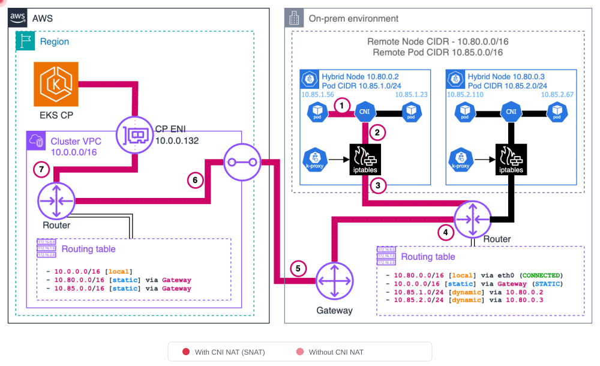
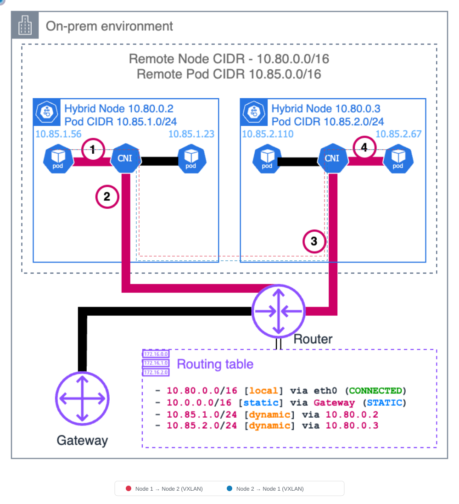
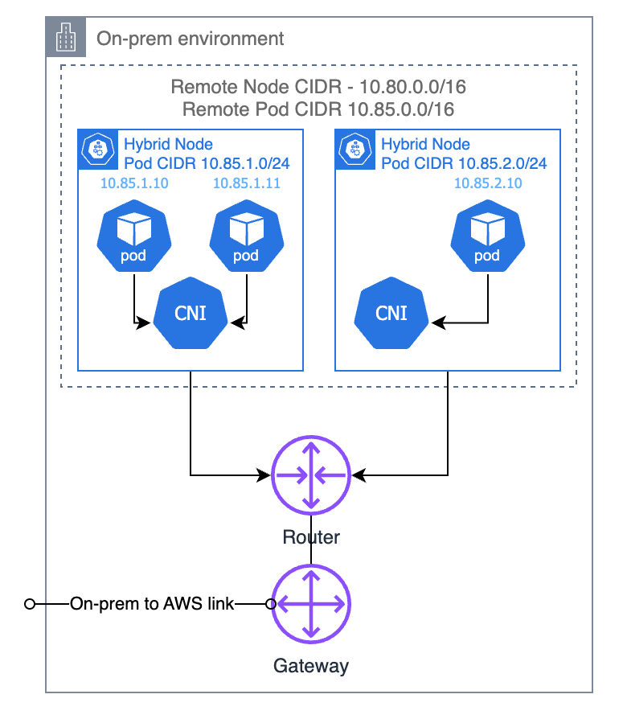
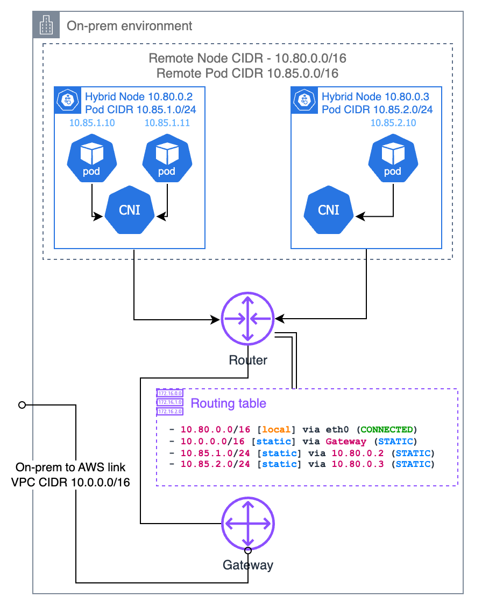

# Network Configuration

< [Previous: Prerequisites](./01-prerequisites.md) | [Table of Contents](./README.md) | [Next: Air-Gap Setup](./03-airgap-setup.md) >

> **Supported Versions**: EKS 1.31+, nodeadm 0.1+
> **Last Updated**: February 2025

This document covers the network configuration required for EKS Hybrid Nodes, including CIDR requirements, firewall rules, AWS endpoint access, security group configuration, and DNS setup.

## Network Architecture Overview

The following diagram illustrates the complete network topology for EKS Hybrid Nodes, including VPC configuration, Transit Gateway routing, remote CIDRs, and firewall rules.


## CIDR Range Requirements

On-premises node and pod CIDRs must meet the following requirements:

- Must be within **RFC-1918 ranges**: `10.0.0.0/8`, `172.16.0.0/12`, `192.168.0.0/16`
- Must **not overlap** with:
  - Each other (node CIDR and pod CIDR)
  - The VPC CIDR for the EKS cluster
  - The Kubernetes service IPv4 CIDR

The `RemoteNodeNetwork` and `RemotePodNetwork` fields are specified when creating the EKS cluster.

### Routable vs Unroutable Pod Networks

| Configuration | Routable (Recommended) | Unroutable |
|--------------|----------------------|------------|
| Setup | BGP (recommended), static routes, or custom routing | CNI egress masquerade/NAT |
| Webhooks | Can run on hybrid nodes | Must run on cloud nodes only |
| Pod↔Pod communication | Direct cloud↔on-premises communication | Not possible |
| AWS service integration | ALB, Prometheus, etc. can reach hybrid workloads | Cannot reach hybrid workloads |

> **Recommendation**: Use Cilium BGP Control Plane to make pod CIDRs routable.

---

## Required Firewall Ports

### Cluster Communication Ports

The following ports must be opened for communication between on-premises and AWS:

| Port | Protocol | Direction | Purpose |
|------|----------|-----------|---------|
| 443 | TCP | On-Prem → AWS | Kubelet to Kubernetes API server |
| 443 | TCP | On-Prem → AWS | Pods to Kubernetes API server |
| 10250 | TCP | AWS → On-Prem | API server to kubelet |
| Webhook ports | TCP | AWS → On-Prem | API server to webhooks (routable pod networks only) |
| 53 | TCP/UDP | Bidirectional | CoreDNS (pod CIDR ↔ pod CIDR; include VPC CIDR if CoreDNS runs in cloud) |
| App ports | User-defined | Bidirectional | Pod-to-pod application communication |

### VPN Ports (when using Site-to-Site VPN)

| Port | Protocol | Direction | Purpose |
|------|----------|-----------|---------|
| 500 | UDP | Bidirectional | IKE (Internet Key Exchange) |
| 4500 | UDP | Bidirectional | IPSec NAT-T |

### Cilium CNI Ports

Additional ports required when using Cilium as the CNI:

| Port | Protocol | Direction | Purpose |
|------|----------|-----------|---------|
| 8472 | UDP | Bidirectional | VXLAN overlay (default tunnel mode) |
| 4240 | TCP | Bidirectional | Health check |

> **Note**: For detailed firewall requirements for Cilium and Calico, refer to each project's official documentation.

### iptables Rules Example

```bash
# Allow Kubernetes API server communication
sudo iptables -A INPUT -p tcp --dport 443 -s 10.0.0.0/8 -j ACCEPT
sudo iptables -A OUTPUT -p tcp --dport 443 -d 10.0.0.0/8 -j ACCEPT

# Allow Kubelet API
sudo iptables -A INPUT -p tcp --dport 10250 -s 10.0.0.0/8 -j ACCEPT

# Allow Cilium VXLAN
sudo iptables -A INPUT -p udp --dport 8472 -j ACCEPT
sudo iptables -A OUTPUT -p udp --dport 8472 -j ACCEPT

# Allow Cilium health check
sudo iptables -A INPUT -p tcp --dport 4240 -j ACCEPT
sudo iptables -A OUTPUT -p tcp --dport 4240 -j ACCEPT

# Allow DNS
sudo iptables -A INPUT -p tcp --dport 53 -j ACCEPT
sudo iptables -A INPUT -p udp --dport 53 -j ACCEPT
sudo iptables -A OUTPUT -p tcp --dport 53 -j ACCEPT
sudo iptables -A OUTPUT -p udp --dport 53 -j ACCEPT

# Save rules
sudo iptables-save | sudo tee /etc/iptables/rules.v4
```

---

## On-Premises Outbound Access Requirements

### Endpoints Required for Installation and Upgrade

The following AWS endpoints must be reachable via HTTPS (443) from on-premises nodes during nodeadm installation and upgrade:

| Component | URL | Notes |
|-----------|-----|-------|
| EKS node artifacts (S3) | `https://hybrid-assets.eks.amazonaws.com` | nodeadm binary and dependencies |
| EKS service | `https://eks.<region>.amazonaws.com` | Cluster information lookup |
| ECR service | `https://api.ecr.<region>.amazonaws.com` | Container image pulls |
| SSM binary | `https://amazon-ssm-<region>.s3.<region>.amazonaws.com` | When using SSM credential provider |
| SSM service | `https://ssm.<region>.amazonaws.com` | When using SSM credential provider |
| IAM Roles Anywhere | `https://rolesanywhere.<region>.amazonaws.com` | When using IAM RA credential provider |
| OS package manager | Regional-specific endpoints | System package installation |

### Endpoints Required for Ongoing Operations

| Purpose | Source | Destination | Notes |
|---------|--------|-------------|-------|
| Kubelet → API server | Node CIDR | EKS cluster IPs | Port 443 |
| Pod → API server | Pod CIDR | EKS cluster IPs | Port 443 |
| SSM credential refresh | Node CIDR | SSM endpoint | 5-minute heartbeat interval |
| IAM RA credential refresh | Node CIDR | IAM Anywhere endpoint | Periodic refresh |
| EKS Pod Identity | Node CIDR | EKS Auth endpoint | When using Pod Identity |

### Discovering EKS Cluster Network Interface IPs

When firewall rules require EKS cluster IPs, use the following command:

```bash
aws ec2 describe-network-interfaces \
  --filters "Name=vpc-id,Values=<VPC_ID>" "Name=description,Values=Amazon EKS*" \
  --query 'NetworkInterfaces[].PrivateIpAddress' \
  --output text
```

> **Note**: EKS network interfaces may be deleted and recreated during cluster updates (e.g., version upgrades). Using constrained subnet sizes makes the IP range predictable, which simplifies firewall configuration.

---

## VPC Private Endpoints (Air-Gap / Private Connectivity)

When on-premises nodes connect to AWS via VPN or Direct Connect without internet access, you must configure **VPC Interface Endpoints** (PrivateLink) to reach AWS services privately.

### Why VPC Endpoints Are Required

Standard AWS API calls traverse the public internet. In air-gapped or private-only environments, there is no internet path, so AWS services are unreachable. VPC Interface Endpoints create ENIs (Elastic Network Interfaces) inside your VPC with private IP addresses, allowing on-premises nodes to reach AWS APIs directly over VPN/Direct Connect.

```
On-premises node
  → VPN / Direct Connect
    → VPC Interface Endpoint ENI (private IP)
      → AWS Service (EKS, ECR, STS, SSM, etc.)
```

> **Key point**: Gateway endpoints (for S3 and DynamoDB) only add routes to VPC route tables and are **not reachable from on-premises networks** over VPN/Direct Connect. To access S3 from on-premises, you must use an **Interface type** S3 endpoint.

### Required Interface VPC Endpoints

| Service | Endpoint Service Name | Private DNS | Purpose |
|---------|----------------------|-------------|---------|
| EKS | `com.amazonaws.<region>.eks` | Yes | Kubernetes API server communication |
| EKS Auth | `com.amazonaws.<region>.eks-auth` | Yes | Pod Identity authentication |
| ECR API | `com.amazonaws.<region>.ecr.api` | Yes | Image metadata queries |
| ECR DKR | `com.amazonaws.<region>.ecr.dkr` | Yes | Image pull (Docker registry) |
| S3 | `com.amazonaws.<region>.s3` | — | Image layers, nodeadm artifacts (**Interface type**) |
| STS | `com.amazonaws.<region>.sts` | Yes | IAM credential exchange |
| SSM | `com.amazonaws.<region>.ssm` | Yes | When using SSM credential provider |
| SSM Messages | `com.amazonaws.<region>.ssmmessages` | Yes | SSM Session Manager communication |

> **Note**: S3 Interface endpoints do not automatically support `private_dns_enabled`. If you need private DNS resolution for S3 domains, you must configure a separate Private Hosted Zone (PHZ). For the `hybrid-assets.eks.amazonaws.com` private mirroring pattern, see [Air-Gap Setup - hybrid-assets Private Mirroring](./03-airgap-setup.md#hybrid-assets-private-mirroring-s3--phz-pattern).

### Creating VPC Endpoints with Terraform

#### Security Group

```hcl
resource "aws_security_group" "vpc_endpoints" {
  name_prefix = "vpc-endpoints-"
  vpc_id      = var.vpc_id
  description = "Security group for VPC Interface Endpoints"

  ingress {
    description = "HTTPS from VPC and on-premises"
    from_port   = 443
    to_port     = 443
    protocol    = "tcp"
    cidr_blocks = [
      var.vpc_cidr,           # VPC internal traffic
      var.remote_node_cidr,   # On-premises node CIDR
      var.remote_pod_cidr     # On-premises pod CIDR
    ]
  }

  egress {
    from_port   = 0
    to_port     = 0
    protocol    = "-1"
    cidr_blocks = ["0.0.0.0/0"]
  }

  tags = {
    Name = "vpc-endpoints-sg"
  }
}
```

#### Interface VPC Endpoints

```hcl
# List of Interface endpoints to create
locals {
  interface_endpoints = {
    eks          = "com.amazonaws.${var.region}.eks"
    eks-auth     = "com.amazonaws.${var.region}.eks-auth"
    ecr-api      = "com.amazonaws.${var.region}.ecr.api"
    ecr-dkr      = "com.amazonaws.${var.region}.ecr.dkr"
    sts          = "com.amazonaws.${var.region}.sts"
    ssm          = "com.amazonaws.${var.region}.ssm"
    ssmmessages  = "com.amazonaws.${var.region}.ssmmessages"
  }
}

resource "aws_vpc_endpoint" "interface" {
  for_each = local.interface_endpoints

  vpc_id              = var.vpc_id
  service_name        = each.value
  vpc_endpoint_type   = "Interface"
  private_dns_enabled = true

  subnet_ids         = var.private_subnet_ids
  security_group_ids = [aws_security_group.vpc_endpoints.id]

  tags = {
    Name = "vpce-${each.key}"
  }
}

# S3 Interface endpoint (Interface type, not Gateway)
resource "aws_vpc_endpoint" "s3_interface" {
  vpc_id              = var.vpc_id
  service_name        = "com.amazonaws.${var.region}.s3"
  vpc_endpoint_type   = "Interface"
  private_dns_enabled = false  # S3 does not support auto Private DNS for Interface type

  subnet_ids         = var.private_subnet_ids
  security_group_ids = [aws_security_group.vpc_endpoints.id]

  tags = {
    Name = "vpce-s3-interface"
  }
}
```

### Creating VPC Endpoints with AWS CLI

```bash
# 1. Create security group for VPC endpoints
SG_ID=$(aws ec2 create-security-group \
  --group-name vpc-endpoints-sg \
  --description "Security group for VPC Interface Endpoints" \
  --vpc-id <VPC_ID> \
  --query 'GroupId' --output text)

# Allow port 443 inbound
aws ec2 authorize-security-group-ingress \
  --group-id $SG_ID \
  --ip-permissions '[
    {"IpProtocol": "tcp", "FromPort": 443, "ToPort": 443,
     "IpRanges": [
       {"CidrIp": "<VPC_CIDR>", "Description": "VPC internal"},
       {"CidrIp": "<REMOTE_NODE_CIDR>", "Description": "On-prem nodes"},
       {"CidrIp": "<REMOTE_POD_CIDR>", "Description": "On-prem pods"}
     ]}
  ]'

# 2. Create Interface VPC endpoint (EKS example)
aws ec2 create-vpc-endpoint \
  --vpc-id <VPC_ID> \
  --vpc-endpoint-type Interface \
  --service-name com.amazonaws.<REGION>.eks \
  --subnet-ids <SUBNET_ID_1> <SUBNET_ID_2> \
  --security-group-ids $SG_ID \
  --private-dns-enabled

# 3. Create remaining service endpoints
for SERVICE in eks-auth ecr.api ecr.dkr sts ssm ssmmessages; do
  echo "Creating endpoint for: $SERVICE"
  aws ec2 create-vpc-endpoint \
    --vpc-id <VPC_ID> \
    --vpc-endpoint-type Interface \
    --service-name com.amazonaws.<REGION>.$SERVICE \
    --subnet-ids <SUBNET_ID_1> <SUBNET_ID_2> \
    --security-group-ids $SG_ID \
    --private-dns-enabled
done

# 4. S3 Interface endpoint (without private-dns-enabled)
aws ec2 create-vpc-endpoint \
  --vpc-id <VPC_ID> \
  --vpc-endpoint-type Interface \
  --service-name com.amazonaws.<REGION>.s3 \
  --subnet-ids <SUBNET_ID_1> <SUBNET_ID_2> \
  --security-group-ids $SG_ID

# 5. Verify created endpoints
aws ec2 describe-vpc-endpoints \
  --filters "Name=vpc-id,Values=<VPC_ID>" \
  --query 'VpcEndpoints[].{ID:VpcEndpointId, Service:ServiceName, State:State}' \
  --output table
```

### On-Premises DNS Resolution Flow

The `private_dns_enabled` option on VPC endpoints only works within the VPC. For on-premises nodes to resolve AWS service domains (e.g., `eks.ap-northeast-2.amazonaws.com`) to the VPC endpoint's private IPs, you must route DNS queries through a Route 53 Resolver Inbound Endpoint.

```
On-premises node
  → On-premises DNS server (conditional forwarding)
    → Route 53 Resolver Inbound Endpoint (in VPC)
      → Route 53 resolves via Private Hosted Zone / VPC DNS
        → Returns VPC Endpoint ENI private IP
          → On-premises node reaches ENI directly over VPN/DX
```

#### Configuring Conditional Forwarding on On-Premises DNS

Configure your on-premises DNS server (e.g., BIND, Windows DNS, dnsmasq) to forward AWS domains to the Route 53 Inbound Endpoint.

```
# BIND example (/etc/named.conf)
zone "amazonaws.com" {
    type forward;
    forward only;
    forwarders {
        10.0.1.10;    # Route 53 Inbound Endpoint IP #1
        10.0.2.10;    # Route 53 Inbound Endpoint IP #2
    };
};

zone "eks.amazonaws.com" {
    type forward;
    forward only;
    forwarders {
        10.0.1.10;
        10.0.2.10;
    };
};
```

> **Note**: For Route 53 Resolver Inbound Endpoint creation, see the [DNS Configuration](#dns-configuration) section in this document. After configuring VPC endpoints, always verify with `nslookup eks.<region>.amazonaws.com` that private IPs are returned.

---

## AWS Security Group Configuration

EKS automatically configures security group inbound rules when the cluster is created, but outbound rules are not auto-created (security groups allow all outbound by default).

### Auto-Created Inbound Rules

| Protocol | Port | Source | Purpose |
|----------|------|--------|---------|
| TCP | 443 | Remote node CIDR(s) | Kubelet to Kubernetes API |
| TCP | 443 | Remote pod CIDR(s) | Pods to Kubernetes API (non-NAT CNI) |

### Outbound Rules to Add Manually

| Protocol | Port | Destination | Purpose |
|----------|------|-------------|---------|
| TCP | 10250 | Remote node CIDR(s) | API server to kubelet |
| TCP | Webhook ports | Remote pod CIDR(s) | API server to webhooks |

```bash
# Example: Create a custom security group
aws ec2 create-security-group \
  --group-name hybrid-nodes-sg \
  --description "Security group for EKS Hybrid Nodes" \
  --vpc-id <VPC_ID>

# Add inbound rules
aws ec2 authorize-security-group-ingress \
  --group-id <SG_ID> \
  --ip-permissions '[
    {"IpProtocol": "tcp", "FromPort": 443, "ToPort": 443,
     "IpRanges": [{"CidrIp": "<REMOTE_NODE_CIDR>"}, {"CidrIp": "<REMOTE_POD_CIDR>"}]}
  ]'
```

> **Caution**: The default limit is 60 inbound rules per security group. Also, EKS does not automatically remove rules when remote networks are removed — manual cleanup is required.

---

## Pod CIDR Firewall Strategy

You need to register firewall rules for the entire Pod CIDR range for Pod-to-Pod communication.

```bash
# Pod CIDR range example: 10.244.0.0/16
# Check cluster's Pod CIDR
kubectl cluster-info dump | grep -m 1 cluster-cidr

# Add firewall rules for Pod CIDR
sudo iptables -A INPUT -s 10.244.0.0/16 -j ACCEPT
sudo iptables -A OUTPUT -d 10.244.0.0/16 -j ACCEPT
sudo iptables -A FORWARD -s 10.244.0.0/16 -j ACCEPT
sudo iptables -A FORWARD -d 10.244.0.0/16 -j ACCEPT

# Add Service CIDR as well (e.g., 172.20.0.0/16)
sudo iptables -A INPUT -s 172.20.0.0/16 -j ACCEPT
sudo iptables -A OUTPUT -d 172.20.0.0/16 -j ACCEPT
```

---

## DNS Configuration

### Route 53 Resolver Inbound Endpoint

Create an Inbound Endpoint to allow on-premises to query AWS domains.

```bash
# Create Inbound Endpoint
aws route53resolver create-resolver-endpoint \
  --creator-request-id "hybrid-inbound-$(date +%s)" \
  --name "hybrid-inbound-endpoint" \
  --security-group-ids sg-0123456789abcdef0 \
  --direction INBOUND \
  --ip-addresses SubnetId=subnet-111111111,Ip=10.0.1.10 SubnetId=subnet-222222222,Ip=10.0.2.10

# Check Endpoint IPs
aws route53resolver list-resolver-endpoint-ip-addresses \
  --resolver-endpoint-id rslvr-in-xxxxxxxxxxxxx
```

### Route 53 Resolver Outbound Endpoint

Create an Outbound Endpoint and forwarding rules to allow AWS to query on-premises domains.

```bash
# Create Outbound Endpoint
aws route53resolver create-resolver-endpoint \
  --creator-request-id "hybrid-outbound-$(date +%s)" \
  --name "hybrid-outbound-endpoint" \
  --security-group-ids sg-0123456789abcdef0 \
  --direction OUTBOUND \
  --ip-addresses SubnetId=subnet-111111111 SubnetId=subnet-222222222

# Create forwarding rule (on-premises domain)
aws route53resolver create-resolver-rule \
  --creator-request-id "forward-onprem-$(date +%s)" \
  --name "forward-to-onprem" \
  --rule-type FORWARD \
  --domain-name "internal.company.io" \
  --resolver-endpoint-id rslvr-out-xxxxxxxxxxxxx \
  --target-ips "Ip=192.168.1.10,Port=53" "Ip=192.168.1.11,Port=53"

# Associate rule with VPC
aws route53resolver associate-resolver-rule \
  --resolver-rule-id rslvr-rr-xxxxxxxxxxxxx \
  --vpc-id vpc-0123456789abcdef0
```

### CoreDNS Custom Domain Configuration

Forward DNS queries for on-premises domains to on-premises DNS servers.

```yaml
apiVersion: v1
kind: ConfigMap
metadata:
  name: coredns
  namespace: kube-system
data:
  Corefile: |
    .:53 {
        errors
        health {
            lameduck 5s
        }
        ready
        kubernetes cluster.local in-addr.arpa ip6.arpa {
            pods insecure
            fallthrough in-addr.arpa ip6.arpa
        }
        prometheus :9153
        forward . /etc/resolv.conf {
            max_concurrent 1000
        }
        cache 30
        loop
        reload
        loadbalance
    }
    internal.company.io:53 {
        errors
        cache 30
        forward . 192.168.1.10 192.168.1.11 {
            max_concurrent 1000
        }
    }
```

```bash
# Apply CoreDNS ConfigMap
kubectl apply -f coredns-configmap.yaml

# Restart CoreDNS
kubectl rollout restart deployment coredns -n kube-system

# Test DNS resolution
kubectl run dns-test --rm -it --image=busybox --restart=Never -- nslookup internal.company.io
```

### CoreDNS Dual-Location Deployment (On-Premises + Cloud)

#### Why Is Dual-Location Deployment Required?

In an EKS Hybrid Nodes environment, if CoreDNS runs only on cloud nodes, DNS queries from on-premises Pods must traverse the VPN/Direct Connect link to the cloud and back. Conversely, if CoreDNS runs only on on-premises nodes, DNS queries from cloud Pods must make the reverse round trip.

**CoreDNS Pods must exist on both sides** to minimize DNS latency and maintain DNS service availability even when one side experiences a network outage.

#### Recommended Replica Count

A minimum of **4 replicas** (2 cloud + 2 on-premises) is recommended. Placing at least 2 replicas in each location ensures high availability.

#### CoreDNS Deployment Patch

Use `topologySpreadConstraints` and `tolerations` to evenly distribute CoreDNS Pods across cloud and on-premises nodes.

```yaml
apiVersion: apps/v1
kind: Deployment
metadata:
  name: coredns
  namespace: kube-system
spec:
  replicas: 4
  template:
    spec:
      tolerations:
        - key: "eks.amazonaws.com/compute-type"
          value: "hybrid"
          effect: "NoSchedule"
      topologySpreadConstraints:
        - maxSkew: 1
          topologyKey: "eks.amazonaws.com/compute-type"
          whenUnsatisfiable: ScheduleAnyway
          labelSelector:
            matchLabels:
              k8s-app: kube-dns
```

#### kubectl patch Command

```bash
kubectl patch deployment coredns -n kube-system --type=strategic -p '{
  "spec": {
    "replicas": 4,
    "template": {
      "spec": {
        "tolerations": [
          {
            "key": "eks.amazonaws.com/compute-type",
            "value": "hybrid",
            "effect": "NoSchedule"
          }
        ],
        "topologySpreadConstraints": [
          {
            "maxSkew": 1,
            "topologyKey": "eks.amazonaws.com/compute-type",
            "whenUnsatisfiable": "ScheduleAnyway",
            "labelSelector": {
              "matchLabels": {
                "k8s-app": "kube-dns"
              }
            }
          }
        ]
      }
    }
  }
}'
```

#### Verify Placement

```bash
# Verify CoreDNS Pods are distributed across both node types
kubectl get pods -n kube-system -l k8s-app=kube-dns -o wide

# Check compute-type labels on nodes
kubectl get nodes -L eks.amazonaws.com/compute-type
```

> **Note**:
> - When using the EKS managed CoreDNS add-on, the same configuration can be applied through the add-on's `configurationValues`.
> - Using `whenUnsatisfiable: ScheduleAnyway` ensures that scheduling is not blocked even when nodes exist on only one side. This guarantees CoreDNS starts normally during initial cluster bootstrap.

---

## Traffic Flow Patterns

Understanding the traffic flow patterns between AWS and on-premises is critical for firewall configuration and troubleshooting. The following sections detail each traffic pattern with official AWS architecture diagrams.

> **Source**: [AWS EKS Hybrid Nodes Traffic Flows](https://docs.aws.amazon.com/eks/latest/userguide/hybrid-nodes-concepts-traffic-flows.html)

### Pattern 1: Kubelet → EKS Control Plane

Kubelet initiates HTTPS requests to the API server endpoint via DNS lookup. In public access mode, traffic traverses the public internet. In private mode, traffic flows through VPN/DX to VPC ENIs.


### Pattern 2: EKS Control Plane → Kubelet

The API server retrieves the node IP from the node status object. Traffic routes through VPC, then crosses the cloud boundary via Direct Connect or VPN to reach the kubelet on port 10250. This is used for `kubectl logs`, `kubectl exec`, `kubectl port-forward`, etc.


### Pattern 3: Pod → EKS Control Plane

Pods communicate with the Kubernetes API via the `kubernetes` Service (ClusterIP). kube-proxy applies DNAT to convert the service IP to the control plane ENI IP, then the packet routes through VPN/DX to the VPC.

- **Without CNI NAT**: Pod sends to kubernetes service IP (e.g., 172.16.0.1), kube-proxy applies DNAT to control plane ENI IP. Return traffic requires reverse routing through pod CIDRs.
- **With CNI NAT**: CNI applies SNAT before node processing, simplifying return routing (no additional pod CIDR routing needed).



### Pattern 4: EKS Control Plane → Pod (Webhooks)

The API server initiates direct connections to webhook pods running on hybrid nodes. Traffic routes through VPC for the remote pod CIDR, crosses the boundary via gateway. This **requires routable pod CIDRs**.


> **Important**: If your on-premises pod CIDR is not routable, you **must run all webhooks on cloud nodes**. See [Webhook Configuration](#webhook-configuration) below.

### Pattern 5: Pod ↔ Pod on Hybrid Nodes

Pods on different hybrid nodes communicate using [VXLAN encapsulation](../cilium/03-networking.md#vxlan-technology-deep-dive) (or similar overlay protocols like Geneve, IP-in-IP). The CNI encapsulates the original pod-to-pod packet with outer headers using source/destination node IPs. The receiving node's CNI decapsulates and delivers to the destination pod.



### Pattern 6: Cloud Pod ↔ Hybrid Pod (East-West)

VPC pods (using VPC CNI) send directly to hybrid pods; VPC routing directs traffic to the on-premises gateway. The packet crosses the boundary and arrives at the hybrid node. This **requires routable pod CIDRs** and proper VPC route table entries.


### Traffic Flow Summary

| # | Flow | Direction | Port | Requirements |
|---|------|-----------|------|-------------|
| 1 | Kubelet → API Server | On-Prem → AWS | TCP 443 | VPN/DX or internet |
| 2 | API Server → Kubelet | AWS → On-Prem | TCP 10250 | SG outbound rule |
| 3 | Pod → API Server | On-Prem → AWS | TCP 443 | kube-proxy DNAT |
| 4 | API Server → Webhook Pod | AWS → On-Prem | TCP 8443+ | **Routable pod CIDR** |
| 5 | Hybrid Pod ↔ Hybrid Pod | On-Prem internal | UDP 8472 | Cilium VXLAN |
| 6 | Cloud Pod ↔ Hybrid Pod | AWS ↔ On-Prem | VPC route | **Routable pod CIDR** + VPC routes |

---

## Routable Pod CIDR Configuration

Making on-premises pod CIDRs routable is essential for webhooks, east-west traffic, and AWS service integration (ALB, Prometheus, etc.).



### Option 1: BGP (Recommended)

CNI acts as a virtual router and propagates per-node pod CIDR routes to the local on-premises router. This is the most dynamic and maintainable approach.


#### Cilium BGP Control Plane Configuration

```yaml
apiVersion: cilium.io/v2alpha1
kind: CiliumBGPClusterConfig
metadata:
  name: hybrid-bgp-config
spec:
  bgpInstances:
  - name: hybrid-instance
    localASN: 65001
    peers:
    - name: on-prem-router
      peerASN: 65000
      peerAddress: 10.80.0.1
      peerConfigRef:
        name: on-prem-peer
---
apiVersion: cilium.io/v2alpha1
kind: CiliumBGPPeerConfig
metadata:
  name: on-prem-peer
spec:
  families:
  - afi: ipv4
    safi: unicast
  gracefulRestart:
    enabled: true
---
apiVersion: cilium.io/v2alpha1
kind: CiliumBGPAdvertisement
metadata:
  name: pod-cidr-advert
spec:
  advertisements:
  - advertisementType: PodCIDR
  - advertisementType: Service
    service:
      addresses:
      - ClusterIP
```

#### Understanding ASN (Autonomous System Number)

In the Cilium BGP configuration above, `localASN` and `peerASN` are **Autonomous System Numbers** — unique identifiers assigned to each BGP participant. Every BGP speaker (router, switch, or in this case, Cilium on each node) must have an ASN, and the peer it connects to must also have one.

**Private vs Public ASN Ranges**

| Range | Type | Use Case |
|-------|------|----------|
| **64512 – 65534** | 16-bit Private | Internal networks, data centers, lab environments. **Use this range for EKS Hybrid Nodes.** |
| **4200000000 – 4294967294** | 32-bit Private | Large-scale internal deployments needing many unique ASNs |
| 1 – 64511 | 16-bit Public | Internet-facing networks registered with RIR (ARIN, RIPE, APNIC) |

> **For EKS Hybrid Nodes**: Always use **private ASN ranges** (64512–65534). You do not need a public ASN — BGP here is used only within your internal network between Cilium nodes and on-premises routers.

**How to Choose ASN Values**

- **`localASN`** (e.g., `65001`): The ASN assigned to Cilium running on your hybrid nodes. All Cilium nodes in the same cluster typically share one ASN.
- **`peerASN`** (e.g., `65000`): The ASN of your on-premises router that Cilium peers with. Check your router's BGP configuration to find this value.

If no BGP is currently configured in your environment, simply pick two different numbers from the private range (e.g., `65000` for the router, `65001` for Cilium). If your network team already uses BGP internally, coordinate with them to avoid ASN conflicts.

**On-Premises Router BGP Configuration Examples**

Below are examples of how to configure the **router side** of the BGP peering to match the Cilium configuration above. In each example, the router uses ASN `65000` and peers with a Cilium node at `10.80.1.10` (ASN `65001`).

##### Cisco IOS / IOS-XE

```
router bgp 65000
 neighbor 10.80.1.10 remote-as 65001
 neighbor 10.80.1.10 description "EKS Hybrid Node - Cilium BGP"
 !
 address-family ipv4 unicast
  neighbor 10.80.1.10 activate
  neighbor 10.80.1.10 soft-reconfiguration inbound
 exit-address-family
```

##### Cisco NX-OS (Nexus)

```
router bgp 65000
  address-family ipv4 unicast
  neighbor 10.80.1.10
    remote-as 65001
    description EKS-Hybrid-Cilium
    address-family ipv4 unicast
      soft-reconfiguration inbound
```

##### Juniper Junos (MX / QFX / SRX)

```
set protocols bgp group eks-hybrid type external
set protocols bgp group eks-hybrid peer-as 65001
set protocols bgp group eks-hybrid neighbor 10.80.1.10 description "EKS Hybrid Node"
set protocols bgp group eks-hybrid family inet unicast
set routing-options autonomous-system 65000
```

##### Arista EOS

```
router bgp 65000
   neighbor 10.80.1.10 remote-as 65001
   neighbor 10.80.1.10 description EKS-Hybrid-Cilium
   !
   address-family ipv4
      neighbor 10.80.1.10 activate
```

##### MikroTik RouterOS

```
/routing bgp connection
add name=eks-hybrid remote.address=10.80.1.10 remote.as=65001 \
    local.role=ebgp as=65000 address-families=ip
```

##### FRRouting (FRR) — Software Router (Linux)

FRRouting is commonly used as a software BGP router on Linux servers and VMs:

```
router bgp 65000
 neighbor 10.80.1.10 remote-as 65001
 neighbor 10.80.1.10 description EKS-Hybrid-Cilium
 !
 address-family ipv4 unicast
  neighbor 10.80.1.10 activate
 exit-address-family
```

##### AWS Transit Gateway (TGW)

When using AWS Transit Gateway with Site-to-Site VPN, the TGW side ASN is configured during TGW creation:

```bash
# TGW creation with custom ASN
aws ec2 create-transit-gateway \
  --options AmazonSideAsn=65000

# The VPN tunnel automatically establishes BGP with the TGW ASN
# On-premises router (or Cilium) uses its own ASN to peer with TGW
```

> **Note**: AWS TGW default ASN is `64512`. If your Cilium nodes use `65001`, the TGW (or VGW) peer ASN in your Cilium config should match the TGW's ASN.

**Multiple Hybrid Nodes**

When you have multiple hybrid nodes, each node runs its own Cilium BGP speaker with the **same `localASN`**. The on-premises router peers with each node individually:

```
# Router config — peer with each hybrid node
router bgp 65000
 neighbor 10.80.1.10 remote-as 65001   ! hybrid-node-001
 neighbor 10.80.1.11 remote-as 65001   ! hybrid-node-002
 neighbor 10.80.1.12 remote-as 65001   ! hybrid-node-003
```

Each node advertises its own pod CIDR slice (e.g., node-001 advertises `10.85.0.0/25`, node-002 advertises `10.85.0.128/25`), so the router builds a complete routing table for all pod CIDRs.

#### Verify BGP Peering

```bash
cilium bgp peers
cilium bgp routes
```

Hybrid nodes should show Session State `established`.

### Option 2: Static Routes

Manual router configuration with pod CIDRs. Simplest but error-prone and requires manual updates when nodes change.



### Option 3: ARP Proxying

Nodes respond to ARP requests for hosted pod IPs. Requires Layer 2 network proximity to the local router. Cilium has built-in proxy ARP support. No router BGP or static route configuration needed, but pod CIDR must not overlap with other networks.


---

## Webhook Configuration

Webhooks are used by Kubernetes applications and open source projects (AWS Load Balancer Controller, CloudWatch Observability Agent) for mutating and validation capabilities.

### With Routable Pod Networks

If your on-premises pod CIDR is routable (via BGP, static routes, or ARP proxy), webhooks can run on hybrid nodes.

### With Unroutable Pod Networks

If your on-premises pod CIDR is **not** routable, **run all webhooks on cloud nodes** using node affinity:

```yaml
affinity:
  nodeAffinity:
    requiredDuringSchedulingIgnoredDuringExecution:
      nodeSelectorTerms:
      - matchExpressions:
        - key: eks.amazonaws.com/compute-type
          operator: NotIn
          values:
          - hybrid
```

### Add-ons That Use Webhooks

The following add-ons require webhook placement consideration:

| Add-on | Webhook Placement (Unroutable Pod CIDR) |
|--------|----------------------------------------|
| AWS Load Balancer Controller | Cloud nodes only |
| CloudWatch Observability Agent | Cloud nodes only |
| ADOT (OpenTelemetry) | Cloud nodes only |
| cert-manager | Cloud nodes only |
| Kubernetes Metrics Server | Requires routable pod CIDR |

---

< [Previous: Prerequisites](./01-prerequisites.md) | [Table of Contents](./README.md) | [Next: Air-Gap Setup](./03-airgap-setup.md) >
