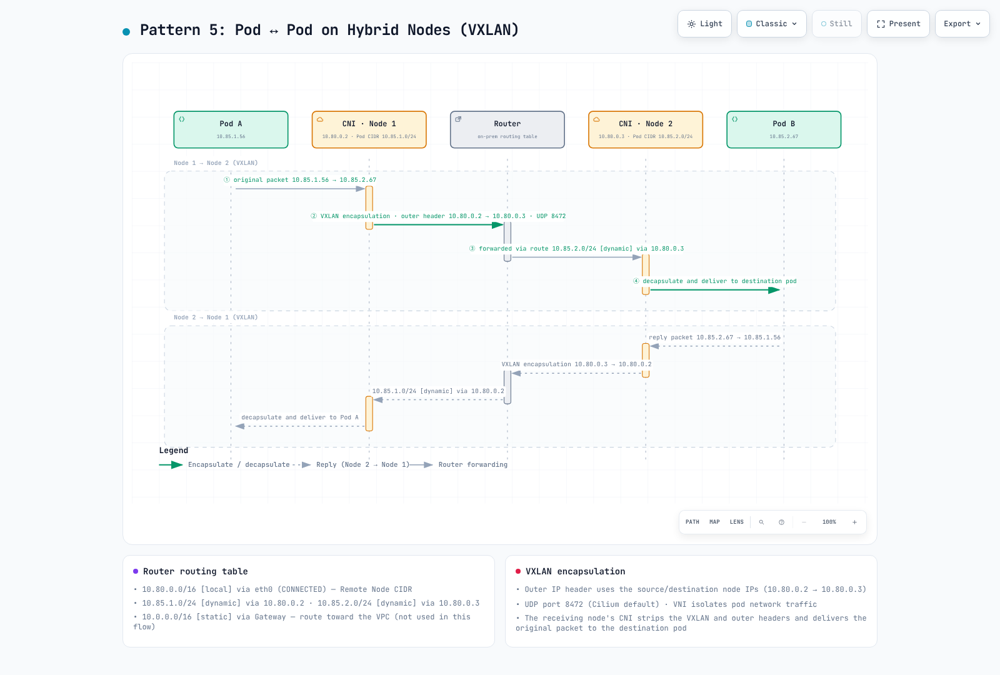
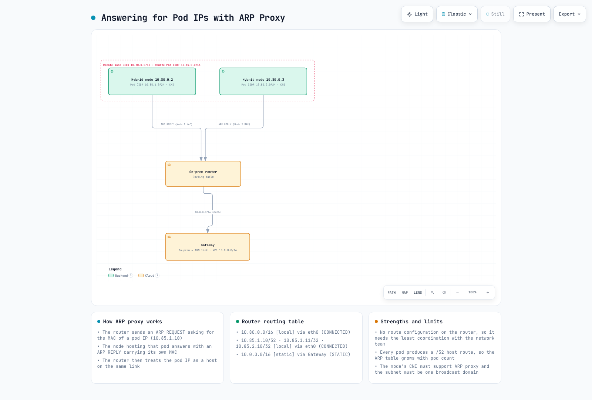

# Network Configuration

> **Supported Versions**: EKS 1.36 examples; AWS-maintained Cilium 1.18.3-0 reference, compatible host/kernel required
> **Last Updated**: September 12, 2026

Validate routing, DNS, TLS, credentials and application traffic separately. These examples were checked with local schemas and fixtures, including a mocked Terraform provider; no AWS resources, routers, firewalls or live clusters were changed. The diagrams are repository illustrations based on AWS concepts, not AWS-published validation of this configuration.


[🔍 View interactive diagram](https://www.atomai.click/kubernetes-docs/archmaps/en-eks-hybrid-nodes-prereq-0.html)

## Network Architecture Overview

Control-plane→hybrid-node traffic and private Kubernetes API traffic use the cluster VPC network path. Kubelet traffic to a public API endpoint uses its configured public route instead; “all traffic always traverses the VPC ENIs” was too broad. Direct Connect public VIFs, private connectivity and public internet paths are distinct choices.

EKS control-plane ENIs/IPs can change. Review actual cluster ownership and approved control-plane subnet ranges instead of treating every `Amazon EKS*` ENI in a shared VPC as belonging to this cluster.

Bind the account and Kubernetes context before read-only diagnostics:

```bash
set -euo pipefail
: "${EXPECTED_ACCOUNT_ID:?Set the intended account}"
: "${AWS_REGION:?Set the cluster Region}"
: "${CLUSTER_NAME:?Set the reviewed cluster name}"
: "${KUBECONFIG:?Set the reviewed kubeconfig}"
export KUBECONFIG KUBE_CONTEXT="${KUBE_CONTEXT:-$CLUSTER_NAME}"
check_account() {
  local account
  account=$(aws sts get-caller-identity --region "$AWS_REGION" --query Account --output text) || return
  test "$account" = "$EXPECTED_ACCOUNT_ID" || { printf 'Account mismatch.\n' >&2; return 1; }
}
check_account
umask 077
export WORK_DIR
WORK_DIR=$(mktemp -d "$PWD/hybrid-network.XXXXXXXX")
aws eks describe-cluster --region "$AWS_REGION" --name "$CLUSTER_NAME" --output json \
  > "$WORK_DIR/cluster.json"
endpoint=$(kubectl --context "$KUBE_CONTEXT" config view --minify \
  -o jsonpath='{.clusters[0].cluster.server}')
jq -e --arg endpoint "$endpoint" '
  .cluster.status=="ACTIVE" and .cluster.endpoint==$endpoint and
  (.cluster.remoteNetworkConfig.remoteNodeNetworks|length)>0
' "$WORK_DIR/cluster.json" >/dev/null
printf 'Private diagnostics: %s\n' "$WORK_DIR"
```

## CIDR Range Requirements

Use non-overlapping IPv4 **RFC1918 or CGNAT** remote node/Pod networks, separate from VPC and Kubernetes Service CIDRs. Up to 15 CIDRs of each remote kind are supported. Current EKS supports remote-network configuration on existing clusters through its API workflow; it is not creation-only.

| Network behavior | Meaning |
|------------------|---------|
| Routable Pod IPs | Approved routes let cloud/control-plane clients initiate connections to Pod IPs |
| Masqueraded egress | SNAT can provide a return path for connections initiated by Pods; it does not automatically permit new inbound connections |
| Unroutable Pod network | Direct cloud→Pod traffic needs another supported path; use cloud-hosted webhooks/API services for the conventional design |

Unroutable does not mean a Pod cannot initiate any AWS API call. For direct hybrid/cloud Pod communication and hybrid-hosted webhooks, supply the actual Pod routes. Gateway/proxy alternatives have separate requirements.

## Required Firewall Ports

| Flow | Protocol / port |
|------|-----------------|
| Node/Pod → Kubernetes API | TCP443 to the actual cluster endpoint |
| Control-plane ENI → kubelet | TCP10250 with kubelet authentication/authorization |
| Control plane → webhook or aggregated API Pod | Its configured TCP port, not a generic “8443+” range |
| DNS clients ↔ actual resolvers | UDP/TCP53 and stateful return traffic |
| Cilium VXLAN between participating nodes | UDP8472 |
| Cilium Geneve, only if selected and supported for the design | UDP6081 |
| Cilium health checks | TCP4240 and the required ICMP/health-endpoint reachability |
| BGP node↔router | TCP179 for the configured active/passive peers |
| VPN gateway transport | UDP500/4500 and applicable IPsec transport requirements |
| Applications / AWS credential and registry services | Only their actual destinations and ports |

Apply firewall changes through the network owner, preserving connection tracking and existing rules. The old broad `10.0.0.0/8` INPUT rules, unscoped DNS/VXLAN permits and whole ruleset saves were not a safe reusable firewall policy. Do not open unauthenticated kubelet 10255 as an optional modern requirement.

## AWS Endpoint Access

The **EKS management API PrivateLink endpoint is not the Kubernetes API server endpoint**.

| Service suffix for `com.amazonaws.<region>.*` | Purpose / when needed |
|------------------------------------------------|-----------------------|
| `eks` | AWS EKS management calls such as DescribeCluster |
| `eks-auth` | EKS Pod Identity, when used |
| `ecr.api`, `ecr.dkr` | Private ECR API/registry; image layers also need S3 access |
| `s3` | Private S3 access; on-premises cannot directly use a VPC gateway endpoint |
| `ssm`, applicable SSM messaging services | SSM credential/management functions |
| `rolesanywhere` | IAM Roles Anywhere credentials when that provider is used |
| `sts` | Actual client STS/IRSA/AssumeRole calls; signing an EKS token locally is not itself a client STS network request |
| `logs`, `monitoring`, other selected services | Only if the chosen agents/workloads call them |
| `oidc-eks` | Current EKS OIDC discovery/JWKS PrivateLink service, where available |
| `eks-proxy` | AWS console resource views; not a public application SDK/API |

Confirm service availability in the target Region. Private ECR endpoints do not make **public ECR**, CloudFront or arbitrary package repositories private. For example, the AWS Cilium OCI chart in public ECR needs an approved reachable/mirrored distribution path.

OIDC discovery/JWKS is anonymous public-key material. `oidc-eks` accepts only its default full-access endpoint policy; use SG/routing for reachability and IAM trust `aud`/`sub` conditions for role authorization. STS validates IRSA tokens inside AWS, independently of this VPC endpoint.

For a Roles Anywhere CreateSession endpoint policy, the principal must be `*` because evaluation precedes certificate authentication; restrict the approved trust-anchor resource and supported certificate conditions as documented. Do not copy one generic endpoint policy across these different services. Endpoint policies filter endpoint traffic; they do not replace IAM/role trust or globally disable public service endpoints.

```bash
check_account
vpc_id=$(jq -er '.cluster.resourcesVpcConfig.vpcId' "$WORK_DIR/cluster.json")
aws ec2 describe-vpc-endpoints --region "$AWS_REGION" \
  --filters "Name=vpc-id,Values=$vpc_id" --output json |
  jq '[.VpcEndpoints[]|{id:.VpcEndpointId,service:.ServiceName,type:.VpcEndpointType,
      state:.State,privateDNS:.PrivateDnsEnabled,dnsOptions:.DnsOptions,
      subnets:.SubnetIds,groups:.Groups,dnsEntries:.DnsEntries}]'
```

### S3 Private DNS and Artifact Distribution

S3 **interface endpoints support private DNS**. The inbound-Resolver-only option directs on-premises queries through interface endpoints while in-VPC traffic uses a required S3 gateway endpoint. Keep that gateway while the option is enabled. Alternatively, clear the option to use the interface endpoint for all relevant S3 traffic.

Private DNS is not a TLS rewrite. A PHZ/CNAME mapping `hybrid-assets.eks.amazonaws.com` to an S3 endpoint does not give S3 the CloudFront hostname's certificate or object/Host routing behavior. Do not disable TLS verification to make such a mirror work. Use a supported artifact-preparation/client configuration path, an approved mirror with its own hostname/certificate, or preinstalled dependencies in a validated image.

## VPC Private Endpoints (Air-Gap / Private Connectivity)

Here “air-gap” means restricted internet access with required AWS connectivity, not a disconnected cluster.

The following complete Terraform example uses an existing VPC, endpoint subnets and TGW. It does not create a VPN/DX circuit, TGW attachments, on-premises routes or EKS private DNS configuration. Verify VPC DNS support/hostnames and distinct actual AZs; two different subnet IDs alone do not prove AZ diversity.

Use the original infrastructure owner and import/adopt existing resources before planning replacements. The default endpoint set illustrates SSM; change it for the chosen provider/workloads. Endpoints and Resolver ENIs incur charges. The provider account guard and scoped ingress are deliberate; response traffic uses stateful SG tracking.

```hcl
terraform {
  required_version = ">= 1.9, < 2.0"
  required_providers {
    aws = {
      source  = "hashicorp/aws"
      version = "= 6.64.0"
    }
  }
}

provider "aws" {
  region              = var.region
  allowed_account_ids = [var.expected_account_id]
}

variable "expected_account_id" {
  type = string
  validation {
    condition     = can(regex("^[0-9]{12}$", var.expected_account_id))
    error_message = "Set the reviewed 12-digit account ID."
  }
}

variable "region" {
  type = string
}

variable "name_prefix" {
  type    = string
  default = "hybrid-network"
}

variable "vpc_id" {
  type = string
}

variable "endpoint_subnet_ids" {
  type = set(string)
  validation {
    condition     = length(var.endpoint_subnet_ids) >= 2
    error_message = "Provide subnets in at least two verified Availability Zones."
  }
}

variable "s3_gateway_route_table_ids" {
  type = set(string)
  validation {
    condition     = length(var.s3_gateway_route_table_ids) > 0
    error_message = "Provide the reviewed VPC route tables for the S3 gateway endpoint."
  }
}

variable "client_ipv4_cidrs" {
  type = set(string)
  validation {
    condition = length(var.client_ipv4_cidrs) > 0 && alltrue([
      for c in var.client_ipv4_cidrs : can(cidrnetmask(c)) && c != "0.0.0.0/0"
    ])
    error_message = "Provide scoped IPv4 CIDRs for the actual VPC/on-premises clients."
  }
}

variable "onprem_dns_client_cidrs" {
  type = set(string)
  validation {
    condition = length(var.onprem_dns_client_cidrs) > 0 && alltrue([
      for c in var.onprem_dns_client_cidrs : can(cidrnetmask(c)) && c != "0.0.0.0/0"
    ])
    error_message = "Scope inbound DNS to the actual on-premises resolvers."
  }
}

variable "onprem_dns_servers" {
  type = set(string)
  validation {
    condition = length(var.onprem_dns_servers) > 0 && alltrue([
      for ip in var.onprem_dns_servers : can(cidrnetmask("${ip}/32"))
    ])
    error_message = "Provide actual IPv4 addresses of the on-premises DNS servers."
  }
}

variable "onprem_domain" {
  type    = string
  default = "corp.example.internal"
  validation {
    condition = length(var.onprem_domain) <= 253 && length(split(".", trimsuffix(var.onprem_domain, "."))) >= 2 && alltrue([
      for label in split(".", trimsuffix(var.onprem_domain, ".")) :
      length(label) <= 63 && can(regex("^[A-Za-z0-9]([A-Za-z0-9-]*[A-Za-z0-9])?$", label))
    ]) && !can(regex("(^|\\.)(amazonaws\\.com|api\\.aws|cluster\\.local)\\.?$", lower(var.onprem_domain)))
    error_message = "Use a specific owned DNS suffix; do not forward root, AWS or Kubernetes service zones back to on-premises."
  }
}

variable "interface_services" {
  type    = set(string)
  default = ["eks", "ecr.api", "ecr.dkr", "ssm", "ssmmessages"]
  validation {
    condition     = !contains(var.interface_services, "s3")
    error_message = "S3 has its own gateway/interface configuration below."
  }
}

variable "endpoint_policy_json" {
  type    = map(string)
  default = {}
  validation {
    condition = !contains(keys(var.endpoint_policy_json), "oidc-eks") && alltrue([
      for policy in values(var.endpoint_policy_json) : can(jsondecode(policy))
    ])
    error_message = "Use valid service-specific JSON policies; oidc-eks supports only its default full-access policy."
  }
}

variable "controlplane_route_table_ids" {
  type = set(string)
}

variable "remote_ipv4_cidrs" {
  type = set(string)
  validation {
    condition = alltrue([
      for c in var.remote_ipv4_cidrs : can(cidrnetmask(c)) && c != "0.0.0.0/0"
    ])
    error_message = "Use reviewed remote node, Pod and required DNS/service IPv4 CIDRs."
  }
}

variable "existing_transit_gateway_id" {
  type = string
}
```
```hcl
# Import/adopt existing resources through their owner before using this example.
# The existing VPC must have DNS support/hostnames and working hybrid routes.
resource "aws_security_group" "endpoints" {
  name_prefix = "${var.name_prefix}-vpce-"
  description = "HTTPS clients for interface endpoints"
  vpc_id      = var.vpc_id
}

resource "aws_vpc_security_group_ingress_rule" "endpoint_https" {
  for_each          = var.client_ipv4_cidrs
  security_group_id = aws_security_group.endpoints.id
  cidr_ipv4         = each.value
  ip_protocol       = "tcp"
  from_port         = 443
  to_port           = 443
}

resource "aws_vpc_endpoint" "service" {
  for_each            = var.interface_services
  vpc_id              = var.vpc_id
  service_name        = "com.amazonaws.${var.region}.${each.value}"
  vpc_endpoint_type   = "Interface"
  private_dns_enabled = true
  subnet_ids          = var.endpoint_subnet_ids
  security_group_ids  = [aws_security_group.endpoints.id]
  policy              = lookup(var.endpoint_policy_json, each.key, null)
  tags                = { Name = "${var.name_prefix}-${each.key}" }
}

# S3 inbound-Resolver-only private DNS requires this gateway endpoint.
resource "aws_vpc_endpoint" "s3_gateway" {
  vpc_id            = var.vpc_id
  service_name      = "com.amazonaws.${var.region}.s3"
  vpc_endpoint_type = "Gateway"
  route_table_ids   = var.s3_gateway_route_table_ids
  tags             = { Name = "${var.name_prefix}-s3-gateway" }
}

resource "aws_vpc_endpoint" "s3_interface" {
  vpc_id              = var.vpc_id
  service_name        = "com.amazonaws.${var.region}.s3"
  vpc_endpoint_type   = "Interface"
  private_dns_enabled = true
  subnet_ids          = var.endpoint_subnet_ids
  security_group_ids  = [aws_security_group.endpoints.id]
  dns_options {
    private_dns_only_for_inbound_resolver_endpoint = true
  }
  depends_on = [aws_vpc_endpoint.s3_gateway]
  tags       = { Name = "${var.name_prefix}-s3-interface" }
}

resource "aws_security_group" "dns_inbound" {
  name_prefix = "${var.name_prefix}-dns-in-"
  description = "DNS from on-premises resolvers"
  vpc_id      = var.vpc_id
}

resource "aws_security_group" "dns_outbound" {
  name_prefix = "${var.name_prefix}-dns-out-"
  description = "DNS to reviewed on-premises resolvers"
  vpc_id      = var.vpc_id
}

locals {
  inbound_dns_rules = {
    for pair in setproduct(var.onprem_dns_client_cidrs, toset(["tcp", "udp"])) :
    "${pair[0]}-${pair[1]}" => { cidr = pair[0], protocol = pair[1] }
  }
  outbound_dns_rules = {
    for pair in setproduct(var.onprem_dns_servers, toset(["tcp", "udp"])) :
    "${pair[0]}-${pair[1]}" => { ip = pair[0], protocol = pair[1] }
  }
}

resource "aws_vpc_security_group_ingress_rule" "dns" {
  for_each          = local.inbound_dns_rules
  security_group_id = aws_security_group.dns_inbound.id
  cidr_ipv4         = each.value.cidr
  ip_protocol       = each.value.protocol
  from_port         = 53
  to_port           = 53
}

resource "aws_vpc_security_group_egress_rule" "dns" {
  for_each          = local.outbound_dns_rules
  security_group_id = aws_security_group.dns_outbound.id
  cidr_ipv4         = "${each.value.ip}/32"
  ip_protocol       = each.value.protocol
  from_port         = 53
  to_port           = 53
}

resource "aws_route53_resolver_endpoint" "inbound" {
  name                   = "${var.name_prefix}-inbound"
  direction              = "INBOUND"
  resolver_endpoint_type = "IPV4"
  security_group_ids     = [aws_security_group.dns_inbound.id]
  dynamic "ip_address" {
    for_each = var.endpoint_subnet_ids
    content {
      subnet_id = ip_address.value
    }
  }
}

resource "aws_route53_resolver_endpoint" "outbound" {
  name                   = "${var.name_prefix}-outbound"
  direction              = "OUTBOUND"
  resolver_endpoint_type = "IPV4"
  security_group_ids     = [aws_security_group.dns_outbound.id]
  dynamic "ip_address" {
    for_each = var.endpoint_subnet_ids
    content {
      subnet_id = ip_address.value
    }
  }
}

resource "aws_route53_resolver_rule" "onprem" {
  domain_name          = var.onprem_domain
  name                 = "${var.name_prefix}-onprem"
  rule_type            = "FORWARD"
  resolver_endpoint_id = aws_route53_resolver_endpoint.outbound.id
  dynamic "target_ip" {
    for_each = var.onprem_dns_servers
    content {
      ip   = target_ip.value
      port = 53
    }
  }
}

resource "aws_route53_resolver_rule_association" "onprem" {
  resolver_rule_id = aws_route53_resolver_rule.onprem.id
  vpc_id           = var.vpc_id
}

output "inbound_resolver_ips" {
  value = [for address in aws_route53_resolver_endpoint.inbound.ip_address : address.ip]
}

# VPC return routes only. Existing TGW attachment routes/propagation and
# on-premises routing must be managed separately by their infrastructure owner.
locals {
  remote_routes = {
    for pair in setproduct(var.controlplane_route_table_ids, var.remote_ipv4_cidrs) :
    "${pair[0]}-${pair[1]}" => { table = pair[0], cidr = pair[1] }
  }
}

resource "aws_route" "hybrid" {
  for_each               = local.remote_routes
  route_table_id         = each.value.table
  destination_cidr_block = each.value.cidr
  transit_gateway_id     = var.existing_transit_gateway_id
  # A VGW topology uses gateway_id instead; do not set both target fields.
}
```

The S3 gateway dependency is explicit. Include required on-premises DNS/service ranges in `remote_ipv4_cidrs`, not only node/Pod networks: the example DNS servers `192.168.1.10/11` need an approved `192.168.1.0/24` route or corresponding host routes. For a VGW return route, use `gateway_id` instead of `transit_gateway_id`; do not put a TGW ID into a VGW/gateway field or configure both targets. VPC routes alone do not establish TGW/VPN/on-premises routing.

## DNS Configuration

On-premises resolvers can conditionally forward selected AWS/service and actual cluster-endpoint names to Route 53 Resolver inbound IPs. Use the addresses returned for the real endpoint. A broad `amazonaws.com` forward can affect unrelated services; choose zones deliberately and avoid forwarding loops.

```text
// Example service zones only. Replace these Resolver IPs with actual outputs.
zone "eks.ap-northeast-2.amazonaws.com" {
    type forward;
    forward only;
    forwarders { 10.0.1.10; 10.0.2.10; };
};
zone "s3.ap-northeast-2.amazonaws.com" {
    type forward;
    forward only;
    forwarders { 10.0.1.10; 10.0.2.10; };
};
```

This BIND fragment covers the shown service zones, not the Kubernetes API hostname automatically. Add the actual cluster endpoint's DNS name/suffix and other required names from the verified service inventory. Resolver outbound rules handle the on-premises zone; that zone must be authoritative/reachable on the selected DNS servers, not forwarded back into the same loop.

### CoreDNS Custom Domain Configuration

If the chosen design forwards directly from CoreDNS, merge a reviewed server block into the existing Corefile; do not overwrite the whole managed ConfigMap:

```text
# Fragment to merge through the CoreDNS configuration owner.
corp.example.internal:53 {
    errors
    cache 30
    forward . 192.168.1.10 192.168.1.11 {
        max_concurrent 1000
    }
}
```

Preserve existing Kubernetes zones, health/readiness and reload behavior. Check the actual resolver file and systemd-resolved/stub layout; forwarding a DNS server back to itself can loop. Choose either the appropriate VPC forwarding path or explicit CoreDNS forwarding for a zone rather than layering contradictory routes.

For the managed EKS add-on, fetch the **installed version's** configuration schema and validate the complete proposed values, preserving unrelated existing settings:

```bash
check_account
aws eks describe-addon --region "$AWS_REGION" --cluster-name "$CLUSTER_NAME" \
  --addon-name coredns --output json > "$WORK_DIR/coredns-addon.json"
addon_version=$(jq -er '.addon.addonVersion' "$WORK_DIR/coredns-addon.json")
aws eks describe-addon-configuration --region "$AWS_REGION" --addon-name coredns \
  --addon-version "$addon_version" --output json > "$WORK_DIR/coredns-schema-response.json"
jq -r '.configurationSchema' "$WORK_DIR/coredns-schema-response.json" \
  > "$WORK_DIR/coredns-schema.json"
# Prepare the full intended values, preserving unrelated existing configuration.
: "${COREDNS_CANDIDATE_JSON:?Set the reviewed full configurationValues JSON file}"
export COREDNS_CANDIDATE_JSON
python3 - <<'PY'
import json, os
from pathlib import Path
import jsonschema
folder = Path(os.environ["WORK_DIR"])
schema = json.loads((folder / "coredns-schema.json").read_text())
candidate = json.loads(Path(os.environ["COREDNS_CANDIDATE_JSON"]).read_text())
validator = jsonschema.validators.validator_for(schema)
validator.check_schema(schema)
validator(schema).validate(candidate)
print("Configuration matches the fetched schema; rollout and DNS behavior are not yet verified")
PY
```

This is a local schema check, not a rollout. Coordinate managed add-on/GitOps ownership, autoscaling and recovery before applying configuration.

### CoreDNS Placement and Locality

AWS recommends at least one CoreDNS replica on cloud nodes and one on hybrid nodes in mixed clusters. Two per location can be a resilience choice; four replicas is not a universal minimum or a guarantee.

Verify real zone labels on all intended DNS nodes. Hybrid nodes need an owner-defined `topology.kubernetes.io/zone` value such as `onprem-dc1`; a compute-type label is not automatically that zone or a taint. Merge placement preferences without deleting unrelated affinity/tolerations:

```json
{
  "affinity": {
    "podAntiAffinity": {
      "preferredDuringSchedulingIgnoredDuringExecution": [
        {
          "weight": 100,
          "podAffinityTerm": {
            "labelSelector": {
              "matchLabels": {
                "k8s-app": "kube-dns"
              }
            },
            "topologyKey": "kubernetes.io/hostname"
          }
        },
        {
          "weight": 50,
          "podAffinityTerm": {
            "labelSelector": {
              "matchLabels": {
                "k8s-app": "kube-dns"
              }
            },
            "topologyKey": "topology.kubernetes.io/zone"
          }
        }
      ]
    }
  }
}
```

Soft affinity/spread is a preference, not a guaranteed 2+2 distribution or successful bootstrap. Placement alone also does not ensure clients choose a local DNS replica.

AWS's documented Service Traffic Distribution example uses `PreferClose`. With Cilium, configure the supported `loadBalancer.serviceTopology` setting and roll the affected agents through the owner before relying on it. Review the actual dataplane/version and healthy local endpoints.

```json
{
  "spec": {
    "trafficDistribution": "PreferClose"
  }
}
```
```bash
kubectl --context "$KUBE_CONTEXT" --request-timeout=15s -n kube-system \
  get service kube-dns -o json |
  jq '{name:.metadata.name,uid:.metadata.uid,clusterIP:.spec.clusterIP,
       clusterIPs:.spec.clusterIPs,ports:.spec.ports,trafficDistribution:.spec.trafficDistribution}'
kubectl --context "$KUBE_CONTEXT" --request-timeout=15s -n kube-system \
  get endpointslices -l kubernetes.io/service-name=kube-dns -o json |
  jq '[.items[]|{name:.metadata.name,addressType,ports,
       endpoints:[.endpoints[]?|{addresses,nodeName,zone,conditions,hints}]}]'
kubectl --context "$KUBE_CONTEXT" --request-timeout=15s -n kube-system \
  get pods -l k8s-app=kube-dns -o json |
  jq '[.items[]|{name:.metadata.name,node:.spec.nodeName,phase:.status.phase,
       ready:([.status.conditions[]?|select(.type=="Ready")|.status]|first // "NotReported")}]'
```

Inspect actual Service IPs, EndpointSlice zones/hints and Pod readiness. `10.100.0.10` is an example for a particular Service CIDR, not a universal cluster DNS address. Local replicas do not turn a disconnected EKS cluster into a fully independent DNS/control plane.

## Traffic Flow Patterns

The drawings use illustrative addresses and simplified processing stages. Check whether your actual Service dataplane is kube-proxy iptables, nftables/IPVS or Cilium's eBPF replacement.

### Pattern 1: Kubelet → EKS Control Plane

The kubelet resolves and connects to the configured Kubernetes API endpoint. Private and public access have different routes; neither should be confused with the EKS management PrivateLink endpoint.


[🔍 View interactive diagram](https://www.atomai.click/kubernetes-docs/archmaps/en-eks-hybrid-nodes-02-network-configuration-10.html)

### Pattern 2: EKS Control Plane → Kubelet

The control plane reaches the reported, routable node address over TCP10250. This path supports logs, exec and port-forward and needs reverse routing, firewall permission and kubelet authentication.


[🔍 View interactive diagram](https://www.atomai.click/kubernetes-docs/archmaps/en-eks-hybrid-nodes-02-network-configuration-11.html)

### Pattern 3: Pod → EKS Control Plane

A Pod using the Kubernetes Service IP needs Service translation to the selected API endpoint. If egress SNAT applies, responses target the node address and connection tracking reverses translation; without SNAT, the Pod address needs a return route.


[🔍 View interactive diagram](https://www.atomai.click/kubernetes-docs/archmaps/en-eks-hybrid-nodes-02-network-configuration-12.html)

The drawing's SNAT-before-DNAT numbering is not a universal hook order. In an iptables path, Service DNAT normally precedes routing and applicable POSTROUTING SNAT. eBPF paths differ. Capture the actual packet/connection state before drawing conclusions.

### Pattern 4: EKS Control Plane → Pod (Webhooks)

The API server needs the selected webhook Pod IP/port to be reachable. Use the configured port; the old “8443+” legend is not a valid port-range requirement.


[🔍 View interactive diagram](https://www.atomai.click/kubernetes-docs/archmaps/en-eks-hybrid-nodes-02-network-configuration-13.html)

### Pattern 5: Pod ↔ Pod on Hybrid Nodes

With the supported VXLAN overlay, the destination node is reached using **outer node IPs**. The underlay does not need a route for the inner destination Pod CIDR merely to carry the encapsulated packet.



[🔍 View interactive diagram](https://www.atomai.click/kubernetes-docs/archmaps/en-eks-hybrid-nodes-02-network-configuration-14.html)

The diagram's forwarding labels that use `10.85.x.0/24` after encapsulation need to be read as an older simplification: the outer packet routes to `10.80.0.x`. Nodes on one L2 segment may communicate directly without a router hop.

VXLAN encapsulates an inner Ethernet frame using UDP. In the IPv4/no-extra-encapsulation example, 50 bytes of overhead explains a 1500→1450 MTU adjustment; additional tunneling changes that calculation. Cilium VXLAN uses UDP8472; standard VXLAN commonly uses 4789. Geneve uses UDP6081. Current Cilium tunnel configuration distinguishes VXLAN/Geneve; IP-in-IP is not an interchangeable default overlay selected by the old `--tunnel` advice.

The VNI field is 24 bits; Cilium can carry security identity in encapsulation metadata. It is not cryptographic tenant isolation. Keep network policies and actual identity propagation separate.

### Pattern 6: Cloud Pod ↔ Hybrid Pod

Direct Pod-IP traffic needs the relevant Pod routes across VPC, WAN and on-premises. Service translation is needed only when the request actually targets a Service VIP.


[🔍 View interactive diagram](https://www.atomai.click/kubernetes-docs/archmaps/en-eks-hybrid-nodes-02-network-configuration-15.html)

The picture's kube-proxy/iptables block is dataplane-dependent; a direct Pod-IP packet does not inherently require kube-proxy DNAT.

### kube-proxy and kubelet Details

In kube-proxy **iptables mode**, a common chain path is:

```text
KUBE-SERVICES → KUBE-SVC-* → KUBE-SEP-* → endpoint DNAT
```

With three eligible equal-weight endpoints and no overriding affinity/locality policy, conditional probabilities 1/3, then 1/2 of the remaining packets, then the remainder produce roughly equal selection. This is an illustration, not captured output or the rule structure of every dataplane:

```text
# KUBE-SERVICES chain (nat table)
-A KUBE-SERVICES -d 172.20.0.10/32 -p tcp -m tcp --dport 80 -j KUBE-SVC-XXXXXX

# KUBE-SVC chain (load balancing)
-A KUBE-SVC-XXXXXX -m statistic --mode random --probability 0.33333 -j KUBE-SEP-AAAAAA
-A KUBE-SVC-XXXXXX -m statistic --mode random --probability 0.50000 -j KUBE-SEP-BBBBBB
-A KUBE-SVC-XXXXXX -j KUBE-SEP-CCCCCC

# KUBE-SEP chain (DNAT)
-A KUBE-SEP-AAAAAA -p tcp -j DNAT --to-destination 10.85.0.15:8080
-A KUBE-SEP-BBBBBB -p tcp -j DNAT --to-destination 10.85.0.16:8080
-A KUBE-SEP-CCCCCC -p tcp -j DNAT --to-destination 10.85.1.20:8080
```

| Secure kubelet endpoint | Purpose |
|------------------------|---------|
| `/pods` | Pod information |
| `/exec/{namespace}/{pod}/{container}` | Container exec stream |
| `/containerLogs/{namespace}/{pod}/{container}` | Container logs; not the former `/logs/...` path |
| `/metrics`, `/healthz` | Authorized metrics/health endpoints |

Use supported API-server-mediated diagnostics and appropriate authorization. The node's real `status.addresses` matters; do not substitute a hostname or the first address from an unrelated object.

## Routable Pod CIDR Configuration


[🔍 View interactive diagram](https://www.atomai.click/kubernetes-docs/archmaps/en-eks-hybrid-nodes-02-network-configuration-0.html)

### Option 1: BGP (Recommended)


[🔍 View interactive diagram](https://www.atomai.click/kubernetes-docs/archmaps/en-eks-hybrid-nodes-02-network-configuration-1.html)

AWS's dedicated CNI support page lists AWS-maintained Cilium 1.17/1.18 builds. The reference here is 1.18.3-0 on a compatible kernel/OS; do not blindly replace it with upstream 1.19. Other AWS pages still mention Calico BGP and its retained examples. That is not evidence that the Calico project is deprecated; confirm support scope for an existing deployment.

Enable BGP through the owner of the **existing pinned Cilium release**, merging values and reviewing operator/agent rollout:

```yaml
bgpControlPlane:
  enabled: true
operator:
  rollOutPods: true
```

The AWS-style `v2alpha1` APIs remain served in the reviewed 1.18.3 CRDs (which also serve `v2`). There is no need to replace CRDs simply to use this example.

The following selects hybrid nodes, links the peer's advertisement selector to the advertisement labels, and advertises only their Pod CIDRs:

```yaml
apiVersion: cilium.io/v2alpha1
kind: CiliumBGPClusterConfig
metadata:
  name: hybrid-bgp-config
spec:
  nodeSelector:
    matchLabels:
      eks.amazonaws.com/compute-type: hybrid
  bgpInstances:
  - name: hybrid-instance
    localASN: 65001
    peers:
    - name: on-prem-router
      peerASN: 65000
      peerAddress: 10.80.1.1
      peerConfigRef:
        name: on-prem-peer
```
```yaml
apiVersion: cilium.io/v2alpha1
kind: CiliumBGPPeerConfig
metadata:
  name: on-prem-peer
spec:
  timers:
    holdTimeSeconds: 90
    keepAliveTimeSeconds: 30
  gracefulRestart:
    enabled: true
    restartTimeSeconds: 120
  families:
  - afi: ipv4
    safi: unicast
    advertisements:
      matchLabels:
        advertise: hybrid-pods
```
```yaml
apiVersion: cilium.io/v2alpha1
kind: CiliumBGPAdvertisement
metadata:
  name: hybrid-pod-cidrs
  labels:
    advertise: hybrid-pods
spec:
  advertisements:
  - advertisementType: PodCIDR
```

The example assumes the selected nodes can reach router `10.80.1.1` with the intended peering topology. Different racks/loopbacks may need distinct non-overlapping selectors and reviewed multihop settings. TCP179, ASN, authentication, route filters, negotiated timers and graceful-restart stale-route behavior need network-owner review.

BGP session establishment alone does not prove the intended prefixes were advertised, accepted or installed in the router's forwarding table. The Cilium BGP control plane advertises reachability; it does not replace all kernel/underlay routing.

```bash
cilium --context "$KUBE_CONTEXT" bgp peers
cilium --context "$KUBE_CONTEXT" bgp routes
kubectl --context "$KUBE_CONTEXT" --request-timeout=15s \
  get ciliumbgpclusterconfigs,ciliumbgppeerconfigs,ciliumbgpadvertisements -o json |
  jq '[.items[]|{kind,name:.metadata.name,status:.status}]'
```

#### ASN and Router Configuration

RFC6996 private ranges are **64512–65534** and **4200000000–4294967294**. The former blanket “only the 16-bit range” rule was incorrect. Do not describe every value 1–64511 as a freely usable public ASN; public/reserved/documentation assignments have their own rules.

Use existing coordinated network ASNs. `localASN=65001` represents Cilium nodes and `peerASN=65000` their on-premises router in these examples. A TGW's ASN is a different upstream relationship: Cilium does not automatically peer with a TGW merely because it exists. Site-to-Site VPN BGP terminates on the configured VPN/customer gateway path; TGW Connect is another separate transport/design.

The following vendor fragments are illustrative starting points, not device-tested configurations. Merge through the router owner with platform/version-specific import/export prefix filters, limits and recovery. Do not change a live router's global ASN indiscriminately.

**Cisco IOS / IOS-XE**

```text
router bgp 65000
 neighbor 10.80.1.10 remote-as 65001
 neighbor 10.80.1.10 description "EKS Hybrid Node - Cilium BGP"
 !
 address-family ipv4 unicast
  neighbor 10.80.1.10 activate
  neighbor 10.80.1.10 soft-reconfiguration inbound
 exit-address-family
```

**Cisco NX-OS (Nexus)**

```text
router bgp 65000
  address-family ipv4 unicast
  neighbor 10.80.1.10
    remote-as 65001
    description EKS-Hybrid-Cilium
    address-family ipv4 unicast
      soft-reconfiguration inbound
```

**Juniper Junos (MX / QFX / SRX)**

```text
set protocols bgp group eks-hybrid type external
set protocols bgp group eks-hybrid peer-as 65001
set protocols bgp group eks-hybrid neighbor 10.80.1.10 description "EKS Hybrid Node"
set protocols bgp group eks-hybrid family inet unicast
set routing-options autonomous-system 65000
```

**Arista EOS**

```text
router bgp 65000
   neighbor 10.80.1.10 remote-as 65001
   neighbor 10.80.1.10 description EKS-Hybrid-Cilium
   !
   address-family ipv4
      neighbor 10.80.1.10 activate
```

**MikroTik RouterOS 7.20+**

```text
/routing/bgp/instance
add name=hybrid as=65000
/routing/bgp/connection
add name=hybrid-node-001 instance=hybrid remote.address=10.80.1.10 remote.as=65001 local.role=ebgp address-families=ip disabled=yes
# Review input/output filters and routing before enabling the connection.
```

**FRRouting (FRR), reference 10.7.1**

```text
ip prefix-list HYBRID_PODS seq 10 permit 10.85.0.0/16 ge 25 le 25
route-map FROM_HYBRID permit 10
 match ip address prefix-list HYBRID_PODS
route-map TO_HYBRID deny 10
router bgp 65000
 bgp router-id 10.80.1.1
 bgp ebgp-requires-policy
 neighbor 10.80.1.10 remote-as 65001
 address-family ipv4 unicast
  neighbor 10.80.1.10 activate
  neighbor 10.80.1.10 route-map FROM_HYBRID in
  neighbor 10.80.1.10 route-map TO_HYBRID out
 exit-address-family
```

RouterOS 7.20+ explicitly defines the BGP instance. FRR's traditional defaults require eBGP policy; an established session without filters can show `(Policy)` and exchange no routes. The FRR example accepts only the reviewed `/25` Pod blocks and exports no routes to Cilium; adapt filters to the actual IPAM design and upstream routing.

### Option 2: Static Routes


[🔍 View interactive diagram](https://www.atomai.click/kubernetes-docs/archmaps/en-eks-hybrid-nodes-02-network-configuration-2.html)

In Cilium **cluster-pool IPAM**, read all allocated `CiliumNode.spec.ipam.podCIDRs`. Allocation is not guaranteed to follow node registration order. A `/16` contains 512 `/25` blocks geometrically, and each `/25` has 128 addresses; this does not guarantee 512 supported nodes or 128 usable application Pod IPs per node. Reserved addresses, node/CNI use and kubelet/resource limits also matter.

This is a Cilium Helm-values fragment for a reviewed new pool, not a kubelet-wide `podCIDR` setting. Do not change existing allocated CIDRs or block size as a shortcut to migration:

```yaml
ipam:
  mode: cluster-pool
  operator:
    clusterPoolIPv4PodCIDRList:
    - 10.85.0.0/16
    clusterPoolIPv4MaskSize: 25
```

Do not use `.addresses[0]` as the next hop: it can be a Cilium-internal address. The following cross-checks IPv4 InternalIP with the Kubernetes Node, validates all Pod prefixes against approved remote ranges, rejects overlap/missing state and produces **JSON candidates**, not executable shell:

```bash
kubectl --context "$KUBE_CONTEXT" --request-timeout=15s get nodes \
  -l eks.amazonaws.com/compute-type=hybrid -o json |
  jq '{items:[.items[]|{metadata:{name:.metadata.name,uid:.metadata.uid},
       status:{addresses:.status.addresses}}]}' > "$WORK_DIR/hybrid-nodes.json"
kubectl --context "$KUBE_CONTEXT" --request-timeout=15s get ciliumnodes.cilium.io -o json |
  jq '{items:[.items[]|{metadata:{name:.metadata.name,uid:.metadata.uid},
       spec:{addresses:.spec.addresses,ipam:{podCIDRs:.spec.ipam.podCIDRs}}}]}' \
  > "$WORK_DIR/cilium-nodes.json"
```
```bash
python3 - <<'PY'
import ipaddress, json, os
from pathlib import Path
folder = Path(os.environ["WORK_DIR"])
network = json.loads((folder / "cluster.json").read_text())["cluster"]["remoteNetworkConfig"]
node_ranges = [ipaddress.ip_network(c, strict=True) for n in network["remoteNodeNetworks"] for c in n["cidrs"]]
pod_ranges = [ipaddress.ip_network(c, strict=True) for n in network.get("remotePodNetworks", []) for c in n["cidrs"]]
if not pod_ranges:
    raise SystemExit("A reviewed routable remote Pod range is required for this route plan")
nodes = {n["metadata"]["name"]: n for n in json.loads((folder / "hybrid-nodes.json").read_text())["items"]}
claims = json.loads((folder / "cilium-nodes.json").read_text())["items"]
rows, seen = [], []
for item in claims:
    name = item["metadata"]["name"]
    if name not in nodes:
        continue
    node = nodes[name]
    ips = [ipaddress.ip_address(a["address"]) for a in node["status"]["addresses"]
           if a["type"] == "InternalIP" and ":" not in a["address"]]
    if len(ips) != 1 or not any(ips[0] in n for n in node_ranges):
        raise SystemExit(f"Review the unique IPv4 InternalIP and remote-node range for {name}")
    cilium_ips = [ipaddress.ip_address(a["ip"]) for a in item["spec"].get("addresses", [])
                  if a["type"] == "InternalIP" and ":" not in a["ip"]]
    if cilium_ips != ips:
        raise SystemExit(f"Kubernetes/Cilium InternalIP mismatch for {name}")
    cidrs = item["spec"]["ipam"].get("podCIDRs") or []
    if not cidrs:
        raise SystemExit(f"No allocated cluster-pool Pod CIDRs for {name}; do not invent a route")
    for raw in cidrs:
        cidr = ipaddress.ip_network(raw, strict=True)
        if cidr.version != 4 or not any(cidr.subnet_of(p) for p in pod_ranges):
            raise SystemExit(f"Unapproved Pod CIDR for {name}: {cidr}")
        if any(cidr.overlaps(previous) for previous in seen):
            raise SystemExit("Overlapping or duplicate Pod routes require investigation")
        seen.append(cidr)
        rows.append({"node": name, "nodeUID": node["metadata"]["uid"],
                     "ciliumNodeUID": item["metadata"]["uid"], "destination": str(cidr), "nextHop": str(ips[0])})
if set(nodes) != {row["node"] for row in rows}:
    raise SystemExit("Some hybrid nodes have no matching Cilium allocation")
(folder / "reviewed-route-candidates.json").write_text(json.dumps(rows, indent=2) + "\n")
print(json.dumps(rows, indent=2))
PY
```

This is a point-in-time plan for cluster-pool IPAM, not an atomic lease on node identity or a routing controller. Revalidate before changes. Calico BlockAffinity is a different model; inspect its state, borrowing/pool behavior and actual routes rather than reusing this generator blindly.

After owner review, manual router syntax can look like:

```text
# Illustrative syntax after validating the route plan on the intended router:
# Linux
ip route add 10.85.0.0/25 via 10.80.1.10
# Cisco IOS / IOS-XE
ip route 10.85.0.0 255.255.255.128 10.80.1.10 name hybrid-node-001-pods
# FRR
ip route 10.85.0.0/25 10.80.1.10
```

Persist changes through the actual network manager/device configuration. An `up ip route ...` line belongs to an ifupdown stanza, not a standalone Bash script and not every modern Linux network manager. Static routes need drift/failure tracking; the original “1–5 nodes” threshold was a planning heuristic, not a technical limit.

### Option 3: ARP Proxying

AWS describes proxy ARP as a possible L2 approach. It needs the appropriate on-link neighbor-discovery behavior and a specifically configured CNI/host implementation; merely enabling generic Cilium does not prove this path is ready.



[🔍 View interactive diagram](https://www.atomai.click/kubernetes-docs/archmaps/en-eks-hybrid-nodes-02-network-configuration-3.html)

ARP broadcasts do not traverse TGW/VPN/DX Layer-3 routing. This option does not remove VPC/WAN return-route requirements. Validate actual L2 behavior and failover before replacing a BGP/static design.

## Network Policies

Policies depend on selection, direction and the enforcing dataplane. Kubernetes NetworkPolicy allows are additive: another matching policy can permit traffic. Cilium explicit deny and L7 behavior need their own evaluation. These examples are alternatives to test in a controlled namespace, not an instruction to layer every allow rule and expect stricter behavior.

### Kubernetes NetworkPolicy

```yaml
apiVersion: networking.k8s.io/v1
kind: NetworkPolicy
metadata:
  name: allow-frontend-to-backend
  namespace: bookinfo
spec:
  podSelector:
    matchLabels:
      app: reviews
  policyTypes:
  - Ingress
  ingress:
  - from:
    - podSelector:
        matchLabels:
          app: productpage
    ports:
    - protocol: TCP
      port: 9080
```

This selects `reviews` ingress and permits matching `productpage` Pods in the same namespace on TCP9080. It does not isolate every Pod/direction or override every other policy.

### CiliumNetworkPolicy and L7

```yaml
apiVersion: cilium.io/v2
kind: CiliumNetworkPolicy
metadata:
  name: allow-frontend-to-backend
  namespace: bookinfo
spec:
  endpointSelector:
    matchLabels:
      app: reviews
  ingress:
  - fromEndpoints:
    - matchLabels:
        app: productpage
        k8s:io.kubernetes.pod.namespace: bookinfo
    toPorts:
    - ports:
      - port: '9080'
        protocol: TCP
```
```yaml
apiVersion: cilium.io/v2
kind: CiliumNetworkPolicy
metadata:
  name: frontend-http-contract
  namespace: bookinfo
spec:
  endpointSelector:
    matchLabels:
      app: reviews
  ingress:
  - fromEndpoints:
    - matchLabels:
        app: productpage
        k8s:io.kubernetes.pod.namespace: bookinfo
    toPorts:
    - ports:
      - port: '9080'
        protocol: TCP
      rules:
        http:
        - method: GET
          path: /api/v1/.*
```

The HTTP rule is an alternative to the unrestricted L4 allow, not an automatic restriction layered on it. Use the actual application path. HTTP inspection requires appropriate visibility; encrypted mesh/TLS traffic is not automatically inspectable.

### DNS-Based Egress

The separate `external-api-client` example permits DNS through **Cilium-identified CoreDNS Pods** and HTTPS to the observed API addresses:

```yaml
apiVersion: cilium.io/v2
kind: CiliumNetworkPolicy
metadata:
  name: allow-external-api
  namespace: bookinfo
spec:
  endpointSelector:
    matchLabels:
      app: external-api-client
  egress:
  - toEndpoints:
    - matchLabels:
        k8s:io.kubernetes.pod.namespace: kube-system
        k8s:k8s-app: kube-dns
    toPorts:
    - ports:
      - port: '53'
        protocol: ANY
      rules:
        dns:
        - matchPattern: '*'
  - toFQDNs:
    - matchName: api.example.com
    toPorts:
    - ports:
      - port: '443'
        protocol: TCP
```

Verify the real resolver/identity layout. NodeLocal DNS, host DNS or non-Cilium-managed endpoints may need a different supported rule. FQDN IP observation is not remote API authentication; account for DNS caching and shared addresses. Cilium-specific L7/FQDN features also extend beyond the default Kubernetes NetworkPolicy support scope listed by AWS.

## Webhook Configuration

The conventional direct-routing design requires the control plane to reach webhook Pod IPs. If no suitable Pod return path exists, use appropriately placed cloud-hosted components. Verify alternative gateway/proxy designs separately.

```yaml
affinity:
  nodeAffinity:
    requiredDuringSchedulingIgnoredDuringExecution:
      nodeSelectorTerms:
      - matchExpressions:
        - key: eks.amazonaws.com/compute-type
          operator: NotIn
          values:
          - hybrid
```

This is a Pod-template affinity fragment, not a complete Deployment. A `NotIn hybrid` condition is not proof that matching healthy cloud capacity or every other scheduling constraint exists.

AWS Load Balancer Controller, CloudWatch/ADOT operators and cert-manager have webhook placement requirements. Distinguish their operators from node collectors. **Metrics Server is an aggregated API service, not an admission webhook**, but still needs control-plane-to-Pod reachability. Test real API calls and webhooks, not only Pod phase.

## Read-Only Connectivity Diagnostics

### Kubernetes API TLS and Timing

```bash
set -euo pipefail
endpoint=$(jq -er '.cluster.endpoint' "$WORK_DIR/cluster.json")
case "$endpoint" in https://*) ;; *) printf 'HTTPS endpoint required.\n' >&2; exit 1;; esac
jq -er '.cluster.certificateAuthority.data' "$WORK_DIR/cluster.json" |
  base64 --decode > "$WORK_DIR/cluster-ca.pem"
openssl x509 -in "$WORK_DIR/cluster-ca.pem" -noout >/dev/null
curl --silent --show-error --connect-timeout 5 --max-time 15 \
  --cacert "$WORK_DIR/cluster-ca.pem" --output "$WORK_DIR/api-response.txt" \
  --write-out '{"httpCode":%{http_code},"remoteIP":"%{remote_ip}","dnsTotalSeconds":%{time_namelookup},"connectTotalSeconds":%{time_connect},"tlsTotalSeconds":%{time_appconnect},"totalSeconds":%{time_total}}\n' \
  "$endpoint/readyz" > "$WORK_DIR/api-timing.json"
cat "$WORK_DIR/api-timing.json"
```

The cluster CA and hostname must validate. An HTTP401/403 response can demonstrate a reachable TLS endpoint while authorization is missing; it is not a successful application health check. Curl timing fields are cumulative phases, not a pure RTT measurement. An unanswered ICMP ping is not proof that the EKS API is down.

### VPN State and Metrics

```bash
: "${VPN_ID:?Select the reviewed VPN connection}"
: "${TUNNEL_IP:?Select its actual AWS tunnel outside IP}"
check_account
# Select telemetry only: do not dump customer gateway configuration or pre-shared keys.
aws ec2 describe-vpn-connections --region "$AWS_REGION" --vpn-connection-ids "$VPN_ID" \
  --query 'VpnConnections[].{id:VpnConnectionId,state:State,telemetry:VgwTelemetry}' \
  --output json > "$WORK_DIR/vpn-state.json"
jq -e --arg ip "$TUNNEL_IP" 'length==1 and any(.[0].telemetry[]?; .OutsideIpAddress==$ip)' \
  "$WORK_DIR/vpn-state.json" >/dev/null
export VPN_ID TUNNEL_IP
python3 - <<'PY'
import ipaddress, json, os
from datetime import datetime, timedelta, timezone
from pathlib import Path
ipaddress.ip_address(os.environ["TUNNEL_IP"])
now = datetime.now(timezone.utc)
end = now.replace(minute=now.minute - now.minute % 5, second=0, microsecond=0)
body = {"Namespace": "AWS/VPN", "MetricName": "TunnelState",
        "Dimensions": [{"Name": "VpnId", "Value": os.environ["VPN_ID"]},
                       {"Name": "TunnelIpAddress", "Value": os.environ["TUNNEL_IP"]}],
        "StartTime": (end - timedelta(minutes=15)).isoformat(), "EndTime": end.isoformat(),
        "Period": 300, "Statistics": ["Minimum", "Maximum"]}
(Path(os.environ["WORK_DIR"]) / "vpn-metric-request.json").write_text(json.dumps(body, indent=2) + "\n")
PY
aws cloudwatch get-metric-statistics --region "$AWS_REGION" \
  --cli-input-json "file://$WORK_DIR/vpn-metric-request.json" --output json \
  > "$WORK_DIR/vpn-metric-result.json"
jq '{label:.Label,datapoints:(.Datapoints|sort_by(.Timestamp))}' "$WORK_DIR/vpn-metric-result.json"
```

`available` is a VPN resource state, not tunnel health. TunnelState is 1 for UP/static or ESTABLISHED/BGP and 0 for other states; aggregates can be fractional. Keep absent data distinct from DOWN and verify both tunnels, routes and actual workload behavior. The query avoids dumping customer gateway configurations/pre-shared keys.

AWS's ≤200ms RTT / 100Mbps guidance is general guidance. The former 50/100ms bands and “Direct Connect always under 10ms” were unverified heuristics, not guarantees.

## References

- [Hybrid networking](https://docs.aws.amazon.com/eks/latest/userguide/hybrid-nodes-networking.html)
- [EKS PrivateLink: management, OIDC and console endpoints](https://docs.aws.amazon.com/eks/latest/userguide/vpc-interface-endpoints.html)
- [S3 interface endpoints and private DNS](https://docs.aws.amazon.com/AmazonS3/latest/userguide/privatelink-interface-endpoints.html)
- [Roles Anywhere endpoint policies](https://docs.aws.amazon.com/rolesanywhere/latest/userguide/vpc-interface-endpoints.html)
- [Current hybrid CNI support](https://docs.aws.amazon.com/eks/latest/userguide/hybrid-nodes-cni.html)
- [AWS hybrid BGP procedure](https://docs.aws.amazon.com/eks/latest/userguide/hybrid-nodes-cilium-bgp.html)
- [Mixed-mode DNS and webhooks](https://docs.aws.amazon.com/eks/latest/userguide/hybrid-nodes-webhooks.html)
- [Hybrid routing concepts](https://docs.aws.amazon.com/eks/latest/userguide/hybrid-nodes-concepts-kubernetes.html)
- [Hybrid traffic-flow reference](https://docs.aws.amazon.com/eks/latest/userguide/hybrid-nodes-concepts-traffic-flows.html)
- [Cilium 1.18.3 routing source](https://github.com/cilium/cilium/blob/v1.18.3/Documentation/network/concepts/routing.rst)
- [Cilium 1.18.3 DNS-policy source](https://github.com/cilium/cilium/blob/v1.18.3/Documentation/security/dns.rst)
- [RFC6996 private ASNs](https://www.rfc-editor.org/rfc/rfc6996.html)
- [RouterOS BGP reference](https://help.mikrotik.com/docs/spaces/ROS/pages/328220/BGP)
- [FRR 10.7.1 BGP reference source](https://github.com/FRRouting/frr/blob/frr-10.7.1/doc/user/bgp.rst)
- [VPN metrics](https://docs.aws.amazon.com/vpn/latest/s2svpn/monitoring-cloudwatch-vpn.html)
- [Kubernetes 1.36.2 kubelet server source](https://github.com/kubernetes/kubernetes/blob/v1.36.2/pkg/kubelet/server/server.go)
- [Kubernetes NetworkPolicy semantics](https://kubernetes.io/docs/concepts/services-networking/network-policies/)


< [Previous: Prerequisites](01-prerequisites.md) | [Table of Contents](./README.md) | [Next: Restricted-Internet Setup](03-airgap-setup.md) >
