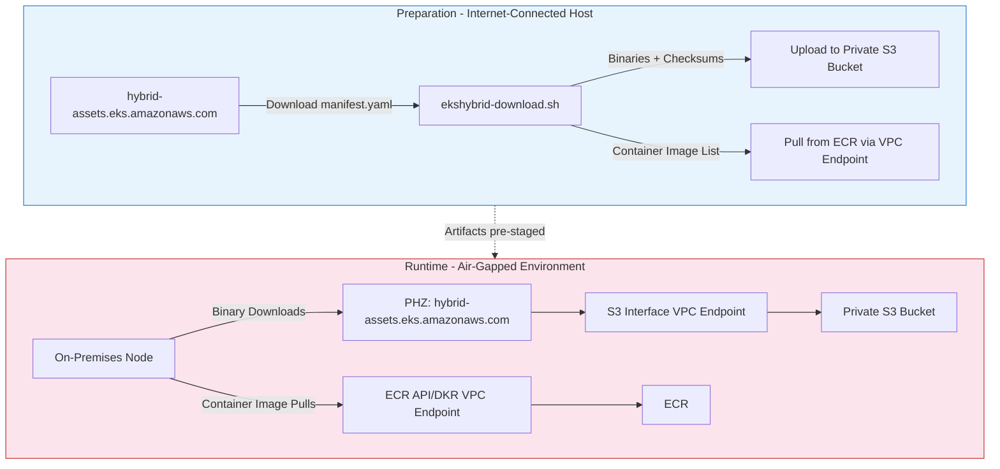

# Air-Gap Environment Setup (S3 + VPC Endpoint)

< [Previous: Network Configuration](./02-network-configuration.md) | [Table of Contents](./README.md) | [Next: Node Bootstrap](./04-node-bootstrap.md) >

> **Supported Versions**: EKS 1.31+, nodeadm 0.1+
> **Last Updated**: February 23, 2026

This document covers setting up air-gapped environments for EKS Hybrid Nodes. Binary artifacts are accessed through a private S3 bucket via VPC Endpoints, and container images are accessed through ECR VPC Endpoints.

## What is an Air-Gapped Environment?

An air-gapped environment is a network that is completely isolated from the public internet. Such environments are essential in security-critical industries.

### Why Air-Gap is Needed

| Requirement | Description |
|-------------|-------------|
| **Security Compliance** | Industries handling sensitive data (finance, healthcare, defense) legally require isolation from external networks |
| **Data Exfiltration Prevention** | Eliminates data leakage risk by blocking all external communication paths |
| **Supply Chain Attack Prevention** | Prevents malicious images from being introduced through external registries |
| **Network Stability** | External service outages do not affect internal systems |

### Types of Air-Gapped Environments

```mermaid
graph TD
    subgraph type1["Fully Air-Gapped"]
        A1[No Internet Connectivity] --> A2[Physical Media Delivery]
        A2 --> A3[USB / DVD / Removable HDD]
    end

    subgraph type2["Partially Air-Gapped - Proxy"]
        B1[Internal Network<br/>Restricted Access] -->|Allow-listed| B2[Proxy Server]
        B2 -->|Selective| B3[Internet]
    end

    subgraph type3["Private Connectivity - VPN/DX + VPC Endpoint"]
        C1[On-Premises<br/>Network] -->|VPN / Direct Connect| C2[AWS VPC]
        C2 --> C3[VPC Endpoints<br/>S3, ECR, etc.]
    end

    style type1 fill:#fee,stroke:#c00
    style type2 fill:#ffe,stroke:#cc0
    style type3 fill:#efe,stroke:#0a0
```



---

## Air-Gap Architecture Overview

The air-gap architecture configured in this document is as follows:



### Artifact Storage Responsibilities

| Artifact Type | Storage | Access Path |
|---------------|---------|-------------|
| nodeadm, kubelet, kubectl, kube-proxy | S3 Bucket | S3 Interface VPC Endpoint |
| cni-plugins, ecr-credential-provider | S3 Bucket | S3 Interface VPC Endpoint |
| aws-iam-authenticator, aws_signing_helper | S3 Bucket | S3 Interface VPC Endpoint |
| Checksum files (.sha256) | S3 Bucket | S3 Interface VPC Endpoint |
| manifest.yaml | S3 Bucket | S3 Interface VPC Endpoint |
| pause, coredns, kube-proxy images | ECR | ECR API/DKR VPC Endpoint |
| vpc-cni, vpc-cni-init images | ECR | ECR API/DKR VPC Endpoint |

---

## Artifact Download Based on manifest.yaml

### manifest.yaml Structure

`hybrid-assets.eks.amazonaws.com/manifest.yaml` contains URLs and checksums for all binaries required by EKS Hybrid Nodes, organized by version and architecture.

```yaml
# manifest.yaml structure (excerpt)
supported_eks_releases:
- latest_patch_version: "3"
  major_minor_version: "1.33"
  patch_releases:
  - version: "1.33.3"
    artifacts:
    - arch: amd64
      checksum_uri: https://hybrid-assets.eks.amazonaws.com/artifacts/1.33.0/.../kubelet.sha256
      name: kubelet
      os: linux
      uri: https://hybrid-assets.eks.amazonaws.com/artifacts/1.33.0/.../kubelet
    - arch: amd64
      checksum_uri: https://hybrid-assets.eks.amazonaws.com/artifacts/1.33.0/.../kubectl.sha256
      name: kubectl
      os: linux
      uri: https://hybrid-assets.eks.amazonaws.com/artifacts/1.33.0/.../kubectl
    # ... cni, cni-plugins, kube-proxy, ecr-credential-provider, aws-iam-authenticator
```

Key binaries included in manifest.yaml:

| Binary | Purpose |
|--------|---------|
| `kubelet` | Node's Kubernetes agent |
| `kubectl` | Kubernetes CLI |
| `kube-proxy` | Network proxy |
| `cni` / `cni-plugins` | Container Network Interface |
| `ecr-credential-provider` | ECR authentication helper |
| `aws-iam-authenticator` | IAM authentication |

### Download and S3 Upload Script (ekshybrid-download.sh)

Run this on an internet-connected host to download all binaries based on manifest.yaml and upload them to S3.

```bash
#!/bin/bash
# ekshybrid-download.sh - EKS Hybrid nodeadm air-gap setup script
# Usage: ./ekshybrid-download.sh <S3_BUCKET_NAME> [KUBERNETES_VERSION] [ARCHITECTURE]
# Example: ./ekshybrid-download.sh ekshybrid-my-bucket 1.33.3 amd64

set -e

# Default values
KUBERNETES_VERSION="${2:-1.33.3}"
ARCHITECTURE="${3:-amd64}"
REGION="ap-northeast-2"
MANIFEST_URL="https://hybrid-assets.eks.amazonaws.com/manifest.yaml"
WORK_DIR="/tmp/nodeadm-offline"
LOG_FILE="/tmp/nodeadm-offline-setup.log"

# Color definitions
RED='\033[0;31m'
GREEN='\033[0;32m'
YELLOW='\033[1;33m'
BLUE='\033[0;34m'
NC='\033[0m'

log()  { echo -e "${GREEN}[$(date '+%Y-%m-%d %H:%M:%S')] $1${NC}" | tee -a "$LOG_FILE"; }
warn() { echo -e "${YELLOW}[$(date '+%Y-%m-%d %H:%M:%S')] WARNING: $1${NC}" | tee -a "$LOG_FILE"; }
error(){ echo -e "${RED}[$(date '+%Y-%m-%d %H:%M:%S')] ERROR: $1${NC}" | tee -a "$LOG_FILE"; exit 1; }
info() { echo -e "${BLUE}[$(date '+%Y-%m-%d %H:%M:%S')] INFO: $1${NC}" | tee -a "$LOG_FILE"; }

# Parameter validation
if [ $# -lt 1 ]; then
    echo "Usage: $0 <S3_BUCKET_NAME> [KUBERNETES_VERSION] [ARCHITECTURE]"
    echo ""
    echo "Parameters:"
    echo "  S3_BUCKET_NAME      : S3 bucket name to store binaries (required)"
    echo "  KUBERNETES_VERSION  : Kubernetes version (default: 1.33.3)"
    echo "  ARCHITECTURE        : Architecture (default: amd64, option: arm64)"
    echo ""
    echo "Examples:"
    echo "  $0 my-nodeadm-bucket"
    echo "  $0 my-nodeadm-bucket 1.33.3 amd64"
    exit 1
fi

S3_BUCKET="$1"

# Check prerequisites
check_prerequisites() {
    log "Checking prerequisites..."
    local missing_tools=()

    command -v aws &>/dev/null  || missing_tools+=("aws-cli")
    command -v curl &>/dev/null || missing_tools+=("curl")
    command -v yq &>/dev/null   || missing_tools+=("yq (https://github.com/mikefarah/yq)")
    command -v jq &>/dev/null   || missing_tools+=("jq")

    if [ ${#missing_tools[@]} -ne 0 ]; then
        error "The following tools are required: ${missing_tools[*]}"
    fi
    log "Prerequisites check complete"
}

# Setup work directory
setup_work_directory() {
    log "Setting up work directory..."
    rm -rf "$WORK_DIR"
    mkdir -p "$WORK_DIR"/{binaries,checksums,images}
    cd "$WORK_DIR"
}

# Download manifest.yaml
download_manifest() {
    log "Downloading manifest.yaml..."
    curl -sL "$MANIFEST_URL" -o manifest.yaml
    [ -f manifest.yaml ] || error "Failed to download manifest.yaml"
    log "manifest.yaml download complete"
}

# Extract binary URLs from manifest.yaml (using yq)
extract_binary_urls() {
    log "Extracting binary URLs for Kubernetes $KUBERNETES_VERSION ($ARCHITECTURE)..."
    local MAJOR_MINOR=$(echo "$KUBERNETES_VERSION" | cut -d. -f1,2)

    # Extract binary URLs
    yq -r ".supported_eks_releases[]
      | select(.major_minor_version == \"$MAJOR_MINOR\")
      | .patch_releases[]
      | select(.version == \"$KUBERNETES_VERSION\")
      | .artifacts[]
      | select(.os == \"linux\" and .arch == \"$ARCHITECTURE\")
      | .uri" manifest.yaml > binary_urls.txt

    # Extract checksum URLs
    yq -r ".supported_eks_releases[]
      | select(.major_minor_version == \"$MAJOR_MINOR\")
      | .patch_releases[]
      | select(.version == \"$KUBERNETES_VERSION\")
      | .artifacts[]
      | select(.os == \"linux\" and .arch == \"$ARCHITECTURE\")
      | .checksum_uri" manifest.yaml > checksum_urls.txt

    [ -s binary_urls.txt ] || error "No binaries found for the specified version/architecture"

    # Generate additional URLs and metadata as JSON
    local ECR_ACCOUNT_ID=$(yq -r ".region_config.\"$REGION\".ecr_account_id // \"602401143452\"" manifest.yaml)
    local SIGNING_URI=$(yq -r "[.iam_roles_anywhere_releases[].artifacts[] | select(.os == \"linux\" and .arch == \"$ARCHITECTURE\")] | .[0].uri // \"\"" manifest.yaml)
    local SIGNING_CHECKSUM=$(yq -r "[.iam_roles_anywhere_releases[].artifacts[] | select(.os == \"linux\" and .arch == \"$ARCHITECTURE\")] | .[0].checksum_uri // \"\"" manifest.yaml)

    jq -n \
      --arg ecr "$ECR_ACCOUNT_ID" \
      --arg nodeadm "https://hybrid-assets.eks.amazonaws.com/releases/latest/bin/linux/${ARCHITECTURE}/nodeadm" \
      --arg ssm "https://amazon-ssm-us-west-2.s3.us-west-2.amazonaws.com/latest/linux_${ARCHITECTURE}/ssm-setup-cli" \
      --arg signing_uri "$SIGNING_URI" \
      --arg signing_checksum "$SIGNING_CHECKSUM" \
      '{ecr_account_id: $ecr, nodeadm: $nodeadm, ssm_setup_cli: $ssm,
        aws_signing_helper: {uri: $signing_uri, checksum_uri: $signing_checksum}}' \
      > additional_urls.json

    # Generate container image list
    # Note: image tags are not included in manifest.yaml, so they are hardcoded
    local ECR_REGISTRY="${ECR_ACCOUNT_ID}.dkr.ecr.${REGION}.amazonaws.com"
    cat > container_images.txt <<IMGEOF
${ECR_REGISTRY}/eks/kube-proxy:v${KUBERNETES_VERSION}-minimal-eksbuild.1
${ECR_REGISTRY}/eks/pause:3.5
${ECR_REGISTRY}/amazon-k8s-cni:v1.18.5-eksbuild.1
${ECR_REGISTRY}/amazon-k8s-cni-init:v1.18.5-eksbuild.1
${ECR_REGISTRY}/eks/coredns:v1.11.3-eksbuild.1
IMGEOF

    log "Extraction complete: $(wc -l < binary_urls.txt) binaries, $(wc -l < checksum_urls.txt) checksums, $(wc -l < container_images.txt) images"
}

# Download binaries
download_binaries() {
    log "Downloading binaries..."
    local count=0
    local total=$(wc -l < binary_urls.txt)
    while IFS= read -r url; do
        [ -n "$url" ] || continue
        count=$((count + 1))
        filename=$(basename "$url")
        info "[$count/$total] Downloading $filename..."
        curl -sL -o "binaries/$filename" "$url" && log "  $filename complete" || warn "  $filename failed"
    done < binary_urls.txt
}

# Download checksums
download_checksums() {
    log "Downloading checksum files..."
    local count=0
    local total=$(wc -l < checksum_urls.txt)
    while IFS= read -r url; do
        [ -n "$url" ] || continue
        count=$((count + 1))
        filename=$(basename "$url")
        info "[$count/$total] Downloading $filename..."
        curl -sL -o "checksums/$filename" "$url" && log "  $filename complete" || warn "  $filename failed"
    done < checksum_urls.txt
}

# Download additional binaries (nodeadm, ssm-setup-cli, aws_signing_helper)
download_additional_binaries() {
    log "Downloading additional required binaries..."
    if [ -f additional_urls.json ]; then
        local nodeadm_url=$(jq -r '.nodeadm // empty' additional_urls.json)
        [ -n "$nodeadm_url" ] && { info "Downloading nodeadm..."; curl -sL -o "binaries/nodeadm" "$nodeadm_url"; chmod +x "binaries/nodeadm"; }

        local ssm_url=$(jq -r '.ssm_setup_cli // empty' additional_urls.json)
        [ -n "$ssm_url" ] && { info "Downloading ssm-setup-cli..."; curl -sL -o "binaries/ssm-setup-cli" "$ssm_url"; chmod +x "binaries/ssm-setup-cli"; }

        local signing_helper=$(jq -r '.aws_signing_helper.uri // empty' additional_urls.json)
        [ -n "$signing_helper" ] && { info "Downloading aws_signing_helper..."; curl -sL -o "binaries/aws_signing_helper" "$signing_helper"; chmod +x "binaries/aws_signing_helper"; }
    fi
}

# Verify checksums
verify_checksums() {
    log "Verifying checksums..."
    local verified=0 failed=0
    for checksum_file in checksums/*.sha256; do
        [ -f "$checksum_file" ] || continue
        checksum_name=$(basename "$checksum_file" .sha256)
        binary_file="binaries/$checksum_name"
        [ -f "$binary_file" ] || continue
        expected=$(awk '{print $1}' "$checksum_file")
        actual=$(sha256sum "$binary_file" | awk '{print $1}')
        if [ "$expected" = "$actual" ]; then
            info "  $checksum_name verification passed"; verified=$((verified + 1))
        else
            warn "  $checksum_name verification failed"; failed=$((failed + 1))
        fi
    done
    log "Checksum verification complete: $verified passed, $failed failed"
}

# Upload to S3
upload_to_s3() {
    log "Uploading to S3 bucket ($S3_BUCKET)..."
    aws s3 ls "s3://$S3_BUCKET" --region "$REGION" &>/dev/null || {
        info "Creating S3 bucket..."; aws s3 mb "s3://$S3_BUCKET" --region "$REGION"
    }
    aws s3 cp manifest.yaml "s3://$S3_BUCKET/manifest.yaml" --region "$REGION"
    aws s3 sync binaries/  "s3://$S3_BUCKET/binaries/"  --region "$REGION"
    aws s3 sync checksums/ "s3://$S3_BUCKET/checksums/" --region "$REGION"
    aws s3 cp container_images.txt "s3://$S3_BUCKET/container_images.txt" --region "$REGION"
    aws s3 cp additional_urls.json "s3://$S3_BUCKET/additional_urls.json" --region "$REGION"
    log "S3 upload complete"
}

# Main execution
main() {
    log "Starting EKS Hybrid nodeadm air-gap setup"
    log "S3 bucket: $S3_BUCKET, Kubernetes: $KUBERNETES_VERSION, Architecture: $ARCHITECTURE"

    check_prerequisites
    setup_work_directory
    download_manifest
    extract_binary_urls
    download_binaries
    download_checksums
    download_additional_binaries
    verify_checksums
    upload_to_s3

    log "=== Upload Summary ==="
    info "Binaries: $(ls binaries/ | wc -l) files → /binaries subfolder"
    info "Checksums: $(ls checksums/ | wc -l) files → /checksums subfolder"
    info "Container images: $(wc -l < container_images.txt) → container_images.txt"
    log "All tasks completed!"
}

main "$@"
```

The resulting S3 bucket structure after execution:

```
s3://<BUCKET_NAME>/
├── manifest.yaml
├── container_images.txt
├── additional_urls.json
├── binaries/
│   ├── nodeadm
│   ├── kubelet
│   ├── kubectl
│   ├── kube-proxy
│   ├── cni-plugins-linux-amd64-*.tgz
│   ├── ecr-credential-provider
│   ├── aws-iam-authenticator
│   ├── ssm-setup-cli
│   └── aws_signing_helper
└── checksums/
    ├── kubelet.sha256
    ├── kubectl.sha256
    ├── kube-proxy.sha256
    └── ...
```

---

## S3 Bucket Configuration

### Bucket Creation and Versioning

```bash
BUCKET_NAME="my-hybrid-assets-$(aws sts get-caller-identity --query Account --output text)"
REGION="ap-northeast-2"

# Create S3 bucket
aws s3 mb s3://${BUCKET_NAME} --region ${REGION}

# Enable versioning (for rollback)
aws s3api put-bucket-versioning \
  --bucket ${BUCKET_NAME} \
  --versioning-configuration Status=Enabled
```

### S3 Bucket Policy (VPC Endpoint Restriction)

Restrict access so only requests through the VPC Endpoint are allowed.

```json
{
  "Version": "2012-10-17",
  "Statement": [
    {
      "Sid": "AllowVPCEndpointAccess",
      "Effect": "Allow",
      "Principal": "*",
      "Action": [
        "s3:GetObject",
        "s3:ListBucket"
      ],
      "Resource": [
        "arn:aws:s3:::my-hybrid-assets-<ACCOUNT_ID>",
        "arn:aws:s3:::my-hybrid-assets-<ACCOUNT_ID>/*"
      ],
      "Condition": {
        "StringEquals": {
          "aws:sourceVpce": "<VPCE_ID>"
        }
      }
    },
    {
      "Sid": "DenyNonVPCEndpointAccess",
      "Effect": "Deny",
      "Principal": "*",
      "Action": "s3:*",
      "Resource": [
        "arn:aws:s3:::my-hybrid-assets-<ACCOUNT_ID>",
        "arn:aws:s3:::my-hybrid-assets-<ACCOUNT_ID>/*"
      ],
      "Condition": {
        "StringNotEquals": {
          "aws:sourceVpce": "<VPCE_ID>"
        }
      }
    }
  ]
}
```

```bash
# Apply bucket policy
aws s3api put-bucket-policy \
  --bucket my-hybrid-assets-<ACCOUNT_ID> \
  --policy file://bucket-policy.json
```

---

## Air-Gap Installation Method Comparison

There are two main approaches to installing nodeadm binaries on nodes in air-gapped environments:

| Item | Method 1: PHZ DNS Override | Method 2: Manual Binary Pre-installation |
|------|---------------------------|----------------------------------------|
| **Principle** | Override DNS so `nodeadm install` downloads from S3 | Download directly from S3 and skip `nodeadm install` |
| **PHZ Required** | Yes | No |
| **Route53 Required** | Yes | No |
| **Uses nodeadm install** | Yes (works normally) | No (skipped) |
| **Advantages** | Uses the official nodeadm workflow as-is | Minimal infrastructure setup, fast configuration |
| **Disadvantages** | Complex PHZ + DNS forwarding setup | Manual management required for nodeadm version updates |
| **Best For** | Large-scale operations, long-term management | Small-scale, PoC, quick testing |

> **Why can't you change the download URL with environment variables?**
>
> nodeadm's artifact download URL (`hybrid-assets.eks.amazonaws.com`) is a build-time constant injected
> via Go ldflags (`-X github.com/aws/eks-hybrid/internal/aws.manifestUrl=...`).
> There is no `os.Getenv()` call for the artifact URL, so the official release binary
> cannot be redirected to a URL other than `hybrid-assets.eks.amazonaws.com`.
> Building from source allows changing the `MANIFEST_HOST` Makefile variable, but this is outside official support.

---

## PHZ DNS Override (Method 1)

### The Problem

`hybrid-assets.eks.amazonaws.com` is the URL where AWS hosts nodeadm binaries via CloudFront. This domain **cannot be reached through standard VPC endpoints**:

- It is a **CloudFront distribution**, so S3 or EKS VPC endpoints cannot route to it
- In air-gapped environments, `nodeadm install` attempts to download binaries from this URL and fails
- Without an internet path, nodeadm installation is impossible

### Solution

Mirror the artifacts to a private S3 bucket, then use a Private Hosted Zone (PHZ) to override DNS so that requests to `hybrid-assets.eks.amazonaws.com` route to an S3 Interface VPC Endpoint.

### S3 Interface VPC Endpoint

The S3 Interface VPC Endpoint was already created in the [Network Configuration document](./02-network-configuration.md#vpc-private-endpoints-air-gapprivate-environments). Verify the endpoint DNS name:

```bash
# Get S3 Interface VPC Endpoint DNS name
aws ec2 describe-vpc-endpoints \
  --filters "Name=service-name,Values=com.amazonaws.<REGION>.s3" \
             "Name=vpc-endpoint-type,Values=Interface" \
  --query 'VpcEndpoints[0].DnsEntries[0].DnsName' \
  --output text
# Example output: *.vpce-0abc123def456789a-xyz12345.s3.ap-northeast-2.vpce.amazonaws.com
```

### Create Private Hosted Zone

```bash
# 1. Create Private Hosted Zone
HOSTED_ZONE_ID=$(aws route53 create-hosted-zone \
  --name "hybrid-assets.eks.amazonaws.com" \
  --vpc VPCRegion=<REGION>,VPCId=<VPC_ID> \
  --caller-reference "hybrid-assets-phz-$(date +%s)" \
  --hosted-zone-config PrivateZone=true \
  --query 'HostedZone.Id' --output text)

echo "PHZ created: ${HOSTED_ZONE_ID}"

# 2. Get S3 Interface VPC Endpoint regional DNS name
VPCE_DNS=$(aws ec2 describe-vpc-endpoints \
  --filters "Name=service-name,Values=com.amazonaws.<REGION>.s3" \
             "Name=vpc-endpoint-type,Values=Interface" \
  --query 'VpcEndpoints[0].DnsEntries[?contains(DnsName, `vpce`)].DnsName | [0]' \
  --output text)

# 3. Get S3 VPC Endpoint Hosted Zone ID
VPCE_HZ_ID=$(aws ec2 describe-vpc-endpoints \
  --filters "Name=service-name,Values=com.amazonaws.<REGION>.s3" \
             "Name=vpc-endpoint-type,Values=Interface" \
  --query 'VpcEndpoints[0].DnsEntries[?contains(DnsName, `vpce`)].HostedZoneId | [0]' \
  --output text)

# 4. Create Alias record
aws route53 change-resource-record-sets \
  --hosted-zone-id ${HOSTED_ZONE_ID} \
  --change-batch "{
    \"Changes\": [{
      \"Action\": \"UPSERT\",
      \"ResourceRecordSet\": {
        \"Name\": \"hybrid-assets.eks.amazonaws.com\",
        \"Type\": \"A\",
        \"AliasTarget\": {
          \"DNSName\": \"${VPCE_DNS}\",
          \"HostedZoneId\": \"${VPCE_HZ_ID}\",
          \"EvaluateTargetHealth\": true
        }
      }
    }]
  }"

echo "PHZ Alias record created"
```

### On-Premises DNS Integration

Configure your on-premises DNS so that queries for `hybrid-assets.eks.amazonaws.com` resolve through the PHZ, returning the S3 VPC Endpoint's private IP.

If you have already created a Route 53 Resolver Inbound Endpoint as described in the [Network Configuration document](./02-network-configuration.md), verify that your on-premises DNS conditional forwarding includes the `eks.amazonaws.com` domain.

```
# BIND example - forward all eks.amazonaws.com to Route 53
zone "eks.amazonaws.com" {
    type forward;
    forward only;
    forwarders {
        10.0.1.10;    # Route 53 Inbound Endpoint IP #1
        10.0.2.10;    # Route 53 Inbound Endpoint IP #2
    };
};
```

---

## Installation on Air-Gapped Nodes (Method 2: Manual Binary Pre-installation)

### Offline Installation Script (offline-install.sh)

This method installs binaries directly on air-gapped nodes without PHZ configuration. It downloads binaries from the S3 bucket via VPC Endpoint and installs them manually. With this approach, you can skip the `nodeadm install` step and proceed directly to `nodeadm init`.

```bash
#!/bin/bash
# offline-install.sh - EKS Hybrid nodeadm air-gap installation script
# Usage: ./offline-install.sh <S3_BUCKET_NAME> <VPC_ENDPOINT_URL>
# Example: ./offline-install.sh my-nodeadm-bucket https://vpce-xxxxx-xxxxx.s3.ap-northeast-2.vpce.amazonaws.com

set -e

S3_BUCKET="$1"
VPC_ENDPOINT_URL="$2"
REGION="ap-northeast-2"

if [ $# -lt 2 ]; then
    echo "Usage: $0 <S3_BUCKET_NAME> <VPC_ENDPOINT_URL>"
    echo "Example: $0 my-nodeadm-bucket https://vpce-xxxxx-xxxxx.s3.ap-northeast-2.vpce.amazonaws.com"
    exit 1
fi

log() { echo "[$(date '+%Y-%m-%d %H:%M:%S')] $1"; }

# Configure AWS CLI to use S3 VPC Endpoint
export AWS_S3_ENDPOINT_URL="$VPC_ENDPOINT_URL"

# Create work directory
WORK_DIR="/tmp/nodeadm-install"
mkdir -p "$WORK_DIR"
cd "$WORK_DIR"

# Download files from S3
log "Downloading files from S3..."
aws s3 cp "s3://$S3_BUCKET/manifest.yaml" . --region "$REGION"
aws s3 cp "s3://$S3_BUCKET/container_images.txt" . --region "$REGION"

mkdir -p binaries checksums
aws s3 sync "s3://$S3_BUCKET/binaries/"  binaries/  --region "$REGION"
aws s3 sync "s3://$S3_BUCKET/checksums/" checksums/ --region "$REGION"

# Verify checksums
log "Verifying checksums..."
for checksum_file in checksums/*.sha256; do
    [ -f "$checksum_file" ] || continue
    checksum_name=$(basename "$checksum_file" .sha256)
    binary_file="binaries/$checksum_name"
    [ -f "$binary_file" ] || continue

    expected=$(awk '{print $1}' "$checksum_file")
    actual=$(sha256sum "$binary_file" | awk '{print $1}')

    if [ "$expected" = "$actual" ]; then
        log "  $checksum_name verification passed"
    else
        log "  $checksum_name verification failed"
        exit 1
    fi
done

# Install binaries
log "Installing binaries..."
sudo cp binaries/nodeadm /usr/local/bin/ 2>/dev/null || true
sudo cp binaries/kubectl /usr/local/bin/ 2>/dev/null || true
sudo cp binaries/kubelet /usr/local/bin/ 2>/dev/null || true
sudo cp binaries/aws-iam-authenticator /usr/local/bin/ 2>/dev/null || true
sudo cp binaries/ecr-credential-provider /usr/local/bin/ 2>/dev/null || true
sudo cp binaries/kube-proxy /usr/local/bin/ 2>/dev/null || true

# Set execute permissions
sudo chmod +x /usr/local/bin/{nodeadm,kubectl,kubelet,aws-iam-authenticator,ecr-credential-provider,kube-proxy} 2>/dev/null || true

# Install CNI plugins
log "Installing CNI plugins..."
sudo mkdir -p /opt/cni/bin
for tgz in binaries/cni-plugins-linux-*.tgz binaries/cni-*-v*.tgz; do
    [ -f "$tgz" ] && sudo tar -xzf "$tgz" -C /opt/cni/bin/
done

# Configure containerd (if already installed)
if command -v containerd &>/dev/null; then
    log "Configuring containerd..."
    sudo mkdir -p /etc/containerd
    [ -f /etc/containerd/config.toml ] || sudo containerd config default | sudo tee /etc/containerd/config.toml >/dev/null
fi

log "Installation complete!"
log ""
log "Next steps:"
log "1. Verify nodeadm version: nodeadm version"
log "2. (Manual installation was used, so the nodeadm install step is skipped)"
log "   Only run nodeadm install if you have configured PHZ DNS override:"
log "   sudo nodeadm install $KUBERNETES_VERSION --credential-provider ssm"
log "3. Join cluster: sudo nodeadm init --config-source file://nodeconfig.yaml"
```

### Running nodeadm init

After installation, register the node with the EKS cluster:

```yaml
# nodeconfig.yaml
apiVersion: node.eks.aws/v1alpha1
kind: NodeConfig
spec:
  cluster:
    name: my-hybrid-cluster
    region: ap-northeast-2
    apiServerEndpoint: https://XXXXXXXX.gr7.ap-northeast-2.eks.amazonaws.com
    certificateAuthority: |
      -----BEGIN CERTIFICATE-----
      ...
      -----END CERTIFICATE-----
    cidr: 10.100.0.0/16

  hybrid:
    ssm:
      activationCode: <activation-code>
      activationId: <activation-id>

  kubelet:
    config:
      maxPods: 110
    flags:
      - --node-labels=topology.kubernetes.io/zone=on-premises
```

```bash
# Validate configuration file
nodeadm config check --config-source file://nodeconfig.yaml

# Initialize node
sudo -E nodeadm init --config-source file://nodeconfig.yaml
```

---

## Container Image Access (ECR VPC Endpoint)

### Required Container Images

Container images required for EKS Hybrid Nodes operation are provided through ECR:

| Image | Purpose | Source Registry |
|-------|---------|-----------------|
| `pause` | Pod infrastructure container | `602401143452.dkr.ecr.<region>.amazonaws.com/eks/pause` |
| `coredns` | Cluster DNS | `602401143452.dkr.ecr.<region>.amazonaws.com/eks/coredns` |
| `kube-proxy` | Network proxy | `602401143452.dkr.ecr.<region>.amazonaws.com/eks/kube-proxy` |
| `vpc-cni-init` | VPC CNI initialization | `602401143452.dkr.ecr.<region>.amazonaws.com/amazon-k8s-cni-init` |
| `aws-node` | AWS VPC CNI | `602401143452.dkr.ecr.<region>.amazonaws.com/amazon-k8s-cni` |

### Image Access via ECR VPC Endpoint

ECR API (`ecr.api`) and ECR DKR (`ecr.dkr`) Interface VPC Endpoints were already created in the [Network Configuration document](./02-network-configuration.md#vpc-private-endpoints-air-gapprivate-environments). These enable pulling images directly from ECR even in air-gapped environments.

### ecr-credential-provider Configuration

kubelet requires authentication to pull images from ECR. The `ecr-credential-provider` was already downloaded and installed to `/usr/local/bin/` by ekshybrid-download.sh.

```bash
# Create credential provider config directory
sudo mkdir -p /etc/kubernetes/image-credential-provider

# Create credential provider config file
cat <<EOF | sudo tee /etc/kubernetes/image-credential-provider/config.json
{
  "apiVersion": "kubelet.config.k8s.io/v1",
  "kind": "CredentialProviderConfig",
  "providers": [
    {
      "name": "ecr-credential-provider",
      "matchImages": [
        "*.dkr.ecr.*.amazonaws.com",
        "*.dkr.ecr.*.amazonaws.com.cn"
      ],
      "defaultCacheDuration": "12h",
      "apiVersion": "credentialprovider.kubelet.k8s.io/v1"
    }
  ]
}
EOF
```

### Image Export/Import for Fully Air-Gapped Environments

For fully air-gapped environments where ECR VPC Endpoints are also unavailable, export images to files and transfer via physical media.

```bash
# Export images to tar on internet-connected environment
IMAGES=(
  "602401143452.dkr.ecr.ap-northeast-2.amazonaws.com/eks/pause:3.5"
  "602401143452.dkr.ecr.ap-northeast-2.amazonaws.com/eks/coredns:v1.11.3-eksbuild.1"
  "602401143452.dkr.ecr.ap-northeast-2.amazonaws.com/eks/kube-proxy:v1.33.3-minimal-eksbuild.1"
)

EXPORT_DIR="/media/usb/eks-images"
mkdir -p $EXPORT_DIR

for img in "${IMAGES[@]}"; do
  filename=$(echo $img | tr '/:' '_')
  echo "Exporting: $img"
  skopeo copy "docker://${img}" "oci-archive:${EXPORT_DIR}/${filename}.tar"
done

# Generate checksums
cd $EXPORT_DIR && sha256sum *.tar > checksums.sha256
```

```bash
# Import images on air-gapped environment (using containerd)
IMPORT_DIR="/media/usb/eks-images"

cd $IMPORT_DIR
sha256sum -c checksums.sha256

for tarfile in $IMPORT_DIR/*.tar; do
  echo "Importing: $tarfile"
  sudo ctr -n k8s.io images import "$tarfile"
done
```

---

## Local RPM/DEB Repository Configuration

For large-scale deployments, you can set up a local package repository.

```bash
# Ubuntu/Debian - Local APT repository setup
mkdir -p /srv/apt-repo/pool
cp /media/usb/nodeadm-packages/debs/* /srv/apt-repo/pool/

cd /srv/apt-repo
dpkg-scanpackages pool /dev/null | gzip -9c > Packages.gz

# Client configuration
echo "deb [trusted=yes] file:///srv/apt-repo ./" > /etc/apt/sources.list.d/local.list
apt-get update
```

```bash
# RHEL/CentOS - Local YUM repository setup
mkdir -p /srv/yum-repo
cp /media/usb/nodeadm-packages/rpms/* /srv/yum-repo/

cd /srv/yum-repo
createrepo .

# Client configuration
cat <<EOF > /etc/yum.repos.d/local.repo
[local]
name=Local Repository
baseurl=file:///srv/yum-repo
enabled=1
gpgcheck=0
EOF

yum clean all
yum makecache
```

---

## Proxy Configuration

For partially air-gapped environments, restricted external access can be allowed through a proxy.

### System Proxy Settings

```bash
# Add proxy settings to /etc/environment
cat <<EOF | sudo tee -a /etc/environment
HTTP_PROXY="http://proxy.internal.company.io:3128"
HTTPS_PROXY="http://proxy.internal.company.io:3128"
NO_PROXY="localhost,127.0.0.1,10.0.0.0/8,172.16.0.0/12,192.168.0.0/16,.internal.company.io,.eks.amazonaws.com"
http_proxy="http://proxy.internal.company.io:3128"
https_proxy="http://proxy.internal.company.io:3128"
no_proxy="localhost,127.0.0.1,10.0.0.0/8,172.16.0.0/12,192.168.0.0/16,.internal.company.io,.eks.amazonaws.com"
EOF

source /etc/environment
```

### containerd Proxy Settings

```bash
sudo mkdir -p /etc/systemd/system/containerd.service.d

cat <<EOF | sudo tee /etc/systemd/system/containerd.service.d/http-proxy.conf
[Service]
Environment="HTTP_PROXY=http://proxy.internal.company.io:3128"
Environment="HTTPS_PROXY=http://proxy.internal.company.io:3128"
Environment="NO_PROXY=localhost,127.0.0.1,10.0.0.0/8,172.16.0.0/12,192.168.0.0/16,.internal.company.io,.eks.amazonaws.com"
EOF

sudo systemctl daemon-reload
sudo systemctl restart containerd
```

### kubelet Proxy Settings

```bash
sudo mkdir -p /etc/systemd/system/kubelet.service.d

cat <<EOF | sudo tee /etc/systemd/system/kubelet.service.d/http-proxy.conf
[Service]
Environment="HTTP_PROXY=http://proxy.internal.company.io:3128"
Environment="HTTPS_PROXY=http://proxy.internal.company.io:3128"
Environment="NO_PROXY=localhost,127.0.0.1,10.0.0.0/8,172.16.0.0/12,192.168.0.0/16,.internal.company.io,.eks.amazonaws.com"
EOF

sudo systemctl daemon-reload
sudo systemctl restart kubelet
```

### nodeadm Proxy Configuration

```yaml
# Add proxy settings to nodeconfig.yaml
apiVersion: node.eks.aws/v1alpha1
kind: NodeConfig
spec:
  cluster:
    name: my-hybrid-cluster
    region: ap-northeast-2
    apiServerEndpoint: https://XXXXXXXX.gr7.ap-northeast-2.eks.amazonaws.com
    certificateAuthority: |
      -----BEGIN CERTIFICATE-----
      ...
      -----END CERTIFICATE-----
    cidr: 10.100.0.0/16

  hybrid:
    ssm:
      activationCode: <activation-code>
      activationId: <activation-id>

  kubelet:
    config:
      maxPods: 110
    flags:
      - --node-labels=topology.kubernetes.io/zone=on-premises

  containerd:
    config: |
      version = 2

      [proxy]
        [proxy.http]
          address = "http://proxy.internal.company.io:3128"
        [proxy.https]
          address = "http://proxy.internal.company.io:3128"
        [proxy.no_proxy]
          addresses = ["localhost", "127.0.0.1", "10.0.0.0/8", ".eks.amazonaws.com"]
```

### OS-Specific SSM Agent Proxy Settings

The SSM agent requires proxy configuration files in different locations depending on the OS.

| OS | Proxy Config Path |
|----|-------------------|
| Ubuntu | `/etc/systemd/system/snap.amazon-ssm-agent.amazon-ssm-agent.service.d/http-proxy.conf` |
| AL2023 | `/etc/systemd/system/amazon-ssm-agent.service.d/http-proxy.conf` |
| RHEL | `/etc/systemd/system/amazon-ssm-agent.service.d/http-proxy.conf` |

**Ubuntu (snap-based):**

```bash
sudo mkdir -p /etc/systemd/system/snap.amazon-ssm-agent.amazon-ssm-agent.service.d

cat <<EOF | sudo tee /etc/systemd/system/snap.amazon-ssm-agent.amazon-ssm-agent.service.d/http-proxy.conf
[Service]
Environment="HTTP_PROXY=http://proxy.internal.company.io:3128"
Environment="HTTPS_PROXY=http://proxy.internal.company.io:3128"
Environment="NO_PROXY=localhost,127.0.0.1,169.254.169.254,10.0.0.0/8,.eks.amazonaws.com"
EOF

sudo systemctl daemon-reload
sudo systemctl restart snap.amazon-ssm-agent.amazon-ssm-agent.service
```

**AL2023 / RHEL:**

```bash
sudo mkdir -p /etc/systemd/system/amazon-ssm-agent.service.d

cat <<EOF | sudo tee /etc/systemd/system/amazon-ssm-agent.service.d/http-proxy.conf
[Service]
Environment="HTTP_PROXY=http://proxy.internal.company.io:3128"
Environment="HTTPS_PROXY=http://proxy.internal.company.io:3128"
Environment="NO_PROXY=localhost,127.0.0.1,169.254.169.254,10.0.0.0/8,.eks.amazonaws.com"
EOF

sudo systemctl daemon-reload
sudo systemctl restart amazon-ssm-agent
```

### kube-proxy DaemonSet Proxy Settings

You may need to configure proxy environment variables for the kube-proxy DaemonSet. This configuration must be applied **after cluster creation but before running nodeadm init**.

```yaml
apiVersion: apps/v1
kind: DaemonSet
metadata:
  name: kube-proxy
  namespace: kube-system
spec:
  template:
    spec:
      containers:
        - name: kube-proxy
          command:
            - kube-proxy
          env:
            - name: HTTP_PROXY
              value: "http://proxy.internal.company.io:3128"
            - name: HTTPS_PROXY
              value: "http://proxy.internal.company.io:3128"
            - name: NO_PROXY
              value: "localhost,127.0.0.1,10.0.0.0/8,172.16.0.0/12,192.168.0.0/16,.eks.amazonaws.com,.svc,.cluster.local"
```

```bash
# Patch existing kube-proxy DaemonSet with environment variables
kubectl patch daemonset kube-proxy -n kube-system --type='json' -p='[
  {
    "op": "add",
    "path": "/spec/template/spec/containers/0/env",
    "value": [
      {"name": "HTTP_PROXY", "value": "http://proxy.internal.company.io:3128"},
      {"name": "HTTPS_PROXY", "value": "http://proxy.internal.company.io:3128"},
      {"name": "NO_PROXY", "value": "localhost,127.0.0.1,10.0.0.0/8,.eks.amazonaws.com,.svc,.cluster.local"}
    ]
  }
]'
```

> **Note**: kube-proxy proxy settings must be applied after cluster creation but before running nodeadm init. Otherwise, kube-proxy may not start correctly on hybrid nodes.

### IAM Roles Anywhere Proxy Settings

When using IAM Roles Anywhere, the `aws_signing_helper` service also requires proxy configuration.

```bash
sudo mkdir -p /etc/systemd/system/aws_signing_helper_update.service.d

cat <<EOF | sudo tee /etc/systemd/system/aws_signing_helper_update.service.d/http-proxy.conf
[Service]
Environment="HTTP_PROXY=http://proxy.internal.company.io:3128"
Environment="HTTPS_PROXY=http://proxy.internal.company.io:3128"
Environment="NO_PROXY=localhost,127.0.0.1,169.254.169.254,10.0.0.0/8,.eks.amazonaws.com"
EOF

sudo systemctl daemon-reload
sudo systemctl restart aws_signing_helper_update.service
```

### Package Manager Proxy Settings

Your operating system's package manager may also require proxy configuration.

**Ubuntu - apt:**

```bash
cat <<EOF | sudo tee /etc/apt/apt.conf.d/proxy.conf
Acquire::http::Proxy "http://proxy.internal.company.io:3128";
Acquire::https::Proxy "http://proxy.internal.company.io:3128";
EOF
```

**Ubuntu - snap:**

```bash
sudo snap set system proxy.http="http://proxy.internal.company.io:3128"
sudo snap set system proxy.https="http://proxy.internal.company.io:3128"
```

**AL2023 - dnf:**

```bash
cat <<EOF | sudo tee -a /etc/dnf/dnf.conf
proxy=http://proxy.internal.company.io:3128
EOF
```

**RHEL - yum:**

```bash
cat <<EOF | sudo tee -a /etc/yum.conf
proxy=http://proxy.internal.company.io:3128
EOF
```

### Proxy Configuration Summary

| Component | Configuration File |
|-----------|-------------------|
| System-wide | `/etc/environment` |
| containerd | `/etc/systemd/system/containerd.service.d/http-proxy.conf` |
| kubelet | `/etc/systemd/system/kubelet.service.d/http-proxy.conf` |
| SSM Agent (Ubuntu) | `/etc/systemd/system/snap.amazon-ssm-agent.amazon-ssm-agent.service.d/http-proxy.conf` |
| SSM Agent (AL2023/RHEL) | `/etc/systemd/system/amazon-ssm-agent.service.d/http-proxy.conf` |
| IAM Roles Anywhere | `/etc/systemd/system/aws_signing_helper_update.service.d/http-proxy.conf` |
| apt (Ubuntu) | `/etc/apt/apt.conf.d/proxy.conf` |
| snap (Ubuntu) | `snap set system proxy.*` |
| dnf (AL2023) | `/etc/dnf/dnf.conf` |
| yum (RHEL) | `/etc/yum.conf` |
| kube-proxy | DaemonSet environment variables |

---

## Air-Gap Environment Validation

### Validation Script

```bash
#!/bin/bash
# verify-airgap.sh - Air-gap environment validation script

echo "=== Air-Gap Environment Validation ==="
PASS=0
FAIL=0

# 1. DNS Resolution Test (hybrid-assets → private IP)
echo ""
echo "1. DNS Resolution Test"
RESOLVED_IP=$(nslookup hybrid-assets.eks.amazonaws.com | grep "Address:" | tail -1 | awk '{print $2}')
echo "   hybrid-assets.eks.amazonaws.com → ${RESOLVED_IP}"

if [[ "$RESOLVED_IP" == 10.* ]] || [[ "$RESOLVED_IP" == 172.* ]] || [[ "$RESOLVED_IP" == 192.168.* ]]; then
  echo "   [PASS] Resolved to private IP (via VPC Endpoint)"
  ((PASS++))
else
  echo "   [FAIL] Resolved to public IP — check PHZ or DNS forwarding"
  ((FAIL++))
fi

# 2. S3 VPC Endpoint Connectivity Test
echo ""
echo "2. S3 VPC Endpoint Status"
aws ec2 describe-vpc-endpoints \
  --filters "Name=service-name,Values=com.amazonaws.*.s3" \
             "Name=vpc-endpoint-type,Values=Interface" \
  --query 'VpcEndpoints[].{ID:VpcEndpointId, State:State}' \
  --output table
((PASS++))

# 3. S3 Binary Download Test
echo ""
echo "3. S3 Binary Download Test"
if aws s3 ls "s3://<BUCKET_NAME>/binaries/nodeadm" --region ap-northeast-2 &>/dev/null; then
  echo "   [PASS] nodeadm verified in S3 bucket"
  ((PASS++))
else
  echo "   [FAIL] S3 bucket access failed"
  ((FAIL++))
fi

# 4. ECR VPC Endpoint Connectivity Test
echo ""
echo "4. ECR VPC Endpoint Test"
if aws ecr describe-repositories --region ap-northeast-2 &>/dev/null; then
  echo "   [PASS] ECR API connection successful"
  ((PASS++))
else
  echo "   [FAIL] ECR API connection failed"
  ((FAIL++))
fi

# 5. Container Image Pull Test
echo ""
echo "5. ECR Image Pull Test"
if sudo ctr -n k8s.io images pull 602401143452.dkr.ecr.ap-northeast-2.amazonaws.com/eks/pause:3.5 2>/dev/null; then
  echo "   [PASS] ECR image pull successful"
  ((PASS++))
else
  echo "   [FAIL] ECR image pull failed"
  ((FAIL++))
fi

# 6. EKS API Server Connectivity Test
echo ""
echo "6. EKS API Server Connectivity Test"
if curl -sk --connect-timeout 5 https://XXXXXXXX.gr7.ap-northeast-2.eks.amazonaws.com/healthz | grep -q "ok"; then
  echo "   [PASS] EKS API server reachable"
  ((PASS++))
else
  echo "   [FAIL] EKS API server unreachable (check VPN/Direct Connect)"
  ((FAIL++))
fi

# 7. Required Binaries Check
echo ""
echo "7. Required Binaries Check"
for bin in nodeadm kubelet kubectl containerd runc; do
  if command -v $bin &>/dev/null; then
    echo "   [PASS] $bin installed"
    ((PASS++))
  else
    echo "   [FAIL] $bin not installed"
    ((FAIL++))
  fi
done

# 8. nodeadm Dry-Run Test
echo ""
echo "8. nodeadm Configuration Validation"
if [ -f /etc/eks/nodeconfig.yaml ]; then
  if sudo nodeadm init -c file:///etc/eks/nodeconfig.yaml --dry-run 2>/dev/null; then
    echo "   [PASS] nodeadm configuration valid"
    ((PASS++))
  else
    echo "   [FAIL] nodeadm configuration error"
    ((FAIL++))
  fi
else
  echo "   [SKIP] No nodeconfig.yaml found"
fi

# Summary
echo ""
echo "=== Validation Summary ==="
echo "Passed: ${PASS}"
echo "Failed: ${FAIL}"

if [ ${FAIL} -eq 0 ]; then
  echo ""
  echo "All checks passed! Ready for hybrid node initialization."
  exit 0
else
  echo ""
  echo "Some checks failed. Please resolve issues before proceeding."
  exit 1
fi
```

---

## Mirror Sync Automation

Set up a cron job to automatically synchronize the private S3 bucket when new nodeadm versions are released.

```bash
#!/bin/bash
# sync-hybrid-assets.sh - Run on an internet-connected jump host
# crontab example: 0 2 * * 0 /opt/scripts/sync-hybrid-assets.sh

BUCKET_NAME="my-hybrid-assets-$(aws sts get-caller-identity --query Account --output text)"
LOG_FILE="/var/log/hybrid-assets-sync.log"

echo "$(date): Sync started" >> ${LOG_FILE}

for ARCH in amd64 arm64; do
  REMOTE_URL="https://hybrid-assets.eks.amazonaws.com/releases/latest/bin/linux/${ARCH}/nodeadm"
  S3_KEY="releases/latest/bin/linux/${ARCH}/nodeadm"
  LOCAL_TMP="/tmp/nodeadm-${ARCH}"

  # Download
  curl -sLo "${LOCAL_TMP}" "${REMOTE_URL}"

  # Compare checksum with existing file
  LOCAL_SHA=$(sha256sum "${LOCAL_TMP}" | awk '{print $1}')
  REMOTE_SHA=$(aws s3api head-object --bucket ${BUCKET_NAME} --key ${S3_KEY} \
    --query 'Metadata.sha256' --output text 2>/dev/null || echo "none")

  if [ "${LOCAL_SHA}" != "${REMOTE_SHA}" ]; then
    echo "$(date): New version detected (${ARCH}) — uploading" >> ${LOG_FILE}
    aws s3 cp "${LOCAL_TMP}" "s3://${BUCKET_NAME}/${S3_KEY}" \
      --metadata sha256="${LOCAL_SHA}"
  else
    echo "$(date): No changes (${ARCH})" >> ${LOG_FILE}
  fi

  rm -f "${LOCAL_TMP}"
done

echo "$(date): Sync complete" >> ${LOG_FILE}
```

---

< [Previous: Network Configuration](./02-network-configuration.md) | [Table of Contents](./README.md) | [Next: Node Bootstrap](./04-node-bootstrap.md) >
