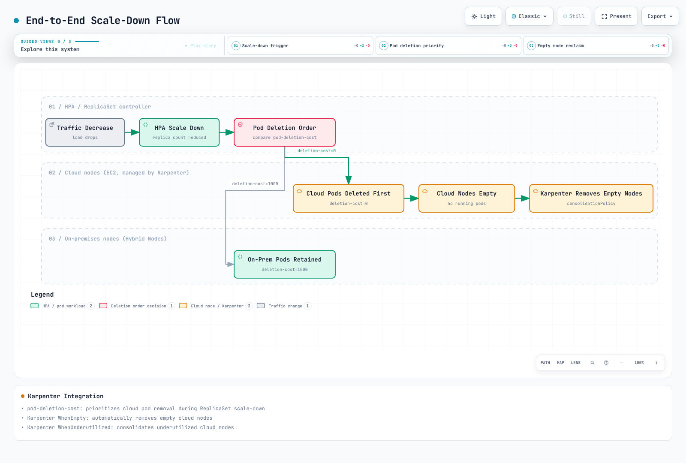

# Workload Placement Strategies

< [Previous: GPU Integration](./05-gpu-integration.md) | [Table of Contents](./README.md) | [Next: Node Lifecycle Management](./07-node-lifecycle.md) >

> **Supported Versions**: Supported EKS versions with compatible Karpenter; reviewed Kubernetes 1.36.2 and Karpenter/provider 1.14.1 interfaces.
> **Last Updated**: September 13, 2026

This chapter places workloads on Hybrid and cloud nodes and explains the limits of cloud bursting and Pod deletion cost. The examples are locally validated configuration/patch patterns. No cloud capacity, node mutation, application or GPU workload was created during the audit.

## Placement constraints and permissions

| Mechanism | What it does | What it does not guarantee |
|---|---|---|
| `nodeSelector` / required node affinity | Filters eligible nodes when scheduling | Data presence, healthy dependencies or migration of existing Pods after labels change |
| Preferred node affinity | Adds scheduling preferences | Strict on-premises-first placement, a fixed ratio or automatic movement of running Pods |
| Taint / toleration | Excludes Pods lacking the applicable toleration | A matching toleration does not attract a Pod or prove it uses a GPU |
| Pod anti-affinity / topology spread | Controls or scores distribution among eligible domains | Complete availability across shared physical hosts, power, storage or network failures |
| PDB | Constrains supported voluntary eviction requests | General availability, placement or protection from every deletion/scale-down path |

Use the `eks.amazonaws.com/compute-type=hybrid` label together with owner-managed location labels. `DoesNotExist` for the compute-type label is not a definition of “cloud”: valid cloud nodes can carry compute-type labels, and an unlabeled node is not proof of an approved cloud location.

The examples use `workload.example.com/location=onprem` on Hybrid nodes, as in [Node Bootstrap](./04-node-bootstrap.md), and `cloud` on the specific Karpenter pool below. Labels are operational inputs, not standalone data-residency or security controls. Storage topology, egress, IAM and trustworthy node administration still matter.

Set the location label through the actual node owner's configuration: for example, nodeadm's `--node-labels=workload.example.com/location=onprem` kubelet flag or the corresponding Bottlerocket node-label setting. A minimal credential-only NodeConfig does not automatically add this custom label.

### Optional taints

A Hybrid taint is optional. Before adding one, ensure required CNI, DNS, GPU infrastructure and application Pods have the necessary tolerations; the earlier GPU example does not automatically tolerate every newly invented taint.

```bash
# Identified node only; owner-approved scheduling-policy change.
set -euo pipefail
: "${KUBECONFIG:?}" "${CONTEXT:?}" "${NODE_NAME:?}"
kubectl --kubeconfig "$KUBECONFIG" --context "$CONTEXT" \
  taint node "$NODE_NAME" eks.amazonaws.com/compute-type=hybrid:NoSchedule
```

For a GPU-specific taint, use a reviewed convention such as `nvidia.com/gpu=present:NoSchedule` and align infrastructure/workload tolerations. A CPU-only Pod can also tolerate that taint; admission and resource-request policy are separate concerns.

`NoSchedule` affects new scheduling, while `PreferNoSchedule` is a soft avoidance preference. `NoExecute` can evict existing Pods according to their tolerations and any `tolerationSeconds`. Neither changing a label nor a required affinity rule with `IgnoredDuringExecution` automatically relocates already running Pods.

## Prepare the cloud burst pool

Karpenter creates EC2 capacity for eligible pending Pods. It does not add on-premises servers. HPA/KEDA or an application controller adjusts replica demand; the node provisioner is a separate control loop. AWS quotas, offering availability, subnet IPs, IAM, node bootstrap and workload dependencies can all prevent expansion.

Use a Karpenter version supported by the cluster's Kubernetes minor; the current compatibility matrix requires at least **1.13 for Kubernetes 1.36**. This example was checked against the **1.14.1** CRDs. It is a self-managed Karpenter `EC2NodeClass` example, not an Auto Mode `NodeClass`.

```yaml
apiVersion: karpenter.sh/v1
kind: NodePool
metadata:
  name: cloud-burst-pool
spec:
  template:
    metadata:
      labels:
        workload.example.com/location: cloud
    spec:
      taints:
        - key: workload.example.com/cloud-burst
          value: "true"
          effect: NoSchedule
      requirements:
        - key: kubernetes.io/arch
          operator: In
          values: [amd64]
        - key: kubernetes.io/os
          operator: In
          values: [linux]
        - key: topology.kubernetes.io/zone
          operator: In
          values: [ap-northeast-2a, ap-northeast-2b]
        - key: karpenter.sh/capacity-type
          operator: In
          values: [spot, on-demand]
        - key: node.kubernetes.io/instance-type
          operator: In
          values: [m6i.xlarge, m6i.2xlarge, m6i.4xlarge]
      nodeClassRef:
        group: karpenter.k8s.aws
        kind: EC2NodeClass
        name: hybrid-cloud-burst
  limits:
    cpu: "1000"
    memory: 4000Gi
  disruption:
    consolidationPolicy: WhenEmpty
    consolidateAfter: 30s
    budgets:
      - nodes: "1"
---
apiVersion: karpenter.k8s.aws/v1
kind: EC2NodeClass
metadata:
  name: hybrid-cloud-burst
spec:
  amiFamily: AL2023
  amiSelectorTerms:
    - id: ami-0123456789abcdef0
  subnetSelectorTerms:
    - id: subnet-0123456789abcdef0
    - id: subnet-0fedcba9876543210
  securityGroupSelectorTerms:
    - id: sg-0123456789abcdef0
  instanceProfile: REPLACE_WITH_APPROVED_EC2_NODE_INSTANCE_PROFILE
```

**Replace every sample AWS resource ID and the instance profile before applying.** Select an approved immutable AL2023 AMI for the Region, architecture and Kubernetes version; `amiFamily: AL2023` supplies the bootstrap family when selecting by AMI ID. The instance profile is a prepared **EC2 node profile**, not the SSM/IAM Roles Anywhere Hybrid role. Subnets/security groups must actually match the intended private networking and AZs.

The AZ restriction belongs in `requirements`; never forge an AWS zone by putting it into template labels. The pool's opt-in taint limits eligibility to workloads with the matching toleration. It does not grant data or registry access.

The retained `1000` CPU / `4000Gi` limits are large **planning examples**, not a recommended allocation or spending cap. Size them before use. Karpenter checks limits with eventual consistency, so rapid provisioning can overrun them. `budgets: [{nodes: "1"}]` limits applicable voluntary disruption concurrency; it is not a minimum-capacity reservation.

Use one complete NodePool definition. Applying a second partial object with the same name is not a safe way to “inherit the settings above.” Changes to expiry, AMI selection and disruption policy need their own reviewed rollout.

## Local, cloud-only and burst-eligible workloads

Create an approved lab namespace, such as `hybrid-placement-lab`, and prepare real image digests, application security settings, probes, storage and registry access before running workloads. These examples start with **zero replicas** and intentionally unusable images. The former 3/5/10 replica counts are possible sizing scenarios, not measured capacity or promises that the applications run.

```yaml
apiVersion: apps/v1
kind: Deployment
metadata:
  name: hybrid-local-processor
  namespace: hybrid-placement-lab
spec:
  replicas: 0
  selector:
    matchLabels:
      app: hybrid-local-processor
  template:
    metadata:
      labels:
        app: hybrid-local-processor
    spec:
      nodeSelector:
        eks.amazonaws.com/compute-type: hybrid
        workload.example.com/location: onprem
      tolerations:
        - key: eks.amazonaws.com/compute-type
          operator: Equal
          value: hybrid
          effect: NoSchedule
      automountServiceAccountToken: false
      securityContext:
        runAsNonRoot: true
        runAsUser: 65532
        seccompProfile:
          type: RuntimeDefault
      containers:
        - name: processor
          image: registry.example.invalid/approved/data-processor:replace-with-approved-digest
          securityContext:
            allowPrivilegeEscalation: false
            capabilities:
              drop: ["ALL"]
          resources:
            requests:
              cpu: "2"
              memory: 4Gi
            limits:
              cpu: "4"
              memory: 8Gi
---
apiVersion: apps/v1
kind: Deployment
metadata:
  name: hybrid-cloud-api
  namespace: hybrid-placement-lab
spec:
  replicas: 0
  selector:
    matchLabels:
      app: hybrid-cloud-api
  template:
    metadata:
      labels:
        app: hybrid-cloud-api
    spec:
      nodeSelector:
        workload.example.com/location: cloud
        karpenter.sh/nodepool: cloud-burst-pool
      tolerations:
        - key: workload.example.com/cloud-burst
          operator: Equal
          value: "true"
          effect: NoSchedule
      automountServiceAccountToken: false
      securityContext:
        runAsNonRoot: true
        runAsUser: 65532
        seccompProfile:
          type: RuntimeDefault
      containers:
        - name: api
          image: registry.example.invalid/approved/inference-api:replace-with-approved-digest
          securityContext:
            allowPrivilegeEscalation: false
            capabilities:
              drop: ["ALL"]
          resources:
            requests:
              cpu: "2"
              memory: 4Gi
            limits:
              cpu: "4"
              memory: 8Gi
---
apiVersion: apps/v1
kind: Deployment
metadata:
  name: hybrid-burst-app
  namespace: hybrid-placement-lab
spec:
  replicas: 0
  selector:
    matchLabels:
      app: hybrid-burst-app
  template:
    metadata:
      labels:
        app: hybrid-burst-app
    spec:
      tolerations:
        - key: eks.amazonaws.com/compute-type
          operator: Equal
          value: hybrid
          effect: NoSchedule
        - key: workload.example.com/cloud-burst
          operator: Equal
          value: "true"
          effect: NoSchedule
      affinity:
        nodeAffinity:
          requiredDuringSchedulingIgnoredDuringExecution:
            nodeSelectorTerms:
              - matchExpressions:
                  - key: eks.amazonaws.com/compute-type
                    operator: In
                    values: [hybrid]
                  - key: workload.example.com/location
                    operator: In
                    values: [onprem]
              - matchExpressions:
                  - key: workload.example.com/location
                    operator: In
                    values: [cloud]
                  - key: karpenter.sh/nodepool
                    operator: In
                    values: [cloud-burst-pool]
          preferredDuringSchedulingIgnoredDuringExecution:
            - weight: 100
              preference:
                matchExpressions:
                  - key: workload.example.com/location
                    operator: In
                    values: [onprem]
      topologySpreadConstraints:
        - maxSkew: 2
          topologyKey: topology.kubernetes.io/zone
          whenUnsatisfiable: ScheduleAnyway
          labelSelector:
            matchLabels:
              app: hybrid-burst-app
      automountServiceAccountToken: false
      securityContext:
        runAsNonRoot: true
        runAsUser: 65532
        seccompProfile:
          type: RuntimeDefault
      containers:
        - name: app
          image: registry.example.invalid/approved/latency-app:replace-with-approved-digest
          securityContext:
            allowPrivilegeEscalation: false
            capabilities:
              drop: ["ALL"]
          resources:
            requests:
              cpu: "1"
              memory: 2Gi
            limits:
              cpu: "2"
              memory: 4Gi
```

The local processor requires both the Hybrid and on-premises labels. The cloud API requires the specifically owned cloud-burst pool. Other approved EC2 groups need their own explicit selection rules; missing labels are not a fallback authorization.

The burst application has two **OR** node-affinity terms: the approved on-premises set or the approved cloud pool. Expressions inside one term are **AND** conditions. It prefers on-premises placement, but scheduler scoring, resource requests, taints and topology preferences also apply. Karpenter can relax scheduling preferences when planning new nodes; this is not a saturation sensor or a guarantee to fill every on-premises slot first.

Weights such as 100 and 50 are scheduling scores, not 2:1 capacity allocation. A node can host multiple Pods or no compatible Pod, so “eight nodes means Pods1–8 locally and Pods9+ in unlimited cloud capacity” is not a valid model.

When on-premises capacity returns, running cloud Pods are not automatically moved back. Any rebalancing needs a separate controlled rollout/eviction policy, with data and availability considerations.

For on-premises GPU training and cloud CPU APIs, keep GPU requirements and data movement explicit. Use the bounded Job/allocation patterns in [GPU Integration](./05-gpu-integration.md). The earlier **4 GPU / 16 CPU / 64Gi** training request was a sizing example; it requires actual GPU capacity, compatible devices and durable input/checkpoint access. A Deployment repeatedly restarting a finite training process is not a substitute for a Job or the appropriate training controller.

### Topology and data locality

Assign accurate failure-domain labels before using `topology.kubernetes.io/zone`; use real AWS AZ values for cloud nodes and meaningful on-premises domains. Do not label every Hybrid host as an AWS AZ to satisfy a selector.

With `ScheduleAnyway`, the spread rule in the burst example is a scoring preference and can exceed `maxSkew`. For `DoNotSchedule`, skew is checked relative to the **global minimum across eligible domains**, considering `minDomains` when configured; it is not always a simple maximum-minus-minimum across every zone in the cluster.

Strict spread or anti-affinity can leave Pods Pending when there are not enough eligible nodes/domains. Node eligibility also depends on affinity, taints and the topology policy. Strong spreading and maximum on-premises utilization can be competing goals; choose the tradeoff deliberately.

Required hostname anti-affinity can keep matching replicas off the same Kubernetes Node when sufficient capacity exists. It does not guarantee that the remaining replicas are healthy, have enough serving capacity or avoid a shared physical failure.

Data-local labels do not create or replicate data. For local persistent data, use a properly managed local PV/PVC with PV node affinity and the appropriate `WaitForFirstConsumer` binding workflow. A raw `hostPath: /mnt/data` neither verifies the dataset nor provides portable persistence. A Pod bound to local storage cannot simply fall back to an EC2 node; plan replication, accessible storage or a separate application path.

## Pod deletion cost is a preference

`controller.kubernetes.io/pod-deletion-cost` is an integer annotation on a Pod. Its valid range is **−2147483648 to2147483647**, defaulting to0 when absent; negative values are allowed. ReplicaSet downscaling prefers lower values among its Pods on a **best-effort** basis.

For the reviewed Kubernetes1.36.2 controller, these comparisons precede deletion cost:

1. Unassigned Pods before assigned Pods.
2. Pending before Unknown before Running.
3. NotReady before Ready.
4. Only then, lower deletion cost before higher cost.

Further comparisons include replica co-location, readiness age, restart counts and creation age. Therefore an unhealthy on-premises Pod with cost1000 can be removed before a healthy cloud Pod with cost0. Cost1000 is not protection from eviction, rollout, node failure, manual deletion or another controller.

The original “10 replicas →4; delete all6 cloud Pods and retain all4 on-premises Pods” is a **conditional illustration** only: all Pods would need to belong to the same ReplicaSet with compatible higher-priority criteria and stable state. It is not a guaranteed outcome, especially across Deployment revisions.

On-premises capacity also has power, maintenance and opportunity costs; retaining it is an operating objective to evaluate, not a universal economic rule. Deletion-cost values do not themselves enforce a spend budget or availability target.

## Assign cost after binding to one owned Pod

A normal Pod `CREATE` admission request usually has no assigned `spec.nodeName`. A CREATE-only mutating webhook cannot reliably derive the eventual node location. The former webhook example also lacked a working Service/TLS/backend/RBAC setup and could block Pod creation through its failure policy. Do not install it as a production solution.

For a small controlled operation, derive cost **after scheduling**. The following script reads one selected Pod, checks its controller ReplicaSet UID and node classification, and writes a private JSON Patch for review. It does not scan or mutate all namespaces.

Set `NAMESPACE`, `POD_NAME` and `EXPECTED_RS_UID` from the application owner's actual Deployment/ReplicaSet ownership chain—not just a shared label. It recognizes only the location conventions and cloud pool in this chapter.

```bash
#!/usr/bin/env bash
# Read one owned, scheduled ReplicaSet Pod and write a reviewable JSON Patch.
# This script does not mutate the cluster.
set -euo pipefail
umask 077
: "${KUBECONFIG:?}" "${CONTEXT:?}" "${NAMESPACE:?}" "${POD_NAME:?}"
: "${EXPECTED_RS_UID:?UID of the ReplicaSet owned by the application operator}"
[[ "$NAMESPACE" =~ ^[a-z0-9]([-a-z0-9]*[a-z0-9])?$ && ${#NAMESPACE} -le 63 ]]
[[ "$POD_NAME" =~ ^[a-z0-9]([-a-z0-9.]*[a-z0-9])?$ && ${#POD_NAME} -le 253 ]]
PLAN_DIR=$(mktemp -d ./deletion-cost-review.XXXXXXXX)
kubectl --kubeconfig "$KUBECONFIG" --context "$CONTEXT" \
  get pod "$POD_NAME" -n "$NAMESPACE" -o json |
  jq '{metadata: {name: .metadata.name, namespace: .metadata.namespace,
      uid: .metadata.uid, resourceVersion: .metadata.resourceVersion,
      ownerReferences: .metadata.ownerReferences,
      deletionTimestamp: .metadata.deletionTimestamp},
    nodeName: .spec.nodeName,
    hasAnnotations: (.metadata.annotations | type == "object"),
    currentCost: .metadata.annotations["controller.kubernetes.io/pod-deletion-cost"]}' \
    > "$PLAN_DIR/pod.json"
jq -e --arg ns "$NAMESPACE" --arg pod "$POD_NAME" --arg owner "$EXPECTED_RS_UID" '
  .metadata.namespace == $ns and .metadata.name == $pod and
  (.metadata.uid | type == "string" and length > 0) and
  (.metadata.resourceVersion | type == "string" and length > 0) and
  .metadata.deletionTimestamp == null and
  ([.metadata.ownerReferences[]? | select(.controller == true)] | length == 1) and
  any(.metadata.ownerReferences[]?; .controller == true and
    .apiVersion == "apps/v1" and .kind == "ReplicaSet" and .uid == $owner) and
  (.nodeName | type == "string" and length > 0)' "$PLAN_DIR/pod.json" > /dev/null
NODE_NAME=$(jq -er '.nodeName' "$PLAN_DIR/pod.json")
[[ "$NODE_NAME" =~ ^[a-z0-9]([-a-z0-9.]*[a-z0-9])?$ ]]
kubectl --kubeconfig "$KUBECONFIG" --context "$CONTEXT" \
  get node "$NODE_NAME" -o json |
  jq '{metadata: {name: .metadata.name, uid: .metadata.uid, labels: {
    compute: .metadata.labels["eks.amazonaws.com/compute-type"],
    location: .metadata.labels["workload.example.com/location"],
    nodepool: .metadata.labels["karpenter.sh/nodepool"]}}}' > "$PLAN_DIR/node.json"
desired=$(jq -er --arg node "$NODE_NAME" '
  if .metadata.name != $node or (.metadata.uid | type != "string" or length == 0) then
    error("unexpected Node identity")
  elif .metadata.labels.compute == "hybrid" and .metadata.labels.location == "onprem" then "1000"
  elif .metadata.labels.compute != "hybrid" and .metadata.labels.location == "cloud"
       and .metadata.labels.nodepool == "cloud-burst-pool" then "0"
  else error("unknown or conflicting node classification") end' "$PLAN_DIR/node.json")
jq --arg cost "$desired" '
  [{op:"test",path:"/metadata/uid",value:.metadata.uid},
   {op:"test",path:"/metadata/resourceVersion",value:.metadata.resourceVersion},
   {op:"test",path:"/spec/nodeName",value:.nodeName}]
  + (if .hasAnnotations then [] else
       [{op:"add",path:"/metadata/annotations",value:{}}] end)
  + (if .currentCost == $cost then [] else
       [{op:"add",path:"/metadata/annotations/controller.kubernetes.io~1pod-deletion-cost",
         value:$cost}] end)' "$PLAN_DIR/pod.json" > "$PLAN_DIR/patch.json"
printf 'Review private snapshots and patch in %s; nothing was applied.\n' "$PLAN_DIR"
```

Inspect the snapshots and desired annotation before applying. The patch tests the Pod UID, resourceVersion and bound node, so replacement or concurrent modification fails rather than overwriting the newer Pod. It adds only the deletion-cost key and preserves unrelated annotations.

Set `PLAN_DIR` in your shell to the directory printed by the script; a child process does not set that variable in its caller.

```bash
# Cluster write, only after the named Pod/owner and generated patch are reviewed.
set -euo pipefail
: "${KUBECONFIG:?}" "${CONTEXT:?}" "${NAMESPACE:?}" "${POD_NAME:?}" "${PLAN_DIR:?}"
kubectl --kubeconfig "$KUBECONFIG" --context "$CONTEXT" \
  patch pod "$POD_NAME" -n "$NAMESPACE" --type=json \
  --patch-file "$PLAN_DIR/patch.json"
```

On a failed test or changed node classification, regenerate and review from fresh state. Do not drop the tests or use `--overwrite` across unrelated Pods. Coordinate ownership of the annotation with any existing controller.

Avoid continuously updating costs from fast-changing metrics; Kubernetes documents the API update overhead. A production post-binding controller would need narrowly scoped permissions, ownership checks, bounded retries and conflict handling. The former unimplemented all-namespace CronJob, missing ServiceAccount/ConfigMap and mutable `bitnami/kubectl:latest` image are not such a controller.

Namespace RBAC can limit the Pod patching boundary; ordinary RBAC does not express arbitrary Pod label selectors as authorization. A node-metadata reader and an application-namespace writer should be separated appropriately. This single-Pod administrative example does not grant cluster-wide write permissions.

## Interaction with Karpenter

Karpenter1.14.1 also reads `pod-deletion-cost` in its **normalized eviction-cost heuristic**, alongside Pod priority; it is incorrect to say only ReplicaSet ever uses it. Karpenter combines Pod costs with node/disruption information. A value of1000 is not a thousandfold guarantee of retention.

| Control | Scope |
|---|---|
| ReplicaSet deletion cost | Preference among the ReplicaSet's scale-down candidates |
| Karpenter disruption cost | Heuristic for candidate evaluation; not an eviction prohibition |
| `WhenEmpty` | Can consolidate eligible nodes with no relevant workload Pods after the configured delay/checks |
| `WhenEmptyOrUnderutilized` | Can move workloads as part of consolidation, subject to applicable constraints |
| PDB / disruption budgets / lifecycle settings | Different controls with different scopes; none should be replaced by a cost annotation |

Empty nodes are not guaranteed to disappear immediately: reconciliation, disruption budgets, finalizers and cloud termination still apply. Affinity/spread preferences may also reduce consolidation opportunities. Assess them together instead of assuming that every HPA downscale produces a matching cloud-node deletion.



[🔍 View interactive diagram](https://www.atomai.click/kubernetes-docs/archmaps/en-eks-hybrid-nodes-06-workload-placement-0.html)

> **Diagram correction:** cloud-first Pod deletion and complete on-premises retention are best-effort goals, not invariants. “Empty” can still include DaemonSet Pods. The older `WhenUnderutilized` label should read `WhenEmptyOrUnderutilized` for the v1 example. Read the ordering and lifecycle conditions above.

## Primary references

- [Assign Pods to nodes](https://kubernetes.io/docs/concepts/scheduling-eviction/assign-pod-node/)
- [Taints and tolerations](https://kubernetes.io/docs/concepts/scheduling-eviction/taint-and-toleration/)
- [Pod topology spread](https://kubernetes.io/docs/concepts/scheduling-eviction/topology-spread-constraints/)
- [ReplicaSet deletion cost](https://kubernetes.io/docs/concepts/workloads/controllers/replicaset/#pod-deletion-cost)
- [Kubernetes1.36.2 scale-down comparison](https://github.com/kubernetes/kubernetes/blob/v1.36.2/pkg/controller/controller_utils.go)
- [Pod disruptions and PDB scope](https://kubernetes.io/docs/concepts/workloads/pods/disruptions/)
- [Local volumes and PV node affinity](https://kubernetes.io/docs/concepts/storage/volumes/#local)
- [StorageClass volume binding](https://kubernetes.io/docs/concepts/storage/storage-classes/#volume-binding-mode)
- [Karpenter NodePools](https://karpenter.sh/docs/concepts/nodepools/) and [compatibility](https://karpenter.sh/docs/upgrading/compatibility/)
- [Karpenter disruption](https://karpenter.sh/docs/concepts/disruption/)
- [Karpenter1.14.1 eviction-cost implementation](https://github.com/kubernetes-sigs/karpenter/blob/v1.14.1/pkg/utils/disruption/disruption.go)

< [Previous: GPU Integration](./05-gpu-integration.md) | [Table of Contents](./README.md) | [Next: Node Lifecycle Management](./07-node-lifecycle.md) >
