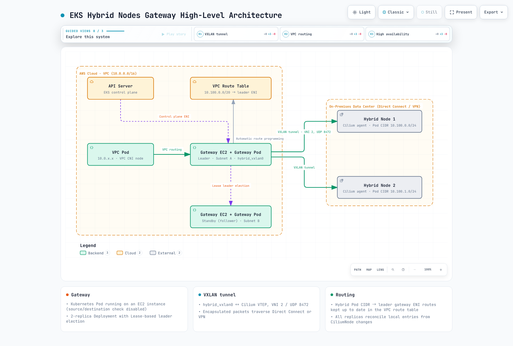
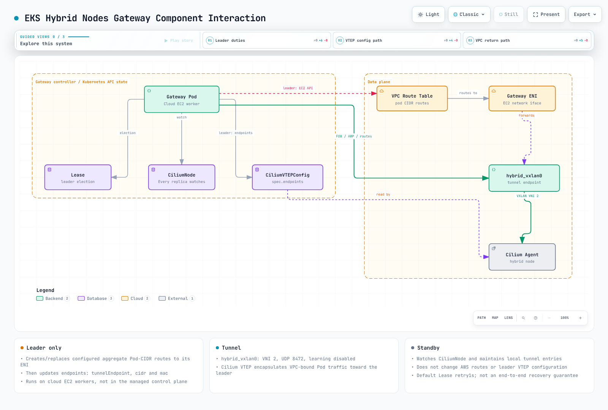
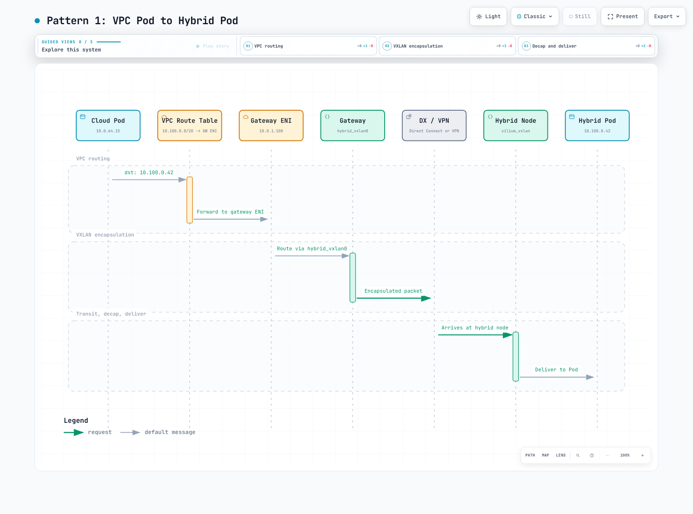
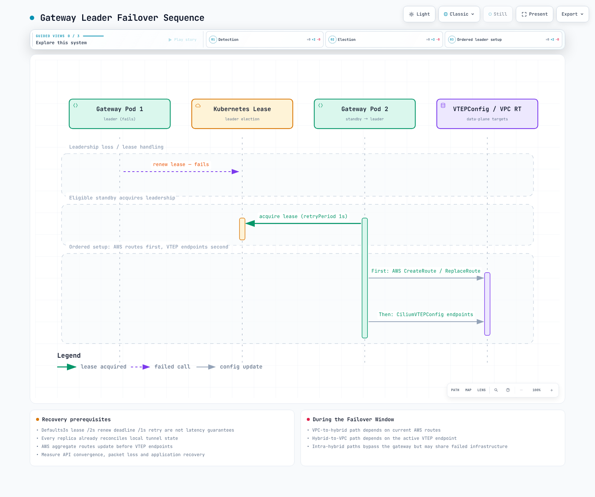

# EKS Hybrid Nodes Gateway

< [Previous: Bare Metal OS Setup](./09-bare-metal-os-setup.md) | [Table of Contents](./README.md) >

> **Validation baseline**: Gateway/chart 1.0.2; use an EKS-supported Kubernetes version and an AWS-maintained Cilium release meeting the gateway prerequisites.
> **Last Updated**: September 13, 2026

---

## Overview

EKS Hybrid Nodes Gateway is an open-source networking component that automates connectivity between your Amazon VPC and Kubernetes Pods running on Hybrid Nodes in on-premises or edge environments. Announced as Generally Available on April 21, 2026, the gateway automates its owned Pod routes and VXLAN forwarding state. Underlay reachability, routing ownership, firewall/MTU planning, rollout and cleanup still require explicit configuration.

The gateway works by establishing VXLAN tunnels between dedicated EC2 gateway instances in your VPC and Cilium-managed Hybrid Nodes on-premises. It automatically programs VPC route tables, manages forwarding database (FDB) entries, and configures Cilium VTEP (VXLAN Tunnel Endpoint) integration so that Pods in the VPC can communicate directly with Pods on Hybrid Nodes. Successful forwarding still depends on the reviewed underlay, CNI, IAM, security rules and application paths.

**Key characteristics:**

- **Open source**: Fully available at [github.com/aws/eks-hybrid-nodes-gateway](https://github.com/aws/eks-hybrid-nodes-gateway)
- **No gateway software charge**: EC2, storage, applicable Auto Mode fees, cross-AZ traffic, connectivity and observability still contribute to cost
- **Automated route management**: The leader programs configured aggregate VPC Pod routes; each replica separately reconciles per-CiliumNode local tunnel state
- **High availability**: Supports a 2-replica Deployment with lease-based leader election for failover
- **Cilium integration**: Leverages Cilium's VTEP feature to enable transparent Pod-to-Pod routing across the VXLAN tunnel

### Learning Objectives

After completing this document, you will be able to:

1. **Explain the architecture** of EKS Hybrid Nodes Gateway, including VXLAN tunneling, leader election, and VPC route management
2. **Deploy and configure** the gateway using Helm, including IAM roles, security groups, and Cilium VTEP integration
3. **Trace traffic flows** between VPC Pods and Hybrid Node Pods in both directions
4. **Implement high availability** with multi-replica gateway deployments and understand failover behavior
5. **Operate and troubleshoot** gateway deployments, including monitoring, scaling, and common failure scenarios
6. **Compare approaches** for Hybrid Nodes networking and decide when to use the gateway vs. manual routing
7. **Apply best practices** for security, performance, and cost optimization in production gateway deployments

### The Problem: Manual Pod Routing in Hybrid Environments

Before the gateway was available, enabling Pod-level communication between VPC and Hybrid Nodes required significant manual effort:

```
Before Gateway (Manual Approach):
=================================

1. Configure BGP peering between on-prem routers and VPC (or use static routes)
2. Manually manage VPC route table entries for every hybrid Pod CIDR
3. Set up and maintain VPN tunnels or Direct Connect with proper route propagation
4. Handle route updates when nodes join/leave the cluster
5. Troubleshoot routing asymmetries and MTU issues across multiple hops
6. Maintain custom scripts or controllers to keep routes in sync

After Gateway (Automated Approach):
====================================

1. Deploy gateway via Helm chart
2. Gateway automatically:
   - Creates VXLAN tunnels to hybrid nodes
   - Programs VPC route table entries
   - Configures Cilium VTEP for transparent routing
   - Handles failover via leader election
   - Updates routes as nodes come and go
```

The gateway transforms what was a complex, error-prone, multi-team networking challenge into a single Helm install with a handful of configuration values.

---

## Architecture Deep Dive

### High-Level Architecture

The EKS Hybrid Nodes Gateway sits at the boundary between your VPC and your on-premises network, acting as a VXLAN-based bridge for Pod traffic. The following diagram illustrates the overall architecture:



[🔍 View interactive diagram](https://www.atomai.click/kubernetes-docs/archmaps/en-eks-hybrid-nodes-10-hybrid-nodes-gateway-0.html)

### VXLAN Tunnel Mechanics

The gateway uses VXLAN (Virtual Extensible LAN) to encapsulate Pod traffic between the VPC and on-premises environments. Here is how the tunnel is established and maintained:

#### Gateway-Side VXLAN Interface

When the gateway pod starts on an EC2 instance, it creates a `hybrid_vxlan0` network interface with the following parameters:

| Parameter | Value | Description |
|-----------|-------|-------------|
| **Interface name** | `hybrid_vxlan0` | VXLAN tunnel interface on the gateway |
| **VNI (VXLAN Network Identifier)** | 2 | Gateway default compatible with the Cilium VTEP path; not a CiliumVTEPConfig field |
| **UDP port** | 8472 | Gateway/Cilium VXLAN port; VXLAN's IANA-assigned port is 4789 |
| **Local IP** | Gateway EC2 instance private IP | Source IP for VXLAN encapsulated packets |
| **Learning** | Disabled | FDB entries are statically programmed by the gateway |

The gateway creates this interface using netlink. The following is a conceptual illustration, not a command to run alongside the controller. Version 1.0.2 does not assign an IP address to this interface; the outer tunnel uses the gateway node's private IP.

```bash
# Conceptual equivalent of what the gateway does programmatically
ip link add hybrid_vxlan0 type vxlan \
    id 2 \
    local <gateway-private-ip> \
    dstport 8472 \
    nolearning

ip link set hybrid_vxlan0 up
```

#### FDB, ARP, and Route Programming

The node reconciler watches `CiliumNode` objects labeled `eks.amazonaws.com/compute-type: hybrid`. It runs on every gateway replica and programs three kinds of local entries from the node's internal IP and allocated Pod CIDR:

```text
Per Hybrid Node, the gateway programs:
=======================================

1. FDB (Forwarding Database) Entry:
   deterministic node MAC → hybrid node's internal IP
   → Tells the VXLAN interface where to send encapsulated frames for this node

2. ARP Entry:
   hybrid node's internal IP → deterministic node MAC
   → Pre-populates ARP so the gateway can immediately forward packets without ARP discovery

3. Route Entry:
   hybrid node's Pod CIDR via its internal IP, dev hybrid_vxlan0, onlink
   → Directs Pod traffic for this node's CIDR through the VXLAN tunnel
```

The controller derives the remote MAC from the node's IPv4 address rather than discovering a Cilium interface MAC. Static neighbor/FDB entries avoid relying on dynamic learning for this path. Reconciliation errors, stale entries and underlay failures can still interrupt forwarding. These local routes are distinct from VPC route-table entries.

#### Hybrid Node-Side (Cilium VTEP)

On the Hybrid Node side, Cilium's VTEP (VXLAN Tunnel Endpoint) feature handles the tunnel termination. The gateway registers itself as a remote VTEP via the `CiliumVTEPConfig` custom resource. This tells each Cilium agent on the Hybrid Nodes:

1. Traffic destined for VPC CIDRs should be VXLAN-encapsulated
2. The encapsulated traffic should be sent to the gateway's IP address
3. The VXLAN tunnel uses VNI 2 on UDP port 8472

```yaml
# CiliumVTEPConfig created and managed by the gateway
apiVersion: cilium.io/v2
kind: CiliumVTEPConfig
metadata:
  name: hybrid-gateway
spec:
  endpoints:
    - name: vpc-gateway
      tunnelEndpoint: "10.0.1.5"      # Actual leader node IP
      cidr: "10.0.0.0/16"            # One VPC prefix per endpoint
      mac: "82:36:6c:89:e6:ad"       # Illustrative; read the leader's actual VXLAN MAC
```

When a Pod on a Hybrid Node sends traffic to a VPC IP address (e.g., a cloud-side Pod or an AWS service endpoint), the Cilium agent:
1. Matches the destination against an endpoint's `cidr` in CiliumVTEPConfig
2. VXLAN-encapsulates the packet with VNI 2
3. Sends the outer UDP packet to the gateway's IP on port 8472
4. The gateway decapsulates and forwards the inner packet into the VPC

### Leader Election and High Availability

The chart defaults to a two-replica Deployment. Both replicas maintain local VXLAN/FDB/neighbor/routes. Only the leader updates AWS VPC routes and the controller-owned `CiliumVTEPConfig` named `hybrid-gateway`.

#### Lease-Based Leader Election

Leader election uses the standard Kubernetes Lease resource:

```yaml
apiVersion: coordination.k8s.io/v1
kind: Lease
metadata:
  name: hybrid-gateway-leader
  namespace: eks-hybrid-nodes-gateway
spec:
  holderIdentity: "gateway-node-hostname_example-uuid"
  leaseDurationSeconds: 3
  acquireTime: "2026-06-28T10:00:00Z"
  renewTime: "2026-06-28T10:00:10Z"
  leaseTransitions: 3
```

This Lease is an illustrative observation, not a manifest to apply. The holder identity is not necessarily a Pod name; discover the corresponding node/Pod before any operational action. These binary flags control election timing; chart 1.0.2 does not expose a `leaderElection` values object:

| Parameter | Default Value | Description |
|-----------|---------------|-------------|
| `--leader-election-lease-duration` | 3s | Election lease duration |
| `--leader-election-renew-deadline` | 2s | Leader renewal deadline |
| `--leader-election-retry-period` | 1s | Election retry interval |

#### What the Leader Does

The leader pod is responsible for:

1. **VPC route table management**: Creates and updates routes in the specified VPC route tables, pointing hybrid Pod CIDRs to the leader's EC2 instance ENI
2. **CiliumVTEPConfig management**: Creates and updates the CiliumVTEPConfig resource to point hybrid nodes' VTEP traffic to the leader's EC2 instance IP
3. **FDB/ARP/route programming**: Programs the local VXLAN interface with entries for all hybrid nodes
4. **Node watching**: Like the standby, watches CiliumNode objects and updates local tunnel entries. It does not create/delete an AWS route for every node event.

#### What the Standby Does

The standby pod:

1. **Maintains VXLAN tunnel**: Keeps its `hybrid_vxlan0` interface active and programmed with FDB/ARP/route entries
2. **Does NOT program VPC routes**: Only the leader modifies VPC route tables
3. **Does NOT update CiliumVTEPConfig**: Only the leader updates the VTEP configuration
4. **Monitors lease**: Continuously attempts to acquire the lease in case the leader fails

### VPC Route Table Auto-Management

On leadership acquisition, the gateway creates or replaces routes for the configured aggregate `podCIDRs` in each configured route table. It updates AWS routes first, then upserts CiliumVTEPConfig. CiliumNode reconciliation independently maintains each node's local tunnel entries on every replica.


[🔍 View interactive diagram](https://www.atomai.click/kubernetes-docs/archmaps/en-eks-hybrid-nodes-10-hybrid-nodes-gateway-1.html)

The gateway uses the EC2 API to manage routes:

| API Call | When Used | Purpose |
|----------|-----------|---------|
| `ec2:DescribeRouteTables` | Access check and leader setup | Read the explicitly configured route tables |
| `ec2:CreateRoute` | Leader setup when a configured CIDR route is absent | Add the aggregate Pod CIDR route |
| `ec2:ReplaceRoute` | Leader setup when its target differs | Redirect the configured route to the current leader's primary ENI |
| `ec2:DescribeInstances` | Startup, failover | Discover gateway EC2 instance ENI IDs |

The gateway runtime does not call `DeleteRoute`. Helm removal does not clean up AWS routes. Existing routes for the same CIDR can be replaced even when another system created them: review ownership and the cutover/rollback plan before installation.

These contracts were checked against the [1.0.2 implementation](https://github.com/aws/eks-hybrid-nodes-gateway/tree/v1.0.2/internal) and [AWS operations guidance](https://docs.aws.amazon.com/eks/latest/userguide/hybrid-nodes-gateway-operations.html). API reads, readiness status or a leader metric alone do not prove working end-to-end forwarding.

### Component Interaction Summary

The following diagram shows how all components interact:



[🔍 View interactive diagram](https://www.atomai.click/kubernetes-docs/archmaps/en-eks-hybrid-nodes-10-hybrid-nodes-gateway-2.html)

---

## Prerequisites

Before deploying the EKS Hybrid Nodes Gateway, ensure all of the following prerequisites are met.

### EKS Cluster Configuration

| Requirement | Details |
|-------------|---------|
| **EKS version** | A version currently supported by EKS and the chosen add-ons |
| **Address family** | IPv4; non-overlapping VPC, Service, remote node and remote Pod networks |
| **Hybrid Nodes** | At least one Hybrid Node configured and joined to the cluster |
| **Authentication mode** | `API` or `API_AND_CONFIG_MAP` |
| **Endpoint access** | Public only OR Private only (not "Public and Private") |
| **Remote Pod Network** | Pod CIDRs configured for hybrid nodes in the cluster |

### CNI Requirements

The gateway requires a specific CNI configuration:

| Location | CNI | Version | VTEP Support |
|----------|-----|---------|--------------|
| **Managed/self-managed cloud nodes** | Amazon VPC CNI | Supported add-on version; configure Hybrid ClusterIP SNAT exclusion | Not required |
| **Auto Mode cloud nodes** | Built-in networking | Use the Auto Mode-supported configuration | Not required |
| **Hybrid nodes** | AWS-maintained Cilium | Meet the branch minimum in [CNI Configuration](#cni-configuration) | VTEP enabled, L7 proxy disabled |

> This gateway implementation requires the AWS Cilium VTEP integration; it is not a Calico-compatible controller. Use a separately supported routable-Pod design when its CNI/L7 requirements do not fit. The [Hybrid cluster creation requirements](https://docs.aws.amazon.com/eks/latest/userguide/hybrid-nodes-cluster-create.html) require API/API_AND_CONFIG_MAP authentication, IPv4, and either public-only or private-only endpoint connectivity for Hybrid Nodes.

### Network Connectivity

Private connectivity between your VPC and on-premises environment must already be established:

| Connectivity Type | When to Use | Notes |
|-------------------|-------------|-------|
| **AWS Direct Connect** | Production workloads requiring consistent low latency | Dedicated connectivity; resilience and latency depend on the actual redundant design |
| **AWS Site-to-Site VPN** | Standard hybrid connectivity | IPsec connectivity; throughput depends on the selected tunnel offering, packet mix and routing |
| **Transit Gateway + VPN** | Multi-VPC environments | Centralized VPN termination; supports ECMP for higher throughput |
| **Custom VPN (e.g., WireGuard)** | Specialized requirements | Self-managed tunnel; useful when AWS VPN limitations are a concern |

> **Note**: The gateway does not establish the base connectivity between VPC and on-premises. It adds a VXLAN overlay on top of the existing connectivity for Pod-level routing.

### EC2 Gateway Instances

You need at least two EC2 instances in your VPC to run the gateway pods:

```yaml
# Recommended EC2 instance configuration for gateway nodes
Instance type: c6i.large (2 vCPU, 4 GiB RAM) or larger
AMI: Amazon Linux 2023 (EKS optimized)
Placement: Spread across at least 2 Availability Zones
EBS: 20 GiB gp3 (minimal storage needed)
```

The gateway instances must:
1. Be registered cloud EC2 nodes; distinguish managed/self-managed AWS VPC CNI from Auto Mode built-in networking
2. Have the appropriate node role and a separately scoped Gateway workload role (see [IAM Configuration](#iam-configuration))
3. Be labeled for gateway pod scheduling (see [Installation](#installation-and-configuration))

### Security Group Configuration

Use the actual node/Pod CIDRs and reviewed ports. UDP8472 alone does not establish every application or control-plane path. Separate these flows:

| Flow | Required review |
|---|---|
| Gateway primary IP ↔ Hybrid node IP | Outer VXLAN UDP8472 in both directions |
| Cloud workloads ↔ Hybrid Pods | Intended inner application protocols/ports and their return traffic |
| Nodes → Kubernetes API, AWS APIs/registry and DNS | Actual endpoints/resolvers, TCP443 and required DNS paths |
| Control plane → kubelet | TCP10250 to the intended nodes; separate from a node's outbound API443 traffic |
| Prometheus → gateway | Restrict TCP10080 to the intended scrape source |

Account for security groups, stateless NACLs and on-premises firewalls separately. Do not add blanket ingress from the whole VPC as a substitute for the required application flows. Protect all possible leader node IPs, including replacement capacity.

#### Terraform Security Group Example

Manage the approved rule matrix in the existing node/network Terraform stack. A gateway-only UDP rule is a fragment, not a complete node security group. Preserve the cluster's bootstrap, DNS, API and application requirements and inspect the final plan; avoid creating an unrestricted duplicate SG and assuming that a VXLAN rule makes it safe.

### On-Premises Firewall Configuration

Use the gateway **private node IPs** reachable over the private underlay, not Elastic IPs. Permit the required UDP8472 path for every eligible leader/standby, and separately review Kubernetes API/kubelet, DNS and application flows. Reconcile firewall updates when Auto Mode or another node manager replaces gateway instances. Neither this chapter nor a static SG table proves the real firewall path.

Verify source/destination check on the intended primary ENI. Auto Mode uses the NodeClass forwarding setting; managed/self-managed provisioning owns any required ENI modification. The following only reads its current value:

```bash
: "${AWS_REGION:?Set the reviewed Region}"
: "${GATEWAY_PRIMARY_ENI_ID:?Set the verified gateway primary ENI}"
aws ec2 describe-network-interface-attribute --region "$AWS_REGION" \
  --network-interface-id "$GATEWAY_PRIMARY_ENI_ID" --attribute sourceDestCheck
```

### MTU Considerations

IPv4 VXLAN commonly adds 50 bytes including the inner Ethernet header. Use the effective end-to-end underlay MTU, not the EC2 interface maximum. The following original MTU figures are planning illustrations, not measured path results or universal DX/VPN settings:

| Component | Recommended MTU | Notes |
|-----------|----------------|-------|
| Gateway EC2 instance | 9001 (jumbo frames) | Default for most EC2 instance types in VPC |
| On-premises hybrid nodes | 1500 or higher | Depends on your network infrastructure |
| VXLAN interface (effective) | Path MTU - 50 | e.g., 1450 if path MTU is 1500 |
| Direct Connect | 9001 (jumbo frames) | If supported by your DX connection |
| VPN tunnel | 1399-1500 | Varies by VPN configuration |

If your network path between VPC and on-premises uses standard 1500 MTU:

```
Effective Pod MTU calculation:
Physical MTU:        1500 bytes
VXLAN overhead:      - 50 bytes (outer IP + outer UDP + VXLAN header)
VPN overhead (IPsec): - 57-73 bytes (if applicable)
Effective Pod MTU:   ~1377-1450 bytes
```

Cilium on hybrid nodes can be configured with the appropriate MTU:

```yaml
# Cilium Helm values for hybrid nodes
mtu: 1400  # Illustrative only; replace using validated path MTU and chosen Cilium datapath.
```

---

## IAM Configuration

### Required IAM Permissions

Separate the gateway workload role from the EC2 node role and the operator's provisioning/cleanup permissions. The [AWS getting-started guide](https://docs.aws.amazon.com/eks/latest/userguide/hybrid-nodes-gateway-getting-started.html) recommends EKS Pod Identity. Its agent must be available on eligible managed/self-managed nodes; Auto Mode supplies Pod Identity support. Do not blindly create an add-on over an existing installation.

Gateway runtime actions are `ec2:DescribeRouteTables`, `ec2:DescribeInstances`, `ec2:CreateRoute` and `ec2:ReplaceRoute`. Describe operations require `Resource: "*"`; constrain the Region. Route writes can use the exact route-table ARNs and a VPC condition. Deleting retired routes is an operator action, not a runtime permission.

### Scoped IAM Policy (Recommended for Production)

Save the following as `gateway-permissions.json` after replacing account, Region, VPC and route-table IDs with the reviewed inventory. These are illustrative identifiers, not resources provisioned by this audit. The policy does not restrict which destination CIDRs the role can modify within those route tables: treat them as a routing security boundary and control who can edit Gateway values or use its ServiceAccount.

```json
{
  "Version": "2012-10-17",
  "Statement": [
    {
      "Sid": "ReadGatewayRoutingMetadata",
      "Effect": "Allow",
      "Action": [
        "ec2:DescribeRouteTables",
        "ec2:DescribeInstances"
      ],
      "Resource": "*",
      "Condition": {
        "StringEquals": {
          "aws:RequestedRegion": "ap-northeast-2"
        }
      }
    },
    {
      "Sid": "ManageOnlyOwnedRouteTables",
      "Effect": "Allow",
      "Action": [
        "ec2:CreateRoute",
        "ec2:ReplaceRoute"
      ],
      "Resource": [
        "arn:aws:ec2:ap-northeast-2:111122223333:route-table/rtb-0abc123456789def0",
        "arn:aws:ec2:ap-northeast-2:111122223333:route-table/rtb-0def456789abc1230"
      ],
      "Condition": {
        "StringEquals": {
          "ec2:Vpc": "arn:aws:ec2:ap-northeast-2:111122223333:vpc/vpc-0123456789abcdef0"
        }
      }
    }
  ]
}
```

Route-table ARN and `ec2:Vpc` scoping follow the [EC2 route-table policy example](https://docs.aws.amazon.com/AWSEC2/latest/UserGuide/ExamplePolicies_EC2.html). A successful Describe request does not prove CreateRoute/ReplaceRoute authorization. Test authorization and route ownership in an approved environment before cutover.

### Terraform IAM Configuration

For Pod Identity, save this trust policy as `gateway-trust.json`, replacing the exact cluster ARN. Session tags must remain enabled because the conditions bind the cluster, namespace and ServiceAccount. Restrict Pod/ServiceAccount creation and Pod Identity association administration as well as IAM permissions.

```json
{
  "Version": "2012-10-17",
  "Statement": [
    {
      "Effect": "Allow",
      "Principal": {
        "Service": "pods.eks.amazonaws.com"
      },
      "Action": [
        "sts:AssumeRole",
        "sts:TagSession"
      ],
      "Condition": {
        "StringEquals": {
          "aws:RequestTag/eks-cluster-arn": "arn:aws:eks:ap-northeast-2:111122223333:cluster/hybrid-production",
          "aws:RequestTag/kubernetes-namespace": "eks-hybrid-nodes-gateway",
          "aws:RequestTag/kubernetes-service-account": "eks-hybrid-nodes-gateway"
        }
      }
    }
  ]
}
```

The [Pod Identity trust policy](https://docs.aws.amazon.com/eks/latest/userguide/pod-id-role.html) and [session tags](https://docs.aws.amazon.com/eks/latest/userguide/pod-id-abac.html) define these conditions. The following HCL is an integration fragment, not a complete provider/cluster stack; use either Terraform ownership or the CLI path for each resource.

```hcl
# Fragment in the existing reviewed AWS provider/cluster stack.
# Declare and validate these variables; do not create duplicate CLI-managed resources.
resource "aws_iam_role" "gateway" {
  name               = var.gateway_role_name
  assume_role_policy = file("${path.module}/gateway-trust.json")
}
resource "aws_iam_role_policy" "gateway_routes" {
  name   = "GatewayOwnedRoutes"
  role   = aws_iam_role.gateway.id
  policy = file("${path.module}/gateway-permissions.json")
}
resource "aws_eks_pod_identity_association" "gateway" {
  cluster_name    = var.cluster_name
  namespace       = "eks-hybrid-nodes-gateway"
  service_account = "eks-hybrid-nodes-gateway"
  role_arn        = aws_iam_role.gateway.arn
}
```

### AWS CLI IAM Setup

Prepare the role with the reviewed trust/permission JSON through your IAM owner. The association's ServiceAccount name must match the rendered chart; changing the Helm release/name overrides can change it. Association configuration is separate from chart values: chart 1.0.2 ignores `serviceAccount.annotations`.

```bash
: "${AWS_REGION:?Set the reviewed Region}"
: "${CLUSTER_NAME:?Set the reviewed cluster}"
: "${GATEWAY_ROLE_ARN:?Set the prepared, scoped Pod Identity role ARN}"
# Inspect existing associations; do not create a duplicate or replace another owner.
aws eks list-pod-identity-associations --region "$AWS_REGION" \
  --cluster-name "$CLUSTER_NAME" --namespace eks-hybrid-nodes-gateway \
  --service-account eks-hybrid-nodes-gateway
# Run only for the reviewed new association; keep session tags enabled:
aws eks create-pod-identity-association --region "$AWS_REGION" \
  --cluster-name "$CLUSTER_NAME" --namespace eks-hybrid-nodes-gateway \
  --service-account eks-hybrid-nodes-gateway --role-arn "$GATEWAY_ROLE_ARN" \
  --no-disable-session-tags
```

IRSA remains an alternative with an actual OIDC trust policy and annotation on the rendered ServiceAccount, managed through a reviewed patch/overlay; a value ignored by Helm cannot establish IRSA. Avoid attaching route-write permissions broadly to all node workloads. The binary's EC2 metadata lookups for node identity and its SDK credential chain are separate concerns—do not disable metadata blindly without providing and verifying the required node identity inputs.

Auto Mode forwarding uses `NodeClass.spec.advancedNetworking.sourceDestCheck: DisabledPrimaryENI`. Managed/self-managed node bootstrap must disable source/destination check on the intended primary ENI using separately scoped node/operator permissions. `ModifyNetworkInterfaceAttribute` and cluster/role/add-on creation are not part of the gateway workload policy above.

---

## Installation and Configuration

### Step 1: Label Gateway Nodes

Provision eligible cloud EC2 nodes first. Managed/self-managed nodes use `autoMode.enabled=false`; Auto Mode needs a prepared NodeClass/NodePool and `autoMode.enabled=true`. Label only nodes whose forwarding, security-group and IAM prerequisites have been verified. Do not fabricate provider-owned instance-type or AZ labels. Prefer two eligible nodes in different AZs.

```bash
: "${KUBE_CONTEXT:?Set the reviewed Kubernetes context}"
: "${GW_NODE_A:?Set the first eligible gateway node}"
: "${GW_NODE_B:?Set the second eligible gateway node}"
kubectl --context "$KUBE_CONTEXT" get node "$GW_NODE_A" "$GW_NODE_B" \
  -L topology.kubernetes.io/zone,eks.amazonaws.com/compute-type
# Apply only after source/destination check, IAM and network prerequisites are met:
kubectl --context "$KUBE_CONTEXT" label node "$GW_NODE_A" "$GW_NODE_B"   hybrid-gateway-node=true
```

### Step 2: Gather Configuration Values

Confirm the AWS account, cluster VPC, remote Pod CIDRs, actual gateway ENIs and affected subnet/control-plane route tables. Select only the route tables owned by this routing design; listing every table in a VPC is not authorization to change all of them. `remoteNetworkConfig` is directly under `cluster`, not under `kubernetesNetworkConfig`.

```bash
: "${AWS_REGION:?Set the reviewed AWS Region}"
: "${CLUSTER_NAME:?Set the reviewed EKS cluster}"
: "${VPC_ID:?Set the cluster VPC ID}"
aws sts get-caller-identity --query Account --output text
aws eks describe-cluster --region "$AWS_REGION" --name "$CLUSTER_NAME" \
  --query 'cluster.{VpcId:resourcesVpcConfig.vpcId,RemotePodCIDRs:remoteNetworkConfig.remotePodNetworks[].cidrs[]}' \
  --output json
aws ec2 describe-vpcs --region "$AWS_REGION" --vpc-ids "$VPC_ID" \
  --query 'Vpcs[].CidrBlockAssociationSet[].{CIDR:CidrBlock,State:CidrBlockState.State}' \
  --output json
aws ec2 describe-route-tables --region "$AWS_REGION" \
  --filters "Name=vpc-id,Values=$VPC_ID" \
  --query 'RouteTables[].{ID:RouteTableId,Associations:Associations,Routes:Routes}' \
  --output json
```

### Step 3: Install via Helm

Complete the CNI, node and workload IAM steps before installation. The leader may immediately replace existing routes for the configured CIDRs. Use the values file below after checking ownership, reverse routing and rollback. This chapter validates configuration locally; it does not report a live deployment.

### Full Helm Values Reference

The published 1.0.2 chart takes **CSV strings**, not YAML arrays, for `podCIDRs` and `routeTableIDs`. Use a values file so Helm `--set` comma/list parsing does not change their types.

```yaml
# values.yaml: replace CIDRs/table IDs from the reviewed network inventory.
vpcCIDR: "10.0.0.0/16"
podCIDRs: "10.85.0.0/16"
routeTableIDs: "rtb-0abc123456789def0,rtb-0def456789abc1230"
replicas: 2
nodeLabel: hybrid-gateway-node
autoMode:
  enabled: false  # MNG/self-managed. Set true only for prepared Auto Mode nodes.
```

The chart also supports `image.repository`, `image.tag`, `image.pullPolicy` and naming helpers. Its templates do **not** wire `replicaCount`, `nodeSelector`, `resources`, `affinity`, `topologySpreadConstraints`, `serviceAccount.annotations`, `leaderElection`, `logLevel`, `metrics`, `extraEnv` or custom volume values. Do not interpret accepted YAML as an applied setting. Configure workload identity separately; if a maintained post-renderer is needed for another setting, review the resulting Deployment and its upgrade behavior explicitly.

Both modes use host networking, NET_ADMIN, required host anti-affinity and preferred AZ anti-affinity. The chart does not create a Service, ServiceMonitor or PDB. Auto Mode uses maxSurge=1/maxUnavailable=0; other nodes use 0/1. Neither strategy is leader-aware or guarantees uninterrupted forwarding. Auto Mode surge needs another eligible node because of host anti-affinity.

```bash
: "${KUBE_CONTEXT:?Set the reviewed Kubernetes context}"
# Local rendering first; it does not prove API admission, IAM or network readiness.
helm template eks-hybrid-nodes-gateway \
  oci://public.ecr.aws/eks/eks-hybrid-nodes-gateway \
  --version 1.0.2 --namespace eks-hybrid-nodes-gateway \
  --values values.yaml > gateway-rendered.yaml
# Creates/changes cluster resources and can redirect existing VPC routes:
helm upgrade --install eks-hybrid-nodes-gateway \
  oci://public.ecr.aws/eks/eks-hybrid-nodes-gateway \
  --version 1.0.2 --namespace eks-hybrid-nodes-gateway --create-namespace \
  --kube-context "$KUBE_CONTEXT" --values values.yaml
```

### Step 4: Verify Installation

Read the actual lease holder, gateway Pod node/IP, VTEP endpoint/MAC and route ENI, and verify that they describe the same leader. A holderIdentity may be a node hostname plus UUID, so do not pass it directly to `kubectl logs` or `kubectl delete pod`.

```bash
: "${KUBE_CONTEXT:?Set the reviewed Kubernetes context}"
: "${AWS_REGION:?Set the reviewed AWS Region}"
: "${ROUTE_TABLE_ID:?Set one reviewed route table ID}"
kubectl --context "$KUBE_CONTEXT" -n eks-hybrid-nodes-gateway \
  rollout status deployment/eks-hybrid-nodes-gateway --timeout=180s
kubectl --context "$KUBE_CONTEXT" -n eks-hybrid-nodes-gateway get pods -o wide
kubectl --context "$KUBE_CONTEXT" -n eks-hybrid-nodes-gateway   get lease hybrid-gateway-leader -o yaml
kubectl --context "$KUBE_CONTEXT" get ciliumvtepconfig hybrid-gateway -o yaml
aws ec2 describe-route-tables --region "$AWS_REGION" \
  --route-table-ids "$ROUTE_TABLE_ID" --query 'RouteTables[].Routes' --output json
kubectl --context "$KUBE_CONTEXT" -n eks-hybrid-nodes-gateway logs \
  -l app.kubernetes.io/name=eks-hybrid-nodes-gateway --all-containers=true --tail=50
```

A Running Pod, readiness response and leader gauge do not establish forwarding success. Test both directions, direct Pod IPs, ClusterIP services with Hybrid endpoints, actual webhook calls, and return traffic from explicitly selected cloud and Hybrid workloads. The server must really listen on the tested port. Keep logs private and redact sensitive workload data before sharing them.

---

## CNI Configuration

### Cilium VTEP Configuration on Hybrid Nodes

Use the AWS-maintained Cilium build. The [gateway CNI prerequisites](https://docs.aws.amazon.com/eks/latest/userguide/hybrid-nodes-gateway-cni.html) specify branch floors **1.17.13-1, 1.18.8-1 or 1.19.2-1**; these are feature minimums, not recommendations to downgrade or ignore branch support. Preserve the existing node selectors, IPAM ranges and other reviewed release values.

The required change is `vtep.enabled=true` and **`l7Proxy=false`**. The Cilium Ingress/Gateway API L7 profile in [Operations](./08-operations.md) cannot be enabled on that same Cilium installation. This does not prohibit ordinary HTTP applications using the routed path. Do not infer encryption from VXLAN, or enable WireGuard merely because an unrelated example mentions it; validate the specific supported datapath/encryption combination.

#### Verifying Cilium VTEP on Hybrid Nodes

```bash
: "${KUBE_CONTEXT:?Set the reviewed Kubernetes context}"
: "${CILIUM_VERSION:?Choose an AWS-maintained Cilium version meeting the gateway minimum}"
# Apply to the existing reviewed Hybrid Cilium release during a maintenance window.
helm upgrade cilium oci://public.ecr.aws/eks/cilium/cilium \
  --version "$CILIUM_VERSION" --namespace kube-system \
  --kube-context "$KUBE_CONTEXT" --reuse-values \
  --set vtep.enabled=true --set l7Proxy=false
kubectl --context "$KUBE_CONTEXT" -n kube-system rollout restart daemonset/cilium
kubectl --context "$KUBE_CONTEXT" -n kube-system   rollout status daemonset/cilium --timeout=300s
kubectl --context "$KUBE_CONTEXT" -n kube-system get configmap cilium-config \
  -o jsonpath='{.data.enable-vtep}{"\n"}{.data.enable-l7-proxy}{"\n"}'
```

The two printed ConfigMap values must be `true` then `false`. Also inspect Cilium health on each Hybrid node and the controller-owned VTEP object. Use the CLI shipped in the selected Cilium image and inspect its help before relying on a particular `bpf vtep` command; one DaemonSet-selected Pod does not cover every node.

### VPC CNI Configuration on Cloud Nodes

For cloud nodes running AWS VPC CNI, Hybrid Pod CIDRs must be excluded from SNAT for **ClusterIP traffic to Hybrid endpoints**. Direct Pod-IP traffic can work even when this setting is missing, so a direct-IP test alone is insufficient. Preserve other exclusions and reconcile the change with the add-on's configuration owner.

```bash
: "${KUBE_CONTEXT:?Set the reviewed Kubernetes context}"
# MNG/self-managed cloud nodes using the aws-node DaemonSet:
kubectl --context "$KUBE_CONTEXT" -n kube-system get daemonset aws-node
# Preserve existing exclusions; use the complete reviewed CSV union, not just a new CIDR.
: "${SNAT_EXCLUDE_CIDRS:?Set existing exclusions plus all Hybrid Pod CIDRs}"
kubectl --context "$KUBE_CONTEXT" -n kube-system set env daemonset/aws-node \
  AWS_VPC_K8S_CNI_EXCLUDE_SNAT_CIDRS="$SNAT_EXCLUDE_CIDRS"
```

Auto Mode supplies built-in networking rather than an `aws-node` DaemonSet to configure. Do not install or replace its networking with this DaemonSet recipe. Validate its supported Hybrid service path separately; in mixed clusters, apply the aws-node setting to the cloud nodes actually managed by that component. Prefix delegation/custom networking settings are separate design choices, not gateway prerequisites.

### CiliumVTEPConfig CRD Details

The controller's [1.0.2 upsert code](https://github.com/aws/eks-hybrid-nodes-gateway/blob/v1.0.2/internal/cilium/vtep.go) uses the following API shape. The gateway owns the named `hybrid-gateway` object; this is not a claim that Kubernetes permits only one CiliumVTEPConfig object in the cluster.

```yaml
# Illustrative controller-owned observation; do not apply over the running controller.
apiVersion: cilium.io/v2
kind: CiliumVTEPConfig
metadata:
  name: hybrid-gateway
spec:
  endpoints:
  - name: vpc-gateway
    tunnelEndpoint: "10.0.1.5"
    cidr: "10.0.0.0/16"
    mac: "82:36:6c:89:e6:ad"  # Read the actual leader VXLAN MAC.
```

On leadership change it updates `tunnelEndpoint` and `mac`. Each endpoint has one `cidr`; multiple configured VPC prefixes produce multiple entries. The MAC is the actual leader's VXLAN interface MAC, not an arbitrary dummy constant. Observe Cilium convergence and application recovery instead of assuming a universal 1–5 second propagation guarantee. That older range was an unverified illustration, not a measured result.

---

## Traffic Flow Patterns

Understanding how traffic flows through the gateway is essential for troubleshooting and capacity planning. This section traces packets through the system for each major communication pattern. Its historical drawings use a separate illustrative 10.100.0.0/20 Pod range; do not combine that address plan with the installation example without reconciling all actual CIDRs.

### Pattern 1: VPC Pod to Hybrid Pod

This is the most common pattern --- a Pod running on a cloud node in the VPC needs to communicate with a Pod running on a hybrid node on-premises.



[🔍 View interactive diagram](https://www.atomai.click/kubernetes-docs/archmaps/en-eks-hybrid-nodes-10-hybrid-nodes-gateway-3.html)

**Step-by-step packet flow:**

1. Cloud Pod (`10.0.64.15`) sends a packet to Hybrid Pod (`10.100.0.42`)
2. The packet enters the VPC network; VPC route table matches the configured aggregate `10.100.0.0/20 -> gateway ENI`
3. The packet arrives at the gateway EC2 instance's primary ENI
4. The gateway's Linux routing table matches the route: `10.100.0.0/24 via <hybrid-node-internal-ip> dev hybrid_vxlan0 onlink`
5. The gateway VXLAN-encapsulates the packet (outer src: gateway IP, outer dst: hybrid node IP, VNI: 2, outer UDP dst: 8472)
6. The encapsulated packet traverses Direct Connect / VPN to the on-premises network
7. The hybrid node's Cilium agent receives the UDP packet on port 8472
8. Cilium decapsulates the VXLAN packet and delivers the inner packet to the destination Pod

### Pattern 2: Hybrid Pod to VPC Pod

When a Pod on a hybrid node needs to reach a Pod (or any IP) in the VPC.


[🔍 View interactive diagram](https://www.atomai.click/kubernetes-docs/archmaps/en-eks-hybrid-nodes-10-hybrid-nodes-gateway-4.html)

**Step-by-step packet flow:**

1. Hybrid Pod (`10.100.0.42`) sends a packet to Cloud Pod (`10.0.64.15`)
2. The Cilium agent on the hybrid node does a BPF lookup and finds that `10.0.64.15` matches the VTEP endpoint `cidr` of `10.0.0.0/16`
3. Cilium VXLAN-encapsulates the packet (outer dst: gateway IP `10.0.1.100`, VNI: 2, outer UDP dst: 8472)
4. The encapsulated packet traverses Direct Connect / VPN to the VPC
5. The gateway's EC2 instance receives the UDP packet on port 8472
6. The gateway decapsulates the VXLAN packet, extracting the inner packet (dst: `10.0.64.15`)
7. The inner packet is forwarded through the gateway EC2 instance's ENI into the VPC
8. Standard VPC routing delivers the packet to the cloud Pod

> The actual gateway primary ENI must have source/destination check disabled through its node provisioning owner. See the Auto Mode versus managed/self-managed requirements above; reading the route alone does not verify this setting.

### Pattern 3: Control Plane to Webhook on Hybrid Node

When a mutating or validating webhook runs on a hybrid node, the EKS control plane needs to reach it.

```text
Webhook invocation → resolved remote Pod endpoint
  → control-plane VPC network path / matching route table
  → gateway primary ENI → VXLAN → Hybrid node → webhook listener
  → verified reverse path for the response
```

The configured remote Pod network, control-plane subnet routes, webhook Service/endpoint/TLS, security rules and return path must all agree. Do not assume a kube-proxy/iptables implementation inside the managed control plane. A routable native Pod design can also support Hybrid webhooks; this capability is not exclusive to the gateway.

### Pattern 4: AWS Services to Hybrid Pods

| Path | Required configuration |
|---|---|
| ALB/NLB IP targets | Register eligible Pod IPs through the intended controller; verify LB subnet routes, health checks, application ports, source identity and return traffic |
| AMP managed collector | The scraper reaches metric endpoints through the VPC/remote Pod routes and open firewall ports; the Hybrid add-on guidance also requires private cluster endpoint access |
| Prometheus remote_write | A Prometheus/ADOT collector pushes samples to the AMP workspace ingestion endpoint; the workspace is not itself an inbound scraper |
| CloudWatch / trace export | An appropriately configured agent/collector sends data to its service endpoint; required IAM/API/DNS/egress paths are separate from incoming Pod routing |
| PrivateLink | Consumer endpoint → provider service/LB → targets, according to that service's design; a generic AWS service does not initiate arbitrary connections through an endpoint to Hybrid Pods |

The [Hybrid add-on guide](https://docs.aws.amazon.com/eks/latest/userguide/hybrid-nodes-add-ons.html) explicitly supports AMP managed collection when these endpoint and network prerequisites are satisfied. Distinguish that scraper from self-managed remote_write; neither appears merely because the gateway was installed.

### Pattern 5: Comparison --- With vs Without Gateway

Native/BGP/static routing and this gateway are different owned datapaths. The gateway adds an active-standby VXLAN hop and aggregate route automation while keeping underlay, CIDR, firewall, IAM and application responsibilities. The comparison and migration sections below describe their boundaries; neither approach automatically guarantees webhook/LB availability.

---

## High Availability and Failover

### Deployment Architecture

The recommended production deployment uses 2 gateway replicas spread across Availability Zones:


[🔍 View interactive diagram](https://www.atomai.click/kubernetes-docs/archmaps/en-eks-hybrid-nodes-10-hybrid-nodes-gateway-5.html)

### Failover Sequence

When the leader gateway pod becomes unavailable (node failure, pod crash, network partition), the following failover sequence occurs:



[🔍 View interactive diagram](https://www.atomai.click/kubernetes-docs/archmaps/en-eks-hybrid-nodes-10-hybrid-nodes-gateway-6.html)

### Failover Timeline

**Historical illustration, not measured evidence:** the original table below has no reproducible test trace. Keep its values as context rather than an SLO. Current AWS guidance estimates roughly 3–5 seconds, while the tagged project README contains a different estimate; actual route/API/Cilium/application convergence must be tested. Leader setup updates VPC routes **before** the VTEP object, not in parallel. Neither interval guarantees recovery under node, AZ or control-plane failure.

| Phase | Duration | Description |
|-------|----------|-------------|
| **Detection** | 0-3s | Current leader fails to renew lease; lease expires after `leaseDuration` |
| **Election** | 0-1s | Standby acquires lease on next `retryPeriod` tick |
| **Route update** | 1-3s | New leader calls `ec2:ReplaceRoute` to update VPC routes |
| **VTEP update** | 1-5s | New leader updates `CiliumVTEPConfig`; Cilium agents reload BPF maps |
| **Total** | **~5-10s** | End-to-end failover time |

During the failover window:
- **VPC-to-hybrid traffic**: Drops until VPC routes are updated (packets go to the failed gateway's ENI)
- **Hybrid-to-VPC traffic**: Drops until CiliumVTEPConfig is updated (Cilium sends to old gateway IP)
- **Intra-hybrid and node/control-plane paths**: Paths that do not traverse the gateway can continue only if their own underlay, CNI, DNS and dependencies remain healthy; a shared AZ/network failure can affect them too.

### Multi-AZ Deployment Recommendations

Chart 1.0.2 requires different hosts but only prefers different AZs. Select/provision eligible nodes across AZs and inspect actual placement; do not set fake topology labels. The `affinity` and `topologySpreadConstraints` values from older examples are not wired by this chart. If strict AZ constraints are required, maintain a reviewed deployment overlay and account for Pending Pods when an AZ/capacity is unavailable.

### Pod Disruption Budget

This optional PDB limits voluntary eviction through the eviction API. It does not stop direct Pod deletion, Deployment rollouts or involuntary failure, and does not preserve the active leader by identity:

```yaml
apiVersion: policy/v1
kind: PodDisruptionBudget
metadata:
  name: eks-hybrid-nodes-gateway
  namespace: eks-hybrid-nodes-gateway
spec:
  minAvailable: 1
  selector:
    matchLabels:
      app.kubernetes.io/name: eks-hybrid-nodes-gateway
```

### Recovery After Total Gateway Failure

Inspect both gateway Pods, eligible cloud nodes, the Lease, route targets and VTEP state. Distinguish gateway loss from a wider underlay/API/Cilium outage. Existing connectivity between node IPs and the control plane is a separate path; do not assume every workload retains DNS or cloud dependencies.

```bash
: "${KUBE_CONTEXT:?Set the reviewed Kubernetes context}"
kubectl --context "$KUBE_CONTEXT" -n eks-hybrid-nodes-gateway get pods -o wide
kubectl --context "$KUBE_CONTEXT" get nodes -l hybrid-gateway-node=true -o wide
kubectl --context "$KUBE_CONTEXT" -n eks-hybrid-nodes-gateway   get lease hybrid-gateway-leader -o yaml
kubectl --context "$KUBE_CONTEXT" get ciliumvtepconfig hybrid-gateway -o yaml
```

A replacement node must satisfy IAM, primary-ENI forwarding, network and chart placement requirements before labeling. After leadership is restored, recheck VPC route ENIs and bidirectional application probes. Readiness/leader metrics alone are not acceptance criteria. A destructive failover exercise belongs in an approved window with a verified Pod/node identity, traffic probes and recovery owner; do not derive a Pod deletion target blindly from holderIdentity.

---

## Operations

### Monitoring

#### Key Metrics to Watch

Version 1.0.2 exposes `/metrics` on port **10080**, with `/healthz` and `/readyz` on 8088. The [tagged metric definitions](https://github.com/aws/eks-hybrid-nodes-gateway/blob/v1.0.2/internal/metrics/metrics.go) and [collector](https://github.com/aws/eks-hybrid-nodes-gateway/blob/v1.0.2/internal/metrics/collector.go) define these names/types:

| Metric | Type | Interpretation |
|---|---|---|
| `hybrid_gateway_leader_is_active` | Gauge | This replica's leader state; not proof of successful route setup |
| `hybrid_gateway_hybrid_nodes_configured` | Gauge | This replica's locally configured node count |
| `hybrid_gateway_vxlan_tx_bytes_total`, `hybrid_gateway_vxlan_rx_bytes_total` | Counter | Kernel interface byte counters; use rate, account for resets |
| `hybrid_gateway_vxlan_tx_packets_total`, `hybrid_gateway_vxlan_rx_packets_total` | Counter | Packet counters, not application success |
| `hybrid_gateway_vxlan_interface_up` | Gauge | Interface state, not end-to-end reachability |
| `hybrid_gateway_vxlan_fdb_entries`, `hybrid_gateway_vxlan_route_count` | Gauge | Locally observed table counts |
| `hybrid_gateway_aws_route_table_update_total`, `hybrid_gateway_aws_route_table_update_errors_total` | Counter | Route operation success/error events |
| `hybrid_gateway_aws_route_table_update_duration_seconds`, `hybrid_gateway_leader_setup_duration_seconds` | Histogram | Duration observations; no events means no useful latency estimate |

The code emits network `_total` metrics as counters even where a prose table labels them gauges. `LeaderIsActive` is set before route/VTEP setup completes, and readiness is not an application probe. Investigate sustained leader absence/multiplicity together with scrape health and API errors; a single transient sample is not proof of split-brain.

#### Prometheus ServiceMonitor

The chart does not create a Service. This separate example supplies one and binds a ServiceMonitor to its **named Service port**. Prometheus Operator/CRDs, namespace selection and the actual `serviceMonitorSelector` must already be configured. Replace the example `release` label to match that stack. Restrict access to the host-network metrics port with node/network controls.

```yaml
apiVersion: v1
kind: Service
metadata:
  name: hybrid-gateway-metrics
  namespace: eks-hybrid-nodes-gateway
  labels:
    app.kubernetes.io/name: eks-hybrid-nodes-gateway
    app.kubernetes.io/instance: eks-hybrid-nodes-gateway
spec:
  selector:
    app.kubernetes.io/name: eks-hybrid-nodes-gateway
    app.kubernetes.io/instance: eks-hybrid-nodes-gateway
  ports:
  - name: metrics
    port: 10080
    targetPort: metrics
---
apiVersion: monitoring.coreos.com/v1
kind: ServiceMonitor
metadata:
  name: hybrid-gateway-metrics
  namespace: eks-hybrid-nodes-gateway
  labels:
    release: kube-prom  # Must match the existing Prometheus serviceMonitorSelector.
spec:
  namespaceSelector:
    matchNames: [eks-hybrid-nodes-gateway]
  selector:
    matchLabels:
      app.kubernetes.io/name: eks-hybrid-nodes-gateway
      app.kubernetes.io/instance: eks-hybrid-nodes-gateway
  endpoints:
  - port: metrics
    interval: 30s
    scrapeTimeout: 10s
    path: /metrics
```

#### Sample Grafana Dashboard Queries

```promql
# Expected steady-state leader count, scoped to this one Service scrape job.
sum(hybrid_gateway_leader_is_active{namespace="eks-hybrid-nodes-gateway",service="hybrid-gateway-metrics"})

# Per-target VXLAN TX/RX byte rates; do not sum duplicate scrape jobs.
rate(hybrid_gateway_vxlan_tx_bytes_total{namespace="eks-hybrid-nodes-gateway",service="hybrid-gateway-metrics"}[5m])
rate(hybrid_gateway_vxlan_rx_bytes_total{namespace="eks-hybrid-nodes-gateway",service="hybrid-gateway-metrics"}[5m])

# Failures in the observation window, not a cumulative nonzero counter alert.
increase(hybrid_gateway_aws_route_table_update_errors_total{namespace="eks-hybrid-nodes-gateway",service="hybrid-gateway-metrics"}[5m])

# Per-replica local configuration counts; summing leader and standby double-counts nodes.
hybrid_gateway_hybrid_nodes_configured{namespace="eks-hybrid-nodes-gateway",service="hybrid-gateway-metrics"}

# Target scrape health is separate from leader/traffic metrics.
up{namespace="eks-hybrid-nodes-gateway",service="hybrid-gateway-metrics"}
```

Missing time series require an absent-target/scrape alert; a sum over no series is not automatically zero. Derive alert windows and node-count expectations from the actual deployment. Falling traffic can mean idle applications, not failure, and cumulative errors remain nonzero after an old incident.

#### CloudWatch Integration

EC2 `NetworkIn`/`NetworkOut` are instance-level counters, not VXLAN-only ENI metrics. To use custom gateway metrics in CloudWatch, first configure a collector with an explicit namespace, dimensions, units and cumulative-counter handling, then verify published samples. A put-metric-alarm command does not create its metric or prove traffic failure. Include exporter gaps, idle periods and counter resets in the alarm design.

### Logging

Collect bounded logs privately, retaining API/permission failures as failures. A label selector selects both replicas, not just the leader. `holderIdentity` is not necessarily a Pod name. Useful 1.0.2 messages include `Processing CiliumNode`, `Adding hybrid node to gateway`, `Remote VTEP added` and `Reconciling CiliumVTEPConfig`; use actual structured logs rather than assumed wording for an AWS DeleteRoute operation the runtime never makes.

#### Enable Debug Logging

Chart 1.0.2 does not wire `logLevel=debug`; that Helm value cannot enable debugging. Inspect the selected binary's supported logging flags and maintain any required deployment overlay explicitly. Avoid exposing credentials or workload payloads when increasing verbosity.

### Troubleshooting

#### Issue: Pods Cannot Communicate Across the Gateway

This collection script stops on a failed API/log query. It does not label auth/transport errors as resource absence. Review and redact private artifacts before sharing them.

```bash
#!/usr/bin/env bash
set -euo pipefail
umask 077
: "${KUBE_CONTEXT:?Set the reviewed Kubernetes context}"
: "${AWS_REGION:?Set the reviewed AWS Region}"
: "${ROUTE_TABLE_ID:?Set one reviewed route table ID}"
OUT_DIR=$(mktemp -d "${TMPDIR:-/tmp}/gateway-diagnose.XXXXXX")
kubectl --context "$KUBE_CONTEXT" -n eks-hybrid-nodes-gateway get pods -o json > "$OUT_DIR/pods.json"
kubectl --context "$KUBE_CONTEXT" -n eks-hybrid-nodes-gateway \
  get lease hybrid-gateway-leader -o json > "$OUT_DIR/lease.json"
kubectl --context "$KUBE_CONTEXT" get ciliumvtepconfig hybrid-gateway -o json > "$OUT_DIR/vtep.json"
kubectl --context "$KUBE_CONTEXT" get ciliumnodes -o json > "$OUT_DIR/ciliumnodes.json"
aws ec2 describe-route-tables --region "$AWS_REGION" \
  --route-table-ids "$ROUTE_TABLE_ID" --output json > "$OUT_DIR/routes.json"
kubectl --context "$KUBE_CONTEXT" -n eks-hybrid-nodes-gateway logs \
  -l app.kubernetes.io/name=eks-hybrid-nodes-gateway \
  --all-containers=true --prefix=true --tail=100 > "$OUT_DIR/gateway.log"
printf 'Private diagnostic files: %s\n' "$OUT_DIR"
```

Compare the actual leader's Pod node/IP, VTEP IP/MAC, primary ENI route and CiliumNode CIDRs. Check the whole return path and the required VTEP=true/L7=false configuration. Do not restart Cilium blindly because a map is missing; first inspect version, configuration and reconciliation errors.

#### Issue: Security Group Misconfiguration

UDP has no connection handshake. `nc -uz` reporting success does not prove that VXLAN traffic arrived or was decapsulated. Check security groups, stateless NACLs, on-premises firewalls and both underlay directions using bounded approved captures/counters. A capture filter on the physical interface sees outer UDP8472; a capture on `hybrid_vxlan0` sees inner traffic, so filtering that interface for outer UDP8472 can miss the traffic being diagnosed.

#### Issue: Missing VPC Routes

Confirm the configured table IDs, exact Pod prefixes, gateway primary ENI and the workload's IAM identity. An operator's `sts get-caller-identity` does not prove which role the gateway SDK uses. A DryRun test has distinct `DryRunOperation`/`UnauthorizedOperation` outcomes and must use the intended principal/parameters; it is not a successful route mutation. Inspect source/destination check on the actual primary ENI, not merely an assumed node attribute.

#### Issue: Frequent Leader Transitions

Inspect the named Lease, API latency/reachability, gateway node health and resource pressure. Leadership loss does not prove another replica already completed route setup. The readiness handler is a local boolean check. An unauthenticated wget to the API server can fail because of TLS/authentication without establishing that the network is down.

#### Issue: MTU Problems

Use a diagnostic image/environment that actually contains iproute2/iputils. BusyBox ping does not universally support the iputils `-M do` option. Bound packet count and timeout, choose both endpoints deliberately, and remember that an IPv4 ICMP payload also needs 28 bytes for IP/ICMP headers before encapsulation. A blocked ICMP reply is not a conclusive MTU measurement. The end-to-end minimum underlay MTU, including VPN/DX encapsulation, matters more than subtracting 50 from the EC2 NIC alone.

#### Troubleshooting Decision Tree

1. Confirm both control-plane objects and actual cloud/Hybrid node identities; preserve API errors.
2. Verify aggregate route ownership/target and per-node local FDB/neighbor/routes separately.
3. Verify outer UDP reachability and source/destination check on the primary ENI.
4. Verify AWS Cilium version, VTEP/L7 settings and current VTEP endpoint.
5. Test direct Pod IP and ClusterIP independently, then the real webhook/LB path.
6. Investigate MTU, packet loss, application listener/TLS and return routing with bounded diagnostics.

### Scaling

#### Adding More Hybrid Nodes

Each gateway replica reconciles labeled CiliumNode objects into local tunnel entries. The leader manages configured aggregate Pod CIDR routes when it takes leadership; it does not add an AWS route for every new node. Verify new node addresses/CIDRs and local counts on both replicas. Larger node counts alone do not determine throughput; additional replicas provide standby capacity rather than active-active load distribution.

#### Gateway Instance Sizing

Size for peak byte rate, packets per second, concurrent connections/tunnels, CPU, memory and failure headroom. Only one replica forwards the gateway-managed traffic at a time.

**Historical sizing illustration:** the table below preserves original estimates, not tested node-count limits or validated throughput. Check current EC2 specifications; in particular its c6in.2xlarge 50 Gbps entry is not a verified sustained specification.

| Instance Type | vCPU | Memory | Network Bandwidth | Recommended For |
|---------------|------|--------|-------------------|-----------------|
| c6i.large | 2 | 4 GiB | Up to 12.5 Gbps | Dev/test, < 10 hybrid nodes |
| c6i.xlarge | 4 | 8 GiB | Up to 12.5 Gbps | Small production, 10-50 nodes |
| c6i.2xlarge | 8 | 16 GiB | Up to 12.5 Gbps | Medium production, 50-100 nodes |
| c6i.4xlarge | 16 | 32 GiB | Up to 12.5 Gbps | Large production, 100+ nodes |
| c6in.2xlarge | 8 | 16 GiB | Up to 50 Gbps | High-throughput workloads |
| c6in.4xlarge | 16 | 32 GiB | Up to 50 Gbps | Very high throughput |

> The table is not a capacity guarantee. VXLAN processing consumes CPU and memory, and EC2 burst/baseline bandwidth, PPS and traffic path limits still apply. Validate the actual instance/packet mix rather than selecting solely by the advertised network maximum.

#### Gateway Capacity Planning

The original calculation below is retained as an **unmeasured planning example**. Its 800 Mbps uses decimal KB/MB and assumes 10 KB in each direction per request. If 10 KB already includes request plus response, multiplying by two double-counts it. Packet size, headers, peak concurrency and retries need separate accounting. It does not establish that the named instance has sufficient sustained headroom:

```
Throughput estimation:
======================
Number of hybrid Pods with cross-boundary traffic:   100
Average request/response size:                        10 KB
Average requests per second per Pod:                  50
VXLAN overhead per packet:                            ~3% (50 bytes / ~1500 bytes)

Required throughput:
  100 Pods × 50 req/s × 10 KB × 2 (bidirectional) = ~100 MB/s = ~800 Mbps

Recommendation: c6i.xlarge (12.5 Gbps) with comfortable headroom
```

### Upgrading the Gateway

Review an actually published release and its chart/application contracts. This audit validated 1.0.2; the former 1.1.0 command was an unverified example, not an executed upgrade. Back up the owned values/manifest and route inventory privately, inspect Helm history, and choose the exact rollback revision rather than assuming revision 1 is suitable.

```bash
: "${KUBE_CONTEXT:?Set the reviewed Kubernetes context}"
: "${GATEWAY_VERSION:?Set an existing, reviewed release version}"
helm history eks-hybrid-nodes-gateway -n eks-hybrid-nodes-gateway   --kube-context "$KUBE_CONTEXT"
# OCI charts are inspected/pulled by an explicit version, not helm search repo.
helm show chart oci://public.ecr.aws/eks/eks-hybrid-nodes-gateway   --version "$GATEWAY_VERSION"
helm template eks-hybrid-nodes-gateway \
  oci://public.ecr.aws/eks/eks-hybrid-nodes-gateway \
  --version "$GATEWAY_VERSION" --namespace eks-hybrid-nodes-gateway \
  --values values.yaml > gateway-upgrade-rendered.yaml
# Run only after reviewing the rendered diff, IAM, routes and rollback plan:
helm upgrade eks-hybrid-nodes-gateway \
  oci://public.ecr.aws/eks/eks-hybrid-nodes-gateway \
  --version "$GATEWAY_VERSION" --namespace eks-hybrid-nodes-gateway \
  --kube-context "$KUBE_CONTEXT" --values values.yaml
kubectl --context "$KUBE_CONTEXT" -n eks-hybrid-nodes-gateway \
  rollout status deployment/eks-hybrid-nodes-gateway --timeout=300s
```

Deployment rolling updates are not leader-aware: they do not guarantee standby-first replacement. Chart 1.0.2 does not wire a custom `strategy` value. Host anti-affinity/capacity, lease changes and route/VTEP convergence can interrupt traffic. Historical 5–10s and 40–55s examples are not upgrade SLOs. A Helm rollback also requires compatible CRDs/configuration and application/route verification; it does not automatically restore every external AWS route.

### Cleanup

**Helm uninstall leaves AWS routes behind.** Record the tables, CIDRs, previous targets and current gateway ENIs before installation and before removal. Migrate/drain gateway-dependent traffic first. Stop the controller before changing its owned VTEP object so it cannot recreate that object.

```bash
: "${KUBE_CONTEXT:?Set the reviewed Kubernetes context}"
: "${AWS_REGION:?Set the reviewed AWS Region}"
: "${ROUTE_TABLE_ID:?Set one route table whose ownership was confirmed}"
# Snapshot/read current targets before deciding which routes to restore or delete.
aws ec2 describe-route-tables --region "$AWS_REGION"   --route-table-ids "$ROUTE_TABLE_ID" --output json
kubectl --context "$KUBE_CONTEXT" get ciliumvtepconfig hybrid-gateway -o yaml
# Disruptive: retire/migrate traffic and record the current leader/ENI before running.
helm uninstall eks-hybrid-nodes-gateway -n eks-hybrid-nodes-gateway   --kube-context "$KUBE_CONTEXT" --wait --timeout=180s
```

After the gateway Pods are gone, restore a previous route target where the migration plan requires it; delete a route only when its table/CIDR/current target and ownership match the retirement plan. Never delete every configured CIDR blindly: another owner may have changed the target. Re-query AWS state after each approved change and distinguish access/transport errors from absence.

Remove the controller-owned `ciliumvtepconfig/hybrid-gateway` only after confirming no remaining consumer/controller owns it. Remove this release's Pod Identity association/role, metrics resources and dedicated capacity through their recorded infrastructure owner; an uninstalled Helm release does not prove those billable resources are gone. Delete a namespace or node label only if it is exclusively owned and no unrelated workloads remain. Verify the resulting application paths, routes, associations and capacity.

---

## Comparison: With vs Without Gateway

### Feature Comparison

| Concern | Routable Pods without this gateway | Hybrid Nodes Gateway |
|---|---|---|
| Routing | BGP/static routing or another owned automation path | Aggregate VPC routes plus Cilium VTEP/local tunnel reconciliation |
| Setup | Underlay/router/CNI/address planning | Same underlay planning plus eligible gateway nodes, IAM, AWS Cilium VTEP/L7 profile and route ownership |
| Webhooks and ALB/NLB IP targets | Possible with valid routes, remote Pod networks, return paths and security rules | Also require those application/control-plane prerequisites; installing Helm alone does not establish them |
| CNI | Choose a supported routable-Pod design | Requires the AWS-maintained Cilium VTEP integration with L7 proxy disabled |
| Capacity | Actual router/link/CNI/host limits | One active gateway's capacity plus all underlying link/path limits |
| HA | Owned network/convergence design | Active-standby Lease and route/VTEP convergence; temporary interruption possible |
| Costs | Cluster/Hybrid Nodes, connectivity, infrastructure and operations | Those costs plus gateway EC2/storage, applicable Auto Mode fees and possible added cross-AZ traffic |
| Removal | Reconcile owned routes/resources | Helm does not delete external AWS routes, IAM associations or dedicated capacity |

### When to Use the Gateway

Use it when its AWS Cilium/VTEP profile and active-standby hop fit the workload and simplify Pod-route ownership. It does not remove the network team's responsibility for private node reachability, MTU, CIDRs, security rules and failure recovery. Existing native routing, incompatible CNI/L7 requirements or different capacity/fault-domain needs can favor another design. Neither option has a universal latency, availability or cost advantage.

### Performance Characteristics

**The original estimates below are unmeasured illustrations, not current benchmark results.** Native routing also has processing/queueing delay, and the VXLAN cost depends on packet size, CPU, link limits and offload behavior. An extra hop can matter even with jumbo frames.

| Metric | Original native/BGP illustration | Original VXLAN illustration |
|---|---|---|
| Latency overhead | ~0 ms | ~0.1–0.5 ms |
| Throughput | Full DX/VPN bandwidth | Min(gateway instance BW, DX/VPN BW) |
| Packet overhead | 0 bytes for this overlay | ~50 bytes with IPv4 VXLAN |
| Jitter | DX/VPN-dependent | DX/VPN plus VXLAN processing |
| PPS | Network limited | Gateway CPU can limit it |

The throughput expressions omit burst/baseline, PPS, CPU and application constraints; do not treat them as guarantees. The earlier 5–10s failover and “low complexity/single install” claims likewise require the operational qualifications above.

### Migration from Manual Routing to Gateway

1. Record exact table/CIDR/current-target ownership and the existing BGP/static/NAT/CNI state privately. Plan rollback and validate underlay, firewall and network overlap.
2. Prepare eligible gateway nodes, workload IAM and the reviewed AWS Cilium VTEP/L7 profile. A CNI change itself can disrupt traffic.
3. Treat controller installation as a **route-changing cutover**: its leader can replace an existing route for the same CIDR. Do not assume CreateRoute will simply fail and leave the old target untouched.
4. Verify cloud/Hybrid direct IP, ClusterIP, real webhook/LB traffic and both return paths. Coordinate other route controllers so they do not continually overwrite each other.
5. Retire only obsolete resources whose ownership is confirmed. Do not remove all manual/BGP routes after the gateway has already reused the same table/CIDR.

Rollback requires stopping the gateway controller, restoring the recorded previous targets and compatible Cilium/network configuration, and re-verifying traffic. Helm rollback/uninstall alone does not reverse external route changes. More-specific routes are a deliberate routing design with longest-prefix effects, not a generic conflict workaround.

---

## Best Practices

### Security

#### Least-Privilege IAM

Use the four runtime actions and exact owned route-table policy above; keep DeleteRoute with the approved cleanup owner. Control access to Gateway values, the ServiceAccount, node labels and Pod Identity associations. Host-network NET_ADMIN is privileged infrastructure access even though the container is not marked `privileged: true`.

#### Security Group Best Practices

Use actual Hybrid node private CIDRs, intended application ports and specific API/DNS/metrics paths. NACLs are stateless: a single inbound UDP8472 allow rule does not define a working bidirectional policy. Review replacement-node addresses and all required return traffic.

#### Network Segmentation

The Gateway runs with host networking. Ordinary Pod NetworkPolicy treatment of hostNetwork traffic is implementation-dependent; it is not a substitute for node/ENI/firewall controls. Apply supported L3/L4 policies to actual workload endpoints and verify source identity after NAT/encapsulation. A CIDR selector does not identify a Kubernetes namespace. Cilium L7 rules conflict with this gateway's required `l7Proxy=false` profile.

### Performance

#### Gateway Instance Sizing

Use sustained bandwidth/burst allowances, PPS, packet sizes, CPU/memory and failure headroom. The original “upgrade above 60%, downsize below 20%, choose c6in above 25 Gbps/up to 100 Gbps” rules are unmeasured heuristics, not capacity guarantees or a current instance-family specification. AWS's current gateway operations table lists c6in.2xlarge at **up to 40 Gbps**; the earlier 50 Gbps sizing entry is retained only as a historical unverified figure.

EC2 NetworkIn/NetworkOut Sum over an interval gives bytes; divide by the interval for bytes/s. These instance metrics include other traffic and cannot alone measure VXLAN/application throughput. Do not treat Average/Maximum data points as a sustained bit-rate guarantee.

#### Latency Monitoring

Prepare approved existing client workloads with curl installed; do not install packages at probe startup or assume `compute-type=ec2` selects cloud nodes. The target must actually listen. Run this bounded check from each explicitly chosen location, once for direct Pod IP and separately for the ClusterIP/real application endpoint. `time_total` includes DNS, connection/TLS and server processing; it is not isolated network RTT or an overhead benchmark.

```bash
#!/usr/bin/env bash
set -euo pipefail
: "${KUBE_CONTEXT:?Set the reviewed Kubernetes context}"
: "${PROBE_NAMESPACE:?Set the approved probe namespace}"
: "${PROBE_CLIENT_POD:?Set an existing client Pod with curl installed}"
: "${PROBE_URL:?Set the actual listening application URL}"
# Select and inspect the client node first; run separately from cloud and Hybrid clients.
kubectl --context "$KUBE_CONTEXT" -n "$PROBE_NAMESPACE" get pod "$PROBE_CLIENT_POD" -o wide
for attempt in 1 2 3; do
  kubectl --context "$KUBE_CONTEXT" -n "$PROBE_NAMESPACE" exec "$PROBE_CLIENT_POD" -- \
  curl --fail --show-error --silent --connect-timeout 3 --max-time 10 \
  --output /dev/null --write-out 'http_code=%{http_code} total_seconds=%{time_total}\n' \
  "$PROBE_URL"
done
```

### Cost

#### Gateway Costs

There is no gateway software charge. Count EC2, storage, applicable Auto Mode management fees, cross-AZ data transfer, private connectivity and observability as well as normal cluster/Hybrid Nodes costs. “Inside the same VPC” does not imply free cross-AZ transfer. Routing through another AZ can add traffic charges.

**Historical estimates, not current quotes or measured savings:** the following original prices/discounts have no recoverable verification source. They are preserved for context; rebuild a dated regional estimate from actual usage and the [EKS pricing page](https://aws.amazon.com/eks/pricing/), EC2 terms and data-transfer paths before making a commitment.

| Component | Original unverified monthly estimate (us-west-2) | Notes |
|-----------|-------------------------|-------|
| 2x c6i.large (gateway instances) | ~$124 ($0.085/hr each) | On-demand pricing |
| 2x c6i.large (Reserved 1yr) | ~$78 | No upfront RI |
| 2x c6i.large (Savings Plan 1yr) | ~$81 | Compute Savings Plan |
| EBS (20 GiB gp3 x 2) | ~$3.20 | Minimal storage |
| Data transfer (original assumption) | $0 | Incorrect as a universal rule; cross-AZ charges can apply |
| **Total (on-demand)** | **~$127/month** | For 2 gateway instances |


#### Cost Optimization Tips

Right-size against measurements and the standby/failure requirement. Evaluate commitment discounts against stable usage and actual terms rather than assuming a fixed saving. Choose capacity types according to an explicit interruption budget; do not infer that Spot is safe because two replicas exist, or that all gateway deployments have the same interruption tolerance.

### Integration with Existing Hybrid Nodes Features

| Feature | Required boundary |
|---|---|
| GPU workloads | Network reachability is separate from drivers, device plugins and GPU workload support |
| Placement | Apply labels/taints to eligible nodes; a selector does not provision capacity |
| Restricted networks | Provide required private/API/registry/DNS paths; Hybrid nodes are not fully disconnected from AWS/control-plane dependencies |
| SSM / IAM Roles Anywhere | Hybrid node credentials are separate from the cloud Gateway's workload role |
| nodeadm lifecycle | Node joining and Gateway tunnel reconciliation are different responsibilities |
| Network policies | Validate supported L3/L4 behavior and host-network exceptions; no blanket L7 support |
| Services and webhooks | Verify ClusterIP SNAT, routes, endpoint reachability and the real request path |
| DNS | Mixed node types need the appropriate DNS configuration; Gateway installation does not establish DNS availability |

Each Gateway deployment belongs to one EKS cluster. Access from additional VPCs requires a separately supported route/security/address design; do not infer that a single Helm release creates multi-cluster or Transit Gateway routing. The configured VPC prefixes determine the VTEP match, not an automatic Internet default route. Existing DX/VPN settings may need MTU, route and firewall changes even though the gateway does not create the underlying connection.

---

## References

### AWS Documentation

- [EKS Hybrid Nodes Overview](https://docs.aws.amazon.com/eks/latest/userguide/hybrid-nodes-overview.html)
- [EKS Hybrid Nodes Networking](https://docs.aws.amazon.com/eks/latest/userguide/hybrid-nodes-networking.html)
- [EKS Hybrid Nodes CNI Configuration](https://docs.aws.amazon.com/eks/latest/userguide/hybrid-nodes-cni.html)
- [EKS Hybrid Nodes Troubleshooting](https://docs.aws.amazon.com/eks/latest/userguide/hybrid-nodes-troubleshooting.html)
- [VPC Route Tables](https://docs.aws.amazon.com/vpc/latest/userguide/VPC_Route_Tables.html)
- [Gateway CNI requirements](https://docs.aws.amazon.com/eks/latest/userguide/hybrid-nodes-gateway-cni.html)

### Open Source

- [EKS Hybrid Nodes Gateway GitHub Repository](https://github.com/aws/eks-hybrid-nodes-gateway)
- [Cilium VTEP Documentation](https://docs.cilium.io/en/stable/network/vtep/)
- [Linux VXLAN Documentation](https://www.kernel.org/doc/html/latest/networking/vxlan.html)

### Related Internal Documents

- [Prerequisites and System Requirements](./01-prerequisites.md)
- [Network Configuration](./02-network-configuration.md)
- [Node Bootstrap](./04-node-bootstrap.md)
- [Operations and Maintenance](./08-operations.md)
- [Bare Metal OS Setup](./09-bare-metal-os-setup.md)
- [Cilium Deep Dive](../networking/cilium/README.md)
- [VPC CNI](../networking/01-vpc-cni.md)

---

< [Previous: Bare Metal OS Setup](./09-bare-metal-os-setup.md) | [Table of Contents](./README.md) >
