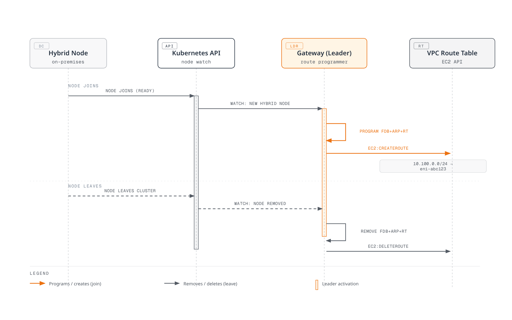
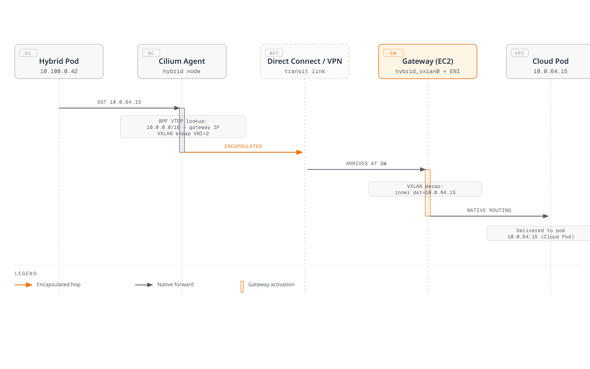
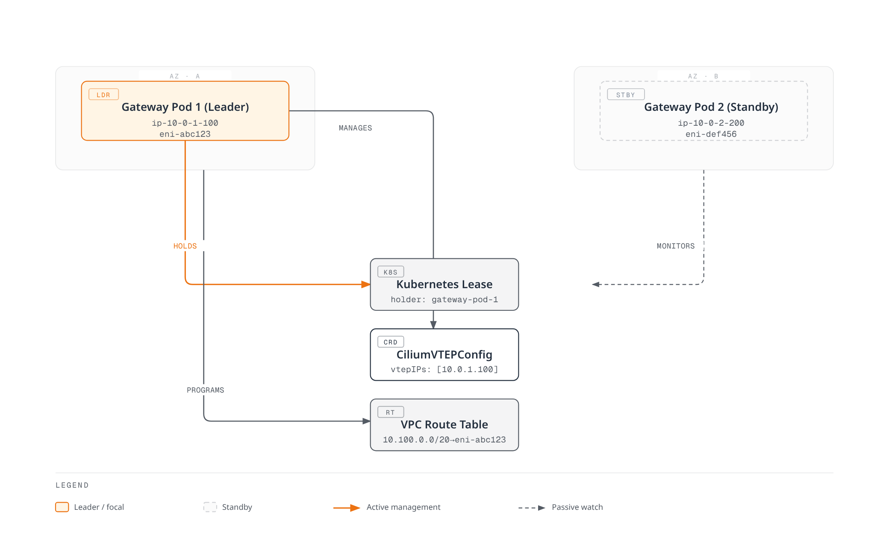

# EKS Hybrid Nodes Gateway

< [Previous: Bare Metal OS Setup](./09-bare-metal-os-setup.md) | [Table of Contents](./README.md) >

> **Supported Versions**: EKS 1.31+
> **Last Updated**: June 28, 2026

---

## Overview

EKS Hybrid Nodes Gateway is an open-source networking component that automates connectivity between your Amazon VPC and Kubernetes Pods running on Hybrid Nodes in on-premises or edge environments. Announced as Generally Available on April 21, 2026, the gateway eliminates the need for manual route management, BGP configuration, or complex overlay networking setups that were previously required to enable bidirectional Pod-level communication between cloud and on-premises workloads.

The gateway works by establishing VXLAN tunnels between dedicated EC2 gateway instances in your VPC and Cilium-managed Hybrid Nodes on-premises. It automatically programs VPC route tables, manages forwarding database (FDB) entries, and configures Cilium VTEP (VXLAN Tunnel Endpoint) integration so that Pods in the VPC can communicate directly with Pods on Hybrid Nodes --- and vice versa --- without any manual intervention.

**Key characteristics:**

- **Open source**: Fully available at [github.com/aws/eks-hybrid-nodes-gateway](https://github.com/aws/eks-hybrid-nodes-gateway)
- **No additional charge**: The gateway software itself is free; you only pay for the EC2 instances running the gateway
- **Automated route management**: VPC route tables are programmed automatically as Hybrid Nodes join and leave the cluster
- **High availability**: Supports a 2-replica Deployment with lease-based leader election for failover
- **Cilium integration**: Leverages Cilium's VTEP feature to enable transparent Pod-to-Pod routing across the VXLAN tunnel

### Learning Objectives

After completing this document, you will be able to:

1. **Explain the architecture** of EKS Hybrid Nodes Gateway, including VXLAN tunneling, leader election, and VPC route management
2. **Deploy and configure** the gateway using Helm, including IAM roles, security groups, and Cilium VTEP integration
3. **Trace traffic flows** between VPC Pods and Hybrid Node Pods in both directions
4. **Implement high availability** with multi-replica gateway deployments and understand failover behavior
5. **Operate and troubleshoot** gateway deployments, including monitoring, scaling, and common failure scenarios
6. **Compare approaches** for Hybrid Nodes networking and decide when to use the gateway vs. manual routing
7. **Apply best practices** for security, performance, and cost optimization in production gateway deployments

### The Problem: Manual Pod Routing in Hybrid Environments

Before the gateway was available, enabling Pod-level communication between VPC and Hybrid Nodes required significant manual effort:

```
Before Gateway (Manual Approach):
=================================

1. Configure BGP peering between on-prem routers and VPC (or use static routes)
2. Manually manage VPC route table entries for every hybrid Pod CIDR
3. Set up and maintain VPN tunnels or Direct Connect with proper route propagation
4. Handle route updates when nodes join/leave the cluster
5. Troubleshoot routing asymmetries and MTU issues across multiple hops
6. Maintain custom scripts or controllers to keep routes in sync

After Gateway (Automated Approach):
====================================

1. Deploy gateway via Helm chart
2. Gateway automatically:
   - Creates VXLAN tunnels to hybrid nodes
   - Programs VPC route table entries
   - Configures Cilium VTEP for transparent routing
   - Handles failover via leader election
   - Updates routes as nodes come and go
```

The gateway transforms what was a complex, error-prone, multi-team networking challenge into a single Helm install with a handful of configuration values.

---

## Architecture Deep Dive

### High-Level Architecture

The EKS Hybrid Nodes Gateway sits at the boundary between your VPC and your on-premises network, acting as a VXLAN-based bridge for Pod traffic. The following diagram illustrates the overall architecture:


### VXLAN Tunnel Mechanics

The gateway uses VXLAN (Virtual Extensible LAN) to encapsulate Pod traffic between the VPC and on-premises environments. Here is how the tunnel is established and maintained:

#### Gateway-Side VXLAN Interface

When the gateway pod starts on an EC2 instance, it creates a `hybrid_vxlan0` network interface with the following parameters:

| Parameter | Value | Description |
|-----------|-------|-------------|
| **Interface name** | `hybrid_vxlan0` | VXLAN tunnel interface on the gateway |
| **VNI (VXLAN Network Identifier)** | 2 | Must match the VNI configured in CiliumVTEPConfig |
| **UDP port** | 8472 | Standard Linux VXLAN port (differs from IANA 4789) |
| **Local IP** | Gateway EC2 instance private IP | Source IP for VXLAN encapsulated packets |
| **Learning** | Disabled | FDB entries are statically programmed by the gateway |

The gateway creates this interface using netlink operations equivalent to:

```bash
# Conceptual equivalent of what the gateway does programmatically
ip link add hybrid_vxlan0 type vxlan \
    id 2 \
    local <gateway-private-ip> \
    dstport 8472 \
    nolearning

ip link set hybrid_vxlan0 up
```

#### FDB, ARP, and Route Programming

For each Hybrid Node that joins the cluster, the gateway programs three types of entries:

```
Per Hybrid Node, the gateway programs:
=======================================

1. FDB (Forwarding Database) Entry:
   bridge fdb append <hybrid-node-vxlan-mac> dev hybrid_vxlan0 dst <hybrid-node-ip>
   → Tells the VXLAN interface where to send encapsulated frames for this node

2. ARP Entry:
   ip neigh add <hybrid-node-vxlan-ip> lladdr <hybrid-node-vxlan-mac> dev hybrid_vxlan0
   → Pre-populates ARP so the gateway can immediately forward packets without ARP discovery

3. Route Entry:
   ip route add <hybrid-node-pod-cidr> via <hybrid-node-vxlan-ip> dev hybrid_vxlan0
   → Directs Pod traffic for this node's CIDR through the VXLAN tunnel
```

This static programming approach (as opposed to dynamic FDB learning) ensures deterministic forwarding behavior and avoids broadcast storms or unknown unicast flooding on the VXLAN overlay.

#### Hybrid Node-Side (Cilium VTEP)

On the Hybrid Node side, Cilium's VTEP (VXLAN Tunnel Endpoint) feature handles the tunnel termination. The gateway registers itself as a remote VTEP via the `CiliumVTEPConfig` custom resource. This tells each Cilium agent on the Hybrid Nodes:

1. Traffic destined for VPC CIDRs should be VXLAN-encapsulated
2. The encapsulated traffic should be sent to the gateway's IP address
3. The VXLAN tunnel uses VNI 2 on UDP port 8472

```yaml
# CiliumVTEPConfig created and managed by the gateway
apiVersion: cilium.io/v1alpha1
kind: CiliumVTEPConfig
metadata:
  name: cilium-vtep-config
spec:
  vtepEndpoints:
    - externalCIDR: "10.0.0.0/16"      # VPC CIDR
      virtualRouterMAC: "ee:ee:ee:ee:ee:ee"
      vtepIPs:
        - "<active-gateway-ec2-private-ip>"
```

When a Pod on a Hybrid Node sends traffic to a VPC IP address (e.g., a cloud-side Pod or an AWS service endpoint), the Cilium agent:
1. Matches the destination against the `externalCIDR` in CiliumVTEPConfig
2. VXLAN-encapsulates the packet with VNI 2
3. Sends the outer UDP packet to the gateway's IP on port 8472
4. The gateway decapsulates and forwards the inner packet into the VPC

### Leader Election and High Availability

The gateway runs as a Kubernetes Deployment with 2 replicas. Only one pod (the leader) actively manages networking resources at any given time. The standby pod maintains its VXLAN tunnel but does not program VPC routes.

#### Lease-Based Leader Election

Leader election uses the standard Kubernetes Lease resource:

```yaml
apiVersion: coordination.k8s.io/v1
kind: Lease
metadata:
  name: eks-hybrid-nodes-gateway
  namespace: eks-hybrid-nodes-gateway
spec:
  holderIdentity: "gateway-pod-abc123"
  leaseDurationSeconds: 15
  acquireTime: "2026-06-28T10:00:00Z"
  renewTime: "2026-06-28T10:00:10Z"
  leaseTransitions: 3
```

The leader election parameters control failover timing:

| Parameter | Default Value | Description |
|-----------|---------------|-------------|
| `leaseDuration` | 15s | How long a lease is valid |
| `renewDeadline` | 10s | How long the leader has to renew |
| `retryPeriod` | 2s | How often non-leaders retry acquiring the lease |

#### What the Leader Does

The leader pod is responsible for:

1. **VPC route table management**: Creates and updates routes in the specified VPC route tables, pointing hybrid Pod CIDRs to the leader's EC2 instance ENI
2. **CiliumVTEPConfig management**: Creates and updates the CiliumVTEPConfig resource to point hybrid nodes' VTEP traffic to the leader's EC2 instance IP
3. **FDB/ARP/route programming**: Programs the local VXLAN interface with entries for all hybrid nodes
4. **Node watching**: Watches Kubernetes Node objects for hybrid nodes joining or leaving, and updates all routing entries accordingly

#### What the Standby Does

The standby pod:

1. **Maintains VXLAN tunnel**: Keeps its `hybrid_vxlan0` interface active and programmed with FDB/ARP/route entries
2. **Does NOT program VPC routes**: Only the leader modifies VPC route tables
3. **Does NOT update CiliumVTEPConfig**: Only the leader updates the VTEP configuration
4. **Monitors lease**: Continuously attempts to acquire the lease in case the leader fails

### VPC Route Table Auto-Management

One of the gateway's most valuable features is automatic VPC route table management. The leader pod watches for Hybrid Node events and programs routes accordingly.



The gateway uses the EC2 API to manage routes:

| API Call | When Used | Purpose |
|----------|-----------|---------|
| `ec2:DescribeRouteTables` | Startup, periodic reconciliation | Discover current route table state |
| `ec2:CreateRoute` | New hybrid node joins | Add Pod CIDR route pointing to gateway ENI |
| `ec2:ReplaceRoute` | Leader failover | Update existing routes to point to new leader's ENI |
| `ec2:DeleteRoute` | Hybrid node leaves | Remove stale Pod CIDR routes |
| `ec2:DescribeInstances` | Startup, failover | Discover gateway EC2 instance ENI IDs |

### Component Interaction Summary

The following diagram shows how all components interact:


---

## Prerequisites

Before deploying the EKS Hybrid Nodes Gateway, ensure all of the following prerequisites are met.

### EKS Cluster Configuration

| Requirement | Details |
|-------------|---------|
| **EKS version** | 1.31 or later |
| **Hybrid Nodes** | At least one Hybrid Node configured and joined to the cluster |
| **Authentication mode** | `API` or `API_AND_CONFIG_MAP` |
| **Endpoint access** | Public only OR Private only (not "Public and Private") |
| **Remote Pod Network** | Pod CIDRs configured for hybrid nodes in the cluster |

### CNI Requirements

The gateway requires a specific CNI configuration:

| Location | CNI | Version | VTEP Support |
|----------|-----|---------|--------------|
| **Cloud nodes** | Amazon VPC CNI | 1.18+ | Not required |
| **Hybrid nodes** | Cilium (EKS distribution) | 1.16.x (EKS) | Required (VTEP must be enabled) |

> **Important**: The gateway only works with Cilium on hybrid nodes. Calico is not supported for the gateway approach because it does not support the VTEP feature. If you are using Calico on hybrid nodes, you must use manual routing approaches (BGP, static routes) instead.

### Network Connectivity

Private connectivity between your VPC and on-premises environment must already be established:

| Connectivity Type | When to Use | Notes |
|-------------------|-------------|-------|
| **AWS Direct Connect** | Production workloads requiring consistent low latency | Dedicated physical connection; most reliable |
| **AWS Site-to-Site VPN** | Standard hybrid connectivity | IPsec tunnels over public internet; up to 1.25 Gbps per tunnel |
| **Transit Gateway + VPN** | Multi-VPC environments | Centralized VPN termination; supports ECMP for higher throughput |
| **Custom VPN (e.g., WireGuard)** | Specialized requirements | Self-managed tunnel; useful when AWS VPN limitations are a concern |

> **Note**: The gateway does not establish the base connectivity between VPC and on-premises. It adds a VXLAN overlay on top of the existing connectivity for Pod-level routing.

### EC2 Gateway Instances

You need at least two EC2 instances in your VPC to run the gateway pods:

```yaml
# Recommended EC2 instance configuration for gateway nodes
Instance type: c6i.large (2 vCPU, 4 GiB RAM) or larger
AMI: Amazon Linux 2023 (EKS optimized)
Placement: Spread across at least 2 Availability Zones
EBS: 20 GiB gp3 (minimal storage needed)
```

The gateway instances must:
1. Be registered as Kubernetes nodes in the EKS cluster (standard cloud nodes with VPC CNI)
2. Have the appropriate IAM instance profile (see [IAM Configuration](#iam-configuration))
3. Be labeled for gateway pod scheduling (see [Installation](#installation-and-configuration))

### Security Group Configuration

The gateway EC2 instances require specific security group rules for VXLAN traffic:

```
Inbound Rules (Gateway Security Group):
========================================
| Protocol | Port  | Source                    | Purpose                    |
|----------|-------|---------------------------|----------------------------|
| UDP      | 8472  | On-premises CIDR(s)       | VXLAN tunnel from hybrid   |
|          |       |                           | nodes to gateway           |
| TCP      | 443   | VPC CIDR                  | Kubernetes API (kubelet)   |
| TCP      | 10250 | Control plane SG / VPC    | kubelet API                |

Outbound Rules (Gateway Security Group):
=========================================
| Protocol | Port  | Destination               | Purpose                    |
|----------|-------|---------------------------|----------------------------|
| UDP      | 8472  | On-premises node IPs      | VXLAN tunnel from gateway  |
|          |       |                           | to hybrid nodes            |
| TCP      | 443   | 0.0.0.0/0 or VPC endpoints| EKS API, EC2 API calls     |
| All      | All   | VPC CIDR                  | Forwarded pod traffic      |
```

#### Terraform Security Group Example

```hcl
resource "aws_security_group" "gateway" {
  name_prefix = "eks-hybrid-gateway-"
  vpc_id      = var.vpc_id

  # Inbound: VXLAN from on-premises hybrid nodes
  ingress {
    description = "VXLAN tunnel from hybrid nodes"
    from_port   = 8472
    to_port     = 8472
    protocol    = "udp"
    cidr_blocks = var.on_premises_cidrs  # e.g., ["192.168.0.0/16"]
  }

  # Inbound: kubelet API from control plane
  ingress {
    description     = "kubelet API"
    from_port       = 10250
    to_port         = 10250
    protocol        = "tcp"
    security_groups = [var.cluster_security_group_id]
  }

  # Outbound: VXLAN to on-premises hybrid nodes
  egress {
    description = "VXLAN tunnel to hybrid nodes"
    from_port   = 8472
    to_port     = 8472
    protocol    = "udp"
    cidr_blocks = var.on_premises_cidrs
  }

  # Outbound: API calls and forwarded traffic
  egress {
    description = "General outbound"
    from_port   = 0
    to_port     = 0
    protocol    = "-1"
    cidr_blocks = ["0.0.0.0/0"]
  }

  tags = {
    Name = "eks-hybrid-nodes-gateway"
  }
}
```

### On-Premises Firewall Configuration

Your on-premises firewall must allow VXLAN traffic between hybrid nodes and the gateway:

```
On-Premises Firewall Rules:
============================
| Direction | Protocol | Port  | Source/Destination        | Purpose              |
|-----------|----------|-------|---------------------------|----------------------|
| Inbound   | UDP      | 8472  | Gateway EC2 private IPs   | VXLAN from gateway   |
| Outbound  | UDP      | 8472  | Gateway EC2 private IPs   | VXLAN to gateway     |
```

> **Tip**: Use the gateway EC2 instance Elastic IPs or private IPs (accessible via Direct Connect/VPN) in your firewall rules. If using multiple gateway instances for HA, include all gateway IPs.

### MTU Considerations

VXLAN encapsulation adds a 50-byte overhead to each packet. Ensure your network path MTU accounts for this:

| Component | Recommended MTU | Notes |
|-----------|----------------|-------|
| Gateway EC2 instance | 9001 (jumbo frames) | Default for most EC2 instance types in VPC |
| On-premises hybrid nodes | 1500 or higher | Depends on your network infrastructure |
| VXLAN interface (effective) | Path MTU - 50 | e.g., 1450 if path MTU is 1500 |
| Direct Connect | 9001 (jumbo frames) | If supported by your DX connection |
| VPN tunnel | 1399-1500 | Varies by VPN configuration |

If your network path between VPC and on-premises uses standard 1500 MTU:

```
Effective Pod MTU calculation:
Physical MTU:        1500 bytes
VXLAN overhead:      - 50 bytes (outer IP + outer UDP + VXLAN header)
VPN overhead (IPsec): - 57-73 bytes (if applicable)
Effective Pod MTU:   ~1377-1450 bytes
```

Cilium on hybrid nodes can be configured with the appropriate MTU:

```yaml
# Cilium Helm values for hybrid nodes
mtu: 1400  # Conservative value accounting for VXLAN + potential VPN overhead
```

---

## IAM Configuration

The gateway pods run on EC2 instances and need permissions to manage VPC route tables and describe EC2 instances. These permissions are granted through an IAM role attached to the gateway EC2 instances' instance profile.

### Required IAM Permissions

The gateway requires the following minimum IAM permissions:

```json
{
  "Version": "2012-10-17",
  "Statement": [
    {
      "Sid": "HybridNodesGatewayRouteManagement",
      "Effect": "Allow",
      "Action": [
        "ec2:DescribeRouteTables",
        "ec2:CreateRoute",
        "ec2:ReplaceRoute",
        "ec2:DeleteRoute"
      ],
      "Resource": "*",
      "Condition": {
        "StringEquals": {
          "aws:RequestedRegion": "${var.region}"
        }
      }
    },
    {
      "Sid": "HybridNodesGatewayInstanceDiscovery",
      "Effect": "Allow",
      "Action": [
        "ec2:DescribeInstances"
      ],
      "Resource": "*",
      "Condition": {
        "StringEquals": {
          "aws:RequestedRegion": "${var.region}"
        }
      }
    }
  ]
}
```

> **Security Note**: The `ec2:CreateRoute`, `ec2:ReplaceRoute`, and `ec2:DeleteRoute` actions cannot be scoped to specific route table ARNs via the `Resource` field in all cases. Use `Condition` keys to limit the scope as much as possible.

### Scoped IAM Policy (Recommended for Production)

For production environments, scope the route table permissions to specific route table IDs using conditions:

```json
{
  "Version": "2012-10-17",
  "Statement": [
    {
      "Sid": "HybridNodesGatewayRouteManagement",
      "Effect": "Allow",
      "Action": [
        "ec2:CreateRoute",
        "ec2:ReplaceRoute",
        "ec2:DeleteRoute"
      ],
      "Resource": [
        "arn:aws:ec2:us-west-2:111122223333:route-table/rtb-0abc1234def56789a",
        "arn:aws:ec2:us-west-2:111122223333:route-table/rtb-0abc1234def56789b"
      ]
    },
    {
      "Sid": "HybridNodesGatewayDescribe",
      "Effect": "Allow",
      "Action": [
        "ec2:DescribeRouteTables",
        "ec2:DescribeInstances"
      ],
      "Resource": "*"
    }
  ]
}
```

### Terraform IAM Configuration

```hcl
# IAM Role for Gateway EC2 Instances
resource "aws_iam_role" "gateway" {
  name = "eks-hybrid-nodes-gateway-${var.cluster_name}"

  assume_role_policy = jsonencode({
    Version = "2012-10-17"
    Statement = [
      {
        Action = "sts:AssumeRole"
        Effect = "Allow"
        Principal = {
          Service = "ec2.amazonaws.com"
        }
      }
    ]
  })
}

# Gateway-specific policy
resource "aws_iam_role_policy" "gateway_route_management" {
  name = "route-management"
  role = aws_iam_role.gateway.id

  policy = jsonencode({
    Version = "2012-10-17"
    Statement = [
      {
        Sid    = "RouteManagement"
        Effect = "Allow"
        Action = [
          "ec2:CreateRoute",
          "ec2:ReplaceRoute",
          "ec2:DeleteRoute"
        ]
        Resource = [
          for rtb_id in var.route_table_ids :
          "arn:aws:ec2:${var.region}:${data.aws_caller_identity.current.account_id}:route-table/${rtb_id}"
        ]
      },
      {
        Sid    = "Describe"
        Effect = "Allow"
        Action = [
          "ec2:DescribeRouteTables",
          "ec2:DescribeInstances"
        ]
        Resource = "*"
      }
    ]
  })
}

# Attach EKS worker node policy (needed for kubelet)
resource "aws_iam_role_policy_attachment" "gateway_eks_worker" {
  policy_arn = "arn:aws:iam::aws:policy/AmazonEKSWorkerNodePolicy"
  role       = aws_iam_role.gateway.name
}

resource "aws_iam_role_policy_attachment" "gateway_ecr_read" {
  policy_arn = "arn:aws:iam::aws:policy/AmazonEC2ContainerRegistryReadOnly"
  role       = aws_iam_role.gateway.name
}

resource "aws_iam_role_policy_attachment" "gateway_cni" {
  policy_arn = "arn:aws:iam::aws:policy/AmazonEKS_CNI_Policy"
  role       = aws_iam_role.gateway.name
}

# Instance profile
resource "aws_iam_instance_profile" "gateway" {
  name = "eks-hybrid-nodes-gateway-${var.cluster_name}"
  role = aws_iam_role.gateway.name
}
```

### AWS CLI IAM Setup

If you prefer to create the IAM resources using the AWS CLI:

```bash
# Create the IAM role
aws iam create-role \
  --role-name eks-hybrid-nodes-gateway \
  --assume-role-policy-document '{
    "Version": "2012-10-17",
    "Statement": [
      {
        "Effect": "Allow",
        "Principal": {"Service": "ec2.amazonaws.com"},
        "Action": "sts:AssumeRole"
      }
    ]
  }'

# Create and attach the route management policy
cat > /tmp/gateway-policy.json << 'EOF'
{
  "Version": "2012-10-17",
  "Statement": [
    {
      "Sid": "RouteManagement",
      "Effect": "Allow",
      "Action": [
        "ec2:DescribeRouteTables",
        "ec2:CreateRoute",
        "ec2:ReplaceRoute",
        "ec2:DeleteRoute",
        "ec2:DescribeInstances"
      ],
      "Resource": "*"
    }
  ]
}
EOF

aws iam put-role-policy \
  --role-name eks-hybrid-nodes-gateway \
  --policy-name route-management \
  --policy-document file:///tmp/gateway-policy.json

# Attach EKS worker node policies
aws iam attach-role-policy \
  --role-name eks-hybrid-nodes-gateway \
  --policy-arn arn:aws:iam::aws:policy/AmazonEKSWorkerNodePolicy

aws iam attach-role-policy \
  --role-name eks-hybrid-nodes-gateway \
  --policy-arn arn:aws:iam::aws:policy/AmazonEC2ContainerRegistryReadOnly

aws iam attach-role-policy \
  --role-name eks-hybrid-nodes-gateway \
  --policy-arn arn:aws:iam::aws:policy/AmazonEKS_CNI_Policy

# Create instance profile
aws iam create-instance-profile \
  --instance-profile-name eks-hybrid-nodes-gateway

aws iam add-role-to-instance-profile \
  --instance-profile-name eks-hybrid-nodes-gateway \
  --role-name eks-hybrid-nodes-gateway
```

---

## Installation and Configuration

### Step 1: Label Gateway Nodes

Before installing the gateway, label the EC2 instances that will host the gateway pods. These nodes must be standard cloud nodes in your VPC running the VPC CNI:

```bash
# Label two nodes across different AZs for high availability
kubectl label node ip-10-0-1-100.us-west-2.compute.internal \
  node-role.kubernetes.io/gateway=true

kubectl label node ip-10-0-2-200.us-west-2.compute.internal \
  node-role.kubernetes.io/gateway=true

# Verify labels
kubectl get nodes -l node-role.kubernetes.io/gateway=true
```

Expected output:

```
NAME                                        STATUS   ROLES    AGE   VERSION
ip-10-0-1-100.us-west-2.compute.internal   Ready    <none>   10d   v1.31.2-eks-abcdef0
ip-10-0-2-200.us-west-2.compute.internal   Ready    <none>   10d   v1.31.2-eks-abcdef0
```

### Step 2: Gather Configuration Values

Before installing the Helm chart, collect the required values:

```bash
# Get your VPC CIDR
VPC_CIDR=$(aws ec2 describe-vpcs \
  --vpc-ids $VPC_ID \
  --query 'Vpcs[0].CidrBlock' \
  --output text)
echo "VPC CIDR: $VPC_CIDR"

# Get route table IDs (all route tables that need hybrid Pod routes)
ROUTE_TABLE_IDS=$(aws ec2 describe-route-tables \
  --filters "Name=vpc-id,Values=$VPC_ID" \
  --query 'RouteTables[*].RouteTableId' \
  --output text)
echo "Route Table IDs: $ROUTE_TABLE_IDS"

# Get the hybrid Pod CIDRs from your EKS cluster configuration
POD_CIDRS=$(aws eks describe-cluster \
  --name $CLUSTER_NAME \
  --query 'cluster.kubernetesNetworkConfig.remoteNetworkConfig.remotePodNetworks[*].cidrs[*]' \
  --output text)
echo "Hybrid Pod CIDRs: $POD_CIDRS"
```

### Step 3: Install via Helm

Install the gateway using the OCI Helm chart from Amazon ECR Public:

```bash
helm install eks-hybrid-nodes-gateway \
  oci://public.ecr.aws/eks/eks-hybrid-nodes-gateway \
  --version 1.0.0 \
  --namespace eks-hybrid-nodes-gateway \
  --create-namespace \
  --set vpcCIDR=10.0.0.0/16 \
  --set "podCIDRs={10.100.0.0/20}" \
  --set "routeTableIDs={rtb-0abc1234def56789a,rtb-0abc1234def56789b}" \
  --set nodeSelector."node-role\.kubernetes\.io/gateway"=true
```

### Full Helm Values Reference

For production deployments, use a dedicated `values.yaml` file:

```yaml
# values.yaml - EKS Hybrid Nodes Gateway configuration

# --- Required settings ---

# VPC CIDR block. The gateway programs CiliumVTEPConfig with this
# so hybrid nodes know which traffic to route through the VXLAN tunnel.
vpcCIDR: "10.0.0.0/16"

# Pod CIDRs used by hybrid nodes. The gateway creates VPC route table
# entries for these CIDRs pointing to the active gateway's ENI.
podCIDRs:
  - "10.100.0.0/20"

# VPC route table IDs to manage. The gateway will create/update/delete
# routes in these tables. Include all route tables used by subnets
# that need to reach hybrid node Pods.
routeTableIDs:
  - "rtb-0abc1234def56789a"   # Private subnet route table AZ-a
  - "rtb-0abc1234def56789b"   # Private subnet route table AZ-b

# --- Deployment settings ---

# Number of replicas. 2 is recommended for high availability.
# Only the leader actively manages routes; standby is ready for failover.
replicaCount: 2

# Node selector to place gateway pods on labeled EC2 instances.
nodeSelector:
  node-role.kubernetes.io/gateway: "true"

# Topology spread to distribute gateway pods across AZs.
topologySpreadConstraints:
  - maxSkew: 1
    topologyKey: topology.kubernetes.io/zone
    whenUnsatisfiable: DoNotSchedule
    labelSelector:
      matchLabels:
        app.kubernetes.io/name: eks-hybrid-nodes-gateway

# Pod anti-affinity to ensure gateway pods run on different nodes.
affinity:
  podAntiAffinity:
    requiredDuringSchedulingIgnoredDuringExecution:
      - labelSelector:
          matchExpressions:
            - key: app.kubernetes.io/name
              operator: In
              values:
                - eks-hybrid-nodes-gateway
        topologyKey: kubernetes.io/hostname

# --- Resource configuration ---

resources:
  requests:
    cpu: 100m
    memory: 128Mi
  limits:
    cpu: 500m
    memory: 256Mi

# --- VXLAN settings (advanced, usually no need to change) ---

# VXLAN Network Identifier. Must match the VNI in CiliumVTEPConfig.
vxlanVNI: 2

# VXLAN destination port. Must match Cilium's tunnel port.
vxlanPort: 8472

# --- Leader election settings (advanced) ---

leaderElection:
  leaseDuration: 15s
  renewDeadline: 10s
  retryPeriod: 2s

# --- Logging ---

logLevel: info   # debug, info, warn, error

# --- Service account ---

serviceAccount:
  create: true
  name: eks-hybrid-nodes-gateway
  annotations: {}
```

Install with the values file:

```bash
helm install eks-hybrid-nodes-gateway \
  oci://public.ecr.aws/eks/eks-hybrid-nodes-gateway \
  --version 1.0.0 \
  --namespace eks-hybrid-nodes-gateway \
  --create-namespace \
  -f values.yaml
```

### Step 4: Verify Installation

After installation, verify all components are running correctly:

```bash
# 1. Check gateway pods are running
kubectl get pods -n eks-hybrid-nodes-gateway -o wide
```

Expected output:

```
NAME                                          READY   STATUS    RESTARTS   AGE   IP           NODE
eks-hybrid-nodes-gateway-7b8f9c4d5-abc12     1/1     Running   0          2m    10.0.1.55    ip-10-0-1-100.us-west-2.compute.internal
eks-hybrid-nodes-gateway-7b8f9c4d5-def34     1/1     Running   0          2m    10.0.2.88    ip-10-0-2-200.us-west-2.compute.internal
```

```bash
# 2. Verify leader election - check which pod holds the lease
kubectl get lease -n eks-hybrid-nodes-gateway
```

Expected output:

```
NAME                        HOLDER                                     AGE
eks-hybrid-nodes-gateway    eks-hybrid-nodes-gateway-7b8f9c4d5-abc12   2m
```

```bash
# 3. Check the CiliumVTEPConfig was created
kubectl get ciliumvtepconfig
```

Expected output:

```
NAME                  AGE
cilium-vtep-config    2m
```

```bash
# 4. Verify CiliumVTEPConfig contents
kubectl get ciliumvtepconfig cilium-vtep-config -o yaml
```

Expected output:

```yaml
apiVersion: cilium.io/v1alpha1
kind: CiliumVTEPConfig
metadata:
  name: cilium-vtep-config
spec:
  vtepEndpoints:
    - externalCIDR: "10.0.0.0/16"
      virtualRouterMAC: "ee:ee:ee:ee:ee:ee"
      vtepIPs:
        - "10.0.1.100"    # Leader gateway EC2 instance IP
```

```bash
# 5. Verify VPC route table entries
aws ec2 describe-route-tables \
  --route-table-ids rtb-0abc1234def56789a \
  --query 'RouteTables[0].Routes[?DestinationCidrBlock==`10.100.0.0/20`]'
```

Expected output:

```json
[
  {
    "DestinationCidrBlock": "10.100.0.0/20",
    "InstanceId": "i-0abc123def456789a",
    "InstanceOwnerId": "111122223333",
    "NetworkInterfaceId": "eni-0abc123def456789a",
    "Origin": "CreateRoute",
    "State": "active"
  }
]
```

```bash
# 6. Check gateway logs for any errors
kubectl logs -n eks-hybrid-nodes-gateway -l app.kubernetes.io/name=eks-hybrid-nodes-gateway --tail=50
```

```bash
# 7. Test Pod connectivity from a cloud Pod to a hybrid Pod
kubectl run test-connectivity --image=busybox --rm -it --restart=Never -- \
  wget -qO- --timeout=5 http://<hybrid-pod-ip>:<port>
```

---

## CNI Configuration

### Cilium VTEP Configuration on Hybrid Nodes

The gateway manages the `CiliumVTEPConfig` resource automatically, but the Cilium installation on hybrid nodes must have VTEP support enabled. When installing Cilium on hybrid nodes via the EKS Cilium add-on or Helm, ensure these values are set:

```yaml
# Cilium Helm values for hybrid nodes (VTEP-related settings)
vtep:
  enabled: true     # Enable VXLAN Tunnel Endpoint feature
  # The gateway will create the CiliumVTEPConfig resource;
  # Cilium just needs VTEP enabled to process it.

tunnel: vxlan       # Cilium must use VXLAN tunnel mode
tunnelPort: 8472    # Must match the gateway's vxlanPort

ipam:
  mode: cluster-pool
  operator:
    clusterPoolIPv4PodCIDRList:
      - "10.100.0.0/20"    # Hybrid pod CIDR

# MTU configuration accounting for VXLAN overhead
mtu: 1400

# Enable BPF masquerade for outbound traffic
bpf:
  masquerade: true

# Node-to-node encryption (optional but recommended)
encryption:
  enabled: false     # Set to true for WireGuard encryption on the tunnel
  type: wireguard
```

#### Verifying Cilium VTEP on Hybrid Nodes

After the gateway creates the `CiliumVTEPConfig`, verify that Cilium agents on hybrid nodes have processed it:

```bash
# SSH to a hybrid node or use kubectl exec on a Cilium agent pod
kubectl exec -n kube-system ds/cilium -- cilium bpf vtep list
```

Expected output:

```
VTEP CIDR            VTEP IP        VTEP MAC              VTEP TUNNEL ID
10.0.0.0/16          10.0.1.100     ee:ee:ee:ee:ee:ee     2
```

This confirms that the Cilium agent knows to forward VPC-bound traffic through the VXLAN tunnel to the gateway at `10.0.1.100`.

### VPC CNI Configuration on Cloud Nodes

Cloud nodes use the standard Amazon VPC CNI. No special configuration is needed for the gateway. Pods on cloud nodes receive IPs from the VPC subnet, and traffic to hybrid Pod CIDRs is routed via the VPC route table entries that the gateway manages.

The default VPC CNI configuration works:

```yaml
# VPC CNI (aws-node) - standard configuration
# No changes needed for gateway integration
env:
  - name: AWS_VPC_K8S_CNI_CUSTOM_NETWORK_CFG
    value: "false"
  - name: ENABLE_PREFIX_DELEGATION
    value: "true"    # Recommended for IP efficiency
  - name: WARM_PREFIX_TARGET
    value: "1"
```

### CiliumVTEPConfig CRD Details

The `CiliumVTEPConfig` is a cluster-scoped custom resource that tells Cilium agents about external VXLAN tunnel endpoints. The gateway creates and maintains a single instance of this resource.

```yaml
apiVersion: cilium.io/v1alpha1
kind: CiliumVTEPConfig
metadata:
  name: cilium-vtep-config
spec:
  # List of VTEP endpoints that Cilium should forward traffic to
  vtepEndpoints:
    - # The CIDR range accessible through this VTEP
      # Set to the VPC CIDR so all VPC traffic goes through the tunnel
      externalCIDR: "10.0.0.0/16"

      # Virtual MAC address used in the VXLAN inner Ethernet header
      # This is a well-known dummy MAC; actual forwarding is IP-based
      virtualRouterMAC: "ee:ee:ee:ee:ee:ee"

      # IP addresses of the VTEP endpoints (gateway EC2 instance IPs)
      # Only the active leader's IP is listed
      vtepIPs:
        - "10.0.1.100"
```

**Key behaviors:**

- **Single instance**: Only one `CiliumVTEPConfig` resource can exist in a cluster. The gateway manages it exclusively.
- **Leader updates**: During failover, the new leader updates the `vtepIPs` to its own EC2 instance IP.
- **Cilium reload**: When the `CiliumVTEPConfig` changes, Cilium agents update their BPF maps to reflect the new VTEP endpoint. This typically takes 1-5 seconds.

---

## Traffic Flow Patterns

Understanding how traffic flows through the gateway is essential for troubleshooting and capacity planning. This section traces packets through the system for each major communication pattern.

### Pattern 1: VPC Pod to Hybrid Pod

This is the most common pattern --- a Pod running on a cloud node in the VPC needs to communicate with a Pod running on a hybrid node on-premises.


**Step-by-step packet flow:**

1. Cloud Pod (`10.0.64.15`) sends a packet to Hybrid Pod (`10.100.0.42`)
2. The packet enters the VPC network; VPC route table matches `10.100.0.0/24 -> gateway ENI`
3. The packet arrives at the gateway EC2 instance's primary ENI
4. The gateway's Linux routing table matches the route: `10.100.0.0/24 via <hybrid-node-vxlan-ip> dev hybrid_vxlan0`
5. The gateway VXLAN-encapsulates the packet (outer src: gateway IP, outer dst: hybrid node IP, VNI: 2, outer UDP dst: 8472)
6. The encapsulated packet traverses Direct Connect / VPN to the on-premises network
7. The hybrid node's Cilium agent receives the UDP packet on port 8472
8. Cilium decapsulates the VXLAN packet and delivers the inner packet to the destination Pod

### Pattern 2: Hybrid Pod to VPC Pod

When a Pod on a hybrid node needs to reach a Pod (or any IP) in the VPC.



**Step-by-step packet flow:**

1. Hybrid Pod (`10.100.0.42`) sends a packet to Cloud Pod (`10.0.64.15`)
2. The Cilium agent on the hybrid node does a BPF lookup and finds that `10.0.64.15` matches the VTEP `externalCIDR` of `10.0.0.0/16`
3. Cilium VXLAN-encapsulates the packet (outer dst: gateway IP `10.0.1.100`, VNI: 2, outer UDP dst: 8472)
4. The encapsulated packet traverses Direct Connect / VPN to the VPC
5. The gateway's EC2 instance receives the UDP packet on port 8472
6. The gateway decapsulates the VXLAN packet, extracting the inner packet (dst: `10.0.64.15`)
7. The inner packet is forwarded through the gateway EC2 instance's ENI into the VPC
8. Standard VPC routing delivers the packet to the cloud Pod

> **Important**: The gateway EC2 instance must have **source/destination check disabled** on its ENI for this return path to work. The gateway forwards packets with source IPs that are not its own (the hybrid Pod's IP). Disable this check:
>
> ```bash
> aws ec2 modify-instance-attribute \
>   --instance-id i-0abc123def456789a \
>   --no-source-dest-check
> ```

### Pattern 3: Control Plane to Webhook on Hybrid Node

When a mutating or validating webhook runs on a hybrid node, the EKS control plane needs to reach it.

```
Traffic flow: Control Plane → Webhook on Hybrid Node
======================================================

1. Control plane receives an API request that triggers a webhook
2. Control plane sends HTTPS request to webhook service ClusterIP
3. kube-proxy / iptables on the control plane ENI node routes to the Pod IP
4. If the Pod is on a hybrid node:
   a. Packet enters VPC routing
   b. VPC route table matches hybrid Pod CIDR → gateway ENI
   c. Gateway VXLAN-encapsulates and forwards to hybrid node
   d. Cilium decapsulates and delivers to webhook Pod
5. Webhook response follows reverse path (Pattern 2)
```

This works because the gateway makes hybrid Pod IPs routable from within the VPC, and the control plane ENIs are in the VPC.

### Pattern 4: AWS Services to Hybrid Pods

AWS services such as ALB, NLB, Amazon Managed Prometheus, and CloudWatch can reach hybrid Pods through the gateway:

```
AWS Service → Hybrid Pod routing:
==================================

ALB/NLB (IP target type):
  ALB → Target IP (hybrid Pod) → VPC route table → Gateway → VXLAN → Hybrid Node → Pod

Amazon Managed Prometheus (remote write):
  Not applicable (Prometheus scrapes targets, doesn't receive connections)

Amazon Managed Prometheus (scrape):
  AMP agent on hybrid node pushes metrics; no inbound from AMP needed

CloudWatch Agent:
  Agent runs on hybrid node, pushes to CloudWatch endpoint via Direct Connect/VPN
  No inbound to hybrid pods needed

AWS PrivateLink Services:
  Service → VPC Endpoint → VPC routing → Gateway → VXLAN → Hybrid Pod
```

> **Load Balancer Note**: When using ALB or NLB with IP target type pointing to hybrid Pods, the load balancer must be in a subnet whose route table includes the gateway-managed routes. Ensure the ALB/NLB subnets' route tables are listed in the gateway's `routeTableIDs` configuration.

### Pattern 5: Comparison --- With vs Without Gateway

Without the gateway, achieving the same Pod-level reachability requires manual networking:

```
WITHOUT Gateway:
================

VPC Pod → Hybrid Pod:
  1. Configure BGP peering between on-prem router and VPC (via TGW or VGW)
  2. Advertise hybrid Pod CIDRs via BGP from on-prem
  3. Or: manually add static routes in VPC route tables
  4. Traffic flows: VPC → Direct Connect/VPN → on-prem router → Hybrid Node
  5. Requires on-prem router to know individual Pod CIDRs per node
  6. No VXLAN — traffic is routed natively (potentially better performance)
  7. Route updates when nodes join/leave require BGP or manual intervention

WITH Gateway:
=============

VPC Pod → Hybrid Pod:
  1. Install gateway Helm chart (one-time)
  2. Traffic flows: VPC → Gateway ENI → VXLAN tunnel → Hybrid Node
  3. Routes managed automatically in VPC and CiliumVTEPConfig
  4. Node join/leave handled automatically
  5. VXLAN adds ~50 bytes overhead per packet
  6. Single choke point (gateway instances) for all cross-boundary traffic
```

---

## High Availability and Failover

### Deployment Architecture

The recommended production deployment uses 2 gateway replicas spread across Availability Zones:



### Failover Sequence

When the leader gateway pod becomes unavailable (node failure, pod crash, network partition), the following failover sequence occurs:


### Failover Timeline

| Phase | Duration | Description |
|-------|----------|-------------|
| **Detection** | 0-15s | Current leader fails to renew lease; lease expires after `leaseDuration` |
| **Election** | 0-2s | Standby acquires lease on next `retryPeriod` tick |
| **Route update** | 1-3s | New leader calls `ec2:ReplaceRoute` to update VPC routes |
| **VTEP update** | 1-5s | New leader updates `CiliumVTEPConfig`; Cilium agents reload BPF maps |
| **Total** | **~15-25s** | End-to-end failover time |

During the failover window:
- **VPC-to-hybrid traffic**: Drops until VPC routes are updated (packets go to the failed gateway's ENI)
- **Hybrid-to-VPC traffic**: Drops until CiliumVTEPConfig is updated (Cilium sends to old gateway IP)
- **Intra-hybrid traffic**: Unaffected (Cilium handles this directly between hybrid nodes)

### Multi-AZ Deployment Recommendations

For production environments:

```yaml
# Ensure gateway pods are spread across AZs
topologySpreadConstraints:
  - maxSkew: 1
    topologyKey: topology.kubernetes.io/zone
    whenUnsatisfiable: DoNotSchedule
    labelSelector:
      matchLabels:
        app.kubernetes.io/name: eks-hybrid-nodes-gateway

# Ensure gateway pods are on different physical nodes
affinity:
  podAntiAffinity:
    requiredDuringSchedulingIgnoredDuringExecution:
      - labelSelector:
          matchExpressions:
            - key: app.kubernetes.io/name
              operator: In
              values:
                - eks-hybrid-nodes-gateway
        topologyKey: kubernetes.io/hostname
```

### Pod Disruption Budget

Protect the gateway from voluntary disruptions:

```yaml
apiVersion: policy/v1
kind: PodDisruptionBudget
metadata:
  name: eks-hybrid-nodes-gateway
  namespace: eks-hybrid-nodes-gateway
spec:
  minAvailable: 1
  selector:
    matchLabels:
      app.kubernetes.io/name: eks-hybrid-nodes-gateway
```

### Recovery After Total Gateway Failure

If both gateway pods fail simultaneously:

1. **Hybrid Pods lose VPC connectivity** (both directions)
2. **Hybrid node-to-hybrid node traffic** continues to work (Cilium handles this)
3. **Control plane connectivity** to hybrid nodes continues (uses the existing Direct Connect/VPN path, not the gateway)

Recovery steps:

```bash
# 1. Check gateway pod status
kubectl get pods -n eks-hybrid-nodes-gateway

# 2. If pods are in CrashLoopBackOff, check logs
kubectl logs -n eks-hybrid-nodes-gateway -l app.kubernetes.io/name=eks-hybrid-nodes-gateway --previous

# 3. If nodes are down, verify gateway node health
kubectl get nodes -l node-role.kubernetes.io/gateway=true

# 4. If nodes are NotReady, the Deployment will schedule pods on other
#    labeled nodes (if available). Add more gateway-labeled nodes if needed:
kubectl label node <new-node> node-role.kubernetes.io/gateway=true

# 5. Once a gateway pod starts and acquires the lease, verify recovery:
kubectl get lease -n eks-hybrid-nodes-gateway
kubectl get ciliumvtepconfig
aws ec2 describe-route-tables --route-table-ids rtb-0abc1234def56789a \
  --query 'RouteTables[0].Routes[?starts_with(DestinationCidrBlock, `10.100`)]'
```

---

## Operations

### Monitoring

#### Key Metrics to Watch

The gateway exposes Prometheus metrics that should be monitored:

| Metric | Type | Description | Alert Threshold |
|--------|------|-------------|-----------------|
| `gateway_leader` | Gauge | 1 if this pod is the leader, 0 otherwise | Sum across all pods should be exactly 1 |
| `gateway_vxlan_tx_packets` | Counter | Packets sent through VXLAN tunnel | Sudden drops may indicate connectivity issues |
| `gateway_vxlan_tx_bytes` | Counter | Bytes sent through VXLAN tunnel | Monitor for capacity planning |
| `gateway_vxlan_rx_packets` | Counter | Packets received from VXLAN tunnel | Sudden drops may indicate issues |
| `gateway_vxlan_rx_bytes` | Counter | Bytes received from VXLAN tunnel | Monitor for capacity planning |
| `gateway_route_updates_total` | Counter | Number of VPC route table updates | Spikes may indicate node instability |
| `gateway_route_update_errors_total` | Counter | Failed VPC route table updates | Should be 0; any non-zero is critical |
| `gateway_hybrid_nodes_count` | Gauge | Number of hybrid nodes tracked | Should match expected node count |
| `gateway_lease_transitions_total` | Counter | Number of leader transitions | Frequent transitions indicate instability |

#### Prometheus ServiceMonitor

```yaml
apiVersion: monitoring.coreos.com/v1
kind: ServiceMonitor
metadata:
  name: eks-hybrid-nodes-gateway
  namespace: eks-hybrid-nodes-gateway
spec:
  selector:
    matchLabels:
      app.kubernetes.io/name: eks-hybrid-nodes-gateway
  endpoints:
    - port: metrics
      interval: 15s
      path: /metrics
```

#### Sample Grafana Dashboard Queries

```promql
# Leader status (should always be exactly 1 across all pods)
sum(gateway_leader{namespace="eks-hybrid-nodes-gateway"})

# VXLAN tunnel throughput (bytes per second)
rate(gateway_vxlan_tx_bytes[5m]) + rate(gateway_vxlan_rx_bytes[5m])

# VXLAN tunnel packet rate
rate(gateway_vxlan_tx_packets[5m]) + rate(gateway_vxlan_rx_packets[5m])

# Route update error rate (should be 0)
rate(gateway_route_update_errors_total[5m])

# Hybrid node count
gateway_hybrid_nodes_count
```

#### CloudWatch Integration

The gateway EC2 instances' network metrics are visible in CloudWatch:

```bash
# Monitor gateway ENI network throughput
aws cloudwatch get-metric-statistics \
  --namespace "AWS/EC2" \
  --metric-name "NetworkIn" \
  --dimensions Name=InstanceId,Value=i-0abc123def456789a \
  --statistics Sum \
  --period 300 \
  --start-time $(date -u -d '1 hour ago' +%Y-%m-%dT%H:%M:%S) \
  --end-time $(date -u +%Y-%m-%dT%H:%M:%S)
```

### Logging

Gateway logs provide detailed information about tunnel operations:

```bash
# View gateway leader logs (real-time)
kubectl logs -n eks-hybrid-nodes-gateway -l app.kubernetes.io/name=eks-hybrid-nodes-gateway -f

# Filter for specific events
kubectl logs -n eks-hybrid-nodes-gateway -l app.kubernetes.io/name=eks-hybrid-nodes-gateway | grep "route"
kubectl logs -n eks-hybrid-nodes-gateway -l app.kubernetes.io/name=eks-hybrid-nodes-gateway | grep "error"
```

Key log messages and their meanings:

| Log Message | Level | Meaning |
|-------------|-------|---------|
| `"acquired leader lease"` | INFO | This pod became the leader |
| `"lost leader lease"` | WARN | This pod lost leadership (another pod took over) |
| `"created route for node"` | INFO | VPC route table entry created for a new hybrid node |
| `"replaced route for failover"` | INFO | VPC route updated during leader failover |
| `"removed route for node"` | INFO | VPC route removed when a hybrid node left |
| `"updated CiliumVTEPConfig"` | INFO | VTEP configuration updated (usually during failover) |
| `"failed to create route"` | ERROR | VPC route creation failed (check IAM permissions) |
| `"VXLAN interface setup failed"` | ERROR | Cannot create VXLAN interface (check NET_ADMIN capability) |
| `"FDB entry programming failed"` | ERROR | Cannot program forwarding database entry |

#### Enable Debug Logging

For troubleshooting, enable debug-level logging:

```bash
# Upgrade with debug logging
helm upgrade eks-hybrid-nodes-gateway \
  oci://public.ecr.aws/eks/eks-hybrid-nodes-gateway \
  --version 1.0.0 \
  --namespace eks-hybrid-nodes-gateway \
  --reuse-values \
  --set logLevel=debug
```

### Troubleshooting

#### Issue: Pods Cannot Communicate Across the Gateway

```bash
# Step 1: Verify gateway is running and has a leader
kubectl get pods -n eks-hybrid-nodes-gateway -o wide
kubectl get lease -n eks-hybrid-nodes-gateway

# Step 2: Verify CiliumVTEPConfig exists and has correct IPs
kubectl get ciliumvtepconfig -o yaml

# Step 3: Verify VPC route table has entries for hybrid Pod CIDRs
aws ec2 describe-route-tables \
  --route-table-ids rtb-0abc1234def56789a \
  --query 'RouteTables[0].Routes[?contains(DestinationCidrBlock, `10.100`)]'

# Step 4: Verify VXLAN interface on gateway pod
kubectl exec -n eks-hybrid-nodes-gateway <gateway-pod> -- ip link show hybrid_vxlan0
kubectl exec -n eks-hybrid-nodes-gateway <gateway-pod> -- ip route show dev hybrid_vxlan0

# Step 5: Verify Cilium VTEP BPF map on hybrid node
kubectl exec -n kube-system <cilium-pod-on-hybrid-node> -- cilium bpf vtep list
```

#### Issue: Security Group Misconfiguration

Symptoms: VXLAN tunnel established but no traffic flows.

```bash
# Check if UDP 8472 is allowed in the gateway security group
aws ec2 describe-security-groups \
  --group-ids sg-0abc123def456789a \
  --query 'SecurityGroups[0].IpPermissions[?FromPort==`8472`]'

# Test UDP connectivity from hybrid node to gateway
# (Run from a hybrid node)
nc -uzv <gateway-ip> 8472

# Check for dropped packets on the gateway EC2 instance
kubectl exec -n eks-hybrid-nodes-gateway <gateway-pod> -- \
  cat /proc/net/snmp | grep Udp
```

#### Issue: Missing VPC Routes

Symptoms: Cloud Pods cannot reach hybrid Pods; route table entries are missing.

```bash
# Check gateway logs for route errors
kubectl logs -n eks-hybrid-nodes-gateway -l app.kubernetes.io/name=eks-hybrid-nodes-gateway | grep -i "route"

# Verify IAM permissions
aws sts get-caller-identity  # Verify you're checking the right account

# Test route creation manually (to verify permissions)
aws ec2 create-route \
  --route-table-id rtb-0abc1234def56789a \
  --destination-cidr-block 10.100.99.0/24 \
  --instance-id i-0abc123def456789a \
  --dry-run

# Check if source/dest check is disabled on gateway instances
aws ec2 describe-instance-attribute \
  --instance-id i-0abc123def456789a \
  --attribute sourceDestCheck
```

#### Issue: Frequent Leader Transitions

Symptoms: Leader election log messages appearing frequently; route updates causing brief connectivity drops.

```bash
# Check lease transition count
kubectl get lease -n eks-hybrid-nodes-gateway -o yaml | grep leaseTransitions

# Check node stability
kubectl get nodes -l node-role.kubernetes.io/gateway=true -o wide

# Check for resource pressure on gateway nodes
kubectl top node <gateway-node>
kubectl describe node <gateway-node> | grep -A 5 "Conditions:"

# Check API server connectivity from gateway pods
kubectl exec -n eks-hybrid-nodes-gateway <gateway-pod> -- \
  wget -qO- --timeout=5 https://kubernetes.default.svc/healthz
```

#### Issue: MTU Problems

Symptoms: Small packets work but large transfers fail or are extremely slow. TCP connections stall after initial handshake.

```bash
# Test with different packet sizes from cloud pod to hybrid pod
kubectl run mtu-test --image=busybox --rm -it --restart=Never -- \
  ping -s 1400 -c 5 -M do <hybrid-pod-ip>

# If the above fails, try smaller sizes to find the effective MTU
kubectl run mtu-test --image=busybox --rm -it --restart=Never -- \
  ping -s 1300 -c 5 -M do <hybrid-pod-ip>

# Check MTU on gateway VXLAN interface
kubectl exec -n eks-hybrid-nodes-gateway <gateway-pod> -- \
  ip link show hybrid_vxlan0 | grep mtu

# Check Cilium MTU on hybrid node
kubectl exec -n kube-system <cilium-pod-on-hybrid-node> -- \
  cilium status | grep MTU
```

#### Troubleshooting Decision Tree

```
Connectivity issue between VPC Pod and Hybrid Pod?
│
├── Can VPC Pod reach Gateway ENI IP?
│   ├── No → Check VPC security groups, NACLs, and VPC route table
│   └── Yes → Continue
│
├── Does VPC route table have entry for hybrid Pod CIDR?
│   ├── No → Check gateway logs, IAM permissions
│   └── Yes → Continue
│
├── Is the route pointing to the correct (leader) gateway ENI?
│   ├── No → Check leader election, lease status
│   └── Yes → Continue
│
├── Is UDP 8472 allowed between gateway and hybrid node?
│   ├── No → Update security groups and on-prem firewall
│   └── Yes → Continue
│
├── Does CiliumVTEPConfig exist with correct gateway IP?
│   ├── No → Check gateway VTEP management, Cilium VTEP enabled
│   └── Yes → Continue
│
├── Does Cilium BPF VTEP map contain the gateway entry?
│   ├── No → Restart Cilium agent, check VTEP config
│   └── Yes → Continue
│
└── Check MTU issues, packet captures on both sides
    tcpdump -i hybrid_vxlan0 -nn port 8472 (on gateway)
    tcpdump -i any -nn udp port 8472 (on hybrid node)
```

### Scaling

#### Adding More Hybrid Nodes

When new hybrid nodes join the cluster, the gateway automatically:

1. Detects the new node via Kubernetes watch
2. Programs FDB, ARP, and route entries on the VXLAN interface
3. Creates a VPC route table entry for the node's Pod CIDR
4. No manual intervention required

```bash
# Verify a new node was picked up by the gateway
kubectl logs -n eks-hybrid-nodes-gateway -l app.kubernetes.io/name=eks-hybrid-nodes-gateway \
  | grep "created route for node" | tail -5
```

#### Gateway Instance Sizing

The gateway's primary bottleneck is network throughput, as all cross-boundary Pod traffic flows through the gateway instances.

| Instance Type | vCPU | Memory | Network Bandwidth | Recommended For |
|---------------|------|--------|-------------------|-----------------|
| c6i.large | 2 | 4 GiB | Up to 12.5 Gbps | Dev/test, < 10 hybrid nodes |
| c6i.xlarge | 4 | 8 GiB | Up to 12.5 Gbps | Small production, 10-50 nodes |
| c6i.2xlarge | 8 | 16 GiB | Up to 12.5 Gbps | Medium production, 50-100 nodes |
| c6i.4xlarge | 16 | 32 GiB | Up to 12.5 Gbps | Large production, 100+ nodes |
| c6in.2xlarge | 8 | 16 GiB | Up to 50 Gbps | High-throughput workloads |
| c6in.4xlarge | 16 | 32 GiB | Up to 50 Gbps | Very high throughput |

> **Note**: Network bandwidth is the primary consideration, not CPU or memory. The gateway is a forwarding plane --- it encapsulates/decapsulates packets and does not perform application-level processing. Choose `c6in` (network-optimized) instances for high-throughput scenarios.

#### Gateway Capacity Planning

Estimate required gateway throughput:

```
Throughput estimation:
======================
Number of hybrid Pods with cross-boundary traffic:   100
Average request/response size:                        10 KB
Average requests per second per Pod:                  50
VXLAN overhead per packet:                            ~3% (50 bytes / ~1500 bytes)

Required throughput:
  100 Pods × 50 req/s × 10 KB × 2 (bidirectional) = ~100 MB/s = ~800 Mbps

Recommendation: c6i.xlarge (12.5 Gbps) with comfortable headroom
```

### Upgrading the Gateway

Upgrade the gateway using Helm:

```bash
# Check current version
helm list -n eks-hybrid-nodes-gateway

# Check available versions
helm search repo oci://public.ecr.aws/eks/eks-hybrid-nodes-gateway --versions

# Upgrade to a new version
helm upgrade eks-hybrid-nodes-gateway \
  oci://public.ecr.aws/eks/eks-hybrid-nodes-gateway \
  --version 1.1.0 \
  --namespace eks-hybrid-nodes-gateway \
  --reuse-values

# Monitor the rollout
kubectl rollout status deployment/eks-hybrid-nodes-gateway -n eks-hybrid-nodes-gateway
```

During an upgrade:
1. The standby pod is replaced first (if using rolling update strategy)
2. Once the new standby pod is ready, the old leader pod is replaced
3. A leader transition occurs (see [Failover Sequence](#failover-sequence))
4. Brief connectivity disruption (~15-25 seconds) during leader transition

To minimize disruption:

```yaml
# Configure rolling update strategy in values.yaml
strategy:
  type: RollingUpdate
  rollingUpdate:
    maxUnavailable: 0      # Never remove a pod before a new one is ready
    maxSurge: 1            # Allow one extra pod during upgrade
```

### Cleanup

To completely remove the gateway:

```bash
# 1. Uninstall the Helm release
helm uninstall eks-hybrid-nodes-gateway -n eks-hybrid-nodes-gateway

# 2. The gateway should clean up VPC routes and CiliumVTEPConfig on shutdown.
#    If it doesn't (e.g., forced deletion), clean up manually:

# Remove VPC routes for hybrid Pod CIDRs
aws ec2 delete-route \
  --route-table-id rtb-0abc1234def56789a \
  --destination-cidr-block 10.100.0.0/20

aws ec2 delete-route \
  --route-table-id rtb-0abc1234def56789b \
  --destination-cidr-block 10.100.0.0/20

# Remove CiliumVTEPConfig
kubectl delete ciliumvtepconfig cilium-vtep-config

# 3. Remove the namespace
kubectl delete namespace eks-hybrid-nodes-gateway

# 4. Remove node labels
kubectl label node ip-10-0-1-100.us-west-2.compute.internal \
  node-role.kubernetes.io/gateway-
kubectl label node ip-10-0-2-200.us-west-2.compute.internal \
  node-role.kubernetes.io/gateway-
```

---

## Comparison: With vs Without Gateway

### Feature Comparison

| Feature | Without Gateway (Manual) | With Gateway |
|---------|-------------------------|--------------|
| **Setup complexity** | High --- requires BGP config, router coordination, or custom controllers | Low --- single Helm install |
| **VPC route management** | Manual or custom automation | Fully automated |
| **Hybrid node join/leave** | Manual route updates or BGP propagation delay | Automatic, event-driven |
| **CNI requirement** | Cilium or Calico | Cilium only (VTEP required) |
| **Encapsulation overhead** | None (native routing with BGP) or varies | VXLAN (~50 bytes per packet) |
| **Single point of traffic** | No (distributed routing) | Yes (all traffic through gateway) |
| **High availability** | Depends on BGP/router HA | Built-in leader election |
| **Failover time** | BGP convergence (seconds to minutes) | ~15-25 seconds |
| **Network team involvement** | Required (router/firewall/BGP config) | Minimal (security group + firewall rules for UDP 8472) |
| **Cost** | VPN/DX only | VPN/DX + EC2 gateway instances |
| **Maximum throughput** | Limited by DX/VPN bandwidth | Limited by gateway instance + DX/VPN bandwidth |
| **Observability** | Custom monitoring per approach | Built-in metrics and logs |
| **AWS service integration** | Varies | Native (ALB/NLB can target hybrid Pods via routes) |

### When to Use the Gateway

**Use the gateway when:**

- You want a simple, automated solution for Pod-level connectivity
- Your network team does not support BGP peering with the VPC
- You need AWS services (ALB, NLB) to directly reach hybrid Pods
- You want automated VPC route management as nodes come and go
- Your cross-boundary traffic volume fits within gateway instance bandwidth
- You are already using Cilium on hybrid nodes

**Use manual routing (BGP/static) when:**

- You need maximum throughput without a gateway bottleneck
- Your network team already manages BGP peering with AWS
- You are using Calico (which does not support VTEP)
- You have strict latency requirements that cannot tolerate VXLAN overhead
- Your compliance requirements prohibit traffic flowing through a centralized gateway
- You already have a working manual routing setup and do not want to change

### Performance Characteristics

| Metric | Without Gateway (Native/BGP) | With Gateway (VXLAN) |
|--------|-----------------------------|--------------------|
| **Latency overhead** | ~0 ms (native routing) | ~0.1-0.5 ms (VXLAN encap/decap) |
| **Throughput** | Full DX/VPN bandwidth | Min(gateway instance BW, DX/VPN BW) |
| **Packet overhead** | 0 bytes | ~50 bytes per packet |
| **Jitter** | Depends on DX/VPN | Depends on DX/VPN + minor VXLAN jitter |
| **Maximum PPS** | Network limited | Gateway CPU limited at very high PPS |

### Migration from Manual Routing to Gateway

If you are currently using manual routing and want to migrate to the gateway:

```
Migration plan:
===============

Phase 1: Prepare (no disruption)
  - Deploy gateway EC2 instances and label them
  - Configure IAM roles
  - Install Cilium with VTEP enabled on hybrid nodes (if not already)

Phase 2: Install Gateway (brief disruption possible)
  - Install the gateway Helm chart
  - Gateway will create CiliumVTEPConfig and VPC routes
  - VPC routes from gateway may conflict with existing static/BGP routes

Phase 3: Cut Over (brief disruption)
  - Remove manual/BGP routes from VPC route tables
  - Gateway routes take over
  - Verify connectivity from all directions

Phase 4: Clean Up
  - Remove BGP peering configuration (if applicable)
  - Remove custom route management scripts/controllers
  - Update runbooks and documentation

Rollback Plan:
  - Uninstall gateway Helm chart
  - Re-add manual/BGP routes
  - Remove CiliumVTEPConfig
```

> **Warning**: VPC route tables cannot have duplicate routes for the same CIDR. If your manual setup already has routes for hybrid Pod CIDRs, the gateway's `ec2:CreateRoute` calls will fail. You must either remove the existing routes first or use more specific (longer prefix) CIDRs in one of the approaches.

---

## Best Practices

### Security

#### Least-Privilege IAM

Scope IAM permissions to specific route table ARNs when possible:

```json
{
  "Statement": [
    {
      "Effect": "Allow",
      "Action": ["ec2:CreateRoute", "ec2:ReplaceRoute", "ec2:DeleteRoute"],
      "Resource": [
        "arn:aws:ec2:us-west-2:111122223333:route-table/rtb-specific-id"
      ]
    }
  ]
}
```

#### Security Group Best Practices

- Use specific on-premises IP ranges (not `0.0.0.0/0`) for VXLAN ingress
- Place gateway instances in dedicated subnets with restrictive NACLs
- Limit outbound rules to only what is needed (VXLAN to on-prem, API calls)

```hcl
# Example: Dedicated gateway subnet with restrictive NACL
resource "aws_network_acl_rule" "gateway_inbound_vxlan" {
  network_acl_id = aws_network_acl.gateway.id
  rule_number    = 100
  egress         = false
  protocol       = "udp"
  rule_action    = "allow"
  cidr_block     = "192.168.0.0/16"  # On-prem CIDR
  from_port      = 8472
  to_port        = 8472
}
```

#### Network Segmentation

- Use separate VPC subnets for gateway instances
- Apply Kubernetes Network Policies to restrict which Pods can be accessed cross-boundary
- Consider Cilium Network Policies for L7 filtering on hybrid nodes

```yaml
# Example: Allow only specific namespaces to communicate across the gateway
apiVersion: cilium.io/v2
kind: CiliumNetworkPolicy
metadata:
  name: allow-cross-boundary
  namespace: production
spec:
  endpointSelector:
    matchLabels:
      app: frontend
  egress:
    - toCIDR:
        - "10.0.0.0/16"   # Allow traffic to VPC
  ingress:
    - fromCIDR:
        - "10.0.0.0/16"   # Allow traffic from VPC
```

### Performance

#### Gateway Instance Sizing

Right-size your gateway instances based on actual traffic patterns:

```bash
# Monitor gateway instance network utilization over time
aws cloudwatch get-metric-statistics \
  --namespace "AWS/EC2" \
  --metric-name "NetworkIn" \
  --dimensions Name=InstanceId,Value=i-0abc123def456789a \
  --statistics Average,Maximum \
  --period 3600 \
  --start-time "$(date -u -d '7 days ago' +%Y-%m-%dT%H:%M:%S)" \
  --end-time "$(date -u +%Y-%m-%dT%H:%M:%S)"
```

Decision framework:

```
If peak network utilization > 60% of instance bandwidth:
  → Upgrade to a larger instance type

If peak utilization < 20% of instance bandwidth:
  → Consider downgrading to save costs

If you need > 25 Gbps sustained:
  → Use c6in instances (network-optimized, up to 100 Gbps)
```

#### Latency Monitoring

Set up latency probes between VPC and hybrid Pods:

```yaml
# Deploy a latency probe on a cloud node
apiVersion: apps/v1
kind: Deployment
metadata:
  name: latency-probe-cloud
  namespace: monitoring
spec:
  replicas: 1
  selector:
    matchLabels:
      app: latency-probe-cloud
  template:
    metadata:
      labels:
        app: latency-probe-cloud
    spec:
      nodeSelector:
        eks.amazonaws.com/compute-type: ec2  # Cloud node
      containers:
        - name: probe
          image: alpine:3.19
          command:
            - /bin/sh
            - -c
            - |
              apk add --no-cache curl
              while true; do
                START=$(date +%s%N)
                curl -s -o /dev/null -w "%{http_code}" \
                  http://hybrid-service.production.svc.cluster.local/health
                END=$(date +%s%N)
                LATENCY=$(( (END - START) / 1000000 ))
                echo "latency_ms=$LATENCY"
                sleep 10
              done
```

### Cost

#### Gateway Costs

The gateway software is free. Costs come from the EC2 instances:

| Component | Monthly Cost (us-west-2) | Notes |
|-----------|-------------------------|-------|
| 2x c6i.large (gateway instances) | ~$124 ($0.085/hr each) | On-demand pricing |
| 2x c6i.large (Reserved 1yr) | ~$78 | No upfront RI |
| 2x c6i.large (Savings Plan 1yr) | ~$81 | Compute Savings Plan |
| EBS (20 GiB gp3 x 2) | ~$3.20 | Minimal storage |
| Data transfer (VPC internal) | $0 | Intra-VPC traffic is free |
| **Total (on-demand)** | **~$127/month** | For 2 gateway instances |

> **Note**: Direct Connect or VPN costs are separate and required regardless of whether you use the gateway. The gateway does not add data transfer charges beyond what you would already pay for cross-boundary traffic.

#### Cost Optimization Tips

1. **Use Reserved Instances or Savings Plans** for gateway EC2 instances since they run 24/7
2. **Right-size instances** based on actual throughput needs (start with c6i.large, scale up as needed)
3. **Do not use Spot Instances** for gateway nodes --- the disruption tolerance is too low for a networking component
4. **Monitor utilization** to avoid over-provisioning

### Integration with Existing Hybrid Nodes Features

The gateway integrates seamlessly with other EKS Hybrid Nodes capabilities:

| Feature | Gateway Integration | Notes |
|---------|-------------------|-------|
| **GPU workloads** | Full support | GPU Pods on hybrid nodes are reachable via gateway |
| **Workload placement** | Full support | `nodeSelector` and `tolerations` work as expected |
| **Air-gap environments** | Partial support | Gateway needs EC2 API access; hybrid nodes can be air-gapped |
| **SSM / IAM RA credentials** | Independent | Gateway is on cloud nodes; credential providers are for hybrid nodes |
| **nodeadm lifecycle** | Compatible | Node join/leave events are handled automatically by gateway |
| **Cilium Network Policies** | Full support | Policies are enforced on hybrid nodes before/after VXLAN tunnel |
| **Kubernetes Services** | Full support | ClusterIP/NodePort services work across the gateway |
| **CoreDNS** | Full support | DNS resolution works across cloud and hybrid nodes |

---

## References

### AWS Documentation

- [EKS Hybrid Nodes Overview](https://docs.aws.amazon.com/eks/latest/userguide/hybrid-nodes-overview.html)
- [EKS Hybrid Nodes Networking](https://docs.aws.amazon.com/eks/latest/userguide/hybrid-nodes-networking.html)
- [EKS Hybrid Nodes CNI Configuration](https://docs.aws.amazon.com/eks/latest/userguide/hybrid-nodes-cni.html)
- [EKS Hybrid Nodes Troubleshooting](https://docs.aws.amazon.com/eks/latest/userguide/hybrid-nodes-troubleshooting.html)
- [VPC Route Tables](https://docs.aws.amazon.com/vpc/latest/userguide/VPC_Route_Tables.html)
- [VXLAN on AWS](https://docs.aws.amazon.com/whitepapers/latest/building-scalable-secure-multi-vpc-network-infrastructure/vxlan.html)

### Open Source

- [EKS Hybrid Nodes Gateway GitHub Repository](https://github.com/aws/eks-hybrid-nodes-gateway)
- [Cilium VTEP Documentation](https://docs.cilium.io/en/stable/network/vtep/)
- [Linux VXLAN Documentation](https://www.kernel.org/doc/html/latest/networking/vxlan.html)

### Related Internal Documents

- [Prerequisites and System Requirements](./01-prerequisites.md)
- [Network Configuration](./02-network-configuration.md)
- [Node Bootstrap](./04-node-bootstrap.md)
- [Operations and Maintenance](./08-operations.md)
- [Bare Metal OS Setup](./09-bare-metal-os-setup.md)
- [Cilium Deep Dive](../networking/cilium/README.md)
- [VPC CNI](../networking/01-vpc-cni.md)

---

< [Previous: Bare Metal OS Setup](./09-bare-metal-os-setup.md) | [Table of Contents](./README.md) >
